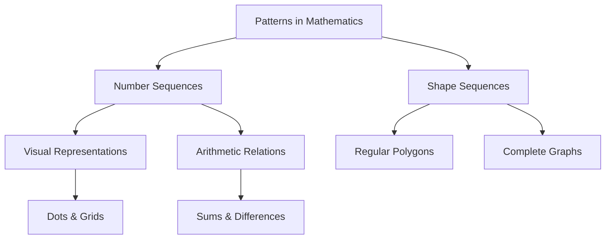

<<<FILE_START: index.mdx>>>
---
title: "Patterns in Mathematics"
description: "An introduction to mathematics as the science of patterns, covering number sequences, visual representations, and geometric relationships."
date: 2024-04-10
tags: ["mathematics", "patterns", "grade-6", "sequences"]
order: 1
draft: false
---

import Callout from '@/components/Callout.astro'

## Introduction

Mathematics is, in large part, the search for patterns and the explanation of why those patterns exist. These patterns are found everywhere—in nature, in the motion of planets, in our homes, and even in the technology we use daily.

Mathematicians view mathematics as both an art and a science. The goal is not just to discover a pattern (like a sequence of numbers) but to understand the *reason* it exists. This understanding often leads to breakthroughs in science, such as the theory of gravitation or the curing of diseases.

### Key Topics in this Chapter

1.  **Patterns in Numbers:** Exploring sequences like whole numbers, odd/even numbers, and special sequences like triangular and square numbers.
2.  **Visualising Sequences:** Using dots and shapes to represent numbers, helping us "see" the math.
3.  **Relations among Sequences:** Discovering how adding odd numbers creates squares, or how counting up and down relates to square numbers.
4.  **Patterns in Shapes:** Analyzing geometric sequences like Regular Polygons and Complete Graphs.

<Callout variant="tip">
**Definition:** The branch of Mathematics that studies patterns in whole numbers is called **Number Theory**. The branch that studies patterns in shapes is called **Geometry**.
</Callout>

### Quick Reference: Common Sequences

| Sequence Name | First Few Terms | Rule (Informal) |
| :--- | :--- | :--- |
| **Counting Numbers** | $1, 2, 3, 4, 5, \dots$ | Add 1 |
| **Odd Numbers** | $1, 3, 5, 7, 9, \dots$ | Add 2 (starting at 1) |
| **Even Numbers** | $2, 4, 6, 8, 10, \dots$ | Add 2 (starting at 2) |
| **Triangular Numbers** | $1, 3, 6, 10, 15, \dots$ | Sum of first $n$ counting numbers |
| **Square Numbers** | $1, 4, 9, 16, 25, \dots$ | $n \times n$ |
| **Powers of 2** | $1, 2, 4, 8, 16, \dots$ | Multiply previous term by 2 |

<<<FILE_END>>>

<<<FILE_START: topics/01-patterns-in-numbers.mdx>>>
---
title: "Patterns in Numbers"
description: "Exploring basic number sequences including odd, even, triangular, square, and Virahanka numbers."
date: 2024-04-10
tags: ["number-theory", "sequences", "fibonacci"]
order: 2
draft: false
---

import Callout from '@/components/Callout.astro'

## Number Sequences

Among the most basic patterns in mathematics are **number sequences**. A sequence is simply a list of numbers that follow a specific rule.

The most fundamental sequence is the set of **Whole Numbers**:
$$ 0, 1, 2, 3, 4, \dots $$

### Key Number Sequences

Table 1 lists some of the most important sequences studied in mathematics.

| Sequence Name | Terms | Pattern / Rule |
| :--- | :--- | :--- |
| **All 1's** | $1, 1, 1, 1, 1, \dots$ | Constant value. |
| **Counting Numbers** | $1, 2, 3, 4, 5, 6, 7, \dots$ | Increasing by 1. |
| **Odd Numbers** | $1, 3, 5, 7, 9, 11, 13, \dots$ | Numbers not divisible by 2. |
| **Even Numbers** | $2, 4, 6, 8, 10, 12, 14, \dots$ | Numbers divisible by 2. |
| **Triangular Numbers** | $1, 3, 6, 10, 15, 21, 28, \dots$ | Numbers that can form a triangle. |
| **Square Numbers** | $1, 4, 9, 16, 25, 36, 49, \dots$ | Numbers that can form a square ($n^2$). |
| **Cubes** | $1, 8, 27, 64, 125, 216, \dots$ | Numbers formed by $n^3$. |
| **Virahānka Numbers** | $1, 2, 3, 5, 8, 13, 21, \dots$ | Each number is the sum of the previous two (often called Fibonacci). |
| **Powers of 2** | $1, 2, 4, 8, 16, 32, 64, \dots$ | Doubling the previous number. |
| **Powers of 3** | $1, 3, 9, 27, 81, 243, \dots$ | Tripling the previous number. |

<Callout variant="tip">
**Did You Know?**
The **Virahānka numbers** (1, 2, 3, 5, 8...) are widely known as Fibonacci numbers in the West, but they were described earlier by Indian mathematician Virahānka in the context of analyzing poetic meters.
</Callout>

### Recognizing Rules
To find the rule of a sequence, look at the difference between consecutive terms or the ratio between them.

*   **Linear Growth:** If the difference is constant (e.g., Counting Numbers $+1$, Odd Numbers $+2$).
*   **Exponential Growth:** If the ratio is constant (e.g., Powers of 2 $\times 2$).
*   **Geometric Growth:** Sequences like Square numbers grow based on the size of the shape they represent.

$$
\text{Square Number (n)} = n \times n = n^2
$$
$$
\text{Cube Number (n)} = n \times n \times n = n^3
$$
<<<FILE_END>>>

<<<FILE_START: topics/02-visualising-sequences.mdx>>>
---
title: "Visualising Number Sequences"
description: "Using dot diagrams to represent triangular, square, and hexagonal numbers."
date: 2024-04-10
tags: ["visual-math", "triangular-numbers", "square-numbers"]
order: 3
draft: false
---

import Callout from '@/components/Callout.astro'

## Pictorial Representations

Many number sequences can be understood better by visualizing them as shapes made of dots. This connects **Arithmetic** (numbers) with **Geometry** (shapes).

### Triangular Numbers
Numbers that can be arranged in a perfect triangle.
Sequence: **1, 3, 6, 10, 15...**

  <svg width="400" height="150" viewBox="0 0 400 150" xmlns="http://www.w3.org/2000/svg">
    <!-- T1 = 1 -->
    <text x="30" y="120" font-family="sans-serif" font-size="14" fill="currentColor" text-anchor="middle">1</text>
    <circle cx="30" cy="80" r="5" fill="currentColor" />

    <!-- T2 = 3 -->
    <text x="100" y="120" font-family="sans-serif" font-size="14" fill="currentColor" text-anchor="middle">3</text>
    <circle cx="100" cy="65" r="5" fill="currentColor" />
    <circle cx="90" cy="85" r="5" fill="currentColor" />
    <circle cx="110" cy="85" r="5" fill="currentColor" />

    <!-- T3 = 6 -->
    <text x="180" y="120" font-family="sans-serif" font-size="14" fill="currentColor" text-anchor="middle">6</text>
    <circle cx="180" cy="50" r="5" fill="currentColor" />
    <circle cx="170" cy="70" r="5" fill="currentColor" />
    <circle cx="190" cy="70" r="5" fill="currentColor" />
    <circle cx="160" cy="90" r="5" fill="currentColor" />
    <circle cx="180" cy="90" r="5" fill="currentColor" />
    <circle cx="200" cy="90" r="5" fill="currentColor" />

    <!-- T4 = 10 -->
    <text x="280" y="120" font-family="sans-serif" font-size="14" fill="currentColor" text-anchor="middle">10</text>
    <circle cx="280" cy="35" r="5" fill="currentColor" />
    <circle cx="270" cy="55" r="5" fill="currentColor" />
    <circle cx="290" cy="55" r="5" fill="currentColor" />
    <circle cx="260" cy="75" r="5" fill="currentColor" />
    <circle cx="280" cy="75" r="5" fill="currentColor" />
    <circle cx="300" cy="75" r="5" fill="currentColor" />
    <circle cx="250" cy="95" r="5" fill="currentColor" />
    <circle cx="270" cy="95" r="5" fill="currentColor" />
    <circle cx="290" cy="95" r="5" fill="currentColor" />
    <circle cx="310" cy="95" r="5" fill="currentColor" />
  </svg>

### Square Numbers
Numbers that can be arranged in a perfect square grid.
Sequence: **1, 4, 9, 16, 25...**

  <svg width="400" height="150" viewBox="0 0 400 150" xmlns="http://www.w3.org/2000/svg">
    <!-- S1 = 1 -->
    <text x="40" y="130" font-family="sans-serif" font-size="14" fill="currentColor" text-anchor="middle">1</text>
    <circle cx="40" cy="80" r="5" fill="currentColor" />

    <!-- S2 = 4 -->
    <text x="120" y="130" font-family="sans-serif" font-size="14" fill="currentColor" text-anchor="middle">4</text>
    <g fill="currentColor">
        <circle cx="110" cy="70" r="5"/> <circle cx="130" cy="70" r="5"/>
        <circle cx="110" cy="90" r="5"/> <circle cx="130" cy="90" r="5"/>
    </g>

    <!-- S3 = 9 -->
    <text x="220" y="130" font-family="sans-serif" font-size="14" fill="currentColor" text-anchor="middle">9</text>
    <g fill="currentColor">
        <circle cx="200" cy="60" r="5"/> <circle cx="220" cy="60" r="5"/> <circle cx="240" cy="60" r="5"/>
        <circle cx="200" cy="80" r="5"/> <circle cx="220" cy="80" r="5"/> <circle cx="240" cy="80" r="5"/>
        <circle cx="200" cy="100" r="5"/> <circle cx="220" cy="100" r="5"/> <circle cx="240" cy="100" r="5"/>
    </g>
  </svg>

### Hexagonal Numbers
A **Hexagonal Number** represents the number of distinct dots in a pattern of hexagons consisting of a central point and successive hexagonal layers.
Sequence: **1, 7, 19, 37...**

The rule for generating hexagonal numbers involves adding multiples of 6:
*   $1$
*   $1 + 6 = 7$
*   $7 + 12 = 19$
*   $19 + 18 = 37$

<Callout variant="tip">
**Connection:** Notice that **36** is both a triangular number and a square number ($6 \times 6$). This means 36 dots can be arranged perfectly into a triangle AND a square.
</Callout>
<<<FILE_END>>>

<<<FILE_START: topics/03-sequence-relations.mdx>>>
---
title: "Relations Among Sequences"
description: "Discovering how adding odd numbers creates squares and other beautiful mathematical relationships."
date: 2024-04-10
tags: ["odd-numbers", "square-numbers", "summation"]
order: 4
draft: false
---

import Callout from '@/components/Callout.astro'

## Surprising Relationships

Number sequences are often related to each other. One of the most famous examples is the relationship between **Odd Numbers** and **Square Numbers**.

### Adding Odd Numbers
What happens when we add consecutive odd numbers starting from 1?

$$
\begin{aligned}
1 &= 1 &= 1^2 \\
1 + 3 &= 4 &= 2^2 \\
1 + 3 + 5 &= 9 &= 3^2 \\
1 + 3 + 5 + 7 &= 16 &= 4^2 \\
1 + 3 + 5 + 7 + 9 &= 25 &= 5^2
\end{aligned}
$$

**Conclusion:** The sum of the first $n$ odd numbers is equal to the $n$-th square number ($n^2$).

#### Visual Proof
We can visualize this by taking a square grid and "peeling" off L-shaped layers. Each layer contains an odd number of dots.

  <svg width="200" height="200" viewBox="0 0 200 200" xmlns="http://www.w3.org/2000/svg">
    <!-- Grid of 16 dots (4x4) -->
    <!-- 1st Odd (1) - Top Left - Red -->
    <circle cx="50" cy="50" r="8" fill="#e63946" />
    
    <!-- 2nd Odd (3) - Blue -->
    <circle cx="80" cy="50" r="8" fill="#457b9d" />
    <circle cx="80" cy="80" r="8" fill="#457b9d" />
    <circle cx="50" cy="80" r="8" fill="#457b9d" />

    <!-- 3rd Odd (5) - Green -->
    <circle cx="110" cy="50" r="8" fill="#2a9d8f" />
    <circle cx="110" cy="80" r="8" fill="#2a9d8f" />
    <circle cx="110" cy="110" r="8" fill="#2a9d8f" />
    <circle cx="80" cy="110" r="8" fill="#2a9d8f" />
    <circle cx="50" cy="110" r="8" fill="#2a9d8f" />

    <!-- 4th Odd (7) - Orange -->
    <circle cx="140" cy="50" r="8" fill="#e9c46a" />
    <circle cx="140" cy="80" r="8" fill="#e9c46a" />
    <circle cx="140" cy="110" r="8" fill="#e9c46a" />
    <circle cx="140" cy="140" r="8" fill="#e9c46a" />
    <circle cx="110" cy="140" r="8" fill="#e9c46a" />
    <circle cx="80" cy="140" r="8" fill="#e9c46a" />
    <circle cx="50" cy="140" r="8" fill="#e9c46a" />
  </svg>

### Adding Up and Down
Another way to generate square numbers is by adding counting numbers up to a peak and then back down to 1.

$$
\begin{aligned}
1 &= 1 &= 1^2 \\
1 + 2 + 1 &= 4 &= 2^2 \\
1 + 2 + 3 + 2 + 1 &= 9 &= 3^2 \\
1 + 2 + 3 + 4 + 3 + 2 + 1 &= 16 &= 4^2
\end{aligned}
$$

This visualizes the square tilted on its corner, or "stacked" diagonally.
<<<FILE_END>>>

<<<FILE_START: topics/04-patterns-in-shapes.mdx>>>
---
title: "Patterns in Shapes"
description: "Investigating sequences in geometry, including Regular Polygons, Complete Graphs, and the Koch Snowflake."
date: 2024-04-10
tags: ["geometry", "polygons", "fractals"]
order: 5
draft: false
---

import Callout from '@/components/Callout.astro'

## Shape Sequences

Just as we have patterns in numbers, we have patterns in shapes. This is the foundation of **Geometry**.

### 1. Regular Polygons
A **regular polygon** is a shape with equal-length sides and equal angles. The sequence starts with 3 sides.

| Sides | Name |
| :--- | :--- |
| 3 | Equilateral Triangle |
| 4 | Square |
| 5 | Regular Pentagon |
| 6 | Regular Hexagon |
| 7 | Regular Heptagon |

The number of sides follows the **Counting Numbers** sequence starting at 3 ($3, 4, 5, 6, \dots$). The number of corners (vertices) follows the exact same sequence.

  <svg width="400" height="120" viewBox="0 0 400 120" xmlns="http://www.w3.org/2000/svg" stroke="currentColor" fill="none" stroke-width="2">
    <!-- Triangle -->
    <polygon points="50,20 20,80 80,80" />
    <text x="50" y="105" stroke="none" fill="currentColor" text-anchor="middle" font-size="12">Triangle (3)</text>

    <!-- Square -->
    <rect x="130" y="30" width="50" height="50" />
    <text x="155" y="105" stroke="none" fill="currentColor" text-anchor="middle" font-size="12">Square (4)</text>

    <!-- Pentagon -->
    <polygon points="250,20 220,45 230,80 270,80 280,45" />
    <text x="250" y="105" stroke="none" fill="currentColor" text-anchor="middle" font-size="12">Pentagon (5)</text>
  </svg>

### 2. Complete Graphs
A **Complete Graph** is a shape where every corner is connected to every other corner by a line.
*   **K2 (2 points):** 1 line.
*   **K3 (3 points):** 3 lines (Triangle).
*   **K4 (4 points):** 6 lines (Square with X inside).
*   **K5 (5 points):** 10 lines (Pentagon with star inside).

The sequence of the *number of lines* in Complete Graphs is: **1, 3, 6, 10, 15...**
<Callout variant="tip">
**Pattern Alert:** This is the **Triangular Number** sequence!
</Callout>

### 3. Koch Snowflake
The Koch Snowflake is a fractal pattern. You start with a triangle and repeatedly add smaller triangles to the middle of every side.
*   The boundary gets more complex with each step.
*   The number of line segments grows rapidly: **3, 12, 48, 192...**
*   This sequence is $3 \times$ **Powers of 4**.
<<<FILE_END>>>

<<<FILE_START: solutions/ex-1.1.mdx>>>
---
title: "Solution: Figure It Out 1.1"
description: "Real world applications of mathematics."
date: 2024-04-10
tags: ["solutions", "application"]
order: 10
draft: false
---

import Callout from '@/components/Callout.astro'

## Section 1.1: What is Mathematics?

**Q1. Can you think of other examples where mathematics helps us in our everyday lives?**

**Answer:**
Mathematics is involved in almost every activity:
1.  **Shopping:** Calculating total costs, discounts, and change.
2.  **Cooking:** Measuring ingredients (fractions/ratios) and setting timers.
3.  **Travel:** Estimating time of arrival based on speed and distance.
4.  **Construction:** Designing layouts for homes and calculating areas for painting or flooring.

**Q2. How has mathematics helped propel humanity forward?**

**Answer:**
Mathematics provides the framework for scientific and technological advancement:
*   **Space Exploration:** Calculating trajectories for rockets to reach the Moon and Mars.
*   **Medicine:** Analyzing patterns in genomes to cure diseases.
*   **Technology:** Algorithms that run computers, smartphones, and the internet.
*   **Engineering:** Designing safe bridges, airplanes, and skyscrapers.
<<<FILE_END>>>

<<<FILE_START: solutions/ex-1.2.mdx>>>
---
title: "Solution: Figure It Out 1.2"
description: "Recognizing number sequences in Table 1."
date: 2024-04-10
tags: ["solutions", "number-patterns"]
order: 11
draft: false
---

import Callout from '@/components/Callout.astro'

## Section 1.2: Patterns in Numbers

**Q1. Can you recognise the pattern in each of the sequences in Table 1?**

**Answer:**
Yes, here are the patterns:
*   **Powers of 2:** $1, 2, 4, 8, 16 \dots$ (Multiply previous number by 2).
*   **Powers of 3:** $1, 3, 9, 27, 81 \dots$ (Multiply previous number by 3).
*   **Virahanka Numbers:** $1, 2, 3, 5, 8 \dots$ (Add the previous two numbers: $1+2=3, 2+3=5$).

**Q2. Rewrite each sequence of Table 1 in your notebook, along with the next three numbers.**

**Answer:**
1.  **All 1's:** $1, 1, 1, \dots$ **Next: 1, 1, 1** (Rule: Constant 1).
2.  **Counting:** $1, 2, 3, 4, 5, 6, 7, \dots$ **Next: 8, 9, 10** (Rule: Add 1).
3.  **Odd:** $1, 3, 5, 7, 9, 11, 13, \dots$ **Next: 15, 17, 19** (Rule: Add 2).
4.  **Even:** $2, 4, 6, 8, 10, 12, 14, \dots$ **Next: 16, 18, 20** (Rule: Add 2).
5.  **Triangular:** $1, 3, 6, 10, 15, 21, 28, \dots$ **Next: 36, 45, 55** (Rule: Add increasing counting numbers $+8, +9, +10$).
6.  **Squares:** $1, 4, 9, 16, 25, 36, 49, \dots$ **Next: 64, 81, 100** (Rule: $8^2, 9^2, 10^2$).
7.  **Cubes:** $1, 8, 27, 64, 125, 216, \dots$ **Next: 343, 512, 729** (Rule: $7^3, 8^3, 9^3$).
<<<FILE_END>>>

<<<FILE_START: solutions/ex-1.3.mdx>>>
---
title: "Solution: Figure It Out 1.3"
description: "Visual patterns: Triangles, Squares, and Hexagons."
date: 2024-04-10
tags: ["solutions", "visual-math"]
order: 12
draft: false
---

import Callout from '@/components/Callout.astro'

## Section 1.3: Visualising Number Sequences

**Q2. Why are 1, 3, 6, 10... called triangular numbers? Why are 1, 4, 9... called square numbers? Why are 1, 8, 27... called cubes?**

**Answer:**
*   They are called **Triangular Numbers** because that specific number of dots can be arranged to form a perfect equilateral triangle.
*   They are called **Square Numbers** because the dots can form a perfect square grid with equal rows and columns.
*   They are called **Cubes** because unit blocks of that quantity can form a solid 3D cube ($2\times2\times2=8$, etc.).

**Q3. You will have noticed that 36 is both a triangular number and a square number!**

**Answer:**
*   **As a Square:** $6 \times 6 = 36$.
*   **As a Triangle:** Sum of $1 + 2 + 3 + 4 + 5 + 6 + 7 + 8 = 36$.

**Q4. What would you call the following sequence of numbers: 1, 7, 19, 37...?**

**Answer:**
These are called **Hexagonal Numbers**.
*   **Next Number:** The pattern of differences is multiples of 6 ($+6, +12, +18$). The next difference is $+24$.
*   $37 + 24 = \mathbf{61}$.

**Q5. Can you think of pictorial ways to visualise the sequence of Powers of 2? Powers of 3?**

**Answer:**
*   **Powers of 2 ($1, 2, 4, 8$):** Can be visualized as a line branching into 2, then those branching into 2 (Binary Tree), or identifying dimensions (Point, Line, Square, Cube corners).
*   **Powers of 3 ($1, 3, 9, 27$):** Can be visualized as a triangle splitting into 3 smaller triangles, or a tree where every branch splits into three.
<<<FILE_END>>>

<<<FILE_START: solutions/ex-1.4.mdx>>>
---
title: "Solution: Figure It Out 1.4"
description: "Relations among number sequences."
date: 2024-04-10
tags: ["solutions", "arithmetic"]
order: 13
draft: false
---

import Callout from '@/components/Callout.astro'

## Section 1.4: Relations among Number Sequences

**Q1. Can you find a similar pictorial explanation for why adding counting numbers up and down (1 + 2 + 1 = 4) gives square numbers?**

**Answer:**
Yes. Imagine a square grid rotated 45 degrees (like a diamond).
*   The top row has 1 dot.
*   The next row has 2 dots.
*   The middle (widest) row has $n$ dots.
*   The rows then decrease back to 1.
Counting the dots row by row gives the sequence $1 + 2 + \dots + n + \dots + 2 + 1$, which forms the complete square $n^2$.

**Q2. What is the value of 1 + 2 + ... + 99 + 100 + 99 + ... + 1?**

**Answer:**
This follows the "Up and Down" pattern which equals the square of the middle (peak) number.
Here, the peak is 100.
$$ \text{Sum} = 100 \times 100 = \mathbf{10,000} $$

**Q3. Which sequence do you get when you start to add the All 1's sequence up?**

**Answer:**
*   $1$
*   $1 + 1 = 2$
*   $1 + 1 + 1 = 3$
*   You get the **Counting Numbers** ($1, 2, 3, 4\dots$).

**Q4. Which sequence do you get when you start to add the Counting numbers up?**

**Answer:**
*   $1$
*   $1 + 2 = 3$
*   $1 + 2 + 3 = 6$
*   $1 + 2 + 3 + 4 = 10$
*   You get the **Triangular Numbers** ($1, 3, 6, 10\dots$).

**Q5. What happens when you add up pairs of consecutive triangular numbers? (e.g., 1+3, 3+6...)**

**Answer:**
*   $1 + 3 = 4$
*   $3 + 6 = 9$
*   $6 + 10 = 16$
*   $10 + 15 = 25$
*   You get the **Square Numbers** ($4, 9, 16, 25\dots$).
*   **Why?** Two triangles can be fitted together to form a square.

**Q8. What happens when you start to add up hexagonal numbers (1, 1+7, 1+7+19...)?**

**Answer:**
*   $1 = 1 = 1^3$
*   $1 + 7 = 8 = 2^3$
*   $1 + 7 + 19 = 27 = 3^3$
*   $1 + 7 + 19 + 37 = 64 = 4^3$
*   You get the **Cube Numbers** ($1, 8, 27, 64\dots$).
<<<FILE_END>>>

<<<FILE_START: solutions/ex-1.5.mdx>>>
---
title: "Solution: Figure It Out 1.5"
description: "Patterns in Table 3 Shape Sequences."
date: 2024-04-10
tags: ["solutions", "geometry"]
order: 14
draft: false
---

import Callout from '@/components/Callout.astro'

## Section 1.5: Patterns in Shapes

**Q1. Can you recognise the pattern in each of the sequences in Table 3?**

**Answer:**
1.  **Regular Polygons:**
    *   Sequence of Sides: $3, 4, 5, 6, 7 \dots$ (Counting numbers starting at 3).
2.  **Complete Graphs:**
    *   Sequence of Lines: $1, 3, 6, 10, 15 \dots$ (Triangular numbers).
3.  **Stacked Squares:**
    *   Sequence of small squares: $1, 4, 9, 16 \dots$ (Square numbers).
4.  **Stacked Triangles:**
    *   Sequence of small triangles: $1, 4, 9, 16 \dots$ (Square numbers).
5.  **Koch Snowflake:**
    *   Sequence of sides: $3, 12, 48 \dots$ ($3 \times 4^n$).

**Q2. Try and redraw each sequence... Can you draw the next shape?**

**Answer:**
*   **Regular Polygons:** The next shape is a **Regular Hendecagon** (11 sides).
*   **Complete Graphs:** The next graph is **K6** (6 points). It will have 15 lines.
<<<FILE_END>>>

<<<FILE_START: solutions/ex-1.6.mdx>>>
---
title: "Solution: Figure It Out 1.6"
description: "Relations between shapes and numbers."
date: 2024-04-10
tags: ["solutions", "geometry-algebra"]
order: 15
draft: false
---

import Callout from '@/components/Callout.astro'

## Section 1.6: Relation to Number Sequences

**Q1. Count the number of sides and corners in Regular Polygons.**

**Answer:**
*   **Sides:** $3, 4, 5, 6, 7, 8, 9, 10 \dots$
*   **Corners:** $3, 4, 5, 6, 7, 8, 9, 10 \dots$
*   **Conclusion:** In any closed polygon, Number of Sides = Number of Corners.

**Q2. Count the number of lines in Complete Graphs.**

**Answer:**
*   The sequence is **1, 3, 6, 10, 15...**
*   This is the **Triangular Number** sequence.
*   **Why?** To draw a complete graph with $n$ points, each new point connects to all previous points. When you add the 3rd point, you draw 2 new lines. When you add the 4th point, you draw 3 new lines. This is adding counting numbers ($1 + 2 + 3 + \dots$).

**Q3. How many little squares are in the Stacked Squares sequence?**

**Answer:**
*   Sequence: **1, 4, 9, 16, 25...**
*   This is the **Square Number** sequence.

**Q4. How many little triangles are in the Stacked Triangles sequence?**

**Answer:**
*   Sequence: **1, 4, 9, 16, 25...**
*   This is also the **Square Number** sequence!
*   **Explanation:** In row 1, there is 1 triangle. In row 2, there are 3 triangles. In row 3, there are 5. Summing these rows ($1 + 3 + 5$) is the "Sum of Odd Numbers" rule, which creates Square Numbers.

**Q5. How many total line segments are there in each shape of the Koch Snowflake?**

**Answer:**
*   **Shape 1 (Triangle):** 3 segments.
*   **Shape 2:** Each of the 3 segments gets a "bump", turning 1 segment into 4. Total = $3 \times 4 = 12$.
*   **Shape 3:** Each of the 12 segments turns into 4. Total = $12 \times 4 = 48$.
*   **Sequence:** $3, 12, 48, 192, 768 \dots$
<<<FILE_END>>>

<<<FILE_START: practice/solved-examples.mdx>>>
---
title: "Solved Examples & Key Concepts"
description: "Additional examples clarifying the relations between number sequences."
date: 2024-04-10
tags: ["practice", "examples"]
order: 20
draft: false
---

import Callout from '@/components/Callout.astro'

## Example 1: The "Handshake" Problem (Complete Graphs)

**Question:** If 5 people meet in a room and everyone shakes hands with everyone else exactly once, how many handshakes happen?

**Solution:**
This is identical to the "Complete Graph" problem with 5 points ($K_5$).
1.  Person A shakes hands with 4 others.
2.  Person B shakes hands with 3 others (excluding A, already done).
3.  Person C shakes hands with 2 others.
4.  Person D shakes hands with 1 other.
5.  Person E has no new people to shake hands with.

Total = $4 + 3 + 2 + 1 = 10$.
This is the 4th **Triangular Number**.

## Example 2: Hexagonal Numbers Logic

**Question:** What is the rule for forming Hexagonal Numbers: 1, 7, 19, 37...?

**Solution:**
Let's look at the difference between consecutive terms:
*   $7 - 1 = 6$
*   $19 - 7 = 12$
*   $37 - 19 = 18$

The differences are multiples of 6 ($6 \times 1, 6 \times 2, 6 \times 3$).
To find the next number:
1.  Next difference will be $6 \times 4 = 24$.
2.  Add this to the last number: $37 + 24 = 61$.

## Example 3: Powers of 2

**Question:** Why does adding the sequence of Powers of 2 (starting from 1) almost give the next power of 2?

$$
\begin{aligned}
1 &= 1 & (\text{which is } 2^1 - 1) \\
1 + 2 &= 3 & (\text{which is } 2^2 - 1) \\
1 + 2 + 4 &= 7 & (\text{which is } 2^3 - 1) \\
1 + 2 + 4 + 8 &= 15 & (\text{which is } 2^4 - 1)
\end{aligned}
$$

**Concept:** The sum of powers of 2 up to $2^n$ is always one less than the next power ($2^{n+1} - 1$).
<<<FILE_END>>>
