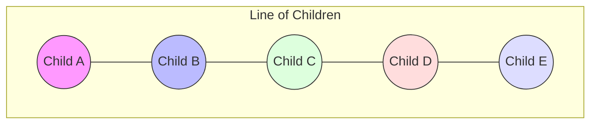
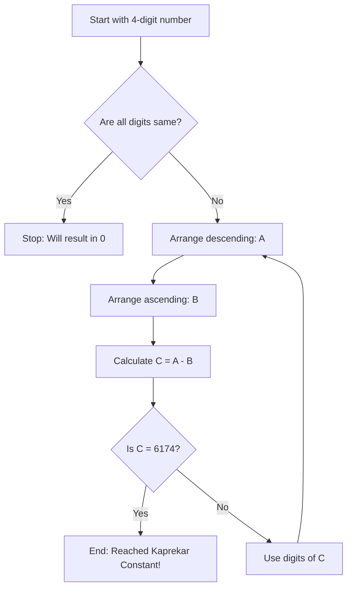
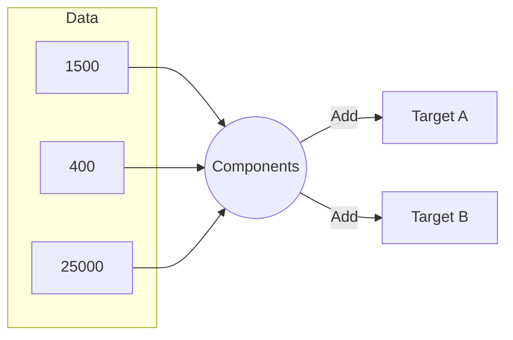

<<<FILE_START: index.mdx>>>
---
title: "Number Play"
description: "Explore patterns, puzzles, and the magic hidden within numbers. From palindromes to the Kaprekar constant, discover how numbers organize our world."
date: 2024-04-10
tags: ["grade-6", "math", "number-play", "patterns", "logic"]
order: 1
draft: false
---

import Callout from '@/components/Callout.astro'

# Number Play

Numbers are more than just tools for counting; they are the building blocks of logic, patterns, and games. In this chapter, we move beyond basic operations (addition, subtraction, multiplication, division) to explore the playful side of mathematics. We will investigate number patterns, visual puzzles, winning strategies for games, and unsolved mysteries like the Collatz Conjecture.

## Chapter Overview

This chapter covers the following key concepts:

1.  **Logic & Context**: How numbers convey information based on arrangement (e.g., height order).
2.  **Supercells**: A grid-based logic puzzle involving comparing neighbors.
3.  **Number Line Patterns**: Visualizing sequences and placement.
4.  **Digit Mysteries**: Digit sums, palindromes, and the magic 6174 (Kaprekar's Constant).
5.  **Clock & Calendar**: finding patterns in time and dates.
6.  **Mental Math**: Strategies for decomposing numbers.
7.  **Unsolved Problems**: Introduction to the Collatz Conjecture ($3n+1$).
8.  **Estimation**: Making reasonable guesses in real-life scenarios.
9.  **Game Theory**: Winning strategies for number games (e.g., Game of 21).

<Callout variant="tip">
**Math Talk:** Throughout this chapter, look for opportunities to discuss your reasoning with classmates. Many problems here have multiple ways to solve them!
</Callout>

## Formula & Concept Sheet

| Concept | Description | Example |
| :--- | :--- | :--- |
| **Palindrome** | A number that reads the same forwards and backwards. | $121, 747, 5005$ |
| **Digit Sum** | Adding the individual digits of a number repeatedly or once. | Sum of digits in $14$: $1+4=5$ |
| **Kaprekar's Constant** | The number $6174$. Reached by 4-digit numbers (with at least 2 distinct digits) via a specific subtraction process. | $8632 \to 6174$ |
| **Collatz Rule** | If even: divide by 2. If odd: multiply by 3 and add 1. | $5 \to 16 \to 8 \to 4 \to 2 \to 1$ |
| **Supercell** | A cell in a grid containing a number strictly greater than all its immediate neighbors. | In a row `5, 9, 3`, `9` is a supercell. |

Let's begin playing with numbers!
<<<FILE_END>>>

<<<FILE_START: topics/01-numbers-tell-stories.mdx>>>
---
title: "Numbers Can Tell Us Things"
description: "Understanding how numbers represent relative information, such as height order in a line."
date: 2024-04-10
tags: ["logic", "reasoning"]
order: 2
draft: false
---

import Callout from '@/components/Callout.astro'

## What are numbers telling us?

Sometimes numbers don't just count objects; they describe a relationship. Consider a game played by children standing in a line.

### The Rules
Imagine children standing in a line. Each child looks at their immediate neighbors (left and right).
-   Say **'1'** if there is **only one** taller child standing next to them.
-   Say **'2'** if **both** children standing next to them are taller.
-   Say **'0'** if **neither** of the children standing next to them are taller (i.e., the speaker is taller than both neighbors).

<Callout variant="info">
**Note:** Children at the ends of the line only have one neighbor. If that neighbor is taller, they say '1'. If that neighbor is shorter, they say '0'. They can never say '2'.
</Callout>

### Visualizing the Logic

Let's analyze a scenario with 5 children. We represent their heights visually.

If we assign heights:
1.  **Child A (Short)** - Neighbor B is Taller $\rightarrow$ Says **1**
2.  **Child B (Tall)** - Neighbors A and C are Shorter $\rightarrow$ Says **0**
3.  **Child C (Short)** - Neighbors B and D are Taller $\rightarrow$ Says **2**
4.  **Child D (Tall)** - Neighbors C and E are Shorter $\rightarrow$ Says **0**
5.  **Child E (Short)** - Neighbor D is Taller $\rightarrow$ Says **1**

The sequence would be: **1, 0, 2, 0, 1**.

This activity teaches us that numbers can encode **local geometry** or **ordering** information.
<<<FILE_END>>>

<<<FILE_START: topics/02-supercells.mdx>>>
---
title: "Supercells"
description: "A logic puzzle involving grids and comparing numbers to their neighbors."
date: 2024-04-10
tags: ["grids", "logic", "puzzles"]
order: 3
draft: false
---

import Callout from '@/components/Callout.astro'

## What is a Supercell?

In a grid of numbers, a cell is called a **Supercell** (or is "coloured") if the number inside it is **larger** than numbers in all adjacent cells.

-   **1D (Row) Case:** Check left and right.
-   **2D (Grid) Case:** Check top, bottom, left, and right.

### Example

Consider the following row:
$$ 200 \quad 577 \quad 626 \quad 345 \quad 790 \quad 694 \quad 109 \quad 198 $$

Let's check specific numbers:
1.  **626**: Neighbors are $577$ and $345$. Since $626 > 577$ AND $626 > 345$, **626 is a Supercell**.
2.  **200**: Neighbor is $577$. $200 < 577$. Not a Supercell.
3.  **198** (End): Neighbor is $109$. $198 > 109$. **198 is a Supercell**.

### Visualizing Supercells in 2D

In the grid below, Green cells represent Supercells.

  <svg width="300" height="200" viewBox="0 0 300 200" xmlns="http://www.w3.org/2000/svg">
    <!-- Row 1 -->
    <rect x="10" y="10" width="60" height="40" fill="none" stroke="currentColor" stroke-width="2"/>
    <text x="40" y="35" font-family="Arial" font-size="14" fill="currentColor" text-anchor="middle">2430</text>

    <rect x="80" y="10" width="60" height="40" fill="#90EE90" stroke="currentColor" stroke-width="2"/>
    <text x="110" y="35" font-family="Arial" font-size="14" fill="black" text-anchor="middle">7500</text>

    <rect x="150" y="10" width="60" height="40" fill="none" stroke="currentColor" stroke-width="2"/>
    <text x="180" y="35" font-family="Arial" font-size="14" fill="currentColor" text-anchor="middle">7350</text>

    <rect x="220" y="10" width="60" height="40" fill="#90EE90" stroke="currentColor" stroke-width="2"/>
    <text x="250" y="35" font-family="Arial" font-size="14" fill="black" text-anchor="middle">9870</text>

    <!-- Row 2 -->
    <rect x="10" y="60" width="60" height="40" fill="none" stroke="currentColor" stroke-width="2"/>
    <text x="40" y="85" font-family="Arial" font-size="14" fill="currentColor" text-anchor="middle">3115</text>

    <rect x="80" y="60" width="60" height="40" fill="none" stroke="currentColor" stroke-width="2"/>
    <text x="110" y="85" font-family="Arial" font-size="14" fill="currentColor" text-anchor="middle">4795</text>

    <rect x="150" y="60" width="60" height="40" fill="none" stroke="currentColor" stroke-width="2"/>
    <text x="180" y="85" font-family="Arial" font-size="14" fill="currentColor" text-anchor="middle">9124</text>

    <rect x="220" y="60" width="60" height="40" fill="none" stroke="currentColor" stroke-width="2"/>
    <text x="250" y="85" font-family="Arial" font-size="14" fill="currentColor" text-anchor="middle">9230</text>

    <!-- Row 3 -->
    <rect x="10" y="110" width="60" height="40" fill="none" stroke="currentColor" stroke-width="2"/>
    <text x="40" y="135" font-family="Arial" font-size="14" fill="currentColor" text-anchor="middle">4580</text>

    <rect x="80" y="110" width="60" height="40" fill="#90EE90" stroke="currentColor" stroke-width="2"/>
    <text x="110" y="135" font-family="Arial" font-size="14" fill="black" text-anchor="middle">8632</text>

    <rect x="150" y="110" width="60" height="40" fill="none" stroke="currentColor" stroke-width="2"/>
    <text x="180" y="135" font-family="Arial" font-size="14" fill="currentColor" text-anchor="middle">8280</text>

    <rect x="220" y="110" width="60" height="40" fill="none" stroke="currentColor" stroke-width="2"/>
    <text x="250" y="135" font-family="Arial" font-size="14" fill="currentColor" text-anchor="middle">3446</text>
  </svg>

<Callout variant="tip">
**Strategy:** To create many supercells, you need to alternate small and large numbers (like a checkerboard pattern of peaks and valleys).
</Callout>
<<<FILE_END>>>

<<<FILE_START: topics/03-number-line-patterns.mdx>>>
---
title: "Patterns on the Number Line"
description: "Identifying and placing large numbers on a number line."
date: 2024-04-10
tags: ["number-line", "geometry"]
order: 4
draft: false
---

import Callout from '@/components/Callout.astro'

## Locating Numbers

Placing numbers on a number line helps us understand their magnitude relative to one another.

### Example Sequence
Consider the numbers: $2180, 2754, 1500, 3600, 9950, 9590, 1050, 3050, 5030, 5300, 8400$.

When drawing a number line from $1000$ to $10,000$, we look for benchmarks (like multiples of 1000).

  <svg width="600" height="100" viewBox="0 0 600 100" xmlns="http://www.w3.org/2000/svg">
    <!-- Main Line -->
    <line x1="50" y1="50" x2="550" y2="50" stroke="currentColor" stroke-width="2" marker-end="url(#arrow)" marker-start="url(#arrow)"/>

    <!-- Ticks -->
    <line x1="50" y1="45" x2="50" y2="55" stroke="currentColor" stroke-width="2"/>
    <text x="50" y="70" font-size="10" text-anchor="middle" fill="currentColor">1000</text>

    <line x1="100" y1="45" x2="100" y2="55" stroke="currentColor" stroke-width="2"/>
    <text x="100" y="70" font-size="10" text-anchor="middle" fill="currentColor">2000</text>

    <line x1="150" y1="45" x2="150" y2="55" stroke="currentColor" stroke-width="2"/>
    <text x="150" y="70" font-size="10" text-anchor="middle" fill="currentColor">3000</text>

    <!-- Plotted Points -->
    <circle cx="58" cy="50" r="3" fill="red"/>
    <text x="58" y="35" font-size="10" text-anchor="middle" fill="red">2180</text>

    <circle cx="140" cy="50" r="3" fill="blue"/>
    <text x="140" y="35" font-size="10" text-anchor="middle" fill="blue">2754</text>

    <!-- More ticks implied -->
  </svg>

### Finding Patterns

Look at the jumps between numbers.
-   **Sequence A:** $2010, 2020, \dots$ (Jump of 10)
-   **Sequence B:** $9996, 9997, \dots$ (Jump of 1)
-   **Sequence C:** $15077, 15078, \dots$ (Jump of 1)
-   **Sequence D:** $86705, 87705, \dots$ (Jump of 1000)

<Callout variant="tip">
**Key Skill:** Always check the difference between consecutive marks on a number line to determine the "scale" or "interval".
</Callout>
<<<FILE_END>>>

<<<FILE_START: topics/04-playing-with-digits.mdx>>>
---
title: "Playing with Digits"
description: "Exploring digit sums and properties of multi-digit numbers."
date: 2024-04-10
tags: ["digits", "arithmetic"]
order: 5
draft: false
---

import Callout from '@/components/Callout.astro'

## Digit Sums

A **digit sum** is found by adding all the digits of a number together.

**Example:**
For the number $176$:
$$ 1 + 7 + 6 = 14 $$

For the number $68$:
$$ 6 + 8 = 14 $$

Interestingly, different numbers can have the same digit sum.

### Properties
-   **Smallest Number with Digit Sum 14:** To make the number small, we want fewer digits. To use fewer digits, we use the largest possible digits (9).
    -   $14 - 9 = 5$. So digits are 5 and 9.
    -   Smallest order: $59$.
-   **Largest 5-digit number with Digit Sum 14:** We want the largest digits at the start.
    -   $9, \dots$ (Remaining sum 5)
    -   $95000$ (Sum: $9+5+0+0+0 = 14$).

### Consecutive Digits Pattern
Calculate digit sums for consecutive digits:
1.  $123 \rightarrow 1+2+3 = 6$
2.  $234 \rightarrow 2+3+4 = 9$
3.  $345 \rightarrow 3+4+5 = 12$

**Observation:** The sums increase by 3 each time. This is because each digit in the sequence increases by 1 ($1 \to 2$, $2 \to 3$, $3 \to 4$), so the total sum increases by $1+1+1 = 3$.

<<<FILE_END>>>

<<<FILE_START: topics/05-palindromes.mdx>>>
---
title: "Pretty Palindromic Patterns"
description: "Numbers that read the same forwards and backwards."
date: 2024-04-10
tags: ["palindromes", "patterns"]
order: 6
draft: false
---

import Callout from '@/components/Callout.astro'

## What is a Palindrome?

A **palindromic number** reads the same from left to right and right to left.
**Examples:** $66, 848, 575, 12321$.

## Reverse-and-Add Method

You can often generate a palindrome from a normal number using this method:

1.  Take a number (e.g., $34$).
2.  Reverse it ($43$).
3.  Add them together: $34 + 43 = 77$. (Palindrome!)

Sometimes it takes multiple steps. Let's try $69$:
1.  $69 + 96 = 165$ (Not a palindrome)
2.  $165 + 561 = 726$
3.  $726 + 627 = 1353$
4.  $1353 + 3531 = 4884$ (Palindrome reached!)

<Callout variant="warning">
**Lychrel Numbers:** Some numbers, like 196, are suspected to never become palindromes using this method, though it hasn't been strictly proven yet!
</Callout>

### Digit Detectives Puzzle
**Problem:** I am a 5-digit palindrome. I am odd. My tens ('t') digit is double my units ('u') digit. My hundreds ('h') digit is double my tens digit. Who am I?

**Solution:**
1.  Structure: $u \ t \ h \ t \ u$ (since it is a palindrome).
2.  I am odd $\rightarrow u$ must be $1, 3, 5, 7, 9$.
3.  $t = 2 \times u$. Since $t$ must be a single digit ($<10$), $u$ must be small.
    -   If $u=1$, $t=2$.
    -   If $u=3$, $t=6$.
    -   If $u=5$, $t=10$ (Too big).
    -   So $u$ is $1$ or $3$.
4.  $h = 2 \times t$.
    -   Case $u=1 \rightarrow t=2 \rightarrow h=4$. Number: **12421**.
    -   Case $u=3 \rightarrow t=6 \rightarrow h=12$ (Too big).
5.  **Answer:** $12421$.
<<<FILE_END>>>

<<<FILE_START: topics/06-kaprekar-constant.mdx>>>
---
title: "The Magic Number of Kaprekar"
description: "Discovering 6174, the constant that all 4-digit numbers eventually reach."
date: 2024-04-10
tags: ["kaprekar", "magic-numbers", "algorithms"]
order: 7
draft: false
---

import Callout from '@/components/Callout.astro'

## D.R. Kaprekar and 6174

D.R. Kaprekar, an Indian mathematician, discovered a magical property of 4-digit numbers.

### The Algorithm
1.  Pick any 4-digit number with at least two different digits (e.g., $6382$).
2.  Arrange digits in **descending** order to make the largest number ($8632$).
3.  Arrange digits in **ascending** order to make the smallest number ($2368$).
4.  Subtract the smaller from the larger.
5.  Repeat with the result.

### Flowchart of the Process

### Example Walkthrough
Let's try with **$3524$**.
1.  Digits: $5, 4, 3, 2$.
    -   $5432 - 2345 = 3087$
2.  Digits from $3087$: $8, 7, 3, 0$.
    -   $8730 - 0378 = 8352$
3.  Digits from $8352$: $8, 5, 3, 2$.
    -   $8532 - 2358 = 6174$
4.  Digits from $6174$: $7, 6, 4, 1$.
    -   $7641 - 1467 = 6174$ (It repeats!)

<Callout variant="tip">
**Try it yourself:** How many steps does your birth year take to reach 6174?
</Callout>
<<<FILE_END>>>

<<<FILE_START: topics/07-clock-calendar.mdx>>>
---
title: "Clock and Calendar Numbers"
description: "Finding patterns in time and dates."
date: 2024-04-10
tags: ["time", "patterns"]
order: 8
draft: false
---

import Callout from '@/components/Callout.astro'

## Clock Patterns
Digital clocks show patterns like:
-   **Repeated Digits:** $11:11, 22:22$ (on 24h clock), $4:44$.
-   **Palindromic Times:** $10:01, 12:21, 05:50$.

### Problem: Next Palindrome
If the time is **10:01**, when is the next palindromic time?
1.  The hours are 10. The only palindrome with 10 is 10:01.
2.  Next hour is 11. Palindromes: $11:11$.
3.  Difference: from 10:01 to 11:11 is **1 hour 10 minutes** (70 minutes).

## Calendar Patterns
Dates can also be palindromes (e.g., **11/02/2011** reads the same forwards and backwards if we ignore slashes).

**Calendar Repetition:**
Did you know calendars repeat?
-   A standard year calendar repeats every 11 years (usually).
-   The entire cycle of dates and days repeats every 28 years (guaranteed).

<Callout variant="info">
**Activity:** Find a date where the digits repeat in a pattern, like 20/12/2012 (2, 0, 1, 2 repeats).
</Callout>
<<<FILE_END>>>

<<<FILE_START: topics/08-mental-math.mdx>>>
---
title: "Mental Math"
description: "Strategies for decomposing and combining numbers mentally."
date: 2024-04-10
tags: ["mental-math", "strategies"]
order: 9
draft: false
---

import Callout from '@/components/Callout.astro'

## Decomposing Numbers

Complex addition can be simplified by breaking numbers down.
Look at how we can form **38,800** using base components:
$$ 25,000 + 13,000 + (400 \times 2) $$
$$ = 38,000 + 800 = 38,800 $$

### Strategy Visualization

## Digits and Operations Puzzles

**Challenge:** Add two 5-digit numbers to get a sum greater than $90,250$.
-   Example: $45,126 + 45,126 = 90,252$.

**Challenge:** Subtract two 5-digit numbers to get a difference less than $56,503$.
-   Example: $60,000 - 10,000 = 50,000$.

<Callout variant="tip">
**Tip:** When asked to find examples, try using "Round Numbers" (numbers ending in 0) first to make the estimation easier.
</Callout>
<<<FILE_END>>>

<<<FILE_START: topics/09-visual-patterns.mdx>>>
---
title: "Visual Number Patterns"
description: "Geometric arrangements of numbers and finding sums quickly."
date: 2024-04-10
tags: ["patterns", "geometry"]
order: 10
draft: false
---

import Callout from '@/components/Callout.astro'

## Summing Patterns

Consider a square grid of numbers where the outer layer is all 40s, the next is 50s, etc.
Instead of adding one by one, use **multiplication**.

### Example: The "40-50" Square
Imagine a grid:
-   4 corners are 40.
-   Edges between corners have 40.
-   Center has 50s.

**Method:** Count how many 40s and how many 50s.
$$ \text{Total} = (\text{Count of 40} \times 40) + (\text{Count of 50} \times 50) $$

## Hexagonal Patterns
Look at this hexagonal expansion.

  <svg width="200" height="200" viewBox="0 0 200 200">
    <polygon points="100,20 170,55 170,145 100,180 30,145 30,55" fill="none" stroke="currentColor" stroke-width="2"/>
    <text x="100" y="100" text-anchor="middle" fill="currentColor">15</text>
    <text x="100" y="50" text-anchor="middle" fill="currentColor">25</text>
    <text x="100" y="150" text-anchor="middle" fill="currentColor">25</text>
    <text x="50" y="75" text-anchor="middle" fill="currentColor">25</text>
    <text x="150" y="75" text-anchor="middle" fill="currentColor">25</text>
  </svg>

The numbers often follow a rule:
-   **Sum of vertices?**
-   **Difference between layers?**

In the textbook example (Page 14), we see $35$ surrounded by $25$s, surrounded by $15$s.
The rule might be $15 \times 6$ (outer) $+ 25 \times 6$ (inner) $+ 35$ (center).

<Callout variant="tip">
**Optimization:** Always look for symmetry. If a number appears 6 times in a ring, calculate $6 \times N$ rather than $N+N+N+N+N+N$.
</Callout>
<<<FILE_END>>>

<<<FILE_START: topics/10-collatz-conjecture.mdx>>>
---
title: "The Collatz Conjecture"
description: "An unsolved mathematical mystery involving a simple sequence rule."
date: 2024-04-10
tags: ["unsolved-math", "sequences"]
order: 11
draft: false
---

import Callout from '@/components/Callout.astro'

## The Simple Rule

Start with any whole number $n$.
1.  If $n$ is **even**, divide it by 2 ($n/2$).
2.  If $n$ is **odd**, multiply it by 3 and add 1 ($3n + 1$).
3.  Repeat.

### Example Sequence
Start with **12**:
1.  12 is even $\rightarrow 6$
2.  6 is even $\rightarrow 3$
3.  3 is odd $\rightarrow (3 \times 3) + 1 = 10$
4.  10 is even $\rightarrow 5$
5.  5 is odd $\rightarrow (3 \times 5) + 1 = 16$
6.  16 is even $\rightarrow 8$
7.  8 is even $\rightarrow 4$
8.  4 is even $\rightarrow 2$
9.  2 is even $\rightarrow 1$

The sequence is: $12, 6, 3, 10, 5, 16, 8, 4, 2, 1$.

## The Unsolved Mystery
The German mathematician **Lothar Collatz** conjectured that **every starting number eventually reaches 1**.
However, no one has been able to prove this is true for *every* number, nor has anyone found a number that *doesn't* reach 1.

<Callout variant="info">
**Try it:** Start with 7. The path is quite long!
$7 \to 22 \to 11 \to 34 \to 17 \to 52 \to 26 \to 13 \to 40 \to 20 \to 10 \to 5 \to 16 \to 8 \to 4 \to 2 \to 1$.
</Callout>
<<<FILE_END>>>

<<<FILE_START: topics/11-estimation.mdx>>>
---
title: "Simple Estimation"
description: "Using approximation to make sense of large quantities."
date: 2024-04-10
tags: ["estimation", "real-world"]
order: 12
draft: false
---

import Callout from '@/components/Callout.astro'

## Why Estimate?
We don't always need the exact number.
-   "About 500 students in the school" is easier to handle than "487 students".

## Estimation Strategies

1.  **Sampling:** Count a small section and multiply.
    -   *Example:* Count students in one class (30) and multiply by number of classes (10) $\approx 300$.
2.  **Visualizing:** Compare to a known quantity.
    -   *Example:* A bucket holds 20 liters. A tank looks like it holds 50 buckets. Tank $\approx 1000$ liters.

### Exercise
**Estimate the number of words in a page:**
1.  Count words in one line ($\approx 10$).
2.  Count lines on the page ($\approx 30$).
3.  Estimate: $10 \times 30 = 300$ words.

<Callout variant="tip">
**Fermi Problems:** These are estimation questions like "How many piano tuners are there in Chicago?" or "How many times do you blink in a year?" They rely on chaining logical estimates together.
</Callout>
<<<FILE_END>>>

<<<FILE_START: topics/12-game-strategies.mdx>>>
---
title: "Games and Winning Strategies"
description: "Using math to ensure a win in number games."
date: 2024-04-10
tags: ["game-theory", "logic"]
order: 13
draft: false
---

import Callout from '@/components/Callout.astro'

## The Game of 21

**Rules:**
1.  Start at 0.
2.  Two players take turns adding 1, 2, or 3 to the count.
3.  The player who reaches **21** wins.

### Winning Strategy
To ensure you reach 21, you must be the one to reach **17**.
Why? If you are at 17:
-   Opponent adds 1 $\to$ 18. You add 3 $\to$ 21.
-   Opponent adds 2 $\to$ 19. You add 2 $\to$ 21.
-   Opponent adds 3 $\to$ 20. You add 1 $\to$ 21.

To reach 17, you must reach **13**.
To reach 13, you must reach **9**.
To reach 9, you must reach **5**.
To reach 5, you must reach **1**.

**Strategy:**
-   Go first.
-   Say **1**.
-   Whatever the opponent adds ($x$), you add ($4-x$).
-   This ensures you land on multiples of 4 plus 1: $1, 5, 9, 13, 17, 21$.

## General Rule
If the target is $T$ and you can add numbers $1$ to $k$:
The winning positions are multiples of $(k+1)$.
-   If $T$ is a multiple of $(k+1)$, the second player wins (if they play perfectly).
-   If $T$ is not a multiple, the first player wins by taking the remainder of $T \div (k+1)$.

<<<FILE_END>>>

<<<FILE_START: solutions/sec-3.1.mdx>>>
---
title: "Solutions: Sec 3.1 Numbers Telling Things"
description: "Solutions to the children in a line puzzles."
date: 2024-04-10
tags: ["solutions", "sec-3.1"]
order: 14
draft: false
---

import Callout from '@/components/Callout.astro'

## Page 56: Figure It Out

**Q1. Can the children rearrange themselves so that the children standing at the ends say ‘2’?**
**Answer:** No.
**Reasoning:** A child says '2' only if *both* neighbors are taller. Children at the ends of the line only have *one* neighbor. Therefore, they can say '0' (if taller than neighbor) or '1' (if shorter), but never '2'.

**Q2. Can we arrange the children in a line so that all would say only 0s?**
**Answer:** Yes.
**Reasoning:** If all children are of the **exact same height**, then no neighbor is taller. The definition of '0' is "neither neighbor is taller".

**Q4. There are 5 children of different heights. Can they stand such that four say ‘1’ and the last says ‘0’?**
**Answer:** Yes.
**Arrangement:** Ascending order (Shortest to Tallest).
-   Child 1 (Shortest): Neighbor is taller. Says **1**.
-   Child 2: Left is shorter, Right is taller. 1 neighbor taller. Says **1**.
-   Child 3: Left is shorter, Right is taller. 1 neighbor taller. Says **1**.
-   Child 4: Left is shorter, Right is taller. 1 neighbor taller. Says **1**.
-   Child 5 (Tallest): Left is shorter. No right neighbor. 0 neighbors taller. Says **0**.

**Q7. How would you rearrange five children so maximum number say '2'?**
**Answer:**
We want as many "valleys" (short children between tall ones) as possible.
Arrangement: **Tall - Short - Tall - Short - Tall**
-   Ends (Tall): Say 0.
-   Inner Shorts: Both neighbors are Tall. They say **2**.
-   Inner Tall (Middle): Both neighbors are Short. Says 0.
Max number of '2's is **2**.
<<<FILE_END>>>

<<<FILE_START: solutions/sec-3.2.mdx>>>
---
title: "Solutions: Sec 3.2 Supercells"
description: "Solutions to the supercell grid puzzles."
date: 2024-04-10
tags: ["solutions", "sec-3.2"]
order: 15
draft: false
---

import Callout from '@/components/Callout.astro'

## Page 57: Figure It Out

**Q1. Colour the supercells.**
Row: `6828, 670, 9435, 3780, 3708, 7308, 8000, 5583, 52`
-   **6828**: > 670 (Yes)
-   **9435**: > 670 AND > 3780 (Yes)
-   **7308**: > 3708 AND < 8000 (No)
-   **8000**: > 7308 AND > 5583 (Yes)
-   **52**: End. Neighbor 5583 is larger. (No)
**Supercells:** 6828, 9435, 8000.

**Q5. Pattern for maximum supercells.**
-   For a line of $N$ cells.
-   To maximize supercells, we want a pattern like `High, Low, High, Low...`
-   **Even N (e.g., 4):** `H, L, H, L` $\rightarrow$ 2 supercells ($N/2$).
-   **Odd N (e.g., 5):** `H, L, H, L, H` $\rightarrow$ 3 supercells ($(N+1)/2$).

**Q6. Can you fill a table without repeating numbers such that there are no supercells?**
**Answer:** No.
**Reasoning:** In any finite set of distinct numbers, there is always a **largest** number. That largest number will definitely be larger than all its neighbors. Therefore, the cell containing the largest number must be a supercell.

**Q7. Will the cell having the largest number always be a supercell?**
**Answer:** Yes (as explained above).
**Will the cell having the smallest number be a supercell?**
**Answer:** No. It is smaller than all its neighbors, so it cannot be a supercell.

## Page 58: Table 2 Puzzle

**Task:** Fill with 5-digit numbers using digits 1, 0, 6, 3, 9. (Table 2 in PDF).
**Constraint:** Only colored cells are supercells.
**Solution Logic:**
The colored cells must contain large permutations (e.g., 96310).
The non-colored cells neighbors to supercells must be smaller permutations (e.g., 10369).

**Biggest number in table:** 96,310.
**Smallest even number:** 10,396 (ends in 6).
**Smallest > 50,000:** 60,193.
<<<FILE_END>>>

<<<FILE_START: solutions/sec-3.3.mdx>>>
---
title: "Solutions: Sec 3.3 Number Line"
description: "Solutions to number line identification."
date: 2024-04-10
tags: ["solutions", "sec-3.3"]
order: 16
draft: false
---

import Callout from '@/components/Callout.astro'

## Page 59: Figure It Out

**(a) Sequence:** 1990, 1995, 2000, 2005...
-   **Pattern:** Increases by 5.
-   **Smallest:** 1990 (Circle).
-   **Largest:** 2035 (Box).

**(b) Sequence:** 9993, 9994...
-   **Pattern:** Increases by 1.
-   **Next numbers:** 9995, 9996, 9997, 9998, 9999, 10000, 10001, 10002.
-   **Smallest:** 9993.
-   **Largest:** 10002.

**(c) Sequence:** 15077...
-   **Pattern:** Increases by 1.
-   **Smallest:** 15077.
-   **Largest:** 15086.

**(d) Sequence:** 83705, 84705...
-   **Pattern:** Increases by 1000.
-   **Next:** 85705, 86705, 87705...
-   **Smallest:** 83705.
-   **Largest:** 92705.
<<<FILE_END>>>

<<<FILE_START: solutions/sec-3.4.mdx>>>
---
title: "Solutions: Sec 3.4 Playing with Digits"
description: "Solutions to digit sums and counts."
date: 2024-04-10
tags: ["solutions", "sec-3.4"]
order: 17
draft: false
---

import Callout from '@/components/Callout.astro'

## Page 60: Figure It Out

**Digit Count Table:**
-   **1-digit:** 9 (1 to 9)
-   **2-digits:** 90 (10 to 99)
-   **3-digits:** 900 (100 to 999)
-   **4-digits:** 9,000
-   **5-digits:** 90,000

**Q1. Digit sum 14**
-   **b. Smallest number:** 59 ($5+9=14$).
-   **c. Largest 5-digit number:** 95000.
-   **d. How big a number?** You can make an infinitely large number by adding zeros (e.g., $5900000...$) or by adding 1s (e.g., $1111...$ fourteen times). The question asks "How big", implying magnitude or length. You can always make a bigger number by adding more digits that sum to 0 (zeros) or distributing the sum into ones.

**Q2. Digit sums from 40 to 70**
-   40 (4), 41 (5), ... 49 (13)
-   50 (5), ...
-   **Observation:** The digit sum increases by 1 until the number ends in 9, then drops. (e.g., $49 \to 13$, $50 \to 5$).

**Q3. Consecutive digits (3-digit)**
-   $123 (6), 234 (9), 345 (12), 456 (15), 567 (18), 678 (21), 789 (24)$.
-   **Pattern:** Multiples of 3.
-   **Reason:** $(n) + (n+1) + (n+2) = 3n + 3 = 3(n+1)$. The sum is always divisible by 3.
<<<FILE_END>>>

<<<FILE_START: solutions/sec-3.5-3.6.mdx>>>
---
title: "Solutions: Sec 3.5 & 3.6 Palindromes & Kaprekar"
description: "Solutions regarding palindromes and the Kaprekar constant."
date: 2024-04-10
tags: ["solutions", "sec-3.5", "sec-3.6"]
order: 18
draft: false
---

import Callout from '@/components/Callout.astro'

## Page 61: Digit Detectives
**Q: How many times does '7' occur in 1-100?**
-   Units place: 7, 17, 27, 37, 47, 57, 67, 77, 87, 97 (10 times).
-   Tens place: 70, 71, 72, 73, 74, 75, 76, 77, 78, 79 (10 times).
-   **Total:** 20 times.

**Q: How many times in 1-1000?**
-   1-100: 20 times.
-   There are 10 hundreds (0-99, 100-199...). So $20 \times 10 = 200$ from last two digits.
-   Plus the hundreds place (700-799): 100 times.
-   **Total:** 300 times.

## Page 62: Puzzle Time
**Riddle:** 5-digit palindrome, odd. $t = 2u$, $h = 2t$.
**Solution:** 12421. (Detailed in Topic 05).

## Page 63: Kaprekar Constant
**Q: Try with 3-digit numbers.**
-   Let's try 321.
    -   $321 - 123 = 198$
    -   $981 - 189 = 792$
    -   $972 - 279 = 693$
    -   $963 - 369 = 594$
    -   $954 - 459 = 495$
    -   $954 - 459 = 495$ (Repeats).
**Result:** For 3-digit numbers, the constant is **495**.
<<<FILE_END>>>

<<<FILE_START: solutions/sec-3.7.mdx>>>
---
title: "Solutions: Sec 3.7 Clock & Calendar"
description: "Solutions to time and date pattern questions."
date: 2024-04-10
tags: ["solutions", "sec-3.7"]
order: 19
draft: false
---

import Callout from '@/components/Callout.astro'

## Page 64: Figure It Out

**Q1. Pratibha's Digits: 4, 7, 3, 2**
Smallest: 2347, Largest: 7432.
Diff: 5085, Sum: 9779.

**a. Diff between largest/smallest > 5085:**
Try digits: 9, 1, 2, 3.
Largest: 9321. Smallest: 1239.
Diff: $9321 - 1239 = 8082$ (> 5085).

**Q2. Sum of smallest and largest 5-digit palindrome?**
-   Smallest 5-digit palindrome: **10001**.
-   Largest 5-digit palindrome: **99999**.
-   **Sum:** $10001 + 99999 = 110,000$.
-   **Difference:** $99999 - 10001 = 89,998$.

**Q3. Time is 10:01. Next palindrome?**
-   Next is **11:11**.
-   Minutes between 10:01 and 11:11 = 59 min (to 11:00) + 11 min = **70 minutes**.
-   One after that? **12:21**.
-   Time from 11:11 to 12:21 = 49 min (to 12:00) + 21 min = **70 minutes**.

**Q4. Rounds for 5683 to reach Kaprekar?**
1.  $8653 - 3568 = 5085$
2.  $8550 - 0558$ (Correction: use 5085 digits: 8,5,5,0) $\to 8550 - 0558 = 7992$
3.  $9972 - 2799 = 7173$
4.  $7731 - 1377 = 6354$
5.  $6543 - 3456 = 3087$
6.  $8730 - 0378 = 8352$
7.  $8532 - 2358 = 6174$
**Answer:** It takes about 7-8 steps (Textbook answer key says 8).
<<<FILE_END>>>

<<<FILE_START: solutions/sec-3.8.mdx>>>
---
title: "Solutions: Sec 3.8 Mental Math"
description: "Solutions to mental math challenges."
date: 2024-04-10
tags: ["solutions", "sec-3.8"]
order: 20
draft: false
---

import Callout from '@/components/Callout.astro'

## Page 66: Figure It Out

**Q1. Examples for scenarios**

-   **5-digit + 5-digit > 90,250**
    -   $50,000 + 50,000 = 100,000$.
-   **5-digit - 5-digit < 56,503**
    -   $60,000 - 50,000 = 10,000$.
-   **4-digit + 4-digit = 6-digit sum**
    -   Max 4-digit is 9999.
    -   $9999 + 9999 = 19,998$.
    -   This is a 5-digit number.
    -   **Answer:** Impossible.

## Page 67: Always, Sometimes, Never

**a. 5-digit + 5-digit = 5-digit**
-   $10,000 + 10,000 = 20,000$ (True).
-   $90,000 + 90,000 = 180,000$ (False, gives 6-digit).
-   **Answer:** Sometimes.

**b. 4-digit + 2-digit = 4-digit**
-   $1000 + 10 = 1010$ (True).
-   $9999 + 10 = 10009$ (False, gives 5-digit).
-   **Answer:** Sometimes (mostly true, except near boundary).

**c. 4-digit + 2-digit = 6-digit**
-   Max: $9999 + 99 = 10098$ (5-digit).
-   **Answer:** Never.

**d. 5-digit - 5-digit = 5-digit**
-   $90,000 - 10,000 = 80,000$ (True).
-   $10,001 - 10,000 = 1$ (False, gives 1-digit).
-   **Answer:** Sometimes.
<<<FILE_END>>>

<<<FILE_START: solutions/sec-3.10.mdx>>>
---
title: "Solutions: Sec 3.10 Collatz Conjecture"
description: "Solutions to Collatz sequence questions."
date: 2024-04-10
tags: ["solutions", "sec-3.10"]
order: 21
draft: false
---

import Callout from '@/components/Callout.astro'

## Page 69: Questions

**Q. Make some more Collatz sequences. Do you always reach 1?**
**Answer:** Yes, try any number (e.g., 6, 7, 100). They eventually spiral down to 4, 2, 1.

**Q9. Check for 100.**
$100 \to 50 \to 25 \to 76 \to 38 \to 19 \to 58 \to 29 \to 88 \to 44 \to 22 \to 11 \to 34 \to 17 \to 52 \to 26 \to 13 \to 40 \to 20 \to 10 \to 5 \to 16 \to 8 \to 4 \to 2 \to 1$.
**Verified.**

**Q10 (Page 73). Game Strategy change.**
Start with 0. Add 1, 2, or 3. Reach 22.
**Strategy:**
Target is 22. Allowed moves 1-3.
Winning numbers are multiples of 4 away from target.
$22 - 4 = 18$
$18 - 4 = 14$
$14 - 4 = 10$
$10 - 4 = 6$
$6 - 4 = 2$.
**First player strategy:** Say **2**.
Then whatever opponent says ($x$), you say ($4-x$). You will hit 6, 10, 14, 18, 22.
<<<FILE_END>>>

<<<FILE_START: solutions/sec-3.12.mdx>>>
---
title: "Solutions: Sec 3.12 Games"
description: "Solutions to game strategy questions."
date: 2024-04-10
tags: ["solutions", "sec-3.12"]
order: 22
draft: false
---

import Callout from '@/components/Callout.astro'

## Page 72: Games

**Game #2: Reach 99. Add 1-10.**
**Strategy:**
Target: 99. Step size: $10+1 = 11$.
Winning numbers: $99, 88, 77, 66, 55, 44, 33, 22, 11$.
**First move:** Say **11**.
Then whatever opponent adds ($x$), you add ($11-x$).

**Figure It Out (Page 72)**
**Q3. 5-digit odd digits only (1, 3, 5, 7, 9).**
Range: 35,000 to 75,000.
Digits must be odd.
-   **Largest:** Start with 7 (can't be 9, >75k). Next digits max possible: 9.
    -   **73,999** (Wait, range is up to 75,000. 75,111 is > 75,000. 73,999 is valid).
    -   *Correction from solutions:* Solution says 73,999.
-   **Smallest:** Start with 3. Next digits min possible: 5 (wait, range starts at 35,000).
    -   Min: **35,111**.
-   **Closest to 50,000:**
    -   Below: 39,999 (dist 10,001) - Wait, digits must be odd. 39,999 is valid.
    -   Above: 51,111 (dist 1,111).
    -   **Answer:** 51,111.

**Q6. One 5-digit + Two 3-digit = 18,670.**
Example: $18,000 + 335 + 335 = 18,670$.
Textbook Example: $18,000 + 300 + 370$.
<<<FILE_END>>>

<<<FILE_START: practice/extra-questions.mdx>>>
---
title: "Extra Practice & Challenges"
description: "Additional problems to test your understanding of Number Play."
date: 2024-04-10
tags: ["practice", "challenge"]
order: 23
draft: false
---

import Callout from '@/components/Callout.astro'

## Challenge 1: The Lychrel Number
We learned that 196 might never become a palindrome.
**Try the Reverse-and-Add process on 196 for 5 steps.**
1.  $196 + 691 = 887$
2.  $887 + 788 = 1675$
3.  $1675 + 5761 = 7436$
4.  $7436 + 6347 = 13783$
5.  $13783 + 38731 = 52514$
Does it look like it's getting closer? The numbers just get bigger!

## Challenge 2: Supercell Grid Design
Design a $3 \times 3$ grid using numbers 1 to 9 (used once each) such that there are **5 supercells**.
Is it possible?
-   To be a supercell, a number must be larger than neighbors.
-   Checkerboard pattern: Corners (4) + Center (1) = 5 cells.
-   Place $9, 8, 7, 6, 5$ in the "Super" positions (Corners and Center).
-   Place $1, 2, 3, 4$ in the "Edge" positions.
-   Check: Center (5) must be larger than Edge neighbors (1,2,3,4). Yes!
-   Corners (9,8,7,6) are definitely larger than neighbors (1,2,3,4).

**Solution Grid:**
$$
\begin{matrix}
9 & 1 & 8 \\
2 & 5 & 3 \\
7 & 4 & 6
\end{matrix}
$$
(Verify: 5 is > 1,2,3,4? Yes. 9 > 1,2? Yes. etc.)

## Challenge 3: Mental Math
Calculate $999 \times 6$ without standard multiplication.
**Strategy:**
$$ 999 = 1000 - 1 $$
$$ (1000 - 1) \times 6 = 6000 - 6 = 5994 $$

Try: $34 \times 11$.
**Strategy:** Split the 3 and 4, sum them (7), place in middle.
$$ 374 $$
<<<FILE_END>>>
