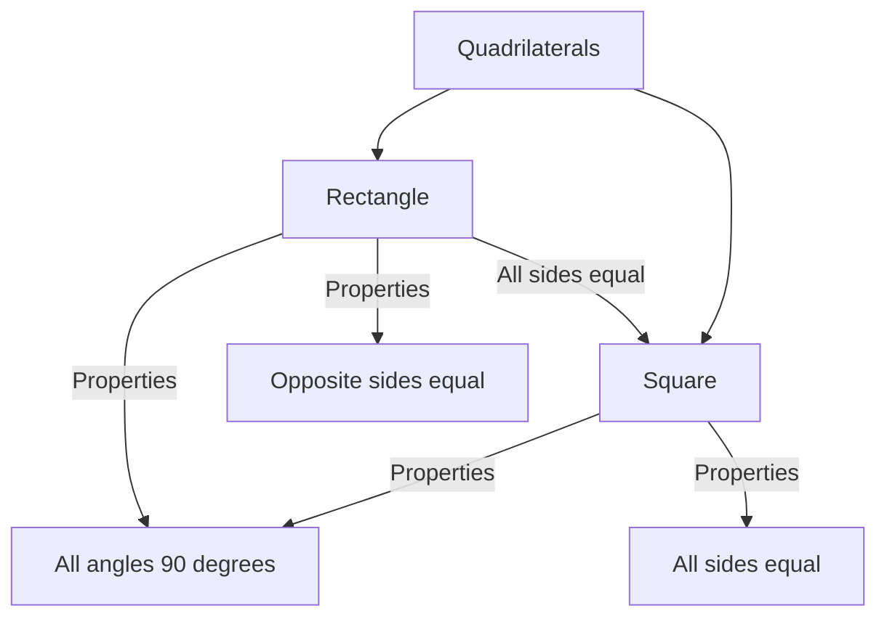
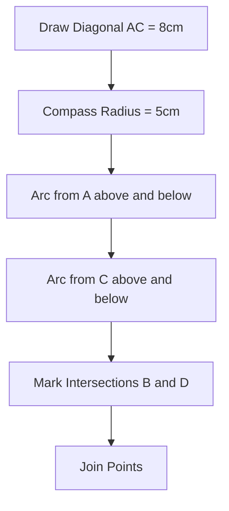

<<<FILE_START: index.mdx>>>
---
title: "Playing with Constructions"
description: "Introduction to geometric constructions using a ruler and compass, exploring circles, squares, and rectangles."
date: 2024-04-10
tags: ["math", "grade-6", "geometry", "constructions"]
order: 1
draft: false
---

import Callout from '@/components/Callout.astro'

## Introduction

Geometry is not just about calculating areas or angles; it is also about creating shapes with precision. In this chapter, we explore **Constructions**. We will move beyond freehand sketching and learn to use mathematical instruments to draw accurate geometric figures.

### Tools of the Trade

To play with constructions, we need two primary tools:

1.  **The Ruler:** Used to draw straight lines and measure lengths.
2.  **The Compass:** Used to draw circles and arcs, and to mark off equal lengths.

### Chapter Overview

We will progress through the following concepts:

*   **Circles:** Understanding the center and radius.
*   **Basic Shapes:** Properties of squares and rectangles.
*   **Construction:** Step-by-step methods to draw squares and rectangles using given measurements.
*   **Diagonals:** Exploring how diagonals relate to the sides and angles of quadrilaterals.
*   **Equidistant Points:** finding points that are the same distance from two other points (intersection of circles).

### Key Properties at a Glance

**Circle**
*   **Center:** The fixed point from which all points on the curve are equidistant.
*   **Radius:** The constant distance between the center and any point on the circle.

**Rectangle**
*   **Sides:** Opposite sides are equal in length.
*   **Angles:** All four angles are $90^\circ$ (Right angles).
*   **Diagonals:** Equal in length and bisect each other.

**Square**
*   **Sides:** All four sides are equal in length.
*   **Angles:** All four angles are $90^\circ$.
*   **Diagonals:** Equal in length and intersect at $90^\circ$.

## Visualizing the Concepts

Below is a map of how we classify the shapes we will construct:

<<<FILE_END>>>

<<<FILE_START: topics/01-circles-and-compass.mdx>>>
---
title: "Circles and the Compass"
description: "Understanding how to draw circles and defining radius and center."
date: 2024-04-10
tags: ["circles", "compass", "geometry"]
order: 2
draft: false
---

import Callout from '@/components/Callout.astro'

## The Circle

A circle is a simple closed curve where every point on the curve is at the same distance from a fixed point inside it.

<Callout variant="tip">
**Key Definitions:**
*   **Center (P):** The fixed point.
*   **Radius:** The fixed distance from the center to the edge.
</Callout>

### Using a Compass

A compass has a metal tip and a pencil tip. To draw a circle:
1.  **Fix the needle:** Place the sharp metal tip at the point you want to be the **center**.
2.  **Set the radius:** Open the compass so the distance between the needle and the pencil tip matches your desired radius (e.g., 4 cm).
3.  **Rotate:** Spin the compass to draw the curve.

### Visual Representation

Here is a circle with center $P$ and a radius of 4 units.

  <svg width="300" height="300" viewBox="0 0 300 300" xmlns="http://www.w3.org/2000/svg">
    <!-- Circle -->
    <circle cx="150" cy="150" r="100" stroke="currentColor" stroke-width="2" fill="none" />
    
    <!-- Center Point -->
    <circle cx="150" cy="150" r="3" fill="currentColor" />
    <text x="140" y="145" fill="currentColor" font-size="16" font-family="sans-serif">P</text>
    
    <!-- Radius Line -->
    <line x1="150" y1="150" x2="250" y2="150" stroke="currentColor" stroke-width="1.5" stroke-dasharray="5,5" />
    <text x="180" y="140" fill="currentColor" font-size="14" font-family="sans-serif">Radius (4 cm)</text>
    
    <!-- Point on circle -->
    <circle cx="250" cy="150" r="3" fill="currentColor" />
    <text x="255" y="155" fill="currentColor" font-size="16" font-family="sans-serif">Q</text>
  </svg>

### Thinking about Distance
If you mark a point $P$ and want to find *all* points that are exactly 4 cm away from $P$, they will form a circle.
*   Points **inside** the circle are less than 4 cm from $P$.
*   Points **outside** the circle are more than 4 cm from $P$.
*   Points **on** the circle are exactly 4 cm from $P$.
<<<FILE_END>>>

<<<FILE_START: topics/02-squares-and-rectangles.mdx>>>
---
title: "Properties of Squares and Rectangles"
description: "Defining squares and rectangles based on their sides and angles."
date: 2024-04-10
tags: ["polygons", "square", "rectangle"]
order: 3
draft: false
---

import Callout from '@/components/Callout.astro'

## Rectangles

A rectangle is a 4-sided polygon (quadrilateral) with specific rules:
1.  **Opposite sides** are equal in length ($AB = CD$ and $BC = DA$).
2.  **All angles** are equal to $90^\circ$ (Right angles).

  <svg width="300" height="200" viewBox="0 0 300 200" xmlns="http://www.w3.org/2000/svg">
    <!-- Rectangle ABCD -->
    <rect x="50" y="50" width="200" height="100" stroke="currentColor" stroke-width="2" fill="none" />
    
    <!-- Labels -->
    <text x="40" y="45" fill="currentColor">A</text>
    <text x="260" y="45" fill="currentColor">B</text>
    <text x="260" y="170" fill="currentColor">C</text>
    <text x="40" y="170" fill="currentColor">D</text>
    
    <!-- Right Angle Markers -->
    <path d="M 50 140 L 60 140 L 60 150" stroke="currentColor" fill="none" transform="translate(0,0)" />
    <!-- (Simplified markers for clarity) -->
  </svg>

## Squares

A square is a special type of rectangle.
1.  **All 4 sides** are equal ($AB = BC = CD = DA$).
2.  **All angles** are $90^\circ$.

### Naming Convention
When naming a shape like a square or rectangle, you must list the corners in order as you travel around the boundary (either clockwise or counter-clockwise).
*   **Valid:** $PQRS$, $QRSP$, $RSPQ$, $SPQR$.
*   **Invalid:** $PRSQ$ (crossing diagonally).

### Rotated Figures
If you rotate a square, it remains a square. The properties (equal sides, right angles) do not change just because the orientation changes.

  <svg width="200" height="200" viewBox="0 0 200 200" xmlns="http://www.w3.org/2000/svg">
    <!-- Rotated Square (Diamond orientation) -->
    <polygon points="100,20 180,100 100,180 20,100" stroke="currentColor" stroke-width="2" fill="none" />
    <text x="100" y="15" fill="currentColor" text-anchor="middle">A</text>
    <text x="190" y="100" fill="currentColor" text-anchor="start">B</text>
    <text x="100" y="195" fill="currentColor" text-anchor="middle">C</text>
    <text x="10" y="100" fill="currentColor" text-anchor="end">D</text>
  </svg>

<Callout variant="info">
**Tip:** A rotated square might look like a "diamond," but mathematically, if the corners are $90^\circ$ and sides are equal, it is still a square.
</Callout>
<<<FILE_END>>>

<<<FILE_START: topics/03-construction-methods.mdx>>>
---
title: "Constructing Squares and Rectangles"
description: "Step-by-step methods to construct geometric shapes using a ruler and compass."
date: 2024-04-10
tags: ["construction", "math", "tutorial"]
order: 4
draft: false
---

import Callout from '@/components/Callout.astro'

## Constructing a Square

**Task:** Construct a square $PQRS$ with a side length of 6 cm.

### Method: Ruler and Compass

**Step 1:** Draw a line segment $PQ$ of length 6 cm.

**Step 2:** At point $P$, construct a perpendicular line (90°).
*   You can do this using a set square or a protractor, or by compass construction (bisecting a straight angle).
*   Let this vertical line be the "ray" from $P$.

**Step 3:** Mark the length.
*   Set your compass radius to 6 cm.
*   Place the needle on $P$ and cut an arc on the vertical line.
*   Mark this intersection point as $S$. Now $PS = 6$ cm.

**Step 4:** Find point $R$.
*   We know $QR = 6$ cm and $SR = 6$ cm.
*   With center $Q$ and radius 6 cm, draw an arc.
*   With center $S$ and radius 6 cm, draw another arc.
*   The point where these two arcs intersect is $R$.

**Step 5:** Join $Q$ to $R$ and $S$ to $R$.

  <svg width="300" height="300" viewBox="0 0 300 300" xmlns="http://www.w3.org/2000/svg">
    <!-- Square PQRS -->
    <rect x="50" y="50" width="200" height="200" stroke="currentColor" stroke-width="2" fill="none" />
    
    <!-- Labels -->
    <text x="35" y="265" fill="currentColor">P</text>
    <text x="260" y="265" fill="currentColor">Q</text>
    <text x="260" y="45" fill="currentColor">R</text>
    <text x="35" y="45" fill="currentColor">S</text>
    
    <!-- Construction Arcs Visualization (Dashed) -->
    <path d="M 250 250 A 200 200 0 0 0 250 50" stroke="currentColor" stroke-dasharray="4,4" stroke-opacity="0.5" fill="none" />
    <path d="M 50 50 A 200 200 0 0 0 250 50" stroke="currentColor" stroke-dasharray="4,4" stroke-opacity="0.5" fill="none" />
    
    <!-- Dimensions -->
    <text x="140" y="280" fill="currentColor" font-size="12">6 cm</text>
    <text x="20" y="150" fill="currentColor" font-size="12">6 cm</text>
  </svg>

<Callout variant="tip">
**Why Arcs?**
Using intersecting arcs allows us to find a precise point ($R$) that is exactly 6 cm away from $S$ and 6 cm away from $Q$ without guessing.
</Callout>
<<<FILE_END>>>

<<<FILE_START: topics/04-diagonals.mdx>>>
---
title: "Diagonals of Rectangles and Squares"
description: "Exploring the properties of diagonals in quadrilaterals."
date: 2024-04-10
tags: ["diagonals", "geometry"]
order: 5
draft: false
---

import Callout from '@/components/Callout.astro'

## What is a Diagonal?

A diagonal is a line segment connecting two opposite corners of a polygon. In a rectangle $PQRS$, the lines $PR$ and $QS$ are diagonals.

### Properties

1.  **Equal Lengths:** In both squares and rectangles, the two diagonals are equal in length ($PR = QS$).
2.  **Bisecting:** They cut each other exactly in half.
3.  **Square Speciality:** In a square, the diagonals intersect at right angles ($90^\circ$).

### Constructing with Diagonals

**Problem:** Construct a rectangle where side $CD = 5$ cm and diagonal $BD = 7$ cm.

**Logic:**
1.  Draw the base $CD = 5$ cm.
2.  We know the angle at $C$ is $90^\circ$. Draw a perpendicular line at $C$. Let's call this line $l$.
3.  Point $B$ lies on line $l$.
4.  Point $B$ is also 7 cm away from $D$.
5.  Using a compass, set radius to 7 cm, place needle at $D$, and cut an arc on line $l$.
6.  The intersection is point $B$.
7.  Complete the rectangle.

  <svg width="300" height="250" viewBox="0 0 300 250" xmlns="http://www.w3.org/2000/svg">
    <!-- Base -->
    <line x1="50" y1="200" x2="150" y2="200" stroke="currentColor" stroke-width="2" />
    <text x="40" y="215" fill="currentColor">D</text>
    <text x="160" y="215" fill="currentColor">C</text>
    <text x="90" y="220" fill="currentColor" font-size="12">5 cm</text>
    
    <!-- Perpendicular -->
    <line x1="150" y1="200" x2="150" y2="50" stroke="currentColor" stroke-width="1" />
    <text x="160" y="60" fill="currentColor">l</text>
    
    <!-- Diagonal Arc -->
    <path d="M 50 200 A 180 180 0 0 1 180 60" stroke="currentColor" stroke-dasharray="5,5" fill="none" />
    
    <!-- Intersection Point B -->
    <circle cx="150" cy="67" r="3" fill="currentColor" />
    <text x="160" y="80" fill="currentColor">B</text>
    
    <!-- Diagonal Line -->
    <line x1="50" y1="200" x2="150" y2="67" stroke="currentColor" stroke-width="1.5" />
    <text x="80" y="130" fill="currentColor" font-size="12">7 cm</text>
  </svg>

<<<FILE_END>>>

<<<FILE_START: topics/05-equidistant-points.mdx>>>
---
title: "Equidistant Points"
description: "Finding points that are the same distance from two other points."
date: 2024-04-10
tags: ["locus", "construction", "circles"]
order: 6
draft: false
---

import Callout from '@/components/Callout.astro'

## The "House" Construction Problem

Imagine you need to draw a roof for a house. You have the base $BC$, and you need a peak point $A$ such that $AB = 5$ cm and $AC = 5$ cm.

### The Concept
How do we find a point that is exactly 5 cm from $B$ and 5 cm from $C$?

1.  **Locus from B:** All points 5 cm from $B$ lie on a circle centered at $B$ with radius 5 cm.
2.  **Locus from C:** All points 5 cm from $C$ lie on a circle centered at $C$ with radius 5 cm.
3.  **Intersection:** The point where these two circles meet satisfies **both** conditions.

### Steps
1.  Draw the base line (e.g., $BC$).
2.  With $B$ as center and radius 5 cm, draw an arc.
3.  With $C$ as center and radius 5 cm, draw an arc intersecting the first one.
4.  Mark the intersection point $A$.
5.  Join $AB$ and $AC$.

  <svg width="300" height="300" viewBox="0 0 300 300" xmlns="http://www.w3.org/2000/svg">
    <!-- Points B and C -->
    <line x1="100" y1="200" x2="200" y2="200" stroke="currentColor" stroke-width="2" />
    <text x="90" y="215" fill="currentColor">B</text>
    <text x="210" y="215" fill="currentColor">C</text>
    
    <!-- Arcs -->
    <!-- Arc from B -->
    <path d="M 100 200 A 100 100 0 0 1 180 120" stroke="currentColor" stroke-dasharray="5,5" fill="none" />
    <!-- Arc from C -->
    <path d="M 200 200 A 100 100 0 0 0 120 120" stroke="currentColor" stroke-dasharray="5,5" fill="none" />
    
    <!-- Intersection A -->
    <circle cx="150" cy="113.4" r="4" fill="currentColor" />
    <text x="145" y="100" fill="currentColor">A</text>
    
    <!-- Connecting Lines -->
    <line x1="100" y1="200" x2="150" y2="113.4" stroke="currentColor" stroke-width="2" />
    <line x1="200" y1="200" x2="150" y2="113.4" stroke="currentColor" stroke-width="2" />
    
    <text x="100" y="150" fill="currentColor" font-size="12">5 cm</text>
    <text x="180" y="150" fill="currentColor" font-size="12">5 cm</text>
  </svg>

This method creates an **Isosceles Triangle** (or Equilateral if the base is also 5 cm).
<<<FILE_END>>>

<<<FILE_START: solutions/ex-8.1.mdx>>>
---
title: "Exercise 8.1 Solutions"
description: "Solutions for Artwork and Curve construction."
date: 2024-04-10
tags: ["solutions", "exercise-8.1"]
order: 7
draft: false
---

## Think (Page 188)

**Question:** Imagine marking all the points of 4 cm distance from the point P. How would they look?

**Answer:** 
They would form a **Circle**.
If you mark infinite points exactly 4 cm away from a center $P$, they connect to form a perfect circular boundary.

---

## Figure it Out (Page 191)

**Q1. What radius should be taken in the compass to get this half circle? What should be the length of AX?**

**Answer:**
*   From the diagram, the total length of the central line $AB$ is 8 cm.
*   The wave is made of two identical semicircles.
*   The diameter of the first semicircle ($AX$) covers half the total length.
*   $AX = 4$ cm.
*   The **Radius** is half of the diameter ($AX$).
*   Radius = $4 \div 2 = 2$ cm.

**Q2. Take a central line of a different length and try to draw the wave on it.**

**Solution Steps:**
1.  Draw a line $AB$ of length, say, 10 cm.
2.  Mark the midpoint $X$ at 5 cm.
3.  Find the midpoint of $AX$ (at 2.5 cm). This is the center of the first upper semicircle.
4.  Draw a semicircle upwards from $A$ to $X$ with radius 2.5 cm.
5.  Find the midpoint of $XB$ (at 7.5 cm from A). This is the center of the second lower semicircle.
6.  Draw a semicircle downwards from $X$ to $B$ with radius 2.5 cm.

**Q3. Try to recreate the figure where the waves are smaller than a half circle.**

**Solution:**
This requires finding the correct radius and centers by trial and error or geometric construction (arcs intersecting). Specifically, the center of the arc must be lower than the line $AX$ to create a shallow wave, not a full semicircle.
<<<FILE_END>>>

<<<FILE_START: solutions/ex-8.2.mdx>>>
---
title: "Exercise 8.2 Solutions"
description: "Solutions regarding Squares and Rectangles naming and properties."
date: 2024-04-10
tags: ["solutions", "exercise-8.2"]
order: 8
draft: false
---

## Naming Squares (Page 193)

**Question:** Which of the following is not a name for this square (PQRS)?
1.  PQSR
2.  SPQR
3.  RSPQ
4.  QRSP

**Answer:** **1. PQSR**
*   **Reason:** When naming a polygon, vertices must be listed in consecutive order (perimeter). $PQSR$ jumps from $Q$ to $S$ diagonally, which breaks the order. The other three follow the cyclic order.

---

## Figure it Out (Page 194)

**Q1. Draw the rectangle and four squares configuration on dot paper.**
*(Practical activity - ensure squares are tilted symmetrically).*

**Q2. Identify if there are any squares in this collection.**
**Answer:** Yes, the rotated figure labeled **A** is a square. Even though it is rotated, its sides are equal (based on the dot spacing) and its corners form $90^\circ$ angles.

**Think:** Is it possible to reason out if sides are equal/angles are right without instruments?
**Answer:** Yes, on a dot grid (lattice), you can count "steps" (e.g., 2 units right, 2 units up) to verify lengths and slopes. If the slopes are negative reciprocals, the lines are perpendicular.

**Q3. Draw at least 3 rotated squares and rectangles.**
*(Self-verification: Ensure opposite sides are parallel and adjacent sides are perpendicular).*
<<<FILE_END>>>

<<<FILE_START: solutions/ex-8.3.mdx>>>
---
title: "Exercise 8.3 Solutions"
description: "Constructing Rectangles."
date: 2024-04-10
tags: ["solutions", "exercise-8.3"]
order: 9
draft: false
---

## Construct (Page 197)

**Q1. Draw a rectangle with sides of length 4 cm and 6 cm.**

**Solution:**
1.  Draw $AB = 6$ cm.
2.  At $A$ and $B$, construct vertical perpendiculars.
3.  Mark $AD = 4$ cm and $BC = 4$ cm on these perpendiculars.
4.  Join $C$ and $D$.
5.  **Check:** Measure $CD$. It should be 6 cm. Measure angles $\angle C$ and $\angle D$. They should be $90^\circ$.

**Q2. Draw a rectangle of sides 2 cm and 10 cm.**

**Solution:**
Follow the same method as above. The rectangle will be long and thin.
*   Sides: $PQ = 10$ cm, $PS = 2$ cm.

**Q3. Is it possible to construct a 4-sided figure where all angles are $90^\circ$ but opposite sides are NOT equal?**

**Answer: No.**
If a quadrilateral has three $90^\circ$ angles, the fourth must be $90^\circ$ (since sum is $360^\circ$). A quadrilateral with four right angles is a rectangle (or square). By definition of a rectangle, opposite sides *must* be equal.

---

## Exercise 8.4 Exploration (Page 198)

**Data Table:**
Looking at distances of $X$ from $A$ and $Y$ from $B$.

| Distance of X from A | Distance of Y from B | Length of XY |
| :--- | :--- | :--- |
| 5 mm | 5 mm | **Equal to AB** |
| 1 cm | 1 cm | **Equal to AB** |
| 1 cm 5 mm | 1 cm 5 mm | **Equal to AB** |

**Observation:**
1.  **Length XY:** If $X$ and $Y$ move the same distance from $A$ and $B$, then $XY$ remains parallel to $AB$ and equal in length to $AB$.
2.  **Shape:** The figure $ABYX$ is a rectangle.
<<<FILE_END>>>

<<<FILE_START: solutions/ex-8.4.mdx>>>
---
title: "Exercise 8.4 Solutions"
description: "Advanced rectangle construction and exploration."
date: 2024-04-10
tags: ["solutions", "exercise-8.4"]
order: 10
draft: false
---

## Construct: Breaking Rectangles (Page 199)

**Q. Construct a rectangle that can be divided into 3 identical squares.**

**Solution:**
1.  Assume the side of the square is $s$.
2.  The rectangle will have breadth $= s$ and length $= 3s$.
3.  **Example:** Let side $= 2$ cm.
    *   Breadth = 2 cm.
    *   Length = 6 cm.
4.  Construct a rectangle with sides 6 cm and 2 cm.
5.  Mark points at 2 cm and 4 cm along the 6 cm side to divide it into three 2 cm squares.

---

## Construct (Page 201)

**Q1. A Square within a Rectangle**
*Construct a rectangle of sides 8 cm and 4 cm. Construct a square inside such that they share the same center.*

**Solution:**
1.  Draw rectangle $ABCD$ ($8 \times 4$).
2.  Draw diagonals $AC$ and $BD$ to find the center $O$.
3.  **To draw the inner square (e.g., side 2 cm):**
    *   From $O$, measure 1 cm up, 1 cm down, 1 cm left, 1 cm right? **No.**
    *   Since it's a square, its sides are parallel to the rectangle.
    *   Half-side = 1 cm.
    *   From $O$, go 1 cm vertically up/down to draw horizontal sides.
    *   From $O$, go 1 cm horizontally left/right to draw vertical sides.
    *   Draw lines through these points parallel to the outer sides.

**Falling Squares / Shadings (Page 202)**
These are practical drawing exercises requiring precision.
*   **Key Strategy:** Always start by drawing the main frame (square or rectangle) using the Ruler-Compass method (90° angles). Then use the ruler to measure distances along the sides to mark the smaller internal vertices.

**Q4. Square with a Hole (Page 203)**
*Hint: Think where the center of the circle should be.*
**Solution:** The center of the circle is the intersection of the diagonals of the square. Construct the square, draw faint diagonals to find the center, then use the compass to draw the circle.
<<<FILE_END>>>

<<<FILE_START: solutions/ex-8.5.mdx>>>
---
title: "Exercise 8.5 Solutions"
description: "Solutions for Diagonals exploration."
date: 2024-04-10
tags: ["solutions", "exercise-8.5"]
order: 11
draft: false
---

## Explore (Page 204)

**Q. How should the rectangle be constructed so that the diagonal divides the opposite angles into equal parts?**

**Answer:**
If the diagonal divides the right angle ($90^\circ$) into two equal parts, each part is $45^\circ$.
*   If the angle between the diagonal and the side is $45^\circ$, the triangle formed is an Isosceles Right-Angled Triangle.
*   This implies the adjacent sides are equal.
*   Therefore, the rectangle must be a **Square**.

## Construct (Page 205)

**Q1. Construct a rectangle where the diagonal divides opposite angles into $60^\circ$ and $30^\circ$.**

**Solution:**
1.  Draw a line $AB$ (arbitrary length).
2.  At $A$, construct a $90^\circ$ angle (perpendicular).
3.  We want the diagonal to make $60^\circ$ or $30^\circ$ with $AB$. Let's assume $\angle CAB = 60^\circ$.
4.  Construct a $60^\circ$ angle at $A$.
5.  Extend this line until it hits the perpendicular from $B$ (if constructed that way) or set a specific length.
    *   *Correction based on text method:* Draw triangle $ABC$ with $\angle B = 90^\circ$ and $\angle A = 60^\circ$.
    *   Complete the rectangle by drawing parallel lines from $C$ and $A$.

**Q2. Construct a rectangle where one side is 5 cm and diagonal is 7 cm.**

**Solution:**
See the method in "Topics: Diagonals".
1.  Draw base 5 cm.
2.  Draw perpendicular at one end.
3.  Cut arc of 7 cm from the other end.
<<<FILE_END>>>

<<<FILE_START: solutions/ex-8.6.mdx>>>
---
title: "Exercise 8.6 Solutions"
description: "Constructing the House and Equidistant Points."
date: 2024-04-10
tags: ["solutions", "exercise-8.6"]
order: 12
draft: false
---

## Construct (Page 211)

**House Construction**
*Recreate the figure with all sides 5 cm.*

**Solution:**
1.  **Base:** Draw square $BCDE$ with side 5 cm.
    *   Draw $CD = 5$ cm.
    *   Construct perpendiculars at $C$ and $D$.
    *   Mark $CB = 5$ cm and $DE = 5$ cm.
    *   Join $BE$.
2.  **Roof:** We need point $A$ such that $AB = 5$ cm and $AE = 5$ cm (assuming roof connects to top corners).
    *   Wait, diagram shows the roof on top of side $BC$? No, usually roof is on top. Based on text labels $B, C, D, E$, let's assume $BC$ is the top side of a square.
    *   Draw arcs of radius 5 cm from $B$ and $C$.
    *   Intersection is $A$.
    *   Join $AB$ and $AC$.

**Q3. Is there a 4-sided figure where all sides are equal but it is not a square?**

**Answer:** **Yes, a Rhombus.**
*   A rhombus has 4 equal sides.
*   However, its angles do not have to be $90^\circ$.
*   **Construction:** Draw a base $AB$. Draw $AD$ at an angle (say $60^\circ$) with length equal to $AB$. Complete the parallelogram using compass arcs of the same length from $B$ and $D$.

## Bigger House (Page 215)
**Q1. Construct a bigger house with sides 7 cm.**
**Solution:**
Follow the exact same steps as the 5 cm house, simply changing the ruler length and compass radius to 7 cm.

**Q2. Recreate "Eyes"**
**Solution:**
1.  Draw a horizontal line of length, say, 6 cm ($AB$).
2.  Mark a point $P$ above the line on the perpendicular bisector.
3.  Place compass at $P$, adjust radius to pass through $A$ and $B$. Draw the upper arc.
4.  Mark a point $Q$ below the line (same distance as $P$).
5.  Place compass at $Q$, draw the lower arc connecting $A$ and $B$.
<<<FILE_END>>>

<<<FILE_START: practice/solved-examples.mdx>>>
---
title: "Practice: Solved Examples"
description: "Additional worked-out examples for construction practice."
date: 2024-04-10
tags: ["practice", "solved"]
order: 13
draft: false
---

import Callout from '@/components/Callout.astro'

## Example 1: The Wavy Line

**Problem:** Construct a wave pattern on a line segment $AB = 12$ cm consisting of 3 equal semicircles.

**Solution:**
1.  **Analyze:** Total length is 12 cm. There are 3 semicircles.
    *   Diameter of each semicircle $= 12 \div 3 = 4$ cm.
    *   Radius of each semicircle $= 2$ cm.
2.  **Mark Points:**
    *   Draw $AB = 12$ cm.
    *   Mark points $P$ and $Q$ at 4 cm and 8 cm from $A$.
    *   The segments are $AP$, $PQ$, and $QB$.
3.  **Find Centers:**
    *   Midpoint of $AP$ is $C_1$ (at 2 cm).
    *   Midpoint of $PQ$ is $C_2$ (at 6 cm).
    *   Midpoint of $QB$ is $C_3$ (at 10 cm).
4.  **Draw Arcs:**
    *   Place compass at $C_1$, radius 2 cm. Draw semicircle **Up**.
    *   Place compass at $C_2$, radius 2 cm. Draw semicircle **Down**.
    *   Place compass at $C_3$, radius 2 cm. Draw semicircle **Up**.

## Example 2: The Rhombus

**Problem:** Construct a shape with 4 sides of length 5 cm, but diagonal length 8 cm.

**Solution:**
1.  **Draw Diagonal:** Draw line segment $AC = 8$ cm.
2.  **Locate Vertices:** We need points $B$ and $D$ such that they are 5 cm away from both $A$ and $C$.
3.  **Upper Point (B):**
    *   Center $A$, radius 5 cm $\to$ Draw arc above $AC$.
    *   Center $C$, radius 5 cm $\to$ Draw arc intersecting the first one. Mark as $B$.
4.  **Lower Point (D):**
    *   Center $A$, radius 5 cm $\to$ Draw arc below $AC$.
    *   Center $C$, radius 5 cm $\to$ Draw arc intersecting the first one. Mark as $D$.
5.  **Connect:** Join $AB, BC, CD, DA$.
6.  **Verify:** This is a Rhombus (all sides 5 cm) but not a square (diagonal is 8 cm, not $5\sqrt{2} \approx 7.07$ cm).

<<<FILE_END>>>
