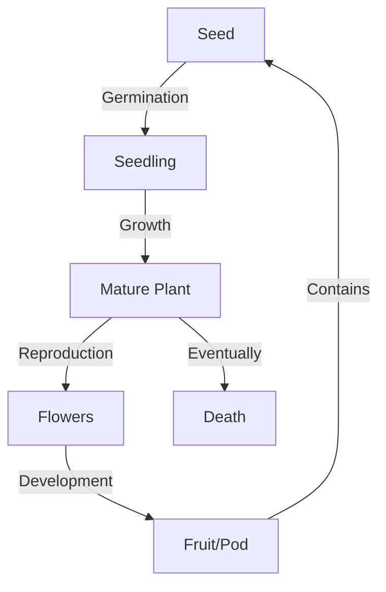
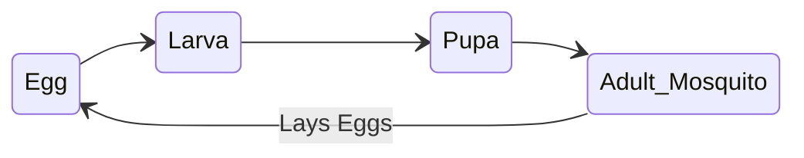
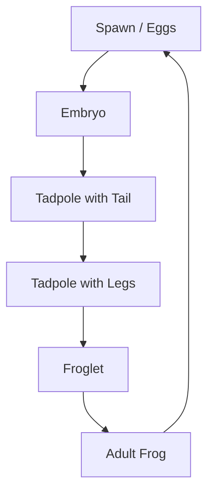

<<<FILE_START: index.mdx>>>
---
title: "Living Creatures: Exploring their Characteristics"
description: "An overview of Chapter 10, covering characteristics of living beings, seed germination, and life cycles of plants and animals."
date: 2025-01-25
tags: ["science", "grade-6", "biology", "living-organisms"]
order: 1
draft: false
---

import Callout from '@/components/Callout.astro'

## Introduction

We are surrounded by a diverse world containing both **living beings** (like pigeons, plants, and humans) and **non-living things** (like pencils, cars, and books). But what exactly sets them apart? While a car moves, it isn't alive. While a tree doesn't walk, it is alive.

In this chapter, we explore the essential characteristics that define life, the conditions required for seeds to turn into plants, and the fascinating life cycles of various organisms.

## Key Concepts

The chapter focuses on three main pillars:

1.  **Characteristics of Life:** How to distinguish living form non-living based on specific biological processes (Respiration, Excretion, Reproduction, etc.).
2.  **Plant Growth:** From seed germination to the directional movement of roots and shoots.
3.  **Life Cycles:** The stages of development in plants (beans) and animals (mosquitoes, frogs).

## Formula & Definitions Sheet

<Callout variant="tip">
**Stimulus & Response:**
*   **Stimulus:** Any change in the environment (heat, light, sound) that prompts a reaction.
*   **Response:** The reaction of the living being to the stimulus.
</Callout>

$$
\text{Life Cycle} = \text{Birth/Germination} \rightarrow \text{Growth} \rightarrow \text{Reproduction} \rightarrow \text{Death}
$$

## Chapter Structure

The following topics are covered in detail:

*   **Living vs. Non-Living:** Defining the boundaries.
*   **Essential Characteristics:** Nutrition, Respiration, Excretion, Growth, and Movement.
*   **Seed Germination:** The role of water, air, and soil.
*   **Plant Movement:** How plants respond to light and gravity.
*   **Life Cycles:** A comparative study of plants, mosquitoes, and frogs.

<<<FILE_END>>>

<<<FILE_START: topics/01-living-vs-non-living.mdx>>>
---
title: "Living vs. Non-Living Things"
description: "Understanding the fundamental differences between living organisms and non-living objects."
date: 2025-01-25
tags: ["living", "non-living", "classification"]
order: 2
draft: false
---

import Callout from '@/components/Callout.astro'

## Distinguishing Features

We see many things around us—shells, snails, cars, and trees. Sometimes it can be confusing to categorize them. For example, a car moves and consumes fuel, but it is not alive. A cloud grows in size, but it is not alive.

To identify something as **living**, it generally must exhibit **all** of the following characteristics over its lifespan. If it lacks these intrinsic biological processes, it is considered non-living.

### Comparison Table

| Feature | Living Beings (e.g., Pigeon, Plant) | Non-Living Things (e.g., Pencil, Car) |
| :--- | :--- | :--- |
| **Growth** | Grows from within; irreversible. | Does not grow (or grows by accumulation, like a snowball). |
| **Nutrition** | Needs food/nutrients to survive. | Does not need food. |
| **Respiration** | Breathes/respires to release energy. | Does not respire. |
| **Reproduction**| Produces young ones of its own kind. | Cannot reproduce. |
| **Excretion** | Removes waste from the body. | Does not excrete. |
| **Response** | Responds to stimuli (light, touch). | No response to stimuli. |
| **Life Span** | Has a birth and death. | Exists until destroyed; no biological death. |

<Callout variant="warning">
**The "Movement" Confusion:**
Movement alone is not a defining feature of life.
*   **Animals** move from place to place.
*   **Plants** do not move their whole body, but parts of them move (e.g., flowers opening, roots growing down).
*   **Cars/Clouds** move due to external forces or fuel combustion, but they do not grow, reproduce, or respire.
</Callout>

### The Case of the Shell
In the introduction, Avadhi finds a shell. A shell itself is non-living (it's a hard protective layer), but it was once part of a living snail. Once separated or if the snail dies, the shell remains as a non-living object.

<<<FILE_END>>>

<<<FILE_START: topics/02-characteristics-of-living-beings.mdx>>>
---
title: "Characteristics of Living Beings"
description: "A detailed look at the seven essential life processes: Nutrition, Growth, Respiration, Excretion, Stimuli Response, Reproduction, and Movement."
date: 2025-01-25
tags: ["characteristics", "respiration", "growth", "excretion"]
order: 3
draft: false
---

import Callout from '@/components/Callout.astro'

## 1. Nutrition and Growth
All living beings need food (nutrition) for growth and development.
*   **Animals:** Eat plants or other animals.
*   **Plants:** Make their own food via photosynthesis (using sunlight, water, air).
*   **Growth:** You cannot wear your clothes from 4 years ago because you have grown. Plants grow from seeds into trees. Non-living things do not show internal growth.

## 2. Respiration
Respiration is the process of releasing energy from food. **Breathing** is just a part of respiration (inhaling air and exhaling).

*   **Animals:** We breathe in oxygen and breathe out carbon dioxide. Chest movement indicates breathing.
*   **Plants:** Plants also respire day and night. They take in air through tiny pores on leaves called **stomata**.

<Callout variant="tip">
**Did You Know?**
While plants produce oxygen during the day (photosynthesis), they consume oxygen for respiration continuously (day and night).
</Callout>

## 3. Excretion
The removal of waste products formed in the body is called **excretion**.
*   **Animals:** Excrete wastes like urine, sweat, and feces. Sweat also helps cool the body.
*   **Plants:** Excrete excess water through leaves (transpiration) and sometimes store wastes in parts like bark or leaves that eventually fall off.

## 4. Response to Stimuli
A **stimulus** is any change in the surroundings (heat, sharp object, light). The reaction to it is the **response**.
*   **Example:** Stepping on a thorn (stimulus) makes you pull your foot away (response).
*   **Plants:**
    *   The **Touch-me-not** (*Mimosa pudica*) folds its leaves when touched.
    *   Sunflowers turn towards the sun.
    *   Roots grow towards gravity/water.

## 5. Reproduction
Reproduction is producing new individuals of one's own kind. It ensures the continuity of life.
*   **Animals:** Some lay eggs (birds, snakes, mosquitoes), others give birth to young ones (humans, cats, cows).
*   **Plants:** Mostly reproduce through seeds, but some reproduce through stems (rose) or leaves (bryophyllum).

## 6. Movement
Living things show movement.
*   **Animals:** Locomotion (moving from place to place).
*   **Plants:** Anchored to soil, but show movements like:
    *   Opening/closing of flowers.
    *   Insectivorous plants (e.g., *Drosera*) closing traps on insects.
    *   Climbers winding around support.

## 7. Death
Eventually, all living beings die. If an object shows none of these signs, or stops showing them permanently, it is non-living or dead.

<<<FILE_END>>>

<<<FILE_START: topics/03-seed-germination.mdx>>>
---
title: "Essential Conditions for Germination"
description: "Exploring what seeds need to sprout through experimental activities."
date: 2025-01-25
tags: ["germination", "seeds", "experiments"]
order: 4
draft: false
---

import Callout from '@/components/Callout.astro'

## What is Germination?
Germination is the process by which a seed turns into a sprout (seedling).

## Activity 10.2: The 4-Pot Experiment
To understand what seeds need, we set up an experiment with 4 pots containing bean seeds.

### Setup
*   **Pot A:** Direct sunlight, **No water**.
*   **Pot B:** Direct sunlight, **Excess water** (submerged).
*   **Pot C:** Dark room, **Moist soil** (moderate water).
*   **Pot D:** Direct sunlight, **Moist soil** (moderate water).

### Observations (After 7-10 days)

| Pot | Conditions | Result | Reason |
| :--- | :--- | :--- | :--- |
| **A** | Air + Light (No Water) | No Germination | **Water** is missing. Water softens the seed coat for the embryo. |
| **B** | Light + Water (No Air) | Rotting/No Germination | **Air** is missing. Roots/seeds need oxygen from soil spaces. |
| **C** | Water + Air (No Light) | **Germination** | Light is not essential for the *initial* germination of bean seeds. |
| **D** | Water + Air + Light | **Germination** | All conditions are optimal. |

### Conclusion: Essential Conditions
From the experiment, we observe that the essential conditions for seed germination are:
1.  **Water:** To soften the seed coat and activate growth.
2.  **Air (Oxygen):** For respiration of the growing embryo.
3.  **Correct Temperature:** (Implied by the environment).

<Callout variant="warning">
**Is Light Needed?**
For most seeds (like beans), light is **not** required for germination (sprouting). They can germinate in the dark (Pot C). However, **after** germination, sunlight is required for the seedling to grow healthy and green (photosynthesis). *Note: Some specific seeds like Petunia do require light to germinate.*
</Callout>

<<<FILE_END>>>

<<<FILE_START: topics/04-plant-growth-and-movement.mdx>>>
---
title: "Growth and Movement in Plants"
description: "How plants respond to directional stimuli like light and gravity."
date: 2025-01-25
tags: ["tropism", "geotropism", "phototropism", "plant-movement"]
order: 5
draft: false
---

import Callout from '@/components/Callout.astro'

## Directional Growth (Tropisms)
Plants may not walk, but they move by growing. This growth is directional, responding to stimuli like light (**Phototropism**) and gravity (**Geotropism**).

## Activity 10.3: Roots and Shoots
An experiment with seedlings placed in different orientations (upright vs. inverted) helps us understand this.

### Observations
1.  **Upright Plant:** Roots grow down, shoot grows up.
2.  **Inverted Plant:**
    *   The **Root** bends and turns **downwards** (towards gravity).
    *   The **Shoot** bends and turns **upwards** (away from gravity/towards light).
3.  **Side Lighting:** If light comes from only one side, the shoot bends towards the light.

### Visualizing Plant Response

  <svg width="400" height="300" viewBox="0 0 400 300" xmlns="http://www.w3.org/2000/svg">
    <!-- Ground Line -->
    <line x1="50" y1="250" x2="350" y2="250" stroke="currentColor" stroke-width="2" />
    
    <!-- Pot -->
    <rect x="150" y="200" width="60" height="50" fill="none" stroke="currentColor" stroke-width="2" />
    <text x="180" y="230" text-anchor="middle" font-size="12" fill="currentColor">Pot</text>
    
    <!-- Stem bending towards sun -->
    <path d="M 180 200 Q 180 150 240 100" fill="none" stroke="currentColor" stroke-width="4" stroke-linecap="round" />
    
    <!-- Leaves -->
    <ellipse cx="240" cy="100" rx="15" ry="8" fill="none" stroke="currentColor" stroke-width="1.5" transform="rotate(-30 240 100)" />
    <ellipse cx="230" cy="110" rx="15" ry="8" fill="none" stroke="currentColor" stroke-width="1.5" transform="rotate(30 230 110)" />
    
    <!-- Sun -->
    <circle cx="320" cy="50" r="20" fill="none" stroke="currentColor" stroke-width="2" />
    <line x1="320" y1="20" x2="320" y2="10" stroke="currentColor" stroke-width="2" />
    <line x1="320" y1="80" x2="320" y2="90" stroke="currentColor" stroke-width="2" />
    <line x1="290" y1="50" x2="280" y2="50" stroke="currentColor" stroke-width="2" />
    <line x1="350" y1="50" x2="360" y2="50" stroke="currentColor" stroke-width="2" />
    <line x1="300" y1="30" x2="290" y2="20" stroke="currentColor" stroke-width="2" />
    <line x1="340" y1="70" x2="350" y2="80" stroke="currentColor" stroke-width="2" />
    <line x1="300" y1="70" x2="290" y2="80" stroke="currentColor" stroke-width="2" />
    <line x1="340" y1="30" x2="350" y2="20" stroke="currentColor" stroke-width="2" />

    <!-- Labels -->
    <text x="260" y="140" text-anchor="start" font-size="14" fill="currentColor">Shoot bends to light</text>
    <text x="320" y="110" text-anchor="middle" font-size="12" fill="currentColor">Stimulus (Light)</text>
    
  </svg>

## Key Findings
*   **Roots** are positively geotropic (grow down) and negatively phototropic (grow away from light).
*   **Shoots** are negatively geotropic (grow up) and positively phototropic (grow towards light).
*   This ensures roots find water/soil and leaves find sunlight.

<<<FILE_END>>>

<<<FILE_START: topics/05-life-cycle-of-a-plant.mdx>>>
---
title: "Life Cycle of a Plant"
description: "Tracing the journey of a bean plant from seed to fruit and back to seed."
date: 2025-01-25
tags: ["life-cycle", "plants", "bean"]
order: 6
draft: false
---

import Callout from '@/components/Callout.astro'

## The Cycle of Life
All living things grow, reproduce, and die. The sequence of events from birth to the production of the next generation is called a **Life Cycle**.

## Stages of a Bean Plant
Observations from Activity 10.4 reveal the following stages:

1.  **Seed:** The dormant starting point.
2.  **Germination:** With water and air, the seed sprouts.
3.  **Seedling:** Roots grow down, shoots grow up, leaves appear.
4.  **Flowering:** The plant matures and produces flowers.
5.  **Fruit/Pod Formation:** Flowers dry up and develop into pods (fruits).
6.  **Seed Dispersal:** The pod contains new seeds.
7.  **Death:** The old plant dies, but the seeds continue the cycle.

### Life Cycle Diagram

<Callout variant="tip">
**Concept Check:**
Even though the individual plant dies, the *species* survives because it produced seeds before dying.
</Callout>

<<<FILE_END>>>

<<<FILE_START: topics/06-life-cycle-of-animals.mdx>>>
---
title: "Life Cycles of Animals"
description: "Metamorphosis and growth stages in mosquitoes and frogs."
date: 2025-01-25
tags: ["mosquito", "frog", "metamorphosis", "life-cycle"]
order: 7
draft: false
---

import Callout from '@/components/Callout.astro'

## Animal Life Cycles
While humans and birds are born looking like small versions of adults, some animals undergo drastic changes in shape and structure during their life. This is called **Metamorphosis**.

## 1. Life Cycle of a Mosquito
Mosquitoes breed in stagnant water.

### Stages
1.  **Egg:** Laid on stagnant water.
2.  **Larva:** Worm-like, active swimmer, comes to surface to breathe.
3.  **Pupa:** Comma-shaped, active but does not feed.
4.  **Adult:** Wings develop, flies away.

<Callout variant="warning">
**Prevention:**
Since larvae and pupae need to breathe air at the water surface, adding a thin layer of **kerosene oil** to stagnant water blocks the air, killing them. This prevents mosquito breeding.
</Callout>

## 2. Life Cycle of a Frog
Frogs show a transition from living in water (aquatic) to living on land and water (amphibian).

### Stages
1.  **Spawn (Eggs):** Cluster of jelly-like eggs in water.
2.  **Embryo:** Developing inside the egg.
3.  **Tadpole (Early):** Has a **tail** for swimming, breathes through gills. No legs. Herbivore.
4.  **Tadpole (Late):** Develops hind legs.
5.  **Froglet:** Tail shrinks, lungs develop, front legs appear.
6.  **Adult Frog:** Tail disappears completely. Lives on land/water.

### Key Differences
*   **Tadpole:** Aquatic, has tail, no legs (initially), breathes via gills.
*   **Frog:** Amphibious, no tail, strong legs for jumping, breathes via lungs/skin.

<<<FILE_END>>>

<<<FILE_START: solutions/exercises.mdx>>>
---
title: "Textbook Solutions"
description: "Detailed answers to 'Let us enhance our learning' and key activity questions."
date: 2025-01-25
tags: ["solutions", "ncert", "grade-6"]
order: 8
draft: false
---

import Callout from '@/components/Callout.astro'

## Let Us Enhance Our Learning

### 1. List the similarities and differences in life cycles of plants and animals.

**Answer:**
*   **Similarities:**
    *   Both start life (seed/egg/birth).
    *   Both involve growth and development.
    *   Both reach maturity and reproduce.
    *   Both eventually die.
*   **Differences:**
    *   **Mobility:** Animals often move during their life cycle stages (e.g., tadpole swimming), while plants remain anchored (though they grow).
    *   **Form Change:** Many animals (like frogs/butterflies) undergo **metamorphosis** (drastic shape change). Plants generally maintain the same structural plan (root/shoot) just increasing in size and complexity (adding flowers/fruit).
    *   **Seed vs Egg:** Plants typically grow from seeds which can remain dormant for long periods; animals grow from eggs or birth and usually develop continuously.

### 2. Analysis of Table Data (Growth and Respiration)

**Scenario:** Analyze objects based on "Does it grow?" and "Does it respire?".

| Case | Grows? | Respires? | Example | Reason/Remarks |
| :--- | :--- | :--- | :--- | :--- |
| **1** | No | No | **Stone / Chair** | Non-living things do neither. |
| **2** | No | Yes | **Not Possible** | Respiration produces energy *for* life processes like growth and maintenance. A thing cannot respire without being alive, and if it is alive, it usually shows some form of growth or repair. |
| **3** | Yes | No | **Cloud / Crystal** | Clouds "grow" by accumulation of water vapor, but they do not respire. This is non-biological growth. |
| **4** | Yes | Yes | **Tree / Child** | Typical characteristics of living beings. |

### 3. Proper storage of grains and pulses.
**Question:** You have learnt that different conditions are required for seed germination. How can we use this knowledge for proper storage of grains and pulses?

**Answer:**
Seeds germinate when they have **water (moisture)**, **air**, and suitable **temperature**. To store grains (which are seeds) without them sprouting or rotting:
*   **Keep them dry:** Remove moisture to prevent germination and fungal growth.
*   **Airtight containers:** Limit exposure to moisture in the air.
*   **Cool place:** High temperatures can encourage spoilage or pests, though some warmth is needed for germination, keeping them cool preserves dormancy.
*   **Key Strategy:** The most critical factor to control is **moisture**. Dry seeds remain dormant.

### 4. Advantage of a tail in the tadpole stage.
**Question:** What is the advantage of having a tail in the tadpole stage?

**Answer:**
Tadpoles live strictly in **water**. The tail serves as a swimming organ (fin-like structure). It helps the tadpole propel itself through water to find food and escape predators. As it metamorphoses into a frog and moves to land, the tail is reabsorbed, and legs develop for jumping.

### 5. Wooden Log: Living or Non-living?
**Question:** Charan says a wooden log is non-living (cannot move). Charu says it is living (made of wood from trees). Give arguments.

**Answer:**
*   **Charan is correct that it is Non-living.**
*   **Reasoning:** While wood was *once* part of a living tree, a cut wooden log no longer carries out life processes. It does not respire, excrete, eat, or grow. It is dead organic matter. Therefore, it is classified as **non-living** (or dead).

### 6. Similarities and differences in life cycles of a mosquito and a frog.

**Answer:**
*   **Similarities:**
    *   Both lay eggs in **water**.
    *   Both undergo **metamorphosis** (distinct larval stages different from adult).
    *   The young ones (larva/tadpole) are aquatic and breathe dissolved oxygen.
    *   Adults can live in air (aerial/terrestrial).
*   **Differences:**
    *   **Stages:** Mosquito has 4 stages (Egg -> Larva -> Pupa -> Adult). Frog generally described in 3 main phases (Egg -> Tadpole -> Adult) though detailed as multiple steps.
    *   **Pupa:** Mosquito has a pupal stage (inactive feeder); Frogs do not have a pupal stage.
    *   **Adult Habitat:** Adult mosquitoes fly (aerial); Adult frogs are amphibious (land/water) and hop.

### 7. Plant Prediction (Fig 10.9)
**Question:** A plant is placed horizontally. What happens after one week?

**Answer:**
*   **Shoot:** Will bend and grow **upwards** (away from gravity, towards light).
*   **Root:** Will bend and grow **downwards** (towards gravity).
*   **Reason:** This is due to **geotropism**. Roots are positively geotropic (go down), and shoots are negatively geotropic (go up).

### 8. Tara and Vijay's Experiment (Fig 10.10)
**Question:** What do they want to find out? (Image shows a seedling in a box with a hole).

**Answer:**
*   **Aim:** To demonstrate **Phototropism** (plant movement in response to light).
*   **Setup:** The plant is in a dark box with light entering from only one hole.
*   **Observation:** The shoot will bend towards the hole.
*   **Conclusion:** Plants grow towards the source of light.

### 9. Experiment Design: Temperature and Germination.
**Question:** Design an experiment to check if temperature has an effect on seed germination.

**Answer:**
1.  **Take two sets** of identical bean seeds (e.g., 10 in each).
2.  **Control Variables:** Provide both sets with equal moisture (wet cotton) and air.
3.  **Variable:**
    *   **Set A:** Place inside a **refrigerator** (Very low temperature).
    *   **Set B:** Place in a **room** at normal temperature (25°C - 30°C).
4.  **Observation:** Observe after 5 days.
5.  **Expected Result:** Seeds in the room (Set B) will germinate. Seeds in the fridge (Set A) will likely not germinate or be very slow.
6.  **Conclusion:** Suitable temperature (warmth) is necessary for germination.

<<<FILE_END>>>

<<<FILE_START: practice/solved-examples.mdx>>>
---
title: "Practice Questions & Solved Examples"
description: "Additional reasoning questions based on chapter activities."
date: 2025-01-25
tags: ["practice", "reasoning", "application"]
order: 9
draft: false
---

import Callout from '@/components/Callout.astro'

## Question 1: The Seed Puzzle
**Scenario:** A seed in a packet does not move, eat, or breathe visibly. Is it alive?

**Solution:**
A seed is considered **alive but dormant**. It has an embryo inside that is resting. Its metabolic activities (respiration) are happening at a very, very slow rate, almost undetectable. Once favourable conditions (water, warmth, air) are provided, it "wakes up" and actively displays characteristics of life like growth and higher respiration.

## Question 2: The Moving Cloud
**Scenario:** A cloud moves across the sky and grows larger as it gathers more vapor. Why is it not a living being?

**Solution:**
1.  **Growth:** A cloud grows by **accumulation** of material from the outside (external growth). Living beings grow from the **inside** by cell division (internal growth).
2.  **Nutrition/Reproduction:** A cloud does not eat food or reproduce to create baby clouds in a biological sense.
3.  **Life Cycle:** It does not have a biological birth or death, it just changes state (evaporation/condensation).

## Question 3: Broken Stomata
**Scenario:** If we coat the leaves of a plant with thick wax or oil, what will happen to the plant?

**Solution:**
The plant will likely die.
*   **Reason 1 (Respiration):** The wax blocks the **stomata** (tiny pores). The plant cannot take in oxygen for respiration or release carbon dioxide.
*   **Reason 2 (Photosynthesis):** It cannot take in Carbon Dioxide needed to make food.
*   **Reason 3 (Transpiration):** It cannot release excess water.

## Question 4: Mosquito Control
**Scenario:** Why does the municipal corporation advise not to leave water in coolers or pots for many days?

**Solution:**
Stagnant water is the breeding ground for **mosquitoes**.
1.  Mosquitoes lay eggs in stagnant water.
2.  The eggs hatch into larvae and pupae which live in water.
3.  By removing water, we break the life cycle at the **Egg/Larva** stage, preventing the emergence of adult mosquitoes that spread diseases like Dengue and Malaria.

<<<FILE_END>>>
