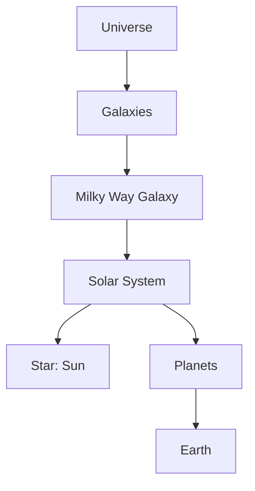
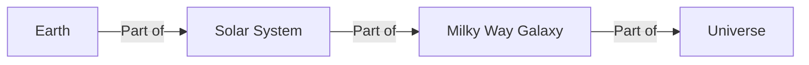

<<<FILE_START: index.mdx>>>
---
title: "Beyond Earth"
description: "An introduction to the wonders of the night sky, stars, constellations, and our Solar System."
date: 2024-04-10
tags: ["science", "space", "astronomy", "solar-system", "grade-6"]
order: 1
draft: false
---

import Callout from '@/components/Callout.astro'

# Beyond Earth

Welcome to the study of the universe beyond our planet! Have you ever looked up at the night sky in a place with very few city lights, like the Nubra region in Ladakh? If you have, you likely saw thousands of stars, a breathtaking sight that has fascinated humans for thousands of years.

In this chapter, we will explore what lies beyond the Earth—from the patterns in the stars to the planets in our Solar System and the vast galaxies that make up the universe.

## Chapter Overview

We will cover the following key topics:

1.  **Stars and Constellations**: Understanding star patterns and how to identify them.
2.  **Night Sky Watching**: How to observe the sky and the impact of light pollution.
3.  **The Solar System**: The Sun, the eight planets, and their characteristics.
4.  **Other Celestial Bodies**: Moons, asteroids, comets, and meteoroids.
5.  **Galaxies and the Universe**: Our place in the Milky Way and the cosmos.

<Callout variant="tip">
**Activity:** Before you begin, try to find a dark spot away from streetlights tonight. Look up and see if you can find any patterns in the stars. Do any look like animals or objects?
</Callout>

## Key Terminology

| Term | Definition |
| :--- | :--- |
| **Star** | A massive ball of hot gas that emits its own light and heat (e.g., the Sun). |
| **Constellation** | A group of stars that appears to form a pattern or shape in the sky. |
| **Planet** | A large, spherical object that revolves around a star and does not emit its own light. |
| **Satellite** | An object that moves around a planet. The Moon is a natural satellite of Earth. |
| **Orbit** | The path followed by a planet or satellite as it revolves around another body. |
| **Light Pollution** | Excessive artificial light that makes it difficult to see stars in the night sky. |

Let's begin our journey by looking at the twinkling lights in the sky: the stars.
<<<FILE_END>>>

<<<FILE_START: topics/01-stars-and-constellations.mdx>>>
---
title: "Stars and Constellations"
description: "Learn about stars, how they form patterns called constellations, and how to identify the Pole Star."
date: 2024-04-10
tags: ["stars", "constellations", "orion", "big-dipper", "pole-star"]
order: 2
draft: false
---

import Callout from '@/components/Callout.astro'

## What are Stars?

At night, the sky is filled with tiny points of light. These are **stars**. Stars are huge balls of hot gases that shine with their own light. Some stars are bright, while others are dim. Although they look small, they are actually massive; they appear small only because they are very far away from us.

<Callout variant="info">
**Did you know?** The Sun is also a star! It looks much bigger and brighter than other stars because it is much closer to Earth.
</Callout>

## Constellations

Long ago, our ancestors noticed that groups of stars formed patterns that looked like familiar objects, animals, or characters. These groups of stars are called **constellations**.

*   **Definition:** A group of stars forming a recognizable pattern.
*   **Official Count:** The International Astronomical Union (IAU) officially lists **88 constellations**.
*   **Indian Astronomy:** In India, these patterns or regions are often referred to as *Nakshatras*.

### Major Constellations

#### 1. Ursa Major (The Great Bear) / Big Dipper
The **Big Dipper** is a distinct pattern of seven stars found within the constellation Ursa Major. In India, it is known as **Saptaṛiṣhi** (Seven Sages). It looks like a large ladle or a question mark.

#### 2. Ursa Minor (The Little Bear) / Little Dipper
This constellation also looks like a ladle but is smaller and less bright than the Big Dipper. The **Pole Star** (Polaris) is located at the end of the handle of the Little Dipper.

#### 3. Orion (The Hunter)
Orion is one of the most magnificent constellations, visible during winter. It looks like a hunter with a belt, sword, and shield.
*   **The Belt:** Three bright stars in a straight line in the middle.
*   **Betelgeuse:** A reddish star at the hunter's shoulder (called *Ārdrā* in India).
*   **Rigel:** A bright bluish star at the hunter's foot.

### Finding the Pole Star (Dhruva Tārā)

The **Pole Star** (Polaris) is special because it appears stationary in the North direction. While other stars rise and set due to Earth's rotation, the Pole Star remains fixed because it lies almost directly above the Earth's North Pole.

**How to find it:**
1.  Locate the **Big Dipper**.
2.  Find the two stars at the outer edge of the ladle's bowl (often called "pointer stars").
3.  Draw an imaginary line extending from these two stars towards the North.
4.  This line points directly to a not-very-bright star: the Pole Star.

  <svg width="400" height="300" viewBox="0 0 400 300" xmlns="http://www.w3.org/2000/svg">
    <!-- Background -->
    <rect width="400" height="300" fill="transparent" />
    
    <!-- Big Dipper Stars -->
    <circle cx="50" cy="100" r="3" fill="currentColor" /> <!-- Alkaid -->
    <circle cx="80" cy="115" r="3" fill="currentColor" /> <!-- Mizar -->
    <circle cx="110" cy="140" r="3" fill="currentColor" /> <!-- Alioth -->
    <circle cx="140" cy="160" r="3" fill="currentColor" /> <!-- Megrez (start of bowl) -->
    <circle cx="140" cy="200" r="3" fill="currentColor" /> <!-- Phecda -->
    <circle cx="200" cy="200" r="3" fill="currentColor" /> <!-- Merak (Pointer 1) -->
    <circle cx="200" cy="160" r="3" fill="currentColor" /> <!-- Dubhe (Pointer 2) -->

    <!-- Connecting Lines Big Dipper -->
    <line x1="50" y1="100" x2="80" y2="115" stroke="currentColor" stroke-width="1" />
    <line x1="80" y1="115" x2="110" y2="140" stroke="currentColor" stroke-width="1" />
    <line x1="110" y1="140" x2="140" y2="160" stroke="currentColor" stroke-width="1" />
    <line x1="140" y1="160" x2="140" y2="200" stroke="currentColor" stroke-width="1" />
    <line x1="140" y1="200" x2="200" y2="200" stroke="currentColor" stroke-width="1" />
    <line x1="200" y1="200" x2="200" y2="160" stroke="currentColor" stroke-width="1" />
    <line x1="200" y1="160" x2="140" y2="160" stroke="currentColor" stroke-width="1" />

    <!-- Pole Star -->
    <circle cx="350" cy="60" r="4" fill="currentColor" />
    <text x="360" y="65" fill="currentColor" font-size="12">Pole Star (Polaris)</text>

    <!-- Pointer Line -->
    <line x1="200" y1="200" x2="345" y2="65" stroke="currentColor" stroke-width="1" stroke-dasharray="5,5" />
    <text x="210" y="140" fill="currentColor" font-size="10">Pointer Stars</text>
    <text x="100" y="240" fill="currentColor" font-size="14">Big Dipper (Ursa Major)</text>
  </svg>

### Sirius: The Brightest Star

**Sirius** is the brightest star in the night sky. It is located in the constellation **Canis Major** (The Great Dog).

**How to find it:**
1.  Locate **Orion**.
2.  Find the three stars in Orion's belt.
3.  Imagine a straight line passing through these three stars stretching towards the **East**.
4.  This line will lead you to a very bright star: Sirius.
<<<FILE_END>>>

<<<FILE_START: topics/02-night-sky-watching.mdx>>>
---
title: "Night Sky Watching"
description: "Tips for observing the sky, understanding light pollution, and using tools."
date: 2024-04-10
tags: ["sky-watching", "light-pollution", "telescope"]
order: 3
draft: false
---

import Callout from '@/components/Callout.astro'

## Conditions for Sky Watching

To see the maximum number of stars, you need specific conditions. If you live in a big city, you might only see a few bright stars. However, in a village or a high-altitude region like Ladakh, you can see thousands.

**Factors affecting visibility:**
1.  **Light Pollution:** Excessive artificial light from streetlamps, buildings, and vehicles makes the sky bright, hiding fainter stars.
2.  **Atmosphere:** Smoke, dust, and clouds can block the view.
3.  **Moonlight:** A full moon is very bright and washes out dim stars. A **moonless night** (New Moon) is best for observing stars.

<Callout variant="warning">
**Caution:** Never observe the night sky in a dark, lonely place alone. Always go with an adult.
</Callout>

## Tools for Observation

While naked-eye observation is great for constellations, optical instruments help us see more detail.

*   **Binoculars:** Good for seeing craters on the Moon and some large star clusters.
*   **Telescope:** An instrument that gathers more light than the human eye, allowing us to see faint objects, planets, and distant galaxies.
*   **Sky Maps/Apps:** Apps like *Sky Map* or *Stellarium* on mobile phones help identify stars and planets by pointing the phone at the sky.

### Dark Sky Reserves
Because light pollution is growing, some areas are designated as **Dark Sky Reserves**. In these areas, artificial light is strictly controlled to keep the sky dark for astronomy.
*   **Example:** The **Hanle Dark Sky Reserve (HDSR)** in Ladakh, India, is one of the highest observatories in the world.

## Why do Stars Twinkle?
Stars appear as tiny points of light because they are very far away. The Earth's atmosphere is constantly moving (turbulent). As starlight passes through these moving layers of air, it bends slightly in different directions, making the star appear to twinkle. Planets, being closer and appearing as small disks rather than points, usually do not twinkle.
<<<FILE_END>>>

<<<FILE_START: topics/03-our-solar-system-sun.mdx>>>
---
title: "The Sun and Solar System"
description: "Introduction to the Sun and the structure of our Solar System."
date: 2024-04-10
tags: ["sun", "solar-system", "astronomical-unit"]
order: 4
draft: false
---

import Callout from '@/components/Callout.astro'

## What is the Solar System?

The **Solar System** consists of the Sun and all the objects that orbit (move around) it due to its gravity. This includes:
*   The Sun (our star).
*   Eight Planets.
*   Dwarf planets (like Pluto).
*   Satellites (Moons).
*   Asteroids, Comets, and Meteoroids.

## The Sun

The Sun is the center of our Solar System.
*   **Type:** It is a **star**.
*   **Composition:** An extremely hot, spherical ball of gases (mostly hydrogen and helium).
*   **Significance:** It is the ultimate source of heat and light for the Solar System. Without the Sun, life on Earth would not exist.
*   **Size:** It is huge—about **100 times wider** than Earth in diameter.
*   **Distance:** It is about **150 million kilometers** away from Earth.

<Callout variant="tip">
**Astronomical Unit (au):** The average distance between the Sun and the Earth (approx. 150 million km) is defined as 1 Astronomical Unit. It is used to measure distances within the solar system.
</Callout>

### Why does the Sun look so big?
The Sun looks like a large disk, while other stars look like pinpoints. This is because the Sun is much closer to us than any other star. The next nearest star, **Proxima Centauri**, is about 269,000 au away!

### Revolution and Rotation
*   **Revolution:** The movement of an object *around* the Sun. Earth takes ~365 days to complete one revolution.
*   **Rotation:** The spinning of an object on its own axis. Earth takes 24 hours to complete one rotation (causing Day and Night).
<<<FILE_END>>>

<<<FILE_START: topics/04-planets.mdx>>>
---
title: "The Planets"
description: "Detailed look at the eight planets of our solar system."
date: 2024-04-10
tags: ["planets", "mercury", "venus", "earth", "mars", "jupiter", "saturn", "uranus", "neptune"]
order: 5
draft: false
---

import Callout from '@/components/Callout.astro'

## Overview of Planets

A **planet** is a large celestial body that revolves around a star and is spherical in shape. Planets do not have their own light; they shine by reflecting sunlight.

There are **eight** planets in our Solar System. In order of distance from the Sun, they are:

1.  Mercury (Budha)
2.  Venus (Śhukra)
3.  Earth (Pṛithvī)
4.  Mars (Mangala)
5.  Jupiter (Bṛihaspati)
6.  Saturn (Śhani)
7.  Uranus
8.  Neptune

  <svg width="600" height="300" viewBox="0 0 600 300" xmlns="http://www.w3.org/2000/svg">
    <!-- Sun -->
    <circle cx="50" cy="150" r="40" fill="orange" stroke="currentColor" stroke-width="2" />
    <text x="35" y="155" fill="black" font-size="12" font-weight="bold">Sun</text>

    <!-- Orbits and Planets (Not to scale) -->
    <!-- Mercury -->
    <path d="M 100 150 A 10 30 0 0 1 100 150" fill="none" /> 
    <circle cx="110" cy="150" r="4" fill="gray" />
    <text x="105" y="170" fill="currentColor" font-size="10">Mercury</text>

    <!-- Venus -->
    <circle cx="150" cy="150" r="8" fill="#d4a017" />
    <text x="140" y="175" fill="currentColor" font-size="10">Venus</text>

    <!-- Earth -->
    <circle cx="200" cy="150" r="9" fill="blue" />
    <text x="190" y="175" fill="currentColor" font-size="10">Earth</text>

    <!-- Mars -->
    <circle cx="250" cy="150" r="6" fill="red" />
    <text x="240" y="175" fill="currentColor" font-size="10">Mars</text>

    <!-- Asteroid Belt Representation -->
    <text x="280" y="150" fill="currentColor" font-size="10">.:.:.</text>

    <!-- Jupiter -->
    <circle cx="330" cy="150" r="25" fill="#bcafb2" />
    <text x="315" y="190" fill="currentColor" font-size="10">Jupiter</text>

    <!-- Saturn -->
    <circle cx="410" cy="150" r="20" fill="#f4d03f" />
    <ellipse cx="410" cy="150" rx="30" ry="8" fill="none" stroke="currentColor" />
    <text x="400" y="190" fill="currentColor" font-size="10">Saturn</text>

    <!-- Uranus -->
    <circle cx="480" cy="150" r="15" fill="lightblue" />
    <text x="470" y="180" fill="currentColor" font-size="10">Uranus</text>

    <!-- Neptune -->
    <circle cx="540" cy="150" r="14" fill="darkblue" />
    <text x="530" y="180" fill="currentColor" font-size="10">Neptune</text>
  </svg>

## Inner Planets
The first four planets are called the **Inner Planets**. They are smaller, made of rock, and have solid surfaces.

1.  **Mercury:** Nearest to the Sun. It is very hot during the day and very cold at night.
2.  **Venus:** The brightest planet in our sky. Often called the **Morning Star** or **Evening Star**. It is the hottest planet because its thick atmosphere traps heat.
3.  **Earth:** The **Blue Planet**. It is the only planet known to support life due to the presence of liquid water and a suitable atmosphere.
4.  **Mars:** The **Red Planet**. It appears red due to iron oxide (rust) in its soil. It has two moons.

## Outer Planets
The last four planets are called the **Outer Planets** or **Gas Giants**. They are very large and made mostly of gases. They all have rings (though Saturn's are most visible).

5.  **Jupiter:** The largest planet in the Solar System.
6.  **Saturn:** Famous for its beautiful rings made of ice and dust.
7.  **Uranus:** Looks blue-green.
8.  **Neptune:** The farthest planet from the Sun, very cold and windy.

<Callout variant="info">
**Planetary Motion:** Planets generally move from West to East in their orbits, which is why we see them shift positions against the background stars over weeks or months.
</Callout>
<<<FILE_END>>>

<<<FILE_START: topics/05-moons-asteroids-comets.mdx>>>
---
title: "Moons, Asteroids, and Comets"
description: "Exploring the smaller bodies of the solar system: Satellites, Asteroids, and Comets."
date: 2024-04-10
tags: ["moon", "satellites", "asteroids", "comets", "pluto"]
order: 6
draft: false
---

import Callout from '@/components/Callout.astro'

## Natural Satellites (Moons)
A **satellite** is any object that orbits a planet.
*   **Natural Satellites:** Celestial bodies orbiting planets (e.g., the Moon).
*   **Artificial Satellites:** Man-made machines sent into space (e.g., for communication).

### The Earth's Moon
*   **Distance:** Approx 3,84,000 km.
*   **Revolution Period:** ~27 days.
*   **Surface:** Dusty and barren with many **craters** (bowl-like depressions formed by space rocks hitting the surface).
*   **Atmosphere:** No air or water, so no life exists there.

<Callout variant="tip">
**Exploration:** India has sent successful missions to the Moon, including **Chandrayaan-3**, which landed near the Moon's South Pole in 2023.
</Callout>

## Asteroids
Asteroids are small, rocky objects that orbit the Sun. They are too small to be called planets.
*   **Asteroid Belt:** Most asteroids are found in a belt between the orbits of **Mars** and **Jupiter**.

## Comets
Comets are lumps of ice, dust, and rock.
*   **Structure:** When a comet comes close to the Sun, the heat causes the ice to vaporize, creating a glowing head and a long tail that points *away* from the Sun.
*   **Orbits:** They have very long, elliptical orbits.
*   **Example:** **Halley's Comet**, which is visible from Earth approximately every 76 years.

## Dwarf Planets
Some objects orbit the Sun but are not large enough to clear their path of other debris. These are called **Dwarf Planets**.
*   **Pluto:** Once considered the 9th planet, it was reclassified as a dwarf planet by the IAU in 2006.
<<<FILE_END>>>

<<<FILE_START: topics/06-galaxy-and-universe.mdx>>>
---
title: "The Galaxy and The Universe"
description: "Understanding our place in the Milky Way and the vast Universe."
date: 2024-04-10
tags: ["galaxy", "milky-way", "universe", "exoplanets"]
order: 7
draft: false
---

import Callout from '@/components/Callout.astro'

## The Milky Way Galaxy
A **galaxy** is a massive system of billions of stars, gas, and dust held together by gravity.
*   **Our Galaxy:** Our Solar System belongs to the **Milky Way Galaxy** (known as *Ākāśha Gangā* in Hindi).
*   **Appearance:** From a dark location on Earth, it looks like a faint, milky band of light stretching across the sky.

## The Universe
The **Universe** contains everything that exists—all matter, energy, planets, stars, and galaxies.
*   It contains billions of galaxies.
*   Scientists are constantly studying the universe to understand its origin and size.

### Hierarchy of the Cosmos

## Are we alone?
Scientists are searching for **Exoplanets** (planets orbiting other stars) to see if life exists elsewhere. While no life has been found yet, the search continues using powerful telescopes.
<<<FILE_END>>>

<<<FILE_START: solutions/ex-12-1.mdx>>>
---
title: "Exercises: Let us enhance our learning"
description: "Solutions to the textbook exercises for Chapter 12."
date: 2024-04-10
tags: ["solutions", "grade-6", "exercises"]
order: 8
draft: false
---

import Callout from '@/components/Callout.astro'

## 1. Match the Column

**Match the items in Column I with Column II.**

| Column I | Column II | Correct Match |
| :--- | :--- | :--- |
| (i) Satellite of Earth | (a) Orion | **(d) Moon** |
| (ii) Red Planet | (b) Venus | **(c) Mars** |
| (iii) Constellation | (c) Mars | **(a) Orion** |
| (iv) Planet called evening star | (d) Moon | **(b) Venus** |

---

## 2. Riddles

**(i) Solve the following riddle:**
*My first alphabet is in MAN but not in CAN* -> **M**
*My second alphabet is in ACE and also in FAN* -> **A**
*My third alphabet is in RAT and not in CAT* -> **R**
*My fourth alphabet is in SUN but not in FUN* -> **S**
*I am a planet that moves around the Sun.*

**Answer:** **MARS**

**(ii) Make two similar riddles by yourself:**

*Riddle 1 (Earth):*
My first is in EGG but not in DOG -> **E**
My second is in ANT and also in RAT -> **A**
My third is in RED but not in BED -> **R**
My fourth is in TEN but not in HEN -> **T**
My fifth is in HOT but not in POT -> **H**
**Answer: EARTH**

*Riddle 2 (Sun):*
My first is in SEA but not in TEA -> **S**
My second is in CUP but not in CAP -> **U**
My third is in NET but not in PET -> **N**
I am a hot ball of fire.
**Answer: SUN**

---

## 3. Multiple Choice

**Which of the following is not a member of our Solar System?**
(i) Sirius
(ii) Comets
(iii) Asteroids
(iv) Pluto

**Answer:** **(i) Sirius**.
*Explanation: Sirius is a star located far outside our solar system. Comets, asteroids, and Pluto (dwarf planet) orbit our Sun.*

---

## 4. Planet Identification

**Which of the following is not a planet of the Sun?**
(i) Jupiter
(ii) Pluto
(iii) Neptune
(iv) Saturn

**Answer:** **(ii) Pluto**.
*Explanation: Pluto is classified as a dwarf planet, not a primary planet.*

---

## 5. Brighter Star

**Which is the brighter star, the Pole Star or Sirius?**

**Answer:** **Sirius**.
*Explanation: Sirius is the brightest star in the night sky. The Pole Star (Polaris) is not very bright.*

---

## 6. Order of Planets

**An artist’s representation of the Solar System is given in Fig. 12.12. Is the order of the planets correct? If not, write the correct order.**

**Answer:** No, the order in the figure might be jumbled. The correct order from the Sun is:
1.  Mercury
2.  Venus
3.  Earth
4.  Mars
5.  Jupiter
6.  Saturn
7.  Uranus
8.  Neptune

---

## 7. Identify Patterns (Diagram Activity)

**A portion of night sky with stars is shown. Identify Big Dipper, Little Dipper, and Pole Star.**

*   **Big Dipper:** Look for the 7 stars forming a large spoon/ladle shape.
*   **Little Dipper:** Look for a smaller ladle shape nearby, which is generally inverted relative to the Big Dipper.
*   **Pole Star:** The star at the very end of the Little Dipper's handle.

---

## 8. Identify Orion (Diagram Activity)

**Draw lines to connect stars for Orion and label Sirius.**

*   **Orion:** Connect the four outer stars to form a rectangle (shoulders and knees) and the three stars in the middle to form the belt.
*   **Sirius:** Extend the line of the belt towards the left/down (East) to find the bright star Sirius.

---

## 9. Stars at Dawn/Dusk

**You can see stars fading away at dawn and appearing at dusk. During the day we do not see the stars. Explain why.**

**Answer:** Stars are present in the sky during the day, but we cannot see them because of the glare of the Sun. The Sun is very close to Earth, making its light extremely bright. This intense sunlight scatters in the Earth's atmosphere, turning the sky blue and outshining the faint light of distant stars.

---

## 10. Movement of Big Dipper

**Does the Big Dipper appear to move?**

**Answer:** Yes, the Big Dipper appears to move around the Pole Star.
*   **Observation:** If you observe it at intervals of 2-3 hours, you will see the constellation rotating counter-clockwise around the North Star.
*   **Reason:** This apparent movement is due to the rotation of the Earth on its axis. Since the North Pole points to the Pole Star, that star appears stationary, while everything else appears to circle it.

---

## 11. Creative Writing

**Think about the night sky and write a poem or a story on it.**

*(Sample Poem)*
*Upon the velvet cloak of night,*
*A thousand diamonds shining bright.*
*The Hunter stands with belt and sword,*
*The Great Bear wanders, never bored.*
*The Moon, a lantern, soft and pale,*
*Guides the comet’s icy tail.*
*So many worlds, so far away,*
*Waiting for the break of day.*
<<<FILE_END>>>

<<<FILE_START: practice/solved-examples.mdx>>>
---
title: "Practice Questions & Solved Examples"
description: "Additional questions and conceptual problems to strengthen understanding of Beyond Earth."
date: 2024-04-10
tags: ["practice", "solar-system", "extra-questions"]
order: 9
draft: false
---

import Callout from '@/components/Callout.astro'

## Conceptual Questions

### Question 1: Why is Venus hotter than Mercury?
**Question:** Mercury is the closest planet to the Sun, yet Venus is the hottest planet in the Solar System. Why?

**Answer:**
Mercury has a very thin atmosphere that cannot hold heat. Venus, however, has a very thick atmosphere made mostly of carbon dioxide. This atmosphere acts like a blanket, trapping the Sun's heat (Greenhouse Effect), making Venus hotter than Mercury.

### Question 2: How can we distinguish a planet from a star in the night sky?
**Answer:**
1.  **Twinkling:** Stars usually twinkle due to the atmosphere, while planets shine with a steady light.
2.  **Movement:** Planets change their position relative to the stars over days or weeks (they wander), while stars keep their fixed patterns (constellations).

### Question 3: Why do we see phases of the Moon?
**Answer:**
We see different shapes of the Moon (phases) because the Moon does not have its own light; it reflects sunlight. As the Moon revolves around the Earth, we see different portions of its sunlit side.

## Solar System Facts Review

**Fill in the blanks:**

1.  The path a planet takes around the Sun is called its \_\_\_\_\_\_\_\_. (**Orbit**)
2.  The Indian name for the Milky Way galaxy is \_\_\_\_\_\_\_\_. (**Akasha Ganga**)
3.  \_\_\_\_\_\_\_\_ are also known as "shooting stars" though they are not stars. (**Meteors**)
4.  The planet known as the "Red Planet" is \_\_\_\_\_\_\_\_. (**Mars**)

## Diagram Practice: Solar System Hierarchy

Can you visualize the order of our cosmic address?

## Critical Thinking

**Scenario:** You are stranded on an island without a compass. It is a clear night. How can you find the North direction?

**Solution:**
1.  Look for the **Big Dipper** constellation (shaped like a large spoon).
2.  Identify the two "pointer stars" at the outer edge of the spoon's bowl.
3.  Trace an imaginary line through them.
4.  This line points to a moderately bright star, the **Pole Star (Polaris)**.
5.  Face the Pole Star. You are now facing **North**.
<<<FILE_END>>>
