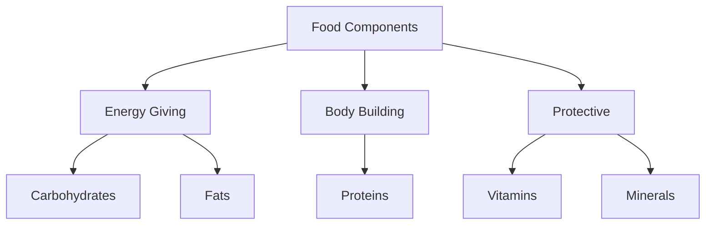
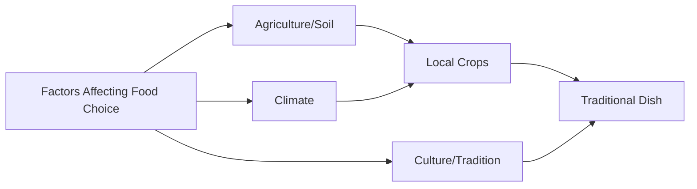
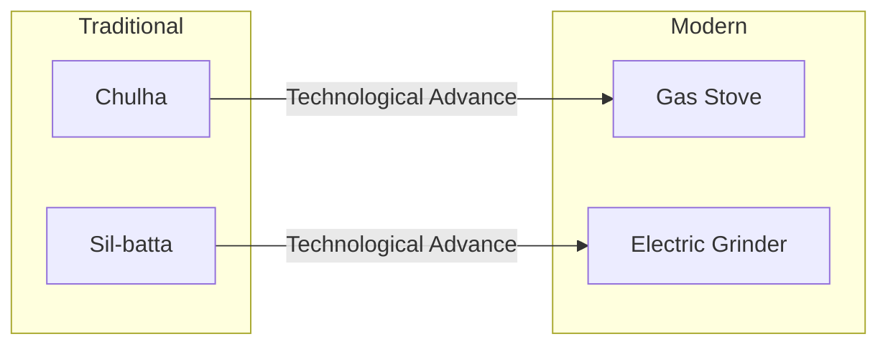
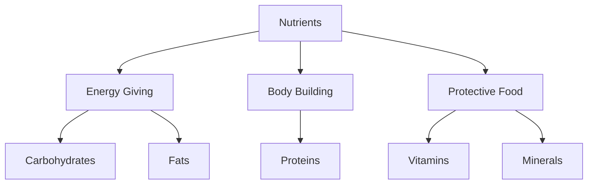
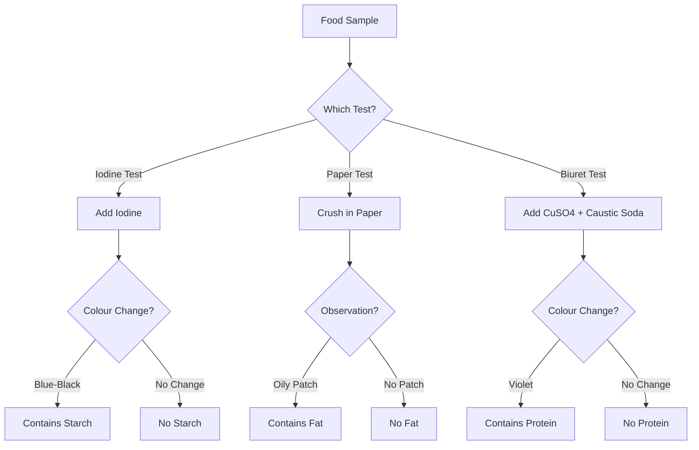
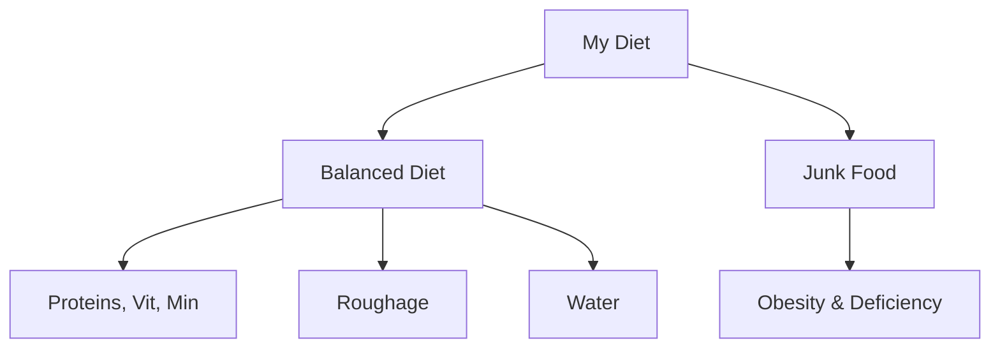
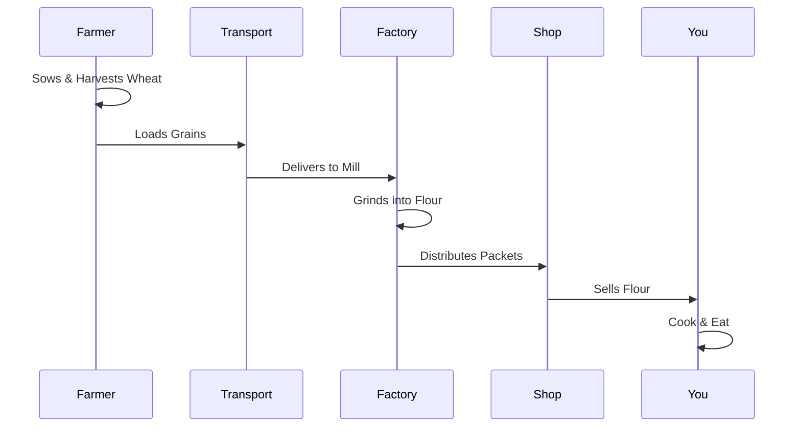

<<<FILE_START: index.mdx>>>
---
title: "Mindful Eating: A Path to a Healthy Body"
description: "Chapter 3 overview covering food diversity, components of food (nutrients), balanced diets, and the journey of food from farm to plate."
date: 2025-01-22
tags: ["science", "grade-6", "food", "nutrition", "health"]
order: 1
draft: false
---

import Callout from '@/components/Callout.astro'

# Mindful Eating: A Path to a Healthy Body

Welcome to Chapter 3. In this chapter, we explore the fundamental question: **"What do we eat and why?"** We will journey through the diversity of food across India, understand the science of nutrients, learn how to test for them, and discover the journey of food from the farm to our plates.

## Introduction

The chapter begins with a profound Sanskrit saying:

> **"Annena jātāni jivanti"**  
> *(Food gives life to living beings)*

Food is not just about taste; it is the fuel for our body, a part of our culture, and a result of hard work by farmers.

### Chapter Roadmap

We have organized this chapter into the following key topics:

1.  **Food Diversity & Regions**: Understanding how geography influences what we eat.
2.  **Culinary Practices**: How cooking methods have evolved from traditional to modern times.
3.  **Components of Food**: A deep dive into Carbohydrates, Fats, Proteins, Vitamins, and Minerals.
4.  **Testing Nutrients**: Practical laboratory methods to detect Starch, Proteins, and Fats.
5.  **Balanced Diet**: The importance of eating right and the role of Millets.
6.  **Food Miles**: Tracing the journey of food and understanding its environmental impact.

<Callout variant="tip">
**Core Concept:** "Health is the Ultimate Wealth." (Dr. Poshita). Eating wholesome food in moderate quantities, appropriate for the season and place, is the key to good health.
</Callout>

## Formula Sheet & Key Definitions

| Term | Definition |
| :--- | :--- |
| **Nutrients** | Components of food that provide energy, support growth, repair tissues, and protect from diseases. |
| **Carbohydrates** | Primary source of energy (e.g., cereals, potatoes, sugar). |
| **Fats** | Source of stored energy; provides warmth (e.g., ghee, oil, nuts). |
| **Proteins** | Body-building foods required for growth and repair (e.g., pulses, milk, meat). |
| **Vitamins & Minerals** | Protective nutrients needed in small amounts to fight diseases. |
| **Roughage** | Dietary fibres that help in digestion and bowel movement. |
| **Balanced Diet** | A diet containing all essential nutrients, roughage, and water in the right amounts. |
| **Food Miles** | The distance food travels from the producer (farm) to the consumer (plate). |
| **Fortification** | Adding extra nutrients to food during processing to improve nutritional quality (e.g., Iodised salt). |

## Quick Logic: Nutrient Function

<<<FILE_END>>>
<<<FILE_START: topics/01-food-diversity.mdx>>>
---
title: "Food Variety and Regional Diversity"
description: "Exploring how food habits vary across different states of India based on climate and culture."
date: 2025-01-22
tags: ["food-diversity", "culture", "geography"]
order: 2
draft: false
---

import Callout from '@/components/Callout.astro'

## Food in Different Regions

India is a vast country with diverse soil types, climates, and cultures. This diversity is reflected in the food we eat. Have you noticed that your friend's tiffin might contain *Idli* while yours has *Paratha*?

### Why does food vary?
The traditional food of a state is usually based on the **crops grown in that state**.
*   **Geography:** Coastal areas eat more rice and fish.
*   **Climate:** Areas with less rain might consume more millets like Bajra.
*   **Culture:** Festivals and traditions influence special dishes.

### Regional Food Map

Below is a compilation of traditional foods from various states (based on Table 3.2 in your textbook).

| State | Locally Grown Crops | Traditional Food Items | Beverages |
| :--- | :--- | :--- | :--- |
| **Punjab** | Maize, Wheat, Chickpea | *Makki di roti, Sarson da saag, Chhole bhature* | Lassi, Chhach |
| **Karnataka** | Rice, Ragi, Urad, Coconut | *Idli, Dosa, Ragi mudde, Palya, Rasam* | Buttermilk, Coffee |
| **Manipur** | Rice, Bamboo, Soybean | *Eromba, Utti, Singju, Kangsoi* | Black Tea |
| **Gujarat** | Bajra, Wheat, Cotton | *Thepla, Dhokla, Undhiyu* | Chaas |
| **West Bengal** | Rice, Jute, Mustard | *Maach Bhaat (Fish curry), Rosogolla* | Tea |

<Callout variant="tip">
**Activity Insight:** When you analyze the food habits, you will find that **staple foods** (like rice or wheat) are common across many states, but the *way* they are cooked and the side dishes vary significantly.
</Callout>

### Factors Influencing Food Choices
1.  **Cultivation:** What grows locally is eaten locally.
2.  **Taste Preferences:** Developed over generations.
3.  **Economy:** Availability and cost of ingredients.
4.  **Traditions:** Religious or cultural dietary rules.

<<<FILE_END>>>
<<<FILE_START: topics/02-culinary-practices.mdx>>>
---
title: "Culinary Practices: Then and Now"
description: "How cooking methods and tools have evolved over time."
date: 2025-01-22
tags: ["cooking", "technology", "history"]
order: 3
draft: false
---

import Callout from '@/components/Callout.astro'

## Evolution of Cooking

**Culinary practices** refer to the art and practice of cooking. Just as the food we eat has changed, the way we prepare it has also evolved. This change is driven by technological development, lifestyle changes, and convenience.

### Traditional vs. Modern Methods

We can observe a significant shift in tools and techniques.

| Aspect | Traditional Method | Modern Method | Impact |
| :--- | :--- | :--- | :--- |
| **Cooking Heat** | **Chulha** (Wood/Coal fire) | **Gas Stove / Induction** | Modern is faster, less smoky, and cleaner. |
| **Grinding** | **Sil-batta** (Stone grinder) | **Electrical Grinder/Mixer** | Modern saves immense physical effort and time. |
| **Preservation** | Drying, Salting, Pickling | Refrigeration, Canning | Modern allows food to last longer without high salt/oil. |

### Why have these changes occurred?
1.  **Technology:** Invention of electricity and gas distribution.
2.  **Time:** Modern life is faster; people need quick cooking solutions.
3.  **Communication:** We learn recipes from all over the world via the internet/TV.
4.  **Transportation:** Ingredients from far away are now available locally.

<Callout variant="warning">
**Critical Thinking:** While modern methods are convenient, some traditional methods (like slow cooking in clay pots) are believed to retain more nutrients. It is important to balance convenience with health.
</Callout>

### Diagram: The Shift in Cooking Tools

<<<FILE_END>>>
<<<FILE_START: topics/03-components-of-food.mdx>>>
---
title: "Components of Food (Nutrients)"
description: "Detailed explanation of Carbohydrates, Fats, Proteins, Vitamins, and Minerals."
date: 2025-01-22
tags: ["nutrients", "biology", "health"]
order: 4
draft: false
---

import Callout from '@/components/Callout.astro'

## What are Nutrients?

Food components that provide energy, support growth, help repair tissues, and protect our body from diseases are called **nutrients**.

The major nutrients are:
1.  **Carbohydrates**
2.  **Fats**
3.  **Proteins**
4.  **Vitamins**
5.  **Minerals**

In addition to these, our body needs **Dietary Fibres (Roughage)** and **Water**.

---

### 1. Carbohydrates (Energy-Giving Food)
*   **Function:** Provide instant energy to the body.
*   **Types:** Sugar (Simple) and Starch (Complex).
*   **Sources:**
    *   *Cereals:* Wheat, Rice, Maize, Bajra.
    *   *Vegetables:* Potato, Sweet potato.
    *   *Fruits:* Banana, Mango, Sugarcane.
    *   *Others:* Sugar, Honey/Jaggery.

<Callout variant="tip">
**Did you know?** Glucose is a simple carbohydrate that provides *instant* energy. This is why marathon runners drink glucose water.
</Callout>

---

### 2. Fats (Energy-Giving Food)
*   **Function:** Provide stored energy and keep the body warm. They provide *more* energy than carbohydrates for the same amount.
*   **Sources:**
    *   *Plant sources:* Groundnuts, nuts (walnut, almond), coconut oil, sunflower oil, mustard oil.
    *   *Animal sources:* Ghee, butter, milk, cream, meat, fish, eggs.

---

### 3. Proteins (Body-Building Food)
*   **Function:** Essential for the growth and repair of body tissues.
*   **Sources:**
    *   *Plant sources:* Pulses (Gram, Moong, Tur dal), Beans, Soyabean, Peas.
    *   *Animal sources:* Meat, Fish, Eggs, Milk, Paneer.

---

### 4. Vitamins & Minerals (Protective Food)
These are required in small quantities but are crucial for protecting the body against diseases and maintaining healthy eyes, bones, teeth, and gums.

#### Vitamin & Mineral Deficiency Chart

| Nutrient | Function | Sources | Deficiency Disease | Symptoms |
| :--- | :--- | :--- | :--- | :--- |
| **Vitamin A** | Keeps eyes/skin healthy | Papaya, Carrot, Milk | **Night Blindness** | Poor vision, loss of vision in darkness. |
| **Vitamin B1** | Heart & nerve function | Whole grains, Nuts | **Beriberi** | Weak muscles, little energy to work. |
| **Vitamin C** | Fights diseases | Citrus fruits (Amla, Lemon) | **Scurvy** | Bleeding gums, wounds take longer to heal. |
| **Vitamin D** | Helps absorb Calcium | Sunlight, Milk, Fish | **Rickets** | Soft and bent bones. |
| **Calcium** | Bone & tooth health | Milk, Eggs | **Bone & Tooth Decay** | Weak bones, tooth decay. |
| **Iodine** | Thyroid function | Iodised salt, Seafood | **Goitre** | Swollen gland in neck. |
| **Iron** | Blood formation | Spinach, Apple, Liver | **Anaemia** | Weakness. |

---

### 5. Roughage (Dietary Fibres)
*   **Function:** Does not provide nutrients but adds bulk to food. It helps the body get rid of undigested food (prevents constipation).
*   **Sources:** Whole grains, pulses, fresh fruits, vegetables (potatoes).

### 6. Water
*   **Function:** Helps absorb nutrients from food and excrete waste as urine and sweat.

---

### Case Studies from History
*   **Scurvy:** Sailors used to get bleeding gums due to lack of fresh fruits. James Lind discovered lemons/oranges (Vit C) cured it.
*   **Goitre:** People in Himalayan regions suffered from swollen necks due to low iodine in soil. Iodised salt solved this problem.

<<<FILE_END>>>
<<<FILE_START: topics/04-testing-nutrients.mdx>>>
---
title: "Laboratory Tests for Nutrients"
description: "How to test food items for the presence of Starch, Fats, and Proteins."
date: 2025-01-22
tags: ["experiment", "lab", "chemistry"]
order: 5
draft: false
---

import Callout from '@/components/Callout.astro'

## Testing Food Components

We can scientifically verify which nutrients are present in food using simple chemical tests.

<Callout variant="warning">
**Safety First:** Do not taste chemicals. Handle acids and glass with care under teacher supervision.
</Callout>

### 1. Test for Starch (Carbohydrate)
Starch turns blue-black when it reacts with Iodine.

*   **Materials:** Dilute Iodine solution, dropper, food sample (e.g., potato).
*   **Procedure:**
    1.  Take a small quantity of the food item.
    2.  Add 2-3 drops of dilute **Iodine solution** to it.
    3.  Observe the colour change.
*   **Observation:** If the food turns **Blue-Black**, it contains Starch.

### 2. Test for Fats
Fats leave an oily stain on paper.

*   **Materials:** Paper, food sample (e.g., peanut).
*   **Procedure:**
    1.  Wrap the food item in a piece of paper and crush it (don't tear the paper).
    2.  Straighten the paper and hold it against the light.
*   **Observation:** An **oily transparent patch** indicates the presence of Fat. (If the paper is just wet from water, let it dry; water evaporates, oil does not).

### 3. Test for Proteins
Proteins react with Copper Sulphate and Caustic Soda to turn Violet.

*   **Materials:** Copper Sulphate solution, Caustic Soda solution, test tube, dropper, food paste (e.g., mashed dal).
*   **Procedure:**
    1.  Make a paste of the food item and put it in a test tube with some water. Shake well.
    2.  Add **2 drops** of Copper Sulphate solution.
    3.  Add **10 drops** of Caustic Soda solution.
    4.  Shake well and let it stand.
*   **Observation:** A **Violet** colour indicates the presence of Protein.

### Logic Flow for Testing

<<<FILE_END>>>
<<<FILE_START: topics/05-balanced-diet-and-junk-food.mdx>>>
---
title: "Balanced Diet & Healthy Eating"
description: "Understanding balanced diets, junk food, and the importance of millets."
date: 2025-01-22
tags: ["diet", "health", "millets"]
order: 6
draft: false
---

import Callout from '@/components/Callout.astro'

## What is a Balanced Diet?

A **Balanced Diet** is a diet that contains all the essential nutrients (Carbohydrates, Fats, Proteins, Vitamins, Minerals), roughage, and water in the **right quantities** required for the proper growth and functioning of the body.

*   **Age Factor:** A growing child needs more protein than an elderly person.
*   **Activity Factor:** A labourer needs more carbohydrates (energy) than someone working in an office.

### Junk Food vs. Healthy Food

**Junk Food** (e.g., potato chips, burgers, sodas) is often:
*   High in calories (Sugar & Fats).
*   Low in nutrients (Proteins, Vitamins, Fibres).
*   **Consequence:** Frequent consumption leads to obesity and health issues.

**Healthy Food** (e.g., Roasted Chana, Fruits, Sprouts) is:
*   Nutrient-dense.
*   Supports immunity and energy.

<Callout variant="tip">
**Comparison Activity:** 
*   **Potato Wafers:** 536 kcal, 35g Fat, 4.8g Fibre. (High Fat/Energy, Low Fibre)
*   **Roasted Chana:** 355 kcal, 6.26g Fat, 16.8g Fibre. (Lower Fat, High Protein/Fibre)
*   **Verdict:** Roasted Chana is the healthier snack!
</Callout>

## Millets: The Super Nutri-Cereals

Millets are native Indian crops that have regained popularity. Examples include **Jowar, Bajra, Ragi, and Sanwa**.

### Why eat Millets?
1.  **Nutritious:** Rich in Iron, Calcium, and Fibre.
2.  **Environment Friendly:** They grow easily in dry regions and need less water than rice.
3.  **Gluten-free:** Good for digestion.

### Fortification
Sometimes nutrients are added to food artificially to prevent public health issues.
*   **Iodised Salt:** Iodine is added to salt to prevent Goitre.
*   **Fortified Oil/Milk:** Vitamins A and D are often added.

Look for the **FSSAI** logo +F mark on packets!

<<<FILE_END>>>
<<<FILE_START: topics/06-food-miles.mdx>>>
---
title: "Food Miles: From Farm to Our Plate"
description: "Tracing the journey of food production and distribution."
date: 2025-01-22
tags: ["sustainability", "farming", "environment"]
order: 7
draft: false
---

import Callout from '@/components/Callout.astro'

## The Journey of a Chapati

Have you ever thought about the effort behind a single chapati? The journey involves many steps and many people.

### Steps in Agriculture (Story of Wheat)
1.  **Sowing:** Farmer plants the seeds.
2.  **Growing:** Months of care, watering, and protecting crops.
3.  **Harvesting:** Cutting the mature crop.
4.  **Threshing & Winnowing:** Separating grains from chaff.
5.  **Storage:** Keeping grains safe from pests.
6.  **Transport:** Moving grains to markets/factories.
7.  **Processing:** Grinding wheat into flour (Atta).
8.  **Retail:** Selling to the consumer.
9.  **Cooking:** Making the chapati.

### What are Food Miles?

**Food Miles** refer to the total distance a food item travels from the place of production (farm) to the consumer (your plate).

*   **High Food Miles:** Apples from another country. (More pollution from transport).
*   **Low Food Miles:** Vegetables from a local farmer. (Fresher, less pollution).

### Why reduce Food Miles?
1.  **Environment:** Less fuel burnt during transport reduces pollution.
2.  **Economy:** Supports local farmers.
3.  **Health:** Food is fresher and has fewer preservatives.

<Callout variant="tip">
**Respect Food:** Given the immense effort by farmers and the environmental cost, we should never waste food. "Eat healthy, share, and respect food."
</Callout>

<<<FILE_END>>>
<<<FILE_START: solutions/enhance-learning.mdx>>>
---
title: "Textbook Solutions: Let us enhance our learning"
description: "Step-by-step solutions to questions 1-8 from the chapter."
date: 2025-01-22
tags: ["solutions", "exercises"]
order: 1
draft: false
---

import Callout from '@/components/Callout.astro'

## Question 1: Pick the odd one out and give reasons

**(i) Jowar, Bajra, Ragi, Chana**
*   **Answer:** **Chana** is the odd one out.
*   **Reason:** Jowar, Bajra, and Ragi are **millets (cereals)**, whereas Chana (Chickpea) is a **pulse (legume)**.

**(ii) Kidney beans, Green gram, Soya bean, Rice**
*   **Answer:** **Rice** is the odd one out.
*   **Reason:** Kidney beans, Green gram, and Soya bean are **pulses/legumes** (rich in protein), whereas Rice is a **cereal** (rich in carbohydrates).

---

## Question 2: Discuss traditional versus modern culinary practices in India.
**Answer:**
*   **Traditional Practices:** In the past, cooking was done on **Chulhas** using wood or coal. Grinding was done manually on a **Sil-batta** (stone grinder). Food was often cooked in clay pots which retained nutrients but took longer.
*   **Modern Practices:** Today, we use **Gas stoves (LPG)** or induction cooktops which are cleaner and faster. We use **electrical mixers/grinders** which save time and effort. While modern methods are convenient, over-cooking or using excess refined oils can reduce nutritional value.

---

## Question 3: "Good food may act as medicine." Questions to ask.
**Answer:**
Ravi could ask:
1.  "Which specific food items can help boost our immunity against common colds?"
2.  "If someone has weak bones, what foods can act as a remedy to strengthen them without taking pills?"

---

## Question 4: Thoughts on delicious vs. healthy food.
**Answer:**
It is true that taste does not always equal health.
*   **Example 1 (Delicious but Unhealthy):** A burger or pizza tastes very good but is high in fats and refined flour, which is bad for health if eaten daily.
*   **Example 2 (Nutritious but Less Enjoyable):** Bitter gourd (Karela) or boiled spinach might not taste delicious to everyone, but they are packed with vitamins and iron essential for the body.
*   **Conclusion:** We should train our taste buds to enjoy healthy foods by cooking them in tasty ways.

---

## Question 5: Medu's diet problems.
**Answer:**
*   **Problem:** Medu eats biscuits, noodles, and white bread (refined flour/Maida) and skips vegetables. He suffers from stomach ache and constipation.
*   **Cause:** His diet lacks **Roughage (Dietary Fibre)** which is essential for bowel movement.
*   **Changes Required:** He needs to include **Dietary Fibres**.
    1.  Eat green leafy vegetables and fruits.
    2.  Switch from white bread to whole wheat bread.
    3.  Drink plenty of water.

---

## Question 6: Reshma's vision problem.
**(i) Which deficiency disease is she suffering from?**
*   **Answer:** **Night Blindness** (difficulty seeing in dim light).

**(ii) Which food component may be lacking in her diet?**
*   **Answer:** **Vitamin A**.

**(iii) Suggest some food items.**
*   **Answer:** Carrot, Papaya, Milk, Mango, Fish oil, Green leafy vegetables.

---

## Question 7: Choice between Canned Juice, Fresh Juice, Fresh Fruit.
**Answer:**
I would prefer **(iii) Fresh Fruit**.
*   **Reason:** While fresh juice has vitamins, it often lacks **dietary fibre** (pulp is removed). Canned juice often contains added sugar and preservatives. A whole fresh fruit provides vitamins, minerals, water, *and* roughage (fibre), making it the healthiest choice.

---

## Question 8: Gourav's Fracture.
**(i) Why did the doctor give calcium tablets?**
*   **Answer:** Calcium is the mineral required for making bones strong and healing the fracture.

**(ii) Why Vitamin D syrup on the second visit?**
*   **Answer:** **Vitamin D** helps the body **absorb calcium**. Without Vitamin D, taking calcium tablets might not be effective as the body cannot use the calcium.

**(iii) Question about doctor's choice?**
*   **Answer:** "Why didn't the doctor suggest natural sources like sunlight for Vitamin D or milk for Calcium instead of just medicines?"
<<<FILE_END>>>
<<<FILE_START: solutions/learning-further.mdx>>>
---
title: "Textbook Solutions: Learning Further"
description: "Solutions to higher-order thinking questions 9-13."
date: 2025-01-22
tags: ["solutions", "critical-thinking"]
order: 2
draft: false
---

import Callout from '@/components/Callout.astro'

## Question 9: Sugar is a carbohydrate but does not turn blue-black with Iodine. Why?
**Answer:**
The Iodine test is specific for **Starch**, which is a complex carbohydrate. Iodine molecules get trapped in the helical structure of starch, creating a blue-black colour. **Sugar (Glucose/Sucrose)** is a simple carbohydrate with a different structure that does not trap iodine. Therefore, it does not change colour.

---

## Question 10: "All starches are carbohydrates but not all carbohydrates are starches."
**Answer:**
*   **Explanation:** Carbohydrates is the main category. It includes sugars (simple carbs), starch (complex carbs), and cellulose (fibre). So, starch is just one *type* of carbohydrate. Sugar is another type.
*   **Activity Design:**
    1.  Take two samples: Potato juice (Starch) and Sugar solution (Sugar).
    2.  Add Iodine solution to both.
    3.  **Observation:** Potato turns blue-black (Starch present). Sugar solution does not.
    4.  **Conclusion:** Both provide energy (are carbs), but only one tests positive for starch.

---

## Question 11: Iodine on socks vs. Saree.
**Answer:**
*   **Reason:** The teacher's saree was likely **starched** (stiffened using starch water, a common practice for cotton sarees). The iodine reacted with the starch on the saree to turn blue-black.
*   Mishti's socks were likely made of synthetic material or cotton that was not starched, so there was no starch for the iodine to react with.

---

## Question 12: Why are millets healthy? Can we eat *only* millets?
**Answer:**
*   **Why Healthy:** Millets (Jowar, Bajra, Ragi) are rich in dietary fibre, minerals (Iron, Calcium), and vitamins. They digest slowly, providing steady energy.
*   **Can we eat only millets?** No single food can provide *all* nutrients in the exact amounts needed. While millets are excellent sources of carbs and minerals, we still need other sources for sufficient proteins (pulses/dairy) and healthy fats. A **balanced diet** requires variety.

---

## Question 13: How to check if a solution is Iodine?
**Answer:**
To confirm if an unknown solution is Iodine:
1.  Take a food item known to contain starch (e.g., a slice of raw potato or boiled rice).
2.  Add a few drops of the unknown solution to it.
3.  If the food item turns **Blue-Black**, the solution is Iodine.
<<<FILE_END>>>
<<<FILE_START: practice/case-studies.mdx>>>
---
title: "Practice: Case Studies & Activity Analysis"
description: "Deep dive into the Scurvy and Goitre cases, plus analysis of chapter activities."
date: 2025-01-22
tags: ["practice", "case-study", "analysis"]
order: 1
draft: false
---

import Callout from '@/components/Callout.astro'

## Case Study 1: The Sailors & Scurvy

**Scenario:** In 1746, Scottish physician James Lind observed sailors suffering from bleeding gums and swollen limbs during long sea voyages.

**Analysis:**
*   **Problem:** Sailors ate preserved food (dry biscuits, salted meat) for months with no fresh produce.
*   **Observation:** Those who ate lemons and oranges recovered.
*   **Scientific Conclusion:** The sailors lacked **Vitamin C**, which is found in citrus fruits. The deficiency disease is called **Scurvy**. Vitamin C is crucial for healthy gums and wound healing.

## Case Study 2: Goitre in the Himalayas

**Scenario:** In the 1960s, people in the Northern plains and Himalayas had swollen necks.

**Analysis:**
*   **Problem:** The soil in these regions was deficient in **Iodine**, so the crops and water also lacked Iodine.
*   **Symptom:** Swelling of the thyroid gland in the neck.
*   **Solution:** The Government introduced **Iodised Salt** (Salt mixed with Potassium Iodate).
*   **Scientific Conclusion:** Iodine is essential for the production of thyroxine hormone. Its deficiency causes **Goitre**.

---

## Activity 3.9 Analysis: Label Reading

Let's compare the Nutrition Labels provided in the text mathematically.

| Nutrient (per 100g) | Potato Wafers | Roasted Chana | Winner |
| :--- | :--- | :--- | :--- |
| **Energy** | 536 kcal | 355 kcal | Chana (Lower calorie density is better for snacking) |
| **Fats** | 35.0 g | 6.26 g | Chana (Much lower fat) |
| **Proteins** | 7.0 g | 18.64 g | Chana (High protein) |
| **Fibre** | 4.8 g | 16.8 g | Chana (High fibre aids digestion) |

**Conclusion:**
Potato wafers are calorie-dense with high fat, classifying them as **Junk Food**. Roasted Chana is nutrient-dense with high protein and fibre, making it a **Healthy Snack**.

  <svg width="400" height="200" viewBox="0 0 400 200" xmlns="http://www.w3.org/2000/svg">
    <!-- Bar Chart Background -->
    <line x1="50" y1="180" x2="350" y2="180" stroke="currentColor" stroke-width="2" />
    <line x1="50" y1="20" x2="50" y2="180" stroke="currentColor" stroke-width="2" />
    
    <!-- Potato Wafers Fat Bar -->
    <rect x="80" y="40" width="50" height="140" fill="none" stroke="currentColor" stroke-width="2" />
    <text x="85" y="35" fill="currentColor" font-size="12">35g (Wafers)</text>

    <!-- Chana Fat Bar -->
    <rect x="200" y="155" width="50" height="25" fill="none" stroke="currentColor" stroke-width="2" />
    <text x="205" y="150" fill="currentColor" font-size="12">6g (Chana)</text>

    <!-- Label -->
    <text x="130" y="195" fill="currentColor" font-size="14" font-weight="bold">Fat Content Comparison</text>
  </svg>

<<<FILE_END>>>
