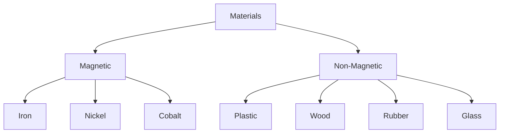

<<<FILE_START: index.mdx>>>
---
title: "Exploring Magnets"
description: "Introduction to magnets, their history, discovery, and basic properties."
date: 2024-04-10
tags: ["science", "magnets", "grade-6", "physics"]
order: 1
draft: false
---

import Callout from '@/components/Callout.astro'

## Introduction

Imagine being a sailor in the ancient world, navigating vast oceans at night with only the stars to guide you. What would happen if the sky was overcast and the stars were hidden? This was a real problem for early explorers until the discovery of a magical stone that could find directions.

This chapter explores the fascinating world of **Magnets**—objects that have the unique property of attracting materials like iron and finding directions.

### Discovery of Magnets

<Callout variant="info">
**Historical Fact:** The magnets used by sailors in ancient times were based on naturally occurring rocks called **Lodestones** (Magnetite). These were the first natural magnets discovered.
</Callout>

Over time, people learned that magnets could also be created artificially from pieces of iron. These are known as **Artificial Magnets**. Today, magnets are used in:
*   Refrigerator doors
*   Pencil boxes and purses (to keep them closed)
*   Magnetic compasses
*   Electric motors and speakers

### Natural vs. Artificial Magnets

| Feature | Natural Magnets | Artificial Magnets |
| :--- | :--- | :--- |
| **Origin** | Found naturally in the earth (e.g., Lodestone). | Man-made from magnetic materials. |
| **Strength** | Generally weak magnetic force. | Can be made very strong. |
| **Shape** | Irregular shapes. | Cast into specific shapes (Bar, Ring, Horseshoe). |

### Common Shapes of Artificial Magnets

Magnets come in various shapes depending on their use.

  <svg width="500" height="200" viewBox="0 0 500 200" xmlns="http://www.w3.org/2000/svg">
    <!-- Bar Magnet -->
    <rect x="50" y="80" width="100" height="40" fill="none" stroke="currentColor" strokeWidth="2" />
    <line x1="100" y1="80" x2="100" y2="120" stroke="currentColor" strokeWidth="2" />
    <text x="70" y="105" fill="currentColor" fontSize="16" fontWeight="bold">N</text>
    <text x="120" y="105" fill="currentColor" fontSize="16" fontWeight="bold">S</text>
    <text x="75" y="145" fill="currentColor" fontSize="14">Bar Magnet</text>

    <!-- U-shaped Magnet -->
    <path d="M200 80 V120 A 20 20 0 0 0 240 120 V80" fill="none" stroke="currentColor" strokeWidth="15" strokeLinecap="butt" />
    <text x="195" y="70" fill="currentColor" fontSize="16" fontWeight="bold">N</text>
    <text x="235" y="70" fill="currentColor" fontSize="16" fontWeight="bold">S</text>
    <text x="195" y="155" fill="currentColor" fontSize="14">U-shaped</text>

    <!-- Ring Magnet -->
    <circle cx="350" cy="100" r="25" fill="none" stroke="currentColor" strokeWidth="10" />
    <text x="325" y="145" fill="currentColor" fontSize="14">Ring Magnet</text>

    <!-- Dumbbell/Ball-ended Magnet -->
    <line x1="430" y1="100" x2="470" y2="100" stroke="currentColor" strokeWidth="4" />
    <circle cx="430" cy="100" r="10" fill="none" stroke="currentColor" strokeWidth="2" />
    <circle cx="470" cy="100" r="10" fill="none" stroke="currentColor" strokeWidth="2" />
    <text x="420" y="145" fill="currentColor" fontSize="14">Ball-ended</text>
  </svg>

## Chapter Roadmap

This chapter covers the following key concepts:
1.  **Magnetic and Non-magnetic Materials:** What sticks to a magnet?
2.  **Poles of a Magnet:** Where is the magnetic force strongest?
3.  **Finding Directions:** How magnets help us navigate.
4.  **Attraction and Repulsion:** How magnets interact with each other.
5.  **Care for Magnets:** How to store and protect magnets.
<<<FILE_END>>>

<<<FILE_START: topics/01-magnetic-materials.mdx>>>
---
title: "Magnetic and Non-magnetic Materials"
description: "Classifying materials based on their response to magnets."
date: 2024-04-10
tags: ["materials", "magnetism", "classification"]
order: 2
draft: false
---

import Callout from '@/components/Callout.astro'

## Classification of Materials

Not all materials react to magnets in the same way. Based on their behavior when brought near a magnet, materials are classified into two groups.

### 1. Magnetic Materials
These are materials that get **attracted** towards a magnet.
*   **Examples:** Iron, Nickel, Cobalt.
*   **Common Objects:** Iron nails, sewing needles, paper clips, keys.

### 2. Non-magnetic Materials
These are materials that are **not attracted** towards a magnet.
*   **Examples:** Plastic, Wood, Rubber, Glass, Paper, Cloth, Aluminum, Copper.
*   **Common Objects:** Pencils (wood), Erasers (rubber), Plastic bottles, Gold rings.

<Callout variant="warning">
**Note:** Some metals like Gold, Silver, Aluminum, and Copper are **non-magnetic**. Only specific metals like Iron, Nickel, and Cobalt are magnetic.
</Callout>

### Concept Map

## Activity: Testing Materials

If you bring a magnet near various objects, you can predict and observe the results:

| Object | Material | Attracted? (Yes/No) |
| :--- | :--- | :--- |
| Iron Nail | Iron | **Yes** |
| Scale | Plastic | **No** |
| Shoe | Leather | **No** |
| Key | Steel (Iron alloy) | **Yes** |
| Coin (Modern) | Stainless Steel (Ferritic) | **Yes** (Some are magnetic) |

### Magnetic Force Through Materials
Interestingly, magnetic force can pass through non-magnetic materials.
*   If you place a paper clip in a glass of water and move a magnet on the outside of the glass, the clip will move.
*   A magnet can influence iron filings through a sheet of paper or a plastic board.
<<<FILE_END>>>

<<<FILE_START: topics/02-poles-of-magnet.mdx>>>
---
title: "Poles of a Magnet"
description: "Understanding the North and South poles and where magnetic force is strongest."
date: 2024-04-10
tags: ["poles", "magnetism", "iron-filings"]
order: 3
draft: false
---

import Callout from '@/components/Callout.astro'

## Where is a Magnet Strongest?

If you dip a bar magnet into a heap of iron filings (tiny pieces of iron), you will notice something interesting. The filings do not stick uniformly all over the magnet.

*   **Observation:** Most of the iron filings stick to the **two ends** of the bar magnet.
*   **Conclusion:** The magnetic force is strongest at the ends of the magnet. These ends are called the **Poles**.

  <svg width="400" height="150" viewBox="0 0 400 150" xmlns="http://www.w3.org/2000/svg">
    <!-- Magnet -->
    <rect x="100" y="50" width="200" height="40" fill="#e0e0e0" stroke="currentColor" strokeWidth="2" />
    <text x="120" y="75" fill="currentColor" fontSize="16" fontWeight="bold">N</text>
    <text x="270" y="75" fill="currentColor" fontSize="16" fontWeight="bold">S</text>
    
    <!-- Iron Filings Cluster Left -->
    <circle cx="100" cy="50" r="2" fill="currentColor" />
    <circle cx="105" cy="48" r="2" fill="currentColor" />
    <circle cx="95" cy="52" r="2" fill="currentColor" />
    <circle cx="98" cy="45" r="2" fill="currentColor" />
    <circle cx="102" cy="70" r="2" fill="currentColor" />
    <circle cx="90" cy="60" r="2" fill="currentColor" />
    <circle cx="110" cy="80" r="2" fill="currentColor" />
    <circle cx="95" cy="85" r="2" fill="currentColor" />
    <circle cx="100" cy="90" r="2" fill="currentColor" />
    
    <!-- Iron Filings Cluster Right -->
    <circle cx="300" cy="50" r="2" fill="currentColor" />
    <circle cx="305" cy="48" r="2" fill="currentColor" />
    <circle cx="295" cy="52" r="2" fill="currentColor" />
    <circle cx="298" cy="45" r="2" fill="currentColor" />
    <circle cx="302" cy="70" r="2" fill="currentColor" />
    <circle cx="290" cy="60" r="2" fill="currentColor" />
    <circle cx="310" cy="80" r="2" fill="currentColor" />
    <circle cx="295" cy="85" r="2" fill="currentColor" />
    <circle cx="300" cy="90" r="2" fill="currentColor" />
    
    <!-- Sparse Middle -->
    <circle cx="200" cy="45" r="2" fill="currentColor" opacity="0.3" />
    <circle cx="210" cy="95" r="2" fill="currentColor" opacity="0.3" />

    <!-- Labels -->
    <text x="50" y="130" fill="currentColor" fontSize="12">Maximum filings (North Pole)</text>
    <text x="250" y="130" fill="currentColor" fontSize="12">Maximum filings (South Pole)</text>
    <text x="160" y="30" fill="currentColor" fontSize="12">Minimum filings in center</text>
  </svg>

## Properties of Poles

1.  **Existence:** Every magnet has two poles:
    *   **North Pole (N)**
    *   **South Pole (S)**
2.  **Inseparability:** Poles always exist in pairs.
    *   If you break a bar magnet in half, you do **not** get separate North and South pieces.
    *   Instead, you get **two smaller magnets**, each with its own North and South pole.

<Callout variant="tip">
**Key Concept:** Monopoles (single poles) do not exist. Even the smallest piece of a magnet will always have both a North and a South pole.
</Callout>
<<<FILE_END>>>

<<<FILE_START: topics/03-finding-directions.mdx>>>
---
title: "Finding Directions"
description: "Using freely suspended magnets and compasses for navigation."
date: 2024-04-10
tags: ["compass", "navigation", "earth-magnetism"]
order: 4
draft: false
---

import Callout from '@/components/Callout.astro'

## The Freely Suspended Magnet

One of the most useful properties of a magnet is its ability to find direction.

**Activity:**
1.  Take a bar magnet and tie a thread to its center.
2.  Suspend it freely so it can rotate horizontally.
3.  Wait for it to come to rest.

**Observation:**
The magnet always comes to rest in the same direction: **North-South**.
*   The end pointing towards the North is called the **North-seeking pole** or **North Pole**.
*   The end pointing towards the South is called the **South-seeking pole** or **South Pole**.

  <svg width="300" height="300" viewBox="0 0 300 300" xmlns="http://www.w3.org/2000/svg">
    <!-- Stand -->
    <rect x="145" y="20" width="10" height="20" fill="none" stroke="currentColor" />
    <line x1="150" y1="40" x2="150" y2="100" stroke="currentColor" strokeDasharray="4" />
    
    <!-- Magnet -->
    <rect x="100" y="100" width="100" height="30" fill="none" stroke="currentColor" strokeWidth="2" transform="rotate(-15, 150, 115)" />
    <text x="90" y="130" fill="currentColor" fontSize="14">N</text>
    <text x="200" y="100" fill="currentColor" fontSize="14">S</text>
    
    <!-- Direction Indicators -->
    <text x="145" y="10" fill="currentColor" fontSize="12" fontWeight="bold">Geographic North</text>
    <line x1="150" y1="20" x2="150" y2="280" stroke="currentColor" strokeOpacity="0.2" />
    <text x="145" y="295" fill="currentColor" fontSize="12">Geographic South</text>
  </svg>

Why does this happen? Because the **Earth itself acts like a giant magnet**.

## The Magnetic Compass

A magnetic compass is a device used by travellers to find directions based on this property.

### Construction
*   It consists of a small circular box with a glass cover.
*   Inside, a magnetized needle is pivoted at the center so it can rotate freely.
*   The needle usually has its **North pole painted red**.
*   The dial has directions (N, S, E, W) marked on it.

### Making Your Own Compass (Activity 4.4)
1.  **Magnetize a Needle:** Take an iron sewing needle. Rub a bar magnet along its length in **one direction only** (lifting it at the end and bringing it back to the start). Repeat 30-40 times.
2.  **Float It:** Insert the magnetized needle into a small piece of cork or foam.
3.  **Observe:** Float the cork in a bowl of water. The needle will align itself in the North-South direction.

<Callout variant="info">
**Did you know?** Ancient Indians used a device called **Matsya-yantra**. It was a fish-shaped magnetized iron piece floating in a vessel of oil used for navigation.
</Callout>
<<<FILE_END>>>

<<<FILE_START: topics/04-attraction-repulsion.mdx>>>
---
title: "Attraction and Repulsion"
description: "How magnets interact with each other and the sure test for magnetism."
date: 2024-04-10
tags: ["forces", "interaction", "repulsion"]
order: 5
draft: false
---

import Callout from '@/components/Callout.astro'

## Interaction Between Magnets

When two magnets are brought close to each other, they exert a force on one another. The nature of this force depends on which poles are facing each other.

### The Fundamental Law of Magnetism

1.  **Like Poles Repel:**
    *   North Pole (N) $\leftrightarrow$ North Pole (N) = **Repulsion** (Push away)
    *   South Pole (S) $\leftrightarrow$ South Pole (S) = **Repulsion** (Push away)

2.  **Unlike Poles Attract:**
    *   North Pole (N) $\rightarrow \leftarrow$ South Pole (S) = **Attraction** (Pull together)

  <svg width="500" height="250" viewBox="0 0 500 250" xmlns="http://www.w3.org/2000/svg">
    <!-- Case 1: Attraction -->
    <text x="180" y="30" fill="currentColor" fontSize="16" fontWeight="bold">Attraction (Unlike Poles)</text>
    
    <rect x="50" y="50" width="100" height="30" fill="none" stroke="currentColor" strokeWidth="2" />
    <text x="60" y="70" fill="currentColor" fontSize="14">S</text>
    <text x="130" y="70" fill="currentColor" fontSize="14" fontWeight="bold">N</text>
    
    <rect x="250" y="50" width="100" height="30" fill="none" stroke="currentColor" strokeWidth="2" />
    <text x="260" y="70" fill="currentColor" fontSize="14" fontWeight="bold">S</text>
    <text x="330" y="70" fill="currentColor" fontSize="14">N</text>
    
    <!-- Arrows for Attraction -->
    <line x1="160" y1="65" x2="240" y2="65" stroke="currentColor" strokeWidth="2" markerEnd="url(#arrow)" />
    <path d="M 160 65 L 180 60 M 160 65 L 180 70" stroke="currentColor" fill="none"/>
    <path d="M 240 65 L 220 60 M 240 65 L 220 70" stroke="currentColor" fill="none"/>

    <!-- Case 2: Repulsion -->
    <text x="180" y="140" fill="currentColor" fontSize="16" fontWeight="bold">Repulsion (Like Poles)</text>
    
    <rect x="50" y="160" width="100" height="30" fill="none" stroke="currentColor" strokeWidth="2" />
    <text x="60" y="180" fill="currentColor" fontSize="14">S</text>
    <text x="130" y="180" fill="currentColor" fontSize="14" fontWeight="bold">N</text>
    
    <rect x="250" y="160" width="100" height="30" fill="none" stroke="currentColor" strokeWidth="2" />
    <text x="260" y="180" fill="currentColor" fontSize="14" fontWeight="bold">N</text>
    <text x="330" y="180" fill="currentColor" fontSize="14">S</text>

    <!-- Arrows for Repulsion -->
    <line x1="155" y1="175" x2="185" y2="175" stroke="currentColor" strokeWidth="2" />
    <path d="M 155 175 L 165 170 M 155 175 L 165 180" stroke="currentColor" fill="none"/>
    
    <line x1="245" y1="175" x2="215" y2="175" stroke="currentColor" strokeWidth="2" />
    <path d="M 245 175 L 235 170 M 245 175 L 235 180" stroke="currentColor" fill="none"/>
  </svg>

## Repulsion: The Sure Test

How do you distinguish between a magnet and a simple iron bar?

*   **Attraction is NOT a sure test:** A magnet attracts another magnet (unlike poles) AND it also attracts a simple iron piece. So, if an object is attracted, it could be a magnet OR just iron.
*   **Repulsion IS a sure test:** Repulsion only happens between two magnets (like poles). An iron bar will never be repelled by a magnet. Therefore, if an object is repelled, it **must** be a magnet.

<Callout variant="tip">
**Summary:**
*   Attraction $\rightarrow$ Magnet + Magnet (Unlike poles) **OR** Magnet + Magnetic Material.
*   Repulsion $\rightarrow$ Magnet + Magnet (Like poles).
</Callout>
<<<FILE_END>>>

<<<FILE_START: topics/05-shapes-and-care.mdx>>>
---
title: "Care and Storage of Magnets"
description: "Different shapes of magnets and how to keep them safe from losing magnetism."
date: 2024-04-10
tags: ["safety", "storage", "magnet-shapes"]
order: 6
draft: false
---

import Callout from '@/components/Callout.astro'

## Care for Magnets

Magnets can lose their magnetic properties if they are not handled correctly. This is called **demagnetization**.

### Things to Avoid
Magnets lose their properties if:
1.  **Heated:** Do not burn or heat a magnet.
2.  **Hammered:** Do not hit magnets with hard objects.
3.  **Dropped:** Dropping magnets from a height can weaken them.
4.  **Improper Storage:** Leaving poles exposed for long periods.

Also, keep magnets away from:
*   Mobile phones and television sets.
*   Music systems and remote controls.
*   Computers and CDs/Data cards.

## Storing Magnets

To keep magnets safe, they must be stored properly using **Keepers** (pieces of soft iron).

1.  **Bar Magnets:**
    *   Store in pairs.
    *   **Unlike poles** should be on the same side.
    *   Place a piece of **wood** between them.
    *   Place two pieces of **soft iron** across their ends.

2.  **Horseshoe Magnet:**
    *   Keep a single piece of soft iron across its poles.

  <svg width="400" height="150" viewBox="0 0 400 150" xmlns="http://www.w3.org/2000/svg">
    <!-- Wood separator -->
    <rect x="190" y="40" width="20" height="80" fill="none" stroke="currentColor" opacity="0.5" />
    <text x="185" y="30" fill="currentColor" fontSize="12">Wood</text>

    <!-- Top Magnet -->
    <rect x="100" y="40" width="90" height="80" fill="none" stroke="currentColor" strokeWidth="2" />
    <text x="140" y="60" fill="currentColor" fontSize="14" fontWeight="bold">N</text>
    <text x="140" y="110" fill="currentColor" fontSize="14" fontWeight="bold">S</text>

    <!-- Bottom Magnet -->
    <rect x="210" y="40" width="90" height="80" fill="none" stroke="currentColor" strokeWidth="2" />
    <text x="250" y="60" fill="currentColor" fontSize="14" fontWeight="bold">S</text>
    <text x="250" y="110" fill="currentColor" fontSize="14" fontWeight="bold">N</text>

    <!-- Iron Keepers -->
    <rect x="80" y="40" width="20" height="80" fill="currentColor" opacity="0.3" />
    <rect x="300" y="40" width="20" height="80" fill="currentColor" opacity="0.3" />
    <text x="330" y="85" fill="currentColor" fontSize="12">Soft Iron Keeper</text>
  </svg>

## Fun Applications
*   **Magnetic Garland:** Using attraction to link objects.
*   **Maze Game:** Using a magnet under a board to move a steel ball on top.
*   **Floating Paper Clip:** Using a magnet outside a glass to hold a clip inside water.
*   **Maglev Trains:** Trains that float above tracks using magnetic repulsion to reduce friction.
<<<FILE_END>>>

<<<FILE_START: solutions/exercises.mdx>>>
---
title: "Chapter Exercises"
description: "Complete solutions to 'Let us enhance our learning' questions."
date: 2024-04-10
tags: ["solutions", "exercises", "grade-6"]
order: 7
draft: false
---

import Callout from '@/components/Callout.astro'

## Let us enhance our learning

### Q1. Fill in the blanks

(i) Unlike poles of two magnets **attract** each other, whereas like poles **repel** each other.
(ii) The materials that are attracted towards a magnet are called **magnetic materials**.
(iii) The needle of a magnetic compass rests along the **North-South** direction.
(iv) A magnet always has **two** poles.

---

### Q2. State whether True or False

(i) A magnet can be broken into pieces to obtain a single pole.
**Answer: False.** (Poles always exist in pairs).

(ii) Similar poles of a magnet repel each other.
**Answer: True.** (North repels North).

(iii) Iron filings mostly stick in the middle of a bar magnet when it is brought near them.
**Answer: False.** (They stick mostly at the ends/poles).

(iv) A freely suspended bar magnet always aligns with the north-south direction.
**Answer: True.**

---

### Q3. Matching Magnetic Interactions

| Column I (Pole Interactions) | Column II (Result) |
| :--- | :--- |
| N - N | **Repulsion** |
| N - **S** | Attraction |
| S - N | **Attraction** |
| **S** - S | Repulsion |

---

### Q4. Atharv's Experiment (Pins on a Magnet)

Atharv rolled a bar magnet over a heap of steel U-clips. The table shows the number of pins attracted at positions A (End), B (Middle), and C (End).

**Analysis:**
*   A and C are the poles (Ends), so attraction should be **maximum**.
*   B is the center, so attraction should be **minimum**.

**Correct Option:**
**(iv) 10, 10, 10** is incorrect (uniform attraction).
**(iii) 2, 10, 10** is incorrect (weak at one pole).
**(i) 10, 2, 10** matches the theory (Strong at poles A and C, weak at center B).

**Answer:** (i) Position A: 10, Position B: 2, Position C: 10.

---

### Q5. Identifying the Iron Bar

**Problem:** Reshma has 3 metal bars. Two are magnets, one is iron. How to identify them without extra material?

**Solution:**
1.  Take two bars at a time (Bar 1 and Bar 2).
2.  Bring one end of Bar 1 close to both ends of Bar 2.
3.  If there is **attraction at one end and repulsion at the other**, both are **magnets**.
4.  If there is **attraction at both ends**, then one of them is a magnet and the other is the **iron bar**.
5.  To confirm, take the known magnet (from step 3) and test the third bar. If it attracts at both ends, the third bar is the iron piece.

*Reasoning: Repulsion is the sure test for magnetism.*

---

### Q6. Finding Unknown Poles

**Problem:** You have a magnet with no markings. You have another magnet with marked poles.

**Solution:**
1.  Bring the **North Pole** of the marked magnet near one end of the unknown magnet.
2.  If they **repel**, the unknown end is also a **North Pole**.
3.  If they **attract**, the unknown end is a **South Pole**.
4.  Once one pole is identified, the opposite end is the other pole.

---

### Q7. Finding North Pole without another Magnet

**Problem:** How to find the North pole of a bar magnet without using another magnet?

**Solution:**
1.  Suspend the bar magnet freely using a thread tied to its center.
2.  Allow it to come to rest.
3.  The magnet will align itself in the **North-South direction** due to Earth's magnetism.
4.  The end pointing towards the Geographic North is the **North Pole** of the magnet.

---

### Q8. Earth's Magnetic Poles

**Question:** If Earth is a magnet, guess the poles based on a compass.

**Answer:**
*   The North Pole of a compass points roughly to the Geographic North.
*   Since unlike poles attract, the Earth's magnetic pole located near the Geographic North must actually be a **Magnetic South Pole**.
*   Similarly, the Earth's magnetic pole near the Geographic South is a **Magnetic North Pole**.

---

### Q9. The Mechanic's Problem

**Problem:** Screws keep falling off the screwdriver.

**Suggestion:**
The mechanic should **magnetize** the screwdriver.
1.  Take a permanent bar magnet.
2.  Rub it along the length of the screwdriver's metal shaft in one direction repeatedly (30-40 times).
3.  The screwdriver will become a temporary magnet and hold the steel screws effectively.

---

### Q10. Levitating Ring Magnets

**Observation:** Ring magnet X floats above Ring magnet Y.

**Reason:**
This happens due to **Magnetic Repulsion**. The face of magnet X facing down and the face of magnet Y facing up must be **Like Poles** (e.g., North facing North).

**How to bring them in contact?**
To bring X in contact with Y without pushing, simply **flip magnet X upside down**. Now, unlike poles will face each other, and they will attract and snap together.

---

### Q11. Polarity of Three Magnets

**Problem:** Determine the polarity of ends 1, 2, 3, 4, 6 given that end **5 is North (N)**.

  <svg width="300" height="200" viewBox="0 0 300 200" xmlns="http://www.w3.org/2000/svg">
    <!-- Arrangement Logic Visualized -->
    <!-- Magnet C (Vertical Right) -->
    <rect x="200" y="50" width="20" height="100" fill="none" stroke="currentColor" />
    <text x="205" y="145" fill="currentColor" fontSize="12">5(N)</text>
    <text x="205" y="65" fill="currentColor" fontSize="12">6(S)</text>

    <!-- Magnet B (Horizontal Top) -->
    <rect x="100" y="50" width="100" height="20" fill="none" stroke="currentColor" />
    <text x="180" y="65" fill="currentColor" fontSize="12">4(N)</text>
    <text x="110" y="65" fill="currentColor" fontSize="12">3(S)</text>

    <!-- Magnet A (Vertical Left) -->
    <rect x="80" y="50" width="20" height="100" fill="none" stroke="currentColor" />
    <text x="85" y="65" fill="currentColor" fontSize="12">2(N)</text>
    <text x="85" y="145" fill="currentColor" fontSize="12">1(S)</text>

    <!-- Arrows indicating interaction logic -->
    <text x="150" y="180" fill="currentColor" fontSize="14">Assuming attraction at corners</text>
  </svg>

**Logic:**
The magnets are arranged in a chain (likely attracted to each other at the corners).
1.  **Given:** End 5 is **N**.
2.  Therefore, End 6 (other end of same magnet) is **S**.
3.  End 6 (S) is touching End 4. For attraction, End 4 must be **N**.
4.  If End 4 is N, then End 3 (other end of same magnet) is **S**.
5.  End 3 (S) is touching End 2. For attraction, End 2 must be **N**.
6.  If End 2 is N, then End 1 (other end of same magnet) is **S**.

**Result:**
*   1 = **S**
*   2 = **N**
*   3 = **S**
*   4 = **N**
*   6 = **S**
<<<FILE_END>>>

<<<FILE_START: practice/activity-observations.mdx>>>
---
title: "Activity Observations"
description: "Detailed breakdown of observations for all activities in the chapter."
date: 2024-04-10
tags: ["experiments", "practical", "observations"]
order: 8
draft: false
---

import Callout from '@/components/Callout.astro'

## Activity 4.1: Finding Magnetic Materials
**Goal:** To identify which objects stick to a magnet.
*   **Procedure:** Touch a magnet to various objects like a pencil, eraser, iron nail, and plastic scale.
*   **Observation:** The magnet only sticks to the iron nail. It does not stick to wood, plastic, or rubber.
*   **Conclusion:** Iron is a **magnetic material**. Wood, plastic, and rubber are **non-magnetic**.

## Activity 4.2: Iron Filings Pattern
**Goal:** To find the strongest part of a magnet.
*   **Procedure:** Spread iron filings on a paper and place a bar magnet on it. Tap the paper.
*   **Observation:** The filings cling heavily to the **two ends** of the magnet. Very few stick to the center.
*   **Conclusion:** Magnetic force is concentrated at the two **poles**.

## Activity 4.3: Freely Suspended Magnet
**Goal:** To find directions.
*   **Procedure:** Suspend a bar magnet freely with a thread. Rotate it and let it stop.
*   **Observation:** It always stops in the **North-South** direction.
*   **Conclusion:** Magnets have directional properties used for navigation.

## Activity 4.4: Making a Compass
**Goal:** To create a DIY compass.
*   **Procedure:** Magnetize a needle using the "single touch method" (rubbing one pole in one direction). Float it on a cork in water.
*   **Observation:** The floating needle rotates and settles in the North-South direction.
*   **Conclusion:** A magnetized needle acts like a compass.

## Activity 4.5: Interaction of Magnets
**Goal:** To study attraction and repulsion.
*   **Procedure:** Bring N-pole of one magnet near N-pole of another, then near S-pole.
*   **Observation:**
    *   N-N $\rightarrow$ Push away (Repel)
    *   N-S $\rightarrow$ Pull together (Attract)
*   **Conclusion:** Like poles repel; unlike poles attract.

## Activity 4.7: Magnetic Force Through Materials
**Goal:** To see if magnetism works through barriers.
*   **Procedure:** Place a piece of wood or plastic between a magnet and a compass/iron object.
*   **Observation:** The compass needle still deflects; the iron object still moves.
*   **Conclusion:** Magnetic force can pass through non-magnetic materials like wood, plastic, and glass.
<<<FILE_END>>>
