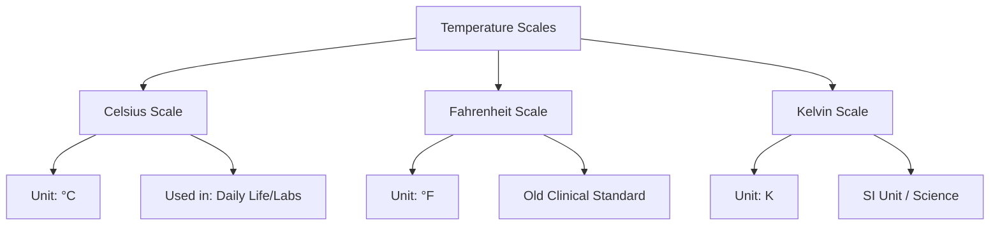

<<<FILE_START: index.mdx>>>
---
title: "Temperature and its Measurement"
description: "Chapter 7 overview covering the concepts of hot and cold, types of thermometers, temperature scales, and measurement techniques."
date: 2025-01-20
tags: ["science", "grade-6", "measurement", "temperature", "physics"]
order: 1
draft: false
---

import Callout from '@/components/Callout.astro'

# Temperature and its Measurement

## Introduction

In our daily lives, we often come across objects that are hot or cold. From boiling water to ice cream, the difference we feel is due to **heat**. However, our sense of touch is not always reliable. To measure exactly "how hot" or "how cold" an object is, we need a standard physical quantity called **Temperature**.

This chapter explores how we define temperature, the instruments used to measure it (thermometers), and the different scales used scientifically.

<Callout variant="info">
**Quote:** "Wrong measurements are worse than no measurements at all." — **Anna Mani** (Indian Scientist and Meteorologist)
</Callout>

## Key Concepts

| Concept | Definition | SI Unit |
| :--- | :--- | :--- |
| **Temperature** | A reliable measure of the hotness or coldness of a body. | Kelvin (K) |
| **Thermometer** | A device used to measure temperature. | - |
| **Clinical Thermometer** | Used to measure human body temperature. Range: 35°C to 42°C. | - |
| **Laboratory Thermometer** | Used for science experiments. Range: -10°C to 110°C. | - |

## Formula Sheet

### 1. Temperature Conversion (Celsius to Kelvin)
The scientific scale (SI unit) is Kelvin. To convert Celsius ($^\circ C$) to Kelvin ($K$):

$$
T_{(K)} = T_{(^\circ C)} + 273.15
$$

### 2. Least Count of a Thermometer
The smallest value that can be read accurately on a thermometer.

$$
\text{Least Count} = \frac{\text{Difference between two bigger marks}}{\text{Number of divisions between them}}
$$

## Chapter Structure

The chapter is divided into the following detailed topics:

1.  **Hot or Cold**: Why our sense of touch fails.
2.  **What is Temperature**: Definitions and Scales.
3.  **Clinical Thermometer**: Measuring body temperature.
4.  **Laboratory Thermometer**: Measuring other objects and precautions.
5.  **Air Temperature**: Weather measurement.

<<<FILE_END>>>

<<<FILE_START: topics/01-hot-or-cold.mdx>>>
---
title: "Hot or Cold?"
description: "Understanding the limitations of our sense of touch in determining temperature."
date: 2025-01-20
tags: ["sense-of-touch", "heat", "activity"]
order: 2
draft: false
---

import Callout from '@/components/Callout.astro'

## The Sense of Touch

We know from experience that some bodies are hotter than others. Ice is cold, while boiling water is hot. Usually, we use our sense of touch to decide this. However, is our sense of touch reliable?

### Activity: The Three Container Experiment

To test the reliability of our touch, consider this classic experiment with three containers of water.

  <svg width="500" height="200" viewBox="0 0 500 200" xmlns="http://www.w3.org/2000/svg">
    <!-- Container A: Hot -->
    <rect x="50" y="50" width="100" height="120" rx="10" ry="10" stroke="currentColor" fill="none" stroke-width="2"/>
    <path d="M50 80 Q100 90 150 80 V160 Q100 170 50 160 Z" fill="#ffcccb" opacity="0.5"/>
    <text x="100" y="190" text-anchor="middle" fill="currentColor" font-weight="bold">A (Hot)</text>
    
    <!-- Container B: Mix -->
    <rect x="200" y="50" width="100" height="120" rx="10" ry="10" stroke="currentColor" fill="none" stroke-width="2"/>
    <path d="M200 80 Q250 90 300 80 V160 Q250 170 200 160 Z" fill="#e0e0e0" opacity="0.5"/>
    <text x="250" y="190" text-anchor="middle" fill="currentColor" font-weight="bold">B (Mix)</text>

    <!-- Container C: Cold -->
    <rect x="350" y="50" width="100" height="120" rx="10" ry="10" stroke="currentColor" fill="none" stroke-width="2"/>
    <path d="M350 80 Q400 90 450 80 V160 Q400 170 350 160 Z" fill="#add8e6" opacity="0.5"/>
    <text x="400" y="190" text-anchor="middle" fill="currentColor" font-weight="bold">C (Cold)</text>
  </svg>

**Steps:**
1.  **Container A**: Hot water.
2.  **Container B**: Lukewarm (mix of hot and cold) water.
3.  **Container C**: Ice-cold water.
4.  Dip your **right hand** in A (Hot) and **left hand** in C (Cold) for 2 minutes.
5.  Now, dip **both hands** simultaneously into B.

**Observation:**
-   The right hand (coming from hot water) feels that water in B is **cool**.
-   The left hand (coming from cold water) feels that water in B is **warm**.

**Conclusion:**
Since the same water cannot be both cool and warm at the same time, this proves that our sense of touch is relative and **unreliable** for scientific measurement. We need a device to measure hotness accurately.

<<<FILE_END>>>

<<<FILE_START: topics/02-what-is-temperature.mdx>>>
---
title: "What is Temperature?"
description: "Definition of temperature and the various scales used to measure it."
date: 2025-01-20
tags: ["definitions", "scales", "kelvin", "celsius"]
order: 3
draft: false
---

import Callout from '@/components/Callout.astro'

## Definition

<Callout variant="tip">
**Temperature** is a reliable measure of the hotness or coldness of a body.
</Callout>

A hotter body has a higher temperature than a colder body. The device used to measure this is called a **thermometer**.

## Scales of Temperature

Just like we measure length in meters or inches, temperature is measured in different scales.

### 1. Celsius Scale ($^\circ C$)
-   Most commonly used scale for clinical and laboratory work.
-   Unit: **degree Celsius**.
-   Water freezes at $0^\circ C$ and boils at $100^\circ C$.

### 2. Fahrenheit Scale ($^\circ F$)
-   Older scale, still used in some countries.
-   Unit: **degree Fahrenheit**.
-   Normal body temperature: $98.6^\circ F$.
-   Relationship: $37.0^\circ C \approx 98.6^\circ F$.

### 3. Kelvin Scale ($K$)
-   Used in scientific work.
-   Unit: **kelvin** (Note: distinct from degrees, we do not write $^\circ$K, just K).
-   **This is the SI Unit of temperature.**

<Callout variant="warning">
**Writing Tip:**
-   **Celsius/Fahrenheit:** Start with capital letters. Units written as degrees ($^\circ C, ^\circ F$).
-   **kelvin:** The unit starts with a lowercase 'k' when written in full, but the symbol is capital **K**. No degree sign is used.
</Callout>

### Comparison of Scales

$$
\text{Temperature in Kelvin} = \text{Temperature in Celsius} + 273.15
$$

<<<FILE_END>>>

<<<FILE_START: topics/03-clinical-thermometer.mdx>>>
---
title: "Clinical Thermometer"
description: "Design, usage, and precautions for clinical thermometers used to measure body temperature."
date: 2025-01-20
tags: ["clinical", "health", "thermometer"]
order: 4
draft: false
---

import Callout from '@/components/Callout.astro'

## Purpose
A **Clinical Thermometer** is designed specifically to measure human body temperature.

## Types
1.  **Mercury Thermometer:** Traditional glass tube with mercury. Mercury is toxic and hard to dispose of if broken.
2.  **Digital Thermometer:** Modern, safe, uses heat sensors, and displays temperature on a digital screen. **Recommended for use.**

## Features
-   **Range:** Usually from **35°C to 42°C**.
    *   *Reason:* Human body temperature never goes below 35°C or above 42°C under normal/survivable conditions.
-   **Normal Temperature:** The average body temperature of a healthy person is **37.0°C** (or 98.6°F).

<Callout variant="info">
**Did you know?** The "normal" temperature is actually an average. A healthy person might have a temperature slightly higher or lower than 37.0°C.
</Callout>

## How to use a Digital Clinical Thermometer

1.  **Wash:** Clean the tip with soap and water before use.
2.  **Reset:** Press the reset/power button.
3.  **Place:** Put the tip under the tongue (or in the armpit for children/elderly).
4.  **Wait:** Wait for the beep sound.
5.  **Read:** Check the display.
6.  **Clean:** Wash the tip again after use.

## Precautions
-   Read the instruction manual.
-   Keep the digital display portion away from water while washing (if not waterproof).
-   Do not hold the thermometer by the tip (sensor).

<<<FILE_END>>>

<<<FILE_START: topics/04-laboratory-thermometer.mdx>>>
---
title: "Laboratory Thermometer"
description: "Using laboratory thermometers for scientific experiments."
date: 2025-01-20
tags: ["laboratory", "experiments", "least-count"]
order: 5
draft: false
---

import Callout from '@/components/Callout.astro'

## Purpose
Used to measure the temperature of objects other than the human body (e.g., boiling water, ice, chemical reactions).

## Structure
-   A long, narrow, uniform glass tube.
-   A bulb at one end containing liquid (alcohol colored red, or mercury).
-   **Range:** Typically **-10°C to 110°C**.

  <svg width="100" height="400" viewBox="0 0 100 400" xmlns="http://www.w3.org/2000/svg">
    <!-- Glass Tube -->
    <rect x="40" y="20" width="20" height="350" rx="10" ry="10" stroke="currentColor" fill="none" stroke-width="2"/>
    <!-- Bulb -->
    <circle cx="50" cy="370" r="15" fill="#ff4444" />
    <!-- Liquid Column -->
    <rect x="46" y="100" width="8" height="270" fill="#ff4444" />
    
    <!-- Markings -->
    <line x1="40" y1="50" x2="60" y2="50" stroke="currentColor" stroke-width="1"/>
    <text x="25" y="55" font-size="12" fill="currentColor">100</text>
    
    <line x1="40" y1="150" x2="60" y2="150" stroke="currentColor" stroke-width="1"/>
    <text x="25" y="155" font-size="12" fill="currentColor">50</text>
    
    <line x1="40" y1="250" x2="60" y2="250" stroke="currentColor" stroke-width="1"/>
    <text x="25" y="255" font-size="12" fill="currentColor">0</text>
    
    <line x1="40" y1="300" x2="60" y2="300" stroke="currentColor" stroke-width="1"/>
    <text x="20" y="305" font-size="12" fill="currentColor">-10</text>
  </svg>

## Finding the Least Count
To measure accurately, you must know the value of the smallest division (Least Count).

**Method:**
1.  Find the difference between two big marks (e.g., $10^\circ C$ and $20^\circ C$). Difference = $10^\circ C$.
2.  Count the number of divisions between them (e.g., 10 divisions).
3.  Calculate:
    $$
    \text{Smallest Division} = \frac{10}{10} = 1^\circ C
    $$

## Proper Usage Techniques (Activity 7.5)
Unlike a clinical thermometer, a laboratory thermometer generally does not have a "kink" to hold the mercury level. Therefore:

1.  **Keep it Vertical:** Do not tilt the thermometer.
2.  **Immersion:** The bulb must be fully immersed in the substance (e.g., water).
3.  **No Contact:** The bulb should **not touch** the bottom or sides of the container.
4.  **Read Inside:** Read the temperature **while the thermometer is still in the water**. If you take it out, the level falls immediately.

<Callout variant="warning">
**Crucial Difference:** You cannot use a laboratory thermometer to measure body temperature because the level drops as soon as you take it out of the mouth. Clinical thermometers have a special design (kink) or digital memory to hold the reading.
</Callout>

<<<FILE_END>>>

<<<FILE_START: topics/05-air-temperature.mdx>>>
---
title: "Air Temperature"
description: "Measuring weather temperature and understanding weather reports."
date: 2025-01-20
tags: ["weather", "meteorology", "anna-mani"]
order: 6
draft: false
---

import Callout from '@/components/Callout.astro'

## Room and Weather Temperature

Thermometers hung on walls in homes or offices give the **room temperature**. However, strictly measuring the outside temperature helps in weather forecasting.

### Weather Reports
Newspapers and TV news report the **Maximum** and **Minimum** temperatures of the day.
-   These vary day by day.
-   Usually, it is hotter in summer and colder in winter.

<Callout variant="info">
**Anna Mani (1918–2001)**
Known as the "Weather Woman of India," she invented and built many weather measurement instruments, reducing India's reliance on foreign imports. She also researched wind and solar energy.
</Callout>

### Maximum-Minimum Thermometer
Meteorologists use a special thermometer called the **Maximum-Minimum Thermometer** to record the highest and lowest temperatures reached during a day automatically.

<<<FILE_END>>>

<<<FILE_START: solutions/exercises.mdx>>>
---
title: "Textbook Exercises"
description: "Complete solutions to 'Let us enhance our learning' questions."
date: 2025-01-20
tags: ["solutions", "exercises", "grade-6"]
order: 7
draft: false
---

import Callout from '@/components/Callout.astro'

## Let us enhance our learning

**Q1. The normal temperature of a healthy human being is close to...**
(i) $98.6^\circ C$
(ii) $37.0^\circ C$
(iii) $32.0^\circ C$
(iv) $27.0^\circ C$

**Answer:** (ii) $37.0^\circ C$
> **Explanation:** The normal human body temperature is approximately $37.0^\circ C$. Note that $98.6$ is correct only if the scale is Fahrenheit ($^\circ F$), but option (i) says $^\circ C$, which would be boiling hot!

---

**Q2. $37^\circ C$ is the same temperature as...**
(i) $97.4^\circ F$
(ii) $97.6^\circ F$
(iii) $98.4^\circ F$
(iv) $98.6^\circ F$

**Answer:** (iv) $98.6^\circ F$
> **Explanation:** This is the standard conversion for normal body temperature.

---

**Q3. Fill in the blanks:**
(i) The hotness or coldness of a system is determined by its \_\_\_\_\_\_\_\_.
(ii) The temperature of ice-cold water cannot be measured by a \_\_\_\_\_\_\_\_ thermometer.
(iii) The unit of temperature is degree \_\_\_\_\_\_\_\_.

**Answer:**
(i) Temperature
(ii) Clinical (Because the range of a clinical thermometer is 35-42°C, and ice is 0°C).
(iii) Celsius (or Fahrenheit)

---

**Q4. The range of a laboratory thermometer is usually...**
(i) $10^\circ C$ to $100^\circ C$
(ii) $-10^\circ C$ to $110^\circ C$
(iii) $32^\circ C$ to $45^\circ C$
(iv) $35^\circ C$ to $42^\circ C$

**Answer:** (ii) $-10^\circ C$ to $110^\circ C$

---

**Q5. Who do you think followed the correct way for measuring temperature?**
*Refer to Figure 7.6 in textbook (Student 1: Tilted, Student 2: Not immersed properly, Student 3: Touching bottom, Student 4: Vertical and suspended).*

**Answer:** (iv) Student 4
> **Explanation:**
> - Student 1 is holding it tilted.
> - Student 2 is holding it too high (bulb barely touches water).
> - Student 3 is touching the bottom of the container.
> - **Student 4** is holding it vertically, immersed in water, without touching the sides or bottom. This is the correct method.

---

**Q6. Colour to show the red column on the drawings of thermometers as per the temperatures written below:**
- $14^\circ C$
- $17^\circ C$
- $7.5^\circ C$

  <svg width="300" height="200" viewBox="0 0 300 200" xmlns="http://www.w3.org/2000/svg">
     <!-- 14 C -->
    <g transform="translate(20,0)">
        <text x="15" y="20" font-size="12" fill="currentColor" text-anchor="middle">14°C</text>
        <rect x="10" y="30" width="10" height="150" stroke="currentColor" fill="none"/>
        <!-- Scale 0 to 20 approx mapping: Bottom 180 is 0, Top 30 is 20. 
             If height 150 represents 20 units, 1 unit = 7.5px. 
             14 units = 105px from bottom. Y = 180 - 105 = 75. -->
        <rect x="11" y="75" width="8" height="105" fill="#ff4444"/>
        <line x1="10" y1="180" x2="20" y2="180" stroke="currentColor"/> <!-- 0 -->
        <line x1="10" y1="105" x2="20" y2="105" stroke="currentColor"/> <!-- 10 -->
        <line x1="10" y1="30" x2="20" y2="30" stroke="currentColor"/> <!-- 20 -->
    </g>

    <!-- 17 C -->
    <g transform="translate(120,0)">
        <text x="15" y="20" font-size="12" fill="currentColor" text-anchor="middle">17°C</text>
        <rect x="10" y="30" width="10" height="150" stroke="currentColor" fill="none"/>
        <!-- 17 units = 127.5px. Y = 180 - 127.5 = 52.5 -->
        <rect x="11" y="52.5" width="8" height="127.5" fill="#ff4444"/>
        <line x1="10" y1="180" x2="20" y2="180" stroke="currentColor"/> <!-- 0 -->
        <line x1="10" y1="105" x2="20" y2="105" stroke="currentColor"/> <!-- 10 -->
        <line x1="10" y1="30" x2="20" y2="30" stroke="currentColor"/> <!-- 20 -->
    </g>

    <!-- 7.5 C -->
    <g transform="translate(220,0)">
        <text x="15" y="20" font-size="12" fill="currentColor" text-anchor="middle">7.5°C</text>
        <rect x="10" y="30" width="10" height="150" stroke="currentColor" fill="none"/>
        <!-- 7.5 units = 56.25px. Y = 180 - 56.25 = 123.75 -->
        <rect x="11" y="123.75" width="8" height="56.25" fill="#ff4444"/>
        <line x1="10" y1="180" x2="20" y2="180" stroke="currentColor"/> <!-- 0 -->
        <line x1="10" y1="105" x2="20" y2="105" stroke="currentColor"/> <!-- 10 -->
        <line x1="10" y1="30" x2="20" y2="30" stroke="currentColor"/> <!-- 20 -->
    </g>
  </svg>

---

**Q7. Observe the part of thermometer shown in Fig. 7.8 and answer:**
*(Figure shows a scale with 10 divisions between 0 and 10, and 10 and 20. The liquid level is not explicitly defined in text but usually asks for least count or specific reading).*

(i) **What type of thermometer is it?**
It is likely a **Laboratory Thermometer** because the range shown includes 0 to 40°C with uniform divisions, typical for lab use.

(ii) **What is the reading of the thermometer?**
*Assumption based on typical textbook image:* If the red line is at the 2nd small mark after 20, the reading is $22^\circ C$.

(iii) **What is the smallest value that this thermometer can measure?**
-   Difference between big marks (0 to 10) = $10^\circ C$.
-   Number of divisions = 10.
-   Least Count = $10 / 10 = 1^\circ C$.

---

**Q8. A laboratory thermometer is not used to measure our body temperature. Give a reason.**
**Answer:** A laboratory thermometer does not have a "kink" or constriction near the bulb. Therefore, the mercury/alcohol level falls immediately as soon as it is taken out of the mouth (or contact with the body), making it impossible to get an accurate reading of body temperature.

---

**Q9. Vaishnavi's Temperature Record (Table 7.4 Analysis)**

(i) **Highest recorded temperature?**
**Answer:** $40.0^\circ C$ (Recorded on Day One at 7 pm).

(ii) **On which day and time?**
**Answer:** Day One at 7 pm.

(iii) **When did temperature return to normal?**
**Answer:** Normal body temp is approx $37.0^\circ C$. Looking at the table, on **Day Three at 4pm**, the temperature was $37.0^\circ C$.

---

**Q10. If you have to measure the temperature 22.5 °C, which thermometer will you use?**
*(Fig 7.9 shows three thermometers with different least counts)*
-   (a) Divisions of 1 degree ($0, 1, 2...$)
-   (b) Divisions of 0.5 degree ($0, 0.5, 1...$) - *Implied by 2 divisions per degree*
-   (c) Divisions of 2 degrees ($0, 2, 4...$)

**Answer:** You should use thermometer **(b)**.
> **Reason:** To measure $22.5^\circ C$ accurately, the thermometer must have a least count of at least $0.5^\circ C$. A thermometer with 1-degree markings can only read 22 or 23 reliably.

---

**Q11. The temperature shown by the thermometer in Fig. 7.10 is...**
(i) $28.0^\circ C$
(ii) $27.5^\circ C$
(iii) $26.5^\circ C$
(iv) $25.3^\circ C$

**Answer:** (iii) $26.5^\circ C$
> **Reason:** (Based on visual interpretation of standard textbook diagrams). If the mark is halfway between 26 and 27, it is 26.5. If the divisions are 0.5 degrees, this reading is possible.

---

**Q12. A laboratory thermometer has 50 divisions between 0°C and 100°C. What does each division measure?**
**Answer:**
-   Temperature difference = $100 - 0 = 100^\circ C$.
-   Total divisions = 50.
-   Value of 1 division = $\frac{100}{50} = 2^\circ C$.

---

**Q13. Draw scale between 10°C and 20°C with smallest division 0.5°C.**
*(Self-Practice Drawing)*: You would draw the mark 10 and 20. Between them, you would place 19 small lines to create 20 gaps (since $10 / 0.5 = 20$ divisions).

---

**Q14. Komal has a fever of 101 degrees. Is it Celsius or Fahrenheit?**
**Answer:** It is on the **Fahrenheit scale ($^\circ F$)**.
> **Reason:** $101^\circ C$ is above the boiling point of water. A human cannot survive at that temperature. In Fahrenheit, $101^\circ F$ indicates a moderate fever (normal is $98.6^\circ F$).

<<<FILE_END>>>

<<<FILE_START: practice/solved-examples.mdx>>>
---
title: "Solved Examples & Practice"
description: "Additional problems on thermometer readings and temperature concepts."
date: 2025-01-20
tags: ["practice", "numericals", "least-count"]
order: 8
draft: false
---

import Callout from '@/components/Callout.astro'

## Topic: Calculating Least Count

**Example 1:**
A thermometer has markings at $0^\circ C$ and $5^\circ C$. There are 5 divisions between these two marks. What is the smallest temperature this thermometer can measure?

**Solution:**
1.  **Difference in temperature:** $5 - 0 = 5^\circ C$.
2.  **Number of divisions:** 5.
3.  **Least Count:** $\frac{5}{5} = 1^\circ C$.
    *Answer: The thermometer can measure a minimum change of $1^\circ C$.*

**Example 2:**
A thermometer has markings at $10^\circ C$ and $20^\circ C$. There are 20 divisions between these marks. What is the reading if the liquid is at the 3rd division after $15^\circ C$?

**Solution:**
1.  **Calculate Least Count:**
    -   Difference = $20 - 10 = 10^\circ C$.
    -   Divisions = 20.
    -   Least Count = $\frac{10}{20} = 0.5^\circ C$.
2.  **Read the Value:**
    -   Base mark = $15^\circ C$.
    -   Additional reading = 3 divisions $\times$ $0.5^\circ C$ = $1.5^\circ C$.
    -   Total Temperature = $15 + 1.5 = 16.5^\circ C$.

## Topic: Temperature Scales

**Example 3:**
The temperature of a liquid is $27^\circ C$. What is this temperature in the Kelvin scale?

**Solution:**
We know the formula:
$$
T_{(K)} = T_{(^\circ C)} + 273.15
$$
$$
T_{(K)} = 27 + 273.15
$$
$$
T_{(K)} = 300.15 K
$$

<Callout variant="tip">
Remember: Kelvin (K) does not have a degree symbol (°).
</Callout>

<<<FILE_END>>>
