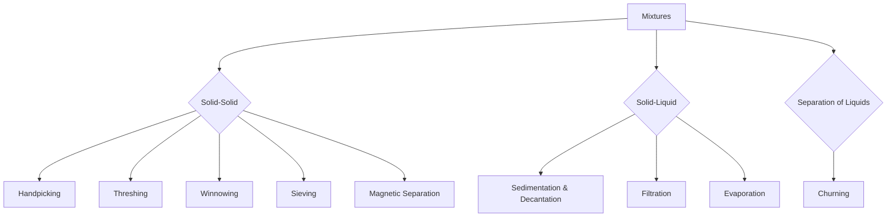
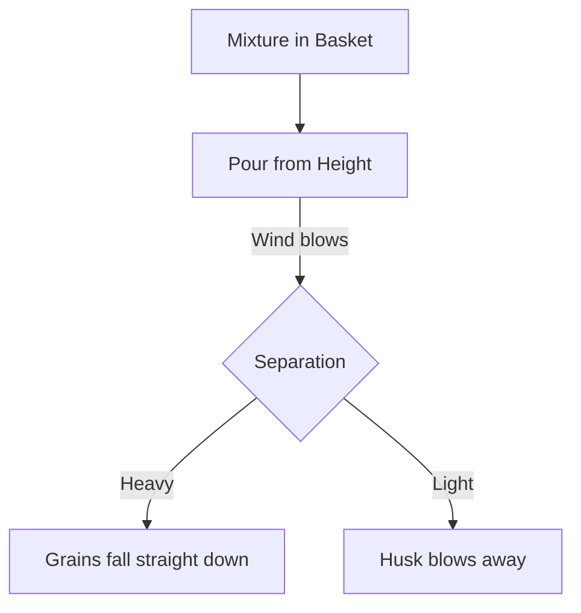
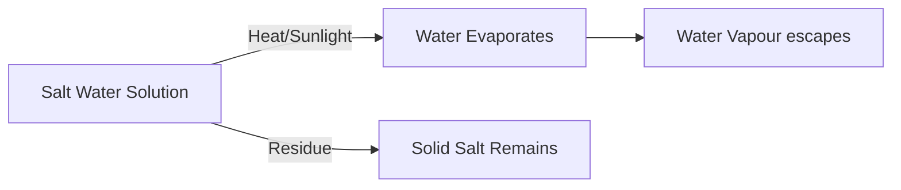

<<<FILE_START: index.mdx>>>
---
title: "Methods of Separation in Everyday Life"
description: "An overview of Chapter 9, exploring how and why we separate substances using various methods like handpicking, threshing, winnowing, and filtration."
date: 2025-01-15
tags: ["science", "grade-6", "separation-methods", "chemistry"]
order: 1
draft: false
---

import Callout from '@/components/Callout.astro'

## Introduction

In our daily lives, we often come across mixtures of substances. Whether it's separating stones from rice before cooking, filtering tea leaves from tea, or churning milk to get butter, the act of **separation** is fundamental. 

This chapter follows the journey of Malli and Valli as they travel across India, observing how farmers, family members, and industries separate useful substances from unwanted ones.

### Why do we separate substances?
1.  **To remove harmful or non-useful components** (e.g., stones from rice).
2.  **To separate two different but useful components** (e.g., butter from curd).
3.  **To remove impurities** to get a pure substance (e.g., salt from seawater).

### Chapter Roadmap

The chapter covers the following key methods of separation:

1.  **Handpicking**: For visible impurities.
2.  **Threshing**: Separating grains from stalks.
3.  **Winnowing**: Using wind to separate lighter husk from heavier grains.
4.  **Sieving**: Separating particles of different sizes.
5.  **Sedimentation, Decantation, and Filtration**: Separating insoluble solids from liquids.
6.  **Evaporation**: Separating soluble solids from liquids.
7.  **Churning**: Separating butter from milk/curd.
8.  **Magnetic Separation**: Using magnets to extract magnetic materials.

<Callout variant="tip">
**Quick Fact:** Traditional methods like using a *soop* (bamboo tray) for winnowing are still widely used in Indian agriculture!
</Callout>

### Concept Map

<<<FILE_END>>>
<<<FILE_START: topics/01-handpicking.mdx>>>
---
title: "Handpicking"
description: "Learn about handpicking, the simplest method of separation used for visible impurities."
date: 2025-01-15
tags: ["handpicking", "separation", "solid-mixtures"]
order: 2
draft: false
---

import Callout from '@/components/Callout.astro'

## Handpicking

Handpicking is one of the most common methods of separation used in our homes. As the name suggests, it involves picking out substances by hand.

### When is it used?
This method is effective under specific conditions:
1.  **Visually Distinct:** The components to be separated must differ in **size, colour, or shape**.
2.  **Small Quantity:** The quantity of the mixture should not be very large.
3.  **Low Impurity Ratio:** The quantity of impurities (like stones in rice) is small compared to the useful substance.

<Callout variant="tip">
**Example:** Malli's Nani separates small stones and husk from wheat grains by hand because the stones look different and are few in number.
</Callout>

### How it Works

Imagine a plate of rice mixed with a few black stones. Because the stones are black and the rice is white, your eyes can easily spot them, and your fingers can pick them out.

**Applications:**
*   Removing stones, husk, or dirt from grains like wheat, rice, and pulses.
*   Separating whole spices (like black pepper) from a dish (like pulao) if you don't want to eat them.

$$
\text{Mixture} = \text{Useful Grain} + \text{Impurities (Stones/Husk)}
$$

After handpicking:
$$
\text{Result} = \text{Clean Grains} \quad (\text{Impurities discarded})
$$
<<<FILE_END>>>
<<<FILE_START: topics/02-threshing-and-winnowing.mdx>>>
---
title: "Threshing and Winnowing"
description: "Understanding agricultural methods for separating grains from stalks and husk."
date: 2025-01-15
tags: ["agriculture", "threshing", "winnowing", "farming"]
order: 3
draft: false
---

import Callout from '@/components/Callout.astro'

## Threshing

Once a crop like wheat or paddy is harvested, the stalks are dried in the sun. The grains are attached to these dry stalks. Plucking grains one by one (like picking mangoes) is impossible because there are thousands of grains!

**Definition:** The process of beating stalks to separate the grains from them is called **threshing**.

### Methods of Threshing
1.  **Manual:** Farmers hold a bundle of stalks and beat them against a hard surface (like a wooden log or rock). The impact loosens the grains.
2.  **Bullocks:** In traditional methods, bullocks trample over the stalks.
3.  **Machines:** Modern technological developments have led to **threshers**, machines that separate grains from stalks and husk quickly.

---

## Winnowing

After threshing, we get a mixture of grains and husk (the dry outer covering). We need to separate them. Since grains are heavier than husk, we use the property of **weight** and **wind**.

**Definition:** The method of separating heavier and lighter components of a mixture by wind or blowing air is called **winnowing**.

### The Process
1.  The farmer stands on a raised platform.
2.  The mixture is placed in a *soop* (winnowing basket) or plate.
3.  The farmer tilts the basket and lets the mixture slide down slowly.
4.  **The Wind acts:**
    *   The **heavy grains** fall vertically straight down to form a heap.
    *   The **light husk** is blown away by the wind and forms a heap at a distance.

<Callout variant="tip">
**Principle:** Winnowing relies on the difference in **weight** (density) of the two components. Air resistance affects the lighter particles more.
</Callout>

### Visualization of Winnowing

The separated husk is often used as fodder for cattle, while the grain is stored for food.
<<<FILE_END>>>
<<<FILE_START: topics/03-sieving.mdx>>>
---
title: "Sieving"
description: "Using sieves to separate particles based on size differences."
date: 2025-01-15
tags: ["sieving", "size-separation", "construction", "cooking"]
order: 4
draft: false
---

import Callout from '@/components/Callout.astro'

## Sieving

Sometimes, mixtures contain components that are of different sizes. Handpicking takes too long, and winnowing won't work if both components are heavy. In such cases, we use a **sieve**.

**Definition:** Sieving is the process of separating solids from a mixture based on variations in particle size using a sieve (a mesh or net).

### How it Works
A sieve has small holes (pores). 
*   **Smaller particles** pass through the holes.
*   **Larger particles** (impurities) remain on the sieve.

### Common Examples

1.  **In the Kitchen (Flour):**
    *   We sieve wheat flour to remove bran and small impurities that might have remained after grinding. The fine flour passes through, while the bran stays on top.
    
2.  **At Construction Sites (Sand):**
    *   Large sieves are used to separate pebbles and stones from sand. Fine sand is needed for mixing cement, while stones would ruin the smooth finish.

### Diagram: The Sieve Concept

  <svg width="300" height="200" viewBox="0 0 300 200" xmlns="http://www.w3.org/2000/svg">
    <!-- Sieve Frame -->
    <ellipse cx="150" cy="50" rx="100" ry="20" stroke="currentColor" fill="none" stroke-width="3" />
    <path d="M50 50 L80 150 L220 150 L250 50" stroke="currentColor" fill="none" stroke-width="3" />
    <ellipse cx="150" cy="150" rx="70" ry="14" stroke="currentColor" fill="none" stroke-width="2" stroke-dasharray="4" />
    
    <!-- Mesh Grid -->
    <path d="M70 50 L230 50" stroke="currentColor" stroke-width="1" />
    <path d="M80 40 L220 60" stroke="currentColor" stroke-width="1" />
    <path d="M80 60 L220 40" stroke="currentColor" stroke-width="1" />
    
    <!-- Particles -->
    <circle cx="120" cy="40" r="4" fill="currentColor" />
    <circle cx="150" cy="45" r="5" fill="currentColor" />
    <circle cx="180" cy="40" r="4" fill="currentColor" />
    
    <!-- Falling Particles -->
    <circle cx="150" cy="100" r="1" fill="currentColor" />
    <circle cx="140" cy="120" r="1" fill="currentColor" />
    <circle cx="160" cy="110" r="1" fill="currentColor" />
    
    <!-- Labels -->
    <text x="10" y="40" fill="currentColor" font-size="12">Big Particles (Stay)</text>
    <text x="200" y="120" fill="currentColor" font-size="12">Small Particles (Pass)</text>
  </svg>

<Callout variant="warning">
**Think:** If you try to sieve a mixture of rice and kidney beans (rajma) using a sieve with very large holes, both will fall through. The pore size of the sieve determines what gets separated!
</Callout>
<<<FILE_END>>>
<<<FILE_START: topics/04-sedimentation-decantation-filtration.mdx>>>
---
title: "Sedimentation, Decantation, and Filtration"
description: "Techniques for separating insoluble solids from liquids."
date: 2025-01-15
tags: ["sedimentation", "decantation", "filtration", "water-purification"]
order: 5
draft: false
---

import Callout from '@/components/Callout.astro'

## Separating Solids from Liquids

When you have a mixture of an insoluble solid (like mud, sand, or tea leaves) and a liquid, we use a three-step approach: Sedimentation, Decantation, and Filtration.

### 1. Sedimentation
If you mix sand in water and let it stand undisturbed, the sand particles are heavier than water. Gravity pulls them down.
*   **Definition:** The process of settling down of the heavier insoluble component at the bottom of a liquid is called **sedimentation**.
*   The solid layer at the bottom is called **sediment**.

### 2. Decantation
Once the sediment has settled, the clear liquid remains on top. We can carefully pour this liquid out without disturbing the sediment.
*   **Definition:** The process of removing the liquid (water) by tilting the vessel after sedimentation is called **decantation**.
*   **Example:** Separating oil from water (since oil floats) is also a form of decantation. Washing rice involves decanting the cloudy water.

### 3. Filtration
Decantation is not perfect. Sometimes fine particles (like tea leaves or fine mud) flow out with the liquid. To remove these, we use a filter.
*   **Definition:** The process of separating insoluble solid components from a liquid by passing it through a filter is called **filtration**.

**Types of Filters:**
1.  **Strainer:** Metal or plastic mesh (used for tea).
2.  **Cloth:** Woven threads create pores. Multiple layers make the pores smaller.
3.  **Filter Paper:** Has extremely fine pores, suitable for laboratory experiments.

<Callout variant="tip">
**Comparison:** 
*   **Decantation:** Quick, but less accurate (fine particles remain).
*   **Filtration:** Slower, but very accurate (removes very fine particles).
</Callout>

### Experimental Setup: Filtration

  <svg width="250" height="300" viewBox="0 0 250 300" xmlns="http://www.w3.org/2000/svg">
    <!-- Stand -->
    <rect x="20" y="250" width="100" height="10" fill="currentColor" />
    <rect x="65" y="50" width="10" height="200" fill="currentColor" />
    <rect x="65" y="100" width="80" height="5" fill="currentColor" />
    
    <!-- Funnel -->
    <polygon points="120,100 170,100 145,150" stroke="currentColor" fill="none" stroke-width="2"/>
    <rect x="143" y="150" width="4" height="40" fill="currentColor" />
    
    <!-- Filter Paper Cone inside Funnel -->
    <path d="M125 105 L165 105 L145 145 Z" stroke="currentColor" fill="none" stroke-dasharray="2,2" />

    <!-- Flask -->
    <path d="M125 250 L165 250 L155 200 L155 180 L135 180 L135 200 Z" stroke="currentColor" fill="none" stroke-width="2"/>
    
    <!-- Drops -->
    <circle cx="145" cy="195" r="2" fill="currentColor" />
    <circle cx="145" cy="210" r="2" fill="currentColor" />
    
    <!-- Labels -->
    <text x="180" y="120" fill="currentColor" font-size="12">Filter Paper</text>
    <text x="180" y="160" fill="currentColor" font-size="12">Funnel</text>
    <text x="180" y="240" fill="currentColor" font-size="12">Filtrate (Clear Water)</text>
  </svg>

*   **Residue:** The solid left on the filter paper.
*   **Filtrate:** The clear liquid collected in the flask.
<<<FILE_END>>>
<<<FILE_START: topics/05-evaporation.mdx>>>
---
title: "Evaporation"
description: "How to separate soluble solids like salt from water."
date: 2025-01-15
tags: ["evaporation", "salt", "sea-water", "soluble-solids"]
order: 6
draft: false
---

import Callout from '@/components/Callout.astro'

## Evaporation

When a solid dissolves in a liquid (like salt in water), we cannot use filtration or sedimentation because the particles are too small and mixed thoroughly.

To separate them, we heat the mixture.

**Definition:** The process in which a liquid gets converted into its vapour is called **evaporation**.

### The Process
1.  Heat the solution containing the dissolved solid.
2.  The water (solvent) boils and turns into steam (vapour).
3.  The solid (solute) cannot evaporate, so it is left behind in the container.

### Real-World Example: Making Salt
Common salt (namak) is obtained from **seawater**.
1.  Seawater is trapped in shallow pits (lagoons).
2.  It is exposed to sunlight and wind.
3.  The water slowly evaporates over a few days.
4.  Solid salt crystals are left behind.
5.  This crude salt is then purified for consumption.

<Callout variant="tip">
**Activity Reflection:** If you mix salt in water, filter it (salt passes through), and then boil it dry, you will see white residue in the vessel. That is the salt you recovered!
</Callout>

### Diagram: Evaporation Cycle

<<<FILE_END>>>
<<<FILE_START: topics/06-churning-and-magnetic-separation.mdx>>>
---
title: "Churning and Magnetic Separation"
description: "Specialized separation methods for dairy and magnetic materials."
date: 2025-01-15
tags: ["churning", "magnetic-separation", "recycling"]
order: 7
draft: false
---

import Callout from '@/components/Callout.astro'

## Churning

Have you ever wondered how butter is made? It comes from milk or curd. 

**Definition:** Churning is the process of shaking or rotating milk or curd vigorously to separate butter.

### How it works
*   Milk/Curd is a mixture where fat particles (butter) are suspended in the watery liquid (buttermilk).
*   When churned using a **mathni** (traditional churner) or a machine:
    *   The lighter component (**butter**) floats to the top.
    *   The heavier liquid (**buttermilk/chhach**) remains below.

$$
\text{Curd} \xrightarrow{\text{Churning}} \text{Butter (Solid/Fat)} + \text{Buttermilk (Liquid)}
$$

---

## Magnetic Separation

This method utilizes the magnetic properties of certain metals.

**Definition:** Separation of magnetic and non-magnetic substances by using a magnet is called **magnetic separation**.

### Key Concept: Magnetic vs Non-Magnetic
*   **Magnetic Substances:** Iron, Nickel, Cobalt.
*   **Non-Magnetic Substances:** Wood, Plastic, Sand, Glass.

### Application
1.  **Carpentry:** If a carpenter drops iron nails into sawdust, they can easily retrieve them by moving a magnet over the mixture. The nails stick to the magnet, leaving the sawdust behind.
2.  **Waste Management:** In large junk yards, cranes fitted with powerful electromagnets move over heaps of garbage to separate scrap iron for recycling.

<Callout variant="tip">
**Eco-Tip:** Recycling scrap iron saves resources. Magnetic separation makes this process efficient!
</Callout>
<<<FILE_END>>>
<<<FILE_START: solutions/ex-exercises.mdx>>>
---
title: "Chapter Exercises: Let us enhance our learning"
description: "Detailed solutions to the end-of-chapter questions 1 to 10."
date: 2025-01-15
tags: ["solutions", "exercises", "grade-6-science"]
order: 8
draft: false
---

import Callout from '@/components/Callout.astro'

## Questions and Solutions

### 1. What purpose does handpicking serve in the process of separation?
**(ii) Sorting**

**Explanation:** Handpicking is primarily a sorting method used to remove unwanted substances (like stones) from useful ones (like grains) based on visual differences.

### 2. Which of the following substances are commonly separated using the churning method?
**(iii) Cream from milk**

**Explanation:** Churning is used to separate lighter fatty components (butter/cream) from the heavier liquid part of milk or curd.

### 3. Which factor is usually essential for the filtration?
**(iii) Pore size**

**Explanation:** Filtration works because the filter has pores (holes) that allow liquid to pass but block solid particles. If the pore size is too big, the solid will pass through.

### 4. State with reason(s) whether the following statements are True [T] or False [F]. Correct the False statement(s).

**(i) Salt can be separated from salt solution by keeping it under the Sun.**
*   **Answer:** **[T]**
*   **Reason:** The heat from the sun evaporates the water, leaving the salt behind.

**(ii) Handpicking should be used only when the quantity of one component is less.**
*   **Answer:** **[T]**
*   **Reason:** It is practically impossible to handpick impurities if they are present in very large quantities or if the total mixture is massive.

**(iii) A mixture of puffed rice and rice grains can be separated by threshing.**
*   **Answer:** **[F]**
*   **Correction:** It can be separated by **winnowing**. Puffed rice is much lighter than rice grains and will blow away. Threshing is for separating grains from stalks.

**(iv) A mixture of mustard oil and lemon water can be separated by decantation.**
*   **Answer:** **[T]**
*   **Reason:** Oil and water do not mix (immiscible). Oil forms a separate layer on top of the water, which can be poured off (decanted).

**(v) Sieving is used to separate a mixture of rice flour and water.**
*   **Answer:** **[F]**
*   **Correction:** It is separated by **filtration** or **decantation**. Wet flour would clog a sieve or pass through with the water. Sieving is for solid-solid mixtures of different sizes.

### 5. Match the mixtures in Column I with their method of separation in Column II.

| Column I | Column II (Correct Match) |
| :--- | :--- |
| (i) Gram flour mixed with black gram | **(d) Sieving** (Size difference) |
| (ii) Chalk powder mixed with water | **(e) Filtration** (Insoluble solid in liquid) |
| (iii) Corn mixed with potatoes | **(a) Handpicking** (Large, visible size difference) |
| (iv) Iron powder mixed with sawdust | **(b) Magnetic separation** (Magnetic property) |
| (v) Oil mixed with water | **(c) Decantation** (Immiscible liquids) |

### 6. In what situations would you use decantation instead of filtration to separate solids from liquids?
Decantation is used when:
1.  The solid particles are **heavy** and settle down quickly (sedimentation) at the bottom.
2.  Absolute purity is not required, and a quick separation is needed (e.g., washing rice).
3.  A filter is not available.

Filtration is preferred when particles are light/fine and do not settle easily.

### 7. Can you relate the presence of nasal hair to any separation process?
Yes, nasal hairs act like a **filter** (Filtration). They trap dust particles and pollutants from the air we breathe, preventing them from entering our lungs, similar to how a sieve or filter paper traps residue.

### 8. During the COVID-19 pandemic, all of us wore masks. Generally, what material are they made of? What is the role of these masks?
*   **Material:** Masks are generally made of non-woven fabric (like polypropylene) or layers of cotton.
*   **Role:** They act as a **filter**. They trap respiratory droplets and fine particles containing viruses, preventing them from entering our nose/mouth or spreading to others.

### 9. A mixture containing potatoes, salt, and sawdust has been given to you. Outline a stepwise procedure for separating each component.

**Step 1: Handpicking (Potatoes)**
*   Potatoes are large solids. Pick them out by hand.
*   *Result:* Potatoes separated. Mixture left: Salt + Sawdust.

**Step 2: Dissolving in Water**
*   Add water to the salt + sawdust mixture.
*   Salt dissolves in water. Sawdust is insoluble and floats/suspends.

**Step 3: Filtration**
*   Filter the mixture through a filter paper or cloth.
*   **Residue:** Wet Sawdust stays on the filter.
*   **Filtrate:** Salt solution passes through.
*   Dry the sawdust to get it back pure.

**Step 4: Evaporation**
*   Heat the salt solution. Water evaporates.
*   **Residue:** Salt crystals are left behind.

### 10. 'Intelligent Leela' - Fill in the blanks.
Leela was working in the farm with her father when she realised that they left their drinking water at home. Before her father felt **thirsty**, she went to the nearby pond to fetch some **water**. After obtaining some water in the container, she noticed that the water was muddy and **unfit** for drinking. To purify the water, she kept it for some time and then she **filtered** the muddy water using a piece of **muslin cloth**. Leela, then, **boiled** the water for about 10 minutes in a covered pan. After **cooling**, she **filtered** it again and made it **fit** for drinking.

**Suggested Title:** "Leela's Water Purification" or "Smart Survival Skills".
<<<FILE_END>>>
<<<FILE_START: practice/solved-examples.mdx>>>
---
title: "Practice Questions & Solved Examples"
description: "Additional conceptual questions to test your understanding of separation methods."
date: 2025-01-15
tags: ["practice", "solved-examples", "exam-prep"]
order: 9
draft: false
---

import Callout from '@/components/Callout.astro'

## Conceptual Problems

### Example 1: The Kitchen Mishap
**Problem:** While cooking, Rahul accidentally spilled a bowl of green peas into a bucket of wheat flour. How can he separate them back?

**Solution:**
Rahul should use **Sieving**.
1.  **Principle:** Difference in size.
2.  **Process:** Pour the mixture into a sieve used for flour.
3.  **Observation:** The fine flour will pass through the holes. The large green peas will remain on the sieve.
4.  **Result:** Flour and peas are separated effectively.

### Example 2: The Lost Keys
**Problem:** A carpenter dropped a box of iron nails into a pile of dry leaves. He suggests burning the leaves to get the nails. Is this a good idea? What is a better method?

**Solution:**
No, burning is bad for the environment and might damage the temper of the nails.
**Better Method:** **Magnetic Separation**.
1.  Use a strong magnet attached to a stick.
2.  Move it through the pile of leaves.
3.  The iron nails will stick to the magnet, leaving the leaves behind.

### Example 3: Complex Mixture
**Problem:** How would you separate a mixture of: **Sand, Salt, and Iron filings**?

**Step-by-Step Solution:**
1.  **Magnetic Separation:** Move a magnet over the mixture. The **Iron filings** will stick to the magnet and are removed.
    *   *Remaining:* Sand + Salt.
2.  **Sedimentation/Dissolving:** Add water to the mixture. Salt is soluble, Sand is not. Stir well.
3.  **Filtration:** Pour the mixture through a filter paper.
    *   **Residue:** **Sand** stays on the paper.
    *   **Filtrate:** Salt water passes through.
4.  **Evaporation:** Heat the filtrate. Water evaporates (can be collected via condensation if needed).
    *   **Residue:** **Salt** remains in the container.

### Example 4: Lemonade Logic
**Problem:** Why do we strain lemonade before serving? If we add sugar after adding ice, why does it dissolve slowly?

**Solution:**
1.  **Straining:** We use a strainer (filtration) to remove lemon seeds (insoluble solid) from the liquid juice.
2.  **Solubility:** Solubility increases with temperature. When ice is added, the water becomes cold, making it harder and slower for the solid sugar to dissolve compared to room temperature water.

<Callout variant="tip">
**Tip:** Always dissolve sugar in water *before* adding ice!
</Callout>
<<<FILE_END>>>
<<<FILE_START: practice/activities.mdx>>>
---
title: "Textbook Activities Guide"
description: "A guide to the exploratory activities (9.1 to 9.6) mentioned in the chapter."
date: 2025-01-15
tags: ["activities", "experiments", "learning-by-doing"]
order: 10
draft: false
---

import Callout from '@/components/Callout.astro'

## Activity 9.1: Peanut Skin Separation
**Task:** Rub roasted peanuts between palms and blow on them.
*   **Observation:** The red skins (light) fly away, while the heavy nuts stay in your hand.
*   **Concept:** This mimics **Winnowing**. Air separates light components from heavy ones.

## Activity 9.2: Salt Art
**Task:** Dissolve salt in water, put drops on black paper, and let it dry.
*   **Observation:** White patches appear on the paper after water disappears.
*   **Concept:** **Evaporation**. The water turns to vapour, leaving the solid salt behind.

## Activity 9.3: Heating Salt Water
**Task:** Heat salt solution in a china dish.
*   **Observation:** Water boils away completely. White powder is left.
*   **Concept:** Faster **Evaporation** using heat energy to recover dissolved solids.

## Activity 9.4: Making a Filter Cone
**Task:** Fold a circular filter paper into a cone and pour muddy water through it.
*   **Observation:** Clear water collects in the flask. Mud stays on the paper.
*   **Concept:** **Filtration**. The pores of the paper are smaller than mud particles.

## Activity 9.5: DIY Water Filter
**Task:** Design a low-cost water filter.
*   **Suggestion:** Use a plastic bottle cut in half upside down. Layer it with:
    1.  Cotton (bottom)
    2.  Fine Sand
    3.  Gravel/Charcoal (top)
*   **Result:** Dirty water poured on top comes out cleaner at the bottom.

## Activity 9.6: Classification Game
**Task:** Classify various separation tasks (e.g., separating tea leaves, churning curd) onto slips of paper.
*   **Goal:** To reinforce identifying which method matches which real-life scenario.
*   **Key Matches:**
    *   Tea leaves → Filtration
    *   Butter → Churning
    *   Peanuts → Handpicking/Winnowing
    *   Iron nails → Magnetic Separation
<<<FILE_END>>>
