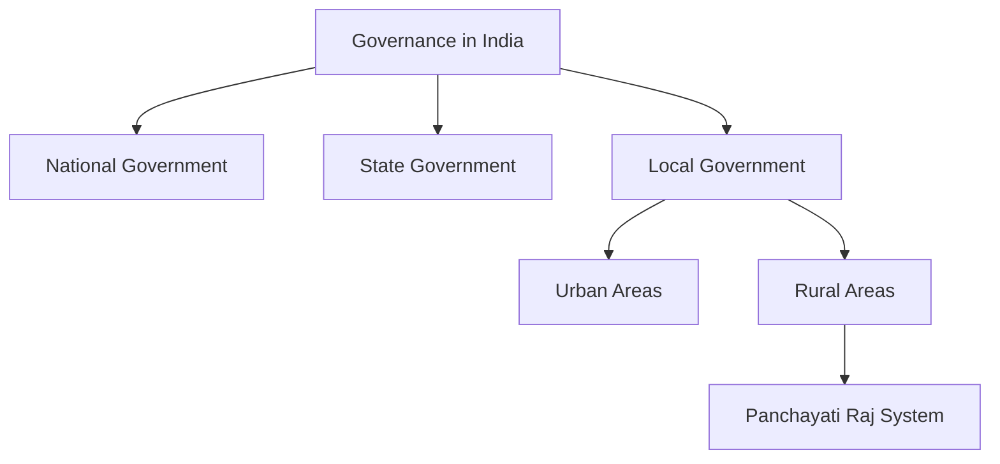
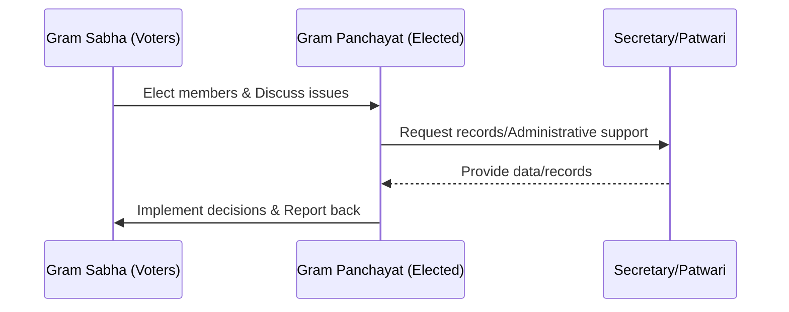

<<<FILE_START: index.mdx>>>
---
title: "Grassroots Democracy: Local Government in Rural Areas"
description: "An overview of the Panchayati Raj system, its structure, and its importance in Indian democracy."
date: 2024-04-10
tags: ["civics", "class-6", "panchayati-raj", "local-government"]
order: 1
draft: false
---

import Callout from '@/components/Callout.astro'

# Grassroots Democracy – Part 2
## Local Government in Rural Areas

> "The real India lives in its villages." – **M.K. Gandhi**

India is a land of vast diversity and size, home to about 600,000 villages. With a population exceeding 1.4 billion, two-thirds of whom live in rural areas, governing such a complex society requires a system that reaches every individual.

This chapter explores how government functions at the local level in rural India. We will look at how villagers make decisions about their daily lives—from water and roads to schools and disputes—without running to the State or National capital for every issue.

### The Big Questions

1.  **What are Panchayati Raj institutions?**
2.  **What are their functions?**
3.  **Why are they important in governance and democracy?**

<Callout variant="tip">
**Context:** In the previous chapter, we explored diversity. In this chapter, we see how that diverse population governs itself through **Grassroots Democracy**.
</Callout>

### Introduction: The Story of Lakshmanpur

Imagine a small village called **Lakshmanpur** in the foothills of the Himalayas.
*   **Population:** ~700 people (200 houses).
*   **Occupation:** Mostly farmers; some in armed forces or migrated to cities.
*   **Needs:** Water for fields, road repairs, school maintenance.

How do they solve their problems? They rely on a system of **Local Government** known as the **Panchayat**.

### Concept Map

This chapter focuses specifically on **Branch F: Rural Areas**.
<<<FILE_END>>>

<<<FILE_START: topics/01-panchayati-raj-overview.mdx>>>
---
title: "The Panchayati Raj System"
description: "Understanding the three-tier structure of rural local government in India."
date: 2024-04-10
tags: ["three-tier-system", "structure", "panchayat"]
order: 2
draft: false
---

import Callout from '@/components/Callout.astro'

## What is the Panchayati Raj?

The **Panchayati Raj** is a system of local self-government in rural India. The word 'Panchayat' refers to a village council. This system brings governance closer to the people, allowing them to participate actively in decision-making processes.

<Callout variant="tip">
**Definition:** **Panchayati Raj** is a form of **self-government** where local people play a vital role in addressing local issues, promoting development, and ensuring government schemes reach the grassroots level.
</Callout>

## The Three-Tier System

The Panchayati Raj system is organized into three levels, forming a pyramid structure. This is often referred to as the **Three-Tier System**.

### Visualizing the Structure

The following diagram illustrates the hierarchy of the Panchayati Raj institutions, from the village level at the bottom to the district level at the top.

<svg width="600" height="400" viewBox="0 0 600 400" xmlns="http://www.w3.org/2000/svg">
  <!-- Top Tier: District Level -->
  <polygon points="250,50 350,50 400,150 200,150" fill="#14b8a6" stroke="currentColor" stroke-width="2" />
  <text x="300" y="90" font-family="sans-serif" font-size="14" font-weight="bold" fill="white" text-anchor="middle">DISTRICT LEVEL</text>
  <text x="300" y="110" font-family="sans-serif" font-size="12" fill="white" text-anchor="middle">Zila Parishad</text>
  <text x="300" y="125" font-family="sans-serif" font-size="12" fill="white" text-anchor="middle">(District Panchayat)</text>

  <!-- Middle Tier: Block Level -->
  <polygon points="180,160 420,160 470,260 130,260" fill="#f97316" stroke="currentColor" stroke-width="2" />
  <text x="300" y="195" font-family="sans-serif" font-size="14" font-weight="bold" fill="white" text-anchor="middle">BLOCK LEVEL</text>
  <text x="300" y="215" font-family="sans-serif" font-size="12" fill="white" text-anchor="middle">Panchayat Samiti</text>
  <text x="300" y="230" font-family="sans-serif" font-size="12" fill="white" text-anchor="middle">(Block Panchayat / Mandal Parishad)</text>

  <!-- Bottom Tier: Village Level -->
  <polygon points="110,270 490,270 540,370 60,370" fill="#84cc16" stroke="currentColor" stroke-width="2" />
  <text x="300" y="305" font-family="sans-serif" font-size="14" font-weight="bold" fill="white" text-anchor="middle">VILLAGE LEVEL</text>
  <text x="300" y="325" font-family="sans-serif" font-size="12" fill="white" text-anchor="middle">Gram Panchayat</text>
  <text x="300" y="340" font-family="sans-serif" font-size="12" fill="white" text-anchor="middle">(Village Parishad)</text>
</svg>

### Roles of the Three Tiers

Together, these institutions cover almost all aspects of life in the district:
*   **Agriculture & Housing**
*   **Road Maintenance**
*   **Water Resource Management**
*   **Education & Health Care**
*   **Social Welfare & Cultural Activities**

The system works from the bottom up, meaning the foundation is the village.
<<<FILE_END>>>

<<<FILE_START: topics/02-gram-panchayat-mechanisms.mdx>>>
---
title: "The Gram Panchayat & Gram Sabha"
description: "Detailed look at the village-level governance, the role of the Gram Sabha, and the Gram Panchayat."
date: 2024-04-10
tags: ["gram-sabha", "sarpanch", "voting", "village-level"]
order: 3
draft: false
---

import Callout from '@/components/Callout.astro'

## The Foundation: Village Level

The base of the Panchayati Raj system is the **Gram Panchayat**. It is the institution closest to the people in rural areas.

### 1. The Gram Sabha (The Legislative Body)

Before a decision is made by the leaders, it is discussed by the people. This happens in the **Gram Sabha**.

*   **Who are the members?** All adults (18+) who are enrolled as voters in the village (or a group of neighboring villages).
*   **Function:** Men and women discuss matters related to their area, review the performance of the Panchayat, and approve plans.
*   **Significance:** It is a form of **direct democracy** where people participate directly.

### 2. The Gram Panchayat (The Executive Body)

The Gram Panchayat is the elected body responsible for implementing decisions.

*   **Election:** Members are elected directly by the Gram Sabha.
*   **Head of Panchayat:** The elected head is called the **Sarpanch** or **Pradhan**.
*   **Composition:**
    *   **Ward Members (Panchs):** Representatives from smaller divisions of the village called Wards.
    *   **Sarpanch:** The president of the Panchayat.

<Callout variant="warning">
**Important Trend:** In recent years, more and more women have become Sarpanchs, taking leadership roles in rural development.
</Callout>

### Administrative Support

The elected members are assisted by government-appointed officials who ensure the system runs smoothly.

| Official | Role |
| :--- | :--- |
| **Panchayat Secretary** | Performs administrative functions like calling meetings and maintaining records of proceedings. |
| **Patwari** | Maintains the villagers' land records and maps. In some cases, these maps are generations old. |

### Decision Flow

<<<FILE_END>>>

<<<FILE_START: topics/03-higher-levels-of-governance.mdx>>>
---
title: "Block and District Administration"
description: "Exploring the functions of the Panchayat Samiti and Zila Parishad."
date: 2024-04-10
tags: ["block-level", "district-level", "zila-parishad", "coordination"]
order: 4
draft: false
---

import Callout from '@/components/Callout.astro'

## Beyond the Village

While the Gram Panchayat handles village-level issues, larger projects require coordination at higher levels. This is where the **Block** and **District** levels come in.

### 1. Panchayat Samiti (Block Level)

The **Panchayat Samiti** (also called Block Panchayat or Mandal Parishad) acts as the **link** between the Gram Panchayat and the Zila Parishad.

*   **Structure:** It covers a block consisting of many villages.
*   **Membership:**
    *   Elected members.
    *   Sarpanchs of villages in the area.
    *   Local Members of the Legislative Assembly (MLAs).
*   **Key Function:**
    *   Coordinate matters across multiple Gram Panchayats.
    *   Collect development plans from villages and consolidate them for the District level.

### 2. Zila Parishad (District Level)

The **Zila Parishad** (District Panchayat) is the apex body of the Panchayati Raj system.

*   **Key Function:**
    *   Facilitates the allotment of funds for development projects.
    *   Manages government schemes like the **Pradhan Mantri Gram Sadak Yojana** (PMGSY), which promotes the construction of all-weather roads.
    *   Oversees the development of the entire district.

### Representation and Inclusivity

At all three levels (Village, Block, District), special rules ensure that disadvantaged sections of society are heard.

<Callout variant="tip">
**Reservation for Women:** There is a mandatory provision for reserving **one-third** of the seats for women in these institutions to ensure their active participation in governance.
</Callout>

### Comparison of Levels

| Level | Institution Name | Primary Role |
| :--- | :--- | :--- |
| **District** | Zila Parishad | Fund allotment, District planning, Road schemes |
| **Block** | Panchayat Samiti | Coordination, Linking Village to District |
| **Village** | Gram Panchayat | Local dispute resolution, Water, Sanitation, School maintenance |

<<<FILE_END>>>

<<<FILE_START: topics/04-impact-and-case-studies.mdx>>>
---
title: "Impact, Initiatives, and Case Studies"
description: "Real-world examples of successful Panchayats, child-friendly initiatives, and exemplary leadership."
date: 2024-04-10
tags: ["case-studies", "women-leadership", "child-friendly", "environment"]
order: 5
draft: false
---

import Callout from '@/components/Callout.astro'

## Exemplary Leadership

The effectiveness of a Panchayat often depends on the vision of its Sarpanch. Here are three inspiring examples of leadership transforming rural India.

### 1. Dnyaneshwar Kamble (Solapur, Maharashtra)
*   **Profile:** A transgender person elected as Sarpanch in 2017.
*   **Motto:** *Lok seva, gram seva* (Service to the village is service to the public).
*   **Achievement:** Defeated six other candidates, proving that service matters more than gender identity.

### 2. Vandana Bahadur Maida (Madhya Pradesh)
*   **Profile:** A member of the Bhil community.
*   **Achievement:** Defied patriarchal norms to become the first female Sarpanch of Khankhandvi village.
*   **Impact:** convinced women to attend Sabha meetings and addressed critical issues like education and sanitation.

### 3. Popatrao Baguji Pawar (Hiware Bazar, Maharashtra)
*   **Challenge:** The village suffered from frequent droughts and poor agricultural yield.
*   **Action:** Implemented rainwater harvesting, watershed conservation, and planted lakhs of trees.
*   **Result:** Groundwater recharged, and the village became green and prosperous.
*   **Recognition:** Awarded the **Padma Shri** in 2020.

---

## Child-Friendly Panchayat Initiative

Panchayats are not just for adults. The **Child-Friendly Panchayat Initiative** creates opportunities for children to express their opinions on matters concerning their well-being.

### Bal Sabhas & Bal Panchayats
In States like Maharashtra, children participate in **Bal Sabhas** (Children's Assemblies).
*   **Goal:** To solve issues like child labor and child marriage.
*   **Action:** Convincing parents to send children back to school.

### Case Study: Sangkhu Radhu Khandu (Sikkim)
This Gram Panchayat in West Sikkim prioritized children's needs:
*   Built compound walls for schools (safety).
*   Constructed kitchens for hygienic midday meals.
*   **Result:** Declared a "Child-Friendly Gram Panchayat".

### Case Study: The Children’s Parliament (Rajasthan)
An offshoot of the 'Barefoot College' initiative:
*   **Participants:** Children aged 8–14.
*   **Structure:** Followed formal procedures (elections, voter IDs, Cabinet).
*   **Impact:** Children managed schools and advocated for community needs, fostering leadership and social responsibility.

<Callout variant="tip">
**Think About It:** Why is it important for a village council to listen to children? Children often raise issues that adults might overlook, such as school safety or playground maintenance.
</Callout>
<<<FILE_END>>>

<<<FILE_START: topics/05-historical-roots.mdx>>>
---
title: "Historical Perspective: The Arthashastra"
description: "Tracing the roots of local governance to ancient Indian texts."
date: 2024-04-10
tags: ["history", "arthashastra", "chanakya", "ancient-india"]
order: 6
draft: false
---

import Callout from '@/components/Callout.astro'

## Ancient Roots of Governance

The concept of organizing villages into administrative units is not new to India. It dates back thousands of years.

### The Arthashastra
Written by **Kautilya** (also known as Chanakya) about 2,300 years ago, the *Arthashastra* is a treatise on statecraft, economic policy, and military strategy. It detailed how a state should be structured, from the village level up to the regional capital.

### Kautilya’s Administrative Structure

Kautilya proposed a hierarchy based on the number of villages, similar to our modern blocks and districts.

| Ancient Name | Modern Equivalent (Approximate) | Scope |
| :--- | :--- | :--- |
| **Sangrahana** | Sub-district Headquarters | Every 10 villages |
| **Karvatika** | District Headquarters | Every 100 villages |
| **Dronamukha** | Major Division | Every 400 villages |
| **Sthaniya** | Provincial Headquarters | Every 800 villages |

<Callout variant="tip">
**Reflection:** Is it not amazing that a similar structured approach to governance—organizing units into larger groups for better management—was thought of so long ago?
</Callout>

### Summary Points Before Moving On
1.  Local government in rural areas is a **three-tier system**.
2.  Democracy works through **direct participation** (Gram Sabha) and **elected representatives** (Gram Panchayat).
3.  These institutions provide **self-governance**, allowing locals to manage their own development.
<<<FILE_END>>>

<<<FILE_START: solutions/ex-1.1.mdx>>>
---
title: "Chapter Exercises & Activities"
description: "Solutions and guides for the Questions, Activities, and Projects at the end of the chapter."
date: 2024-04-10
tags: ["solutions", "exercises", "activities"]
order: 7
draft: false
---

import Callout from '@/components/Callout.astro'

## Questions, Activities, and Projects

### 1. Test Yourself
**Question:** Without looking at the text above, can you name the three tiers of the Panchayati Raj system? What are the key functions of each of the three tiers?

**Answer:**
The three tiers of the Panchayati Raj system are:

1.  **Gram Panchayat (Village Level):**
    *   **Function:** Handles local issues like water, sanitation, school maintenance, and dispute resolution. Implements development schemes at the village level.
2.  **Panchayat Samiti (Block Level):**
    *   **Function:** Acts as a link between the Village and District levels. Coordinates development plans across multiple villages and consolidates them.
3.  **Zila Parishad (District Level):**
    *   **Function:** Oversees the development of the entire district. Facilitates fund allotment and manages large-scale government schemes like road construction.

---

### 2. Letter to the Sarpanch
**Activity:** Write a letter to the Sarpanch regarding the issue of plastic bags lying on the roadside in the village.

**Sample Draft:**

> **To,**
> **The Sarpanch,**
> Gram Panchayat [Village Name],
> [District Name].
>
> **Subject:** Request to address the issue of plastic waste on roadsides.
>
> **Respected Sir/Madam,**
>
> I am a resident of Ward No. 4 of our village. I am writing to bring to your kind attention the increasing problem of plastic bags lying scattered on the main roadside near the school and the market area.
>
> These plastic bags are not only making our village look dirty but are also choking the drains, leading to water stagnation and bad smell. Cows and other stray animals often eat these bags, which is dangerous for their health.
>
> I request the Gram Panchayat to organize a cleanliness drive and install dustbins at key locations. We can also conduct an awareness campaign to encourage villagers to use cloth bags instead of plastic.
>
> I am willing to volunteer for any such initiative taken by the Panchayat.
>
> **Yours sincerely,**
> [Your Name]
> [Date]

---

### 3. Ideal Panchayat Member
**Question:** In your view, what type of person should be a Gram Panchayat member?

**Discussion Points:**
An ideal Gram Panchayat member should possess the following qualities:
*   **Accessible:** They should be easy to approach for any villager.
*   **Honest & Transparent:** They should handle public funds with integrity.
*   **Inclusive:** They should listen to everyone, including women, children, and disadvantaged communities, not just the wealthy or powerful.
*   **Proactive:** Instead of waiting for complaints, they should actively look for problems to solve (like repairing a broken tap before it floods).
*   **Visionary:** Like Sarpanch Popatrao Pawar, they should have a long-term vision for the village's environment and prosperity.

---

### 4. Problem Solving: Highway Safety
**Scenario:** You study in a village school located next to a highway. Students find it difficult to cross the road.
*   **What are the options to solve this issue?**
*   **Which institutions in the Panchayati Raj can help?**
*   **What can the students do?**

**Solution Strategy:**

1.  **Options to solve the issue:**
    *   Construction of a speed breaker or rumble strips near the school.
    *   Installation of "School Ahead" or "Go Slow" signboards.
    *   Construction of a zebra crossing or a foot-over bridge (for very busy highways).
    *   Deploying a traffic volunteer during school start and end times.

2.  **Institutions that can help:**
    *   **Gram Panchayat:** The first point of contact. They can pass a resolution demanding safety measures.
    *   **Zila Parishad:** Since highways are often managed at a higher level or involve the Public Works Department (PWD), the Gram Panchayat will escalate this to the **Zila Parishad** to get funds or permission for speed breakers.

3.  **What can students do?**
    *   Form a student group or use the **Bal Panchayat** to draft a petition.
    *   Present the petition to the Headmaster and the Sarpanch.
    *   Organize a safety awareness campaign to teach younger students how to cross carefully until the infrastructure is fixed.
<<<FILE_END>>>

<<<FILE_START: practice/case-study-hiware-bazar.mdx>>>
---
title: "Deep Dive: The Hiware Bazar Miracle"
description: "A detailed look at how a single village transformed itself through good governance."
date: 2024-04-10
tags: ["environment", "water-conservation", "success-story"]
order: 8
draft: false
---

import Callout from '@/components/Callout.astro'

## From Drought to Prosperity

**Hiware Bazar**, located in the Ahmednagar district of Maharashtra, is one of the most famous examples of successful rural governance in India. This case study illustrates the power of the **Gram Panchayat** when led effectively.

### The Problem (Pre-1990s)
*   **Climate:** Located in a rain-shadow area with very low rainfall.
*   **Economy:** Severe water scarcity led to poor agricultural yields.
*   **Migration
