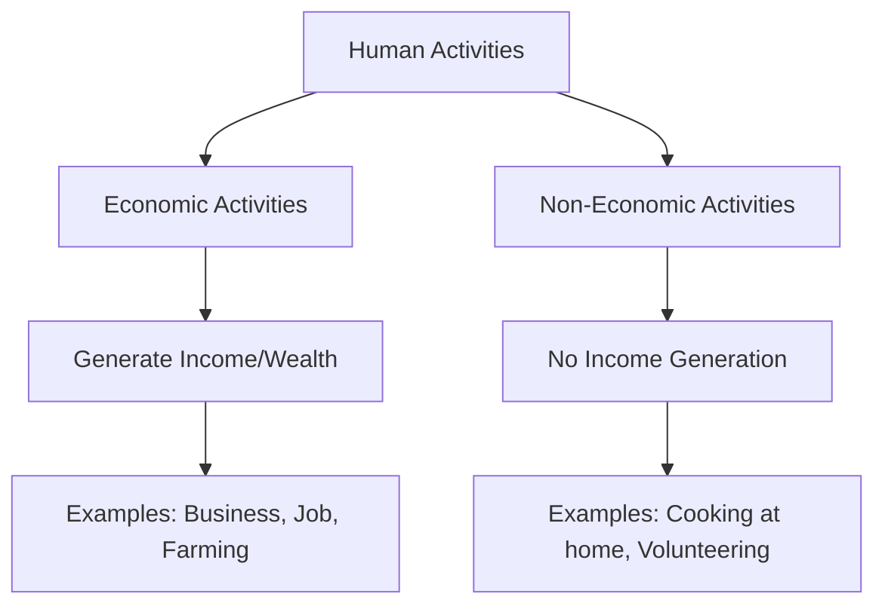
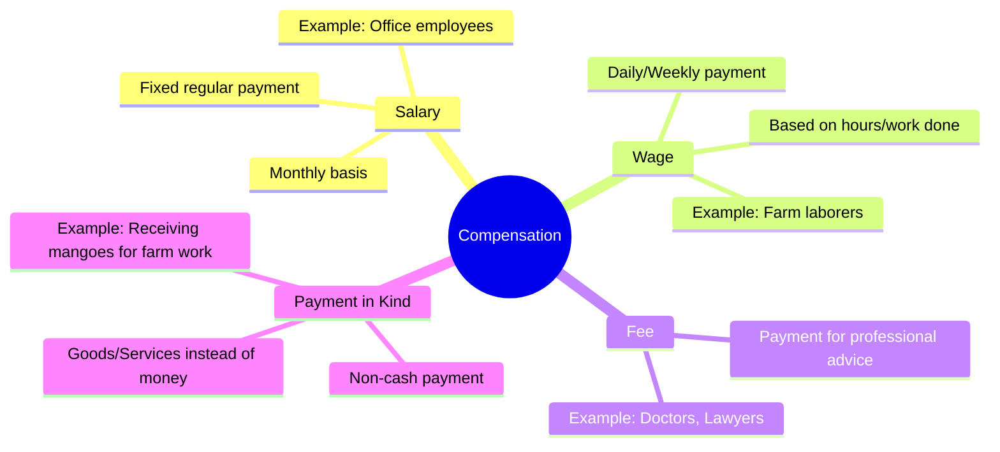

<<<FILE_START: index.mdx>>>
---
title: "The Value of Work"
description: "Introduction to economic and non-economic activities, value addition, and the importance of work in society."
date: 2025-01-15
tags: ["social-science", "economics", "work", "class-6"]
order: 1
draft: false
---

import Callout from '@/components/Callout.astro'

# The Value of Work

> "When you are doing any work, do not think of anything beyond. Do it as worship, as the highest worship, and devote your whole life to it for the time being." — **Swami Vivekananda**

## Introduction

Every day, we see people around us engaged in various activities. From a pilot flying a plane to a shopkeeper selling uniforms, and from a software engineer developing apps to a mother cooking for her family—everyone is busy doing something.

In this chapter, we explore the **nature of these activities**. We will learn why some work earns money while other work does not, and why both are equally important for our lives and society.

## The Big Questions

1.  What are the different types of activities that people engage in?
2.  What is their contribution to our everyday lives?

## Chapter Overview

We will divide our study into three main sections:

1.  **Economic vs. Non-Economic Activities**: Understanding the difference between work done for money and work done for love or duty.
2.  **Compensation & Value Addition**: How people get paid (Salary, Wage, Fee) and how work adds value to raw materials.
3.  **Community & Service**: The importance of selfless service (*Seva*) and community participation.

<Callout variant="tip">
**Activity:** As you read through, think about the work your family members do. Try to classify them into the categories we discuss!
</Callout>
<<<FILE_END>>>

<<<FILE_START: topics/01-economic-vs-non-economic.mdx>>>
---
title: "Economic and Non-Economic Activities"
description: "Defining and distinguishing between activities based on monetary generation."
date: 2025-01-15
tags: ["definitions", "activities", "economy"]
order: 2
draft: false
---

import Callout from '@/components/Callout.astro'

## Classification of Human Activities

Human activities can be broadly classified into two categories based on their purpose and end result: **Economic Activities** and **Non-Economic Activities**.

### 1. Economic Activities

**Economic activities** are those that involve money or are performed in exchange for money or **money's worth**. The primary motive is to earn a livelihood or profit.

<Callout variant="info">
**Key Definitions:**
*   **Market:** A place where people engage in the exchange of goods and services, usually for money.
*   **Fee:** A payment made to a professional (like a doctor or lawyer) for their advice or services.
*   **Money's Worth:** The monetary value a person places on an object based on the benefit they derive from it.
</Callout>

**Examples:**
*   A **pilot** flying a commercial plane for an airline.
*   A **shopkeeper** selling school bags and uniforms.
*   A **farmer** selling produce in the market.
*   A **lawyer** arguing a case for a fee.
*   A **truck driver** transporting goods.

### 2. Non-Economic Activities

**Non-economic activities** are those that **do not generate income or wealth**. These are performed out of feelings like love, gratitude, care, respect, or social duty.

**Examples:**
*   **Parents** cooking food for the family.
*   **Youth** taking care of grandparents.
*   **Volunteering** to teach neighborhood kids for free.
*   Family members helping renovate their own house.

<Callout variant="tip">
**Think About It:** If a teacher teaches in a school, she gets a salary (Economic). If the same teacher teaches her own child at home, she gets no money (Non-Economic). The **nature** of the activity is the same (teaching), but the **purpose** changes the classification.
</Callout>

### Summary Table

| Feature | Economic Activity | Non-Economic Activity |
| :--- | :--- | :--- |
| **Goal** | To earn money or wealth. | Personal satisfaction, social obligation, love. |
| **Reward** | Monetary (Money). | Psychological (Happiness, Gratitude). |
| **Example** | Doctor treating a patient in a hospital. | Doctor treating their own child at home. |
<<<FILE_END>>>

<<<FILE_START: topics/02-compensation-and-value-addition.mdx>>>
---
title: "Compensation and Value Addition"
description: "Exploring different types of payments and the concept of value addition in work."
date: 2025-01-15
tags: ["salary", "wages", "value-addition"]
order: 3
draft: false
---

import Callout from '@/components/Callout.astro'

## Forms of Compensation

People engaged in economic activities receive payment in different ways. The method of payment often depends on the type of work and the agreement between the worker and the employer.

### 1. Salary
A **salary** is a fixed regular payment, generally paid monthly by an employer to an employee.
*   *Example:* Geeta Aunty (Pilot) receives a monthly salary.

### 2. Wage
A **wage** is often a daily or weekly payment made for manual labor or short-term work.
*   *Example:* Sahil, a farm labourer, earns a daily wage for tilling land.

### 3. Fee
A **fee** is a payment made to a person or organization in exchange for professional advice or specialized services.
*   *Example:* A tutor charging a weekly fee for classes; a lawyer's fee.

### 4. Payment in Kind
**Payment in kind** refers to a non-cash payment where goods or services are given instead of money.
*   *Example:* Sahil receiving a portion of his payment in the form of **mangoes** instead of cash.

---

## Value Addition

Economic activities involve transforming something into a more useful form. This process adds monetary value to the object.

### The Carpenter's Example
Let's look at Rajesh, a carpenter, to understand **Value Addition**.

1.  **Raw Material Cost:** Rajesh buys wood for **₹600**.
2.  **The Process:** He uses his tools, skill, time, and effort to build a chair.
3.  **Final Price:** He sells the chair for **₹1,000**.

$$
\text{Value Added} = \text{Selling Price} - \text{Cost of Raw Materials}
$$

$$
\text{Value Added} = ₹1,000 - ₹600 = ₹400
$$

**What is the ₹400 for?**
It represents the monetary value of Rajesh's **skill, time, and effort**. By turning raw wood into a finished chair, he has "added value" to it.

<Callout variant="tip">
**Conclusion:** Economic activities create value at every stage of processing, transforming raw materials into useful goods.
</Callout>
<<<FILE_END>>>

<<<FILE_START: topics/03-community-and-service.mdx>>>
---
title: "Community and Service"
description: "The importance of non-economic activities like Seva and community participation."
date: 2025-01-15
tags: ["seva", "community", "social-welfare"]
order: 4
draft: false
---

import Callout from '@/components/Callout.astro'

## The Importance of Non-Economic Activities

While non-economic activities do not generate money, they are vital for personal well-being and social harmony. They foster love, respect, and a sense of belonging.

### Sevā: Selfless Service
**Sevā** refers to service performed without the expectation of any reward or payment. It gives a deep sense of satisfaction.

**Examples of Sevā:**
*   **Langars:** Community kitchens in Gurudwaras that serve free food to everyone, regardless of their background.
*   **Temples/Mosques/Churches:** Distributing *prasād* or helping the needy.

### Community Participation
When people come together to work for the common good, it is called community participation. Collective efforts can solve problems that individuals cannot solve alone.

#### 1. Swachh Bharat Abhiyan
This is a nationwide campaign in India based on collective effort.
*   **Goal:** To keep streets, roads, and infrastructure clean.
*   **Action:** Citizens volunteer to clean public spaces.
*   **Result:** A cleaner home, neighborhood, and nation.

#### 2. Van Mahotsav
Known as the "Festival of Forests," this is an annual tree-planting movement in India.
*   **Goal:** Promote awareness about the value of trees and forest conservation.
*   **Action:** Communities gather for tree plantation drives.

<Callout variant="tip">
**Core Concept:** These activities contribute to **social welfare** and enhance the overall **quality of life**, proving that value is not always measured in money.
</Callout>
<<<FILE_END>>>

<<<FILE_START: solutions/ex-13.1.mdx>>>
---
title: "Chapter Questions & Projects"
description: "Comprehensive solutions to the questions at the end of the chapter."
date: 2025-01-15
tags: ["solutions", "exercise"]
order: 5
draft: false
---

import Callout from '@/components/Callout.astro'

## Questions, Activities and Projects

### Q1. How are economic activities different from non-economic activities?

**Answer:**
The main differences lie in the motive and the outcome of the activity:

| Basis of Difference | Economic Activities | Non-Economic Activities |
| :--- | :--- | :--- |
| **Motive** | To earn money, profit, or livelihood. | Love, care, duty, gratitude, or satisfaction. |
| **Monetary Aspect** | Involves exchange of money or money's worth. | Does not involve any monetary exchange. |
| **Outcome** | Creates income and wealth. | Creates social welfare, happiness, and well-being. |
| **Example** | A chef cooking in a restaurant for a salary. | A mother cooking for her family at home. |

---

### Q2. What kind of economic activities do people engage in? Illustrate with examples.

**Answer:**
People engage in various economic activities based on their skills and opportunities. These can be categorized by the type of compensation or the nature of work:

1.  **Business/Trading:** Buying and selling goods for profit.
    *   *Example:* A shopkeeper selling uniforms or a vegetable vendor selling produce.
2.  **Employment (Salary/Wage):** Working for an organization or individual.
    *   *Example:* A pilot flying a plane (Salary), a factory worker operating machines (Wage).
3.  **Professional Services (Fee):** Providing specialized skills.
    *   *Example:* A doctor treating patients or a lawyer arguing a case for a fee.
4.  **Agriculture/Production:** Producing goods to sell.
    *   *Example:* A farmer growing crops to sell in the market.

---

### Q3. There is great value attached to people who are engaged in community service activities. Comment on this statement.

**Answer:**
This statement is true because community service activities, though non-economic, provide immense **social value**:

*   **Social Bonding:** They bring people together, strengthening unity and brotherhood (e.g., celebrating festivals together).
*   **Support System:** They provide help to the needy without cost (e.g., Langars or free medical camps).
*   **Environment & Health:** Campaigns like *Swachh Bharat Abhiyan* or *Van Mahotsav* improve our living conditions and environment.
*   **Emotional Satisfaction:** They foster feelings of gratitude, peace, and satisfaction for both the giver and the receiver.

Therefore, while they may not have a "price tag," their value to society is priceless.

---

### Q4. What are the various ways in which people are compensated for various economic activities? Give some examples.

**Answer:**
People are compensated in four main ways:

1.  **Salary:** A fixed regular payment, usually monthly.
    *   *Example:* An office manager or a school teacher employed by a school.
2.  **Wage:** Payment calculated daily or weekly, often for manual work.
    *   *Example:* A construction worker or a farm labourer.
3.  **Fee:** Payment for a specific professional service or advice.
    *   *Example:* A doctor's consultation fee or a tutor's tuition fee.
4.  **Payment in Kind:** Receiving goods or services instead of cash.
    *   *Example:* A farm worker receiving a sack of rice or mangoes as part of their payment for working in the fields.
<<<FILE_END>>>

<<<FILE_START: practice/solved-examples.mdx>>>
---
title: "Practice & Let's Explore"
description: "Additional solved examples and activity classifications based on the chapter content."
date: 2025-01-15
tags: ["practice", "examples", "activities"]
order: 6
draft: false
---

import Callout from '@/components/Callout.astro'

## Let's Explore: Activity Classification

**Task:** Classify the following activities found in the story of Anu and Kabir as **Economic** or **Non-Economic**.

| Character | Activity | Classification | Reason |
| :--- | :--- | :--- | :--- |
| **Geeta Aunty** | Flying a plane (Pilot) | **Economic** | She receives a **salary** for her service to the Air Force. |
| **Rohan** | Working as Software Engineer | **Economic** | He works for a company and gets a **salary**. |
| **Rohan** | Teaching computer skills (Volunteer) | **Non-Economic** | He volunteers for free; done for social service. |
| **Shopkeeper (Appa)** | Selling uniforms | **Economic** | He sells goods in the market for **profit**. |
| **Maa** | Teaching knitting (Volunteer) | **Non-Economic** | She contributes to a voluntary group without pay. |
| **Grandfather** | Retired BSF officer | **Non-Economic** | (Current status) Spending time at home/park is non-economic. |

---

## Identify Value Creation

**Task:** Put a check mark (✅) against activities that create **monetary value** (Economic) and identify the type of value creation.

1.  **Baker**
    *   **Status:** ✅ Economic
    *   **Value Creation:** Transforms flour/ingredients into bread/cakes (Manufacturing/Processing).

2.  **Tailor**
    *   **Status:** ✅ Economic
    *   **Value Creation:** Transforms fabric into clothes (Skill & Service).

3.  **Farmers repairing their tractor**
    *   **Status:** ✅ Economic (Indirect)
    *   **Value Creation:** Maintaining capital assets to ensure production continues.

4.  **Doctor**
    *   **Status:** ✅ Economic
    *   **Value Creation:** Provides health services for a fee.

5.  **Parents cooking dinner for their family**
    *   **Status:** ❌ Non-Economic
    *   **Value Creation:** Creates love and health, but no monetary exchange.

6.  **Scientist**
    *   **Status:** ✅ Economic (if employed)
    *   **Value Creation:** Research and innovation for salary.

7.  **Person taking care of a sick grandparent**
    *   **Status:** ❌ Non-Economic
    *   **Value Creation:** Care and emotional support.

---

## Think About It: Scenarios

**Scenario 1: Grandfather teaching neighborhood kids for free.**
*   **Question:** Is this economic or non-economic? How is it different from school teachers?
*   **Solution:** This is a **Non-Economic Activity**. Even though the action (teaching) is the same as a school teacher, the motive is **social service** or personal satisfaction, and there is no monetary exchange (Salary/Fee). A school teacher does it as a profession for a livelihood.

**Scenario 2: Festivals and Food.**
*   **Question:** During festivals, people decorate and cook together. Why does this hold value?
*   **Solution:** These are **Non-Economic Activities**. They hold value because they build **community strength**, preserve **culture**, and provide **emotional well-being**. The joy shared during a festival cannot be bought with money.
<<<FILE_END>>>
