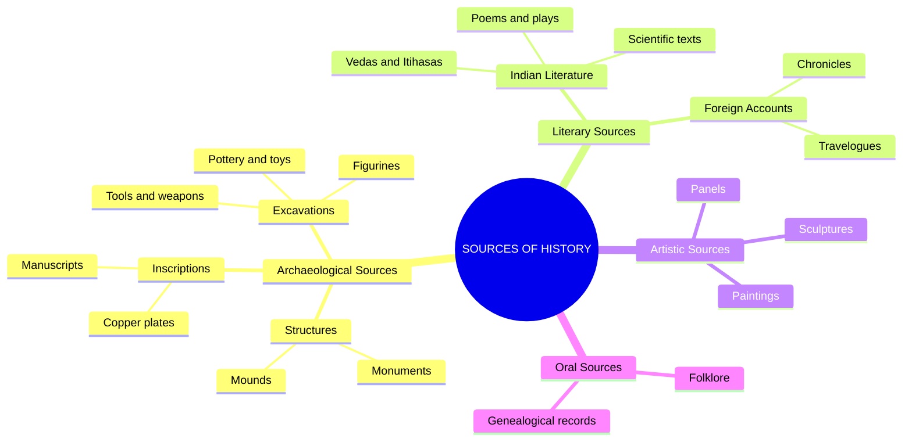

<<<FILE_START: index.mdx>>>
---
title: "Timeline and Sources of History"
description: "An introduction to how we measure historical time, the various sources used to reconstruct the past, and the early stages of human history."
date: 2024-04-10
tags: ["history", "timeline", "BCE-CE", "human-evolution"]
order: 1
draft: false
---

import Callout from '@/components/Callout.astro'

## Introduction

History is "an unending dialogue between the present and the past." To understand the world we live in today, we must look back at the societies of yesterday. This chapter explores the tools historians use to measure time, the evidence they gather to piece together the past, and the journey of early humans from hunters to farmers.

<Callout variant="info">
**The Big Questions:**
1. How do we measure historical time?
2. How can various sources help us understand history?
3. How did early humans live?
</Callout>

## Formula Sheet: Calculating Time

In the Gregorian calendar, there is **no year zero**. To calculate the duration between a BCE date and a CE date, use the following formula:

$$
\text{Total Years} = (\text{Year in BCE} + \text{Year in CE}) - 1
$$

*Example:* Between 2 BCE and 2 CE: $(2 + 2) - 1 = 3$ years.

## List of Topics

1. **[How Do We Learn About the Past?](./topics/01-learning-about-past)** - Understanding the roles of archaeologists, geologists, and more.
2. **[Measuring Time in History](./topics/02-measuring-time)** - Exploring the Gregorian calendar, BCE/CE, and centuries.
3. **[The Sources of History](./topics/03-sources-of-history)** - Archaeological, Literary, and Artistic evidence.
4. **[The Beginnings of Human History](./topics/04-human-beginnings)** - From early hunter-gatherers to the first crops.

<<<FILE_END>>>

<<<FILE_START: topics/01-learning-about-past.mdx>>>
---
title: "How Do We Learn About the Past?"
description: "The roles of different specialists who uncover the history of the Earth and humans."
date: 2024-04-10
tags: ["archaeology", "geology", "anthropology", "fossils"]
order: 2
draft: false
---

import Callout from '@/components/Callout.astro'

## Specialists of the Past

Many different experts work together to uncover the secrets of our past. Each looks at a different type of evidence.

### 1. Geologists
They study the physical features of the Earth, such as soil, stones, mountains, and oceans.

### 2. Palaeontologists
They study the remains of plants, animals, and humans from millions of years ago, which are preserved as **fossils**.

<Callout variant="tip">
**Fossils:** Impressions of footprints, or parts of plants or animals found preserved within layers of soil or rocks.
</Callout>

### 3. Anthropologists
They study human societies and cultures, looking at how they have changed from ancient times to the present.

### 4. Archaeologists
They dig up remains left behind by people, such as tools, pots, beads, figurines, and even the ruins of houses.

## The Timeline of Life on Earth

Human history is only a tiny fraction of the Earth's total history.

<svg viewBox="0 0 800 400" width="100%" height="auto" xmlns="http://www.w3.org/2000/svg">
  <!-- Timeline Arc -->
  <path d="M 100 350 Q 400 50 700 350" stroke="currentColor" fill="none" stroke-width="8" stroke-linecap="round" />

  <!-- Markers -->
  <!-- Earth 4.54 Billion -->
  <circle cx="115" cy="330" r="5" fill="currentColor" />
  <text x="70" y="370" fill="currentColor" font-size="12">Earth Formed (4.54B)</text>

  <!-- First Cells -->
  <circle cx="200" cy="220" r="5" fill="currentColor" />
  <text x="140" y="210" fill="currentColor" font-size="12">First Cells</text>

  <!-- Fish -->
  <circle cx="400" cy="115" r="5" fill="currentColor" />
  <text x="380" y="100" fill="currentColor" font-size="12">Fish (500M)</text>

  <!-- Dinosaurs -->
  <circle cx="600" cy="220" r="5" fill="currentColor" />
  <text x="610" y="220" fill="currentColor" font-size="12">Dinosaurs (300M)</text>

  <!-- Humans -->
  <circle cx="685" cy="330" r="5" fill="currentColor" />
  <text x="650" y="370" fill="currentColor" font-size="12">Homo Sapiens (300k)</text>
</svg>

<<<FILE_END>>>

<<<FILE_START: topics/02-measuring-time.mdx>>>
---
title: "Measuring Time in History"
description: "Understanding the Gregorian calendar, BCE/CE notation, and units of time like centuries and millenniums."
date: 2024-04-10
tags: ["calendar", "BCE", "CE", "chronology"]
order: 3
draft: false
---

import Callout from '@/components/Callout.astro'

## The Gregorian Calendar

At present, the **Gregorian calendar** is the most commonly used worldwide. It uses the conventional year of Jesus Christ's birth as a starting point.

### BCE and CE
*   **CE (Common Era):** Refers to years after the starting point. Formerly known as **AD** (*Anno Domini*). Example: 1947 CE.
*   **BCE (Before Common Era):** Refers to years before the starting point. These are counted backward. Formerly known as **BC** (*Before Christ*). Example: 560 BCE.

<Callout variant="warning">
**Crucial Note:** There is no "Year 0". The year 1 CE follows immediately after 1 BCE.
</Callout>

## Calculating Time Durations

To find how many years have passed between a BCE date and a CE date:
1.  Add the two numbers.
2.  Subtract 1 (because there is no year 0).

**Example:** How many years ago was 560 BCE from 2024 CE?
$$
560 + 2024 - 1 = 2583 \text{ years}
$$

## Units of Time

| Term | Duration | Example |
| :--- | :--- | :--- |
| **Decade** | 10 Years | 2010 to 2019 |
| **Century** | 100 Years | 21st Century (2001–2100) |
| **Millennium** | 1,000 Years | 3rd Millennium (2001–3000) |

<Callout variant="tip">
**Calculating Centuries:**
To find the century of a year, look at the hundreds place and add 1.
*   Year 320 CE: $3 + 1 = 4^{\text{th}}$ Century CE.
*   Year 1828 CE: $18 + 1 = 19^{\text{th}}$ Century CE.
</Callout>

<<<FILE_END>>>

<<<FILE_START: topics/03-sources-of-history.mdx>>>
---
title: "The Sources of History"
description: "Categorizing the evidence historians use to reconstruct past events."
date: 2024-04-10
tags: ["literary-sources", "archaeology", "inscriptions", "manuscripts"]
order: 4
draft: false
---

import Callout from '@/components/Callout.astro'

## How We Know the Past

Historians act like detectives. They use "sources"—clues left behind by people—to re-create history.

### Classification of Sources

## Types of Evidence

1.  **Archaeological:** Physical objects like coins, buildings, and tools found through digging (excavation).
2.  **Literary:** Written records. Before the printing press, these were **manuscripts** (handwritten on palm leaves or bark).
3.  **Inscriptions:** Writing carved on hard surfaces like stone or metal. People who study these are called **epigraphists**.
4.  **Scientific Data:** Modern historians also use genetics (DNA studies) and climate data to understand the past.

<Callout variant="info">
**Why use multiple sources?**
Sometimes sources contradict each other. Historians must cross-check different pieces of evidence to see if the "jigsaw pieces" match.
</Callout>

<<<FILE_END>>>

<<<FILE_START: topics/04-human-beginnings.mdx>>>
---
title: "The Beginnings of Human History"
description: "The transition from early hunting-gathering bands to settled agricultural communities."
date: 2024-04-10
tags: ["stone-age", "agriculture", "ice-age", "domestication"]
order: 5
draft: false
---

import Callout from '@/components/Callout.astro'

## Early Humans (Homo sapiens)

Modern humans have existed for about 300,000 years. For most of this time, they were **hunters and gatherers**.

*   **Social Life:** Lived in small groups called **bands**.
*   **Survival:** Relied on hunting animals and gathering wild plants/fruits.
*   **Technology:** Made stone axes, blades, and arrowheads.
*   **Art:** Created rock paintings in caves depicting animals and human figures.

## The Impact of Climate Change

The Earth experienced several **Ice Ages**—periods when much of the Earth was covered in ice. The last Ice Age ended about **12,000 years ago**.

<svg viewBox="0 0 600 120" xmlns="http://www.w3.org/2000/svg">
  <defs>
    <marker id="arrowhead" markerWidth="10" markerHeight="7" refX="0" refY="3.5" orient="auto">
      <polygon points="0 0, 10 3.5, 0 7" fill="currentColor" />
    </marker>
  </defs>
  <line x1="50" y1="60" x2="530" y2="60" stroke="currentColor" stroke-width="2" marker-end="url(#arrowhead)" />

  <circle cx="60" cy="60" r="4" fill="currentColor" />
  <text x="30" y="90" fill="currentColor" font-size="10">100,000 years ago (Ice Age starts)</text>

  <circle cx="350" cy="60" r="4" fill="currentColor" />
  <text x="310" y="90" fill="currentColor" font-size="10">12,000 years ago (Ice Age ends)</text>

  <circle cx="500" cy="60" r="4" fill="currentColor" />
  <text x="480" y="90" fill="currentColor" font-size="10">Today</text>
</svg>

## The First Crops and Settlements

As the climate warmed, humans began to settle down.

1.  **Agriculture:** They started cultivating cereals and grains.
2.  **Domestication:** They began taming animals like cattle and goats.
3.  **Settlements:** Humans built **hamlets** (small villages) near rivers for water and fertile soil.
4.  **Social Complexity:** Leaders or **chieftains** emerged to manage the community's **welfare**.

<Callout variant="tip">
**Collective Living:** In early agricultural societies, there was often no individual ownership. Land was sowed and harvested collectively.
</Callout>

<<<FILE_END>>>

<<<FILE_START: solutions/ex-4.1.mdx>>>
---
title: "Chapter Exercises"
description: "Step-by-step solutions to the questions and activities for Chapter 4."
date: 2024-04-10
tags: ["solutions", "history", "dating-exercises"]
order: 6
draft: false
---

import Callout from '@/components/Callout.astro'

## Questions and Activities

### Q1. Can we compare historians to detectives? Give reasons.
**Answer:** Yes, historians are very much like detectives.
*   **Evidence:** Just as a detective looks for clues at a crime scene, a historian looks for "sources" (coins, pots, old texts).
*   **Reconstruction:** Detectives piece together what happened during a crime; historians piece together what happened hundreds or thousands of years ago.
*   **Verification:** Detectives check if witness statements match physical evidence; historians check if literary sources (like a book) match archaeological sources (like an inscription).

### Q2. Dating Exercises

#### A. Place these dates chronologically on a timeline:
*   *Dates:* 323 CE, 323 BCE, 100 CE, 100 BCE, 1900 BCE, 1090 CE, 2024 CE.

**Chronological Order (Oldest to Newest):**
1. 1900 BCE
2. 323 BCE
3. 100 BCE
4. 100 CE
5. 323 CE
6. 1090 CE
7. 2024 CE

#### B. If King Chandragupta was born in 320 CE, which century did he belong to? And how many years was that after the Buddha’s birth (560 BCE)?
1.  **Century:** 320 CE falls in the **$4^{\text{th}}$ Century CE**.
2.  **Years after Buddha's birth:**
    *   Formula: $(\text{Year in BCE} + \text{Year in CE}) - 1$
    *   Calculation: $(560 + 320) - 1 = 880 - 1 = \mathbf{879 \text{ years}}$.

#### C. Rani of Jhansi was born in 1828. Which century did she belong to? How many years was that before India’s Independence (1947)?
1.  **Century:** 1828 falls in the **$19^{\text{th}}$ Century CE**.
2.  **Years before Independence:**
    *   Calculation: $1947 - 1828 = \mathbf{119 \text{ years}}$.

#### D. Turn ‘12,000 years ago’ into a date (assuming the current year is 2024).
*   Calculation: $12000 - 2024 = 9976$
*   Date: **9976 BCE**.

<<<FILE_END>>>

<<<FILE_START: practice/solved-examples.mdx>>>
---
title: "Solved Examples: Time Calculations"
description: "Practice problems for mastering the BCE/CE timeline and century calculations."
date: 2024-04-10
tags: ["practice", "math-in-history", "BCE-CE"]
order: 7
draft: false
---

import Callout from '@/components/Callout.astro'

## Practice Problems

### Example 1: Calculating Millenniums
**Question:** In which millennium does the year 2500 BCE fall?
**Solution:**
Millenniums are counted in blocks of 1,000 years starting from 1 BCE (counting backward).
*   1st Millennium BCE: 1 to 1000 BCE
*   2nd Millennium BCE: 1001 to 2000 BCE
*   3rd Millennium BCE: 2001 to 3000 BCE
**Answer:** The year 2500 BCE falls in the **3rd Millennium BCE**.

### Example 2: The "No Year Zero" Rule
**Question:** A traveler started a journey in 5 BCE and finished in 5 CE. How many years did the journey take?
**Solution:**
$$
\text{Total Years} = (5 + 5) - 1 = 9 \text{ years}
$$
**Why?** Because the sequence is: 5BCE, 4BCE, 3BCE, 2BCE, 1BCE, 1CE, 2CE, 3CE, 4CE, 5CE. Counting these, we get 10 positions, but the *duration* across the gap is 9 years.

### Example 3: Inscription Dating
**Question:** An inscription says it was carved in the 2nd century BCE. What is the possible range of years?
**Solution:**
*   1st Century BCE: 1 to 100 BCE
*   2nd Century BCE: 101 to 200 BCE
**Answer:** The range is **200 BCE to 101 BCE**. (Remember, BCE counts backward!)

<Callout variant="tip">
**Quick Check:**
If the year is CE, move forward in time. If the year is BCE, the larger number is further in the past.
</Callout>

<<<FILE_END>>>
