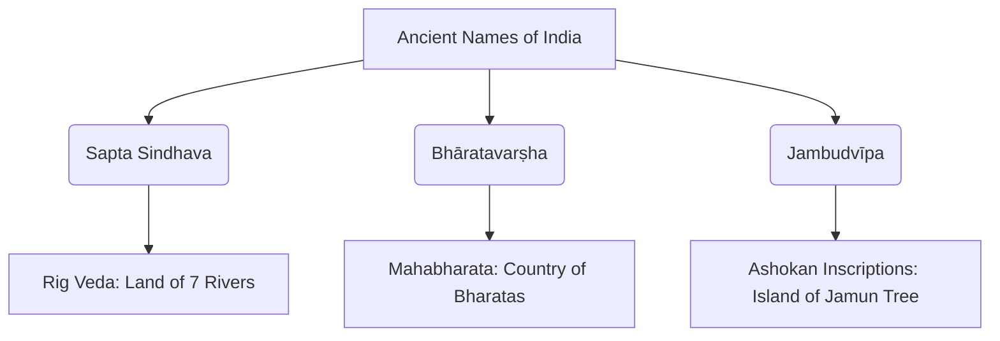

<<<FILE_START: index.mdx>>>
---
title: "India, That Is Bharat"
description: "An exploration of the ancient and modern names of the Indian Subcontinent and how they evolved over time."
date: 2024-04-10
tags: ["History", "Ancient India", "Geography", "Constitution"]
order: 1
draft: false
---

import Callout from '@/components/Callout.astro'

## Introduction

Chapter 5 explores the identity of India through its various names across history. From the ancient "Sapta Sindhava" mentioned in the Rig Veda to the constitutional "India, that is Bharat," the chapter traces how geographical, cultural, and spiritual unity shaped the names of this land.

<Callout variant="info">
**The Big Questions:**
1. How do we define India?
2. What were the ancient names for India?
</Callout>

## Chapter Summary

In this chapter, we will learn about:
- **Ancient Indian Names:** How texts like the *Rig Veda*, *Mahābhārata*, and *Purāṇas* identified the land.
- **Geographical Boundaries:** The natural borders defined by the Himalayas and the seas.
- **Foreign Perspectives:** How Persians, Greeks, and Chinese travelers named the region based on the River Sindhu (Indus).
- **Modern Identity:** The significance of the opening lines of the Indian Constitution.

## Formula & Key Concepts

### Key Terms
| Term | Meaning |
| :--- | :--- |
| **Sapta Sindhava** | The land of the seven rivers (mentioned in Rig Veda). |
| **Jambudvīpa** | The island of the fruit of the jamun tree. |
| **Bhāratavarṣha** | The country of the Bharatas. |
| **Sindhu** | The Sanskrit name for the Indus River. |

---

## List of Topics
1. [How Indians Named India](./topics/01-how-indians-named-india)
2. [How Foreigners Named India](./topics/02-how-foreigners-named-india)
3. [The Modern Constitution](./topics/03-modern-identity)
4. [Exercises and Solutions](./solutions/ex-5)

<<<FILE_END>>>

<<<FILE_START: topics/01-how-indians-named-india.mdx>>>
---
title: "How Indians Named India"
description: "Exploring ancient indigenous names like Sapta Sindhava, Bharatavarsha, and Jambudvipa."
date: 2024-04-10
tags: ["Rig Veda", "Mahabharata", "Purana", "History"]
order: 2
draft: false
---

import Callout from '@/components/Callout.astro'

## Ancient Names in Literature

Ancient Indian texts do not just provide names but also describe the geography of the subcontinent.

### 1. Sapta Sindhava
The **Ṛig Veda**, India’s most ancient text (several thousand years old), refers to the northwest region as **'Sapta Sindhava'**, meaning the **'land of the seven rivers'**.
- The name is derived from **'Sindhu'**, which refers to the Indus River.

### 2. Bhāratavarṣha and Jambudvīpa
The **Mahābhārata** and later texts use terms that encompass the entire subcontinent:

- **Bhāratavarṣha:** Means "the country of the Bharatas." The *Bharatas* were a prominent Vedic group of people mentioned first in the Rig Veda.
- **Jambudvīpa:** Means "the island of the fruit of the jamun tree" (Indian Blackberry). Emperor Ashoka (c. 250 BCE) used this name in his inscriptions to describe his empire, which included modern-day India, Pakistan, Bangladesh, and parts of Afghanistan.

### 3. The Definition in the Viṣhṇu Purāṇa
The *Viṣhṇu Purāṇa* provides a clear geographical definition of the land:

$$
\text{uttaram yat samudrasya himādreścaiva}
$$
$$
\text{dakṣiṇam varṣam tad bhāratam nāma ...}
$$

> "The country that lies north of the ocean and south of the snowy mountains is called Bhārata."

  

    
"Ancient Indians knew their geography well, defining the land by the Himalayas in the North and the Seas in the South, East, and West."

  

### Mapping Ancient Regions
The Mahābhārata mentions several regions that we recognize today:
- **Kāshmīra:** Kashmir
- **Kurukṣhetra:** Parts of Haryana
- **Prāgjyotiṣha:** Assam
- **Kaccha:** Kutch
- **Kerala:** Kerala

<<<FILE_END>>>

<<<FILE_START: topics/02-how-foreigners-named-india.mdx>>>
---
title: "How Foreigners Named India"
description: "How Persians, Greeks, and Chinese civilizations derived names from the River Sindhu."
date: 2024-04-10
tags: ["Etymology", "Persia", "Greece", "China"]
order: 3
draft: false
---

import Callout from '@/components/Callout.astro'

## The Influence of River Sindhu

Most foreign names for India are linguistic adaptations of the word **'Sindhu'** (the Indus River).

### 1. Persian Names (6th Century BCE)
The ancient Persians (from Iran) gained control of the Indus region. In their language:
- **Sindhu** became **Hind** or **Hidu/Hindu**.
- Note: In this context, 'Hindu' was a **geographical term**, not a religious one.

### 2. Greek Names
The ancient Greeks interacted with the Persians. Because the Greek language lacked the 'h' sound used by Persians, they dropped it:
- **Hindu** $\rightarrow$ **Indoi** or **Indike**.
- This eventually evolved into the Latin/English name **India**.

### 3. Chinese Names
Chinese travelers and scholars like **Xuanzang** (7th Century CE) used different terms:
- **Yintu** or **Yindu**: Derived from Sindhu.
- **Tianzhu**: Which can also mean "heavenly master," reflecting India's status as the land of the Buddha.

<Callout variant="tip">
**Hindustān:** This term was first used in a Persian inscription about 1,800 years ago and later became common among invaders to describe the subcontinent.
</Callout>

### Linguistic Evolution Diagram

<svg width="600" height="200" viewBox="0 0 600 200" xmlns="http://www.w3.org/2000/svg">
  <!-- Arrow Lines -->
  <line x1="100" y1="100" x2="180" y2="100" stroke="currentColor" stroke-width="2" marker-end="url(#arrowhead)" />
  <line x1="280" y1="100" x2="360" y2="100" stroke="currentColor" stroke-width="2" marker-end="url(#arrowhead)" />
  <line x1="460" y1="100" x2="520" y2="100" stroke="currentColor" stroke-width="2" marker-end="url(#arrowhead)" />

  <!-- Labels -->
  <rect x="20" y="75" width="80" height="50" rx="5" fill="none" stroke="currentColor" />
  <text x="60" y="105" text-anchor="middle" fill="currentColor" font-weight="bold">Sindhu</text>
  <text x="60" y="145" text-anchor="middle" fill="currentColor" font-size="12">(Sanskrit)</text>

  <rect x="190" y="75" width="80" height="50" rx="5" fill="none" stroke="currentColor" />
  <text x="230" y="105" text-anchor="middle" fill="currentColor" font-weight="bold">Hindu</text>
  <text x="230" y="145" text-anchor="middle" fill="currentColor" font-size="12">(Persian)</text>

  <rect x="370" y="75" width="80" height="50" rx="5" fill="none" stroke="currentColor" />
  <text x="410" y="105" text-anchor="middle" fill="currentColor" font-weight="bold">Indoi</text>
  <text x="410" y="145" text-anchor="middle" fill="currentColor" font-size="12">(Greek)</text>

  <rect x="530" y="75" width="60" height="50" rx="5" fill="none" stroke="currentColor" />
  <text x="560" y="105" text-anchor="middle" fill="currentColor" font-weight="bold">India</text>
  <text x="560" y="145" text-anchor="middle" fill="currentColor" font-size="12">(Latin)</text>

  <!-- Arrowhead definition -->
  <defs>
    <marker id="arrowhead" markerWidth="10" markerHeight="7" refX="0" refY="3.5" orient="auto">
      <polygon points="0 0, 10 3.5, 0 7" fill="currentColor" />
    </marker>
  </defs>
</svg>

<<<FILE_END>>>

<<<FILE_START: topics/03-modern-identity.mdx>>>
---
title: "The Modern Identity"
description: "How the name of our nation is codified in the Indian Constitution."
date: 2024-04-10
tags: ["Constitution", "Law", "Modern India"]
order: 4
draft: false
---

import Callout from '@/components/Callout.astro'

## The Indian Constitution

The identity of modern India is legally defined in its supreme law, the Constitution, which came into force in **1950**.

### Article 1
Right at the beginning, the Constitution addresses the dual names of the country:

<Callout variant="info">
**Article 1(1):** "India, that is Bharat, shall be a Union of States."
</Callout>

In the Hindi version of the Constitution, it is written as:
> **‘Bhārat arthāth India’**

### Why two names?
The inclusion of both names represents a bridge between:
1.  **Bharat:** Rooted in ancient history, Sanskrit literature, and cultural heritage.
2.  **India:** The name by which the country became known globally in modern times.

<Callout variant="tip">
**Definition - Constitution:** A document that spells out the basic principles and laws of a nation.
</Callout>

### Historical Context
As seen in the original manuscript of the Constitution (Fig. 5.5 in the text), the opening lines specify the territory and name of the Union, ensuring that the ancient legacy of *Bhārat* is preserved alongside the modern identity of *India*.

<<<FILE_END>>>

<<<FILE_START: solutions/ex-5.mdx>>>
---
title: "Chapter 5: Exercises & Solutions"
description: "Detailed solutions to the questions and activities for 'India, That Is Bharat'."
date: 2024-04-10
tags: ["Solutions", "NCERT", "Exercises"]
order: 5
draft: false
---

import Callout from '@/components/Callout.astro'

## Questions, Activities and Projects

### 1. Meaning of the Quotation
**Question:** Discuss what could be the meaning of the quotation at the start of the chapter?
> *"In India at a very early time the spiritual and cultural unity was made complete..."* — Sri Aurobindo

**Answer:** Sri Aurobindo suggests that India’s unity is not just political or administrative, but deeply **spiritual and cultural**. Long before modern borders were defined, the people living between the Himalayas and the seas shared a common way of life, values, and cultural surge that bound them together as one entity.

---

### 2. True or False?

**a) The Ṛig Veda describes the entire geography of India.**
*   **False.** The Rig Veda primarily focuses on the northwest region called 'Sapta Sindhava'.

**b) The Viṣhṇu Purāṇa describes the entire Subcontinent.**
*   **True.** It defines the land between the snowy mountains (Himalayas) and the ocean.

**c) In Aśhoka’s time, ‘Jambudvīpa’ included what is today India, parts of Afghanistan, Bangladesh and Pakistan.**
*   **True.** Ashoka's inscriptions use Jambudvīpa to refer to his vast empire.

**d) The Mahābhārata lists many regions, including Kashmir, Kutch, and Kerala.**
*   **True.** It mentions Kāshmīra, Kaccha, and Kerala among others.

**e) The term ‘Hindustān’ first appeared in a Greek inscription more than 2,000 years ago.**
*   **False.** It first appeared in a **Persian** inscription about 1,800 years ago.

**f) In ancient Persian, the word ‘Hindu’ refers to the Hindu religion.**
*   **False.** It was a geographical term derived from the River Sindhu.

**g) ‘Bhārata’ is a name given to India by foreign travellers.**
*   **False.** It is an indigenous name found in ancient Indian texts like the Mahabharata and Puranas.

---

### 3. Creative Thinking
**Question:** If you were born some 2,000 years ago and had the chance to name our country, what name or names might you have chosen, and why?

**Answer:** *(Student's imagination)*
*Example:* "I might have named it **'Nadi-Matruka'** (Land Mothered by Rivers) because life in ancient times revolved entirely around the great river systems like the Sindhu, Ganga, and Sarasvati which provided water, transport, and fertile soil."

---

### 4. Motivations for Travel
**Question:** Why did people travel to India from various parts of the world in ancient times? What could be their motivations?

**Answer:** People traveled to India for several key reasons:
1.  **Trade:** India was famous for spices, textiles (muslin), and precious stones.
2.  **Education:** Famous universities like Nalanda and Taxila attracted scholars.
3.  **Religion/Spirituality:** Pilgrims (like Xuanzang) came to visit the land of the Buddha and collect sacred texts.
4.  **Conquest:** Emperors and invaders came to expand their territories and access India's wealth.
5.  **Diplomacy:** Rulers sent ambassadors to establish political ties with Indian kingdoms.

<<<FILE_END>>>

<<<FILE_START: practice/names-summary.mdx>>>
---
title: "Summary: The Many Names of India"
description: "A quick reference table and summary of how different cultures named India."
date: 2024-04-10
tags: ["Study Guide", "Summary"]
order: 6
draft: false
---

## Comparison Table of Names

Based on the "Let's Explore" activity on page 83, here is the completed summary table of the names of India:

| Origin / Language | Name(s) Used | Root / Meaning |
| :--- | :--- | :--- |
| **Sanskrit (Ancient)** | Sapta Sindhava, Bhāratavarṣha, Jambudvīpa | Rivers, Tribes, Jamun Tree |
| **Persian (Ancient)** | Hind, Hidu, Hindu | Adaptation of 'Sindhu' |
| **Greek** | Indoi, Indike | Dropped the 'H' from Hindu |
| **Latin** | India | Derived from Greek Indoi |
| **Chinese** | Yintu, Yindu, Tianzhu | Adaptation of Sindhu / Heavenly Master |
| **Arabic & Persian** | Hindustān | Land of the Hindus (Indus people) |
| **English** | India | Derived from Latin |
| **French** | Inde | Derived from Latin/English |

## Quick Quiz for Practice

1.  **Which tree is 'Jambudvīpa' named after?**
    *   *Answer:* The Jamun tree (Indian Blackberry).
2.  **What is the literal meaning of 'Bhāratavarṣha'?**
    *   *Answer:* The country of the Bharatas.
3.  **Why did the Greeks call the land 'Indoi'?**
    *   *Answer:* Because the letter 'h' (from the Persian 'Hindu') did not exist in their language.
4.  **Who was Xuanzang?**
    *   *Answer:* A Chinese scholar who traveled to India in the 7th century CE to collect Buddhist texts.

<<<FILE_END>>>
