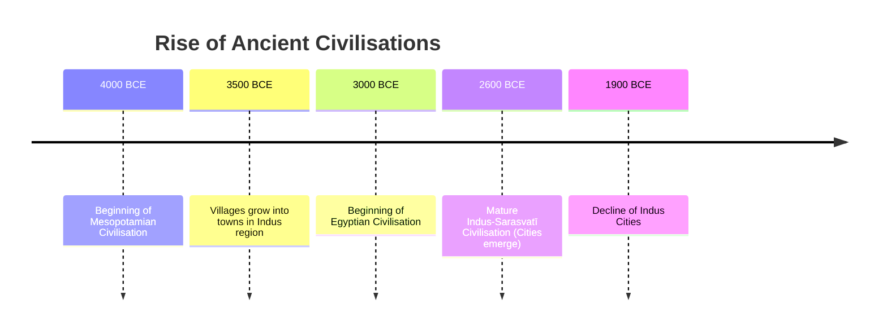
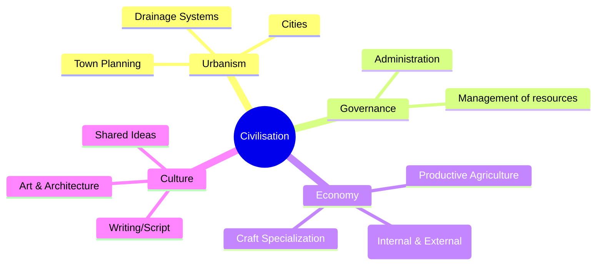

<<<FILE_START: index.mdx>>>
---
title: "The Beginnings of Indian Civilisation"
description: "Explore the Indus-Sarasvatī Civilisation, one of the world's oldest urban cultures, its town planning, trade, and eventual decline."
date: 2024-04-10
tags: ["history", "class-6", "indus-valley", "harappan-civilisation"]
order: 1
draft: false
---

import Callout from '@/components/Callout.astro'

# The Beginnings of Indian Civilisation

The **Indus-Sarasvatī Civilisation** (also known as the Harappan Civilisation) represents India's first successful experiment with urban living. Around 4,600 years ago, complex cities emerged in the northwestern part of the Indian Subcontinent, characterized by remarkable town planning, advanced water management, and a peaceful, trade-oriented society.

## Chapter Overview

In this chapter, we will explore:
*   **What defines a civilisation** compared to early societies.
*   **Geography & Timeline:** Where and when did this civilisation flourish?
*   **Urban Engineering:** How did they build cities like Mohenjo-daro and Dholavira?
*   **Economy:** Agriculture, crafts, and international trade.
*   **Culture:** Art, scripts, and daily life.
*   **The Decline:** Why did the cities disappear?

## Timeline of Ancient Civilisations

The Harappan civilisation was contemporary with Mesopotamia and Egypt.

## Key Concepts

<Callout variant="tip">
**Civilisation:** An advanced stage of human society marked by government, urbanism (cities), specialized crafts, long-distance trade, writing, and productive agriculture capable of supporting non-farming populations.
</Callout>

<Callout variant="info">
**Nomenclature:**
*   **Harappan:** Named after **Harappa**, the first site excavated in 1920-21.
*   **Indus-Sarasvatī:** Named after the two major river systems (Indus and the now-dried Sarasvatī) along which most settlements were located.
</Callout>

Start your journey into the past by exploring the topics below.
<<<FILE_END>>>

<<<FILE_START: topics/01-what-is-civilisation.mdx>>>
---
title: "What is a Civilisation?"
description: "Defining the characteristics of a civilisation and how it differs from early neolithic settlements."
date: 2024-04-10
tags: ["civilisation", "definitions", "urbanism"]
order: 1
draft: false
---

import Callout from '@/components/Callout.astro'

## Defining Civilisation

At the end of the Neolithic period, humans began settling down and farming. However, a "civilisation" represents a leap forward from simple village life. It is an advanced stage of human society characterized by complexity and organization.

### Key Characteristics

For a society to be termed a **civilisation**, it generally possesses the following features:

1.  **Urbanism:** The growth of cities with town planning and public amenities (like drainage).
2.  **Government & Administration:** A system to manage complex societies, maintain order, and organize collective works.
3.  **Crafts:** Specialized production of goods (ornaments, tools) using raw materials like stone and metal.
4.  **Trade:** Exchange of goods within the city, with other regions, and even with distant lands.
5.  **Writing:** A system to keep records and communicate.
6.  **Productive Agriculture:** Farming that produces enough surplus to feed people living in cities who are not farmers (like artisans or rulers).

<Callout variant="tip">
**Think About It:** Which of these is fundamental? **Productive agriculture** is often considered the foundation, as surplus food allows people to leave farming and take up other specialized roles like trading, ruling, or crafting.
</Callout>
<<<FILE_END>>>

<<<FILE_START: topics/02-geography-and-origins.mdx>>>
---
title: "Geography and Origins"
description: "The geographical extent of the Indus-Sarasvatī Civilisation and its timeline."
date: 2024-04-10
tags: ["geography", "rivers", "sarasvati", "indus", "map"]
order: 2
draft: false
---

import Callout from '@/components/Callout.astro'

## The Land of Two Rivers

The civilisation flourished in the vast plains of the northwest Indian Subcontinent, watered by two major river systems:
1.  **The Indus (Sindhu):** And its tributaries (Jhelum, Chenab, Ravi, Beas, Sutlej).
2.  **The Sarasvatī:** A river that once flowed parallel to the Indus through Haryana, Punjab, Rajasthan, and Gujarat but is now seasonal (known as Ghaggar-Hakra).

### Geographical Extent
The civilisation covered a massive area, much larger than contemporary Egypt or Mesopotamia.

*   **West:** Sutkagen-dor (near Iran border)
*   **North:** Shortugai (Afghanistan) / Manda (J&K)
*   **East:** Alamgirpur (Uttar Pradesh)
*   **South:** Daimabad (Maharashtra)

### Schematic Map of Major Sites

The following diagram illustrates the relative locations of key rivers and cities.

  <svg width="500" height="400" viewBox="0 0 500 400" xmlns="http://www.w3.org/2000/svg">
    <!-- Background -->
    <rect width="500" height="400" fill="none" />

    <!-- Rivers -->
    <!-- Indus -->
    <path d="M 250 20 Q 200 100 150 200 T 100 350" stroke="currentColor" stroke-width="2" fill="none" opacity="0.6"/>
    <text x="110" y="320" fill="currentColor" font-size="10" font-style="italic">Indus River</text>

    <!-- Sarasvati (Dry) -->
    <path d="M 300 20 Q 280 100 250 200 T 200 300" stroke="currentColor" stroke-width="2" stroke-dasharray="5,5" fill="none" opacity="0.6"/>
    <text x="210" y="280" fill="currentColor" font-size="10" font-style="italic">Sarasvatī (Ghaggar-Hakra)</text>

    <!-- Cities -->
    <!-- Harappa -->
    <circle cx="260" cy="100" r="4" fill="currentColor" />
    <text x="270" y="105" fill="currentColor" font-size="12" font-weight="bold">Harappa</text>

    <!-- Mohenjo-daro -->
    <circle cx="160" cy="220" r="4" fill="currentColor" />
    <text x="60" y="225" fill="currentColor" font-size="12" font-weight="bold">Mohenjo-daro</text>

    <!-- Kalibangan -->
    <circle cx="260" cy="180" r="4" fill="currentColor" />
    <text x="270" y="185" fill="currentColor" font-size="12">Kalibangan</text>

    <!-- Rakhigarhi -->
    <circle cx="300" cy="160" r="4" fill="currentColor" />
    <text x="310" y="165" fill="currentColor" font-size="12">Rakhigarhi</text>

    <!-- Dholavira -->
    <circle cx="180" cy="300" r="4" fill="currentColor" />
    <text x="190" y="305" fill="currentColor" font-size="12" font-weight="bold">Dholavira</text>

    <!-- Lothal -->
    <circle cx="220" cy="340" r="4" fill="currentColor" />
    <text x="230" y="345" fill="currentColor" font-size="12">Lothal</text>
  </svg>

### Origins and Transition
*   **3500 BCE:** Early villages began growing into towns.
*   **2600 BCE:** Transition to full-fledged cities (Mature Harappan Phase). This is often called the **'First Urbanisation of India'**.

<Callout variant="info">
**Why "Sarasvatī"?**
While Harappa and Mohenjo-daro are famous, a high density of sites (like Rakhigarhi, Kalibangan, Banawali) were found in the basin of the Sarasvatī river. The Rig Veda mentions the Sarasvatī as a mighty river flowing from "mountain to sea", though it later dried up.
</Callout>
<<<FILE_END>>>

<<<FILE_START: topics/03-town-planning.mdx>>>
---
title: "Town Planning & Architecture"
description: "Understanding the layout of Harappan cities, including the Citadel, Lower Town, and the Great Bath."
date: 2024-04-10
tags: ["architecture", "urban-planning", "great-bath", "bricks"]
order: 3
draft: false
---

import Callout from '@/components/Callout.astro'

## A Planned Urban Layout

The most striking feature of the Harappan civilisation was its **town planning**. Unlike the haphazard growth of many modern cities, Harappan cities followed a grid system.

### Structural Features
1.  **Bipartite Layout:** Most cities were divided into two parts:
    *   **Upper Town (Citadel):** Built on a raised platform, often fortified. Likely used by the elite or for public purposes.
    *   **Lower Town:** Larger area where common people lived.
2.  **Streets:** Wide streets oriented to cardinal directions (North-South, East-West), cutting each other at right angles.
3.  **Bricks:** Buildings were made of **baked bricks** of a standardized ratio (1:2:4). The quality of construction was uniform across small and big houses.

### The Great Bath (Mohenjo-daro)
Located in the Citadel of Mohenjo-daro, this structure is a masterpiece of engineering.

*   **Dimensions:** Roughly $12 \text{ m} \times 7 \text{ m}$.
*   **Construction:** Watertight brickwork sealed with natural **bitumen** (tar).
*   **Features:** Steps leading down from two sides, surrounded by rooms (for changing), and a large drain to empty the tank.
*   **Purpose:** Likely used for special **ritual baths** on religious occasions.

  <svg width="400" height="250" viewBox="0 0 400 250" xmlns="http://www.w3.org/2000/svg">
    <!-- Ground -->
    <rect x="50" y="50" width="300" height="150" fill="none" stroke="currentColor" stroke-width="2"/>

    <!-- The Bath Pool -->
    <rect x="100" y="80" width="200" height="90" fill="none" stroke="currentColor" stroke-width="2" rx="2"/>
    <text x="200" y="130" text-anchor="middle" fill="currentColor" font-size="12">Water Tank</text>

    <!-- Steps North -->
    <line x1="140" y1="80" x2="140" y2="100" stroke="currentColor" stroke-width="1"/>
    <line x1="260" y1="80" x2="260" y2="100" stroke="currentColor" stroke-width="1"/>
    <line x1="140" y1="90" x2="260" y2="90" stroke="currentColor" stroke-width="1"/>
    <text x="200" y="95" text-anchor="middle" fill="currentColor" font-size="8">Steps</text>

    <!-- Steps South -->
    <line x1="140" y1="170" x2="140" y2="150" stroke="currentColor" stroke-width="1"/>
    <line x1="260" y1="170" x2="260" y2="150" stroke="currentColor" stroke-width="1"/>
    <line x1="140" y1="160" x2="260" y2="160" stroke="currentColor" stroke-width="1"/>
    <text x="200" y="165" text-anchor="middle" fill="currentColor" font-size="8">Steps</text>

    <!-- Rooms -->
    <rect x="60" y="60" width="30" height="30" fill="none" stroke="currentColor"/>
    <rect x="60" y="100" width="30" height="30" fill="none" stroke="currentColor"/>
    <rect x="310" y="60" width="30" height="30" fill="none" stroke="currentColor"/>
    <text x="75" y="80" text-anchor="middle" fill="currentColor" font-size="8">Room</text>

    <!-- Well -->
    <circle cx="325" cy="75" r="5" fill="none" stroke="currentColor"/>
    <text x="325" y="55" text-anchor="middle" fill="currentColor" font-size="8">Well</text>
  </svg>

<Callout variant="warning">
**Note:** The existence of warehouses suggests that goods were stored for trade or distribution, indicating an organized administration.
</Callout>
<<<FILE_END>>>

<<<FILE_START: topics/04-water-management.mdx>>>
---
title: "Water Management"
description: "How the Harappans mastered hydraulics through drainage systems, wells, and reservoirs."
date: 2024-04-10
tags: ["water", "drainage", "dholavira", "hygiene"]
order: 4
draft: false
---

import Callout from '@/components/Callout.astro'

## Hygiene and Hydraulics

The Harappans placed immense importance on water and cleanliness. Their hydraulic engineering was centuries ahead of other contemporary civilisations.

### Drainage System
*   **Network:** Houses had separate bathing areas connected to street drains.
*   **Covered Drains:** The main drains running under streets were covered with bricks or stone slabs.
*   **Maintenance:** Manholes were provided at regular intervals for cleaning.
*   **Significance:** This suggests a "civic sense" and a municipal authority responsible for sanitation.

### Sources of Water
1.  **Wells:** Mohenjo-daro alone had about **700 wells**.
2.  **Reservoirs (Dholavira):** Since Dholavira (in the Rann of Kutch) did not have perennial rivers like the Indus, they built massive stone reservoirs to harvest rainwater.
    *   Some reservoirs were cut into solid rock.
    *   The largest measured **73 metres** in length.
    *   Connected by underground drains.

<Callout variant="tip">
**Dholavira's Uniqueness:** While most Harappan construction used bricks, Dholavira extensively used **stone** for its reservoirs and buildings.
</Callout>
<<<FILE_END>>>

<<<FILE_START: topics/05-agriculture-and-food.mdx>>>
---
title: "Agriculture & Food"
description: "The agrarian foundation of the Harappan economy."
date: 2024-04-10
tags: ["agriculture", "food", "crops", "animals"]
order: 5
draft: false
---

import Callout from '@/components/Callout.astro'

## Feeding the Cities

The growth of large cities like Harappa was only possible because of a robust agricultural system in the surrounding villages.

### Crops
The Harappan diet was diverse, consisting of:
*   **Cereals:** Wheat, Barley, Millets, and sometimes Rice (found in Lothal/Rangpur).
*   **Pulses:** Lentils, chickpeas, peas.
*   **Others:** Sesame, mustard, and **Cotton** (they were the first in Eurasia to cultivate cotton for cloth).

### Technology
*   **Plough:** Terracotta models of ploughs have been found (e.g., at Banawali), indicating they used bullocks to till the land.
*   **Irrigation:** Evidence of canals (Shortugai) and wells suggests they didn't rely solely on rain.

### Animal Husbandry
*   **Domesticated:** Cattle (humped bull), sheep, goat, buffalo, pig.
*   **Food:** Fish and wild fowl were also consumed.
*   **Scientific Analysis:** Residue analysis of cooking pots has revealed traces of **turmeric, ginger, and banana**, showing a sophisticated palate!

<Callout variant="info">
**The Plough:** The invention of the plough was revolutionary. It allowed deeper turning of the soil, bringing nutrients to the surface and significantly increasing crop yields compared to using a simple hoe.
</Callout>
<<<FILE_END>>>

<<<FILE_START: topics/06-trade-and-crafts.mdx>>>
---
title: "Trade & Crafts"
description: "The industrial and commercial prowess of the Harappans."
date: 2024-04-10
tags: ["trade", "crafts", "lothal", "beads", "seals"]
order: 6
draft: false
---

import Callout from '@/components/Callout.astro'

## A Brisk Trade

The Harappans were not isolated; they were global traders.

### Exports & Imports
| **Type** | **Items** |
| :--- | :--- |
| **Exports** | Carnelian beads, Shell bangles, Ivory, Timber, Cotton textiles, Spices. |
| **Imports** | **Copper** (likely from Oman/Rajasthan), Gold (South India), Tin, Lapis Lazuli (Afghanistan). |

### Mechanism of Trade
1.  **Seals:** Thousands of steatite seals with animal motifs (Unicorn, Bull, Tiger) and script were used to stamp clay tags on goods. This certified the identity of the sender and ensured the package hadn't been tampered with.
2.  **Weights:** A standardized system of stone weights (made of chert) usually in binary denominations ($1, 2, 4, 8, 16, 32...$).
3.  **Transport:** Bullock carts for land; Boats for rivers/sea.

### Lothal: The Port City
Lothal (Gujarat) featured a massive **artificial dockyard** ($217 \text{ m} \times 36 \text{ m}$).
*   It connected to the river/sea.
*   Ships would dock here to load and unload goods.
*   This is the earliest known intensive maritime activity in India.

## Specialized Crafts
*   **Bead Making:** Chanhudaro and Lothal were famous for carnelian beads. They developed special drills to bore holes in hard stones.
*   **Shell Working:** Bangles and ladles made from conch shells (found in coastal sites like Nageshwar).
*   **Metallurgy:** They worked with Copper and Bronze (Copper + Tin).

<Callout variant="tip">
**Bronze:** The Harappans are a "Bronze Age" civilisation. Bronze is harder than copper and was used for tools, weapons, and statues (like the Dancing Girl).
</Callout>
<<<FILE_END>>>

<<<FILE_START: topics/07-social-and-cultural-life.mdx>>>
---
title: "Social & Cultural Life"
description: "Art, artifacts, and social structure of the Harappans."
date: 2024-04-10
tags: ["art", "dancing-girl", "priest-king", "toys"]
order: 7
draft: false
---

import Callout from '@/components/Callout.astro'

## Art and Artifacts

Harappan art was realistic and utilitarian. They did not build massive temples or statues of kings, but their small-scale art is exquisite.

### Key Artifacts
1.  **The "Priest King":** A stone statue of a bearded man wearing a shawl with trefoil patterns.
2.  **The "Dancing Girl":** A bronze figurine (approx 10 cm) from Mohenjo-daro. She stands confidently with one hand on her hip, arm covered in bangles.
3.  **Terracotta Toys:** Whistles, carts, birds, and animals, showing that children were well cared for and amused.

### Social Hierarchy
While we don't know if they had "Kings," the society was divided:
*   **Elites:** Lived in the Citadel, used luxury items (carnelian, gold).
*   **Commoners:** Lived in the Lower Town, engaged in agriculture and crafts.

### Religion (Inferred)
*   **Nature Worship:** Trees (Pipal) and animals (Bull, Tiger).
*   **Figures:** Terracotta figurines of women (Mother Goddess?) and the "Pashupati" seal (a deity seated in yoga posture surrounded by animals).
*   **No Temples:** Unlike Egypt/Mesopotamia, no clear temple structures have been found.

<Callout variant="info">
**The Script:** The Harappan script remains **undeciphered**. It is written on seals, copper plates, and pots. It was likely written from right to left.
</Callout>
<<<FILE_END>>>

<<<FILE_START: topics/08-decline-of-civilisation.mdx>>>
---
title: "The Decline"
description: "Why did the Indus-Sarasvatī Civilisation collapse around 1900 BCE?"
date: 2024-04-10
tags: ["decline", "climate-change", "history"]
order: 8
draft: false
---

import Callout from '@/components/Callout.astro'

## The End or a New Beginning?

Around **1900 BCE**, the great cities began to decline.
*   Maintenance of drains collapsed.
*   The "Great Bath" was no longer used.
*   Weights and seals disappeared.
*   People abandoned the cities and moved to smaller rural settlements.

### Causes of Decline
Historians reject the theory of "Aryan Invasion" or massive warfare as the primary cause. Instead, environmental factors played the key role:

1.  **Climate Change (2200 BCE):** A global shift led to weaker monsoons and drought.
2.  **Drying of the Sarasvatī:** Tectonic shifts likely diverted the Sutlej and Yamuna rivers away from the Sarasvatī, causing it to dry up. Cities like Kalibangan dependent on it had to be abandoned.
3.  **Ecological Imbalance:** Over-exploitation of resources (deforestation for fuel/bricks) might have damaged the local ecosystem.

### Legacy
Though the cities died, the culture survived. Elements like the "Namaste" gesture, Yoga postures, worship of Shiva-like figures (Pashupati), bangle wearing, and certain craft techniques continued into later Indian traditions.

<Callout variant="tip">
**Ruralization:** The decline was not an extinction of the people, but a shift from an **urban** lifestyle back to a **rural** one.
</Callout>
<<<FILE_END>>>

<<<FILE_START: solutions/ex-6.1.mdx>>>
---
title: "Chapter Solutions"
description: "Detailed answers to the questions from the textbook."
date: 2024-04-10
tags: ["solutions", "class-6", "chapter-6"]
order: 1
draft: false
---

import Callout from '@/components/Callout.astro'

## Questions, Activities, and Projects

### 1. Why does the civilisation studied in this chapter have several names? Discuss their significance.

**Answer:**
The civilisation is known by multiple names due to the history of its discovery and its geographical extent:
*   **Harappan Civilisation:** It is called this because **Harappa** was the first site to be discovered and excavated (in 1921). In archaeology, a culture is often named after the first site found.
*   **Indus Valley Civilisation:** Initially, sites were found only along the **Indus River** valley (like Mohenjo-daro).
*   **Indus-Sarasvatī Civilisation:** Later research revealed that a vast number of settlements (like Kalibangan and Rakhigarhi) were located along the banks of the dried-up **Sarasvatī River**. This name more accurately reflects the geographical distribution of the population.

---

### 2. Write a brief report (150 to 200 words) summing up some of the achievements of the Indus-Sarasvatī civilisation.

**Answer:**
**Report: Achievements of the Indus-Sarasvatī Civilisation**

The Indus-Sarasvatī Civilisation (2600–1900 BCE) stands as a testament to early engineering and social organization. Its most remarkable achievement was **Town Planning**. Cities were laid out in a grid pattern with wide streets oriented to cardinal directions. The **Drainage System** was sophisticated, with covered drains running beneath streets, indicating a high regard for hygiene.

In technology, they mastered **Metallurgy** (bronze and copper tools) and **Crafts** (bead-making and shell-cutting). The massive **Dockyard at Lothal** highlights their maritime engineering skills and extensive trade networks.

Agriculturally, they were the first to cultivate **cotton** and built massive water reservoirs (as seen in Dholavira) for conservation. Socially, it appears to have been a relatively peaceful society with no evidence of large standing armies or weapons of mass warfare, focusing instead on trade and civic amenities.

---

### 3. Imagine you have to travel from the city of Harappa to Kalibangan. What are your different options? Can you make a rough estimation of the amount of time each option might take?

**Answer:**
**Options for Travel:**
1.  **River Travel (Boat):** Harappa is on the Ravi (tributary of Indus) and Kalibangan is on the Sarasvatī. Since these river systems were interconnected or geographically close during the rainy season, one could travel by boat downstream/upstream. This would be the fastest method for cargo.
2.  **Land Travel (Bullock Cart):** For areas not connected by water, bullock carts (terracotta models found) were the primary mode.
3.  **Walking:** For common people without carts.

**Time Estimation:**
The distance is roughly 300-400 km.
*   **Bullock Cart:** At ~15-20 km/day, it would take about **15–20 days**.
*   **Walking:** Similar to carts, perhaps slightly slower depending on the terrain.

---

### 4. Let us imagine a Harappan man or woman being transported to an average kitchen in today’s India. What are the four or five biggest surprises awaiting them?

**Answer:**
A Harappan would be surprised by:
1.  **Stainless Steel/Plastic:** They used clay (terracotta), copper, or bronze pots. Shiny steel or plastic containers would be alien.
2.  **Running Tap Water:** They fetched water from wells; a tap delivering water instantly would be magical.
3.  **Gas Stove/LPG:** They cooked on firewood or charcoal chulhas. A blue flame appearing from a knob would be surprising.
4.  **New Vegetables:** Potatoes, tomatoes, and chillies (which came to India much later) would be unrecognizable.
5.  **Electricity/Fridge:** Artificial cooling and light without fire.

---

### 5. Looking at all the pictures in this chapter, make a list of the ornaments / gestures / objects that still feel familiar in our 21st century.

**Answer:**
*   **Ornaments:** Bangles (worn up to the arm, like in Rajasthan/Gujarat), necklaces, beads, anklets.
*   **Gestures:** The "Namaste" pose (seen in terracotta figurines), Yoga postures (Pashupati seal).
*   **Objects:** Combs (ivory/plastic look similar), Dice (for games), Whistles, Bullock carts (still seen in rural India), Earthen pots (matkas).

---

### 6. What mindset does the system of reservoirs at Dholavira reflect?

**Answer:**
The reservoirs reflect a mindset of **conservation, foresight, and community welfare**.
*   Living in an arid region (Rann of Kutch), they understood the value of every drop of fresh water.
*   The scale suggests a **cooperative effort** or strong leadership dedicated to public goods, ensuring the city could survive droughts.

---

### 7. In Mohenjo-daro, about 700 wells built with bricks have been counted. They seem to have been regularly maintained and used for several centuries. Discuss the implications.

**Answer:**
*   **Water Security:** 700 wells imply that water was accessible to almost every household or neighborhood, reducing the labor of fetching water from the river.
*   **Independence:** Unlike relying on a single central source, distributed wells gave neighborhoods resilience.
*   **Maintenance Culture:** The fact that they lasted centuries implies regular cleaning (desilting) and brick repair, pointing to a stable social structure and civic duty passed down through generations.

---

### 8. It is often said that the Harappans had a high civic sense. Discuss the significance of this statement. Do you agree with it? Compare with citizens in a large city of India today.

**Answer:**
**Significance:** "Civic sense" refers to the responsibility citizens feel towards their community and public spaces.
**Agreement:** Yes, the Harappans had high civic sense.
*   **Evidence:** They connected their private drains to public sewers but installed **settling sumps** to prevent solid waste from clogging the main pipes. They did not throw trash in the streets (bins were found). Encroachment on streets was rare.
**Comparison:**
*   Today, many cities struggle with open drains, littering, and encroachment. The Harappans, 4000 years ago, prioritized **sanitation and urban order** more effectively than many modern municipalities, highlighting a disciplined society.
<<<FILE_END>>>

<<<FILE_START: practice/solved-examples.mdx>>>
---
title: "Solved Examples & Extra Practice"
description: "Additional conceptual questions to deepen your understanding."
date: 2024-04-10
tags: ["practice", "critical-thinking", "extra-questions"]
order: 1
draft: false
---

import Callout from '@/components/Callout.astro'

## Concept Builders

### Q1: The "Urban Revolution"
**Question:** Why is the Harappan civilisation often called the "First Urbanisation"?
**Answer:**
It marks the first time in Indian history that people moved from small, rural agricultural villages to large, densely populated **cities**. These cities had non-agricultural economies (crafts, trade), distinct social hierarchies, and complex infrastructure (brick houses, roads), distinguishing them from the earlier Neolithic cultures.

### Q2: Harappan Seals
**Question:** If the Harappan script is undeciphered, how do we know the seals were used for trade?
**Answer:**
Archaeologists found clay **tag impressions** (sealings) attached to goods. The back of these clay tags often showed the impression of a rope or matting, indicating they were tied to a bundle. If the seal was intact upon arrival, the receiver knew the goods were safe. This physical evidence directly links seals to packaging and transport.

### Q3: Uniformity
**Question:** Bricks found in Harappa and Mohenjo-daro (hundreds of km apart) have the exact same ratio ($1:2:4$). What does this tell us?
**Answer:**
This suggests a high degree of **standardization** across the civilisation. It implies either:
1.  A strong central authority (government) that enforced rules.
2.  A very tightly integrated guild of craftsmen and traders who followed the same traditions and standards across a vast area.

### Q4: The Mystery of Weapons
**Question:** Archaeologists have found very few weapons (mostly hunting tools) and no evidence of armies. What does this suggest about Harappan society compared to Mesopotamia?
**Answer:**
It suggests the Harappans were a relatively **peaceful society**. Unlike Mesopotamia, where cities often warred with each other and built massive defensive walls against armies, Harappan fortifications were likely for flood protection or social separation, not war. Their influence spread through **trade** rather than conquest.

## Visual Analysis

### The Dancing Girl
Observe the "Dancing Girl" statue.
*   **Material:** Bronze (Lost-wax casting technique).
*   **Posture:** Hand on hip, head tilted, relaxed.
*   **Cultural Insight:** The heavy bangles on one arm are a style still seen in tribal communities in Gujarat and Rajasthan today, showing a **cultural continuity** of over 4000 years.

### The Great Bath
*   **Engineering Marvel:** The use of **natural bitumen (tar)** to waterproof the tank is the earliest known use of this material in India for waterproofing, showing their knowledge of materials science.
<<<FILE_END>>>
