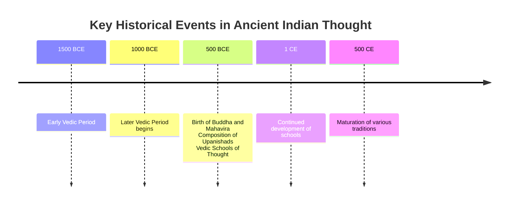
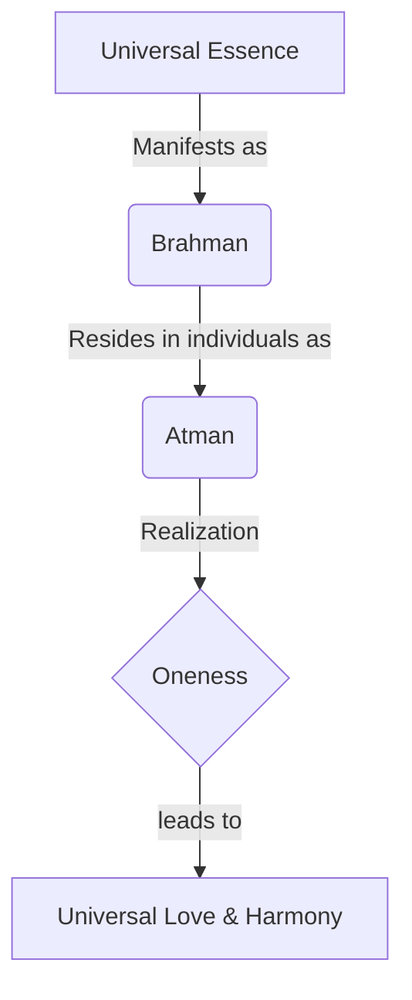
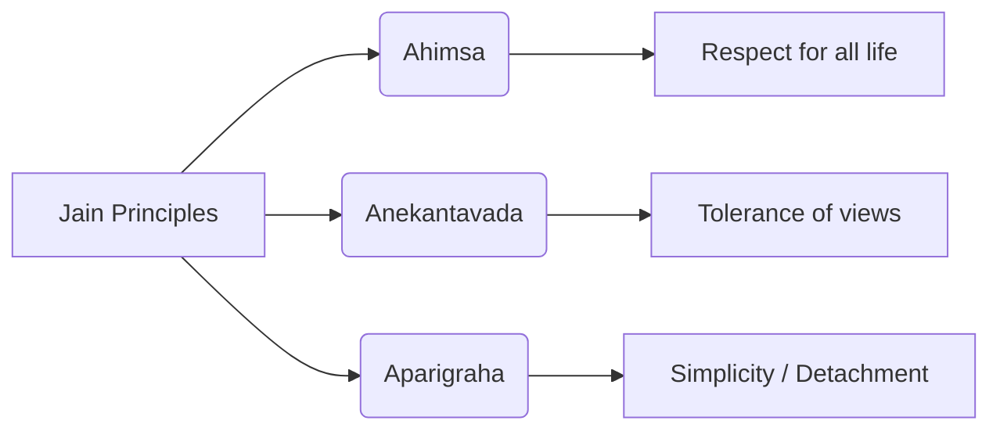

<<<FILE_START: index.mdx>>>
---
title: "India's Cultural Roots"
description: "An overview of India's ancient cultural heritage, including the Vedas, Upanishads, Buddhism, Jainism, and Tribal traditions."
date: 2024-04-10
tags: ["history", "culture", "vedas", "buddhism", "jainism"]
order: 1
draft: false
---

import Callout from '@/components/Callout.astro'

## Introduction

Indian culture is often compared to an ancient tree with many roots and branches. While there are diverse manifestations of this culture—art, science, religion, and governance—they are united by a common trunk. This chapter explores the early "schools of thought" and spiritual seekers who shaped India's unique personality.

We will delve into the Vedic age, the emergence of the Upanishads, and the rise of distinct paths like Buddhism and Jainism, alongside the rich contributions of folk and tribal traditions.

### Timeline of Developments

The following timeline highlights key periods discussed in this chapter:

## The Big Questions

As we study this chapter, we will explore:
1.  **What are the Vedas?** What is their core message?
2.  **New Schools of Thought:** What emerged in the 1st millennium BCE, and what were their principles?
3.  **Tribal Contributions:** How did folk and tribal traditions contribute to Indian culture?

## Chapter Content

The following topics cover the detailed study material for this chapter:

*   **[The Vedas and Vedic Culture](./topics/01-vedas-and-vedic-culture.mdx)**
*   **[Vedic Society and Thought](./topics/02-vedic-society-and-thought.mdx)**
*   **[Stories from the Upanishads](./topics/03-stories-from-upanishads.mdx)**
*   **[Buddhism](./topics/04-buddhism.mdx)**
*   **[Jainism](./topics/05-jainism.mdx)**
*   **[Folk and Tribal Roots](./topics/06-folk-and-tribal-roots.mdx)**
<<<FILE_END>>>

<<<FILE_START: topics/01-vedas-and-vedic-culture.mdx>>>
---
title: "The Vedas and Vedic Culture"
description: "Understanding the origins, structure, and significance of the Vedas in Indian culture."
date: 2024-04-10
tags: ["vedas", "sanskrit", "hymns"]
order: 1
draft: false
---

import Callout from '@/components/Callout.astro'

## What are the Vedas?

The word **"Veda"** comes from the Sanskrit root *vid*, which means 'knowledge'. The Vedas are the most ancient texts of India and among the oldest in the world.

There are four Vedas:
1.  **Rig Veda** (The most ancient)
2.  **Yajur Veda**
3.  **Sama Veda**
4.  **Atharva Veda**

### Oral Tradition
The Vedas consist of thousands of hymns (poems and songs). Unlike modern books, these were **recited orally** and not written down for centuries. They were composed in the **Sapta Sindhava** region.

<Callout variant="tip">
**Did You Know?**
The transmission of the Vedas was so meticulous that they were passed down for over 100 to 200 generations with hardly any alterations. In 2008, UNESCO recognised Vedic chanting as **'a masterpiece of the oral and intangible heritage of humanity'**.
</Callout>

### Vedic Deities and Worldview
The hymns were composed by *rishis* (sages) and *rishikas* (female sages). They were addressed to various deities representing forces of nature and cosmic order (*ritam*).

*   **Indra**
*   **Agni** (Fire)
*   **Varuna**
*   **Mitra**
*   **Sarasvati**
*   **Ushas** (Dawn)

Despite the multiplicity of gods, the early sages perceived a unity behind them. A famous hymn from the Rig Veda states:

$$
\text{ekam sat viprā bahudhā vadanti}
$$

**Translation:** "The Existent [Supreme Reality] is one, but sages give it many names."

### Concept of Truth
In the Vedic worldview, **Truth** (often synonymous with God) was a central value. The texts emphasize unity among people, calling for common purpose and harmony.

<Callout variant="info">
**Key Term: Cosmos**
The world or the universe viewed as an ordered and harmonious system.
</Callout>
<<<FILE_END>>>

<<<FILE_START: topics/02-vedic-society-and-thought.mdx>>>
---
title: "Vedic Society and Thought"
description: "Social structure of the Vedic period and the philosophical evolution into the Upanishads."
date: 2024-04-10
tags: ["society", "upanishads", "philosophy"]
order: 2
draft: false
---

import Callout from '@/components/Callout.astro'

## Vedic Society

Early Vedic society was organized into **janas** (clans). The Rig Veda lists over 30 such clans, including the Bharatas, Purus, Kurus, and Yadus.

### Governance
Governance was likely collective. The texts mention:
*   **Raja:** A king or ruler.
*   **Sabha and Samiti:** Collective gatherings or assemblies.

### Professions
The society was diverse, with professions such as:
*   Agriculturists
*   Weavers
*   Potters
*   Builders
*   Healers
*   Priests

## Vedic Schools of Thought

Over time, Vedic culture developed complex rituals (*yajna*) for individual and collective well-being. From this foundation, deeper philosophical inquiries emerged.

### The Upanishads
A group of texts called the **Upanishads** introduced new metaphysical concepts:
1.  **Rebirth:** The cycle of taking birth again and again.
2.  **Karma:** Our actions and their results.

### Vedanta: Brahman and Atman
One major school of thought, **Vedanta**, proposed that everything in the universe is one divine essence.

*   **Brahman:** The universal divine essence (distinct from the god Brahma).
*   **Atman:** The Self or divine essence residing within every individual.

**Core Philosophy:** The *Atman* is ultimately one with *Brahman*.

#### Famous Mantras
Two profound mantras summarize this philosophy:

$$
\text{aham brahmāsmi} \rightarrow \text{"I am Brahman" (I am divine)}
$$

$$
\text{tat tvam asi} \rightarrow \text{"You are That"}
$$

### Interdependence
Since everyone shares the same divine essence, the world is interconnected. This leads to the universal prayer:
*"Sarve bhavantu sukhinah"* — **"May all creatures be happy."**

<<<FILE_END>>>

<<<FILE_START: topics/03-stories-from-upanishads.mdx>>>
---
title: "Stories from the Upanishads"
description: "Narratives used in the Upanishads to teach profound philosophical truths."
date: 2024-04-10
tags: ["stories", "philosophy", "education"]
order: 3
draft: false
---

import Callout from '@/components/Callout.astro'

The Upanishads often used dialogues and stories to convey complex ideas. Here are three famous examples.

## 1. Shvetaketu and the Seed of Reality
*(Source: Chhandogya Upanishad)*

**The Context:** Shvetaketu returned from his studies proud of his book knowledge. His father, Rishi Uddalaka Aruni, tested him on the nature of *Brahman*, which Shvetaketu could not answer.

**The Lesson:**
Uddalaka asked his son to break a fruit from a banyan tree and find the seeds. Then, he asked him to break a seed.
*   **Father:** "What do you see inside the seed?"
*   **Son:** "Nothing, sir."
*   **Father:** "That invisible subtle essence which you do not perceive is the source of this great banyan tree."

**Conclusion:** Just as the massive tree exists potentially within the invisible essence of the seed, the entire universe emerges from the subtle essence of *Brahman*. **"You are That, Shvetaketu."**

## 2. Nachiketa and His Quest
*(Source: Katha Upanishad)*

**The Context:** A young boy, Nachiketa, was sent to the Lord of Death, **Yama**, by his angry father.

**The Dialogue:** Nachiketa waited for Yama and eventually asked him the ultimate question: *"What happens after death?"*

**The Teaching:**
Yama was pleased with the boy's persistence. He explained that the **Atman (Self)**:
*   Is neither born nor dies.
*   Is immortal.
*   Is hidden within all creatures.

## 3. The Debate of Gargi and Yajnavalkya
*(Source: Brihadaranyaka Upanishad)*

**The Context:** King Janaka held a philosophical debate. The sage Yajnavalkya defeated many scholars.

**The Challenge:** **Gargi**, a learned woman (*rishika*), challenged Yajnavalkya with probing questions about the nature of the world and *Brahman*.

**The Outcome:** Yajnavalkya explained how *Brahman* supports everything—the seasons, rivers, and time itself. This story highlights that women were also active participants in high philosophical debates in ancient India.
<<<FILE_END>>>

<<<FILE_START: topics/04-buddhism.mdx>>>
---
title: "Buddhism"
description: "The life of Siddhartha Gautama and the core teachings of Buddhism."
date: 2024-04-10
tags: ["buddhism", "buddha", "history"]
order: 4
draft: false
---

import Callout from '@/components/Callout.astro'

## The Origins

Buddhism emerged as a school of thought that did not accept the authority of the Vedas. It was founded by **Siddhartha Gautama** roughly 2,500 years ago (approx. 560 BCE).

### The Turning Point
Siddhartha was a prince who lived a protected life. At age 29, he saw four sights that changed his life:
1.  An old man
2.  A sick man
3.  A dead body
4.  An **ascetic** (who appeared happy and at peace)

Realizing the suffering inherent in life, he left his palace to find the root cause of this suffering.

## Enlightenment and Teachings

After years of searching and meditating under a pipal tree at **Bodh Gaya** (Bihar), he attained enlightenment. He became known as the **Buddha** ('The Awakened One').

### Core Realizations
The Buddha identified the sources of human suffering:
*   **Avidya:** Ignorance.
*   **Attachment:** Craving and bonding to temporary things.

### Key Values
*   **Ahimsa:** Often translated as non-violence, it originally meant 'non-injuring' or 'non-hurting'.
*   **Inner Discipline:** Conquering oneself is greater than conquering others.

> "Conquering oneself is greater than conquering a thousand men on the battlefield a thousand times." — The Buddha

### The Sangha
The Buddha founded the **Sangha**, a community of:
*   **Bhikshus** (Monks)
*   **Bhikshunis** (Nuns)

These were individuals who dedicated their lives to practicing and spreading the Dharma (teachings).

### Jataka Tales
Buddhism used stories called **Jataka tales** (stories of the Buddha's former births) to teach values.
*   *Example:* The story of the **Monkey King** who sacrificed his own body to form a bridge so his troop could escape human hunters. This illustrated selflessness and leadership.

<Callout variant="info">
**Think About It**
Ahmsa is not just about physical non-violence. It includes refraining from violence in thought, such as ill will or self-criticism.
</Callout>
<<<FILE_END>>>

<<<FILE_START: topics/05-jainism.mdx>>>
---
title: "Jainism"
description: "The life of Mahavira and the three pillars of Jain philosophy."
date: 2024-04-10
tags: ["jainism", "mahavira", "philosophy"]
order: 5
draft: false
---

import Callout from '@/components/Callout.astro'

## The Origins

Jainism became widespread around the same time as Buddhism (6th century BCE), though its roots are considered much older.

**Vardhamana Mahavira**, a prince from Vaishali (Bihar), left home at age 30. After 12 years of ascetic discipline, he attained supreme wisdom. He became known as a **Jina** (Conqueror) and **Mahavira** (Great Hero).

<Callout variant="tip">
**What is a Jina?**
The word 'Jain' comes from *Jina*. It refers to a conqueror not of territories, but of **ignorance and attachments**.
</Callout>

## Core Teachings

Jainism shares concepts like *ahimsa* and *karma* with Buddhism and Vedanta but has unique emphases.

### The Three Pillars

1.  **Ahimsa (Non-violence):**
    *   "All breathing, existing, living, sentient creatures should not be slain, nor treated with violence."
    *   This extends to all life forms, emphasizing deep interconnectedness.

2.  **Anekantavada (Many-sidedness):**
    *   The truth has many aspects. No single statement can fully describe the absolute truth. It teaches tolerance of different viewpoints.

3.  **Aparigraha (Non-possession):**
    *   Limiting oneself to what is truly necessary.
    *   Detachment from material possessions.

### A Jain Story: Rohineya
Rohineya was a skilled burglar. He accidentally heard a sermon by Mahavira about liberation. Later, when caught and tested by a minister, he remembered Mahavira's words, which helped him see through the deception. Feeling remorse, he confessed, returned stolen goods, and became a monk.
*   **Moral:** Everyone deserves a second chance; right action and thinking lead to liberation.

<<<FILE_END>>>

<<<FILE_START: topics/06-folk-and-tribal-roots.mdx>>>
---
title: "Folk and Tribal Roots"
description: "The contribution of oral and tribal traditions to Indian culture."
date: 2024-04-10
tags: ["tribes", "folk", "culture"]
order: 6
draft: false
---

import Callout from '@/components/Callout.astro'

While texts like the Vedas recorded formal knowledge, India also has rich **oral traditions** maintained by common people (folk) and tribes.

## What is a Tribe?

*   **Modern Definition:** A group of families sharing a common descent, culture, and language, living as a close-knit community under a chief, usually without private property.
*   **Ancient Context:** Ancient India didn't have a specific word for 'tribe'. They were simply different *janas* living in specific environments like forests.
*   **Current Status:** As of 2011, India has over 700 tribes (approx. 104 million people).

## Cultural Interactions

There has been a constant, fluid exchange between tribal traditions and mainstream schools of thought (Hinduism, Buddhism, Jainism).

### Mutual Exchange
1.  **Deities:**
    *   **Jagannath** (Puri, Odisha) was originally a tribal deity.
    *   Various forms of the **Mother Goddess** have tribal roots.
    *   Conversely, many tribes adopted Hindu deities and have their own versions of epics like the *Ramayana* and *Mahabharata*.

2.  **Sacred Nature:**
    *   Both tribal and formal Indian traditions regard mountains, rivers, and trees as sacred.
    *   *Example:* The **Toda** tribe of the Nilgiris regards mountain peaks as divine residences and avoids pointing at them.

### Concept of Divinity
Tribal belief systems are often wrongly called "primitive." They possess complex cultures and high philosophical concepts.
*   **Donyipolo:** Worshipped by tribes in Arunachal Pradesh (Sun and Moon combined).
*   **Singbonga:** A supreme creator deity worshipped by Munda and Santhal tribes.
*   **Khandoba:** A deity in central India.

<Callout variant="tip">
**Sociological Insight**
Sociologist André Béteille noted that tribal religions and Hinduism have influenced each other throughout history. It is a relationship of **mutual enrichment**.
</Callout>
<<<FILE_END>>>

<<<FILE_START: solutions/ex-1.1.mdx>>>
---
title: "Exercise 1.1: True or False"
description: "Test your understanding of the chapter facts."
date: 2024-04-10
tags: ["exercise", "quiz"]
order: 1
draft: false
---

import Callout from '@/components/Callout.astro'

**1. The Vedic hymns were written on palm-leaf manuscripts.**
*   **False.** The Vedas were orally transmitted for centuries and not written down initially.

**2. The Vedas are India’s oldest texts.**
*   **True.** They are the most ancient texts of India and among the oldest in the world.

**3. The Vedic statement *ekam sat viprā bahudhā vadanti* reflects a belief in the unity of cosmic powers.**
*   **True.** It translates to "The Existent is one, but sages give it many names," signifying unity behind diversity.

**4. Buddhism is older than the Vedas.**
*   **False.** The Vedas (starting approx. 1500 BCE) are much older than Buddhism (approx. 560 BCE).

**5. Jainism emerged as a branch of Buddhism.**
*   **False.** Jainism is a distinct school of thought. While they share similarities and emerged around the same time, Jainism has independent roots.

**6. Both Buddhism and Jainism advocated for peaceful coexistence and the avoidance of harm to all living beings.**
*   **True.** *Ahimsa* (non-violence) is central to both.

**7. Tribal belief systems are limited to belief in spirits and minor deities.**
*   **False.** Many tribal systems have concepts of a supreme being or higher divinity (e.g., Singbonga, Donyipolo).
<<<FILE_END>>>

<<<FILE_START: solutions/ex-1.2.mdx>>>
---
title: "Exercise 1.2: Questions, Activities and Projects"
description: "Descriptive answers and project ideas."
date: 2024-04-10
tags: ["exercise", "descriptive"]
order: 2
draft: false
---

import Callout from '@/components/Callout.astro'

**1. If you were Nachiketa, what questions would you like to ask Yama?**
*   *Note: This is a creative writing exercise. Below is a sample approach.*
*   **Sample Answer:** "O Yama, beyond the question of what happens after death, I would ask: What is the purpose of this life if it is destined to end? How can one live a life that is truly meaningful? Is destiny written for us, or do our actions alone shape our future?"

**2. Explain a few central ideas of Buddhism. Briefly comment upon them.**
*   **Avidya (Ignorance):** The Buddha taught that ignorance of the true nature of reality is the root of suffering.
*   **Attachment:** Clinging to temporary things leads to pain.
*   **Ahimsa (Non-violence):** This means not injuring any living being in thought, word, or deed.
*   **Comment:** These ideas focus on internal psychology and discipline rather than external rituals. They suggest that happiness is a state of mind achieved by removing negative habits.

**3. Discuss the quotation of the Buddha regarding bathing in sacred rivers.**
*   **Quote:** "Not by water is one made pure... But one is pure in whom truth and dharma reside."
*   **Meaning:** External rituals, like bathing in holy rivers, do not cleanse a person of their bad actions or character. True purity comes from within—by living a life of truth and righteousness (*Dharma*).

**4. Explain a few central ideas of Jainism. Briefly comment upon them.**
*   **Anekantavada (Many-sidedness):** The truth is complex and has many angles; no single view is complete. This promotes intellectual tolerance.
*   **Aparigraha (Non-possession):** One should limit material possessions to what is essential. This reduces greed and inequality.
*   **Ahimsa:** Absolute non-violence towards all sentient beings.
*   **Comment:** These principles remain highly relevant today for promoting peace (Ahimsa), tolerance in society (Anekantavada), and sustainability (Aparigraha).

**5. Consider and discuss André Béteille’s thought on tribal religions.**
*   **Thought:** Tribal religions and Hinduism have mutually influenced each other. It is not a one-way street where tribes just copied Hinduism; Hinduism also absorbed tribal elements throughout its evolution.
*   **Discussion Point:** This highlights the fluid and inclusive nature of Indian culture, where "Folk" and "Classical" traditions are deeply intertwined. Examples like Lord Jagannath prove this synthesis.

**6. Make a list of popular gods and goddesses in your region.**
*   *Activity for students based on their locality.* (e.g., Ganesha in Maharashtra, Durga in Bengal, Murugan in Tamil Nadu).

**7. List two or three tribal groups from your region or State.**
*   *Activity for students.* (e.g., Gonds in Central India, Santhals in the East, Bhils in the West, Khasis in the Northeast).
<<<FILE_END>>>

<<<FILE_START: practice/solved-examples.mdx>>>
---
title: "Solved Examples & Conceptual Practice"
description: "Deep dive questions to test conceptual clarity."
date: 2024-04-10
tags: ["practice", "critical-thinking"]
order: 1
draft: false
---

import Callout from '@/components/Callout.astro'

## Conceptual Questions

### Question 1: Leadership and Governance
**Context:** The Vedas mention *Sabha* and *Samiti* as collective assemblies.
**Question:** How does the concept of a society where people select their leaders (democracy) benefit the people compared to one where they do not?
**Answer:**
When people select their leaders:
1.  **Accountability:** Leaders are answerable to the people and can be removed if they fail to perform.
2.  **Representation:** The needs and voices of the common people are more likely to be heard.
3.  **Stability:** Decisions reflect the collective will, reducing the chance of rebellion against oppressive rule.
In contrast, unelected leaders may prioritize their own power over the welfare of the citizens.

### Question 2: The Meaning of Ahimsa
**Context:** Both Jainism and Buddhism emphasize *Ahimsa*.
**Question:** Why is *Ahimsa* described as more than just physical non-violence?
**Answer:**
Ahimsa includes non-violence in **thought, word, and deed**.
*   **Thought:** Wishing ill upon others or harboring hatred is a form of mental violence that harms one's own character.
*   **Word:** Harsh speech or insults cause emotional pain.
*   **Deed:** Physical harm.
True Ahimsa requires a complete transformation of the mind to eliminate all forms of aggression, including aggression turned inward (self-criticism).

### Question 3: The Banyan Tree Analogy
**Context:** The chapter compares Indian culture to a Banyan tree.
**Question:** Explain this analogy using the concepts of "Roots" and "Branches".
**Answer:**
*   **The Roots:** Represent the ancient origins (Indus civilization, Vedas, Tribal traditions) that nourish the culture.
*   **The Trunk:** Represents the shared values and common core (Dharma, Karma, search for Truth) that unite the culture.
*   **The Branches:** Represent the diverse manifestations (Art, Literature, Buddhism, Jainism, Science).
*   **Significance:** Just as a Banyan tree sends down new roots to support its spreading branches, Indian culture allows new traditions to develop and eventually support the whole structure, ensuring longevity and diversity within unity.
<<<FILE_END>>>
