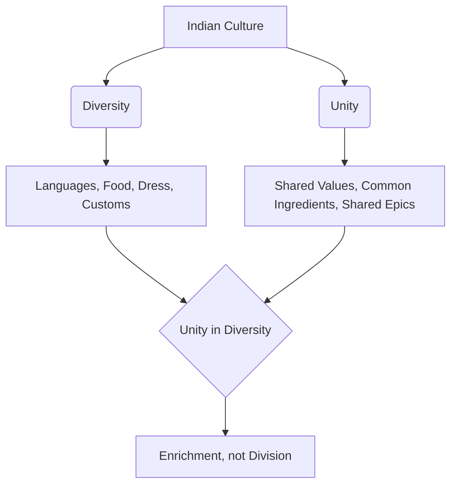
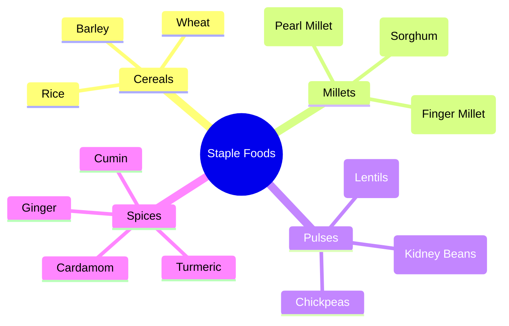
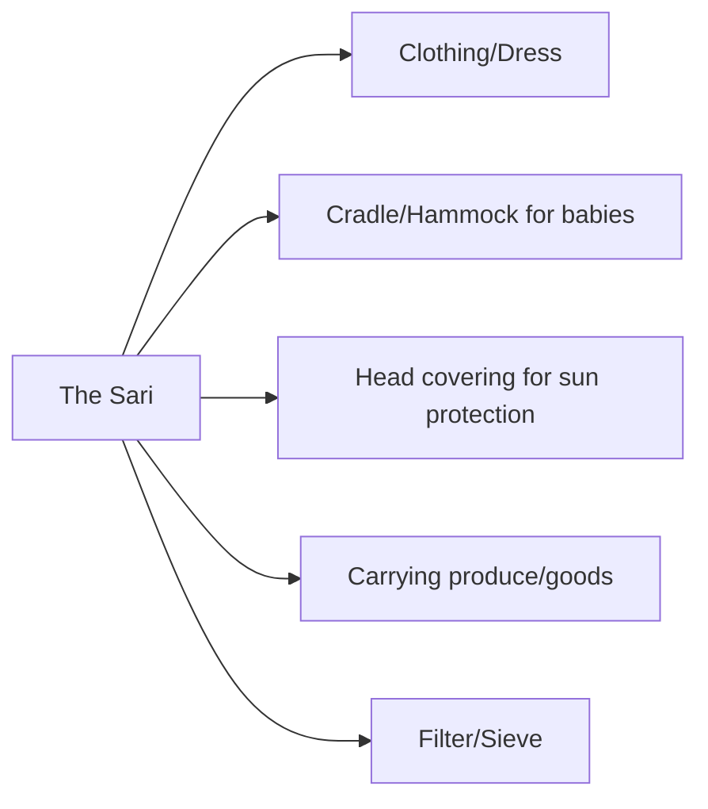
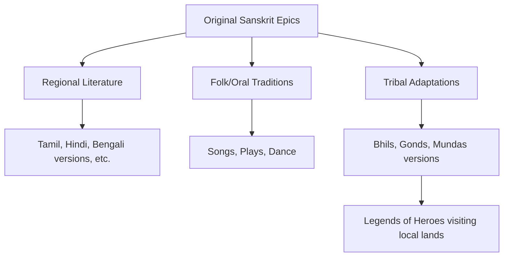

<<<FILE_START: index.mdx>>>
---
title: "Unity in Diversity, or 'Many in the One'"
description: "An overview of Chapter 8, exploring the concept of unity underlying the immense diversity of India through food, clothing, festivals, and literature."
date: 2024-04-10
tags: ["social-science", "culture", "india", "unity-in-diversity"]
order: 1
draft: false
---

import Callout from '@/components/Callout.astro'

## Introduction

India is a land of striking contrasts and immense variety. From changing landscapes to diverse languages, food habits, and clothing styles, diversity is the first thing that strikes a visitor. However, beneath this surface of diversity lies a deep, underlying unity that has held the civilization together for millennia.

This chapter explores how the concept of **"Many in the One"** plays out in the Indian scenario, examining how various dimensions of life—food, textiles, festivals, and literature—reflect this unique blend of unity and diversity.

<Callout variant="tip">
**The Core Philosophy:**
*"The principle of unity in diversity which has always been normal to [India]... the Many in the One, would place her on the sure foundation of her Swabhava and Swadharma."* — **Sri Aurobindo**
</Callout>

### The Big Questions

As we navigate this chapter, we will seek answers to the following key inquiries:

1.  **Meaning:** What is meant by 'unity in diversity' in the Indian scenario?
2.  **Observation:** What aspects of India's diversity are the most striking?
3.  **Analysis:** How do we make out the unity underlying the diversity?

### Chapter Roadmap

The following topics will guide our exploration:

*   **A Rich Diversity:** Understanding the demographics and linguistic variety of India.
*   **Food for All:** How common ingredients create thousands of diverse dishes.
*   **Textiles and Clothing:** The story of the Sari—one garment, endless forms.
*   **Festivals Galore:** Celebrating the same event under different names across the country.
*   **An Epic Spread:** The unifying role of literature, specifically the *Panchatantra* and the Epics (*Ramayana* and *Mahabharata*).

### Key Concept Map

<<<FILE_END>>>

<<<FILE_START: topics/01-rich-diversity.mdx>>>
---
title: "A Rich Diversity"
description: "Exploring the demographic and linguistic diversity of India as documented by the Anthropological Survey of India."
date: 2024-04-10
tags: ["demographics", "languages", "population"]
order: 2
draft: false
---

import Callout from '@/components/Callout.astro'

## The Landscape of Diversity

Traveling through India offers a visual feast of changing landscapes, dresses, food, and scripts. With over **1.4 billion inhabitants** (constituting about 18% of the world's population), such diversity is natural.

### The 'People of India' Project

In the late 20th century, the **Anthropological Survey of India** conducted a massive survey to document this diversity.

*   **Scope:** Covered 4,635 communities across all States.
*   **Linguistic Findings:** Identified **325 languages** using **25 different scripts**.
*   **Migration:** Observed that many Indians are migrants, living away from their original birthplaces or communities.

### Making Sense of the Many

While diversity is beautiful, it can be bewildering. How can a single history be written for such a diverse land? The answer, as noted by British historian **Vincent Smith** over a century ago, lies in the concept of **Unity in Diversity**.

<Callout variant="tip">
**Definition:**
**Unity in Diversity** implies that despite differences in physical appearance, language, custom, and religion, there is a fundamental bond of humanity and shared cultural history that unites the people of India.
</Callout>
<<<FILE_END>>>

<<<FILE_START: topics/02-food-unity.mdx>>>
---
title: "Food for All"
description: "How common staple grains and ingredients form the basis of India's diverse culinary landscape."
date: 2024-04-10
tags: ["food", "agriculture", "staple-grains"]
order: 3
draft: false
---

import Callout from '@/components/Callout.astro'

## Common Ingredients, Endless Dishes

One of the most relatable examples of unity in diversity is food. While there are thousands of distinct dishes across India, the building blocks (ingredients) remain remarkably consistent.

### The Unity: Staple Grains
Almost every part of the country relies on a specific set of grains and pulses. These are called **staple grains** because they form the basic food for most Indians.

#### Classification of Indian Staples

### The Diversity: Regional Variations

The unity lies in the *ingredients*, while the diversity lies in the *preparation*.
*   **Example:** Rice is eaten in Kashmir, Tamil Nadu, Bengal, and Gujarat, but the dishes prepared from it (Biryani, Idli, Pakhala, Khichdi) vary drastically in taste and texture.
*   **Spices:** Common spices like turmeric and ginger are used nationwide but in different combinations to create distinct regional flavors.

<Callout variant="tip">
**Conclusion:** The same ingredients (**Unity**) are used in endless combinations to prepare a vast variety of dishes (**Diversity**).
</Callout>

<<<FILE_END>>>

<<<FILE_START: topics/03-textiles-clothing.mdx>>>
---
title: "Textiles and Clothing"
description: "The sari as a symbol of unity in Indian attire, exploring its history, variety, and versatility."
date: 2024-04-10
tags: ["textiles", "sari", "clothing", "history"]
order: 4
draft: false
---

import Callout from '@/components/Callout.astro'

## The Common Thread

Just as with food, clothing in India shows a "commonality in traditional dress" despite regional variations. The most prominent example is the **Sari**.

### The Sari: One Dress, Many Forms

The sari is a plain length of unstitched cloth. Its unity lies in its simplicity—it is a single piece of fabric. However, its diversity is immense:

1.  **Fabrics:** Cotton, Silk (Banarasi, Kanjivaram, Paithani, Patan Patola, Muga, Mysore), and synthetic fibers.
2.  **Weaving & Design:** Ikat, block printing, embroidery.
3.  **Draping Styles:** Varies from region to region (e.g., Nauvari in Maharashtra, Seedha Pallu in Gujarat).

<Callout variant="info">
**Historical Fact:** The sari has a long history. A stone relief from **Vaishali (Bihar)** dating back a few centuries BCE depicts a woman in a sari.
</Callout>

### Global Impact: The Chintz
Indian textiles were historically world-renowned.
*   **Chintz:** A type of printed cotton that became incredibly popular in 17th-century Europe.
*   **Economic Impact:** It was so popular that England and France eventually banned its import to protect their own textile industries.

### Versatility of the Sari
The sari is not just a dress; it is a multi-purpose tool for Indian women.

This unstitched piece of cloth reflects the genius of Indian adaptability—simple in form, infinite in function.
<<<FILE_END>>>

<<<FILE_START: topics/04-festivals.mdx>>>
---
title: "Festivals Galore"
description: "Examining how the Harvest Festival is celebrated across India under different names."
date: 2024-04-10
tags: ["festivals", "culture", "harvest"]
order: 5
draft: false
---

import Callout from '@/components/Callout.astro'

## The Harvest Celebration

India is a land of festivals. A striking observation is that many festivals are celebrated across the country at the same time but are known by different names. A prime example is the **Harvest Festival** marked around **January 14th**.

### One Event, Many Names

The astronomical event marks the sun's entry into the zodiac sign of Capricorn (Makara). While the event is the same (**Unity**), the regional celebrations vary (**Diversity**).

| Region / State | Festival Name |
| :--- | :--- |
| **Nationwide / General** | Makara Sankranti |
| **Tamil Nadu** | Pongal |
| **Assam** | Magh Bihu |
| **Punjab / North India** | Lohri / Maghi |
| **Gujarat** | Uttarayan |
| **Karnataka** | Makara Sankramana |
| **Bihar / UP** | Khichdi Parv |
| **West Bengal** | Poush Songkranti |

<Callout variant="tip">
**Activity:** Compare how *Pongal* involves boiling rice and milk, while *Lohri* involves a bonfire, yet both celebrate the harvest and gratitude towards nature.
</Callout>
<<<FILE_END>>>

<<<FILE_START: topics/05-literature-epics.mdx>>>
---
title: "An Epic Spread"
description: "The unifying role of Indian literature, including the Panchatantra and the two great Epics: Ramayana and Mahabharata."
date: 2024-04-10
tags: ["literature", "epics", "ramayana", "mahabharata", "panchatantra"]
order: 6
draft: false
---

import Callout from '@/components/Callout.astro'

## Literature: Connecting Minds

Indian literature is among the most abundant in the world. Despite different languages, Indian texts share important themes, values, and concerns.

### The Panchatantra
*   **Origin:** Sanskrit text, at least 2,200 years old.
*   **Format:** Stories with animals as characters teaching life skills.
*   **Spread:** Adapted into almost every Indian language and translated into 50+ languages globally (including adaptations in Southeast Asia, the Arab world, and Europe).

### The Two Epics: Ramayana and Mahabharata

These two massive Sanskrit poems have shaped Indian culture for millennia.

1.  **The Mahabharata:** The story of the Pāṇḍavas and Kauravas, featuring Kṛiṣhṇa, fighting to re-establish *dharma*.
2.  **The Rāmāyaṇa:** The story of Rāma, Sītā, Lakṣhmaṇa, and Hanuman fighting the demon Rāvaṇa.

#### Regional and Tribal Adaptations
The epics are not static; they have been "translated" into the local culture of every region.

*   **Regional Languages:** Translated into Tamil (Kamba Ramayanam), Hindi (Ramcharitmanas), and hundreds of others.
*   **Tribal Communities:** Tribes like the **Bhils, Gonds, and Mundas** have their own oral versions.
*   **Localization:** Many tribes believe the epic heroes visited *their* specific regions.
    *   *Example:* The **Irula tribals** in Tamil Nadu maintain a shrine commemorating the Pandavas' visit (Fig 8.7 in text).

<Callout variant="tip">
**Unity in Diversity:** The same stories are told differently, yet the core values of *dharma*, truth, and justice remain consistent across all versions.
</Callout>
<<<FILE_END>>>

<<<FILE_START: solutions/exercises.mdx>>>
---
title: "Chapter Exercises & Solutions"
description: "Comprehensive solutions and discussion points for the Questions, Activities, and Projects at the end of the chapter."
date: 2024-04-10
tags: ["solutions", "exercises", "discussion"]
order: 7
draft: false
---

import Callout from '@/components/Callout.astro'

## Questions, Activities, and Projects

The following are model answers and discussion guides for the exercises found on page 136.

### 1. The Meaning of "Unity in Diversity"

**Question:** Conduct a class discussion on the two quotations at the start of the chapter (Rabindranath Tagore and Sri Aurobindo).

**Discussion Points:**
*   **Tagore's Quote:** *"Oh, grant me my prayer, that I may never lose the bliss of the touch of the one in the play of the many."*
    *   **Interpretation:** Tagore sees diversity ("the many") not as chaos, but as a "play" or celebration. He prays to always see the underlying unity ("the one") within this variety. It suggests that enjoying diversity is spiritual.
*   **Aurobindo's Quote:** *"The principle of unity in diversity... would place her on the sure foundation of her Swabhava and Swadharma."*
    *   **Interpretation:** Aurobindo argues that unity in diversity is India's true nature (*Swabhava*). Acknowledging this is essential for India to fulfill its duty or path (*Swadharma*). It is the bedrock of Indian civilization.

### 2. The Panchatantra Today

**Question:** Select a few stories from the *Pañchatantra* and discuss how their message is still valid today. Do you know of any similar stories from your region?

**Model Answer:**
*   **Story Example:** *The Monkey and the Crocodile.*
    *   **Message:** Presence of mind is stronger than brute force; choose friends wisely.
    *   **Relevance Today:** In the modern world, critical thinking and emotional intelligence are often more valuable than physical power. Trusting the wrong people can lead to loss.
*   **Regional Connection:** (Student should answer based on location). *Example:* The Jataka tales in Buddhist tradition often share similar themes of animal wisdom.

### 3. Folk Tales

**Question:** Collect a few folk tales from your region and discuss their message.

**Guidance:**
*   Folk tales are often oral stories passed down by grandparents.
*   **Look for themes:** Respect for nature, the victory of good over evil, or the foolishness of greed.
*   **Example (General):** The story of *Tenali Raman* (South India) or *Akbar-Birbal* (North India) often teaches wit and justice.

### 4. Art and Ancient Stories

**Question:** Is there any ancient story that you have seen being depicted through a form of art? (Sculpture, painting, dance, movie).

**Model Examples:**
*   **Dance:** *Kathakali* (Kerala) or *Yakshagana* (Karnataka) performances often depict scenes from the *Mahabharata*.
*   **Sculpture:** The carvings at Ellora or Mahabalipuram showing the *Descent of the Ganges* or *Arjuna’s Penance*.
*   **Movies:** Films like *Baahubali* (inspired by epic themes) or the animated *Ramayana*.
*   **Festivals:** The *Ramlila* performed during Dussehra is a theatrical depiction of the *Ramayana*.

### 5. Nehru's Observation

**Question:** Discuss the quotation by Jawaharlal Nehru: *"Everywhere I found a cultural background which had exerted a powerful influence on their lives... The old epics... were widely known among the masses..."*

**Analysis:**
*   **Cultural Literacy:** Nehru observed that even illiterate villagers knew the *Ramayana* and *Mahabharata* by heart.
*   **Education via Culture:** People didn't need formal schooling to learn ethics; they learned "what is right and wrong" through these stories.
*   **Unity:** This shared knowledge of epics created a common mental language for all Indians, connecting the villager to the scholar.
<<<FILE_END>>>

<<<FILE_START: practice/solved-examples.mdx>>>
---
title: "Practice: Let's Explore"
description: "Additional solved examples and activities based on the in-text 'Let's Explore' prompts."
date: 2024-04-10
tags: ["practice", "activities", "solved-examples"]
order: 8
draft: false
---

import Callout from '@/components/Callout.astro'

## In-Text Activity Solutions

Throughout the chapter, there are "Let's Explore" boxes. Here are structured responses to them.

### Activity 1: Classroom Diversity (Page 126)

**Task:** Make lists of birthplaces and mother tongues of classmates.
*   **Observation:** You will likely find that even in a single classroom, students have roots in different districts or states.
*   **Conclusion:** This micro-diversity in the classroom represents the macro-diversity of India.

### Activity 2: Food Ingredients (Page 128)

**Task:** Take any one vegetable and think of the number of different dishes you can prepare with it.
*   **Example:** **Potato (Aloo)**
    1.  Aloo Gobi (North India - Dry curry)
    2.  Masala Dosa filling (South India - Mashed/Spiced)
    3.  Aloo Posto (Bengal - cooked with poppy seeds)
    4.  Batata Vada (Maharashtra - Fritter)
    5.  Dum Aloo (Kashmir - Yogurt based gravy)
*   **Insight:** One vegetable $\rightarrow$ Many distinct cultural expressions.

### Activity 3: The Sari Reflection (Page 129)

**Task:** Explain how the example of the sari reflects both unity and diversity (100-150 words).

**Solution:**
The sari is a perfect metaphor for Indian culture. The **unity** is found in its fundamental form: it is always an unstitched length of cloth, typically 5 to 9 yards long, worn by women across the subcontinent. It represents a shared cultural identity that has survived for millennia. The **diversity** is found in its execution. Every region weaves it differently—from the heavy silks of Kanchipuram to the airy cottons of Bengal. Furthermore, the style of draping changes every few hundred kilometers, adapting to the local geography and work requirements of women. Thus, the sari is "One" in essence, but "Many" in expression.

### Activity 4: Sari Uses (Page 130)

**Task:** Identify uses of the sari in Fig 8.4 and imagine more.

**Identified Uses from Text/Images:**
1.  Dress (Clothing)
2.  Cradle for a baby (tied to a tree branch)
3.  Sieve/Filter (for water or grain)
4.  Head protection (against sun/rain)
5.  Carrier (bundle for carrying crops/wood)

**Additional Uses:**
*   **Privacy Screen:** Used as a partition in shared spaces.
*   **Towel:** Old cotton saris are soft and absorbent.
*   **Quilts:** Old saris are stitched together to make *Kantha* quilts (Bengal/Odisha).

### Activity 5: Dhoti Styles (Page 131)

**Task:** Make a list of different styles for the Dhoti.

**Solution:**
*   **North India:** Often worn with a Kurta, loose pleats.
*   **South India (Veshti/Mundu):** Often white/cream, wrapped around the waist, sometimes folded up to knee length for work.
*   **Maharashtra:** Dhotis can be tucked between the legs (similar to the *Nauvari* sari style) for ease of movement.
*   **Bengal (Dhuti):** Specifically pleated style worn during Pujas.
*   **Conclusion:** Like the sari, the Dhoti is a pan-Indian unstitched garment adapted to local needs.
<<<FILE_END>>>
