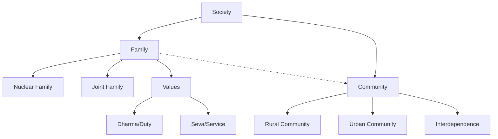
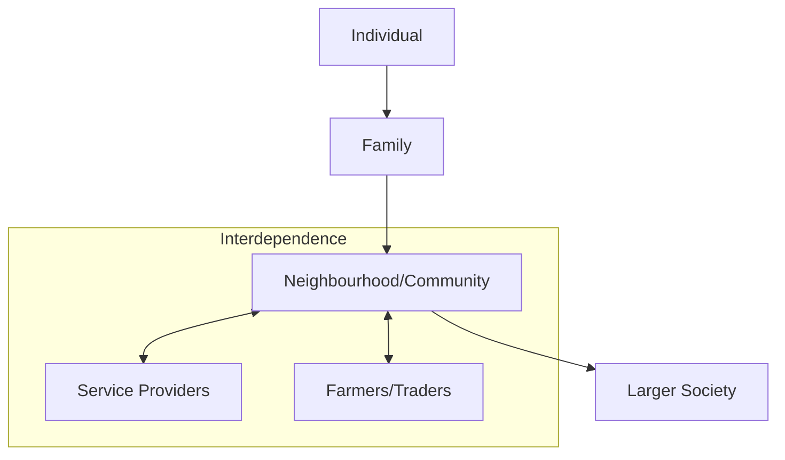

<<<FILE_START: index.mdx>>>
---
title: "Family and Community"
description: "Overview of Chapter 9: The importance of family units, roles within families, and the concept of community in Indian society."
date: 2024-04-10
tags: ["social-science", "class-6", "family", "community", "civics"]
order: 1
draft: false
---

import Callout from '@/components/Callout.astro'

## Introduction

Almost everyone belongs to a family. It is the most fundamental and ancient unit of any society. In this chapter, we explore the different types of families found in India, the values that bind family members together, and how families connect to form larger communities.

> **"Love and dharma are the flower and fruit of family life."** — *Tiruvalluvar*

<Callout variant="tip">
**Chapter At A Glance:**
1.  **The Family Unit:** Nuclear vs. Joint families and kinship terms.
2.  **Roles & Responsibilities:** Cooperation, interdependence, and *Dharma* (duty).
3.  **Community:** How families connect, share resources, and support each other (e.g., *Halma*).
</Callout>

### The Big Questions
As you study this chapter, keep these core questions in mind:
1.  Why is the family unit important?
2.  What is a community and what is its role?

### Concept Map


<<<FILE_END>>>

<<<FILE_START: topics/01-family-structure.mdx>>>
---
title: "Understanding Family Structures"
description: "Definitions of nuclear and joint families, and the diversity of kinship terms in Indian languages."
date: 2024-04-10
tags: ["family-types", "nuclear-family", "joint-family", "kinship"]
order: 2
draft: false
---

import Callout from '@/components/Callout.astro'

## What is a Family?

The family is the fundamental unit of society. While every family is unique, they generally fall into two broad categories in Indian society today.

### Types of Families

1.  **Joint Family:**
    *   Consists of several generations living together.
    *   **Members:** Grandparents, parents, uncles, aunts, brothers, sisters, and cousins.
    *   **Characteristics:** Shared resources, collective decision-making, and close bonding across generations.

2.  **Nuclear Family:**
    *   A smaller unit.
    *   **Members:** Limited to a couple and their children (or sometimes a single parent and children).
    *   **Characteristics:** Often seen in cities or where jobs require moving away from the ancestral home.

<div class="flex justify-center my-6">
  <svg width="500" height="300" viewBox="0 0 500 300" xmlns="http://www.w3.org/2000/svg" stroke="currentColor" fill="none" stroke-width="2">
    <!-- Joint Family Circle -->
    <circle cx="150" cy="150" r="100" stroke="currentColor" stroke-dasharray="5,5" />
    <text x="150" y="40" text-anchor="middle" fill="currentColor" font-weight="bold">Joint Family</text>
    <text x="150" y="100" text-anchor="middle" fill="currentColor" font-size="12">Grandparents</text>
    <text x="150" y="130" text-anchor="middle" fill="currentColor" font-size="12">Uncles & Aunts</text>
    <text x="150" y="160" text-anchor="middle" fill="currentColor" font-size="12">Cousins</text>

    <!-- Nuclear Family Circle (Inside/Overlapping logic representation) -->
    <circle cx="350" cy="150" r="80" stroke="currentColor" />
    <text x="350" y="60" text-anchor="middle" fill="currentColor" font-weight="bold">Nuclear Family</text>
    <text x="350" y="130" text-anchor="middle" fill="currentColor" font-size="12">Parents</text>
    <text x="350" y="160" text-anchor="middle" fill="currentColor" font-size="12">Children</text>

    <!-- Arrow indicating distinct units -->
    <line x1="260" y1="150" x2="260" y2="150" stroke="currentColor" marker-end="url(#arrow)" />
  </svg>
</div>

### Kinship Terms (Language Connection)

In English, family terms are often general (e.g., "Uncle" or "Cousin"). However, Indian languages have very specific terms that define the exact relationship.

<Callout variant="info">
**Did You Know?**
Most Indian languages do not have a word for "Cousin". Cousins are referred to as brothers and sisters, emphasising the deep bond between them.
</Callout>

**Examples in Hindi:**
| Name | Relationship | Term in Hindi |
| :--- | :--- | :--- |
| **Bua** | Father's sister | बुआ |
| **Chacha** | Father's younger brother | चाचा |
| **Mama** | Mother's brother | मामा |
| **Nana/Nani** | Maternal Grandparents | नाना / नानी |

This linguistic specificity reflects the importance of extended family relationships in Indian culture.
<<<FILE_END>>>

<<<FILE_START: topics/02-roles-and-values.mdx>>>
---
title: "Roles, Responsibilities, and Values"
description: "Exploring the concepts of Dharma, cooperation, and the values learned within a family."
date: 2024-04-10
tags: ["dharma", "values", "responsibility", "cooperation"]
order: 3
draft: false
---

import Callout from '@/components/Callout.astro'

## Roles and Responsibilities

Relationships in a family are based on love, care, cooperation, and interdependence.
*   **Cooperation:** Means "working together".
*   **Interdependence:** Members rely on each other for emotional, financial, and physical support.

As children grow, they take on more responsibility, helping with chores and participating in the life of the household.

### The Family as a School of Values

The family is often called the first "school" where children learn essential Indian cultural values.

1.  **Dharma (Duty):** Doing one's duty towards the family and society.
2.  **Ahimsa:** Non-violence and gentleness.
3.  **Dana (Giving):** Generosity and sharing resources.
4.  **Seva (Service):** Serving others without expectation.
5.  **Tyaga (Sacrifice):** Giving up personal needs for the greater good of the family.

```mermaid
graph LR
    A((Family Values))
    A --> B[Dharma<br/>(Duty)]
    A --> C[Seva<br/>(Service)]
    A --> D[Tyaga<br/>(Sacrifice)]
    A --> E[Dana<br/>(Giving)]
    A --> F[Ahimsa<br/>(Non-violence)]
```

<Callout variant="tip">
**Key Concept: Dharma**
In the context of family, *Dharma* refers to the duties and responsibilities each member holds towards others to ensure the family functions smoothly and happily.
</Callout>
<<<FILE_END>>>

<<<FILE_START: topics/03-family-stories.mdx>>>
---
title: "Case Studies: Shalini and Tenzing"
description: "Real-life examples illustrating family dynamics, sharing, and gender roles."
date: 2024-04-10
tags: ["case-study", "kerala", "meghalaya", "family-stories"]
order: 4
draft: false
---

import Callout from '@/components/Callout.astro'

## Story 1: Shalini (Kerala)
**Context:** A joint family facing financial difficulty during the Onam festival.

*   **Family Members:** Shalini, Parents, Brother, Acchamma (Grandmother), Chittappa (Uncle), Chitti (Aunt), Chinni (Cousin).
*   **The Situation:** The uncle lost his job. The family could not afford expensive silk dresses for everyone.
*   **The Resolution:** Shalini's parents bought simple cotton clothes for *everyone*, including the uncle's family, instead of expensive ones just for themselves.
*   **Lesson:** Families share resources. Personal desires (like a silk dress) are sometimes sacrificed (*Tyaga*) to support other family members in tough times.

### Shalini's Family Tree

```mermaid
graph TD
    GP[Acchamma<br/>(Grandmother)] --> F[Father]
    GP --> U[Chittappa<br/>(Uncle)]

    F --- M[Mother]
    U --- A[Chitti<br/>(Aunt)]

    M --> S[Shalini]
    M --> B[Brother]

    A --> C[Chinni<br/>(Cousin)]
```

## Story 2: Tenzing (Meghalaya)
**Context:** A family in the mountains where gender roles are flexible and cooperative.

*   **The Father:** Runs a grocery store but also cleans the house, tends the garden, and cooks. He shares household chores equally.
*   **The Mother:** Works in a handicraft cooperative making traditional fabrics.
*   **The Grandparents:**
    *   *Grandmother:* Tells stories, wisdom.
    *   *Grandfather:* Helps with homework, takes Tenzing to the bus, does social work in the colony (fixing power failures, helping storm victims).
*   **Decision Making:** Parents discuss special expenses together.
*   **Lesson:** Gender equality in household chores and the vital role of grandparents in education and social responsibility.

<Callout variant="tip">
**Comparison:**
Both stories highlight **Interdependence**. In Kerala, it was financial support. In Meghalaya, it was the sharing of labor and duties.
</Callout>
<<<FILE_END>>>

<<<FILE_START: topics/04-community-concept.mdx>>>
---
title: "What is a Community?"
description: "Defining community, exploring rural vs. urban communities, and the concept of interdependence."
date: 2024-04-10
tags: ["community", "society", "interdependence", "civics"]
order: 5
draft: false
---

import Callout from '@/components/Callout.astro'

## Defining Community

A community is a group of connected people living together or sharing common interests/values. Families are not isolated; they connect to form communities.

### Rural vs. Urban Communities

| Feature | Rural / Tribal Communities | Urban Communities |
| :--- | :--- | :--- |
| **Shared Resources** | Water, grazing lands, forest produce. | Parks, roads, community halls. |
| **Cooperation** | Agricultural help (sowing, harvesting together). | Residents' Welfare Associations (RWAs). |
| **Rules** | Often unwritten customs for resource use. | Written rules on waste, parking, pets. |

### Types of Communities
A person can belong to multiple communities simultaneously:
1.  **Residential:** Your neighbourhood or village.
2.  **School:** Your class, sports team, NCC, NSS, or drama club.
3.  **Cultural/Religious:** Groups based on shared religion or region (e.g., "Mumbai's Parsi community").
4.  **Professional:** A community of scientists, farmers, or artists.

### Interdependence
Communities rely on each other. An RWA (Residential Community) depends on:
*   The Trading Community (for supplies).
*   Municipal Workers (for waste handling).

**No community can survive in isolation.**


<<<FILE_END>>>

<<<FILE_START: topics/05-community-examples.mdx>>>
---
title: "Community in Action: Real-World Examples"
description: "Inspiring stories of Halma, disaster relief, and educational initiatives."
date: 2024-04-10
tags: ["halma", "social-service", "activism", "environment"]
order: 6
draft: false
---

import Callout from '@/components/Callout.astro'

## 1. Halma: The Bhil Tradition
**Location:** Jhabua, Madhya Pradesh.

*   **The Problem:** Acute water crisis.
*   **The Tradition:** *Halma* — coming together to help an individual or the community during a crisis without payment.
*   **The Action:** The Bhil community planted thousands of trees and dug trenches to conserve rainwater.
*   **Result:** Restoration of the environment. Shri Mahesh Sharma was honoured with the Padma Shri for leading this Shivganga movement.
*   **Value:** Serving "Mother Earth" as a duty.

## 2. Chennai Floods (2015)
**Context:** An urban disaster where roads turned to rivers.

*   **Community Response:** People could not move, shops were closed. Religious and private groups cooked large quantities of food and distributed it to strangers.
*   **Lesson:** In times of crisis, community barriers break down, and humanity serves as one community.

## 3. Kamal Parmar's Initiative
**Location:** Ahmedabad, Gujarat.

*   **The Individual:** Kamal Parmar, an auto-fabrication workshop owner.
*   **The Action:** Saw underprivileged children on the street. Started free tuition (5:30 to 9:30 PM) and provided dinner.
*   **Community Ripple Effect:**
    *   School teachers joined to teach for free.
    *   Older students became volunteers.
*   **Lesson:** One person's initiative can build a community of care.

<Callout variant="quote">
**Reflection:**
"We went there to teach, instead we learnt a lot from them." — *A volunteer at Kamal Parmar's class.*
</Callout>
<<<FILE_END>>>

<<<FILE_START: solutions/ex-main.mdx>>>
---
title: "Chapter Exercises & Activities"
description: "Detailed solutions to the Questions, Activities, and Projects at the end of Chapter 9."
date: 2024-04-10
tags: ["solutions", "exercises", "chapter-9"]
order: 7
draft: false
---

import Callout from '@/components/Callout.astro'

## Questions, Activities, and Projects

### 1. What are some of the rules you follow in your family and neighbourhood? Why are they important?

**Answer:**

**Family Rules:**
*   **Examples:** Eating dinner together, taking shoes off at the door, respecting elders, sharing household chores, being home by a certain time.
*   **Importance:** These rules create discipline, ensure the house stays clean, and strengthen the bond between family members. They teach us respect and time management.

**Neighbourhood Rules:**
*   **Examples:** Throwing garbage only in bins, not playing loud music late at night, parking vehicles in designated spots.
*   **Importance:** These rules ensure that everyone lives peacefully without disturbing others. They maintain hygiene and order in the community.

---

### 2. Do you think some rules are unfair to a few people in the family or community? Why?

**Answer:**
Yes, sometimes rules can be unfair or outdated.

*   **In the Family:** In some traditional families, rules might dictate that only girls must do kitchen work while boys play outside. This is unfair because household responsibilities should be shared equally, as seen in Tenzing’s story where his father cooks and cleans.
*   **In the Community:** Sometimes, strict rules about who can use a shared water source or enter certain places (based on caste or class) can exclude specific groups of people. This is unfair because resources and dignity should be accessible to everyone equally.

---

### 3. Describe several situations that you have observed where community support makes a difference.

**Answer:**
*(Note: Students can write their own observations. Below are model answers based on the chapter concepts.)*

1.  **Festivals:** During festivals like Diwali or Ganesh Chaturthi, the entire community comes together to decorate the streets and organize events. This creates a sense of belonging and joy that a single family cannot achieve alone.
2.  **Medical Emergencies:** If a neighbour falls suddenly ill, others in the community often help by arranging a vehicle to the hospital or taking care of the children/pets of the affected family.
3.  **Cleanliness Drives:** Residents coming together on a Sunday to clean a local park. This collective effort achieves much more than a single municipal worker could do alone.
4.  **Disaster Relief:** As seen in the Chennai floods example, when a natural disaster hits, neighbours share food, water, and shelter, saving lives.
<<<FILE_END>>>

<<<FILE_START: practice/solved-examples.mdx>>>
---
title: "Solved Examples & Reflections"
description: "Answers to 'Think About It' and 'Let's Explore' prompts found within the chapter."
date: 2024-04-10
tags: ["practice", "critical-thinking", "case-studies"]
order: 8
draft: false
---

import Callout from '@/components/Callout.astro'

## Tenzing's Family (Think About It)

**Q1: Why does Tenzing’s father consult his wife for special expenses?**
**Answer:** This shows equality and partnership. Even though the father earns money, the mother contributes through her handicraft work and household management. Financial decisions affect the whole family, so discussing them together ensures transparency and mutual respect.

**Q2: How do you feel about his participation in household chores?**
**Answer:** It is a positive example of breaking gender stereotypes. It demonstrates that cooking and cleaning are life skills, not just "women's work." By helping, he practices the value of cooperation.

**Q3: What roles do the grandparents fulfil?**
**Answer:**
*   **Grandmother:** Passes down culture, wisdom, and history through stories.
*   **Grandfather:** Provides academic support (homework) and sets an example of civic duty (social work, helping neighbours). They provide a support system that allows the parents to work.

---

## Shalini's Family (Let's Explore)

**Q1: Why do you think Shalini’s parents bought clothes for everyone?**
**Answer:** In a joint family, the happiness of the group is more important than individual luxury. Buying expensive clothes only for themselves while the uncle's family had none would have created division and sadness. Buying simple clothes for everyone maintained unity and dignity.

**Q2: What would you have done if you were in Shalini’s place?**
**Answer:** *(Self-reflection)* Most students might feel disappointed initially about not getting the silk dress. However, understanding the *Dharma* (duty) of the family to support the uncle would lead to acceptance. One might feel proud that their family cares for each other.

---

## Kamal Parmar's Story (Class Discussion)

**Q: What values get reflected in Kamal Parmar’s initiative?**
**Answer:**
1.  **Seva (Service):** Helping others without expecting money.
2.  **Dana (Giving):** Giving his time, space, and food to the children.
3.  **Compassion:** Caring for the underprivileged who are often ignored by society.
<<<FILE_END>>>
