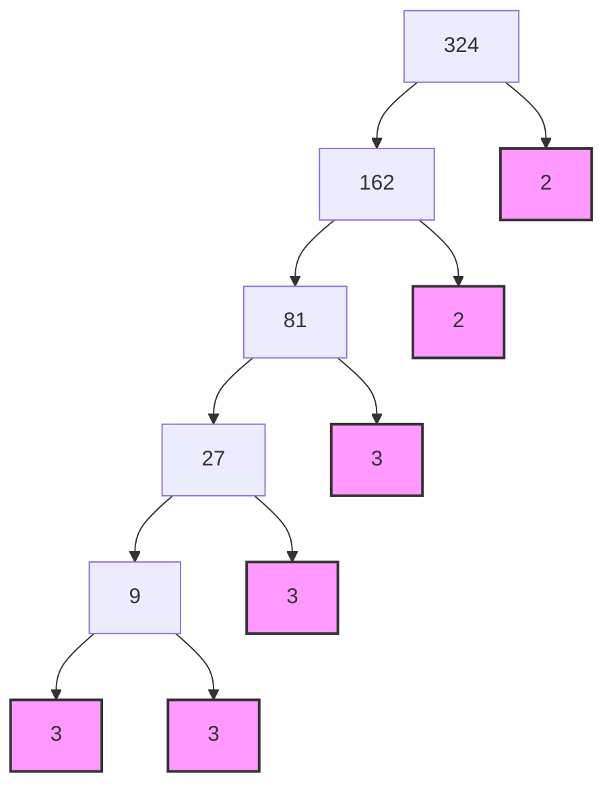

<<<FILE_START: index.mdx>>>
---
title: "Chapter 1: A Square and A Cube"
description: "Introduction to square and cubic numbers, their properties, patterns, and roots."
date: 2024-04-10
tags: ["math", "algebra", "squares", "cubes", "grade-8"]
order: 1
draft: false
---

import Callout from '@/components/Callout.astro'

## Introduction: The Locker Puzzle

Imagine a secret room with 100 lockers numbered 1 to 100. All lockers are initially closed.
- **Person 1** opens every locker.
- **Person 2** toggles every 2nd locker (closes it if open, opens it if closed).
- **Person 3** toggles every 3rd locker.
- And so on, until **Person 100** toggles the 100th locker.

**Which lockers remain open at the end?**

<Callout variant="tip">
**The Secret:** A locker remains open if it is toggled an **odd number of times**.
The number of times a locker is toggled equals its number of **factors**.
Only **Perfect Squares** (like 1, 4, 9, 16...) have an odd number of factors.
</Callout>

Why? Factors usually come in pairs (e.g., for 12: $1\times12, 2\times6, 3\times4$). But for a perfect square like 36, one factor pairs with itself ($6\times6$), resulting in an odd count of factors ($1, 2, 3, 4, 6, 9, 12, 18, 36$).

## Formula Sheet

### 1. Squares ($n^2$)
A square number is the product of a number multiplied by itself.

$$
n^2 = n \times n
$$

| Number ($n$) | Square ($n^2$) | Number ($n$) | Square ($n^2$) |
| :--- | :--- | :--- | :--- |
| 1 | 1 | 11 | 121 |
| 2 | 4 | 12 | 144 |
| 3 | 9 | 13 | 169 |
| 4 | 16 | 14 | 196 |
| 5 | 25 | 15 | 225 |
| 6 | 36 | 16 | 256 |
| 7 | 49 | 17 | 289 |
| 8 | 64 | 18 | 324 |
| 9 | 81 | 19 | 361 |
| 10 | 100 | 20 | 400 |

### 2. Cubes ($n^3$)
A cubic number is the product of a number multiplied by itself three times.

$$
n^3 = n \times n \times n
$$

| Number ($n$) | Cube ($n^3$) |
| :--- | :--- |
| 1 | 1 |
| 2 | 8 |
| 3 | 27 |
| 4 | 64 |
| 5 | 125 |
| 6 | 216 |
| 7 | 343 |
| 8 | 512 |
| 9 | 729 |
| 10 | 1000 |

## Topics Covered
1. **Square Numbers:** Visual proofs and properties.
2. **Patterns:** Unit digits, zeros, and triangular numbers.
3. **Square Roots:** Finding roots via subtraction and factorization.
4. **Cubic Numbers:** Properties and the Hardy-Ramanujan number.
5. **Cube Roots:** Prime factorization and estimation.
<<<FILE_END>>>

<<<FILE_START: topics/01-square-numbers.mdx>>>
---
title: "Square Numbers"
description: "Understanding perfect squares, their geometric meaning, and key properties."
date: 2024-04-10
tags: ["squares", "geometry", "properties"]
order: 2
draft: false
---

import Callout from '@/components/Callout.astro'

## What is a Square Number?

A natural number $n$ is called a **perfect square** (or square number) if it is the square of some natural number $m$. That is, $n = m^2$.

Geometrically, a perfect square represents the area of a square with integer side lengths.

  <svg width="300" height="150" viewBox="0 0 300 150" xmlns="http://www.w3.org/2000/svg">
    <!-- Square 1x1 -->
    <rect x="20" y="50" width="30" height="30" fill="none" stroke="currentColor" stroke-width="2" />
    <text x="35" y="100" font-family="sans-serif" font-size="12" text-anchor="middle" fill="currentColor">1² = 1</text>

    <!-- Square 2x2 -->
    <rect x="80" y="35" width="60" height="60" fill="none" stroke="currentColor" stroke-width="2" />
    <line x1="110" y1="35" x2="110" y2="95" stroke="currentColor" stroke-width="1" stroke-dasharray="4" />
    <line x1="80" y1="65" x2="140" y2="65" stroke="currentColor" stroke-width="1" stroke-dasharray="4" />
    <text x="110" y="115" font-family="sans-serif" font-size="12" text-anchor="middle" fill="currentColor">2² = 4</text>

    <!-- Square 3x3 -->
    <rect x="170" y="20" width="90" height="90" fill="none" stroke="currentColor" stroke-width="2" />
    <line x1="200" y1="20" x2="200" y2="110" stroke="currentColor" stroke-width="1" stroke-dasharray="4" />
    <line x1="230" y1="20" x2="230" y2="110" stroke="currentColor" stroke-width="1" stroke-dasharray="4" />
    <line x1="170" y1="50" x2="260" y2="50" stroke="currentColor" stroke-width="1" stroke-dasharray="4" />
    <line x1="170" y1="80" x2="260" y2="80" stroke="currentColor" stroke-width="1" stroke-dasharray="4" />
    <text x="215" y="130" font-family="sans-serif" font-size="12" text-anchor="middle" fill="currentColor">3² = 9</text>
  </svg>

## Properties of Perfect Squares

### 1. The Unit Digit Rule
Look at the squares of numbers from 1 to 10:
$1, 4, 9, 16, 25, 36, 49, 64, 81, 100$.

Notice the digits in the **units place**:
*   Possible ending digits: **0, 1, 4, 5, 6, 9**
*   **Impossible** ending digits: **2, 3, 7, 8**

<Callout variant="warning">
**Note:** If a number ends in 0, 1, 4, 5, 6, or 9, it *might* be a square (e.g., 26 is not a square).
However, if a number ends in 2, 3, 7, or 8, it is **definitely NOT** a square.
</Callout>

### 2. Number of Zeros
Consider numbers ending in zero:
*   $10^2 = 100$ (1 zero $\to$ 2 zeros)
*   $200^2 = 40000$ (2 zeros $\to$ 4 zeros)

A perfect square must have an **even number of zeros** at the end. A number ending in 3 zeros (like 1000) cannot be a perfect square.

### 3. Odd vs Even
*   The square of an **even** number is even ($4^2 = 16$).
*   The square of an **odd** number is odd ($5^2 = 25$).
<<<FILE_END>>>

<<<FILE_START: topics/02-patterns-in-squares.mdx>>>
---
title: "Patterns in Square Numbers"
description: "Sum of odd numbers, triangular numbers, and finding numbers between squares."
date: 2024-04-10
tags: ["patterns", "math", "series"]
order: 3
draft: false
---

import Callout from '@/components/Callout.astro'

## 1. Adding Odd Numbers

There is a beautiful relationship between squares and odd numbers. Every square number is the sum of consecutive odd numbers starting from 1.

$$
\begin{aligned}
1 &= 1 = 1^2 \\
1 + 3 &= 4 = 2^2 \\
1 + 3 + 5 &= 9 = 3^2 \\
1 + 3 + 5 + 7 &= 16 = 4^2
\end{aligned}
$$

**General Rule:** The sum of the first $n$ odd natural numbers is $n^2$.

### Visual Proof
We can visualize this by adding "layers" (L-shapes) to a square.

  <svg width="200" height="200" viewBox="0 0 200 200" xmlns="http://www.w3.org/2000/svg">
    <!-- 1 -->
    <rect x="50" y="50" width="20" height="20" fill="currentColor" opacity="0.3" />
    <!-- 3 -->
    <rect x="75" y="50" width="20" height="20" fill="currentColor" opacity="0.6" />
    <rect x="75" y="75" width="20" height="20" fill="currentColor" opacity="0.6" />
    <rect x="50" y="75" width="20" height="20" fill="currentColor" opacity="0.6" />
    <!-- 5 -->
    <rect x="100" y="50" width="20" height="20" fill="currentColor" opacity="0.9" />
    <rect x="100" y="75" width="20" height="20" fill="currentColor" opacity="0.9" />
    <rect x="100" y="100" width="20" height="20" fill="currentColor" opacity="0.9" />
    <rect x="75" y="100" width="20" height="20" fill="currentColor" opacity="0.9" />
    <rect x="50" y="100" width="20" height="20" fill="currentColor" opacity="0.9" />

    <text x="60" y="40" font-size="12" fill="currentColor" text-anchor="middle">1</text>
    <text x="120" y="40" font-size="12" fill="currentColor" text-anchor="middle">1+3</text>
    <text x="160" y="110" font-size="12" fill="currentColor" text-anchor="start">1+3+5</text>
  </svg>

## 2. Triangular Numbers

Triangular numbers are numbers that can form a triangle: $1, 3, 6, 10, 15 \dots$.
If you add two consecutive triangular numbers, you get a square number!

*   $1 + 3 = 4 = 2^2$
*   $3 + 6 = 9 = 3^2$
*   $6 + 10 = 16 = 4^2$

  <svg width="250" height="100" viewBox="0 0 250 100" xmlns="http://www.w3.org/2000/svg">
    <!-- Triangle 1 -->
    <circle cx="20" cy="80" r="5" fill="currentColor" />
    <text x="20" y="95" text-anchor="middle" font-size="10" fill="currentColor">1</text>

    <!-- Triangle 3 -->
    <circle cx="60" cy="80" r="5" fill="currentColor" />
    <circle cx="75" cy="80" r="5" fill="currentColor" />
    <circle cx="67.5" cy="65" r="5" fill="currentColor" />
    <text x="67.5" y="95" text-anchor="middle" font-size="10" fill="currentColor">3</text>

    <!-- Triangle 6 -->
    <circle cx="120" cy="80" r="5" fill="currentColor" />
    <circle cx="135" cy="80" r="5" fill="currentColor" />
    <circle cx="150" cy="80" r="5" fill="currentColor" />
    <circle cx="127.5" cy="65" r="5" fill="currentColor" />
    <circle cx="142.5" cy="65" r="5" fill="currentColor" />
    <circle cx="135" cy="50" r="5" fill="currentColor" />
    <text x="135" y="95" text-anchor="middle" font-size="10" fill="currentColor">6</text>
  </svg>

## 3. Numbers Between Squares

How many non-square numbers lie between two consecutive squares $n^2$ and $(n+1)^2$?

Let's check:
*   Between $1^2 (1)$ and $2^2 (4)$: 2, 3 (**2 numbers**)
*   Between $2^2 (4)$ and $3^2 (9)$: 5, 6, 7, 8 (**4 numbers**)
*   Between $3^2 (9)$ and $4^2 (16)$: 10, 11, 12, 13, 14, 15 (**6 numbers**)

**Pattern:** There are $2n$ non-square numbers between $n^2$ and $(n+1)^2$.
<<<FILE_END>>>

<<<FILE_START: topics/03-square-roots.mdx>>>
---
title: "Square Roots"
description: "Finding square roots using repeated subtraction and prime factorization."
date: 2024-04-10
tags: ["square-roots", "calculation", "prime-factors"]
order: 4
draft: false
---

import Callout from '@/components/Callout.astro'

## What is a Square Root?

The square root is the inverse operation of squaring. If $n^2 = x$, then the square root of $x$ is $n$.
We denote it by the symbol $\sqrt{x}$.

$$
\sqrt{81} = 9 \quad \text{because} \quad 9 \times 9 = 81
$$

## Finding Square Roots

### Method 1: Repeated Subtraction
Since a square is the sum of consecutive odd numbers, we can subtract odd numbers ($1, 3, 5\dots$) from the given number until we reach zero. The number of steps is the square root.

**Example: Find $\sqrt{25}$**
1.  $25 - 1 = 24$ (Step 1)
2.  $24 - 3 = 21$ (Step 2)
3.  $21 - 5 = 16$ (Step 3)
4.  $16 - 7 = 9$ (Step 4)
5.  $9 - 9 = 0$ (Step 5)

We reached 0 in 5 steps. Therefore, $\sqrt{25} = 5$.

### Method 2: Prime Factorization
For larger numbers, we use prime factorization. We pair identical prime factors and pick one from each pair.

**Example: Find $\sqrt{324}$**

1.  Find prime factors of 324:
    $324 = 2 \times 2 \times 3 \times 3 \times 3 \times 3$
2.  Group them in pairs:
    $324 = (2 \times 2) \times (3 \times 3) \times (3 \times 3)$
3.  Take one from each pair:
    $\sqrt{324} = 2 \times 3 \times 3$
4.  Multiply:
    $2 \times 3 \times 3 = 18$

### Method 3: Estimation
If a number is not a perfect square (or is very large), we can estimate.
**Example: Find $\sqrt{250}$**
1.  We know $10^2 = 100$ and $20^2 = 400$. So the root is between 10 and 20.
2.  $15^2 = 225$ and $16^2 = 256$.
3.  250 is closer to 256 than 225.
4.  Therefore, $\sqrt{250} \approx 16$.
<<<FILE_END>>>

<<<FILE_START: topics/04-cubic-numbers.mdx>>>
---
title: "Cubic Numbers"
description: "Introduction to cubes, Hardy-Ramanujan number, and properties."
date: 2024-04-10
tags: ["cubes", "ramanujan", "geometry"]
order: 5
draft: false
---

import Callout from '@/components/Callout.astro'

## What is a Cube?

A cube number is obtained by multiplying a number by itself three times: $n^3 = n \times n \times n$.
Geometrically, it represents the volume of a cube.

  <svg width="150" height="150" viewBox="0 0 150 150" xmlns="http://www.w3.org/2000/svg">
    <!-- Front Face -->
    <rect x="30" y="50" width="60" height="60" fill="none" stroke="currentColor" stroke-width="2"/>
    <!-- Back Face -->
    <rect x="60" y="20" width="60" height="60" fill="none" stroke="currentColor" stroke-width="2"/>
    <!-- Connecting Lines -->
    <line x1="30" y1="50" x2="60" y2="20" stroke="currentColor" stroke-width="2"/>
    <line x1="90" y1="50" x2="120" y2="20" stroke="currentColor" stroke-width="2"/>
    <line x1="30" y1="110" x2="60" y2="80" stroke="currentColor" stroke-width="2"/>
    <line x1="90" y1="110" x2="120" y2="80" stroke="currentColor" stroke-width="2"/>
    <text x="75" y="140" font-family="sans-serif" font-size="12" text-anchor="middle" fill="currentColor">Volume = side³</text>
  </svg>

## Hardy-Ramanujan Number: 1729

1729 is known as the **Taxicab Number**. It is the smallest number that can be expressed as the sum of two cubes in two different ways.

$$
\begin{aligned}
1729 &= 12^3 + 1^3 \\
&= 1728 + 1 \\
\\
1729 &= 10^3 + 9^3 \\
&= 1000 + 729
\end{aligned}
$$

## Properties of Cubes

1.  **Parity:** Cube of an even number is even ($2^3 = 8$). Cube of an odd number is odd ($3^3 = 27$).
2.  **Last Digits:**
    *   If a number ends in 1, its cube ends in 1.
    *   If a number ends in 2, its cube ends in 8.
    *   If a number ends in 3, its cube ends in 7.
    *   If a number ends in 4, its cube ends in 4.
    *   If a number ends in 5, its cube ends in 5.
    *   If a number ends in 6, its cube ends in 6.
    *   If a number ends in 7, its cube ends in 3.
    *   If a number ends in 8, its cube ends in 2.
    *   If a number ends in 9, its cube ends in 9.
    *   If a number ends in 0, its cube ends in 0.

<Callout variant="tip">
Notice the pattern: numbers ending in 0, 1, 4, 5, 6, 9 keep the same unit digit.
2 flips with 8.
3 flips with 7.
</Callout>
<<<FILE_END>>>

<<<FILE_START: topics/05-cube-roots.mdx>>>
---
title: "Cube Roots"
description: "Finding cube roots using prime factorization."
date: 2024-04-10
tags: ["cube-roots", "factorization"]
order: 6
draft: false
---

## Definition
The cube root of a number $x$ is that number which, when multiplied by itself three times, gives $x$.
Denoted as $\sqrt[3]{x}$.

$$
\sqrt[3]{8} = 2 \quad \text{because} \quad 2 \times 2 \times 2 = 8
$$

## Prime Factorization Method

To find the cube root, we factorize the number and group factors in **triplets** (groups of 3).

**Example: Find $\sqrt[3]{3375}$**

1.  **Prime Factorization:**
    $3375 = 3 \times 3 \times 3 \times 5 \times 5 \times 5$

2.  **Group in Triplets:**
    $3375 = (3 \times 3 \times 3) \times (5 \times 5 \times 5)$

3.  **Take one from each group:**
    $\sqrt[3]{3375} = 3 \times 5$

4.  **Result:**
    $15$

## Estimation Method
For perfect cubes like 12167:
1.  **Group digits:** Starting from the right, group in 3s. $\underline{12}, \underline{167}$.
2.  **First group (167):** Ends in 7. Therefore, the cube root ends in **3** (since $3^3=27$).
3.  **Second group (12):** Find the largest cube less than 12. $2^3 = 8$ and $3^3 = 27$. So, the ten's digit is **2**.
4.  **Result:** 23.

Check: $23 \times 23 \times 23 = 12167$. Correct.
<<<FILE_END>>>

<<<FILE_START: solutions/ex-1.1.mdx>>>
---
title: "Figure It Out 1.1"
description: "Solutions to the Figure It Out exercises on Page 10."
date: 2024-04-10
tags: ["solutions", "exercises", "squares"]
order: 7
draft: false
---

## Question 1
**Which of the following numbers are not perfect squares?**
(i) 2032 (ii) 2048 (iii) 1027 (iv) 1089

**Solution:**
We check the unit digits. A perfect square cannot end in 2, 3, 7, or 8.
*   (i) 2032 ends in **2**. Not a square.
*   (ii) 2048 ends in **8**. Not a square.
*   (iii) 1027 ends in **7**. Not a square.
*   (iv) 1089 ends in 9. It might be a square ($33^2 = 1089$).

**Answer:** (i), (ii), and (iii) are not perfect squares.

## Question 2
**Which one among $64^2, 108^2, 292^2, 36^2$ has last digit 4?**

**Solution:**
The last digit of a square depends on the last digit of the number.
*   $64^2 \to 4 \times 4 = 16$ (ends in 6)
*   $108^2 \to 8 \times 8 = 64$ (**ends in 4**)
*   $292^2 \to 2 \times 2 = 4$ (**ends in 4**)
*   $36^2 \to 6 \times 6 = 36$ (ends in 6)

**Answer:** $108^2$ and $292^2$.

## Question 3
**Given $125^2 = 15625$, what is the value of $126^2$?**

**Solution:**
We can use the identity $(n+1)^2 = n^2 + (n) + (n+1) = n^2 + 2n + 1$.
Here $n = 125$.
$126^2 = 125^2 + 125 + 126$
$126^2 = 15625 + 251$

**Answer:** (iv) $15625 + 251$.

## Question 4
**Find the length of the side of a square whose area is 441 m².**

**Solution:**
Area = Side $\times$ Side = $x^2 = 441$.
We need to find $\sqrt{441}$.
Prime factors of 441:
$441 = 3 \times 147 = 3 \times 3 \times 49 = 3 \times 3 \times 7 \times 7$.
Group pairs: $(3 \times 3) \times (7 \times 7)$.
$\sqrt{441} = 3 \times 7 = 21$.

**Answer:** 21 m.

## Question 5
**Find the smallest square number that is divisible by each of the following numbers: 4, 9, and 10.**

**Solution:**
1.  Find the LCM of 4, 9, 10.
    *   $4 = 2^2$
    *   $9 = 3^2$
    *   $10 = 2 \times 5$
    *   LCM = $2^2 \times 3^2 \times 5 = 4 \times 9 \times 5 = 180$.
2.  Check prime factors of 180: $180 = 2 \times 2 \times 3 \times 3 \times 5$.
3.  To make it a perfect square, all factors must be in pairs.
4.  The factor 5 is unpaired. We must multiply by 5.
5.  $180 \times 5 = 900$.

**Answer:** 900.

## Question 6
**Find the smallest number by which 9408 must be multiplied so that the product is a perfect square. Find the square root of the product.**

**Solution:**
1.  Prime factorization of 9408:
    $9408 \div 2 = 4704$
    $4704 \div 2 = 2352$
    $2352 \div 2 = 1176$
    $1176 \div 2 = 588$
    $588 \div 2 = 294$
    $294 \div 2 = 147$
    $147 \div 3 = 49$
    $49 \div 7 = 7$
    $7 \div 7 = 1$
    Factors: $2 \times 2 \times 2 \times 2 \times 2 \times 2 \times 3 \times 7 \times 7$.
2.  Group pairs: $(2\times2), (2\times2), (2\times2), (7\times7)$.
3.  The factor **3** is left unpaired.
4.  Smallest number to multiply is **3**.
5.  New number: $9408 \times 3 = 28224$.
6.  Square root = $2 \times 2 \times 2 \times 7 \times 3 = 8 \times 21 = 168$.

**Answer:** Multiply by 3. Square root of product is 168.

## Question 7
**How many numbers lie between the squares of the following numbers?**
(i) 16 and 17 (ii) 99 and 100

**Solution:**
Between $n^2$ and $(n+1)^2$, there are $2n$ non-square numbers.
(i) Here $n=16$. Numbers = $2 \times 16 = 32$.
(ii) Here $n=99$. Numbers = $2 \times 99 = 198$.

## Question 8
**Fill in the missing numbers:**
$4^2 + 5^2 + 20^2 = (\underline{\quad})^2$
$9^2 + 10^2 + (\underline{\quad})^2 = (\underline{\quad})^2$

**Solution:**
Pattern: $n^2 + (n+1)^2 + [n(n+1)]^2 = [n(n+1)+1]^2$.
1.  $4^2 + 5^2 + 20^2$. Here $4 \times 5 = 20$. Next is 21.
    Answer: **21**
2.  $9^2 + 10^2 + (90)^2$. Next is 91.
    Answer: **90, 91**
<<<FILE_END>>>

<<<FILE_START: solutions/ex-1.2.mdx>>>
---
title: "Figure It Out 1.2"
description: "Solutions to the exercises on Page 16 regarding cubes."
date: 2024-04-10
tags: ["solutions", "cubes", "exercises"]
order: 8
draft: false
---

## Question 1
**Find the cube roots of 27000 and 10648.**

**Solution:**
1.  **27000:**
    $27000 = 27 \times 1000 = 3^3 \times 10^3$.
    $\sqrt[3]{27000} = 3 \times 10 = 30$.

2.  **10648:**
    Prime factorization:
    $10648 \div 8 = 1331$
    $1331 \div 11 = 121$
    $121 \div 11 = 11$
    Factors: $(2 \times 2 \times 2) \times (11 \times 11 \times 11)$.
    $\sqrt[3]{10648} = 2 \times 11 = 22$.

## Question 2
**What number will you multiply by 1323 to make it a cube number?**

**Solution:**
Prime factorization of 1323:
$1323 \div 3 = 441$
$441 \div 3 = 147$
$147 \div 3 = 49$
$49 = 7 \times 7$
Factors: $(3 \times 3 \times 3) \times 7 \times 7$.
The 3s form a triplet. The 7s are only two ($7 \times 7$). We need one more 7 to complete the triplet.

**Answer:** Multiply by 7.

## Question 3
**State true or false.**
(i) **The cube of any odd number is even.**
    *False.* $3^3 = 27$ (odd).
(ii) **There is no perfect cube that ends with 8.**
    *False.* $2^3 = 8$, $12^3 = 1728$.
(iii) **The cube of a 2-digit number may be a 3-digit number.**
    *False.* Smallest 2-digit number is 10. $10^3 = 1000$ (4 digits).
(iv) **The cube of a 2-digit number may have seven or more digits.**
    *False.* Largest 2-digit number is 99. $99 < 100$. $100^3 = 1,000,000$ (7 digits). So $99^3$ must have fewer than 7 digits (it has 6).
(v) **Cube numbers have an odd number of factors.**
    *False.* Only squares have an odd number of factors. E.g., $8$ has factors 1, 2, 4, 8 (4 factors). Exception: If a number is both a square and a cube (like 64), it has odd factors. But generally, no.

## Question 4
**Guess the cube roots of 4913, 12167, and 32768.**

**Solution:**
*   **4913:** Ends in 3 $\to$ Root ends in 7. Strike out last 3 digits (913). Remaining is 4. Largest cube $<4$ is $1^3=1$.
    Root: **17**.
*   **12167:** Ends in 7 $\to$ Root ends in 3. Strike out 167. Remaining 12. Largest cube $<12$ is $2^3=8$.
    Root: **23**.
*   **32768:** Ends in 8 $\to$ Root ends in 2. Strike out 768. Remaining 32. Largest cube $<32$ is $3^3=27$.
    Root: **32**.

## Question 5
**Which is the greatest? $67^3 - 66^3$, etc.**

**Solution:**
We can use the difference formula approximation or calculate pattern: $n^3 - (n-1)^3 = 1 + n(n-1) \times 3$.
*   (i) $67^3 - 66^3 \approx 1 + 67 \times 66 \times 3 \approx 13,000$
*   (ii) $43^3 - 42^3$ is smaller (smaller $n$).
*   (iii) $67^2 - 66^2 = 67 + 66 = 133$. (Much smaller).
*   (iv) $43^2 - 42^2 = 85$.

**Answer:** (i) $67^3 - 66^3$ is the greatest.
<<<FILE_END>>>

<<<FILE_START: solutions/puzzle.mdx>>>
---
title: "Square Pairs Puzzle"
description: "Solution to the Square Pairs puzzle on Page 18."
date: 2024-04-10
tags: ["puzzle", "fun", "logic"]
order: 9
draft: false
---

import Callout from '@/components/Callout.astro'

## The Problem
Arrange numbers 1 to 17 in a row such that the sum of every adjacent pair is a square number.

## Strategy
Let's map out possible neighbors for each number (1-17) that sum to a square (4, 9, 16, 25, 36).

*   **1:** 3, 8, 15
*   **2:** 7, 14
*   **3:** 1, 6, 13
*   **4:** 5, 12
*   **5:** 4, 11
*   **6:** 3, 10
*   **7:** 2, 9
*   **8:** 1, 17
*   **9:** 7, 16
*   **10:** 6, 15
*   **11:** 5, 14
*   **12:** 4, 13
*   **13:** 3, 12
*   **14:** 2, 11
*   **15:** 1, 10
*   **16:** 9 (only one neighbor!)
*   **17:** 8 (only one neighbor!)

<Callout variant="tip">
**Key Insight:** Since 16 and 17 have only **one** possible neighbor each (9 and 8 respectively), they must be at the **ends** of the row.
</Callout>

## The Sequence
Start with 17:
1.  **17** must connect to **8** ($17+8=25$).
2.  **8** connects to 17 (used) or **1** ($8+1=9$).
3.  **1** connects to 8 (used) or 3 or 15.
    *   If we pick 3: $1 \to 3 \to 6 \to 10 \to 15 \dots$
    *   If we pick 15: $1 \to 15 \to 10 \to 6 \to 3 \dots$
    Let's trace from the other end (16) to meet in the middle.

Start with 16:
**16** $\to$ **9** $\to$ **7** $\to$ **2** $\to$ **14** $\to$ **11** $\to$ **5** $\to$ **4** $\to$ **12** $\to$ **13** $\to$ **3** $\to$ **6** $\to$ **10** $\to$ **15** $\to$ **1** $\to$ **8** $\to$ **17**.

## Final Answer
**16, 9, 7, 2, 14, 11, 5, 4, 12, 13, 3, 6, 10, 15, 1, 8, 17**

(Check pairs: $16+9=25, 9+7=16, 7+2=9 \dots 8+17=25$. All squares!)
<<<FILE_END>>>

<<<FILE_START: practice/solved-examples.mdx>>>
---
title: "Solved Examples"
description: "Additional examples and logical questions derived from the chapter text."
date: 2024-04-10
tags: ["practice", "examples"]
order: 10
draft: false
---

import Callout from '@/components/Callout.astro'

## Example 1: Is 324 a perfect square?

**Question:** Determine if 324 is a perfect square using prime factorization.

**Solution:**
1.  Factorize 324:
    $$324 = 2 \times 162 = 2 \times 2 \times 81 = 2 \times 2 \times 9 \times 9 = 2 \times 2 \times 3 \times 3 \times 3 \times 3$$
2.  Group factors:
    $$(2 \times 2) \times (3 \times 3) \times (3 \times 3)$$
3.  Since all factors can be paired completely with no remainders, **Yes, 324 is a perfect square.**
4.  $\sqrt{324} = 2 \times 3 \times 3 = 18$.

## Example 2: Is 156 a perfect square?

**Question:** Check 156.

**Solution:**
1.  Factorize 156:
    $$156 = 2 \times 78 = 2 \times 2 \times 39 = 2 \times 2 \times 3 \times 13$$
2.  Group factors:
    $$(2 \times 2) \times 3 \times 13$$
3.  The factors 3 and 13 do not have pairs.
4.  **No, 156 is not a perfect square.**

## Example 3: Estimating $\sqrt{1936}$

**Question:** Find the square root of 1936 by estimation.

**Solution:**
1.  **Find Range:** $40^2 = 1600$ and $50^2 = 2500$. 1936 is between them.
2.  **Check Unit Digit:** 1936 ends in 6. The root must end in **4** or **6**.
3.  **Possibilities:** 44 or 46.
4.  **Narrow Down:** $45^2 = 2025$.
5.  Since $1936 < 2025$, the root must be less than 45.
6.  Therefore, the root is **44**.

## Example 4: Is 3375 a perfect cube?

**Question:** Check if 3375 is a perfect cube.

**Solution:**
1.  Factorize 3375:
    $$3375 = 5 \times 675 = 5 \times 5 \times 135 = 5 \times 5 \times 5 \times 27$$
    $$3375 = 5 \times 5 \times 5 \times 3 \times 3 \times 3$$
2.  Group in triplets:
    $$(5 \times 5 \times 5) \times (3 \times 3 \times 3)$$
3.  All factors form triplets. **Yes, it is a perfect cube.**
4.  $\sqrt[3]{3375} = 5 \times 3 = 15$.
<<<FILE_END>>>
