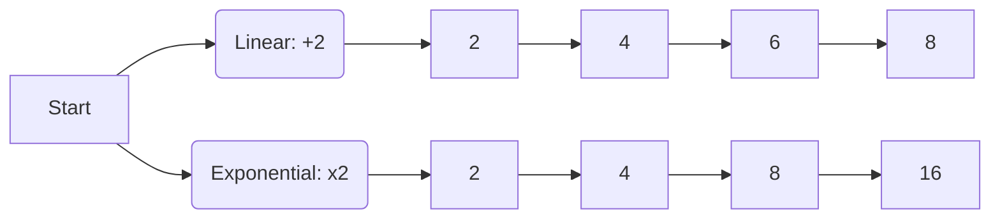
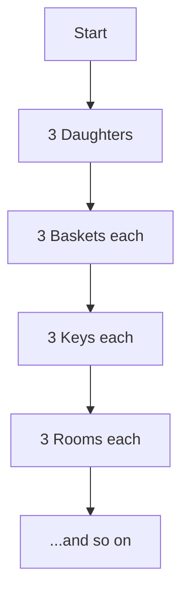

<<<FILE_START: index.mdx>>>
---
title: "Chapter 2: Power Play"
description: "Understanding exponents, laws of powers, scientific notation, and exponential growth."
date: 2024-04-10
tags: ["math", "algebra", "exponents", "grade-8"]
order: 1
draft: false
---

import Callout from '@/components/Callout.astro'

## Introduction: The Power of Folding

Have you ever heard the claim that you cannot fold a piece of paper more than 7 times?
Imagine if you could fold a sheet of paper (0.001 cm thick) as many times as you wanted.

*   **1 Fold:** Thickness doubles to 0.002 cm.
*   **10 Folds:** Thickness becomes $\approx 1$ cm.
*   **26 Folds:** Thickness is taller than the **Burj Khalifa** (830 m)!
*   **46 Folds:** Thickness reaches the **Moon**!

This rapid increase is called **Exponential Growth**. In this chapter, we will learn the mathematical language used to describe such massive numbers: **Exponents**.

## Formula Sheet: Laws of Exponents

For any non-zero integers $a, b$ and integers $m, n$:

| Law Name | Formula | Example |
| :--- | :--- | :--- |
| **Product Law** | $a^m \times a^n = a^{m+n}$ | $2^3 \times 2^4 = 2^{3+4} = 2^7$ |
| **Quotient Law** | $a^m \div a^n = a^{m-n}$ | $5^6 \div 5^2 = 5^{6-2} = 5^4$ |
| **Power of a Power** | $(a^m)^n = a^{m \times n}$ | $(3^2)^4 = 3^{2 \times 4} = 3^8$ |
| **Power of a Product** | $(a \times b)^m = a^m \times b^m$ | $(2 \times 3)^2 = 2^2 \times 3^2$ |
| **Power of a Quotient** | $(\frac{a}{b})^m = \frac{a^m}{b^m}$ | $(\frac{4}{5})^3 = \frac{4^3}{5^3}$ |
| **Zero Exponent** | $a^0 = 1$ | $99^0 = 1$ |
| **Negative Exponent** | $a^{-n} = \frac{1}{a^n}$ | $2^{-3} = \frac{1}{2^3} = \frac{1}{8}$ |

## Topics Covered
1.  **Exponential Notation:** Bases, powers, and expansion.
2.  **Operations:** Multiplying and dividing powers.
3.  **Zero & Negative Exponents:** Understanding patterns on the number line.
4.  **Scientific Notation:** Handling astronomical and microscopic numbers.
5.  **Real World Applications:** From bacteria growth to space distances.
<<<FILE_END>>>

<<<FILE_START: topics/01-exponential-growth.mdx>>>
---
title: "Exponential Growth"
description: "Understanding multiplicative growth through paper folding and patterns."
date: 2024-04-10
tags: ["growth", "patterns", "intro"]
order: 2
draft: false
---

import Callout from '@/components/Callout.astro'

## Linear vs. Exponential Growth

There are two main ways quantities increase:
1.  **Linear Growth (Additive):** Adding a fixed amount each step.
    *   *Example:* Walking up a ladder. Each step adds 20 cm to your height.
    *   Sequence: 20, 40, 60, 80...
2.  **Exponential Growth (Multiplicative):** Multiplying by a fixed amount each step.
    *   *Example:* Cell division or folding paper. Each step **doubles** the previous value.
    *   Sequence: 1, 2, 4, 8, 16...

### The Paper Folding Experiment

Let's look at the thickness of paper (assumed $0.001$ cm) as we fold it.

| Folds ($n$) | Calculation | Thickness ($2^n \times 0.001$) | Comparison |
| :--- | :--- | :--- | :--- |
| 0 | $2^0$ | 0.001 cm | Sheet of paper |
| 10 | $2^{10}$ | $\approx 1.02$ cm | Notebook |
| 17 | $2^{17}$ | $\approx 131$ cm | 4-year-old child |
| 27 | $2^{27}$ | $\approx 1.3$ km | Small Mountain |
| 30 | $2^{30}$ | $\approx 10.7$ km | Cruising altitude of jets |
| 46 | $2^{46}$ | $\approx 70,368,744$ km | Distance to Moon (approx) |

<Callout variant="tip">
**Key Insight:** Linear growth adds up slowly. Exponential growth starts slow but explodes very quickly. This is why just 46 folds can reach the moon!
</Callout>

### Visualizing the Difference

<<<FILE_END>>>

<<<FILE_START: topics/02-laws-of-exponents.mdx>>>
---
title: "Laws of Exponents"
description: "Mastering the rules for multiplying and dividing powers."
date: 2024-04-10
tags: ["algebra", "rules", "math"]
order: 3
draft: false
---

import Callout from '@/components/Callout.astro'

## Basic Notation

An exponential expression looks like this: $a^n$.
*   **$a$** is the **Base** (the number being multiplied).
*   **$n$** is the **Exponent** (how many times to multiply the base).

$$
5^4 = 5 \times 5 \times 5 \times 5 = 625
$$

Read as: "5 raised to the power of 4".

## 1. Multiplying Powers (Same Base)

When you multiply two powers with the same base, you **add** the exponents.

$$
a^m \times a^n = a^{m+n}
$$

**Why?**
$2^3 \times 2^2 = (2 \times 2 \times 2) \times (2 \times 2) = 2^{3+2} = 2^5$.

## 2. Power of a Power

When you take a power to another power, you **multiply** the exponents.

$$
(a^m)^n = a^{m \times n}
$$

**Why?**
$(2^3)^2 = (2^3) \times (2^3) = 2^{3+3} = 2^{3 \times 2} = 2^6$.

## 3. Multiplying Powers (Same Exponent)

When multiplying different bases with the same exponent, you can multiply the bases first.

$$
a^m \times b^m = (a \times b)^m
$$

**Example:**
$2^3 \times 5^3 = (2 \times 5)^3 = 10^3 = 1000$.

## 4. Dividing Powers

When dividing powers with the same base, you **subtract** the exponents.

$$
a^m \div a^n = a^{m-n}
$$

**Why?**
$$
\frac{2^5}{2^2} = \frac{2 \times 2 \times 2 \times 2 \times 2}{2 \times 2} = 2 \times 2 \times 2 = 2^3
$$
<<<FILE_END>>>

<<<FILE_START: topics/03-zero-and-negative-exponents.mdx>>>
---
title: "Zero and Negative Exponents"
description: "Exploring what happens when the exponent is zero or negative."
date: 2024-04-10
tags: ["negative-exponents", "zero", "concept"]
order: 4
draft: false
---

import Callout from '@/components/Callout.astro'

## The Zero Exponent

What is $2^0$?
Using the division law:
$$
2^4 \div 2^4 = 2^{4-4} = 2^0
$$
But any number divided by itself is 1.
$$
\frac{2 \times 2 \times 2 \times 2}{2 \times 2 \times 2 \times 2} = 1
$$
Therefore:
$$
a^0 = 1 \quad (\text{for } a \neq 0)
$$

## Negative Exponents

What happens if we continue dividing?
Start with $2^3 = 8$.
*   Divide by 2 $\rightarrow 2^2 = 4$
*   Divide by 2 $\rightarrow 2^1 = 2$
*   Divide by 2 $\rightarrow 2^0 = 1$
*   Divide by 2 $\rightarrow 2^{-1} = \frac{1}{2}$
*   Divide by 2 $\rightarrow 2^{-2} = \frac{1}{4} = \frac{1}{2^2}$

**General Rule:**
$$
a^{-n} = \frac{1}{a^n}
$$

### Visualizing on a Number Line

We can map powers on a vertical line. Notice how positive powers grow large upwards, while negative powers get closer and closer to zero (but never touch it!).

  <svg width="200" height="400" viewBox="0 0 200 400" xmlns="http://www.w3.org/2000/svg">
    <!-- Vertical Line -->
    <line x1="100" y1="20" x2="100" y2="380" stroke="currentColor" stroke-width="2" />

    <!-- Ticks and Labels -->
    <line x1="90" y1="50" x2="110" y2="50" stroke="currentColor" stroke-width="2" />
    <text x="130" y="55" fill="currentColor">2³ = 8</text>

    <line x1="90" y1="100" x2="110" y2="100" stroke="currentColor" stroke-width="2" />
    <text x="130" y="105" fill="currentColor">2² = 4</text>

    <line x1="90" y1="150" x2="110" y2="150" stroke="currentColor" stroke-width="2" />
    <text x="130" y="155" fill="currentColor">2¹ = 2</text>

    <line x1="90" y1="200" x2="110" y2="200" stroke="currentColor" stroke-width="2" />
    <text x="130" y="205" fill="currentColor">2⁰ = 1</text>

    <line x1="90" y1="250" x2="110" y2="250" stroke="currentColor" stroke-width="2" />
    <text x="130" y="255" fill="currentColor">2⁻¹ = 1/2</text>

    <line x1="90" y1="300" x2="110" y2="300" stroke="currentColor" stroke-width="2" />
    <text x="130" y="305" fill="currentColor">2⁻² = 1/4</text>

    <!-- Arrowhead -->
    <polygon points="100,20 95,30 105,30" fill="currentColor" />
  </svg>

<<<FILE_END>>>

<<<FILE_START: topics/04-scientific-notation.mdx>>>
---
title: "Scientific Notation"
description: "Standard form for writing very large or very small numbers."
date: 2024-04-10
tags: ["standard-form", "science", "notation"]
order: 5
draft: false
---

import Callout from '@/components/Callout.astro'

## Why Scientific Notation?

In science, we deal with massive numbers (like the distance to stars) or tiny numbers (like the size of bacteria). Writing 20 zeroes is prone to error.

**Scientific Notation** (or Standard Form) writes a number as:
$$
k \times 10^n
$$
Where:
*   $1 \le k < 10$ (A number between 1 and 10)
*   $n$ is an integer.

## Examples

### Large Numbers
*   **Distance to Sun:** $149,600,000,000$ m
*   Move decimal left 11 places to get 1.496.
*   **Standard Form:** $1.496 \times 10^{11}$ m.

### Converting to Standard Form
1.  **5900** $\rightarrow$ $5.9 \times 1000 = 5.9 \times 10^3$
2.  **80,00,000** $\rightarrow$ $8.0 \times 1000000 = 8 \times 10^6$

## Comparisons in Space

| Object Pair | Distance (m) | Scientific Notation |
| :--- | :--- | :--- |
| Sun - Earth | $149,600,000,000$ | $1.496 \times 10^{11}$ |
| Sun - Saturn | $1,433,500,000,000$ | $1.4335 \times 10^{12}$ |

To compare, look at the exponent first. $10^{12}$ is 10 times larger than $10^{11}$. So Saturn is roughly 10 times further from the Sun than Earth is.

  <svg width="400" height="100" viewBox="0 0 400 100" xmlns="http://www.w3.org/2000/svg">
    <line x1="20" y1="50" x2="380" y2="50" stroke="currentColor" stroke-width="1" />

    <!-- Sun -->
    <circle cx="20" cy="50" r="15" fill="orange" />
    <text x="20" y="80" text-anchor="middle" font-size="10" fill="currentColor">Sun</text>

    <!-- Earth -->
    <circle cx="80" cy="50" r="5" fill="blue" />
    <text x="80" y="80" text-anchor="middle" font-size="10" fill="currentColor">Earth (10¹¹)</text>

    <!-- Saturn -->
    <circle cx="350" cy="50" r="10" fill="gold" />
    <text x="350" y="80" text-anchor="middle" font-size="10" fill="currentColor">Saturn (10¹²)</text>
  </svg>

<<<FILE_END>>>

<<<FILE_START: solutions/figure-it-out-1.mdx>>>
---
title: "Figure It Out: Page 22"
description: "Solutions to exercises on Exponential Notation."
date: 2024-04-10
tags: ["solutions", "exponents"]
order: 6
draft: false
---

## Exercise Set 1

**1. Express the number 32400 as a product of its prime factors in exponential form.**

**Solution:**
We perform prime factorization of 32400.
$$
\begin{aligned}
32400 &= 324 \times 100 \\
&= 18^2 \times 10^2 \\
&= (2 \times 3^2)^2 \times (2 \times 5)^2 \\
&= (2^2 \times 3^4) \times (2^2 \times 5^2) \\
&= 2^{2+2} \times 3^4 \times 5^2 \\
&= 2^4 \times 3^4 \times 5^2
\end{aligned}
$$

**2. What is $(-1)^5$? Is it positive or negative? What about $(-1)^{56}$?**

**Solution:**
*   $(-1)^5 = (-1) \times (-1) \times (-1) \times (-1) \times (-1) = -1$.
    Since the exponent (5) is **odd**, the result is **negative**.
*   $(-1)^{56}$. The exponent (56) is **even**.
    Therefore, the result is **positive** ($+1$).

**3. Is $(-2)^4 = 16$? Verify.**

**Solution:**
$$(-2)^4 = (-2) \times (-2) \times (-2) \times (-2)$$
$$= 4 \times 4 = 16$$
**Yes**, it is correct.

**4. Express the following in exponential form:**

*   (i) $6 \times 6 \times 6 \times 6 = 6^4$
*   (ii) $y \times y = y^2$
*   (iii) $b \times b \times b \times b = b^4$
*   (iv) $5 \times 5 \times 7 \times 7 \times 7 = 5^2 \times 7^3$
*   (v) $2 \times 2 \times a \times a = 2^2 \times a^2 = (2a)^2$
*   (vi) $a \times a \times a \times c \times c \times c \times c \times d = a^3 c^4 d$
<<<FILE_END>>>

<<<FILE_START: solutions/figure-it-out-2.mdx>>>
---
title: "Figure It Out: Pages 26-27"
description: "Solutions to exercises on simplification, large numbers, and scientific notation."
date: 2024-04-10
tags: ["solutions", "scientific-notation", "simplification"]
order: 7
draft: false
---

## Part 1 (Page 26)

**1. Find out the units digit in the value of $2^{224} \div 4^{32}$.**

**Solution:**
First, simplify the expression to a single base.
We know $4 = 2^2$, so $4^{32} = (2^2)^{32} = 2^{64}$.
Expression: $2^{224} \div 2^{64} = 2^{224-64} = 2^{160}$.

Now, look at the pattern of units digits for powers of 2:
*   $2^1 = 2$
*   $2^2 = 4$
*   $2^3 = 8$
*   $2^4 = 16$ (ends in 6)
*   $2^5 = 32$ (ends in 2 again)

The pattern repeats every 4 powers: 2, 4, 8, 6.
Divide exponent 160 by 4: $160 \div 4 = 40$ (remainder 0).
Remainder 0 corresponds to the 4th position in the cycle, which is **6**.
**Answer:** The units digit is 6.

**2. There are 5 bottles in a container. Every day, a new container is brought in. How many bottles after 40 days?**

**Solution:**
This describes linear growth (adding containers).
*   Day 1: 5 bottles.
*   Day 2: 10 bottles.
*   Day 40: $40 \times 5 = 200$ bottles.

**3. Write the given number as the product of two or more powers in three different ways.**
(i) $64^3$
*   Way 1: $(2^6)^3 = 2^{18}$
*   Way 2: $(4^3)^3 = 4^9$
*   Way 3: $(8^2)^3 = 8^6$

**4. True/False Explanations:**
(i) *Cube numbers are also square numbers.* **Sometimes True** (e.g., $64 = 4^3 = 8^2$).
(ii) *Fourth powers are also square numbers.* **Always True**. $x^4 = (x^2)^2$.
(v) *$q^{46}$ is both a 4th power and a 6th power.* **False**. 46 is not divisible by 4 or 6.

**5. Simplify:**
(i) $10^{-2} \times 10^{-5} = 10^{-7}$
(ii) $5^7 \div 5^4 = 5^3$
(iv) $(13^{-2})^{-3} = 13^{(-2 \times -3)} = 13^6$

**6. If $12^2 = 144$ what is $(1.2)^2$?**
**Solution:**
$(1.2)^2 = (\frac{12}{10})^2 = \frac{144}{100} = 1.44$.
Similarly, $(0.12)^2 = 0.0144$.

## Part 2 (Page 27)

**7. Circle numbers that are the same.**
*   $2^4 \times 3^6 = 16 \times 729$
*   $6^4 \times 3^2 = (2 \times 3)^4 \times 3^2 = 2^4 \times 3^4 \times 3^2 = 2^4 \times 3^6$. (Same as first).
*   $18^2 \times 6^2 = (18 \times 6)^2 = 108^2$.
    Also $18^2 \times 6^2 = (2 \times 3^2)^2 \times (2 \times 3)^2 = 2^2 \times 3^4 \times 2^2 \times 3^2 = 2^4 \times 3^6$. (Same).
**Answer:** $2^4 \times 3^6$, $6^4 \times 3^2$, and $18^2 \times 6^2$ are all equal.

**9. A dairy plans to produce 8.5 billion packets. How many digits for a unique ID?**
**Solution:**
8.5 billion = $8.5 \times 10^9 = 8,500,000,000$.
This is a 10-digit number.
To cover all these items with a unique ID, we need at least **10 digits** (since $10^{10} = 10 \text{ billion}$).

**13. Scientific Notation Calculations:**
(iii) **Bacterial cells:** 38 trillion = $38 \times 10^{12} = 3.8 \times 10^{13}$.
Population of world $\approx 8 \text{ billion} = 8 \times 10^9$.
Total bacteria = $(3.8 \times 10^{13}) \times (8 \times 10^9) = 30.4 \times 10^{22} = 3.04 \times 10^{23}$.
<<<FILE_END>>>

<<<FILE_START: practice/solved-examples.mdx>>>
---
title: "Solved Examples"
description: "Extra examples derived from the chapter activities."
date: 2024-04-10
tags: ["examples", "word-problems"]
order: 8
draft: false
---

import Callout from '@/components/Callout.astro'

## Example 1: The Stones that Shine (Page 23)

**Problem:**
3 daughters receive 3 baskets each.
Each basket has 3 keys.
Each key opens 3 rooms.
Each room has 3 tables.
Each table has 3 necklaces.
Each necklace has 3 diamonds.
How many diamonds are there?

**Solution:**
This is a classic powers of 3 problem.
*   Daughters: 3 ($3^1$)
*   Baskets: $3 \times 3 = 9$ ($3^2$)
*   Keys: $9 \times 3 = 27$ ($3^3$)
*   Rooms: $27 \times 3 = 81$ ($3^4$)
*   Tables: $81 \times 3 = 243$ ($3^5$)
*   Necklaces: $243 \times 3 = 729$ ($3^6$)
*   Diamonds: $729 \times 3 = 2187$ ($3^7$)

**Answer:** There are $3^7 = 2187$ diamonds.

## Example 2: The Magical Pond (Page 25)

**Problem:**
A lotus doubles every day. The pond is full on Day 30.
On which day was it half full?

**Solution:**
Since the lotus population **doubles** every day, going backwards means **halving** every day.
*   Day 30: Full (100%)
*   Day 29: Half Full (50%)
*   Day 28: Quarter Full (25%)

**Answer:** Day 29.

## Example 3: Password Combinations (Page 26)

**Problem:**
A safe has a 5-digit password (digits 0-9). How many combinations?

**Solution:**
*   Digit 1: 10 options (0-9)
*   Digit 2: 10 options
*   Digit 3: 10 options
*   Digit 4: 10 options
*   Digit 5: 10 options

Total combinations = $10 \times 10 \times 10 \times 10 \times 10 = 10^5 = 1,00,000$.

## Example 4: Comparing Large Numbers (Page 29)

**Problem:**
Which is larger: $10000000000000$ or $999999 \times 999999$?

**Solution:**
1.  Roxie's number: $10,000,000,000,000 = 10^{13}$.
2.  Estu's number: $999,999 \approx 10^6$.
    So $(10^6) \times (10^6) = 10^{12}$.
    Even precisely: $(10^6 - 1) \times (10^6 - 1) \approx 10^{12}$.

Since $10^{13} > 10^{12}$, **Roxie's number is larger.**
<<<FILE_END>>>
