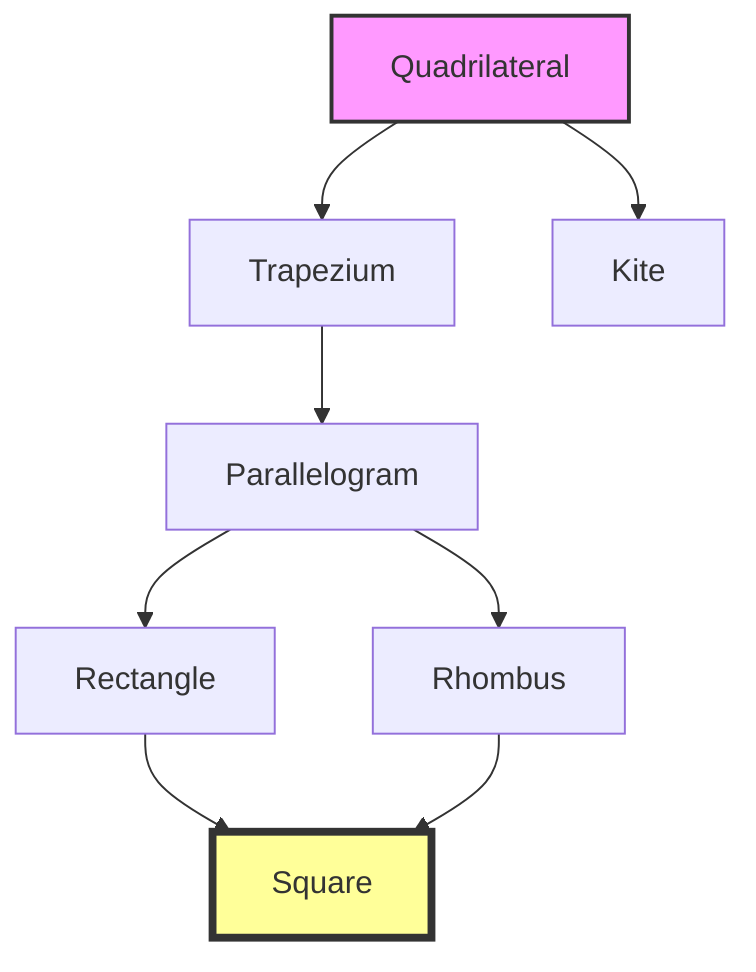

<<<FILE_START: index.mdx>>>
---
title: "Chapter 4: Quadrilaterals"
description: "Introduction to four-sided figures, their types, properties, and relationships."
date: 2024-04-10
tags: ["math", "geometry", "quadrilaterals", "grade-8"]
order: 1
draft: false
---

import Callout from '@/components/Callout.astro'

## Introduction

In this chapter, we explore **Quadrilaterals**, which are four-sided closed figures. The word comes from Latin: *quadri* (four) and *latus* (sides). We will study specific types like rectangles, squares, parallelograms, rhombuses, kites, and trapeziums, deducing their properties through geometric reasoning.

### Key Concept: Angle Sum Property
The sum of the angles of a quadrilateral is always **$360^\circ$**.

$$
\angle A + \angle B + \angle C + \angle D = 360^\circ
$$

This is because any quadrilateral can be divided into two triangles by drawing a diagonal. Since the sum of angles in a triangle is $180^\circ$, for two triangles it is $180^\circ \times 2 = 360^\circ$.

## Formula Sheet: Properties Summary

| Quadrilateral | Sides | Angles | Diagonals |
| :--- | :--- | :--- | :--- |
| **Parallelogram** | Opposite sides equal & parallel | Opposite angles equal; Adjacent sum to $180^\circ$ | Bisect each other |
| **Rectangle** | Opposite sides equal & parallel | All angles $90^\circ$ | Equal length; Bisect each other |
| **Rhombus** | All sides equal; Opposite parallel | Opposite angles equal | Bisect each other at **$90^\circ$** |
| **Square** | All sides equal; Opposite parallel | All angles $90^\circ$ | Equal length; Bisect at **$90^\circ$** |
| **Trapezium** | One pair of opposite sides parallel | - | - |
| **Kite** | Adjacent pairs of sides equal | - | One diagonal bisects the other at $90^\circ$ |

## Hierarchy of Quadrilaterals

Understanding how these shapes relate to each other is crucial. A square is a special rectangle, and a rectangle is a special parallelogram.

## Topics Covered
1.  **Rectangles and Squares:** Defining them via diagonals and angles.
2.  **Parallelograms:** Deducting properties of sides and angles.
3.  **Rhombus:** The equilateral quadrilateral.
4.  **Kite and Trapezium:** Special cases of symmetry and parallel lines.
5.  **Deductive Reasoning:** Using congruence to prove geometric properties.
<<<FILE_END>>>

<<<FILE_START: topics/01-rectangles-squares.mdx>>>
---
title: "Rectangles and Squares"
description: "Defining properties of rectangles and squares using diagonals and congruence."
date: 2024-04-10
tags: ["rectangle", "square", "properties"]
order: 2
draft: false
---

import Callout from '@/components/Callout.astro'

## The Rectangle

A **Rectangle** is a quadrilateral in which:
1.  The angles are all right angles ($90^\circ$).
2.  The opposite sides are of equal length and parallel.

### Diagonal Properties
A defining characteristic of a rectangle is found in its diagonals. By using the SAS (Side-Angle-Side) congruence condition on the triangles formed by the diagonals, we can deduce:

1.  **Lengths are Equal:** The diagonals of a rectangle are of equal length ($AC = BD$).
2.  **Bisect Each Other:** The diagonals intersect at their midpoints ($OA = OC$ and $OB = OD$).

  <svg width="300" height="200" viewBox="0 0 300 200" xmlns="http://www.w3.org/2000/svg">
    <!-- Rectangle ABCD -->
    <rect x="50" y="50" width="200" height="100" fill="none" stroke="currentColor" stroke-width="2" />

    <!-- Diagonals -->
    <line x1="50" y1="50" x2="250" y2="150" stroke="currentColor" stroke-width="1.5" />
    <line x1="250" y1="50" x2="50" y2="150" stroke="currentColor" stroke-width="1.5" />

    <!-- Labels -->
    <text x="40" y="45" fill="currentColor">A</text>
    <text x="260" y="45" fill="currentColor">B</text>
    <text x="260" y="165" fill="currentColor">C</text>
    <text x="40" y="165" fill="currentColor">D</text>
    <text x="150" y="115" fill="currentColor">O</text>

    <!-- Right Angle markers -->
    <path d="M 50 140 L 60 140 L 60 150" fill="none" stroke="currentColor" />
    <path d="M 240 150 L 240 140 L 250 140" fill="none" stroke="currentColor" />
    <path d="M 250 60 L 240 60 L 240 50" fill="none" stroke="currentColor" />
    <path d="M 60 50 L 60 60 L 50 60" fill="none" stroke="currentColor" />
  </svg>

## The Square

A **Square** is a special type of rectangle.
*   **Definition:** A quadrilateral in which all angles are $90^\circ$ and all sides are of equal length.
*   **Venn Relationship:** Every square is a rectangle, but not every rectangle is a square.

### Diagonal Properties of a Square
Since a square is a rectangle, its diagonals are equal and bisect each other. However, it has extra properties:
1.  **Perpendicular Intersection:** The diagonals intersect at $90^\circ$.
2.  **Angle Bisectors:** The diagonals bisect the angles of the square (each part is $45^\circ$).

<Callout variant="tip">
**Geometric Proof:** In a square, the triangles formed by the diagonals (e.g., $\Delta AOB$) are isosceles right-angled triangles.
</Callout>

  <svg width="200" height="200" viewBox="0 0 200 200" xmlns="http://www.w3.org/2000/svg">
    <!-- Square -->
    <rect x="50" y="50" width="100" height="100" fill="none" stroke="currentColor" stroke-width="2" />

    <!-- Diagonals -->
    <line x1="50" y1="50" x2="150" y2="150" stroke="currentColor" stroke-width="1.5" />
    <line x1="150" y1="50" x2="50" y2="150" stroke="currentColor" stroke-width="1.5" />

    <!-- Perpendicular Marker at center -->
    <path d="M 95 100 L 100 95 L 105 100 L 100 105 Z" fill="currentColor" />

    <!-- Labels -->
    <text x="40" y="45" fill="currentColor">A</text>
    <text x="160" y="45" fill="currentColor">B</text>
    <text x="160" y="165" fill="currentColor">C</text>
    <text x="40" y="165" fill="currentColor">D</text>

    <!-- 45 degree angles -->
    <text x="70" y="65" font-size="10" fill="currentColor">45°</text>
    <text x="70" y="145" font-size="10" fill="currentColor">45°</text>
  </svg>

<<<FILE_END>>>

<<<FILE_START: topics/02-parallelograms.mdx>>>
---
title: "Parallelograms"
description: "Understanding quadrilaterals with parallel opposite sides."
date: 2024-04-10
tags: ["parallelogram", "geometry"]
order: 3
draft: false
---

## Definition
A **Parallelogram** is a quadrilateral in which both pairs of opposite sides are parallel.
*   $AB \parallel DC$
*   $AD \parallel BC$

Rectangles and squares are special types of parallelograms.

  <svg width="300" height="150" viewBox="0 0 300 150" xmlns="http://www.w3.org/2000/svg">
    <!-- Parallelogram -->
    <polygon points="50,120 200,120 250,30 100,30" fill="none" stroke="currentColor" stroke-width="2" />

    <!-- Diagonals -->
    <line x1="50" y1="120" x2="250" y2="30" stroke="currentColor" stroke-width="1" stroke-dasharray="4" />
    <line x1="100" y1="30" x2="200" y2="120" stroke="currentColor" stroke-width="1" stroke-dasharray="4" />

    <!-- Labels -->
    <text x="40" y="130" fill="currentColor">A</text>
    <text x="210" y="130" fill="currentColor">B</text>
    <text x="260" y="30" fill="currentColor">C</text>
    <text x="90" y="30" fill="currentColor">D</text>

    <!-- Parallel markers -->
    <path d="M 125 120 L 130 115 L 135 120" fill="none" stroke="currentColor" />
    <path d="M 175 30 L 180 25 L 185 30" fill="none" stroke="currentColor" />

    <path d="M 65 80 L 70 70 L 75 80" fill="none" stroke="currentColor" />
    <path d="M 70 80 L 75 70 L 80 80" fill="none" stroke="currentColor" />

    <path d="M 215 80 L 220 70 L 225 80" fill="none" stroke="currentColor" />
    <path d="M 220 80 L 225 70 L 230 80" fill="none" stroke="currentColor" />
  </svg>

## Properties

### 1. Angles
*   **Opposite angles are equal:** $\angle A = \angle C$ and $\angle B = \angle D$.
*   **Adjacent angles sum to $180^\circ$:** Since opposite sides are parallel, consecutive angles are interior angles on the same side of the transversal.
    $$ \angle A + \angle B = 180^\circ $$

### 2. Sides
*   **Opposite sides are equal:** $AB = DC$ and $AD = BC$.
    *   *Proof:* Draw a diagonal. It forms two congruent triangles (ASA criterion using alternate interior angles).

### 3. Diagonals
*   **Bisect each other:** The diagonals intersect at their midpoints. Note that unlike rectangles, the diagonals of a general parallelogram are **not** equal in length.
<<<FILE_END>>>

<<<FILE_START: topics/03-rhombus.mdx>>>
---
title: "The Rhombus"
description: "Properties of the equilateral quadrilateral."
date: 2024-04-10
tags: ["rhombus", "quadrilaterals"]
order: 4
draft: false
---

import Callout from '@/components/Callout.astro'

## Definition
A **Rhombus** is a quadrilateral in which **all sides have the same length**.
Since opposite sides are equal, a rhombus is also a **parallelogram**. Therefore, it inherits all properties of a parallelogram.

## Special Properties

### 1. Perpendicular Diagonals
The most distinctive property of a rhombus is that its diagonals intersect at **right angles ($90^\circ$)**.

$$
AC \perp BD
$$

### 2. Angle Bisectors
The diagonals of a rhombus bisect the vertex angles. For example, diagonal $AC$ cuts $\angle A$ and $\angle C$ exactly in half.

  <svg width="200" height="200" viewBox="0 0 200 200" xmlns="http://www.w3.org/2000/svg">
    <!-- Rhombus Points: Top(100,20), Right(180,100), Bottom(100,180), Left(20,100) -->
    <polygon points="100,20 180,100 100,180 20,100" fill="none" stroke="currentColor" stroke-width="2" />

    <!-- Diagonals -->
    <line x1="100" y1="20" x2="100" y2="180" stroke="currentColor" stroke-width="1.5" />
    <line x1="20" y1="100" x2="180" y2="100" stroke="currentColor" stroke-width="1.5" />

    <!-- Right Angle Symbol -->
    <rect x="100" y="100" width="10" height="10" fill="currentColor" opacity="0.3" />

    <!-- Labels -->
    <text x="100" y="15" text-anchor="middle" fill="currentColor">A</text>
    <text x="190" y="105" text-anchor="middle" fill="currentColor">B</text>
    <text x="100" y="195" text-anchor="middle" fill="currentColor">C</text>
    <text x="10" y="105" text-anchor="middle" fill="currentColor">D</text>

    <!-- Equal side marks -->
    <line x1="60" y1="60" x2="65" y2="65" stroke="currentColor" stroke-width="2" />
    <line x1="135" y1="60" x2="140" y2="65" stroke="currentColor" stroke-width="2" />
    <line x1="135" y1="140" x2="140" y2="135" stroke="currentColor" stroke-width="2" />
    <line x1="60" y1="140" x2="65" y2="135" stroke="currentColor" stroke-width="2" />
  </svg>

<Callout variant="info">
**Relationship:** A Square is a Rhombus where all angles are $90^\circ$.
</Callout>
<<<FILE_END>>>

<<<FILE_START: topics/04-trapezium-kite.mdx>>>
---
title: "Trapezium and Kite"
description: "Exploring quadrilaterals with specific symmetry or parallel conditions."
date: 2024-04-10
tags: ["trapezium", "kite", "geometry"]
order: 5
draft: false
---

## Trapezium
A **Trapezium** is a quadrilateral with **at least one pair of parallel opposite sides**.

*   **Isosceles Trapezium:** A trapezium where the non-parallel sides are of equal length. In an isosceles trapezium:
    *   Angles on the same base are equal.
    *   Diagonals are of equal length.

  <svg width="300" height="120" viewBox="0 0 300 120" xmlns="http://www.w3.org/2000/svg">
    <!-- Trapezium -->
    <polygon points="80,30 220,30 260,100 40,100" fill="none" stroke="currentColor" stroke-width="2" />

    <!-- Parallel Arrows -->
    <path d="M 150 30 L 145 25 M 150 30 L 145 35" stroke="currentColor" fill="none" />
    <path d="M 150 100 L 145 95 M 150 100 L 145 105" stroke="currentColor" fill="none" />

    <text x="30" y="110" fill="currentColor">A</text>
    <text x="270" y="110" fill="currentColor">B</text>
    <text x="230" y="25" fill="currentColor">C</text>
    <text x="70" y="25" fill="currentColor">D</text>
  </svg>

## Kite
A **Kite** is a quadrilateral with two distinct pairs of equal-length adjacent sides.
*   $AB = BC$
*   $CD = DA$

### Properties
1.  **Perpendicular Diagonals:** The diagonals intersect at $90^\circ$.
2.  **One Bisector:** One diagonal (the main axis) bisects the other diagonal.
3.  **Angles:** One pair of opposite angles are equal (the ones between the unequal sides).

  <svg width="200" height="250" viewBox="0 0 200 250" xmlns="http://www.w3.org/2000/svg">
    <!-- Kite Points -->
    <polygon points="100,20 160,100 100,230 40,100" fill="none" stroke="currentColor" stroke-width="2" />

    <!-- Diagonals -->
    <line x1="100" y1="20" x2="100" y2="230" stroke="currentColor" stroke-width="1" stroke-dasharray="4" />
    <line x1="40" y1="100" x2="160" y2="100" stroke="currentColor" stroke-width="1" stroke-dasharray="4" />

    <!-- Labels -->
    <text x="100" y="15" text-anchor="middle" fill="currentColor">A</text>
    <text x="170" y="100" fill="currentColor">B</text>
    <text x="100" y="245" text-anchor="middle" fill="currentColor">C</text>
    <text x="30" y="100" fill="currentColor">D</text>

    <!-- Side marks -->
    <line x1="65" y1="60" x2="75" y2="60" stroke="currentColor" />
    <line x1="125" y1="60" x2="135" y2="60" stroke="currentColor" />

    <line x1="65" y1="160" x2="75" y2="160" stroke="currentColor" />
    <line x1="65" y1="165" x2="75" y2="165" stroke="currentColor" />
    <line x1="125" y1="160" x2="135" y2="160" stroke="currentColor" />
    <line x1="125" y1="165" x2="135" y2="165" stroke="currentColor" />
  </svg>

<<<FILE_END>>>

<<<FILE_START: solutions/figure-it-out-1.mdx>>>
---
title: "Figure It Out: Rectangles"
description: "Solutions to problems involving rectangle properties and diagonals."
date: 2024-04-10
tags: ["solutions", "rectangles"]
order: 6
draft: false
---

## Carpenter's Problem (Page 83)

**Question:** A carpenter has one 8 cm strip. To make a rectangular frame, what should be the length of the other strip and where should they join?

**Solution:**
1.  **Length:** The strips act as diagonals. In a rectangle, diagonals are of equal length.
    *   Length of 2nd strip = **8 cm**.
2.  **Intersection:** Diagonals of a rectangle bisect each other.
    *   They should be joined at the **midpoint** of both strips (4 cm from the ends).

## Angles Between Diagonals (Page 85)

**Question:** If the angle between the diagonals is $60^\circ$ and the diagonals are equal and bisect each other, find the other angles.

**Solution:**
Let the diagonals intersect at $O$. Given $\angle AOB = 60^\circ$.
Since diagonals bisect and are equal, $\Delta AOB$ is an isosceles triangle ($OA = OB$).
1.  Base angles of $\Delta AOB$: $\frac{180^\circ - 60^\circ}{2} = 60^\circ$.
2.  So $\Delta AOB$ is equilateral.
3.  Similarly, vertically opposite $\Delta DOC$ is equilateral.
4.  Adjacent angle $\angle AOD = 180^\circ - 60^\circ = 120^\circ$.
5.  Base angles of $\Delta AOD$: $\frac{180^\circ - 120^\circ}{2} = 30^\circ$.
6.  Corner Angle $A = 60^\circ + 30^\circ = 90^\circ$.
    *   This confirms the figure is a **Rectangle**.

## Figure It Out (Page 90)

**Question 1:** Are there non-rectangles in the given figures?
*   Figures (i), (ii), (iii) are standard rectangles.
*   Figure (iv) is a **Square** ($4 \text{ cm} \times 4 \text{ cm}$).
*   **Answer:** All are rectangles. A square is a special type of rectangle.
<<<FILE_END>>>

<<<FILE_START: solutions/figure-it-out-2.mdx>>>
---
title: "Figure It Out: Squares"
description: "Solutions regarding square properties and constructions."
date: 2024-04-10
tags: ["solutions", "squares"]
order: 7
draft: false
---

## Angles in a Square (Page 93)

**Question:** What are the measures of $\angle 1, \angle 2, \angle 3, \angle 4$ formed by the diagonal?

**Solution:**
In a square, the angle at the vertex is $90^\circ$.
The sides are equal ($AD = DC$), so the triangle formed by the diagonal ($\Delta ADC$) is an isosceles right-angled triangle.
*   $\angle 1 = \angle 3$.
*   $\angle 1 + \angle 3 + 90^\circ = 180^\circ$.
*   $2(\angle 1) = 90^\circ \Rightarrow \angle 1 = 45^\circ$.
*   **Answer:** All such angles ($\angle 1, \angle 2, \angle 3, \angle 4$) are **$45^\circ$**.

## Figure It Out (Page 94)

**Question 1:** Find all other angles inside the rectangles.
*   **(i)** Diagonals intersect at $30^\circ$ (vertical).
    *   Side angle = $(180 - 30)/2 = 75^\circ$.
    *   Complementary angle = $90 - 75 = 15^\circ$.
*   **(ii)** Diagonals intersect at $110^\circ$.
    *   Vertical opposite = $110^\circ$. Adjacent linear pair = $70^\circ$.
    *   Base angles for $110^\circ$ triangle = $(180-110)/2 = 35^\circ$.
    *   Base angles for $70^\circ$ triangle = $(180-70)/2 = 55^\circ$.

**Question 3: Circle Diameters**
*   **Problem:** $PL$ and $AM$ are perpendicular diameters. What is $APML$?
*   **Reasoning:**
    *   Diameters are equal ($PL = AM$).
    *   They bisect each other (at center $O$).
    *   They are perpendicular ($90^\circ$).
*   **Conclusion:** A quadrilateral with equal, bisecting, perpendicular diagonals is a **Square**.
<<<FILE_END>>>

<<<FILE_START: solutions/figure-it-out-3.mdx>>>
---
title: "Figure It Out: Parallelograms"
description: "Solving for angles and sides in parallelograms and rhombuses."
date: 2024-04-10
tags: ["solutions", "parallelogram", "rhombus"]
order: 8
draft: false
---

## Page 96: Parallelogram Angles

**Question:** If one angle is $30^\circ$, find the others.
**Solution:**
*   Adjacent angles sum to $180^\circ$. $\angle B = 180^\circ - 30^\circ = 150^\circ$.
*   Opposite angles are equal. $\angle C = 30^\circ$, $\angle D = 150^\circ$.

## Page 102: Figure It Out

**1. Find remaining angles:**
*   **(i) Parallelogram:** Given $40^\circ$.
    *   Opposite = $40^\circ$.
    *   Adjacent = $180^\circ - 40^\circ = 140^\circ$.
*   **(ii) Parallelogram:** Given $110^\circ$.
    *   Opposite = $110^\circ$.
    *   Adjacent = $70^\circ$.
*   **(iii) Rhombus:** Given $30^\circ$ (half angle by diagonal?).
    *   If diagonal makes $30^\circ$ with side, whole angle = $60^\circ$.
    *   Adjacent angle = $180^\circ - 60^\circ = 120^\circ$.
*   **(iv) Rhombus:** Given $20^\circ$ triangle base angle.
    *   Diagonals intersect at $90^\circ$.
    *   Third angle in small triangle = $180 - (90+20) = 70^\circ$.
    *   Vertex Angles: $40^\circ$ ($2 \times 20$) and $140^\circ$ ($2 \times 70$).

## Page 107: Trapeziums

**Question 3:** Find remaining angles.
*   **Left Figure:** Angles between parallel lines sum to $180^\circ$.
    *   $135^\circ$ pair: $180 - 135 = 45^\circ$.
    *   $105^\circ$ pair: $180 - 105 = 75^\circ$.
*   **Right Figure:** $100^\circ$ pair $\rightarrow 80^\circ$.

**Question 5:** Two rectangles PAIR and RODS. Find $\angle IOD$.
*   Properties: Diagonals of rectangle bisect and are equal.
*   In rectangle RODS, diagonals intersect at O. $\Delta ROD$ isosceles logic applies.
*   Need specific diagram values to solve fully, but generally involves subtracting angles from $90^\circ$ or using isosceles triangle properties at the intersection.
<<<FILE_END>>>

<<<FILE_START: solutions/figure-it-out-4.mdx>>>
---
title: "Figure It Out: General Questions"
description: "True/False statements and general quadrilateral reasoning."
date: 2024-04-10
tags: ["solutions", "reasoning"]
order: 9
draft: false
---

## Page 108: Question 11 (True/False)

**(i) A quadrilateral whose diagonals are equal and bisect each other must be a square.**
*   **False.** It is a **Rectangle**. For a square, they must also be perpendicular.

**(ii) A quadrilateral having three right angles must be a rectangle.**
*   **True.** Sum = $360$. Fourth angle = $360 - 270 = 90$. All angles 90 = Rectangle.

**(iii) A quadrilateral whose diagonals bisect each other must be a parallelogram.**
*   **True.** This is a defining property.

**(iv) A quadrilateral whose diagonals are perpendicular to each other must be a rhombus.**
*   **False.** This is true for a Kite as well. For a rhombus, they must also *bisect* each other.

**(v) A quadrilateral in which opposite angles are equal must be a parallelogram.**
*   **True.**

**(vi) A quadrilateral in which all angles are equal is a rectangle.**
*   **True.** $360/4 = 90^\circ$.

**(vii) Isosceles trapeziums are parallelograms.**
*   **False.** Only one pair of sides is parallel.
<<<FILE_END>>>

<<<FILE_START: practice/puzzle.mdx>>>
---
title: "Practice: Which Quad?"
description: "Paper folding puzzles to identify quadrilateral shapes."
date: 2024-04-10
tags: ["activity", "paper-folding"]
order: 10
draft: false
---

import Callout from '@/components/Callout.astro'

## The Puzzle (Page 111)

**Instructions:**
1.  Fold a sheet into half.
2.  Fold it once more into a quarter.
3.  Make a triangular crease at the corner that is at the middle of the paper.
4.  Open the sheet.

**Analysis:**
*   The "middle of the paper" corresponds to the center of the unfolded sheet.
*   Folding into quarters creates 4 layers.
*   A single straight crease across the corner of the folded quarter cuts through all 4 layers symmetrically.
*   When unfolded, this single line segment is reflected across the horizontal and vertical axes.

**Result:**
The shape formed is a **Rhombus**.
*   The diagonals of the unfolded shape lie along the fold lines.
*   Since the paper was folded perpendicular to the sides, the diagonals bisect each other at $90^\circ$.
*   Since the cut was straight, the resulting sides connecting the axes are straight lines forming a rhombus.

**Variations:**
*   **To get a Square:** You must fold the quarter such that the crease makes a $45^\circ$ angle with the fold edge (making an isosceles triangle at the corner). This ensures the diagonals are equal in length.
*   **To get a Kite:** Fold differently so adjacent sides are equal but the shape lacks the full symmetry of a rhombus.

<Callout variant="success">
**Try it yourself:** Grab a piece of paper now and verify these properties!
</Callout>
<<<FILE_END>>>
