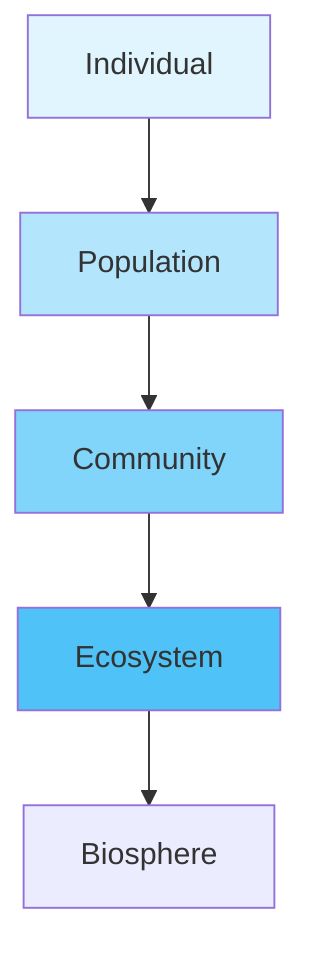
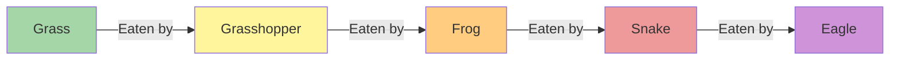
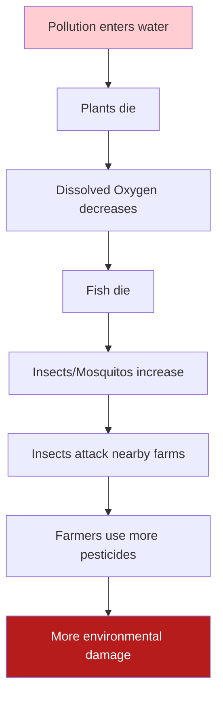

<<<FILE_START: index.mdx>>>
---
title: "How Nature Works in Harmony"
description: "Explore the intricate web of life, ecosystems, food chains, and the delicate balance of nature."
date: 2024-04-10
tags: ["ecology", "ecosystems", "biology", "grade-8"]
order: 1
draft: false
---

import Callout from '@/components/Callout.astro'

# How Nature Works in Harmony

Have you ever wondered why elephants enter farms, or why a pond needs both fish and plants to stay healthy? In this chapter, we explore the fascinating connections between living beings and their surroundings. We will learn that nothing in nature exists in isolation; everything is connected in a delicate web of life.

## Key Concepts

1.  **Components of Nature**: Understanding Biotic (living) and Abiotic (non-living) factors.
2.  **Levels of Organization**: From Individuals to Populations, Communities, and Ecosystems.
3.  **Energy Flow**: Who eats whom? Exploring Food Chains, Food Webs, and Trophic Levels.
4.  **Interactions**: How organisms help, harm, or compete with each other (Symbiosis).
5.  **Human Impact**: How our actions affect the balance of nature.

## Glossary

| Term | Definition |
| :--- | :--- |
| **Habitat** | The specific place where an organism lives (e.g., a pond, a tree bark). |
| **Ecosystem** | A system formed by the interaction of biotic and abiotic components in an area. |
| **Population** | A group of organisms of the *same species* living in a specific area at a specific time. |
| **Community** | Different populations (plants, animals, microbes) living together in a habitat. |
| **Producers** | Organisms that make their own food (e.g., plants via photosynthesis). |
| **Consumers** | Organisms that eat others for food (Herbivores, Carnivores, Omnivores). |
| **Decomposers** | Organisms like fungi and bacteria that break down dead matter. |

<Callout variant="tip">
**Scientific Heritage: A.J.T. Johnsingh**
A famous Indian wildlife biologist who pioneered modern tracking systems to study predators like tigers and leopards. His work highlighted how healthy prey populations (like deer) are essential for the survival of predators.
</Callout>

Start your journey into the wild by exploring the topics below!
<<<FILE_END>>>

<<<FILE_START: topics/01-ecosystem-components.mdx>>>
---
title: "Components of an Ecosystem"
description: "Understanding Biotic and Abiotic components, Populations, and Communities."
date: 2024-04-10
tags: ["biotic", "abiotic", "population", "community"]
order: 2
draft: false
---

import Callout from '@/components/Callout.astro'

## Interpreting Our Surroundings

Every organism needs a specific place to live, called a **Habitat**. Within a habitat, there are two main types of components that interact with each other:

1.  **Biotic Components**: The living things. (Plants, animals, fungi, bacteria).
2.  **Abiotic Components**: The non-living things. (Air, water, soil, sunlight, temperature).

### Activity: Pond vs. Forest
If you compare a pond and a forest, you will see they have different components but follow the same rules of interaction.

| Feature | Pond Habitat | Forest Habitat |
| :--- | :--- | :--- |
| **Biotic** | Fish, Frogs, Lotus, Algae, Ducks | Tigers, Deer, Trees, Birds, Insects |
| **Abiotic** | Water, Dissolved Oxygen, Mud | Soil, Wind, Sunlight, Rocks |

## Levels of Organization

Nature is organized in a hierarchy. It starts small and gets bigger.

1.  **Individual**: A single organism (e.g., one frog).
2.  **Population**: A group of the *same* organisms living in the same place at the same time (e.g., all the frogs in the pond).
3.  **Community**: Different populations living together (e.g., frogs + fish + lotus plants).
4.  **Ecosystem**: The community interacting with the abiotic factors (living + non-living).

<Callout variant="info">
**Did you know?**
A habitat can be as large as a forest or as small as the space under a rotting log. The key is that it provides the right conditions for life to survive.
</Callout>

### Types of Ecosystems
*   **Terrestrial**: Forests, Grasslands, Deserts.
*   **Aquatic**: Ponds, Rivers, Oceans.
*   **Human-made**: Aquariums, Crop fields, Gardens.
<<<FILE_END>>>

<<<FILE_START: topics/02-interactions.mdx>>>
---
title: "Interactions in Nature"
description: "How organisms interact: Predation, Competition, and Symbiosis."
date: 2024-04-10
tags: ["interactions", "symbiosis", "mutualism", "parasitism"]
order: 3
draft: false
---

import Callout from '@/components/Callout.astro'

## Relationships Between Organisms

In an ecosystem, no organism lives alone. They interact in various ways to survive, find food, or reproduce.

### 1. Feeding Relationships
The most basic interaction is "Who eats whom?"
*   **Predation**: One organism (Predator) hunts and eats another (Prey). Example: Tiger eats Deer.

### 2. Competition
When resources like food, water, or space are limited, organisms fight for them.
*   **Intraspecific Competition**: Between members of the same species (two deer fighting for grass).
*   **Interspecific Competition**: Between different species (lions and hyenas fighting for the same kill).
*   **Balance**: Competition controls population size and prevents any single species from taking over.

### 3. Symbiosis (Living Together)
Some interactions involve close, long-term relationships between different species.

| Type | Definition | Effect on Species A | Effect on Species B | Example |
| :--- | :--- | :--- | :--- | :--- |
| **Mutualism** | Both benefit. | Happy (+)| Happy (+) | **Honeybees & Flowers** (Bees get nectar, Flowers get pollinated). |
| **Commensalism** | One benefits, the other is unaffected. | Happy (+) | Neutral (0) | **Orchids on Trees** (Orchids get sunlight/support, Tree is unharmed). |
| **Parasitism** | One benefits, the other is harmed. | Happy (+) | Sad (-) | **Ticks on Dogs** (Ticks suck blood, Dog gets irritation/disease). |

<Callout variant="warning">
**The Case of the Pond (Activity 12.3)**
Scientists found that ponds **with fish** had more seeds produced by nearby plants than ponds **without fish**. Why?
1.  Fish eat dragonfly larvae.
2.  Fewer dragonflies mean fewer predators for bees and butterflies.
3.  More bees/butterflies survive to **pollinate** the nearby flowers.
4.  More pollination = More seeds.
*This shows how connected nature is!*
</Callout>
<<<FILE_END>>>

<<<FILE_START: topics/03-food-chains-webs.mdx>>>
---
title: "Food Chains and Webs"
description: "Tracing the flow of energy through producers, consumers, and trophic levels."
date: 2024-04-10
tags: ["food-chain", "food-web", "energy", "trophic-levels"]
order: 4
draft: false
---

import Callout from '@/components/Callout.astro'

## Who Eats Whom?

### The Food Chain
A food chain is a simple, linear sequence showing the transfer of energy from one organism to another.

**Example of a Grassland Food Chain:**

### Trophic Levels
Each step in a food chain is called a **Trophic Level** (*troph* = food).

1.  **Level 1: Producers (Autotrophs)** - Green plants that make food using sunlight.
2.  **Level 2: Primary Consumers (Herbivores)** - Animals that eat plants (e.g., Deer, Grasshopper).
3.  **Level 3: Secondary Consumers (Small Carnivores)** - Animals that eat herbivores (e.g., Frog, Fox).
4.  **Level 4: Tertiary Consumers (Top Carnivores)** - Animals that eat other carnivores (e.g., Tiger, Eagle).

  <svg width="400" height="300" viewBox="0 0 400 300" fill="none" stroke="currentColor" stroke-width="2">
    <!-- Pyramid Structure -->
    <path d="M200 20 L350 280 L50 280 Z" stroke="currentColor" fill="none" />

    <!-- Levels -->
    <line x1="170" y1="80" x2="230" y2="80" stroke="currentColor" /> <!-- Top Tip -->
    <line x1="140" y1="140" x2="260" y2="140" stroke="currentColor" /> <!-- Level 3 line -->
    <line x1="110" y1="210" x2="290" y2="210" stroke="currentColor" /> <!-- Level 2 line -->

    <!-- Labels -->
    <text x="200" y="65" text-anchor="middle" font-size="12" fill="currentColor" stroke="none">Tertiary Consumers</text>
    <text x="200" y="120" text-anchor="middle" font-size="12" fill="currentColor" stroke="none">Secondary Consumers</text>
    <text x="200" y="185" text-anchor="middle" font-size="12" fill="currentColor" stroke="none">Primary Consumers</text>
    <text x="200" y="255" text-anchor="middle" font-size="14" font-weight="bold" fill="currentColor" stroke="none">Producers (Plants)</text>

    <!-- Organism Icons (Text Representation) -->
    <text x="200" y="270" text-anchor="middle" font-size="10" fill="gray" stroke="none">Grass, Trees</text>
    <text x="200" y="200" text-anchor="middle" font-size="10" fill="gray" stroke="none">Insects, Deer</text>
    <text x="200" y="135" text-anchor="middle" font-size="10" fill="gray" stroke="none">Frogs, Birds</text>
    <text x="200" y="50" text-anchor="middle" font-size="10" fill="gray" stroke="none">Eagle, Tiger</text>
  </svg>

### The Food Web
In nature, chains are never simple. A frog eats many insects, and a snake eats frogs, rats, and birds. When we connect all possible food chains in an ecosystem, we get a network called a **Food Web**.

<Callout variant="tip">
**Why is a web better than a chain?**
A food web provides stability. If one food source disappears (e.g., frogs die out), the snake can still survive by eating rats. In a single chain, if one link breaks, the whole chain collapses.
</Callout>
<<<FILE_END>>>

<<<FILE_START: topics/04-waste-and-cycles.mdx>>>
---
title: "Waste and Recycling in Nature"
description: "The role of Decomposers and the cycle of nutrients."
date: 2024-04-10
tags: ["decomposition", "fungi", "bacteria", "nutrients"]
order: 5
draft: false
---

import Callout from '@/components/Callout.astro'

## What Happens to Dead Things?

Nature creates zero waste. When plants and animals die, they don't just pile up. They are cleaned up by a special group of organisms.

### Decomposers (Saprotrophs)
These include **Fungi** (like mushrooms) and **Bacteria**.
*   **Action:** They break down complex dead organic matter into simple substances.
*   **Result:** Nutrients are released back into the soil.
*   **Cycle:** Plants use these recycled nutrients from the soil to grow again.

**The Cycle of Life:**
1.  **Producers** take nutrients from soil.
2.  **Consumers** eat producers.
3.  Producers and Consumers die.
4.  **Decomposers** break them down.
5.  Nutrients return to soil.

<Callout variant="info">
**Scavengers vs. Decomposers**
*   **Scavengers** (like Vultures, Crows, Hyenas) eat dead animals *chunks* and clean the environment visibly.
*   **Decomposers** break down the remains at a *microscopic* level chemically.
</Callout>

### Importance of Decomposers
Without decomposers:
1.  Dead bodies and waste would pile up forever.
2.  The soil would run out of nutrients.
3.  New plants would not be able to grow.
<<<FILE_END>>>

<<<FILE_START: topics/05-human-impact.mdx>>>
---
title: "Human Impact on Ecosystems"
description: "How human activities like farming and pollution affect the balance of nature."
date: 2024-04-10
tags: ["humans", "conservation", "pollution", "farming"]
order: 6
draft: false
---

import Callout from '@/components/Callout.astro'

## The Domino Effect
A small change in an ecosystem can lead to massive consequences.

**Example: Pollution in a Pond**

## Case Study: The Frog Leg Export Ban
In the 1980s, India exported frog legs.
*   **Result:** Frog population declined.
*   **Consequence:** Since frogs eat insects, the insect pest population exploded in farms.
*   **Reaction:** Farmers had to use dangerous chemical pesticides.
*   **Solution:** The government banned frog export to restore ecological balance.

## Conservation: The Sundarbans
The Sundarbans (Mangrove forests) are a critical ecosystem.
*   **Benefits:** They act as a barrier against cyclones/tsunamis, protect soil from erosion, and provide a habitat for the Royal Bengal Tiger.
*   **Threats:** Illegal logging, poaching, and pollution.
*   **Conservation:** Designated as a World Heritage Site to protect this unique habitat.

## Sustainable Farming
Modern farming (Green Revolution) increased food production but caused issues:
1.  **Monoculture:** Growing the same crop repeatedly reduces soil nutrients.
2.  **Pesticides/Fertilizers:** Kill friendly soil microbes (earthworms) and pollute water.

**The Solution:**
*   **Organic Farming:** Using manure and compost.
*   **Crop Rotation:** Changing crops to replenish soil.
*   **Biological Pest Control:** Using natural predators (like ladybugs) instead of chemicals.
<<<FILE_END>>>

<<<FILE_START: solutions/exercises.mdx>>>
---
title: "Textbook Solutions: Keep the Curiosity Alive"
description: "Answers to the logic and conceptual questions from the end of the chapter."
date: 2024-04-10
tags: ["solutions", "exercises", "grade-8"]
order: 7
draft: false
---

import Callout from '@/components/Callout.astro'

## Keep the Curiosity Alive (Page 207-208)

### Q1. Diagram Analysis
**Question:** Refer to the diagram (concentric circles of Population -> Community -> Ecosystem) and select the **wrong** statement.
*   (i) A community is larger than a population. (Correct)
*   (ii) A community is smaller than an ecosystem. (Correct)
*   (iii) An ecosystem is part of a community. (**Incorrect**)

**Answer:** **(iii)**.
*Explanation:* An ecosystem includes the community *plus* the abiotic factors. Therefore, the community is a part of the ecosystem, not the other way around.

### Q2. Disappearance of Decomposers
**Question:** If all decomposers disappear from a forest, what would happen?
**Answer:**
1.  **Waste Pile-up:** Dead plants, leaves, and animal bodies would accumulate and not decay.
2.  **Nutrient Depletion:** The nutrients locked inside dead bodies would never return to the soil.
3.  **Plant Death:** Plants would eventually die due to a lack of nutrients (like nitrogen and phosphorus) in the soil.
4.  **Ecosystem Collapse:** Without plants, herbivores and carnivores would also die.

### Q3. Mangroves and Tsunami
**Question:** Why was Selvam's village less affected by the Tsunami due to mangroves?
**Answer:**
Mangrove forests have dense, tangled root systems that grow above the soil. These roots act as a **physical barrier**.
1.  **Shock Absorbers:** They break the force of giant waves (like tsunamis) and strong winds.
2.  **Soil Anchor:** They hold the soil tightly, preventing the land from being washed away.

### Q4. Food Chain Disruption
**Chain:** Grass $\rightarrow$ Grasshopper $\rightarrow$ Frog $\rightarrow$ Snake
**Question:** If frogs disappear, what happens to grasshoppers and snakes?
**Answer:**
1.  **Grasshoppers (Prey):** Their population will **increase** rapidly because there is no predator (frog) to eat them. This might lead to overgrazing of the grass.
2.  **Snakes (Predator):** Their population will **decrease** because they have lost their food source (frogs). They might starve or have to migrate.

### Q5. Fewer Butterflies
**Question:** Why are there fewer butterflies in the school garden?
**Possible Reasons:**
1.  **Lack of Flowers:** Fewer nectar-producing plants.
2.  **Pesticides:** Use of chemicals in the garden killing caterpillars.
3.  **Habitat Loss:** Removal of specific host plants where butterflies lay eggs.
**Steps to take:**
*   Plant more flowering plants.
*   Stop using chemical pesticides.
*   Provide water sources (puddles for mud-puddling).

### Q6. Producers Only?
**Question:** Why can't an ecosystem exist with only producers?
**Answer:**
An ecosystem needs recycling.
1.  If there are only producers, they will eventually die.
2.  Without **consumers** (to keep population in check) and **decomposers** (to recycle dead matter), the dead plants would pile up.
3.  The soil would run out of nutrients, and the producers would eventually die out.

### Q7. Comparing Two Places
**Example:**
*   **Place A (Park):** Trees, grass, birds, squirrels (Biotic) + Soil, benches, fountain (Abiotic). Managed by humans.
*   **Place B (Roadside):** Weeds, stray dogs, ants (Biotic) + Tarmac, dust, exhaust fumes (Abiotic). Harsh environment.
**Difference:** The park has higher biodiversity and better conditions for growth than the roadside.

### Q8. Sustainable Fields
**Comment:** "Human-made ecosystems like agricultural fields are necessary, but they must be made sustainable."
**Answer:**
Agricultural fields are monocultures (growing one crop). They are unstable compared to natural forests. To make them sustainable:
*   Use organic fertilizers instead of chemicals.
*   Practice crop rotation to save soil health.
*   Plant trees around the farm (agroforestry) to support birds and insects that control pests.

### Q9. Hare Population Drop
**Chain:** Grass $\rightarrow$ Hare $\rightarrow$ Fox/Eagle
**Question:** If Hares die of disease...
**Answer:**
1.  **Grass (Producer):** Will **increase** (less grazing).
2.  **Fox/Eagle (Predators):** Will **decrease** due to lack of food. They might start hunting other animals (like mice) more aggressively, affecting those populations too.
<<<FILE_END>>>

<<<FILE_START: practice/activity-analysis.mdx>>>
---
title: "Activity Analysis & Case Studies"
description: "Deep dive into the pond study and farm surveys mentioned in the chapter."
date: 2024-04-10
tags: ["practice", "case-study", "analysis"]
order: 8
draft: false
---

import Callout from '@/components/Callout.astro'

## Activity 12.3: Pond A vs. Pond B

**Observation:**
*   **Pond A (With Fish):** Fewer dragonflies, MORE bees/butterflies, MORE flowers/seeds.
*   **Pond B (No Fish):** Many dragonflies, FEWER bees/butterflies, FEWER flowers/seeds.

**Analysis of the Chain:**
1.  **Fish eat Dragonfly larvae:** Fish act as a regulator.
2.  **Dragonflies eat Pollinators:** Dragonflies are predators of bees and butterflies.
3.  **Pollinators help Plants:** Bees/Butterflies are essential for plant reproduction (seeds).

**Conclusion:**
The presence of fish indirectly helps the plants on the land nearby! This proves that aquatic ecosystems (pond) and terrestrial ecosystems (land plants) are interconnected.

## Activity 12.7: The Pyramid of Numbers

**Scenario:** A crop field.
*   **Base:** Millets (Thousands of plants) - Producers.
*   **Middle:** Mice (Hundreds) - Primary Consumers.
*   **Top:** Eagle (One or two) - Tertiary Consumer.

**Why a Pyramid?**
There are always **more** producers than consumers. Energy is lost at each step (the mouse uses energy to run, keep warm, etc., so the eagle gets less energy than the mouse ate). Therefore, the ecosystem can support fewer top predators than herbivores.

## Activity 12.10: Farm Survey

**Key Findings from Sustainable Farmers:**
1.  **Vermicomposting:** Using earthworms to turn waste into manure.
2.  **Neem Spray:** Using natural neem solutions instead of chemical pesticides to repel insects.
3.  **Mixed Cropping:** Growing pulses (dal) with cereals. Pulses fix nitrogen in the soil naturally, reducing the need for urea fertilizers.

<Callout variant="tip">
**Project Idea:**
Create a "Biodiversity Log" for a tree near your house. Note down:
1.  Who eats the leaves? (Caterpillars/Beetles)
2.  Who lives in the bark? (Ants/Spiders)
3.  Who visits the flowers? (Bees/Sunbirds)
4.  Who sits on the branches? (Crows/Squirrels)
You will realize a single tree is an entire **Ecosystem**!
</Callout>
<<<FILE_END>>>
