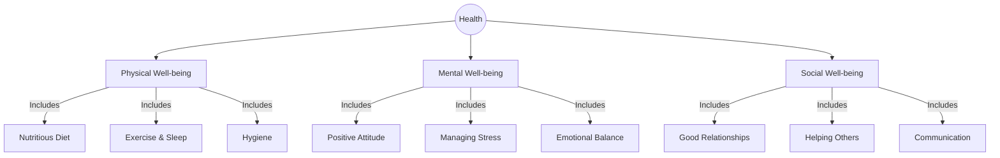
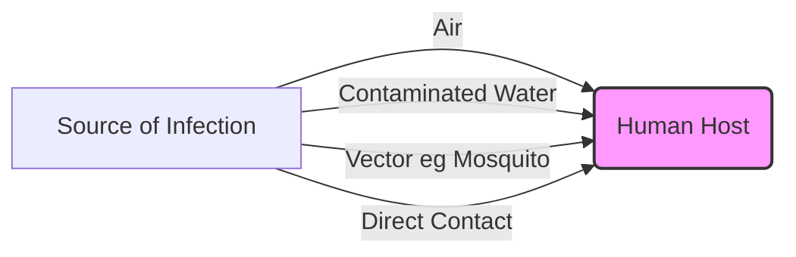
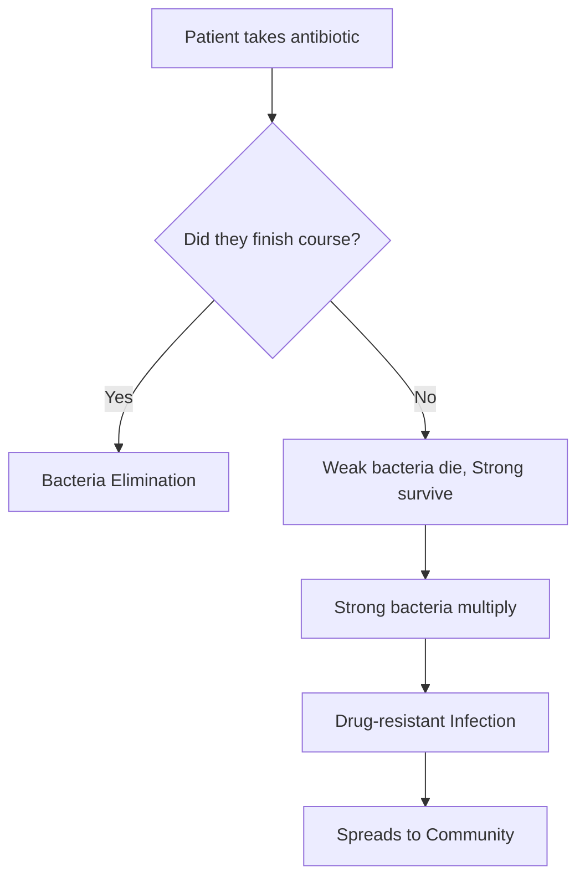
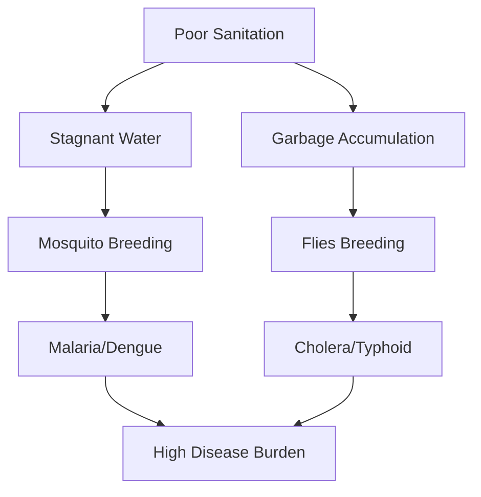

<<<FILE_START: index.mdx>>>
---
title: "Health: The Ultimate Treasure"
description: "Chapter 3 overview covering the definition of health, disease types, prevention, and the importance of lifestyle."
date: 2025-01-15
tags: ["health", "science", "grade-8", "biology"]
order: 1
draft: false
---

import Callout from '@/components/Callout.astro'

## Introduction

Health is often called our ultimate treasure. But is being "healthy" simply the absence of sickness? In this chapter, we explore the holistic meaning of health, how diseases spread, and the scientific advancements—like vaccines and antibiotics—that protect us.

We will learn that health is a balance of physical, mental, and social well-being, deeply influenced by our lifestyle and environment.

### Chapter Roadmap

*   **Topic 1:** [What is Health?](/topics/01-what-is-health) (Defining health beyond illness)
*   **Topic 2:** [Staying Healthy](/topics/02-staying-healthy) (Lifestyle, Environment, and Hygiene)
*   **Topic 3:** [Types of Diseases](/topics/03-types-of-diseases) (Communicable vs. Non-communicable)
*   **Topic 4:** [Prevention and Treatment](/topics/04-prevention-treatment) (Vaccines, Antibiotics, and Immunity)

### Key Concepts & Definitions

| Term | Definition |
| :--- | :--- |
| **Health** | A state of complete physical, mental, and social well-being, not merely the absence of disease (WHO). |
| **Disease** | A condition that affects the normal working of the body or mind. |
| **Pathogen** | Disease-causing germs like bacteria, viruses, fungi, or protozoa. |
| **Vector** | An organism (like a mosquito) that spreads pathogens from an infected person to a healthy person. |
| **Immunity** | The body's natural ability to fight against diseases. |
| **Vaccine** | A preparation (often dead/weakened germs) that trains the immune system to recognize and fight pathogens. |
| **Antibiotic** | Medicines used to kill bacteria (ineffective against viruses). |

<Callout variant="tip">
**Ancient Wisdom:** Ayurveda describes health as a balance of body, mind, and surroundings, maintained through *dinacharya* (daily routine) and *ritucharya* (seasonal routine).
</Callout>
<<<FILE_END>>>
<<<FILE_START: topics/01-what-is-health.mdx>>>
---
title: "What is Health?"
description: "Understanding the holistic definition of health including physical, mental, and social aspects."
date: 2025-01-15
tags: ["health-definition", "who", "well-being"]
order: 1
draft: false
---

import Callout from '@/components/Callout.astro'

## Defining Health

Is a person healthy if they have no fever but are constantly stressed and lonely? According to modern science, the answer is **no**.

The **World Health Organization (WHO)** defines health as:
> "A state of complete physical, mental, and social well-being, and not merely the absence of disease."

### The Three Pillars of Health

### Case Study: The New Student
Consider the story of a Grade 8 student who moved to a new city. He felt lonely, spent excessive time on screens, stopped eating well, and developed headaches.
*   **Physical Symptoms:** Weight loss, sleeplessness, headaches.
*   **Root Cause:** Social isolation (loneliness) and Mental stress.
*   **Solution:** Reducing screen time and seeking social support (counsellor, making friends) improved his physical health.

This proves that **mind and body are connected**.

<Callout variant="info">
**Signs vs. Symptoms**
*   **Symptom:** What the patient *feels* (e.g., headache, pain, dizziness).
*   **Sign:** What can be *seen or measured* (e.g., fever of $102^\circ$F, rash, swelling).
</Callout>
<<<FILE_END>>>
<<<FILE_START: topics/02-staying-healthy.mdx>>>
---
title: "Staying Healthy: Lifestyle & Environment"
description: "How diet, hygiene, and a clean environment contribute to health."
date: 2025-01-15
tags: ["lifestyle", "environment", "hygiene"]
order: 2
draft: false
---

import Callout from '@/components/Callout.astro'

## The Role of Lifestyle

Our daily habits dictate our health. A "healthy lifestyle" includes:

1.  **Balanced Diet:** Eating fresh fruits, vegetables, and whole grains. Avoiding processed/sugary foods.
2.  **Physical Activity:** Walking, running, playing sports.
3.  **Sleep:** Getting enough rest allows the body to recover.
4.  **Mental Hygiene:** Meditation, yoga, and managing stress.
5.  **Avoiding Harmful Substances:** Saying 'NO' to tobacco, alcohol, and drugs.

## The Role of Environment

We cannot stay healthy in a dirty environment.
*   **Clean Air:** Air pollution causes respiratory issues like asthma. The **Air Quality Index (AQI)** measures air cleanliness.
*   **Clean Water:** Contaminated water spreads diseases like Cholera and Typhoid.
*   **Sanitation:** Proper waste disposal prevents the breeding of flies and mosquitoes.

### Community Sanitation: The Odisha Example
A community-led sanitation campaign in Bhadrak district, Odisha, promoted toilet usage.
*   **Result:** Significant reduction in open defecation.
*   **Impact:** Fewer cases of diarrhea and infections in children.

<Callout variant="warning">
**Vectors:** Insects like mosquitoes and houseflies that carry pathogens from dirty environments to humans are called vectors. Keeping our surroundings clean stops them from breeding.
</Callout>
<<<FILE_END>>>
<<<FILE_START: topics/03-types-of-diseases.mdx>>>
---
title: "Types of Diseases"
description: "Distinguishing between Communicable and Non-communicable diseases."
date: 2025-01-15
tags: ["diseases", "pathogens", "communicable", "non-communicable"]
order: 3
draft: false
---

import Callout from '@/components/Callout.astro'

## Classification of Diseases

Diseases are broadly classified into two categories based on how they are caused and spread.

### 1. Non-Communicable Diseases (NCDs)
These diseases **do not spread** from person to person. They are caused by lifestyle, genetics, or environment.

*   **Causes:** Unhealthy diet, lack of exercise, pollution, hormonal imbalance.
*   **Examples:** Diabetes, Cancer, Heart Disease, Asthma, Obesity.
*   **Deficiency Diseases:** Scurvy (Vitamin C), Anaemia (Iron), Goitre (Iodine).

### 2. Communicable Diseases (Infectious)
These diseases **spread** from an infected person to a healthy person. They are caused by **Pathogens**.

*   **Pathogens:** Bacteria, Viruses, Fungi, Protozoa, Worms.
*   **Modes of Transmission:**
    *   **Air:** Coughing/Sneezing (Common Cold, TB).
    *   **Water/Food:** Contamination (Cholera, Typhoid, Hepatitis A).
    *   **Vectors (Insects):** Mosquitoes (Malaria, Dengue).
    *   **Direct Contact:** Skin-to-skin or sharing items (Chickenpox).

### Common Communicable Diseases Table

| Disease | Pathogen Type | Transmission | Preventive Measure |
| :--- | :--- | :--- | :--- |
| **Common Cold** | Virus | Air | Wash hands, mask up. |
| **Tuberculosis (TB)** | Bacteria | Air | Vaccination (BCG), isolation. |
| **Cholera** | Bacteria | Water/Food | Boil water, sanitary hygiene. |
| **Malaria** | Protozoa | Mosquito (Vector) | Mosquito nets, no stagnant water. |
| **Ringworm** | Fungi | Direct Contact | Personal hygiene, don't share towels. |

<<<FILE_END>>>
<<<FILE_START: topics/04-prevention-treatment.mdx>>>
---
title: "Prevention and Treatment"
description: "How vaccines, immunity, and antibiotics work to keep us safe."
date: 2025-01-15
tags: ["vaccines", "antibiotics", "immunity", "science-history"]
order: 4
draft: false
---

import Callout from '@/components/Callout.astro'

## Immunity: The Body's Defense

**Immunity** is the body's natural ability to fight diseases.
*   **Innate Immunity:** Protection we are born with.
*   **Acquired Immunity:** Protection developed after exposure to a disease or a vaccine.

## Vaccines: Prevention is Better than Cure

A **vaccine** trains the immune system to recognize a pathogen without causing the disease. It usually contains dead or weakened germs.

### The Story of Smallpox
*   **Observation:** Edward Jenner (1796) noticed milkmaids who got **Cowpox** (mild) never got **Smallpox** (deadly).
*   **Experiment:** He infected a boy with Cowpox, then exposed him to Smallpox. The boy survived.
*   **Result:** The first vaccine was created. Today, Smallpox is eradicated from the world.

## Antibiotics: Fighting Bacteria

**Antibiotics** are medicines that kill or stop the growth of bacteria.
*   **Discovery:** Alexander Fleming discovered **Penicillin** (the first antibiotic) from a mould in 1928.
*   **Limitation:** Antibiotics ONLY work against **Bacteria**. They do **NOT** cure viral infections like the Common Cold or Flu.

<Callout variant="error">
**Antibiotic Resistance:** If we overuse antibiotics or don't finish the prescribed course, bacteria can adapt and survive. These "superbugs" become very hard to kill.
**Rule:** Only take antibiotics prescribed by a doctor.
</Callout>

### Diagram: How Resistance Spreads

<<<FILE_END>>>
<<<FILE_START: solutions/intro-questions.mdx>>>
---
title: "Introductory Questions Solutions"
description: "Answers to Probe and Ponder and in-text activities."
date: 2025-01-15
tags: ["solutions", "intro"]
order: 1
draft: false
---

import Callout from '@/components/Callout.astro'

## Page 1: Probe and Ponder

**Q1: How does your body respond to an infection such as common cold?**
**A:** The immune system detects the virus. It raises body temperature (fever) to kill germs, produces mucus to trap them (runny nose), and induces coughing/sneezing to expel them.

**Q2: We rarely see smallpox/polio, but diabetes is common. Why?**
**A:** Smallpox and Polio are communicable diseases controlled by **Vaccines**. Diabetes is a non-communicable lifestyle disease caused by poor diet and lack of exercise, which are becoming more common in modern life.

**Q3: Could climate change lead to new types of diseases?**
**A:** Yes. Warmer temperatures allow vectors like mosquitoes to survive in new areas, spreading diseases like Dengue and Malaria to regions that were previously too cold for them.

**Q4: How do emotions like stress affect us?**
**A:** Stress releases hormones that can suppress the immune system, making us more susceptible to infections. It can also lead to headaches, insomnia, and high blood pressure.

## Page 15: Keep the Curiosity Alive

**Task:** Group the diseases shown in images as communicable or non-communicable.

1.  **Cold and Flu:** Communicable (Viral).
2.  **Typhoid:** Communicable (Bacterial - Waterborne).
3.  **Diabetes:** Non-communicable (Lifestyle/Hormonal).
4.  **Asthma:** Non-communicable (Allergy/Environment).
5.  **Chickenpox:** Communicable (Viral).

<<<FILE_END>>>
<<<FILE_START: solutions/chapter-exercises.mdx>>>
---
title: "Chapter Exercises Solutions"
description: "Detailed solutions for the exercises on pages 16-18."
date: 2025-01-15
tags: ["solutions", "exercises", "grade-8"]
order: 2
draft: false
---

import Callout from '@/components/Callout.astro'

## Questions and Answers

### Q2. Identify the non-communicable diseases.
**(i) Typhoid (ii) Asthma (iii) Diabetes (iv) Measles**
**Answer:** (b) (ii) and (iii)
*Reasoning:* Asthma and Diabetes are lifestyle/environmental diseases. Typhoid and Measles are caused by pathogens.

### Q3. Flu Outbreak in School
**(i) Immediate actions by school:**
*   Isolate students showing symptoms.
*   Encourage mask-wearing and frequent hand washing.
*   Sanitize surfaces (desks, door handles).

**(ii) Response to a coughing classmate:**
*   Politely offer them a tissue or suggest they wear a mask.
*   "Hey, you sound unwell. Maybe you should visit the nurse to get checked out so you can feel better."

**(iii) Protecting yourself:**
*   Wash hands frequently.
*   Avoid touching your face (eyes, nose, mouth).
*   Maintain distance.

### Q4. Travelling to a Malaria-prevalent city
**(i) Precautions:**
*   **Before:** Check if preventative medication is needed.
*   **During:** Wear long-sleeved clothes, use insect repellent.
*   **After:** Monitor for fever for a few weeks upon return.

**(ii) Explaining to sibling:**
*   "Mosquitoes carry the malaria germ. The net stops them from biting us while we sleep, so the germ can't get into our blood."

**(iii) Ignoring advisories:**
*   High risk of contracting malaria, which can lead to severe fever, organ damage, or death if untreated.

### Q5. Uncle smoking to fit in
**(i) What to say:**
*   "Uncle, I love you and want you to be healthy. Smoking damages lungs and causes cancer. Please don't do it just for friends."

**(ii) If a friend offers a cigarette:**
*   Say a firm "No" and leave the situation. "No thanks, I don't smoke. It kills your stamina for sports."

**(iii) School's role:**
*   Awareness workshops, strict no-smoking zones, and counselling for peer pressure.

### Q6. Misconception about Antibiotics
**Saniya's claim:** "Antibiotics cure any infection."
**Vinita's response questions:**
*   "Did you know antibiotics only kill bacteria?"
*   "If you have a viral flu, how will a medicine that kills bacteria help you?"
*   "Do you know about antibiotic resistance?"

### Q7. Dengue Cases Graph Analysis

**(i) Which three months were cases highest?**
*   July (65), August (65), September (65).

**(ii) Which month(s) were cases lowest?**
*   January (10).

**(iii) Environmental factors for peak months:**
*   July-September corresponds to the **Monsoon season**. Rain leads to stagnant water puddles, which are breeding grounds for mosquitoes.

**(iv) Preventive steps:**
*   Fogging (fumigation) before monsoon.
*   Public awareness to empty coolers and pots.
*   Releasing guppy fish in ponds to eat mosquito larvae.

  <svg width="600" height="350" viewBox="0 0 600 350" xmlns="http://www.w3.org/2000/svg">
    <!-- Axes -->
    <line x1="50" y1="300" x2="580" y2="300" stroke="currentColor" stroke-width="2" />
    <line x1="50" y1="300" x2="50" y2="20" stroke="currentColor" stroke-width="2" />

    <!-- Y-axis Labels -->
    <text x="10" y="300" fill="currentColor" font-size="12">0</text>
    <text x="10" y="230" fill="currentColor" font-size="12">20</text>
    <text x="10" y="160" fill="currentColor" font-size="12">40</text>
    <text x="10" y="90" fill="currentColor" font-size="12">60</text>

    <!-- Bars -->
    <rect x="60" y="260" width="30" height="40" fill="#4caf50" opacity="0.8"><title>Jan: 10</title></rect>
    <rect x="100" y="252" width="30" height="48" fill="#4caf50" opacity="0.8"><title>Feb: 12</title></rect>
    <rect x="140" y="240" width="30" height="60" fill="#4caf50" opacity="0.8"><title>Mar: 15</title></rect>
    <rect x="180" y="228" width="30" height="72" fill="#4caf50" opacity="0.8"><title>Apr: 18</title></rect>
    <rect x="220" y="212" width="30" height="88" fill="#4caf50" opacity="0.8"><title>May: 22</title></rect>
    <rect x="260" y="140" width="30" height="160" fill="#ff9800" opacity="0.8"><title>Jun: 40</title></rect>
    <rect x="300" y="40" width="30" height="260" fill="#f44336" opacity="0.9"><title>Jul: 65</title></rect>
    <rect x="340" y="40" width="30" height="260" fill="#f44336" opacity="0.9"><title>Aug: 65</title></rect>
    <rect x="380" y="40" width="30" height="260" fill="#f44336" opacity="0.9"><title>Sep: 65</title></rect>
    <rect x="420" y="180" width="30" height="120" fill="#ff9800" opacity="0.8"><title>Oct: 30</title></rect>
    <rect x="460" y="180" width="30" height="120" fill="#ff9800" opacity="0.8"><title>Nov: 30</title></rect>
    <rect x="500" y="220" width="30" height="80" fill="#4caf50" opacity="0.8"><title>Dec: 20</title></rect>

    <!-- X-axis Labels (Abbreviated) -->
    <text x="65" y="320" fill="currentColor" font-size="10">Jan</text>
    <text x="305" y="320" fill="currentColor" font-size="10" font-weight="bold">Jul</text>
    <text x="345" y="320" fill="currentColor" font-size="10" font-weight="bold">Aug</text>
    <text x="385" y="320" fill="currentColor" font-size="10" font-weight="bold">Sep</text>
    <text x="505" y="320" fill="currentColor" font-size="10">Dec</text>
  </svg>

### Q9. Why no antibiotics for viral infections?
**Answer:** Antibiotics are chemicals designed to disrupt specific structures in **bacteria** (like their cell walls). Viruses do not have these structures; they live inside human cells. Therefore, antibiotics cannot harm viruses and taking them contributes to antibiotic resistance.

### Q10. Disease from contaminated water?
**Options:** Hepatitis A, Tuberculosis, Poliomyelitis, Cholera, Chickenpox.
**Answer:**
*   **Hepatitis A** (Yes)
*   **Cholera** (Yes)
*   **Poliomyelitis** (Yes - spreads via fecal-oral route/water)
*   *Tuberculosis is Airborne. Chickenpox is contact/airborne.*

### Q11. Immune Response (First vs Second Exposure)
**Answer:** This is due to **Immunological Memory**.
1.  **First Exposure:** The body takes time to identify the pathogen and create specific antibodies. This is slow.
2.  **Memory Cells:** Some immune cells remain as "memory cells" after the first infection.
3.  **Second Exposure:** These memory cells recognize the pathogen immediately and produce massive amounts of antibodies instantly, often destroying the germ before we even feel sick.
<<<FILE_END>>>
<<<FILE_START: practice/case-studies.mdx>>>
---
title: "Practice Case Studies"
description: "Analysis of real-world health scenarios."
date: 2025-01-15
tags: ["practice", "case-study", "antibiotic-resistance"]
order: 1
draft: false
---

import Callout from '@/components/Callout.astro'

## Case Study 1: The "Superbug" Crisis

**Scenario:**
Ravi has a sore throat. He takes an antibiotic left over from his sister's previous illness without visiting a doctor. He feels better after 2 days and stops taking the medicine. Two weeks later, he gets sick again, but this time the medicine doesn't work.

**Analysis:**
1.  **Mistake 1 (Self-medication):** Sore throats are often viral. Taking antibiotics for a virus is useless.
2.  **Mistake 2 (Incomplete Course):** Even if it was bacterial, stopping early kills only the weak bacteria.
3.  **Result (Resistance):** The stronger bacteria survived, multiplied, and are now resistant to that antibiotic.

**Lesson:** Always consult a doctor and finish the full course of antibiotics.

## Case Study 2: The Clean Village

**Scenario:**
Village A has open drains and garbage piles. Village B has covered drains and regular garbage collection. During the monsoon, Village A sees a spike in Malaria and Diarrhea cases. Village B remains mostly healthy.

**Connection:**
*   **Malaria:** Stagnant water in open drains breeds mosquitoes (Vectors).
*   **Diarrhea:** Garbage and sewage contaminate water sources with pathogens.
*   **Conclusion:** Sanitation is a direct preventive measure for communicable diseases.

<<<FILE_END>>>
