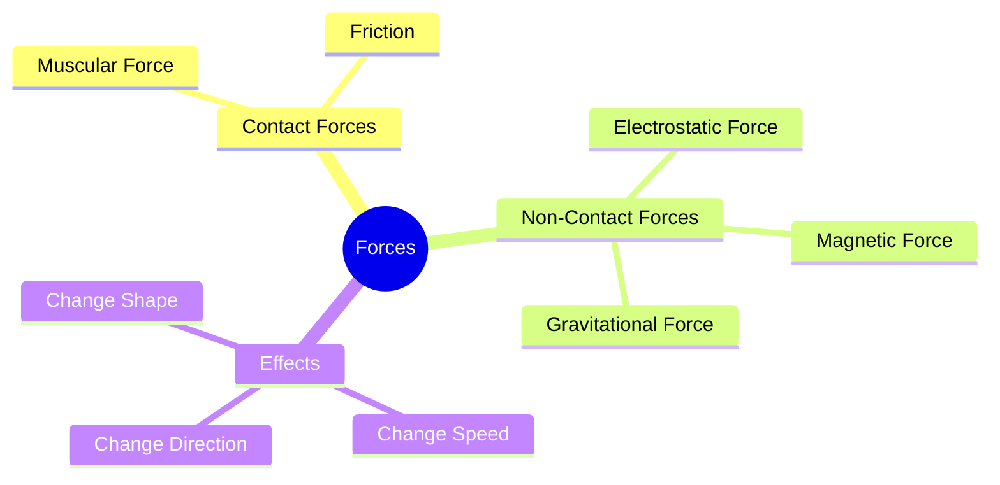
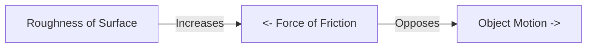

<<<FILE_START: index.mdx>>>
---
title: "Exploring Forces"
description: "Chapter 5 overview: Understanding push, pull, friction, gravity, and the laws governing motion."
date: 2025-01-15
tags: ["force", "physics", "grade-8", "gravity"]
order: 1
draft: false
---

import Callout from '@/components/Callout.astro'

## Introduction

Why do we have to pedal harder to go uphill? Why does a ball rolling on the ground eventually stop? The answer lies in the concept of **Force**.

In this chapter, we explore how forces—pushes and pulls—govern the motion of everything around us. From the muscles we use to lift a bag to the invisible gravity keeping us on Earth, forces are everywhere.

### Chapter Roadmap

*   **Topic 1:** [What is a Force?](/topics/01-what-is-force) (Definition and Effects)
*   **Topic 2:** [Contact Forces](/topics/02-contact-forces) (Muscular Force and Friction)
*   **Topic 3:** [Non-Contact Forces](/topics/03-non-contact-forces) (Magnetism, Electrostatics, Gravity)
*   **Topic 4:** [Weight and Mass](/topics/04-weight-and-mass) (Using a Spring Balance)
*   **Topic 5:** [Floating and Sinking](/topics/05-floating-and-sinking) (Buoyancy)

### Key Definitions

| Term | Definition | Unit |
| :--- | :--- | :--- |
| **Force** | A push or a pull resulting from the interaction between two objects. | Newton (N) |
| **Friction** | A force that opposes the motion of an object moving over a surface. | Newton (N) |
| **Gravity** | The force with which the Earth (or any massive body) attracts objects towards itself. | Newton (N) |
| **Weight** | The measure of the force of gravity acting on an object. | Newton (N) |
| **Mass** | The amount of matter contained in an object. | Kilogram (kg) |

<<<FILE_END>>>
<<<FILE_START: topics/01-what-is-force.mdx>>>
---
title: "What is a Force?"
description: "Defining force as a push or pull and understanding its effects on objects."
date: 2025-01-15
tags: ["force", "interaction", "physics-basics"]
order: 1
draft: false
---

import Callout from '@/components/Callout.astro'

## The Definition of Force

In science, a **Force** is generally defined as a **push** or a **pull** applied on an object.
*   **Push:** Moving something away from you (e.g., kicking a football).
*   **Pull:** Drawing something towards you (e.g., opening a drawer).

<Callout variant="tip">
**Interaction is Key:** Forces do not exist in isolation. At least **two objects** must interact for a force to come into play. For example, when you push a table, your hand interacts with the table.
</Callout>

## What Can a Force Do?

A force can change the state of an object in several ways:

1.  **Move from Rest:** Making a stationary ball move by kicking it.
2.  **Change Speed:**
    *   Pushing a moving swing harder makes it go faster.
    *   Pulling back on a dog's leash slows it down.
3.  **Change Direction:** A batsman hitting a cricket ball changes its path.
4.  **Change Shape:** Squeezing a plastic bottle or stretching a rubber band.

### Visualizing Push and Pull

  <svg width="400" height="200" viewBox="0 0 400 200" xmlns="http://www.w3.org/2000/svg">
    <!-- Floor -->
    <line x1="20" y1="180" x2="380" y2="180" stroke="currentColor" stroke-width="2" />

    <!-- Box 1 (Push) -->
    <rect x="50" y="100" width="80" height="80" fill="#e0e0e0" stroke="currentColor" stroke-width="2" />
    <text x="90" y="145" text-anchor="middle" font-size="14" fill="currentColor">Object</text>
    <!-- Push Arrow -->
    <line x1="20" y1="140" x2="50" y2="140" stroke="#ef4444" stroke-width="4" marker-end="url(#arrowhead)" />
    <text x="35" y="130" text-anchor="middle" fill="#ef4444" font-size="12">Push</text>

    <!-- Box 2 (Pull) -->
    <rect x="250" y="100" width="80" height="80" fill="#e0e0e0" stroke="currentColor" stroke-width="2" />
    <text x="290" y="145" text-anchor="middle" font-size="14" fill="currentColor">Object</text>
    <!-- Pull Arrow -->
    <line x1="330" y1="140" x2="380" y2="140" stroke="#3b82f6" stroke-width="4" marker-end="url(#arrowhead)" />
    <text x="355" y="130" text-anchor="middle" fill="#3b82f6" font-size="12">Pull</text>

    <defs>
      <marker id="arrowhead" markerWidth="10" markerHeight="7" refX="10" refY="3.5" orient="auto">
        <polygon points="0 0, 10 3.5, 0 7" fill="currentColor" />
      </marker>
    </defs>
  </svg>

The **SI Unit** of force is the **Newton (N)**.
<<<FILE_END>>>
<<<FILE_START: topics/02-contact-forces.mdx>>>
---
title: "Contact Forces"
description: "Forces that act only when objects are physically touching: Muscular Force and Friction."
date: 2025-01-15
tags: ["friction", "muscular-force", "contact-force"]
order: 2
draft: false
---

import Callout from '@/components/Callout.astro'

## What are Contact Forces?

Contact forces are forces that can be applied only when the interacting objects are in **physical contact** with each other.

### 1. Muscular Force
This force results from the action of muscles.
*   **Example:** Lifting a bucket, kicking a ball, or a bullock pulling a cart.
*   **Mechanism:** Muscles contract and relax to exert force on bones or objects. It is essential for all our physical activities and body functions (like digestion and blood circulation).

### 2. Friction
Have you noticed that a ball rolling on the ground eventually stops? This is due to **Friction**.

*   **Definition:** The force that acts between two surfaces in contact and opposes the motion of one surface over the other.
*   **Direction:** Friction always acts in the **opposite direction** to the motion.
*   **Cause:** It arises due to **irregularities** (roughness) on the two surfaces locking into each other. Even smooth-looking surfaces have microscopic irregularities.

<Callout variant="warning">
**Rough vs. Smooth:** Friction is greater on rough surfaces (like sand or carpet) and lesser on smooth surfaces (like ice or glass). This is why we slip on wet floors—water reduces friction!
</Callout>
<<<FILE_END>>>
<<<FILE_START: topics/03-non-contact-forces.mdx>>>
---
title: "Non-Contact Forces"
description: "Forces that act from a distance without physical contact: Magnetic, Electrostatic, and Gravitational."
date: 2025-01-15
tags: ["gravity", "magnetism", "electrostatics"]
order: 3
draft: false
---

import Callout from '@/components/Callout.astro'

## What are Non-Contact Forces?

These forces can exert a push or pull even from a distance, without touching the object.

### 1. Magnetic Force
A magnet can attract iron objects or repel other magnets without touching them.
*   **Attraction:** Unlike poles (North-South) pull each other.
*   **Repulsion:** Like poles (North-North) push each other away.

### 2. Electrostatic Force
The force exerted by a charged body on another charged or uncharged body.
*   **Experiment:** Rub a plastic straw with paper/polythene. It acquires an **electric charge**. It can now attract small pieces of paper.
*   **Rule:**
    *   Like charges repel (+ and +).
    *   Unlike charges attract (+ and -).

### 3. Gravitational Force (Gravity)
Why does an apple fall down? Because the Earth pulls it.
*   **Definition:** The force of attraction between any two objects in the universe.
*   **On Earth:** The Earth pulls everything towards its center. This pull is called the **Force of Gravity**.
*   **Nature:** Gravity is *always* attractive. It never repels.

  <svg width="300" height="300" viewBox="0 0 300 300" xmlns="http://www.w3.org/2000/svg">
    <!-- Earth -->
    <circle cx="150" cy="250" r="120" fill="#e3f2fd" stroke="#2196f3" stroke-width="2" />
    <path d="M 50 200 Q 150 150 250 200" fill="none" stroke="#2196f3" stroke-width="1" opacity="0.5" />
    <text x="150" y="280" text-anchor="middle" fill="#1565c0" font-weight="bold">EARTH</text>

    <!-- Object Falling -->
    <circle cx="150" cy="50" r="10" fill="#ef5350" />
    <text x="170" y="55" fill="currentColor" font-size="12">Object</text>

    <!-- Gravity Arrow -->
    <line x1="150" y1="65" x2="150" y2="120" stroke="#212121" stroke-width="2" marker-end="url(#arrowhead)" />
    <text x="160" y="100" fill="currentColor" font-size="12">Gravity</text>

    <defs>
      <marker id="arrowhead" markerWidth="10" markerHeight="7" refX="10" refY="3.5" orient="auto">
        <polygon points="0 0, 10 3.5, 0 7" fill="#212121" />
      </marker>
    </defs>
  </svg>

<<<FILE_END>>>
<<<FILE_START: topics/04-weight-and-mass.mdx>>>
---
title: "Weight and Mass"
description: "Understanding the difference between the amount of matter (Mass) and the force of gravity (Weight)."
date: 2025-01-15
tags: ["mass", "weight", "measurement", "spring-balance"]
order: 4
draft: false
---

import Callout from '@/components/Callout.astro'

## Mass vs. Weight

These two terms are often used interchangeably in daily life, but in science, they are very different.

| Feature | Mass | Weight |
| :--- | :--- | :--- |
| **Definition** | The amount of matter in an object. | The force with which Earth attracts an object. |
| **Changeability** | Constant everywhere (Earth, Moon, Space). | Changes based on gravity (Lighter on Moon). |
| **SI Unit** | Kilogram (kg) | Newton (N) |
| **Measurement Device** | Beam Balance | Spring Balance |

<Callout variant="info">
**Did you know?** An object on the Moon weighs **1/6th** of its weight on Earth because the Moon's gravity is weaker. However, its mass (kg) remains exactly the same.
</Callout>

## Measuring Weight: The Spring Balance

A spring balance measures weight by the stretching of a spring.
1.  **Principle:** The Earth pulls the object down.
2.  **Action:** This force stretches the spring.
3.  **Reading:** The extent of stretching corresponds to the weight (Force) in Newtons.

### Reading a Spring Balance
To measure accurately, you must find the **Least Count** (the value of one small division).
*   *Example:* If the range 0 to 1 N has 5 divisions, then 1 division = $1 \div 5 = 0.2 \text{ N}$.

<<<FILE_END>>>
<<<FILE_START: topics/05-floating-and-sinking.mdx>>>
---
title: "Floating and Sinking"
description: "Introduction to Upthrust and Buoyancy."
date: 2025-01-15
tags: ["buoyancy", "upthrust", "floating"]
order: 5
draft: false
---

import Callout from '@/components/Callout.astro'

## Upthrust (Buoyant Force)

Have you noticed that a mug feels lighter when dipped in a bucket of water? Or that it's hard to push an empty plastic bottle underwater?

This is because liquids exert an **upward force** on objects immersed in them. This upward force is called **Upthrust** or **Buoyant Force**.

### Why do objects float or sink?

It is a battle between two forces:
1.  **Gravity (Weight):** Pulls the object **down**.
2.  **Upthrust:** Pushes the object **up**.

*   **Sinks:** If Weight > Upthrust.
*   **Floats:** If Weight = Upthrust.
*   **Rises:** If Upthrust > Weight (like releasing a submerged plastic ball).

### Archimedes' Principle
A Greek scientist named Archimedes discovered that the upward buoyant force is equal to the **weight of the liquid displaced** by the object.
*   If an object displaces a lot of water (like a large ship), the upthrust is huge, allowing it to float even if it is heavy!

<<<FILE_END>>>
<<<FILE_START: solutions/intro-questions.mdx>>>
---
title: "Introductory Questions Solutions"
description: "Answers to Probe and Ponder questions from Page 1."
date: 2025-01-15
tags: ["solutions", "intro"]
order: 1
draft: false
---

import Callout from '@/components/Callout.astro'

## Page 1: Probe and Ponder

**Q1: Why does it feel harder to pedal a bicycle when going uphill than on flat ground?**
**Answer:** On flat ground, you primarily work against friction and air resistance. When going uphill, you must also work against the **Force of Gravity** which is pulling you downwards/backwards. You need to apply more muscular force to overcome this additional pull.

**Q2: Why is it easier to slip on a wet surface?**
**Answer:** Friction arises from the interlocking of irregularities between two surfaces. Water fills these irregularities and forms a smooth layer between your feet and the floor. This significantly **reduces friction**, making it hard to grip the floor, leading to slipping.

**Q3: Why do we feel ‘light’ or like we are ‘floating’ just after our swing reaches its highest point and begins to come down?**
**Answer:** At the highest point, the swing momentarily stops before falling back. As you start descending, you are in a state of "free fall" for a split second where the support force from the seat reduces. This creates a sensation of weightlessness.

<<<FILE_END>>>
<<<FILE_START: solutions/exercises.mdx>>>
---
title: "Chapter Exercises Solutions"
description: "Detailed solutions for the exercises on pages 16-18."
date: 2025-01-15
tags: ["solutions", "exercises", "grade-8"]
order: 2
draft: false
---

import Callout from '@/components/Callout.astro'

## Questions and Answers

### 1. Match Items (Column A to Column B)

| Type of Force | Example |
| :--- | :--- |
| **(i) Muscular force** | **(b)** A child lifting a school bag. |
| **(ii) Magnetic force** | **(e)** A compass needle pointing North. |
| **(iii) Frictional force** | **(a)** A cricket ball stopping on its own. |
| **(iv) Gravitational force** | **(c)** A fruit falling from a tree. |
| **(v) Electrostatic force** | **(d)** Balloon rubbed on woollen cloth attracting hair. |

### 2. True or False

(i) A force is always required to change the speed of motion of an object.
**Answer: True.** (Newton's First Law: An object stays in uniform motion unless acted upon by an external force).

(ii) Due to friction, the speed of the ball rolling on a flat ground increases.
**Answer: False.** (Friction *opposes* motion, so the speed decreases).

(iii) There is no force between two charged objects placed at a small distance apart.
**Answer: False.** (Electrostatic force is a non-contact force; they will attract or repel even at a distance).

### 3. Charged Balloons
**Question:** Two balloons rubbed with a woollen cloth are brought near each other. What happens?
**Answer:** They will **repel** each other.
*   *Reason:* Rubbing both balloons with the same material (wool) gives them the **same type of charge** (e.g., both negative). Like charges repel each other.

### 4. Sinking Coin vs. Floating Wood
**Question:** Why does a coin sink but a big wooden block float?
**Answer:** This depends on **Density** and **Buoyancy**.
*   The coin is denser than water. The upthrust (buoyant force) provided by the water is *less* than the coin's weight, so it sinks.
*   The wooden block is less dense than water. It displaces enough water to create an upthrust *equal* to its weight, so it floats.

### 5. Ball Thrown Upwards
**(i) During upward motion:**
*   **Forces:** Gravity (Downwards), Air Friction (Downwards).
*   **Result:** Speed decreases.

**(ii) During downward motion:**
*   **Forces:** Gravity (Downwards), Air Friction (Upwards - opposing motion).
*   **Result:** Speed increases.

**(iii) At topmost position:**
*   **Forces:** Gravity is still acting downwards. Even though velocity is zero for an instant, the force of gravity never stops.

### 6. Ball on Inclined Plane (Diagram Analysis)

The ball starts at P, goes down, and stops at A due to friction on the horizontal surface.

**(i) How to stop BEFORE point A?**
*   **Increase Friction:** Make the horizontal surface rougher (e.g., spread sand or carpet).
*   **Lower Height P:** Release the ball from a lower height so it has less energy.

**(ii) How to stop AFTER crossing point A?**
*   **Decrease Friction:** Make the surface smoother (e.g., apply oil, use glass or ice).
*   **Increase Height P:** Release the ball from a higher point.

  <svg width="400" height="200" viewBox="0 0 400 200" xmlns="http://www.w3.org/2000/svg">
    <!-- Slope -->
    <path d="M 50 50 L 150 150 L 350 150" stroke="currentColor" stroke-width="2" fill="none" />
    <text x="40" y="45" fill="currentColor">P</text>
    <circle cx="50" cy="50" r="10" fill="#ef4444" />

    <!-- Point A -->
    <circle cx="250" cy="150" r="3" fill="currentColor" />
    <text x="250" y="170" fill="currentColor">A</text>

    <!-- Motion paths -->
    <path d="M 55 55 L 145 145 L 240 145" stroke="#ef4444" stroke-width="1" stroke-dasharray="4" fill="none" marker-end="url(#arrowhead)" />
  </svg>

### 7. Slipping on Smooth Surfaces
**Answer:** We walk by pushing the ground backward; friction pushes us forward (action-reaction). On smooth surfaces (ice/polish), the force of friction is extremely low. Without sufficient friction to grip our feet, we cannot push effectively, leading to a slip.

### 8. Non-uniform Motion
**Answer:** **Yes.** Non-uniform motion means the speed or direction is changing. According to physics, any change in speed or direction requires an unbalanced **external force**.

### 9. Weight on Moon
**Answer:**
*   **Cause:** The Moon has less mass than Earth, so its gravitational pull is weaker (approx 1/6th of Earth's). Hence, Weight ($W=mg$) decreases.
*   **Mass:** No, the mass does **not** change. Mass is the amount of matter in the object, which remains constant regardless of location.

### 10. Floating Objects Depth (Fig 5.17)
*   Object 1 dips very little (Floats high).
*   Object 2 dips halfway.
*   Object 3 dips almost completely (Floats low).

**Analysis:**
To float, Upthrust must equal Weight ($U = W$). Upthrust depends on the volume submerged.
*   Object 3 is submerged the most $\rightarrow$ It needs the most upthrust to balance its weight $\rightarrow$ It is the heaviest.
*   Object 1 is submerged the least $\rightarrow$ It is the lightest.

**Correct Option:** (iv) $w_3 > w_2 > w_1$ (Note: The question options in the text might have typos, but logically, deepest sinker = heaviest among same-sized floating objects). *Checking options provided in PDF:*
(i) Equal
(ii) $w_1 > w_2 > w_3$
(iii) $w_2 > w_3 > w_1$
(iv) $w_3 > w_1 > w_2$ (This implies 3 is heaviest, then 1, then 2. Wait, looking at diagram 5.17:
    *   1 is barely in water.
    *   2 is somewhat in.
    *   3 is mostly in.
    *   Therefore $Weight_3 > Weight_2 > Weight_1$.
    *   None of the provided options exactly match $3 > 2 > 1$.
    *   Let's re-read the options carefully.
    *   (iv) says $w_3 > w_1 > w_2$. This claims 1 is heavier than 2. But 1 is floating higher than 2.
    *   **Correction:** Let's look at the diagram again. 1 is high, 2 is middle, 3 is low. Weight corresponds to submerged volume. So $W_3 > W_2 > W_1$.
    *   If the options in the book are rigid, there may be a typo in the book or my reading of the diagram depth. Assuming standard physics: Deepest = Heaviest.

<<<FILE_END>>>
<<<FILE_START: practice/force-diagrams.mdx>>>
---
title: "Practice: Visualizing Forces"
description: "Learn how to draw and interpret Free Body Diagrams."
date: 2025-01-15
tags: ["practice", "diagrams", "physics"]
order: 1
draft: false
---

import Callout from '@/components/Callout.astro'

## What is a Free Body Diagram?

In physics, we use diagrams to show all the forces acting on a single object. This helps us predict how the object will move.

### Example 1: A Book on a Table

When a book rests on a table, it doesn't move. Does that mean no forces are acting? No! It means the forces are **balanced**.

  <svg width="200" height="200" viewBox="0 0 200 200" xmlns="http://www.w3.org/2000/svg">
    <!-- Table Surface -->
    <line x1="50" y1="150" x2="150" y2="150" stroke="currentColor" stroke-width="2" />

    <!-- Book -->
    <rect x="80" y="130" width="40" height="20" fill="#3b82f6" />

    <!-- Gravity Force -->
    <line x1="100" y1="140" x2="100" y2="180" stroke="#ef4444" stroke-width="2" marker-end="url(#arrowhead)" />
    <text x="110" y="170" fill="#ef4444" font-size="12">Weight (Gravity)</text>

    <!-- Normal Force -->
    <line x1="100" y1="140" x2="100" y2="100" stroke="#10b981" stroke-width="2" marker-end="url(#arrowhead)" />
    <text x="110" y="110" fill="#10b981" font-size="12">Reaction Force</text>

    <defs>
      <marker id="arrowhead" markerWidth="10" markerHeight="7" refX="10" refY="3.5" orient="auto">
        <polygon points="0 0, 10 3.5, 0 7" fill="currentColor" />
      </marker>
    </defs>
  </svg>

1.  **Gravity:** Pulls the book down.
2.  **Reaction Force (Normal Force):** The table pushes the book up.
3.  **Result:** They cancel each other out. Net force = 0.

### Example 2: Pushing a Box

Imagine pushing a heavy box across the floor.

1.  **Applied Force (Push):** Acts in the direction of motion.
2.  **Friction:** Acts opposite to the direction of motion.
3.  **Gravity:** Pulls down.
4.  **Reaction:** Floor pushes up.

**Key Rule:** The box will only move if your **Push > Friction**.

<<<FILE_END>>>
