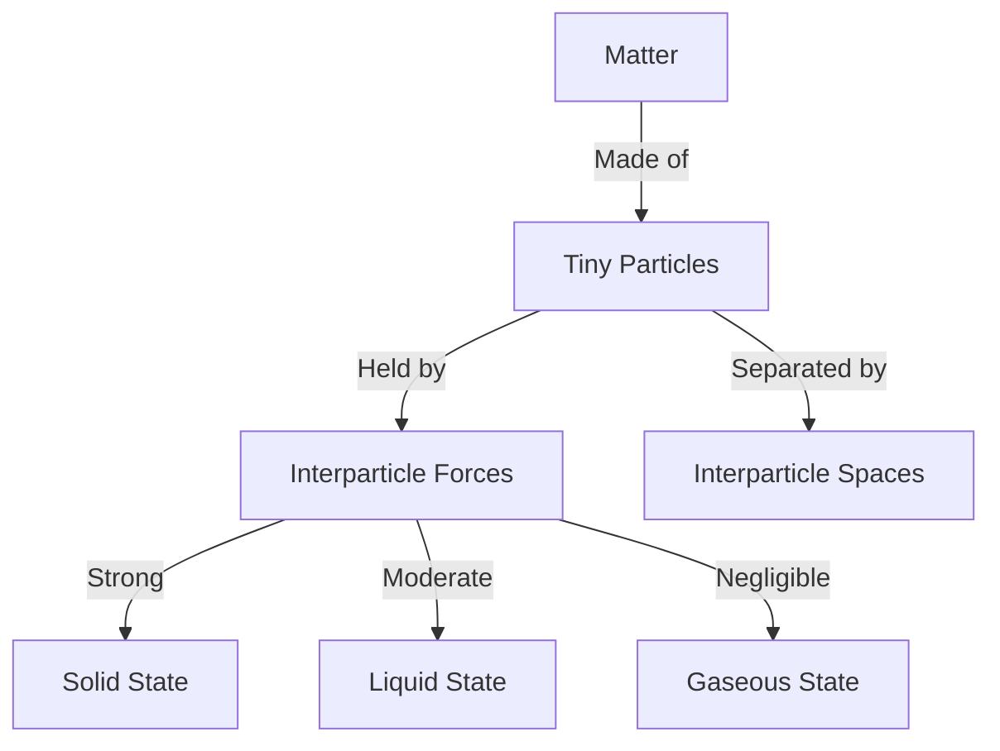

<<<FILE_START: index.mdx>>>
---
title: "Particulate Nature of Matter"
description: "Chapter 7 overview: Understanding that matter is made of tiny particles, their arrangement, and movement in solids, liquids, and gases."
date: 2025-01-15
tags: ["matter", "chemistry", "grade-8", "particles"]
order: 1
draft: false
---

import Callout from '@/components/Callout.astro'

## Introduction

Why does sand pile up while water flows? Why can we smell incense from across the room? The answer lies in the **Particulate Nature of Matter**.

In this chapter, we discover that everything around us—rocks, water, air—is made up of extremely tiny particles. We will explore how these particles are arranged, how they move, and how forces between them determine whether something is a solid, a liquid, or a gas.

### Chapter Roadmap

*   **Topic 1:** [Composition of Matter](/topics/01-composition-of-matter) (Particles and Spaces)
*   **Topic 2:** [The Solid State](/topics/02-solid-state) (Strong attraction, fixed shape)
*   **Topic 3:** [The Liquid State](/topics/03-liquid-state) (Fixed volume, fluid shape)
*   **Topic 4:** [The Gaseous State](/topics/04-gaseous-state) (High compressibility, diffusion)
*   **Topic 5:** [Comparison of States](/topics/05-comparing-states) (Summary Table)

### Key Definitions

| Term | Definition |
| :--- | :--- |
| **Matter** | Anything that has mass and occupies space. |
| **Constituent Particles** | The basic building blocks (atoms/molecules) that make up matter. |
| **Interparticle Space** | The empty space between the particles of matter. |
| **Interparticle Attraction** | The force of attraction holding the particles together. |
| **Diffusion** | The movement of particles from an area of higher concentration to lower concentration (e.g., smell spreading). |

<Callout variant="info">
**Our Scientific Heritage:** Long before modern science, the ancient Indian philosopher **Acharya Kanad** proposed that matter is made of tiny, indivisible, eternal particles called **Parmanu** (Atom).
</Callout>

<<<FILE_END>>>
<<<FILE_START: topics/01-composition-of-matter.mdx>>>
---
title: "Composition of Matter"
description: "Evidence that matter is particulate and has spaces between particles."
date: 2025-01-15
tags: ["particles", "interparticle-space", "dissolution"]
order: 1
draft: false
---

import Callout from '@/components/Callout.astro'

## Is Matter Continuous or Particulate?

If you look at a piece of chalk, it looks like one continuous block. But if you grind it, it becomes powder. If you view that powder under a microscope, you see even smaller grains.
*   **Conclusion:** Matter is not a single continuous block; it is made up of a large number of extremely small **constituent particles**.

### Evidence of Interparticle Space
**Activity: Dissolving Sugar in Water**
1.  Take a glass of water and mark the level.
2.  Dissolve two teaspoons of sugar.
3.  **Observation:** The water tastes sweet, but the water level **does not increase** significantly.

**Why?**
Where did the sugar go? The tiny sugar particles separated and occupied the empty **spaces** available between the water particles.
*   This proves that there are gaps between particles of matter, known as **Interparticle Spaces**.

  <svg width="400" height="250" viewBox="0 0 400 250" xmlns="http://www.w3.org/2000/svg">
    <!-- Beaker -->
    <path d="M 100 50 L 100 200 Q 100 220 200 220 Q 300 220 300 200 L 300 50" stroke="currentColor" stroke-width="3" fill="none" />
    <path d="M 100 50 Q 200 70 300 50 Q 200 30 100 50" stroke="currentColor" stroke-width="2" fill="none" />

    <!-- Water Particles (Blue Circles) -->
    <g fill="#3b82f6" opacity="0.6">
        <circle cx="140" cy="180" r="15" />
        <circle cx="180" cy="190" r="15" />
        <circle cx="220" cy="170" r="15" />
        <circle cx="260" cy="190" r="15" />
        <circle cx="150" cy="140" r="15" />
        <circle cx="200" cy="130" r="15" />
        <circle cx="250" cy="140" r="15" />
        <circle cx="180" cy="90" r="15" />
        <circle cx="230" cy="100" r="15" />
    </g>

    <!-- Sugar Particles (Small Yellow dots in spaces) -->
    <g fill="#eab308">
        <circle cx="165" cy="160" r="6" />
        <circle cx="200" cy="160" r="6" />
        <circle cx="240" cy="155" r="6" />
        <circle cx="170" cy="120" r="6" />
        <circle cx="215" cy="115" r="6" />
        <circle cx="260" cy="110" r="6" />
    </g>

    <text x="200" y="240" fill="currentColor" text-anchor="middle" font-size="14">Sugar particles occupying spaces between water particles</text>
  </svg>

### What holds them together?
Particles are held together by **Interparticle Attractions**. The strength of this force decides the state of matter (Solid, Liquid, or Gas).
<<<FILE_END>>>
<<<FILE_START: topics/02-solid-state.mdx>>>
---
title: "The Solid State"
description: "Properties of solids: Fixed shape, fixed volume, and strong attraction."
date: 2025-01-15
tags: ["solids", "melting-point", "vibration"]
order: 2
draft: false
---

import Callout from '@/components/Callout.astro'

## Characteristics of Solids

Solids (like iron, wood, stone) have a **definite shape** and **definite volume**.

### Particle Arrangement
1.  **Packing:** Particles are tightly packed.
2.  **Forces:** Interparticle attraction is very **strong**.
3.  **Movement:** Particles **cannot** move past each other. They can only **vibrate** or oscillate about their fixed positions.
4.  **Compressibility:** Negligible. You cannot easily squish a rock.

  <svg width="200" height="200" viewBox="0 0 200 200" xmlns="http://www.w3.org/2000/svg">
    <rect x="50" y="50" width="100" height="100" stroke="currentColor" fill="none" stroke-width="2"/>
    <!-- Tightly packed particles -->
    <g fill="#9ca3af" stroke="currentColor" stroke-width="1">
       <circle cx="60" cy="60" r="9" /> <circle cx="80" cy="60" r="9" /> <circle cx="100" cy="60" r="9" /> <circle cx="120" cy="60" r="9" /> <circle cx="140" cy="60" r="9" />
       <circle cx="60" cy="80" r="9" /> <circle cx="80" cy="80" r="9" /> <circle cx="100" cy="80" r="9" /> <circle cx="120" cy="80" r="9" /> <circle cx="140" cy="80" r="9" />
       <circle cx="60" cy="100" r="9" /> <circle cx="80" cy="100" r="9" /> <circle cx="100" cy="100" r="9" /> <circle cx="120" cy="100" r="9" /> <circle cx="140" cy="100" r="9" />
       <circle cx="60" cy="120" r="9" /> <circle cx="80" cy="120" r="9" /> <circle cx="100" cy="120" r="9" /> <circle cx="120" cy="120" r="9" /> <circle cx="140" cy="120" r="9" />
       <circle cx="60" cy="140" r="9" /> <circle cx="80" cy="140" r="9" /> <circle cx="100" cy="140" r="9" /> <circle cx="120" cy="140" r="9" /> <circle cx="140" cy="140" r="9" />
    </g>
    <text x="100" y="180" fill="currentColor" text-anchor="middle">Solid: Tight Packing</text>
  </svg>

### Melting Point
When solids are heated, particles vibrate more vigorously. At a specific temperature called the **Melting Point**, the vibrations become strong enough to overcome the attractive forces, and the solid turns into a liquid.

| Material | Melting Point |
| :--- | :--- |
| Ice | $0^\circ C$ |
| Urea | $133^\circ C$ |
| Iron | $1538^\circ C$ |
<<<FILE_END>>>
<<<FILE_START: topics/03-liquid-state.mdx>>>
---
title: "The Liquid State"
description: "Properties of liquids: Fixed volume, no fixed shape, and fluidity."
date: 2025-01-15
tags: ["liquids", "boiling", "evaporation"]
order: 3
draft: false
---

import Callout from '@/components/Callout.astro'

## Characteristics of Liquids

Liquids (like water, milk, oil) have a **definite volume** but **no fixed shape**. They take the shape of the container they are in.

### Particle Arrangement
1.  **Packing:** Particles are close together but not as rigid as solids.
2.  **Forces:** Attraction is **weaker** than solids.
3.  **Movement:** Particles can **move** and slide past each other. This is why liquids can flow (they are fluids).

  <svg width="200" height="200" viewBox="0 0 200 200" xmlns="http://www.w3.org/2000/svg">
    <path d="M 50 50 L 50 150 L 150 150 L 150 50" stroke="currentColor" fill="none" stroke-width="2"/>
    <!-- Loosely packed particles -->
    <g fill="#60a5fa" stroke="currentColor" stroke-width="1">
       <circle cx="60" cy="140" r="9" /> <circle cx="82" cy="138" r="9" /> <circle cx="105" cy="142" r="9" /> <circle cx="128" cy="140" r="9" />
       <circle cx="65" cy="120" r="9" /> <circle cx="90" cy="118" r="9" /> <circle cx="115" cy="122" r="9" /> <circle cx="140" cy="118" r="9" />
       <circle cx="70" cy="100" r="9" /> <circle cx="95" cy="98" r="9" /> <circle cx="120" cy="102" r="9" />
    </g>
    <text x="100" y="180" fill="currentColor" text-anchor="middle">Liquid: Loose Packing</text>
  </svg>

### Boiling vs. Evaporation

*   **Evaporation:** A slow process where particles at the surface escape into vapour at any temperature.
*   **Boiling:** A fast process where the liquid turns to vapour rapidly at a specific temperature called the **Boiling Point**. Bubbles form throughout the liquid.

<Callout variant="tip">
**Activity:** If you put a drop of Potassium Permanganate ($KMnO_4$) in hot water, it spreads faster than in cold water. This proves that particles move faster when **thermal (heat) energy** increases.
</Callout>
<<<FILE_END>>>
<<<FILE_START: topics/04-gaseous-state.mdx>>>
---
title: "The Gaseous State"
description: "Properties of gases: No fixed shape or volume, high compressibility."
date: 2025-01-15
tags: ["gas", "diffusion", "compressibility"]
order: 4
draft: false
---

import Callout from '@/components/Callout.astro'

## Characteristics of Gases

Gases (like air, oxygen, smoke) have **no fixed shape** and **no fixed volume**. They fill the entire space available to them.

### Particle Arrangement
1.  **Packing:** Particles are very far apart. Large interparticle spaces.
2.  **Forces:** Attraction is **negligible** (very weak).
3.  **Movement:** Particles move freely and randomly at high speeds.
4.  **Compressibility:** Very High.

### Activity: The Syringe Experiment
If you take a syringe, close the nozzle, and push the piston:
*   **Solid (Chalk):** Cannot push.
*   **Liquid (Water):** Cannot push.
*   **Gas (Air):** Can push easily!
This proves gases have large empty spaces that can be reduced by pressure.

  <svg width="200" height="200" viewBox="0 0 200 200" xmlns="http://www.w3.org/2000/svg">
    <rect x="50" y="50" width="100" height="100" stroke="currentColor" fill="none" stroke-width="2"/>
    <!-- Scattered particles -->
    <g fill="#d1d5db" stroke="currentColor" stroke-width="1">
       <circle cx="60" cy="60" r="9" />
       <circle cx="130" cy="80" r="9" />
       <circle cx="90" cy="120" r="9" />
       <circle cx="140" cy="140" r="9" />
       <circle cx="70" cy="130" r="9" />
    </g>
    <line x1="60" y1="60" x2="75" y2="70" stroke="currentColor" stroke-width="1" />
    <line x1="130" y1="80" x2="110" y2="90" stroke="currentColor" stroke-width="1" />
    <text x="100" y="180" fill="currentColor" text-anchor="middle">Gas: Random Motion</text>
  </svg>

### Diffusion
Diffusion is the spreading out and mixing of a substance with another substance due to the motion of its particles.
*   **Example:** Burning an incense stick in one corner makes the whole room smell good. The smoke particles collide with air particles and spread rapidly.
<<<FILE_END>>>
<<<FILE_START: topics/05-comparing-states.mdx>>>
---
title: "Comparing States of Matter"
description: "A summary table comparing Solids, Liquids, and Gases."
date: 2025-01-15
tags: ["summary", "comparison"]
order: 5
draft: false
---

import Callout from '@/components/Callout.astro'

## Summary: Solid vs Liquid vs Gas

The differences in states are due to the arrangement and energy of the particles.

| Property | Solid | Liquid | Gas |
| :--- | :--- | :--- | :--- |
| **Shape** | Fixed | Not fixed (Takes container's shape) | Not fixed |
| **Volume** | Fixed | Fixed | Not fixed (Fills container) |
| **Interparticle Space** | Minimum (Very small) | Moderate | Maximum |
| **Interparticle Force** | Maximum (Strongest) | Weaker than solids | Negligible (Weakest) |
| **Particle Movement** | Vibrate in fixed position | Move/Slide past each other | Move freely in all directions |
| **Compressibility** | Negligible | Negligible | High |

### Thermal Energy
*   **Solid:** Low thermal energy.
*   **Gas:** High thermal energy.

When you heat a solid, you give its particles energy. They vibrate faster, overcome attraction, and eventually break free to become a liquid (Melting). If you heat further, they fly apart to become a gas (Boiling).
<<<FILE_END>>>
<<<FILE_START: solutions/intro-questions.mdx>>>
---
title: "Introductory Questions Solutions"
description: "Answers to Probe and Ponder questions from Page 1."
date: 2025-01-15
tags: ["solutions", "intro"]
order: 1
draft: false
---

import Callout from '@/components/Callout.astro'

## Page 1: Probe and Ponder

**Q1: Why is it possible to pile up stones or sand, but not a liquid like water?**
**Answer:** Stones and sand grains are solids. Each individual grain has a fixed shape and strong forces holding its own particles together. Water is a liquid; its particles are free to flow and slide past each other, so it cannot maintain a pile and flows away due to gravity.

**Q2: Why does water take the shape of folded hands but lose that shape when released?**
**Answer:** Water is a liquid. Its particles have weaker attractive forces than solids, allowing them to flow and adapt to the shape of any "container" (like your folded hands). When the support (hands) is removed, gravity pulls the water down, and since it has no fixed shape, it flows away.

**Q3: We cannot see air, so how does it add weight to an inflated balloon?**
**Answer:** Even though air is invisible, it is made of matter (particles). These particles have mass. When you inflate a balloon, you force billions of air particles into it. The combined mass of these particles adds weight to the balloon.

**Q4: Is the air we breathe today the same that existed thousands of years ago?**
**Answer:** The *matter* (atoms and molecules) is largely recycled through cycles (like the carbon cycle and water cycle), but the *composition* has changed slightly due to pollution and geological changes. However, the fundamental particle nature remains the same.
<<<FILE_END>>>
<<<FILE_START: solutions/exercises.mdx>>>
---
title: "Chapter Exercises Solutions"
description: "Detailed solutions for the exercises on pages 16-18."
date: 2025-01-15
tags: ["solutions", "exercises", "grade-8"]
order: 2
draft: false
---

import Callout from '@/components/Callout.astro'

## Questions and Answers

### 1. Solids vs Liquids (Multiple Choice)
**Question:** The primary difference between solids and liquids is that constituent particles are:
**Answer:** (i) **closely packed in solids, while they are stationary in liquids** is INCORRECT.
**Correct Option:** (iv) **closely packed in solids and move past each other in liquids.**
*Reasoning:* Solid particles vibrate but don't move. Liquid particles are close but can slide past each other (flow).

### 2. True/False Statements
(i) Melting ice into water is an example of transformation of a solid into a liquid. **(True)**
(ii) Melting process involves a decrease in interparticle attractions. **(True)**
(iii) Solids have a fixed shape and a fixed volume. **(True)**
(iv) The interparticle interactions in solids are very strong, and the interparticle spaces are very small. **(True)**

### 3. Removing particles from a chair
**Question:** If we remove all constituent particles from a chair, what happens?
**Answer:** (iii) **Nothing of the chair will remain.**
*Reasoning:* Matter is made of particles. If you remove the particles, you remove the matter itself. No matter = No chair.

### 4. Why gases mix easily but solids do not?
**Answer:** Gases have large interparticle spaces and the particles move rapidly in random directions. This allows particles of one gas to easily move into the spaces of another (Diffusion). Solids have particles tightly packed in fixed positions with very little space, preventing them from mixing easily.

### 5. Milk Spills vs Glass Tumbler
**Question:** Milk spreads, tumbler stays same shape. Justify.
**Answer:**
*   **Milk (Liquid):** Particles have weaker attraction and can slide past each other. It has no fixed shape and flows.
*   **Tumbler (Solid):** Particles have strong attraction and fixed positions. It has a rigid, fixed shape.

### 6. Diagram: Ice to Water Vapour
(Draw three boxes)
1.  **Ice:** Particles packed in a tight grid.
2.  **Water:** Particles close but disordered/random.
3.  **Vapour:** Particles far apart, flying randomly.

### 7. Particle Representation
(i) **Aluminium foil (Solid):** Tightly packed, ordered lattice.
(ii) **Glycerin (Liquid):** Loosely packed, random.
(iii) **Methane gas (Gas):** Very spread out particles.

### 8. Candle Wax State (Fig 7.16)
*   **Fig 7.16a (Candle):** Contains solid wax (body) and liquid wax (near wick) and gaseous wax (vapour burning).
*   **Matching:**
    *   Solid wax $\rightarrow$ Grid diagram.
    *   Liquid wax $\rightarrow$ Loose packing diagram.
    *   Wax vapour $\rightarrow$ Scattered diagram.

### 9. Ocean Water Salinity
**Question:** Why does it taste salty if salt is not visible?
**Answer:** The salt particles have broken down into extremely tiny constituent particles (ions) and have occupied the microscopic **interparticle spaces** between water molecules. They are too small to be seen but exist in the solution.

### 10. Rice Grains: Solid or Liquid?
**Question:** Rice grains take the shape of the jar. Are they liquid?
**Answer:** No, Rice is a **Solid**.
*   **Explanation:** Each *individual* grain of rice has a fixed shape and volume. It does not flow like water. The "flow" of a pile of rice is just a collection of many small solids moving, not the particles within the rice changing position.
<<<FILE_END>>>
<<<FILE_START: practice/experiments.mdx>>>
---
title: "Practice Experiments"
description: "Try these simple experiments to visualize the nature of matter."
date: 2025-01-15
tags: ["experiments", "diffusion", "activity"]
order: 1
draft: false
---

import Callout from '@/components/Callout.astro'

## 1. The Dancing Particles (Diffusion)

This experiment demonstrates how temperature affects particle movement.

**Materials:**
*   3 clear glasses.
*   Potassium Permanganate crystals (or food coloring).
*   Hot water, Room temp water, Cold water.

**Procedure:**
1.  Fill glass 1 with cold water, glass 2 with room temp water, glass 3 with hot water.
2.  Drop one crystal of Potassium Permanganate (or a drop of food color) into each glass simultaneously. **DO NOT STIR.**
3.  Observe.

**Observation:**
*   **Hot Water:** The color spreads (diffuses) very quickly.
*   **Cold Water:** The color spreads very slowly, sinking to the bottom first.

**Scientific Conclusion:**
Particles of matter are constantly moving (Kinetic Energy). Heat gives particles more energy, making them move faster. Therefore, diffusion is faster at higher temperatures.

## 2. Balloon in Hot Water

**Materials:**
*   Empty plastic bottle.
*   Balloon.
*   Bowl of hot water.

**Procedure:**
1.  Stretch the balloon over the mouth of the empty bottle.
2.  Place the bottle into the bowl of hot water.

**Observation:**
The balloon inflates slightly.

**Conclusion:**
The air inside the bottle is a gas. When heated, the air particles gain energy and move faster/farther apart (Expansion). This increased volume and pressure pushes into the balloon, inflating it.
<<<FILE_END>>>
