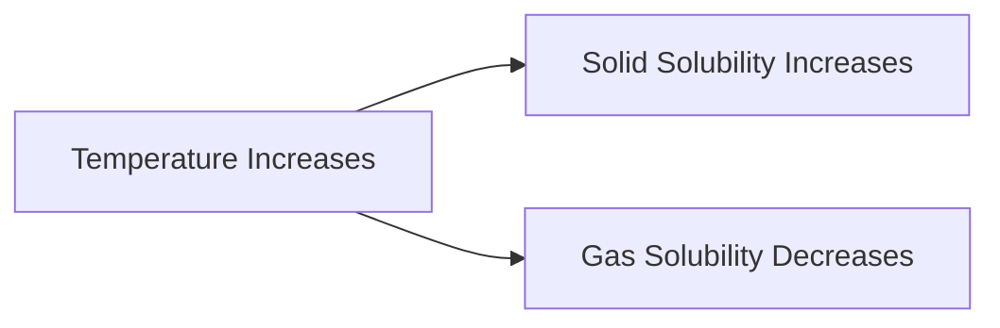

<<<FILE_START: index.mdx>>>
---
title: "The Amazing World of Solutes, Solvents, and Solutions"
description: "Chapter 9 overview covering solutions, solubility, density, and buoyancy."
date: 2025-01-15
tags: ["solutions", "density", "buoyancy", "grade-8"]
order: 1
draft: false
---

import Callout from '@/components/Callout.astro'

## Introduction

Why does salt dissolve in water but not in oil? Why does a massive ship float while a tiny stone sinks? This chapter explores the science of mixing substances and the principles of density and buoyancy.

We will learn how solutions are formed, what limits solubility, and how to measure the density of objects to predict if they will float or sink.

### Chapter Roadmap

*   **Topic 1:** [Solutions](/topics/01-solutions) (Solute, Solvent, and Types of Mixtures)
*   **Topic 2:** [Solubility](/topics/02-solubility) (Saturated solutions and Temperature effects)
*   **Topic 3:** [Density](/topics/03-density) (Mass, Volume, and Calculations)
*   **Topic 4:** [Floating and Sinking](/topics/04-floating-and-sinking) (Buoyancy and Archimedes' Principle)

### Key Definitions

| Term | Definition |
| :--- | :--- |
| **Solution** | A uniform mixture of a solute dissolved in a solvent. |
| **Solute** | The substance being dissolved (usually in smaller quantity, e.g., Salt). |
| **Solvent** | The substance doing the dissolving (usually in larger quantity, e.g., Water). |
| **Saturated Solution** | A solution in which no more solute can be dissolved at a given temperature. |
| **Density** | Mass per unit volume ($D = M/V$). |
| **Buoyancy** | The upward force exerted by a fluid on an object placed in it. |

```mermaid
graph TD
    Mix[Mixture] --> Uniform[Uniform (Solution)]
    Mix --> NonUniform[Non-Uniform]

    Uniform --> Solute[Solute (Solid/Gas)]
    Uniform --> Solvent[Solvent (Liquid)]

    Solvent --> Water[Water (Universal Solvent)]

    Properties[Properties] --> Solubility[Solubility]
    Properties --> Density[Density]

    Density --> Float[Float (Low Density)]
    Density --> Sink[Sink (High Density)]
```
<<<FILE_END>>>
<<<FILE_START: topics/01-solutions.mdx>>>
---
title: "Solutions, Solutes, and Solvents"
description: "Understanding the components of a solution."
date: 2025-01-15
tags: ["solution", "mixture", "chemistry"]
order: 1
draft: false
---

import Callout from '@/components/Callout.astro'

## What is a Solution?

A **Solution** is a uniform (homogeneous) mixture of two or more substances.
*   **Components:**
    1.  **Solute:** The substance that dissolves (e.g., Salt, Sugar).
    2.  **Solvent:** The substance in which the solute dissolves (e.g., Water).

$$
\text{Solute} + \text{Solvent} \rightarrow \text{Solution}
$$

### Examples
1.  **Salt Water:** Salt (Solute) + Water (Solvent).
2.  **Air:** A gaseous solution where Nitrogen is the solvent (largest quantity) and Oxygen/Argon are solutes.
3.  **ORS:** Oral Rehydration Solution is a uniform mixture of salt, sugar, and water.

<Callout variant="info">
**Uniform vs. Non-Uniform:**
*   **Uniform:** Salt in water. Every sip tastes the same.
*   **Non-Uniform:** Sand in water. Sand settles at the bottom; it is not evenly distributed.
</Callout>

### Concentration
*   **Dilute Solution:** Contains a small amount of solute.
*   **Concentrated Solution:** Contains a large amount of solute.
<<<FILE_END>>>
<<<FILE_START: topics/02-solubility.mdx>>>
---
title: "Solubility and Saturation"
description: "How much solute can dissolve? Effect of temperature on solubility."
date: 2025-01-15
tags: ["solubility", "saturation", "temperature"]
order: 2
draft: false
---

import Callout from '@/components/Callout.astro'

## Saturation

If you keep adding salt to a glass of water, eventually it stops dissolving and settles at the bottom.
*   **Saturated Solution:** A solution that cannot dissolve any more solute at that temperature.
*   **Unsaturated Solution:** A solution that can still dissolve more solute.

## Effect of Temperature

### 1. Solids in Liquids
**Rule:** Solubility of solids generally **increases** with temperature.
*   *Experiment:* If you heat a saturated solution of baking soda, the undissolved soda at the bottom will dissolve. A saturated solution becomes unsaturated upon heating.

### 2. Gases in Liquids
**Rule:** Solubility of gases generally **decreases** with temperature.
*   *Example:* Aquatic life prefers cold water because it contains more dissolved Oxygen than hot water. When you boil water, you see bubbles forming early on—this is dissolved air escaping as solubility drops.


<<<FILE_END>>>
<<<FILE_START: topics/03-density.mdx>>>
---
title: "Density: Mass and Volume"
description: "Calculating density and understanding why objects are 'heavy' or 'light'."
date: 2025-01-15
tags: ["density", "physics", "formula"]
order: 3
draft: false
---

import Callout from '@/components/Callout.astro'

## What is Density?

Density is a measure of how "packed" matter is in an object. It is defined as mass per unit volume.

$$
\text{Density} (\rho) = \frac{\text{Mass } (m)}{\text{Volume } (V)}
$$

*   **SI Unit:** $kg/m^3$
*   **Common Unit:** $g/cm^3$ or $g/mL$

### Measuring Density
To find the density of an irregular stone:
1.  **Find Mass ($m$):** Weigh it on a digital balance.
2.  **Find Volume ($V$):** Use the water displacement method in a measuring cylinder.
    *   $V = \text{Final Water Level} - \text{Initial Water Level}$.
3.  **Calculate:** Divide Mass by Volume.

<Callout variant="tip">
**Example:**
*   Mass of stone = 50 g
*   Volume of stone = 20 cm³
*   Density = $50 / 20 = 2.5 \text{ g/cm}^3$
</Callout>

### Factors Affecting Density
1.  **Temperature:** generally, heating causes expansion (Volume increases), so **Density decreases**.
    *   *Hot air rises because it is less dense than cold air.*
2.  **Pressure:** High pressure compresses gases (Volume decreases), so **Density increases**.
<<<FILE_END>>>
<<<FILE_START: topics/04-floating-and-sinking.mdx>>>
---
title: "Floating and Sinking"
description: "Why do some objects float? The role of density."
date: 2025-01-15
tags: ["floating", "buoyancy", "ice"]
order: 4
draft: false
---

import Callout from '@/components/Callout.astro'

## The Rule of Floatation

Whether an object floats or sinks depends (mostly) on its density relative to the fluid.

*   **Float:** If Object Density < Fluid Density.
*   **Sink:** If Object Density > Fluid Density.

### Examples
1.  **Wood vs Iron:** Wood floats on water ($<1 \text{ g/cm}^3$) while Iron sinks ($>1 \text{ g/cm}^3$).
2.  **Oil on Water:** Oil floats because it is less dense than water.
3.  **Ice on Water:** Ice floats because water expands when it freezes, making ice less dense than liquid water. This is crucial for aquatic life in winter!

### The Egg Experiment
*   **Fresh Water:** An egg sinks (Egg is denser than tap water).
*   **Salt Water:** If you dissolve lots of salt, the water becomes denser. Eventually, the **Salt Water is denser than the egg**, and the egg floats!

<div class="flex justify-center my-6">
  <svg width="200" height="250" viewBox="0 0 200 250" xmlns="http://www.w3.org/2000/svg">
    <!-- Beaker -->
    <rect x="50" y="50" width="100" height="150" fill="none" stroke="currentColor" stroke-width="2" />
    <!-- Water -->
    <rect x="50" y="80" width="100" height="120" fill="#e0f7fa" opacity="0.5" />

    <!-- Egg Floating -->
    <ellipse cx="100" cy="100" rx="20" ry="25" fill="#fff9c4" stroke="#fbc02d" stroke-width="2" />

    <!-- Salt Particles -->
    <circle cx="60" cy="150" r="2" fill="gray" />
    <circle cx="80" cy="180" r="2" fill="gray" />
    <circle cx="120" cy="160" r="2" fill="gray" />
    <circle cx="140" cy="190" r="2" fill="gray" />

    <text x="100" y="220" text-anchor="middle" font-size="12">Floating Egg in Salt Water</text>
  </svg>
</div>
<<<FILE_END>>>
<<<FILE_START: solutions/intro-questions.mdx>>>
---
title: "Introductory Questions Solutions"
description: "Answers to Probe and Ponder questions."
date: 2025-01-15
tags: ["solutions", "intro"]
order: 1
draft: false
---

import Callout from '@/components/Callout.astro'

## Page 1: Probe and Ponder

**Q1: What is happening in the picture?**
**Answer:** The picture shows people collecting salt. They likely use sea water, allow it to evaporate in shallow pits, leaving the salt (solute) behind. This demonstrates the separation of a dissolved solid from a liquid solvent.

**Q2: What happens when you add too much sugar to tea?**
**Answer:** When you add too much sugar, the solution becomes **saturated**. The extra sugar stops dissolving and settles at the bottom.
*   **Solution:** You can dissolve it by **heating** the tea (increasing temperature increases solubility).

**Q3: Why do sugar/salt dissolve in water but not oil?**
**Answer:** Water is a polar solvent ("like dissolves like"), good for dissolving ionic/polar substances like salt and sugar. Oil is non-polar and cannot break the bonds in salt/sugar crystals effectively.

**Q4: Why are water bottles tall and cylindrical?**
**Answer:** Cylindrical shapes are structurally strong (withstand pressure evenly), easy to hold, and efficient for packing/transport compared to spheres which would roll away and waste space between them.
<<<FILE_END>>>
<<<FILE_START: solutions/exercises.mdx>>>
---
title: "Chapter Exercises Solutions"
description: "Detailed solutions for the exercises on pages 16-18."
date: 2025-01-15
tags: ["solutions", "exercises", "grade-8"]
order: 2
draft: false
---

import Callout from '@/components/Callout.astro'

## Questions and Answers

### 1. True/False
(i) Oxygen is more soluble in hot water. **(False)** - Gas solubility decreases with heat.
(ii) Sand and water is a solution. **(False)** - It is a non-uniform mixture (Suspension).
(iii) Space occupied is mass. **(False)** - Space is Volume.
(iv) Unsaturated has more solute than saturated. **(False)** - Saturated has the maximum possible.
(v) Mixture of gases is a solution. **(True)** - Air is a gaseous solution.

### 2. Fill in the Blanks
(i) immersed/dipped; rise/increase.
(ii) solute; solvent (or solution).
(iii) decreases. (Heating expands volume, Mass stays same, so $D=M/V$ decreases).
(iv) saturated.

### 3. Oil on Water
**Answer:** (i) **Oil is lighter (less dense) than water.** *Note: The question asks "Oil floats... what does this tell you?". Usually implies lesser density.* However, technically "Lighter" is a vague term, "Less Dense" is scientific.
*Checking options:* (i) Oil is denser (False), (ii) Water is denser (True), (iii) Same density (False), (iv) Dissolves (False).
**Correct Selection:** (ii) Water is denser than oil (or Oil is less dense than water).

### 4. Stone Density
*   Mass ($m$) = 225 g
*   Volume ($V$) = 90 cm³
*   Density = $225 / 90 = 2.5 \text{ g/cm}^3$.
*   **Prediction:** Water density is $1 \text{ g/cm}^3$. Since $2.5 > 1$, the stone will **sink**.

### 5. Saturated Solution Statement
**Answer:** (iii) **No more solute can be dissolved into the saturated solution at that temperature.** (This is the definition).

### 6. Bottle Capacity
*   Total Capacity = 2 Litres = 2000 mL.
*   Filled = 500 mL.
*   More needed = $2000 - 500 = 1500 \text{ mL}$ (or 1.5 Litres).

### 7. Calculate Density
*   $m$ = 400 g
*   $V$ = 40 cm³
*   Density = $400 / 40 = 10 \text{ g/cm}^3$.

### 8. Orange Float/Sink (Fig 9.25)
*   **Unpeeled Orange:** Floats. The peel contains porous air pockets, lowering the overall density of the orange to less than water.
*   **Peeled Orange:** Sinks. Without the airy peel, the dense fruit flesh is denser than water.

### 9. Which is Denser?
*   **Object A:** $D = 200 / 40 = 5 \text{ g/cm}^3$.
*   **Object B:** $D = 240 / 60 = 4 \text{ g/cm}^3$.
*   **Answer:** **Object A** is denser.

### 10. Clay Modeling
**Answer:** Density will **remain the same**.
*   Density is an intrinsic property of the material. Changing shape (cube to sheet) does not change the Mass or the Volume of the material itself.

### 11. Iron Block Volume
*   Mass = 600 g
*   Density = 7.9 g/cm³
*   Formula: $V = m / D$
*   $V = 600 / 7.9 \approx 75.95 \text{ cm}^3$.

### 12. Hot Water Experiment (Fig 9.26)
*   **Observation:** Water level rises in the tube when placed in hot water.
*   **Reason:** Heat causes water to **expand** (Volume increases).
*   **Effect on Density:** Since Mass is constant and Volume increases, Density **decreases**.

<<<FILE_END>>>
<<<FILE_START: practice/density-problems.mdx>>>
---
title: "Practice: Density Problems"
description: "Extra problems to master density calculations."
date: 2025-01-15
tags: ["practice", "math", "density"]
order: 1
draft: false
---

import Callout from '@/components/Callout.astro'

## Problem 1: The Golden Cube

A cube of gold has a side length of 2 cm. The density of gold is $19.3 \text{ g/cm}^3$. What is the mass of the cube?

**Solution:**
1.  **Find Volume:** $V = side \times side \times side = 2 \times 2 \times 2 = 8 \text{ cm}^3$.
2.  **Use Formula:** $\text{Mass} = \text{Density} \times \text{Volume}$.
3.  **Calculate:** $Mass = 19.3 \times 8 = 154.4 \text{ g}$.

## Problem 2: The Mystery Liquid

You have a beaker weighing 50g. You add 100 mL of a mystery liquid. The combined weight is 130g. What is the density of the liquid?

**Solution:**
1.  **Find Liquid Mass:** $130\text{g (Total)} - 50\text{g (Beaker)} = 80\text{g}$.
2.  **Liquid Volume:** 100 mL (which is $100 \text{ cm}^3$).
3.  **Calculate:** $\text{Density} = 80 / 100 = 0.8 \text{ g/cm}^3$.
*   *Inference:* This is likely alcohol or oil (less dense than water).

## Problem 3: Relative Density

The relative density of Silver is 10.8. The density of water is $1000 \text{ kg/m}^3$. What is the density of Silver in SI units?

**Solution:**
*   $\text{Relative Density} = \frac{\text{Density of Substance}}{\text{Density of Water}}$.
*   $10.8 = \frac{\text{Density of Silver}}{1000}$.
*   $\text{Density of Silver} = 10.8 \times 1000 = 10,800 \text{ kg/m}^3$.

<<<FILE_END>>>
