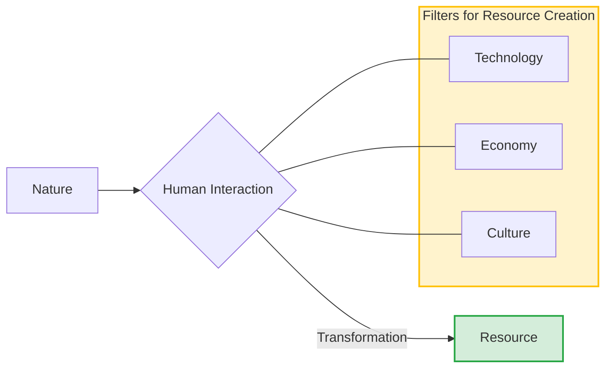
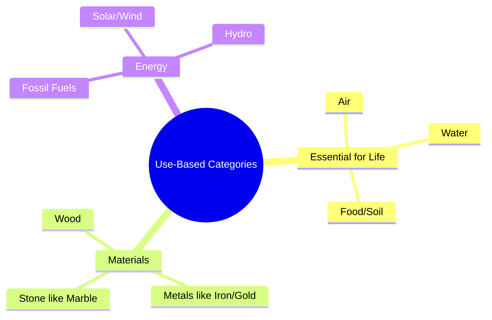
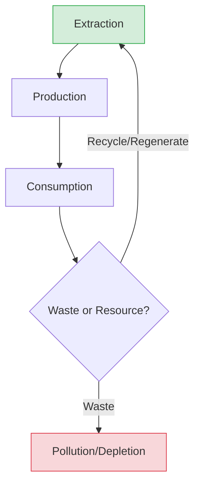

<<<FILE_START: index.mdx>>>
---
title: "Natural Resources and Their Use"
description: "An overview of natural resources, their classification, distribution, and the importance of sustainable stewardship."
date: 2024-04-10
tags: ["social-science", "geography", "natural-resources", "sustainability", "grade-8"]
order: 1
draft: false
---

import Callout from '@/components/Callout.astro'

## Introduction

Natural resources are the foundation of all life and economic activity on Earth. From the air we breathe to the metals used in our smartphones, everything originates from Nature. This chapter explores how we define resources, how we categorize them, and the critical balance required to sustain them for future generations.

We must move towards a **regenerative economy**—one that operates in harmony with nature, minimizing waste and replenishing what is used.

<Callout variant="tip">
**Quote to Ponder:**
"We must return to the innate wisdom of nature herself, the ultimate regenerator and recycler of all resources."
— *Christiana Figueres and Tom Rivett-Carnac*
</Callout>

### The Big Questions
This chapter helps us answer three fundamental questions:
1. **How do we categorise natural resources?** (By use, renewability, etc.)
2. **What is the connection between the distribution of natural resources and different aspects of life?** (Economy, conflict, trade).
3. **What are the implications of unsustainable use or over-exploitation?** (Climate change, resource depletion, pollution).

### Chapter Roadmap

| Topic | Description |
| :--- | :--- |
| **Meaning & Criteria** | When does nature become a "resource"? |
| **Categories** | Essential for life, Materials, and Energy sources. |
| **Renewability** | Understanding restoration, regeneration, and the limits of renewable resources. |
| **Distribution** | The "Resource Curse", geopolitical conflicts, and uneven distribution. |
| **Stewardship** | Case studies from Punjab (Groundwater) to Sikkim (Organic Farming). |

### Key Formula for Resource Validity

For an element of nature to be considered a resource, it must pass three filters:

$$
\text{Resource} = \text{Technologically Accessible} + \text{Economically Feasible} + \text{Culturally Acceptable}
$$

<<<FILE_END>>>
<<<FILE_START: topics/01-meaning-and-criteria.mdx>>>
---
title: "Meaning and Criteria of Resources"
description: "Defining when elements of nature become resources and the criteria for their usability."
date: 2024-04-10
tags: ["definition", "nature", "utility"]
order: 2
draft: false
---

import Callout from '@/components/Callout.astro'

## When Does Nature Become a Resource?

The word **'Nature'** refers to the totality of life and non-life forms in our environment not created by humans. However, not everything in nature is automatically a "resource."

<Callout variant="tip">
**Definition:** Elements of Nature become **resources** only when humans use them for sustenance or create new things from them for utility/consumption.
</Callout>

**Example:**
*   A tree standing in a forest is part of the **environment**.
*   When we cut it to make furniture or use its fruit for food, it becomes a **resource**.

### The Three Criteria
Often, resources are not easily accessible. Petroleum might exist deep under the ocean, but without the right machinery, it is useless to us. Therefore, three criteria determine if an entity is a resource:

1.  **Technologically Accessible:** Do we have the tools and knowledge to extract or use it?
2.  **Economically Feasible:** Is the cost of extraction lower than the value of the resource?
3.  **Culturally Acceptable:** Does the extraction violate cultural or religious beliefs (e.g., sacred groves)?

### The Concept of Exploitation
Usually, "exploitation" has a negative meaning. However, in the context of natural resources, it technically refers to:
1.  **Extraction**
2.  **Utilisation**
3.  **Consumption**

The Earth has formed treasures like water, air, soil, coal, petroleum, and minerals over millions of years. Humans have learned to identify and exploit these for their benefit.

<<<FILE_END>>>
<<<FILE_START: topics/02-categories-by-use.mdx>>>
---
title: "Categorisation by Use"
description: "Classifying natural resources based on their utility: essential for life, materials, and energy."
date: 2024-04-10
tags: ["classification", "utility", "energy"]
order: 3
draft: false
---

import Callout from '@/components/Callout.astro'

## Categorising Natural Resources

Categorisation helps us communicate ideas effectively. In Science, you classify things as living or non-living. Similarly, in Geography, we categorize resources based on specific criteria. One major method is **based on their use**.

### 1. Resources Essential for Life
These are resources without which biological survival is impossible. We cannot "manufacture" these; we can only take them from Nature.
*   **Air:** Taken from the atmosphere.
*   **Water:** Taken from rivers, ponds, and aquifers.
*   **Soil/Food:** Cultivation relies on soil and biological organisms.

### 2. Resources for Materials
Humans create physical objects using gifts from Nature. We transform raw materials into utilities or art.
*   **Wood:** Transformed into chairs, paper, or statues.
*   **Minerals:** Gold for jewelry, marble for construction, iron for machinery.
*   **India's Diversity:** India's vast geographical diversity provides a wide array of material resources, from timber in the northeast to marble in Rajasthan.

### 3. Resources for Energy
Energy is the cornerstone of modern civilization. It powers buildings, transportation, and industrial production.
*   **Fossil Fuels:** Coal, petroleum, natural gas.
*   **Renewables:** Sunlight, wind, flowing water.

<<<FILE_END>>>
<<<FILE_START: topics/03-renewability-and-regeneration.mdx>>>
---
title: "Renewability and Regeneration"
description: "Understanding renewable vs non-renewable resources and the cycles of nature."
date: 2024-04-10
tags: ["renewable", "non-renewable", "regeneration", "cycles"]
order: 4
draft: false
---

import Callout from '@/components/Callout.astro'

## Restoration and Regeneration

Nature functions on a principle of restoration.
*   **Restoration:** Returning something to its original healthy state after damage (e.g., a cut on skin healing).
*   **Regeneration:** Creating new life and conditions for thriving (e.g., a forest growing back after a fire).

<Callout variant="tip">
**Nature's Cycle:** In a forest, there is no waste. A fallen tree decomposes, feeding bacteria and fungi, enriching the soil, which in turn nurtures new seeds. This is a perfect closed loop.
</Callout>

### 1. Renewable Resources
Resources that can renew themselves over time through natural processes.
*   **Examples:** Solar energy, wind, water (replenished by rain/glaciers), forests (if allowed to regrow).

**The Critical Condition:**
Renewable resources remain renewable **only if** the rate of harvest does not exceed the rate of regeneration.
$$
\text{Sustainability Condition:} \quad \text{Rate of Extraction} \le \text{Rate of Regeneration}
$$
*   **Threat:** If we cut trees faster than they grow, forests become a non-renewable resource effectively.
*   **Impact:** Climate change and deforestation are disturbing these natural cycles (e.g., Himalayan glaciers melting faster than snowfall can replace them).

### 2. Non-Renewable Resources
Resources created over millions of years that cannot be replenished within a human timeframe.
*   **Examples:** Fossil fuels (coal, petroleum), minerals (iron, copper, gold).
*   **Status in India:** India has significant coal reserves, but at current consumption rates, they may only last another 50 years.

<Callout variant="warning">
**Resource Exhaustion:** Since non-renewables are finite, they must be used **judiciously** to stretch their availability for future generations while we transition to sustainable alternatives.
</Callout>

### Ecosystem Functions vs. Services
*   **Ecosystem Functions:** Natural workings of nature (e.g., a forest filtering water, preventing soil erosion).
*   **Ecosystem Services:** When these functions benefit humans (e.g., receiving clean drinking water, pollinated crops).

<<<FILE_END>>>
<<<FILE_START: topics/04-distribution-and-implications.mdx>>>
---
title: "Distribution and Implications"
description: "How uneven resource distribution leads to trade, conflict, and the resource curse."
date: 2024-04-10
tags: ["distribution", "geopolitics", "resource-curse"]
order: 5
draft: false
---

import Callout from '@/components/Callout.astro'

## Uneven Distribution

Natural resources are not distributed evenly across the Earth or within India.
*   **Geology determines availability:** Coal is found in sedimentary basins (e.g., Jharkhand, Odisha), while hydro power is viable in mountainous regions (e.g., Himachal Pradesh).
*   **Implications:** This inequality shapes human settlements, trade patterns, and international relations.

### The Impact of Distribution
1.  **Economic Growth:** Industries develop near resources (e.g., Steel plants near coal/iron mines), creating townships and employment.
2.  **Displacement:** Local populations (often indigenous) are frequently displaced to make way for mining or dams.
3.  **Conflict:**
    *   **International:** Wars have been fought to gain control over oil and minerals.
    *   **Inter-state:** Example: The conflict over sharing **Kaveri River** water between Karnataka, Tamil Nadu, Kerala, and Puducherry.

### The "Natural Resource Curse"

Economists observe a phenomenon called the **"Paradox of Plenty"** or the **"Natural Resource Curse"**.

<Callout variant="danger">
**Concept:** Having abundant natural resources does not guarantee a country is rich. In fact, resource-rich regions often experience *slower* economic growth.
</Callout>

**Why does this happen?**
1.  Economies rely solely on exporting raw materials.
2.  Failure to develop manufacturing industries that turn resources into high-value products.
3.  Corruption and conflict over the resource revenues.

**India's Approach:** India has generally avoided this by investing in industries (Factors of Production) to process resources domestically.

### Map: Mineral Distribution in India
*(Refer to Fig 1.11 in your textbook)*
*   **Iron Ore:** Found heavily in the Odisha-Jharkhand belt and Karnataka (Kudremukh, Ballari).
*   **Coal:** Concentrated in the central-eastern belt (Jharia, Bokaro, Talcher).
*   **Oil:** Found in Assam (Digboi), Gujarat (Ankleshwar), and offshore (Mumbai High).

<<<FILE_END>>>
<<<FILE_START: topics/05-case-studies-stewardship.mdx>>>
---
title: "Stewardship and Case Studies"
description: "Real-world examples of resource management: Groundwater in Punjab, Organic farming in Sikkim, and Solar Energy."
date: 2024-04-10
tags: ["case-study", "punjab", "sikkim", "solar", "conservation"]
order: 6
draft: false
---

import Callout from '@/components/Callout.astro'

## Stewardship: Responsible Use

**Stewardship** means acting as caretakers of the Earth. It involves using resources in a way that enables the restoration of renewables and the judicious use of non-renewables.

### Case Study 1: Groundwater in Punjab (The Crisis)
Punjab was the heart of the **Green Revolution**, making India food self-sufficient. However, this came at a high ecological cost.

*   **Cause:**
    1.  Shift to water-intensive crops (Paddy/Rice) in the 1960s.
    2.  Free electricity supply encouraged over-pumping.
*   **Effect:**
    1.  Groundwater levels dropped drastically (inaccessible up to 30 meters depth in some areas).
    2.  80% of Punjab is classified as 'over-exploited'.
    3.  Chemical fertilizers/pesticides leached into water, causing health hazards.
*   **Lesson:** Food security was ensured for the short term, but long-term sustainability was compromised.

### Case Study 2: Organic Farming in Sikkim (The Solution)
Sikkim provides a contrasting success story of **Sustainable Agriculture**.

*   **The Transition:** Faced with declining yields and debt from chemicals, the state promoted organic farming.
*   **Method:**
    1.  Banned chemical inputs.
    2.  Used compost, neem/garlic repellents.
    3.  Adopted mixed cropping.
*   **Result:** In 2016, Sikkim became a **100% Organic State**.
    *   Biodiversity returned (insects/birds).
    *   Farmers' income grew by 20%.
    *   Tourism boomed.

<Callout variant="info">
**Traditional Wisdom:** *Vrikshayurveda* (Science of plant life) is an ancient text from the 10th century CE that documents sustainable practices like crop rotation and natural pest management.
</Callout>

### Case Study 3: The Cement Industry (Pollution Challenge)
Cement is essential for modern infrastructure but is highly polluting.
*   **Impact:** Releases fine dust damaging lungs and reducing plant yields.
*   **Mitigation:** Guidelines by the Central Pollution Control Board and a shift towards alternative materials (mud, recycled plastic).

### Case Study 4: International Solar Alliance (Renewable Future)
To combat reliance on fossil fuels, India and France launched the **International Solar Alliance (ISA)** in 2015.
*   **Goal:** Harness solar power in sunshine-rich countries.
*   **Example:** The **Bhadla Solar Park** in Rajasthan is a symbol of this transition.
*   **Lokasangraha:** A concept from the *Bhagavad Gita* meaning acting for the wellbeing of all—a guiding principle for global environmental cooperation.

<<<FILE_END>>>
<<<FILE_START: solutions/ex-1.1.mdx>>>
---
title: "Chapter Exercises Solution"
description: "Detailed solutions to the Questions and Activities found at the end of Chapter 1."
date: 2024-04-10
tags: ["solutions", "exercises", "chapter-1"]
order: 7
draft: false
---

import Callout from '@/components/Callout.astro'

## Questions and Activities

### 1. What can make what is today a renewable resource non-renewable tomorrow? Describe some actions that can prevent this from happening.

**Answer:**
A renewable resource can become effectively non-renewable if the **rate of extraction exceeds the rate of regeneration**. Nature requires a specific time to heal and replenish. If we disturb this rhythm, the resource stock depletes faster than it can grow back.

*   **Example:** Groundwater is renewable via rain, but in Punjab, it is extracted faster than rain can replenish it, leading to dried-up aquifers. Similarly, forests are renewable, but rapid deforestation turns them into barren land.
*   **Preventive Actions:**
    1.  **Sustainable Harvest:** Following regulations (e.g., fishing bans during spawning seasons).
    2.  **Afforestation:** Planting more trees than are cut.
    3.  **Water Harvesting:** Capturing rainwater to recharge aquifers.
    4.  **Circular Economy:** Recycling and reusing materials to reduce demand on fresh resources.

### 2. Name five ecosystem functions that serve humans.

**Answer:**
Ecosystem functions become "services" when they benefit humans. Five key functions include:
1.  **Production of Oxygen:** Trees and plants produce oxygen essential for human life.
2.  **Water Filtration:** Forests and soil naturally filter pollutants from water, providing clean groundwater.
3.  **Soil Formation & Nutrient Cycling:** Decomposition of organic matter enriches soil for agriculture.
4.  **Pollination:** Insects and birds pollinate crops, ensuring food production.
5.  **Climate Regulation:** Forests absorb carbon dioxide and regulate local temperatures and rainfall patterns.

### 3. What are renewable resources? How are they different from non-renewable ones? What can people do to ensure that renewable resources continue to be available for our use and that of future generations? Give two examples.

**Answer:**
*   **Definition:** Renewable resources are those that can be replenished or reproduced by physical, chemical, or mechanical processes within a human timeframe (e.g., solar energy, wind, forests).
*   **Difference:**
    *   *Renewable:* Unlimited or regenerates quickly (Sun, Wind).
    *   *Non-Renewable:* Finite and takes millions of years to form (Coal, Petroleum).
*   **Ensuring Availability (Stewardship):**
    We must respect the **cycle of regeneration**.
    *   *Example 1 (Water):* Use drip irrigation and rainwater harvesting to prevent groundwater depletion.
    *   *Example 2 (Soil):* Use organic fertilizers (compost) and crop rotation instead of chemicals to maintain soil health (as seen in Sikkim).

### 4. Identify cultural practices in your home and neighbourhood that point to mindfulness in the use of natural resources.

**Answer:**
*(Note: Students can answer this based on personal observation, but here are standard examples based on the text)*
1.  **Sacred Groves:** Treating patches of forests as sacred prevents tree cutting.
2.  **River Worship:** Practices like offering *Arghyam* to the Sun or worshipping rivers (Ganga, Kaveri) traditionally promoted keeping water bodies clean (though modern pollution challenges this).
3.  **Reuse/Recycling:** Traditional Indian households often reuse containers, clothes, and water (e.g., using water from washing vegetables for plants).
4.  **Food Habits:** Eating seasonal and local produce reduces the carbon footprint associated with transport and storage.

### 5. What are some considerations to keep in mind in the production of goods for our current use?

**Answer:**
When producing goods, we must consider:
1.  **Source Sustainability:** Are raw materials being sourced without permanently damaging the ecosystem?
2.  **Pollution Control:** Does the manufacturing process release harmful waste? (e.g., Cement dust or chemical effluents).
3.  **Waste Management:** Can the final product be recycled or is it biodegradable?
4.  **Social Impact:** Does the production displace local communities or exploit labor?
5.  **Efficiency:** Maximizing output while minimizing energy and raw material input.

<<<FILE_END>>>
<<<FILE_START: practice/solved-activities.mdx>>>
---
title: "Let's Explore: Activities & Analysis"
description: "Solutions and guidance for the in-text 'Let's Explore' activities found throughout the chapter."
date: 2024-04-10
tags: ["practice", "critical-thinking", "activities"]
order: 8
draft: false
---

import Callout from '@/components/Callout.astro'

## In-Text Activity Solutions

### 1. Identifying Human Interventions (Page 7)
**Prompt:** Identify human actions in your surroundings that result in Nature losing her ability to restore and regenerate. What interventions can restore Nature’s cycle?

**Analysis:**
*   **Harmful Actions:**
    *   **Concretization:** Covering soil with concrete prevents rainwater from seeping in, stopping groundwater recharge.
    *   **Plastic Waste:** Dumping plastic in rivers chokes aquatic life and prevents natural water purification.
    *   **Stubble Burning:** Destroys soil nutrients and kills friendly bacteria necessary for soil regeneration.
*   **Restorative Interventions:**
    *   **Desilting ponds:** Allows better water storage.
    *   **Planting native trees:** Restores local biodiversity.
    *   **Composting:** Returns organic nutrients to the soil.

### 2. Renewable Resources in Your Region (Page 8)
**Prompt:** Assess the types of renewable resources in your region. What has been the change in their status?

**Guidance for Students:**
*   *If you live in a City:* Look at **Air Quality**. Has it worsened due to vehicles? Look at **Groundwater**. Are borewells digging deeper every year?
*   *If you live in a Village:* Look at **Forest cover**. Has it reduced? Are **ponds** seasonal now instead of perennial?
*   *Report Focus:* Link the decline to population pressure and lack of conservation efforts.

### 3. Daily Use of Non-Renewables (Page 8)
**Prompt:** What non-renewable resources do you use daily? What are possible renewable substitutes?

| Daily Item | Non-Renewable Source | Renewable Substitute |
| :--- | :--- | :--- |
| **Electricity** | Coal (Thermal Power) | Solar Panels (Rooftop), Wind Energy |
| **Car/Bike Fuel** | Petroleum/Diesel | Electric Vehicles (charged via Solar), Bio-fuels |
| **Plastics** | Crude Oil | Bamboo, Jute, Starch-based bio-plastics |
| **Gold/Jewelry** | Mined Gold Ore | Recycled Gold, Lab-grown alternatives |

### 4. Mineral Distribution Map Analysis (Page 9)
**Prompt:** Observe the map in Fig 1.11. Notice uneven distribution.

**Observation:**
*   **Central/Eastern India (Jharkhand, Odisha, Chhattisgarh):** Rich in **Coal** and **Iron Ore**. This is why major steel plants (Bokaro, Jamshedpur) are located here.
*   **Western India (Gujarat/Maharashtra):** Rich in **Petroleum** (Ankleshwar, Mumbai High).
*   **Southern India (Karnataka):** Rich in **Iron Ore** and **Gold** (Kolar, Hutti).
*   **Implication:** Regions without these minerals must trade or buy them, creating economic dependency.

### 5. International Conflicts (Page 10)
**Prompt:** Find out about a conflict in the international context regarding natural resources.

**Example Case: The Nile River Conflict**
*   **Countries:** Egypt, Sudan, Ethiopia.
*   **Resource:** Water of the River Nile.
*   **Issue:** Ethiopia is building the "Grand Ethiopian Renaissance Dam" (GERD) to generate electricity. Egypt fears this will reduce the water flow reaching them, threatening their agriculture and survival.
*   **Parallel:** This is similar to the Kaveri River dispute in India, showing how trans-boundary resources require diplomatic sharing.

<<<FILE_END>>>
<<<FILE_START: practice/solved-examples.mdx>>>
---
title: "Extra Solved Examples & PYQs"
description: "Additional conceptual questions to test understanding of Natural Resources."
date: 2024-04-10
tags: ["extra-questions", "exam-prep"]
order: 9
draft: false
---

import Callout from '@/components/Callout.astro'

## Conceptual Questions

### Q1: Why is the distinction between "Stock" and "Reserve" important in resources?
*(Note: While not explicitly defined in this chapter text, this concept aids understanding "Technologically Accessible" and "Economically Feasible")*

*   **Stock:** All materials in the environment that have the potential to satisfy human needs (e.g., Hydrogen in water is a potential energy source).
*   **Reserve:** The subset of the stock that can be put into use with existing technology (e.g., Water in dams).
*   **Significance:** We must turn more stock into reserves through R&D (like making solar cells cheaper).

### Q2: Explain the term "Lokasangraha" in the context of resource management.
**Answer:**
"Lokasangraha" is a concept from the *Bhagavad Gita* mentioned in the chapter. It refers to the idea that individuals must transcend personal desires and act for the **wellbeing of all** (collective welfare).
*   In resource management, this means not hoarding or over-exploiting resources for personal profit but managing them so that the entire society and future generations benefit. It is the spiritual foundation of **Sustainability**.

### Q3: How does the "Natural Resource Curse" affect a nation's development?
**Answer:**
The "Natural Resource Curse" or "Paradox of Plenty" occurs when resource-rich countries fail to develop other sectors of their economy.
1.  **Over-reliance:** They rely only on selling raw materials (oil, coal).
2.  **Currency fluctuation:** High exports make local currency expensive, hurting other industries like manufacturing.
3.  **Neglect:** Education and innovation are often neglected.
*   **Result:** Despite having gold or oil, the general population remains poor (e.g., certain African or Latin American nations). India avoids this by using resources to build domestic industries.

### Diagram: The Sustainable Cycle
The goal of stewardship is to keep the resource loop closed.

<<<FILE_END>>>
