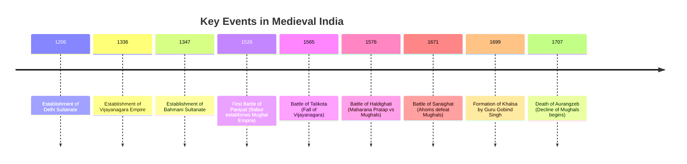

<<<FILE_START: index.mdx>>>
---
title: "Reshaping India's Political Map"
description: "An overview of India's political history from the 11th to 18th centuries, covering invasions, empires, resistance, and administration."
date: 2024-04-10
tags: ["history", "medieval-india", "mughals", "delhi-sultanate", "grade-8"]
order: 1
draft: false
---

import Callout from '@/components/Callout.astro'

## Introduction

A new era in India's journey began in the early 11th century. This period, often termed the **Medieval Period** (roughly 11th to 17th centuries), witnessed unprecedented invasions from beyond the Hindu Kush mountains, reshaping the political landscape of the Subcontinent.

This chapter explores the rise and fall of major powers like the **Delhi Sultanate** and the **Mughal Empire**, the resilience of regional kingdoms like **Vijayanagara** and the **Ahoms**, and the social and economic fabric of the time.

### The Big Questions
1.  **How did foreign invasions and the rise of new dynasties reshape India’s political boundaries?**
2.  **How did Indian society respond to invasions?** (Adaptation, resistance, and cultural synthesis).
3.  **What impact did this period have on the lives of the people?** (Economy, trade, and administration).

### Historical Timeline

The following timeline highlights key events that defined this era:

<Callout variant="info">
**Note on "Medieval":** The term originally referred to European history (between the Roman Empire and the Renaissance). In the Indian context, we use it to denote the period from the **11th to the 17th centuries**, a time of great transition, conflict, and cultural flowering.
</Callout>

### Chapter Roadmap

| Topic | Description |
| :--- | :--- |
| **Delhi Sultanate** | The rule of five dynasties and early resistance. |
| **Regional Powers** | The rise of Vijayanagara and the Bahmani Sultanate in the South. |
| **The Mughals** | From Babur to Aurangzeb: Consolidation, expansion, and policy shifts. |
| **Resistance** | The struggles of the Rajputs, Ahoms, Gonds, and Sikhs. |
| **Administration** | How these vast empires were governed (Iqta, Mansabdari). |

<<<FILE_END>>>
<<<FILE_START: topics/01-delhi-sultanate.mdx>>>
---
title: "The Delhi Sultanate"
description: "The rise of Turkic-Afghan dynasties in Delhi, their expansion, and the resistance they faced."
date: 2024-04-10
tags: ["delhi-sultanate", "alauddin-khilji", "tughlaq"]
order: 2
draft: false
---

import Callout from '@/components/Callout.astro'

## Rise and Fall of the Sultanate

The **Delhi Sultanate** was established after the defeat of Prithviraj Chauhan in 1192. It marked the beginning of rule by five successive dynasties of Turkic-Afghan origin:
1.  **Mamluks** (Slave Dynasty)
2.  **Khiljis** (Khaljis)
3.  **Tughlaqs**
4.  **Sayyids**
5.  **Lodis**

<Callout variant="warning">
**Political Instability:** The succession of power was often violent. Almost two out of three sultans seized power by eliminating their predecessor. The average reign of a sultan was hardly **nine years**.
</Callout>

### Key Rulers and Policies

#### Ala-ud-din Khilji (Early 14th Century)
*   **Military Expansion:** Conducted campaigns across north and central India.
*   **Defense:** Repelled several Mongol invasions.
*   **Self-Image:** Minted coins calling himself 'Sikander Sani' (The Second Alexander).
*   **Southward Expansion:** His general, **Malik Kafur**, raided wealthy southern kingdoms (Srirangam, Madurai), plundering immense wealth to finance the army.

#### Muhammad bin Tughlaq
*   **Ambition:** Controlled a vast part of the Subcontinent.
*   **Failed Experiments:**
    1.  **Capital Transfer:** Moved capital from Delhi to **Daulatabad** (Devagiri) to have a central base, then moved it back. This caused immense hardship and loss of life.
    2.  **Token Currency:** Introduced copper coins with the value of silver/gold. Without security features, counterfeiting became rampant, collapsing the economy.

### Resistance to the Sultanate
The Sultanate constantly faced resistance from neighboring kingdoms:
*   **Eastern Gangas (Odisha):** King **Narasimhadeva I** defeated the Sultanate's forces and built the Sun Temple at Konark.
*   **Hoysalas (South India):** Fended off attacks for a long time before eventually being absorbed into the rising Vijayanagara Empire.

### Impact on Society
*   **Plunder & Iconoclasm:** Wealth was often amassed by raiding temples. This was motivated by greed (plunder) and religious iconoclasm (destruction of idols).
*   **Taxation:** Imposition of **Jizya**, a discriminatory tax on non-Muslims.

<<<FILE_END>>>
<<<FILE_START: topics/02-vijayanagara-bahmani.mdx>>>
---
title: "Vijayanagara and Bahmani Kingdoms"
description: "The rise of regional powers in the Deccan and South India."
date: 2024-04-10
tags: ["vijayanagara", "hampi", "bahmani", "south-india"]
order: 3
draft: false
---

import Callout from '@/components/Callout.astro'

## The Vijayanagara Empire (1336–1646)

As the Delhi Sultanate weakened, a powerful empire emerged in the south. Established in **1336** by two brothers, **Harihara and Bukka**, Vijayanagara (City of Victory) became a bastion of resistance and cultural renaissance.

### Krishnadevaraya (16th Century)
The empire reached its zenith under **Krishnadevaraya**.
*   **Military:** Secured dominance over the Deccan.
*   **Culture:** Patronized Sanskrit, Telugu, and Kannada scholars. He wrote *Amuktamalyada* (Telugu epic on statecraft).
*   **Architecture:** Built grand temples like the **Vitthala Temple** with its musical pillars.
*   **Trade:** Foreign travelers (like Domingo Paes) described the capital (Hampi) as large as Rome, wealthy, and bustling with trade in horses, silk, and gems.

### Fall of Vijayanagara
*   **Battle of Talikota (1565):** The Deccan Sultanates formed a coalition and defeated the Vijayanagara army. The city was sacked and left in ruins.

## The Bahmani Sultanate
Established in **1347** as a rival to Vijayanagara in the Deccan.
*   It eventually fragmented into five independent **Deccan Sultanates**:
    1.  Bijapur
    2.  Golconda
    3.  Ahmednagar
    4.  Berar
    5.  Bidar

<Callout variant="tip">
**Titles of Power:**
*   Vijayanagara Kings: *Narapati* (Lord of Men)
*   Bahmani Rulers: *Ashwapati* (Lord of Horses)
*   Maratha Rulers: *Chhatrapati* (Lord of the Parasol/Sovereign)
*   Gajapati Rulers (Odisha): *Gajapati* (Lord of Elephants)
</Callout>

<<<FILE_END>>>
<<<FILE_START: topics/03-mughal-empire.mdx>>>
---
title: "The Mughal Empire"
description: "The establishment, consolidation, and eventual decline of the Mughal Empire in India."
date: 2024-04-10
tags: ["mughals", "akbar", "aurangzeb", "panipat"]
order: 4
draft: false
---

import Callout from '@/components/Callout.astro'

## Establishment: Babur
*   **Origin:** Babur, a descendant of Timur and Genghis Khan, came from Central Asia (Uzbekistan).
*   **First Battle of Panipat (1526):** Babur defeated **Ibrahim Lodi**.
*   **Technology:** His victory was due to the use of **gunpowder, field artillery, and matchlock guns**, which were new to Indian warfare.

## Consolidation: Akbar (r. 1556–1605)
Akbar ascended the throne at age 13. His reign represents a blend of conquest and diplomacy.
*   **Conquest:** Brutal seiges (e.g., Chittorgarh) initially, followed by strategic alliances.
*   **Diplomacy:** He married Rajput princesses and appointed Rajputs to high positions.
*   **Religious Policy:**
    *   Abolished the **Jizya** tax.
    *   Promoted **Sulh-i-kul** (Peace with all).
    *   Established the *Ibadat Khana* for interfaith dialogue.
    *   Translated Sanskrit texts (Mahabharata, Ramayana) into Persian.

## Expansion and Decline: Aurangzeb (r. 1658–1707)
Aurangzeb seized power after a bloody war of succession, executing his brothers (including Dara Shikoh) and imprisoning his father, Shah Jahan.
*   **Expansion:** The empire reached its greatest territorial extent.
*   **Policy Shift:**
    *   Reimposed **Jizya** and pilgrimage taxes.
    *   Banned music and dance at court.
    *   Ordered the destruction of temples (Kashi Vishwanath, Mathura) and Gurudwaras.
*   **The Decline:** His constant wars in the Deccan for 25 years drained the treasury. His harsh religious policies alienated the Rajputs, Sikhs, and Marathas, leading to endless rebellions.

<Callout variant="info">
**Comparison of Reigns:**
*   Delhi Sultans: Average reign ~9 years.
*   Mughals (up to Aurangzeb): Average reign ~27 years.
*   *Significance:* The Mughals achieved far greater stability and continuity.
</Callout>

<<<FILE_END>>>
<<<FILE_START: topics/04-resistance-struggles.mdx>>>
---
title: "Resistance Movements"
description: "Regional powers that resisted Mughal expansion: Rajputs, Ahoms, and Tribals."
date: 2024-04-10
tags: ["resistance", "rajputs", "ahoms", "gonds"]
order: 5
draft: false
---

import Callout from '@/components/Callout.astro'

## The Rajputs
The Rajputs of Rajasthan were fierce defenders of their independence.
*   **Rana Sanga:** Fought Babur at Khanwa.
*   **Maharana Pratap (Mewar):** Refused to submit to Akbar.
    *   **Battle of Haldighati (1576):** Fought valiantly against the Mughal army. Though the Mughals had the upper hand, Pratap escaped and waged **guerrilla warfare** from the Aravalli hills for years.
    *   **Tribal Support:** He was aided by the **Bhil** tribe, whose warriors are featured on the Mewar emblem.

## The Gonds
*   **Rani Durgavati (Garha Kingdom):** A valiant Gond queen who ruled a prosperous kingdom.
*   **Conflict:** She fought Akbar's army in 1564. Despite being outnumbered, she led her troops and ultimately took her own life to avoid capture. She remains a symbol of regional pride.

## The Ahoms (Assam)
The Ahoms migrated from Myanmar in the 13th century and established a kingdom in the Brahmaputra Valley.
*   **Paik System:** A unique system of forced labor/militia where every able-bodied man rendered service to the state. This allowed for a massive standing army.
*   **Battle of Saraighat (1671):**
    *   **Commander:** **Lachit Borphukan**.
    *   **Strategy:** Used the terrain (river, hills, forests) and guerrilla tactics to defeat the much larger Mughal fleet commanded by Ram Singh.
    *   **Result:** Ahoms preserved their independence.

## Other Rebellions
*   **Jat Peasantry:** Rebelled against oppressive Mughal taxation in the 17th century.
*   **Tribal Groups:** Bhils, Kolis, and Santhals frequently resisted annexation and taxation.

<<<FILE_END>>>
<<<FILE_START: topics/05-sikh-movement.mdx>>>
---
title: "Rise of the Sikhs"
description: "The transformation of Sikhism from a spiritual movement to a martial brotherhood."
date: 2024-04-10
tags: ["sikhism", "guru-nanak", "khalsa", "guru-gobind-singh"]
order: 6
draft: false
---

import Callout from '@/components/Callout.astro'

## Origins
*   **Guru Nanak (15th Century):** Founded Sikhism with the message of *Ik Onkar* (One God), equality, and compassion.
*   **Scripture:** *Guru Granth Sahib*, first compiled by Guru Arjan.

## Conflict with the State
As the movement grew, it faced persecution from Mughal rulers.
1.  **Guru Arjan:** Tortured to death by Jahangir.
2.  **Guru Hargobind:** Introduced martial training in response.
3.  **Guru Tegh Bahadur (9th Guru):**
    *   Stood up for the rights of Kashmiri Pandits facing forced conversion.
    *   Executed (beheaded) by Aurangzeb in 1675 at Chandni Chowk (site of **Gurudwara Sis Ganj Sahib**).

## The Khalsa
*   **Guru Gobind Singh (10th Guru):** Established the **Khalsa** in **1699**.
*   **Nature:** A martial brotherhood committed to justice and defense of the faith.
*   **Legacy:** The Sikhs fought relentless battles against the Mughals. Later, **Maharaja Ranjit Singh** united the confederacies into a powerful Sikh Empire in the 19th century.

<Callout variant="tip">
**Values:** Sikhism emphasizes *Seva* (service), truthfulness, and standing against tyranny.
</Callout>

<<<FILE_END>>>
<<<FILE_START: topics/06-administration-economy.mdx>>>
---
title: "Administration and Economy"
description: "How Medieval India was governed and how its economy functioned."
date: 2024-04-10
tags: ["administration", "economy", "mansabdari", "iqta"]
order: 7
draft: false
---

import Callout from '@/components/Callout.astro'

## Administrative Systems

### Delhi Sultanate: The Iqta System
*   **Structure:** Territories were assigned to nobles called **Iqtadars** (or Muqtis).
*   **Role:** Collect taxes from the region.
    *   Pay for their own troops.
    *   Send the surplus to the Sultan.
*   **Nature:** Posts were transferable and not hereditary (initially) to prevent rebellion.

### Mughal Empire: The Mansabdari System
Introduced by Akbar to organize the nobility and army.
*   **Mansabdar:** An officer holding a rank (*Mansab*).
*   **Rank:** Determined the number of horses/troops they had to maintain.
*   **Payment:** Paid via **Jagirs** (land revenue assignments).
*   **Checks & Balances:** Regular inspections and branding of horses.
*   **Raja Todar Mal:** Akbar's finance minister who introduced a standard revenue system based on detailed land surveys and crop yields.

## Economy and Trade
India remained one of the wealthiest regions in the world.
*   **Agriculture:** The mainstay of the economy. Revenue was typically 1/5th to 1/2 of the produce. Introduction of the **Persian Wheel** improved irrigation.
*   **Trade:**
    *   **Exports:** Textiles (cotton, silk), spices, indigo, sugar.
    *   **Imports:** Horses, metals, luxury goods.
    *   **Ports:** Surat, Calicut, Masulipatnam, Hooghly.
*   **Financial System:**
    *   **Hundi:** A traditional bill of exchange (like a traveler's cheque) allowing merchants to transfer money safely across borders without carrying cash.

## Society
*   **Temples:** acted as economic centers, functioning as banks and managing community infrastructure.
*   **Inequality:** While the courts were incredibly wealthy, the peasantry often faced harsh conditions and famines.

<<<FILE_END>>>
<<<FILE_START: solutions/ex-2.1.mdx>>>
---
title: "Chapter Exercises Solution"
description: "Detailed answers to the Questions and Activities from Chapter 2."
date: 2024-04-10
tags: ["solutions", "exercises", "grade-8"]
order: 8
draft: false
---

import Callout from '@/components/Callout.astro'

## Questions and Activities

### 1. Compare the political strategies of the Delhi Sultanate and the Mughals. What similarities and differences existed between them?

**Answer:**
*   **Similarities:**
    *   Both were of foreign origin (Turkic/Central Asian).
    *   Both relied on military conquest to establish power.
    *   Both used land-revenue assignment systems for administration (Iqta for Sultans, Jagir for Mughals).
*   **Differences:**
    *   **Succession:** Sultanate successions were often violent and unstable (avg reign 9 years). Mughals established a more stable dynastic rule (avg reign 27 years).
    *   **Integration:** The Sultanate often ruled by force and exclusion (Jizya). The Mughals, especially under Akbar, focused on assimilation, alliances (marrying Rajputs), and cultural synthesis.
    *   **Administration:** The Mughal **Mansabdari system** was more structured and centralized compared to the Iqtadari system.

### 2. Why did kingdoms like the Vijayanagara Empire and the Ahom Kingdom manage to resist conquest for a longer time compared to others?

**Answer:**
*   **Geography:**
    *   **Ahoms:** Used the difficult terrain of Assam (hills, dense forests, Brahmaputra river) to wage guerrilla warfare, which confused conventional armies.
    *   **Vijayanagara:** Located in the rocky terrain of the Deccan, far from the center of Muslim power in Delhi.
*   **Military Innovation:**
    *   **Ahoms:** The *Paik system* ensured a massive, mobilized militia.
    *   **Vijayanagara:** Built massive fortifications and maintained a powerful cavalry.
*   **Social Cohesion:** Both kingdoms fostered strong regional identities and integrated local populations/tribes into their defense.

### 3. Imagine you are a scholar in the court of Akbar or Krishnadevaraya. Write a letter to a friend describing the politics, trade, culture, and society you are witnessing.

**Answer:**
*(Student creativity required. Key points to include:)*
*   **If Akbar's Court:** Mention the *Ibadat Khana* (interfaith discussions), the presence of Jesuits and Rajputs, the translation of Mahabharata, and the busy construction of Fatehpur Sikri.
*   **If Krishnadevaraya's Court:** Mention the grandeur of Hampi, the musical pillars, the trade with Portuguese (buying horses), and the literary assemblies patronizing Telugu and Sanskrit.

### 4. How come Akbar, a ruthless conqueror in his young days, grew tolerant and benevolent after some years? What could have led to such a change?

**Answer:**
Akbar's shift was likely driven by:
1.  **Pragmatism:** He realized that to rule a vast, Hindu-majority land like India, he needed the support of the local populace (Rajputs), not their enmity.
2.  **Intellectual Curiosity:** He engaged with scholars of all faiths (Hindus, Muslims, Christians, Zoroastrians) in his *Ibadat Khana*, which broadened his worldview.
3.  **Maturation:** Moving away from the influence of orthodox regents (like Bairam Khan) allowed him to develop his own philosophy of *Sulh-i-kul* (Peace with all).

### 5. What might have happened if the Vijayanagara Empire had won the Battle of Talikota?

**Answer:**
If Vijayanagara had won:
*   **Political:** It would have likely remained the dominant power in South India, preventing the fragmentation that allowed the Mughals (and later the British) to penetrate the south easily.
*   **Cultural:** The destruction of Hampi would have been averted, preserving countless temples and manuscripts.
*   **Religious:** The balance of power in the Deccan would have remained tilted towards the Hindu empire rather than the Sultanates.

### 6. Many values promoted by early Sikhism, including equality, seva, and justice, remain relevant today. Select one of these values and discuss how it remains relevant.

**Answer:**
**Value: Seva (Selfless Service)**
*   **relevance:** In today's world of inequality and crisis, the Sikh practice of Seva is vital. We see it in *Langars* (community kitchens) feeding the hungry regardless of caste or religion, and in Sikh volunteers often being the first responders during natural disasters. It promotes community bonding and empathy, which are essential for a peaceful modern society.

### 7. Imagine you are a trader in a port city (Surat, Calicut or Hooghly). Describe the scenes you see.

**Answer:**
"I stand at the bustling port of Surat. The air smells of salt and spices. Ships from faraway lands—Arab dhows and large European vessels—are docked. I see bales of fine cotton textiles and indigo being loaded. Merchants are haggling in Persian and local dialects. Men are exchanging *Hundis* instead of heavy coin bags. There is a mix of people: Arab traders, Portuguese officials, and local Baniyas, all connected by the flow of gold and silver entering our land."

<<<FILE_END>>>
<<<FILE_START: practice/activity-solutions.mdx>>>
---
title: "Let's Explore & Think About It"
description: "Solutions to the in-text thinking prompts found throughout Chapter 2."
date: 2024-04-10
tags: ["practice", "critical-thinking", "activities"]
order: 9
draft: false
---

import Callout from '@/components/Callout.astro'

## In-Text Prompts

### Page 6: Why did Ala-ud-din Khilji call himself 'the second Alexander'?
**Answer:** Alexander the Great was known as a world conqueror. Ala-ud-din Khilji had immense territorial ambitions; he conquered large parts of India and even dreamed of a world conquest. By minting 'Sikander Sani' on his coins, he was projecting his image as an invincible emperor comparable to Alexander.

### Page 6: Resources for War
**Prompt:** What resources were needed to maintain an army?
**Answer:**
1.  **Money:** To pay soldiers (cash or land grants).
2.  **Food/Supplies:** Massive grain stores for men and animals.
3.  **Livestock:** Horses for cavalry, elephants for shock troops, oxen for transport.
4.  **Metal/Iron:** For weapons (swords, armor) and later, cannons.
5.  **Labor:** For building roads and forts.

### Page 8: Image vs Idol
**Prompt:** Why use 'image' instead of 'idol'?
**Answer:** 'Idol' often carries a negative connotation in Abrahamic religions (idolatry). In Indian traditions, the terms *Murti* or *Vigraha* imply a vessel for the divine presence, not just a statue. 'Image' is a neutral historical term that avoids religious bias.

### Page 11: Location of Forts (Kumbhalgarh)
**Prompt:** Why were such locations (steep hills) chosen?
**Answer:**
*   **Pros:** High altitude provides a vantage point to spot enemies. Steep slopes make it difficult for elephants and siege engines to approach.
*   **Cons:** Logistics—getting food and water up to the fort is difficult during a long siege.

### Page 20: Akbar's Strategies vs Earlier Rulers
**Prompt:** Why did Akbar use different strategies (marriage, tolerance) compared to earlier rulers who relied on force?
**Answer:** Earlier rulers viewed themselves as occupiers ruling a hostile population. Akbar wanted to build an *Indian* empire. He realized that constant warfare was expensive and unstable. By winning the loyalty of the Rajputs through marriage and respect, he turned potential enemies into his strongest generals, stabilizing the empire from within.

### Page 25: Aurangzeb's Letters
**Prompt:** "I have not done well for the country... I am departing helpless." What does this tell us?
**Answer:** It reveals deep regret and realization of failure. Despite being the most powerful emperor territorially, Aurangzeb realized at the end of his life that his endless wars and rigid policies had left the empire fractured, the treasury empty, and the people unhappy. It humanizes him as a ruler who ultimately lost the "war" for stability despite winning battles.

### Page 28: The Paik System (Ahoms)
**Prompt:** How did it affect daily lives?
**Answer:**
*   **Challenge:** Families lost their men to state service (rotation basis) for months, affecting agriculture and family life.
*   **Benefit:** It created a strong sense of civic duty and collective defense. It also ensured that public works (dams, roads) were built efficiently without needing a massive tax-funded budget.

<<<FILE_END>>>
<<<FILE_START: practice/map-work.mdx>>>
---
title: "Map Work Analysis"
description: "Analysis of the historical maps provided in the chapter."
date: 2024-04-10
tags: ["maps", "geography", "history"]
order: 10
draft: false
---

import Callout from '@/components/Callout.astro'

## Map Comparisons

### 1. Fig 2.3: Tughlaqs vs Lodis vs Regional Powers

*   **Observation:** The Tughlaq empire (shaded area) covered almost the entire subcontinent at its peak. In contrast, the Lodi empire (later period) had shrunk back to North India.
*   **Regional Powers:** Notice the large territories of the **Eastern Gangas** (Odisha) and **Hoysalas** (South), showing that the Sultanate never fully controlled the periphery.

### 2. Fig 2.12: The Deccan and Vijayanagara

*   **Buffer Zones:** The Raichur Doab (land between rivers Krishna and Tungabhadra) was a constant bone of contention between Vijayanagara and the Bahmani/Deccan Sultanates.
*   **Fragmented North:** The Bahmani kingdom split into five smaller pieces (Bijapur, Golconda, etc.), while Vijayanagara remained a massive unified block in the South until 1565.

### 3. Fig 2.16: Mughal Expansion

*   **Akbar (Green):** Controlled North and Central India firmly.
*   **Aurangzeb (Stripes):** Pushed the boundaries deep south.
*   **The Difference:** Aurangzeb's expansion into the deep south made the empire too big to manage from Delhi, stretching supply lines and communication, leading to its eventual collapse.

<<<FILE_END>>>
