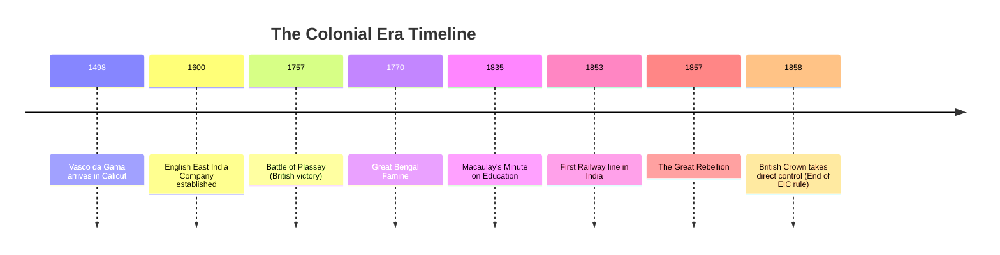
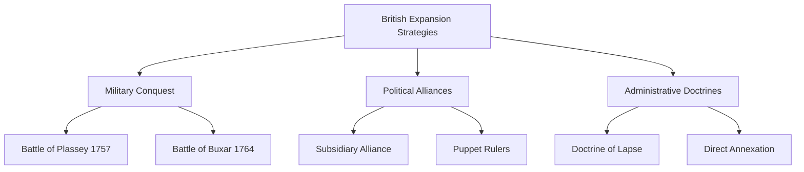
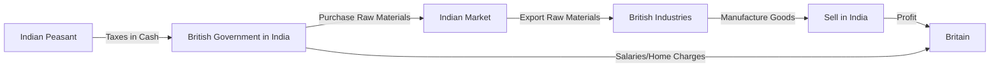

<<<FILE_START: index.mdx>>>
---
title: "The Colonial Era in India"
description: "An in-depth analysis of European colonialism in India, focusing on British expansion, economic exploitation, and early resistance movements."
date: 2024-04-10
tags: ["history", "colonialism", "british-raj", "1857-rebellion", "economy"]
order: 1
draft: false
---

import Callout from '@/components/Callout.astro'

## Introduction

The Colonial Era marks a transformative and often traumatic period in Indian history. It explains how European powers, particularly the British, transformed from traders seeking spices into imperial rulers controlling the entire subcontinent. This chapter explores the methods of conquest, the economic devastation caused by policies like the "Drain of Wealth," and the resilient spirit of Indians who resisted foreign rule.

<Callout variant="tip">
**Quote to Ponder:**
"Modern England has been made great by Indian wealth, ... wealth always taken by the might and skill of the stronger."
— *William Digby (1901)*
</Callout>

### The Big Questions
1.  **What is colonialism?**
2.  **What drew European powers to India?**
3.  **What was India’s economic standing before and during the colonial period?**
4.  **How did the British colonial domination impact the country?**

### Historical Timeline

The following timeline tracks the shift from trade to dominion:

### Chapter Roadmap

| Topic | Description |
| :--- | :--- |
| **The Age of Colonialism** | Understanding the arrival of Portuguese, Dutch, and French powers. |
| **British Conquest** | How the EIC used "Divide and Rule," Subsidiary Alliances, and the Doctrine of Lapse. |
| **Economic Impact** | The destruction of Indian industries, the "Drain of Wealth," and devastating famines. |
| **Social Changes** | The imposition of English education and the dismantling of village governance. |
| **Resistance** | From tribal uprisings (Santhals) to the Great Rebellion of 1857. |

<<<FILE_END>>>
<<<FILE_START: topics/01-colonialism-and-europeans.mdx>>>
---
title: "Colonialism and European Powers"
description: "Defining colonialism and surveying the Portuguese, Dutch, and French presence in India."
date: 2024-04-10
tags: ["colonialism", "portuguese", "french", "dutch"]
order: 2
draft: false
---

import Callout from '@/components/Callout.astro'

## What is Colonialism?

**Colonialism** is the practice where one country takes control of another region, establishes settlements, and imposes its political, economic, and cultural systems.

*   **Motivation:** Access to natural resources, new markets, trade routes, and sometimes religious conversion ("civilising mission").
*   **Reality:** It often involved the massacre or enslavement of native populations and the exploitation of local wealth.

## Early European Powers in India

Before the British dominance, other European powers established footholds in India.

### 1. The Portuguese (Est. 1498)
*   **Arrival:** Vasco da Gama arrived at Kappad (near Kozhikode) in 1498.
*   **Strategy:** Aggressive naval dominance.
    *   **Cartaz System:** A pass required by all ships in the Arabian Sea; ships without it were seized.
    *   **Inquisition:** Established in Goa (1560), it persecuted non-Christians and forced conversions.
*   **Decline:** Displaced by Dutch and British, restricted mainly to Goa, Daman, and Diu.

### 2. The Dutch (Early 17th Century)
*   **Focus:** Commerce, primarily the **spice trade**.
*   **Settlements:** Pulicat, Nagapattinam, Surat, and Cochin.
*   **Battle of Colachel (1741):** A rare instance where an Asian power (**King Marthanda Varma** of Travancore) decisively defeated a European naval force. This effectively ended Dutch colonial ambitions in India.

### 3. The French (Est. 1664)
*   **Key Figure:** **Dupleix** (Governor-General). He pioneered the use of disciplined Indian infantry (**sepoys**) and interference in local dynastic disputes—strategies later perfected by the British.
*   **Conflict:** Fought the **Carnatic Wars** (1746–1763) against the British.
*   **Outcome:** Defeated by the British; restricted to Pondicherry and a few enclaves.

<Callout variant="info">
**Economic Context:** Before colonial rule, India was an economic powerhouse, contributing roughly **25% of the global GDP**. It was famous for textiles (cotton, silk), spices, and wootz steel.
</Callout>

<<<FILE_END>>>
<<<FILE_START: topics/02-british-conquest-strategies.mdx>>>
---
title: "British Strategies of Conquest"
description: "How the East India Company transformed from traders to rulers using military and political strategies."
date: 2024-04-10
tags: ["british-empire", "plassey", "subsidiary-alliance", "doctrine-of-lapse"]
order: 3
draft: false
---

import Callout from '@/components/Callout.astro'

## From Traders to Rulers
The **English East India Company (EIC)** began as a trading body with a royal charter. Unlike varied conquests, the British takeover was gradual, calculated, and often disguised as commercial enterprise.

### 1. Divide and Rule
The British exploited rivalries between regional rulers and religious communities.
*   **Battle of Plassey (1757):** The turning point.
    *   **Robert Clive** conspired with **Mir Jafar** (the commander of Nawab Siraj-ud-daulah).
    *   Mir Jafar's forces stood aside, ensuring a British victory. This victory gave the British control over Bengal's vast resources.

### 2. Subsidiary Alliance
A political trap devised to control Indian states without the cost of direct administration.
*   **Terms:**
    1.  Indian rulers had to maintain British troops at their own expense.
    2.  A British **Resident** was stationed in the court.
    3.  Rulers could not conduct foreign relations without British permission.
*   **Result:** Rulers lost sovereignty and money ("Empire on the cheap"). **Hyderabad** was the first to sign in 1798.

### 3. Doctrine of Lapse
Introduced by Lord Dalhousie in the mid-19th century.
*   **The Rule:** If a ruler of a princely state died without a *natural male heir*, the state would be annexed by the British.
*   **Impact:** Disregarded the Hindu tradition of adoption. Led to the annexation of **Satara, Jhansi, Nagpur**, and others, fueling resentment that led to the 1857 rebellion.

<<<FILE_END>>>
<<<FILE_START: topics/03-economic-impact.mdx>>>
---
title: "Economic Impact: Drain and Devastation"
description: "The destruction of Indian industry, the phenomenon of famines, and the drain of wealth theory."
date: 2024-04-10
tags: ["economy", "famine", "dadabhai-naoroji", "deindustrialization"]
order: 4
draft: false
---

import Callout from '@/components/Callout.astro'

## Deindustrialization
Before the 18th century, India was the "textile workshop of the world."
*   **British Policy:**
    1.  Imposed heavy duties on Indian textiles entering Britain.
    2.  Flooded India with cheap, machine-made British cloth with minimal tariffs.
*   **Result:** The Indian handloom industry collapsed. Artisans were forced back into agriculture, overburdening the land.
    > *"The bones of the cotton weavers are bleaching the plains of India."* — William Bentinck (1834)

## The "Drain of Wealth"
Scholars like **Dadabhai Naoroji** (*Poverty and Un-British Rule in India*) and **R.C. Dutt** documented how wealth was siphoned from India to Britain.
*   **Mechanisms:**
    *   Taxes collected in India used to buy goods for export (effectively getting goods for free).
    *   Salaries and pensions of British officials paid from Indian revenue.
    *   India paying for British wars abroad.
*   **Estimate:** Recent studies suggest **$45 trillion** was extracted from India between 1765 and 1938.

## Devastating Famines
Colonial policies transformed droughts into catastrophic famines.
1.  **Bengal Famine (1770):** Killed ~10 million (1/3rd of the population). Caused by rigid tax collection despite crop failure.
2.  **Great Famine (1876–1878):** Killed up to 8 million.
    *   **Laissez-Faire:** Viceroy Lord Lytton refused to interfere with market prices.
    *   **Export of Grain:** While Indians starved, millions of tonnes of wheat were exported to Britain.

<Callout variant="warning">
**Railways:** Often cited as a benefit, railways were built primarily to move raw materials to ports and troops to trouble spots. They were paid for by Indian taxpayers, but profits went to British investors.
</Callout>

<<<FILE_END>>>
<<<FILE_START: topics/04-social-cultural-impact.mdx>>>
---
title: "Social and Cultural Transformations"
description: "Changes in education, law, and governance structures under the British Raj."
date: 2024-04-10
tags: ["education", "macaulay", "society", "governance"]
order: 5
draft: false
---

import Callout from '@/components/Callout.astro'

## Education: "Brown Englishmen"
The British overhauled the traditional Indian education system (*Pathshalas* and *Madrasas*).
*   **Macaulay's Minute (1835):** Thomas Macaulay argued for English education, dismissing Indian literature as inferior.
    > *"A single shelf of a good European library was worth the whole native literature of India and Arabia."*
*   **Objective:** To create a class of persons, **"Indian in blood and colour, but English in taste, in opinions, in morals, and in intellect,"** who could serve as clerks in the administration.

## Destruction of Village Governance
*   **Traditional:** Indian villages were "little republics" (Charles Metcalfe) that managed their own affairs through Panchayats.
*   **Colonial:** The British introduced a centralized bureaucracy and police system.
    *   Replaced customary law with complex British legal codes.
    *   Courts became expensive and conducted in a foreign language, alienating common people.

## Cultural Theft
While the British initiated archaeology (ASI), they also engaged in the massive theft of cultural artifacts (statues, manuscripts, jewels like the Koh-i-Noor), filling European museums with Indian heritage.

<<<FILE_END>>>
<<<FILE_START: topics/05-resistance-movements.mdx>>>
---
title: "Resistance Movements"
description: "Early uprisings against colonial rule, culminating in the Great Rebellion of 1857."
date: 2024-04-10
tags: ["resistance", "1857-rebellion", "tribal-revolt", "santhal"]
order: 6
draft: false
---

import Callout from '@/components/Callout.astro'

## Early Uprisings
Resistance began almost immediately after conquest.

### 1. Sannyasi-Fakir Rebellion (Bengal)
*   **Context:** Post-1770 famine.
*   **Action:** Hindu Sannyasis and Muslim Fakirs attacked British treasuries.
*   **Legacy:** Inspired Bankim Chandra Chattopadhyay’s novel *Anandamath* and the song *Vande Mataram*.

### 2. Tribal Uprisings
Tribals faced loss of forest rights and exploitation by moneylenders.
*   **Kol Uprising (1831):** Chota Nagpur.
*   **Santhal Rebellion (1855):** Led by **Sidhu and Kanhu Murmu**. They declared independence and fought with bows against guns. Though brutally suppressed, it showed immense courage.

### 3. Peasant Uprisings
*   **Indigo Revolt (1859):** Peasants in Bengal refused to grow indigo for European planters who paid them negligible prices.

## The Great Rebellion of 1857
Often called the "Sepoy Mutiny" by the British, but widely regarded as the **First War of Independence** by Indians.

### Causes
*   **Political:** Doctrine of Lapse (Annexation of Jhansi, Awadh).
*   **Economic:** Heavy taxation and ruin of artisans.
*   **Military/Religious:** The **Greased Cartridges** (rumored to contain cow and pig fat) offended Hindu and Muslim sepoys.

### Key Leaders
*   **Mangal Pandey:** His revolt at Barrackpore sparked the uprising.
*   **Bahadur Shah Zafar:** Proclaimed Emperor of India by rebels in Delhi.
*   **Rani Lakshmibai:** Defended Jhansi; died fighting.
*   **Begum Hazrat Mahal:** Led the resistance in Lucknow/Awadh.
*   **Nana Saheb & Tatia Tope:** Led forces in Kanpur.

### Outcome
*   **Suppression:** The British recaptured Delhi and other centers with extreme brutality.
*   **End of EIC:** The **Government of India Act 1858** transferred power directly to the British Crown. Queen Victoria promised non-interference in religion, but the trust was broken.

<<<FILE_END>>>
<<<FILE_START: solutions/ex-4.1.mdx>>>
---
title: "Chapter Exercises Solution"
description: "Detailed answers to the 10 questions at the end of Chapter 4."
date: 2024-04-10
tags: ["solutions", "exercises", "grade-8"]
order: 7
draft: false
---

import Callout from '@/components/Callout.astro'

## Questions and Activities

### 1. What is colonialism? Give three different definitions.
**Answer:**
1.  **General Definition:** The practice where one country takes full or partial political control over another country, occupying it with settlers, and exploiting it economically.
2.  **Economic Definition:** A system where a 'mother country' extracts raw materials from a colony and uses it as a captive market for its finished goods.
3.  **Cultural Definition:** The imposition of the colonizer's culture, language, and education system on the native population, often justified by a "civilising mission."

### 2. Was the "civilising mission" true in the case of India?
**Answer:**
**No.** While the British introduced railways and English education, their primary motive was **profit and control**, not Indian welfare.
*   **Evidence:**
    *   They destroyed thriving Indian industries (textiles).
    *   They allowed millions to die in famines (e.g., exporting grain during the 1876 famine).
    *   They dismantled indigenous village governance.
    *   The "civilising" narrative was often a cover for racial superiority and exploitation.

### 3. How was the British approach different from Portuguese or French?
**Answer:**
*   **Portuguese:** Focused on **naval dominance** (Cartaz system) and aggressive **religious conversion** (Inquisition).
*   **French:** Focused on state-building through **military alliances** (Sepoys) but failed to secure funding/support from home.
*   **British:** Used a strategy of **"Trade first, Rule later."** They mastered the art of **"Divide and Rule,"** using Indian resources (revenue from Bengal) to conquer the rest of India. They focused heavily on establishing legal and administrative structures to ensure long-term profit.

### 4. "Indians funded their own subjugation." Explain.
**Answer:**
This means the cost of British rule was paid for by Indian taxes.
*   **Railways/Telegraph:** Built using tax revenue from Indian peasants, but served British military and trade interests.
*   **Army:** The British Indian Army was funded by Indian revenues but used to suppress Indian revolts and fight British wars abroad (e.g., China, Africa).
*   **Salaries:** High salaries of British officials were paid from the Indian treasury.

### 5. What does ‘divide and rule’ mean? Give examples.
**Answer:**
It is a strategy to gain and maintain power by breaking up larger concentrations of power into pieces that individually have less power than the attacker.
*   **Examples:**
    1.  **Plassey (1757):** Conspiring with Mir Jafar against Nawab Siraj-ud-daulah.
    2.  **Religious Division:** Encouraging tensions between Hindus and Muslims to prevent a unified resistance (especially after 1857).
    3.  **Princely States:** Using Subsidiary Alliances to isolate Indian rulers from each other.

### 6. Essay: Impact on Agriculture
**Answer:**
*(Brief Outline)*
*   **Pre-Colonial:** Self-sufficient villages; taxes paid in kind (share of crop).
*   **Colonial Impact:**
    *   Land turned into a commodity.
    *   Taxes demanded in **cash**, forcing farmers to sell crops immediately, often at low prices.
    *   **Commercialization:** Forced growth of cash crops (Indigo, Cotton) instead of food grains, leading to food insecurity.
*   **Legacy:** Rural debt and poverty seen today have roots in these colonial land settlements (Zamindari/Ryotwari).

### 7. Report: 1857 Rani Lakshmibai
**Answer:**
**The Jhansi Chronicle - June 1858**
*   **Headline:** The Warrior Queen Falls Fighting for Freedom.
*   **Report:** Rani Lakshmibai, refusing to surrender Jhansi under the Doctrine of Lapse, led her forces brilliantly. After escaping the besieged fort of Jhansi, she captured Gwalior.
*   **Timeline:**
    *   *1854:* Doctrine of Lapse applied to Jhansi.
    *   *June 1857:* Rebellion breaks out.
    *   *March 1858:* British besiege Jhansi.
    *   *June 18, 1858:* The Rani attains martyrdom on the battlefield.
*   **Quote:** British General Hugh Rose called her "the best and bravest of the rebels."

### 8. Alternate History (Creative Writing)
**Answer:**
*(Guidance)* Students should imagine an India where the Marathas or a confederacy of states modernized independently (like Japan). Perhaps the Industrial Revolution would have happened in Bengal (textiles) or Mysore (rockets/steel) without the drain of wealth. India might have remained a major global economy.

### 9. Role Play: Dadabhai Naoroji vs British Official
**Answer:**
*   **Naoroji:** "You claim to bring order, but you drain our blood. £200 million drained annually! You starve the Indian peasant to feed the British factory."
*   **Official:** "But Mr. Naoroji, we gave you railways, the telegraph, and the rule of law!"
*   **Naoroji:** "Railways to carry away our grain? Law that treats a white man differently from a brown man? This is 'Un-British' rule!"

### 10. Local Resistance Movement
**Answer:**
*(Example: Kerala - Pazhassi Raja)*
*   **Trigger:** Unfair tax on pepper and usurpation of throne.
*   **Leader:** Kerala Varma Pazhassi Raja (The Lion of Kerala).
*   **Tactics:** Guerrilla warfare in the Wayanad forests.
*   **Outcome:** He died fighting in 1805.
*   **Memory:** Remembered in folk songs and museums in Wayanad.

<<<FILE_END>>>
<<<FILE_START: practice/activity-solutions.mdx>>>
---
title: "Let's Explore & Think About It"
description: "Solutions to in-text prompts and critical thinking questions found in the chapter."
date: 2024-04-10
tags: ["practice", "critical-thinking", "activities"]
order: 8
draft: false
---

import Callout from '@/components/Callout.astro'

## Painting Analysis (Fig 4.14)
**Prompt:** Analyze "The East offering its riches to Britannia".
**Analysis:**
*   **Britannia:** Sits high up on a rock, holding a trident (naval power) and shield (Union Jack). She looks down, symbolizing superiority.
*   **India:** Depicted as a dark-skinned woman offering pearls/jewels, looking up in a submissive posture.
*   **Symbolism:** It justifies colonialism as a "voluntary" submission where the East *offers* wealth, rather than it being looted. The "Old Father Thames" pouring water represents London receiving this wealth.
*   **Reality:** It was theft, not an offering.

## "The Sun Never Sets..."
**Prompt:** What does "the sun never sets on the British Empire" mean?
**Answer:**
*   **Meaning:** The British Empire was so vast, spanning across globe (Canada, India, Australia, Africa), that it was always daylight in at least one part of their territory.
*   **Symbolism:** It represented their global dominance.

## Macaulay's Quote
**Prompt:** What did Macaulay mean by "A single shelf of European library..."?
**Answer:**
*   **Meaning:** He displayed extreme **arrogance and ignorance**. He dismissed thousands of years of Sanskrit, Arabic, and Persian literature, philosophy, and science as worthless compared to Western thought.
*   **Goal:** To justify erasing Indian culture and replacing it with English education to create obedient civil servants.

## "Brown Englishmen"
**Prompt:** Why make Indians "English in taste..."?
**Answer:**
The British needed a buffer class—Indians who looked like the natives but thought like the British. These "Brown Englishmen" would:
1.  Act as loyal intermediaries between the rulers and the masses.
2.  Provide cheap labor for administration (clerks).
3.  Become consumers of British goods.

## "Re-opened" India
**Prompt:** Why use the term "re-opened" India to the world?
**Answer:**
India had been connected to the world (Rome, China, SE Asia) for millennia through trade. The colonial period didn't "open" a closed India; it forced India into a *new, unequal* relationship dominated solely by Europe, breaking its traditional Asian trade links.

<<<FILE_END>>>
<<<FILE_START: practice/extra-questions.mdx>>>
---
title: "Extra Conceptual Questions"
description: "Additional questions to test deep understanding of the Colonial Era."
date: 2024-04-10
tags: ["practice", "conceptual", "extra"]
order: 9
draft: false
---

import Callout from '@/components/Callout.astro'

## Short Answer Questions

### Q1: What was the "Cartaz" system?
**Answer:** A naval pass system introduced by the Portuguese. Any ship trading in the Indian Ocean had to buy a pass from the Portuguese; otherwise, it would be confiscated or sunk. This established their monopoly on the sea.

### Q2: Why is 1858 a significant year in Indian history?
**Answer:** It marks the end of the **East India Company's rule** and the beginning of the **British Raj** (direct rule by the Crown). Queen Victoria issued a proclamation promising rights (which were largely not kept).

### Q3: How did the "Indigo Revolt" differ from the "1857 Rebellion"?
**Answer:**
*   **1857:** Was a military and political uprising involving sepoys and princes aiming to overthrow British rule.
*   **Indigo Revolt (1859):** Was a specific peasant movement against European planters regarding forced cultivation of a cash crop. It was supported by the Bengali intelligentsia and legal means, rather than just armed conflict.

## Diagrammatic Analysis

### The Cycle of Drain
How wealth flowed out of India:

<<<FILE_END>>>
