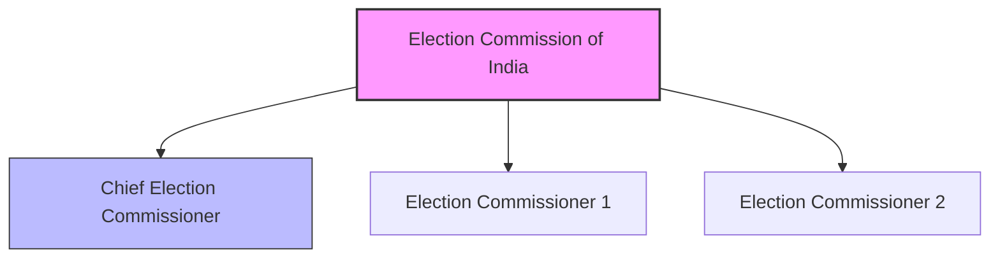
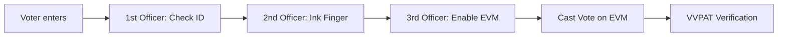

<<<FILE_START: index.mdx>>>
---
title: "Universal Franchise and India's Electoral System"
description: "Understanding the democratic process in India, including Universal Adult Franchise, the Election Commission, and the voting process."
date: 2024-04-10
tags: ["democracy", "elections", "civics", "grade-8"]
order: 1
draft: false
---

import Callout from '@/components/Callout.astro'

## Introduction

India is the world's largest democracy. A core pillar of this democracy is the principle of **Universal Adult Franchise**, which ensures that every adult citizen has the right to vote, regardless of their background. This chapter explores how India's massive electoral system works, who manages it, and how citizens participate in shaping their government.

<Callout variant="tip">
**Quote to Ponder:**
"[India] adopted the principle of adult franchise with an abundant faith in the common man and the ultimate success of democratic rule...never before in the history of the world has such an experiment been so boldly undertaken."
— *Alladi Krishnaswami Ayyar, Constituent Assembly Debates (1949)*
</Callout>

### The Big Questions
1.  **What is universal adult franchise?**
2.  **What is an electoral system?**
3.  **How does India's electoral system work?**

### Chapter Roadmap

| Topic | Description |
| :--- | :--- |
| **Universal Adult Franchise** | The right of every citizen aged 18+ to vote. |
| **Election Commission of India (ECI)** | The independent body responsible for conducting free and fair elections. |
| **Types of Elections** | Direct (Lok Sabha, State Assemblies) vs. Indirect (Rajya Sabha, President). |
| **The Voting Process** | From campaigning to EVMs and VVPATs. |
| **Challenges & Reforms** | Voter apathy, use of money, and the Model Code of Conduct. |

### Key Concept: The Power of One Vote
In a democracy, every vote counts equally. Whether you are rich or poor, educated or uneducated, your vote has the same value.

<<<FILE_END>>>
<<<FILE_START: topics/01-universal-franchise.mdx>>>
---
title: "Universal Adult Franchise"
description: "Defining the right to vote for all adult citizens and its significance in Indian democracy."
date: 2024-04-10
tags: ["voting-rights", "democracy", "constitution"]
order: 2
draft: false
---

import Callout from '@/components/Callout.astro'

## What is Universal Adult Franchise?

Universal Adult Franchise means that **every adult citizen** of a country has the right to vote, and **each vote has equal value**.

*   **Eligibility:** In India, every citizen aged **18 years and above** has the right to vote.
*   **No Discrimination:** This right is granted irrespective of caste, creed, race, religion, gender, education, or income.
*   **Constitutional Basis:** Article 326 of the Constitution of India guarantees this right.

<Callout variant="info">
**Did You Know?**
India granted voting rights to women from the very beginning (1950), unlike many Western countries like Switzerland (1971) or the USA (1920) where women had to fight long battles for suffrage.
</Callout>

### Why is it Important?
1.  **Equality:** It treats everyone as equal.
2.  **Empowerment:** It gives people the power to choose their representatives and hold them accountable.
3.  **Inclusivity:** It ensures that the voice of the poor and marginalized is heard just as loudly as the rich.

### Voter Registration
To exercise this right, a citizen must be registered in the **voter list** of their constituency.
*   **Exception:** Individuals found guilty of certain serious crimes may be barred from voting.

### Accessibility Measures
The Election Commission ensures no voter is left behind:
*   **Home Voting:** For the elderly (85+) and people with disabilities (PwD).
*   **Assistive Tech:** Braille-enabled ballots, wheelchair assistance, and pick-up/drop-off facilities.

<<<FILE_END>>>
<<<FILE_START: topics/02-election-commission.mdx>>>
---
title: "Election Commission of India (ECI)"
description: "The structure, role, and functions of the Election Commission in managing elections."
date: 2024-04-10
tags: ["eci", "constitutional-body", "elections"]
order: 3
draft: false
---

import Callout from '@/components/Callout.astro'

## What is the ECI?

The **Election Commission of India (ECI)** is an independent constitutional body responsible for administering election processes in India. Established in **1950**, it ensures elections are free, fair, and transparent.

### Structure of the ECI

**Hierarchy at Different Levels:**
*   **National Level:** Chief Election Commissioner & Election Commissioners.
*   **State Level:** Chief Electoral Officer.
*   **District Level:** District Election Officer.
*   **Constituency Level:** Returning Officer (RO).

### Key Functions
1.  **Conducting Elections:** For Lok Sabha, Rajya Sabha, State Legislative Assemblies, President, and Vice President.
2.  **Scheduling:** Deciding election dates and schedules.
3.  **Voter Registration:** Preparing and updating electoral rolls.
4.  **Model Code of Conduct:** Enforcing rules for political parties and candidates to ensure a level playing field.
5.  **Party Registration:** Registering political parties and assigning symbols.

<Callout variant="tip">
**T.N. Seshan:** A legendary Chief Election Commissioner (1990–1996) known for strict enforcement of election rules, introduction of Voter ID cards, and curbing electoral malpractice.
</Callout>

### Model Code of Conduct (MCC)
The MCC is a set of guidelines issued by the ECI to regulate political parties and candidates prior to elections.
*   **No Misuse of Power:** The ruling party cannot use government machinery (vehicles, officials) for campaigning.
*   **No New Schemes:** No new projects can be announced once elections are declared.
*   **Communal Harmony:** No soliciting votes based on caste or religion.

<<<FILE_END>>>
<<<FILE_START: topics/03-types-of-elections.mdx>>>
---
title: "Direct and Indirect Elections"
description: "Understanding the difference between Lok Sabha, Assembly elections, and Rajya Sabha elections."
date: 2024-04-10
tags: ["lok-sabha", "rajya-sabha", "direct-election", "indirect-election"]
order: 4
draft: false
---

import Callout from '@/components/Callout.astro'

## Direct Elections (First-Past-the-Post)

In direct elections, citizens vote directly for their representatives. The candidate with the highest number of votes wins (even if less than 50%).

### 1. Lok Sabha (General Elections)
*   **Level:** National.
*   **Constituencies:** India is divided into **543** parliamentary constituencies.
*   **Representatives:** Elected members are called **Members of Parliament (MPs)**.
*   **Outcome:** The party/coalition with the majority forms the Central Government. The leader becomes the **Prime Minister**.

### 2. State Legislative Assemblies (Vidhan Sabha)
*   **Level:** State.
*   **Constituencies:** States are divided into smaller assembly constituencies.
*   **Representatives:** Elected members are called **Members of Legislative Assembly (MLAs)**.
*   **Outcome:** The majority party forms the State Government. The leader becomes the **Chief Minister**.

## Indirect Elections (Proportional Representation)

In indirect elections, citizens do not vote directly. Instead, their elected representatives vote on their behalf.

### 1. Rajya Sabha (Council of States)
*   **Elected By:** Elected MLAs of State Assemblies.
*   **System:** Single Transferable Vote (STV).
*   **Nature:** It is a **Permanent House** (never dissolved). Members serve a **6-year term**, with 1/3rd retiring every two years.
*   **Composition:** 233 elected + 12 nominated by the President.

### 2. President & Vice President
*   **President:** Elected by an **Electoral College** consisting of elected MPs (Lok Sabha + Rajya Sabha) and elected MLAs of all States/UTs.
*   **Vice President:** Elected by members of both houses of Parliament (Lok Sabha + Rajya Sabha).

<Callout variant="warning">
**Note:** Nominated members (by the President) do *not* vote in the Presidential election to ensure democratic legitimacy.
</Callout>

### Comparison Table

| Feature | Lok Sabha (Direct) | Rajya Sabha (Indirect) |
| :--- | :--- | :--- |
| **Voters** | Citizens (18+) | MLAs |
| **Term** | 5 Years (Dissolvable) | 6 Years (Permanent) |
| **System** | First-Past-The-Post | Single Transferable Vote |
| **Focus** | National Issues | State Interests |

<<<FILE_END>>>
<<<FILE_START: topics/04-voting-process.mdx>>>
---
title: "The Voting Process"
description: "Step-by-step guide to how voting happens in India, from campaigning to counting."
date: 2024-04-10
tags: ["evm", "vvpat", "polling", "voting"]
order: 5
draft: false
---

import Callout from '@/components/Callout.astro'

## Steps in an Election

1.  **Notification:** ECI announces dates.
2.  **Nomination:** Candidates file papers to contest.
3.  **Campaigning:** Parties hold rallies, distribute manifestos, and ask for votes. Campaigning stops 48 hours before voting.
4.  **Polling Day:** Voters cast their vote.
5.  **Counting & Results:** Votes are counted, and winners declared.

## Inside the Polling Booth
On voting day, officials ensure the process is secure:
1.  **1st Polling Officer:** Checks Voter ID and name on the list.
2.  **2nd Polling Officer:** Inks the finger (indelimble ink), gives a slip, and takes a signature.
3.  **3rd Polling Officer:** Checks the ink and activates the EVM.
4.  **Voting:** The voter presses the button on the EVM next to their chosen candidate.

### Technology in Voting

#### Electronic Voting Machine (EVM)
*   **What is it?** A device used to cast votes electronically.
*   **Benefits:** Faster counting, eco-friendly (saves paper), and reduces invalid votes.

#### VVPAT (Voter Verifiable Paper Audit Trail)
*   **Function:** When a button is pressed on the EVM, the VVPAT prints a slip showing the chosen symbol and candidate's name.
*   **Purpose:** It allows the voter to verify their vote and serves as a physical backup for counting disputes.

### NOTA (None of the Above)
If a voter does not like any candidate, they can press the **NOTA** button. It registers their dissatisfaction but does not affect the winning result.

<Callout variant="info">
**Secret Ballot:** The voting process is secret. No one knows who you voted for. This prevents intimidation and ensures free choice.
</Callout>

<<<FILE_END>>>
<<<FILE_START: solutions/ex-5.1.mdx>>>
---
title: "Chapter Exercises Solution"
description: "Detailed answers to the Questions and Activities from Chapter 5."
date: 2024-04-10
tags: ["solutions", "exercises", "grade-8"]
order: 6
draft: false
---

import Callout from '@/components/Callout.astro'

## Questions and Activities

### 1. Why is universal adult franchise important for a healthy democracy?
**Answer:**
Universal adult franchise is crucial because:
1.  **Equality:** It ensures political equality by giving every adult citizen one vote with equal value, regardless of their social or economic status.
2.  **Inclusivity:** It allows marginalized groups (poor, minorities, women) to have a say in governance.
3.  **Accountability:** It makes the government answerable to all people, not just a privileged few.
4.  **Legitimacy:** A government elected by all citizens has greater moral authority to rule.

### 2. What is the meaning of ‘secret ballot’? Why is this important in a democracy?
**Answer:**
*   **Meaning:** A secret ballot means that a voter's choice is confidential. No one else knows who a person voted for.
*   **Importance:** It protects voters from intimidation, bribery, or retaliation. It ensures that people can vote fearlessly according to their own conscience.

### 3. Give examples of direct and indirect elections.
**Answer:**
*   **Direct Elections:** Elections where citizens vote directly.
    *   Lok Sabha Elections (electing MPs).
    *   State Assembly Elections (electing MLAs).
    *   Gram Panchayat Elections.
*   **Indirect Elections:** Elections where elected representatives vote on behalf of citizens.
    *   Presidential Election.
    *   Rajya Sabha Elections.

### 4. How is the election of members to the Lok Sabha different from that to the Rajya Sabha?
**Answer:**
| Feature | Lok Sabha | Rajya Sabha |
| :--- | :--- | :--- |
| **Voters** | Citizens of India (Direct) | MLAs of States (Indirect) |
| **Tenure** | 5 Years | 6 Years (Permanent House) |
| **System** | First-Past-The-Post | Single Transferable Vote |
| **Age Limit** | Minimum 25 years | Minimum 30 years |

### 5. What, in your view, are the advantages of the EVM over paper ballots?
**Answer:**
1.  **Speed:** Counting votes takes hours instead of days.
2.  **Accuracy:** Eliminates invalid votes (common in paper ballots due to stamping errors).
3.  **Eco-friendly:** Saves millions of trees by reducing paper usage.
4.  **Security:** Harder to tamper with compared to stuffing ballot boxes.

### 6. Voter turnout has been declining in some urban areas of India. What could be the reasons for this trend, and what steps can be taken?
**Answer:**
*   **Reasons:**
    *   Apathy ("My vote won't change anything").
    *   Migration (Voters registered in hometowns but working in cities).
    *   Long weekends (People treating election day as a holiday).
*   **Steps:**
    *   **Remote Voting:** Enabling migrants to vote from their current location.
    *   **Awareness:** Campaigns targeting urban youth.
    *   **Convenience:** More polling booths in high-density areas or weekend voting.

### 7. Why do you think a proportion of seats in the Lok Sabha is reserved for scheduled castes and scheduled tribes?
**Answer:**
Historically, Scheduled Castes (SC) and Scheduled Tribes (ST) faced social discrimination and exclusion.
*   **Reservation** ensures they have a guaranteed voice in the highest law-making body.
*   It empowers these communities to influence policies that affect their welfare.
*   Currently, **84 seats** are reserved for SCs and **47 seats** for STs in the Lok Sabha.

### 8. Social media is changing elections. Is this strengthening or confusing democracy?
**Answer:**
*   **Benefits (Strengthening):**
    *   Direct connection between leaders and voters.
    *   Rapid dissemination of information.
    *   Encourages youth participation.
*   **Challenges (Confusing):**
    *   Spread of **Fake News** and misinformation.
    *   Echo chambers creating polarization.
    *   Online harassment.
*   **Conclusion:** It is a double-edged sword. Digital literacy is required to navigate it effectively.

<<<FILE_END>>>
<<<FILE_START: practice/case-study.mdx>>>
---
title: "Case Study: School Election"
description: "Analyzing the mock election scenario provided in the chapter to understand democratic principles."
date: 2024-04-10
tags: ["practice", "case-study", "critical-thinking"]
order: 7
draft: false
---

import Callout from '@/components/Callout.astro'

## The Scenario
In Grade 8 of Suryodaya School, three students (Ahmed, Gurmat, Ravi) contested for Class Representative. Ms. Usha (teacher) acted as the Election Officer.

### Analysis Questions

**1. What was the role that Ms. Usha played? Why was it important?**
*   **Role:** Election Officer (similar to the Election Commission).
*   **Importance:** She ensured the process was fair, rules were followed, secrecy was maintained, and the counting was transparent. Without a neutral referee, elections can be manipulated.

**2. Why was it important to organize a braille ballot paper for Neha?**
*   **Inclusivity:** Democracy includes *everyone*. Neha has a right to vote independently and secretly just like others.
*   **Universal Franchise:** This mirrors the ECI's efforts to provide facilities for Persons with Disabilities (PwD).

**3. Why was it important to have a secret ballot?**
*   If voting was public (e.g., raising hands), students might feel pressured to vote for their friends or fear bullying. Secrecy ensures the vote reflects their true choice.

**4. Gurmat won with 12 votes out of 33. Is this fair?**
*   **System:** This is the **First-Past-The-Post** system used in India.
*   **Logic:** The candidate with the *highest* votes wins, even if they don't have a majority (>50%). While it's simple, it means 21 students (who voted for Ahmed and Ravi) are represented by someone they didn't pick.

**5. What considerations might students have had while choosing?**
*   **Issues:** Cleanliness (Ahmed) vs. Peer Learning (Gurmat) vs. Arts (Ravi).
*   **Personal Bias:** Friendship or popularity.
*   **Capability:** Who is more responsible?
*   *This mirrors real elections where voters weigh manifestos against personality.*

<<<FILE_END>>>
<<<FILE_START: practice/extra-questions.mdx>>>
---
title: "Extra Solved Questions"
description: "Additional questions to test understanding of the Indian electoral system."
date: 2024-04-10
tags: ["practice", "extra-questions", "quiz"]
order: 8
draft: false
---

import Callout from '@/components/Callout.astro'

## Short Answer Questions

### Q1: What is a "Constituency"?
**Answer:** A constituency is a specific geographic area. All eligible voters living in this area elect one representative to a legislative body (like the Lok Sabha or State Assembly).

### Q2: What happens if a party violates the Model Code of Conduct?
**Answer:** The Election Commission can issue warnings, ban candidates from campaigning for a period, or even file criminal cases depending on the severity of the violation (e.g., hate speech, bribery).

### Q3: Who was the first voter of Independent India?
**Answer:** **Shyam Saran Negi** from Himachal Pradesh. He cast the first vote in the 1951 general elections and voted in every election until his death at age 105 in 2022.

### Q4: Can a person vote if they are not in their home constituency on election day?
**Answer:** Generally, no. You must vote at your assigned polling booth. However, service voters (army/police) can use **Postal Ballots**. The ECI is also exploring **Remote Voting** technologies for migrants.

## Diagram Analysis

**Identify the Official:**
*   **Checks ID Proof:** 1st Polling Officer.
*   **Inks Finger:** 2nd Polling Officer.
*   **Enables EVM:** 3rd Polling Officer.

<<<FILE_END>>>
