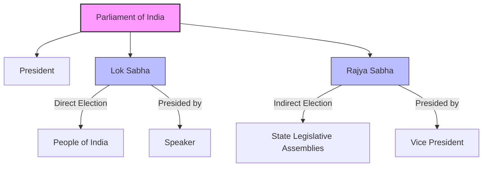
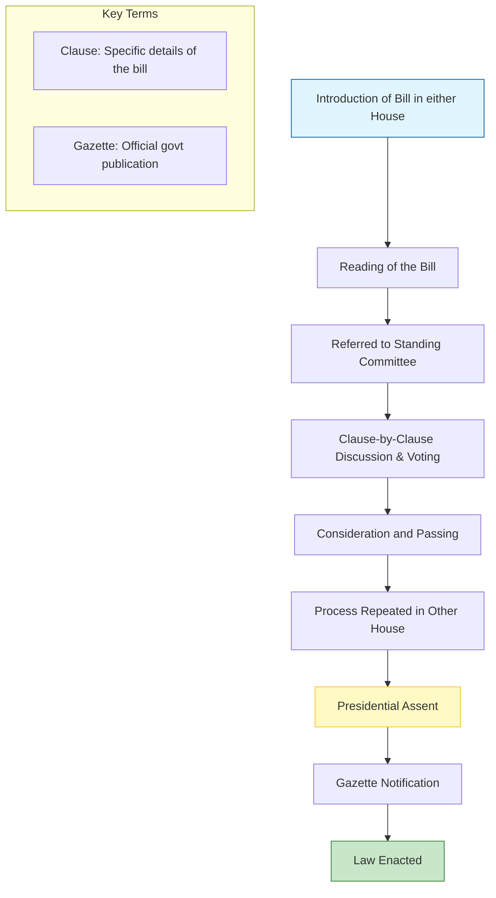

<<<FILE_START: index.mdx>>>
---
title: "The Parliamentary System: Legislature and Executive"
description: "An in-depth exploration of India's Parliamentary system, its composition, functions, and the relationship between the Legislature and the Executive."
date: 2024-04-10
tags: ["civics", "parliament", "democracy", "india", "grade-8"]
order: 1
draft: false
---

import Callout from '@/components/Callout.astro'

# The Parliamentary System: Legislature and Executive

The Constitution of India is not just a legal document; it is a vehicle of life. It establishes the framework for how our country is governed, placing the Parliament at the center of our democracy. This chapter explores the structure of the Indian Parliament, the roles of the Legislature and the Executive, and how they function at both the Union and State levels.

## The Big Questions

As we navigate this chapter, we will answer the following critical questions:

1.  **What is India’s parliamentary system, and how is it structured?**
2.  **What are the key functions of the Parliament?**
3.  **What are the roles of the legislature and the executive in India’s Parliamentary democracy?**
4.  **How are the legislature and the executive organised at the union and state levels?**

## Introduction

India achieved independence after a long struggle, granting its citizens the power to make decisions about their own governance. The Constitution laid the foundation for this by establishing **Universal Adult Franchise**, guaranteeing every adult citizen the right to vote regardless of their background.

The people of India directly elect representatives to the **Lok Sabha**. The majority group forms the government. The **Parliament** is the supreme legislative body, comprising all elected representatives. It guides the government, ensuring it functions with the people's consent.

<Callout variant="tip">
**Did You Know?**
The new Parliament building in New Delhi is designed with a triangular shape, reflecting balance, inclusivity, and purpose. It incorporates ancient symbols like the Ashokan emblem and motifs like peacocks and lotuses, while utilizing green construction technology.
</Callout>

## Key Terminology

| Term | Definition |
| :--- | :--- |
| **Parliament** | The supreme legislative body of India, consisting of the President, Lok Sabha, and Rajya Sabha. |
| **Bicameral** | A legislature with two houses or chambers (e.g., Lok Sabha and Rajya Sabha). |
| **Executive** | The branch of government responsible for implementing and enforcing laws (PM, Council of Ministers). |
| **Legislature** | The branch of government responsible for making laws. |
| **Bill** | A draft of a proposed law presented to the Parliament. |
| **Act** | A bill that has been passed by both houses of Parliament and received the President's assent. |
| **Universal Adult Franchise** | The right of all adult citizens to vote without discrimination. |

## Chapter Roadmap

*   **Composition**: Understanding the Lok Sabha and Rajya Sabha.
*   **Functions**: Lawmaking, financial control, and accountability.
*   **The Executive**: The President, Prime Minister, and Council of Ministers.
*   **State Level**: How the system mirrors the center at the state level.
*   **Challenges**: Issues facing the effective functioning of the legislature.
<<<FILE_END>>>

<<<FILE_START: topics/01-composition-of-parliament.mdx>>>
---
title: "Composition of the Parliament"
description: "Detailed look at the bicameral structure of the Indian Parliament: Lok Sabha and Rajya Sabha."
date: 2024-04-10
tags: ["parliament", "lok-sabha", "rajya-sabha", "bicameral"]
order: 2
draft: false
---

import Callout from '@/components/Callout.astro'

## The Bicameral System

The Indian Parliament is **bicameral**, meaning it consists of two houses. The structure is composed of:
1.  **The President**
2.  **The Lok Sabha** (House of the People / Lower House)
3.  **The Rajya Sabha** (Council of States / Upper House)

This system was adopted to meet the challenges of a vast and diverse country like India, ensuring both direct representation of the people and representation of the federal units (States).

### 1. The Lok Sabha (House of the People)
*   **Election:** Members are chosen through direct election by the people of India based on universal adult suffrage.
*   **Maximum Strength:** The Constitution envisages a maximum of 550 members.
*   **Representation:** Seats are allocated to states based on their population.
*   **Presiding Officer:** The **Speaker**, elected by the members, conducts sessions and maintains discipline.

### 2. The Rajya Sabha (Council of States)
*   **Election:** Members of Parliament (MPs) are elected indirectly by the electoral college (elected members of State Legislative Assemblies).
*   **Role:** It represents the interests of the States in the federal system.
*   **Presiding Officer:** The **Vice President of India** acts as the ex-officio Chairperson.

<Callout variant="info">
**Why Bicameral?**
Extensive discussions occurred during the drafting of the Constitution. It was decided that a single directly elected house might be inadequate. A second chamber (Rajya Sabha) allows for a review of legislation and represents the federal character of India (States' interests).
</Callout>

### Structure Overview

## The Sengol
In the new Lok Sabha, the **Sengol**, a gold-plated silver sceptre, is placed near the Speaker's chair.
*   **Symbolism:** It represents righteous and just rule.
*   **History:** Originally handed to Pt. Jawaharlal Nehru on August 14, 1947, to mark the transfer of power from the British. It dates back to Chola traditions where it symbolized that power must be guided by *dharma*.

## Language in Parliament
To make discussions accessible, simultaneous interpretation is available in many languages including Hindi, English, Assamese, Bengali, Gujarati, Kannada, Malayalam, Marathi, Odia, Tamil, Punjabi, Telugu, and recently Bodo, Dogri, Maithili, Manipuri, Urdu, and Sanskrit.
<<<FILE_END>>>

<<<FILE_START: topics/02-functions-of-parliament.mdx>>>
---
title: "Legislative Functions of Parliament"
description: "The core responsibilities of Parliament: Constitutional functions, Lawmaking, and Accountability."
date: 2024-04-10
tags: ["lawmaking", "legislation", "accountability", "functions"]
order: 3
draft: false
---

import Callout from '@/components/Callout.astro'

## Key Functions

The functions of the Parliament can be broadly classified into four heads:
1.  **Constitutional Functions:** Upholding core values like democracy, federalism, separation of powers, and Fundamental Rights.
2.  **Lawmaking:** Drafting and passing laws.
3.  **Executive Accountability:** Checking the government's actions.
4.  **Financial Accountability:** Approving the budget.

## 1. Lawmaking Process (From Bill to Act)
A primary responsibility is making laws. A law starts as a **Bill** (a draft proposal).

<Callout variant="tip">
**Example: The RTE Act**
The Right of Children to Free and Compulsory Education Act (RTE), 2009, started as an idea rooted in the Directive Principles.
1.  **2002:** 86th Amendment made education a Fundamental Right (Article 21A).
2.  **2008:** Bill tabled in Rajya Sabha.
3.  **Committee Review:** Studied and modified.
4.  **2009:** Passed by Lok Sabha and received Presidential assent.
</Callout>

### The Journey of a Bill

## 2. Executive Accountability
The Executive (PM and Ministers) acts on behalf of the Parliament and is answerable to it.
*   **Question Hour:** Typically the first hour of a session. MPs ask ministers questions about policies and activities. This forces the Executive to justify its actions.
*   **Committees:** Special committees hold meetings where ministries explain their policies.

## 3. Financial Accountability
The Parliament controls the purse strings of the nation.
*   **Budget:** The government must present an annual budget for approval.
*   **Expenditure:** Parliament monitors how funds are distributed and spent by different ministries.

<Callout variant="warning">
**Money Bill**
A Money Bill (concerned with taxation, borrowing, etc.) can **only** be introduced in the **Lok Sabha** and requires the prior recommendation of the President.
</Callout>
<<<FILE_END>>>

<<<FILE_START: topics/03-the-union-executive.mdx>>>
---
title: "The Union Executive"
description: "The role and powers of the President, Prime Minister, and Council of Ministers."
date: 2024-04-10
tags: ["executive", "president", "prime-minister", "government"]
order: 4
draft: false
---

import Callout from '@/components/Callout.astro'

## Components of the Union Executive
The Union Executive implements laws and runs the government. It consists of:
1.  The President
2.  The Vice President
3.  The Council of Ministers (headed by the Prime Minister)

## 1. The President
*   **Role:** Head of State and nominal head of the Executive.
*   **Functions:**
    *   Appoints the Prime Minister and other ministers.
    *   Summons the Parliament.
    *   Gives assent to bills.
*   **Power:** Acts on the aid and advice of the Council of Ministers but has discretionary powers during political crises.

## 2. The Prime Minister (PM)
*   **Role:** The *de facto* (actual) executive authority.
*   **Appointment:** The President appoints the leader of the majority party or coalition in the Lok Sabha as PM.
*   **Functions:**
    *   Leads the Council of Ministers.
    *   Advises the President.
    *   Coordinates work among different ministries.
    *   Shapes national policies.

## 3. The Council of Ministers
*   **Composition:** Chosen from MPs of both houses.
*   **Responsibility:** Collectively responsible to the **Lok Sabha**.
*   **Civil Servants:** A permanent group of officials (bureaucrats) assists the ministers in implementing laws and ensuring departments run smoothly.

<Callout variant="tip">
**Example of Moral Responsibility**
In 1956, Railway Minister **Lal Bahadur Shastri** resigned after a train accident. Though not personally to blame, he believed a minister must take moral responsibility for their ministry. This set a high standard for accountability.
</Callout>

### Separation of Powers?
Even though the Executive is drawn from the Legislature (Ministers must be MPs), there is a functional separation:
*   **Legislature:** Makes laws.
*   **Executive:** Enforces laws.
*   **Judiciary:** Checks if laws/actions are constitutional.
<<<FILE_END>>>

<<<FILE_START: topics/04-legislature-executive-judiciary.mdx>>>
---
title: "Comparison & Checks and Balances"
description: "Comparing the Legislature and Executive, and understanding the role of the Judiciary."
date: 2024-04-10
tags: ["judiciary", "checks-and-balances", "comparison"]
order: 5
draft: false
---

import Callout from '@/components/Callout.astro'

## Differences: Legislature vs. Executive

| Aspect | Legislature (Parliament) | Executive (Government) |
| :--- | :--- | :--- |
| **Composition** | President, Lok Sabha, Rajya Sabha. | President, Vice-President, PM, Council of Ministers. |
| **Main Role** | Making laws and overseeing the Executive. | Enforcing laws made by the Legislature. |
| **Bill Introduction** | Can introduce some bills. | Introduces *most* bills. |
| **Accountability** | Checks the Executive via questions and debates. | Provides explanations to Legislature; Answerable to Lok Sabha. |
| **Financials** | Sanctions expenses. | Prepares and implements the Budget. |

## The Judiciary: Role of Checks and Balances
The Judiciary (system of courts) interprets laws and settles disputes. It plays a pivotal role in the **System of Checks and Balances**:

1.  **Guardian of Constitution:** Ensures all branches operate within constitutional limits.
2.  **Judicial Review:**
    *   If the **Legislature** passes a law violating the Constitution, the Judiciary can strike it down.
    *   If the **Executive** implements a law in a way that violates rights, the Judiciary can intervene.
3.  **Separation of Powers:** This system ensures no single organ (Legislature, Executive, or Judiciary) becomes too powerful.

<Callout variant="info">
**Did You Know?**
The Judiciary can even ask lawmakers to review a law if it finds it inconsistent with the basic structure of the Constitution.
</Callout>
<<<FILE_END>>>

<<<FILE_START: topics/05-state-government-and-federalism.mdx>>>
---
title: "State Government & Federalism"
description: "How the parliamentary system functions at the State level and the division of powers."
date: 2024-04-10
tags: ["federalism", "state-government", "lists", "vidhan-sabha"]
order: 6
draft: false
---

import Callout from '@/components/Callout.astro'

## Parallel Structure
India practices **federalism**, where power is distributed between the Center and States. The State structure mirrors the Union structure.

| Feature | Union Government | State Government |
| :--- | :--- | :--- |
| **Const. Head** | President | Governor |
| **Exec. Head** | Prime Minister | Chief Minister |
| **Legislature** | Bicameral (Lok Sabha + Rajya Sabha) | Unicameral or Bicameral |
| **Lower House** | Lok Sabha | Vidhan Sabha (Legislative Assembly) |
| **Upper House** | Rajya Sabha | Vidhan Parishad (Legislative Council) |
| **Responsibility**| To Lok Sabha | To Vidhan Sabha |

<Callout variant="info">
**Bicameral States**
Most states are unicameral (only Vidhan Sabha). States with a bicameral system (Vidhan Sabha + Vidhan Parishad) include **Andhra Pradesh, Bihar, Karnataka, Maharashtra, Telangana, and Uttar Pradesh**.
</Callout>

## Division of Powers: The Three Lists
The Constitution clarifies who can make laws on which subject through three lists.

*   **Union List:** Subjects relevant to the whole country (e.g., Defence, Foreign Affairs). Only Union Govt acts here.
*   **State List:** Local subjects (e.g., Police, Agriculture). State Govt acts here.
*   **Concurrent List:** Shared subjects (e.g., Education, Environment). Both can legislate, but Union law prevails in conflict.

### Venn Diagram of Lists

  <svg width="500" height="300" viewBox="0 0 500 300" xmlns="http://www.w3.org/2000/svg">
    <!-- Union List Circle -->
    <circle cx="180" cy="150" r="120" stroke="currentColor" stroke-width="3" fill="none" opacity="0.8" />
    <text x="120" y="150" font-family="sans-serif" font-size="16" fill="currentColor" font-weight="bold">UNION LIST</text>

    <!-- State List Circle -->
    <circle cx="320" cy="150" r="120" stroke="currentColor" stroke-width="3" fill="none" opacity="0.8" />
    <text x="360" y="150" font-family="sans-serif" font-size="16" fill="currentColor" font-weight="bold">STATE LIST</text>

    <!-- Concurrent List Overlap -->
    <text x="250" y="130" font-family="sans-serif" font-size="14" fill="currentColor" text-anchor="middle" font-weight="bold">CONCURRENT</text>
    <text x="250" y="150" font-family="sans-serif" font-size="12" fill="currentColor" text-anchor="middle">Education</text>
    <text x="250" y="170" font-family="sans-serif" font-size="12" fill="currentColor" text-anchor="middle">Environment</text>

    <!-- Labels outside -->
    <text x="250" y="290" font-family="sans-serif" font-size="12" fill="currentColor" text-anchor="middle" font-style="italic">Fig: Interdependence of Federalism</text>
  </svg>

<Callout variant="tip">
**Note:** Even though Education is on the Concurrent List, the RTE Act is applicable all over India. If the Union legislates on a Concurrent subject, States are bound to follow it.
</Callout>
<<<FILE_END>>>

<<<FILE_START: topics/06-challenges-and-conclusion.mdx>>>
---
title: "Challenges to Effective Functioning"
description: "Examining the challenges faced by the legislature, including productivity, disruptions, and the role of citizens."
date: 2024-04-10
tags: ["challenges", "productivity", "democracy", "media"]
order: 7
draft: false
---

import Callout from '@/components/Callout.astro'

## Challenges Faced by the Legislature
While the Parliament is the platform for debate, it faces several hurdles:
1.  **Disruptions:** Sessions are often cut short due to protests or angry debates, reducing time for constructive work.
2.  **Productivity:** Measured by hours functioned vs. scheduled. Data shows a decline in productivity in recent years (e.g., Rajya Sabha productivity fell to 35.75% in 2018 due to disruptions).
3.  **Absenteeism:** Regular absence of members.
4.  **Criminalization:** Concerns exist about representatives with criminal cases against them.

## The Role of Media and Citizens
*   **Media:** Plays a crucial role in communicating the concerns of the electorate, often using cartoons and reports to highlight issues.
*   **Citizens:** Democracy strengthens when citizens stay informed. Engaging in public discussions, using digital spaces for policy feedback, and constructive engagement with representatives are vital.

<Callout variant="quote">
**Atal Bihari Vajpayee's Message**
*"Governments will come and go, parties will rise and fall. But the nation must endure, and its democracy must live on."*
This highlights that protecting democratic values is more important than political power.
</Callout>

## Conclusion
*   **Shared Power:** The system shares power, debates decisions, and holds leaders accountable.
*   **Voice of People:** Parliament represents the federal spirit and the voice of the citizens.
*   **Improvement Needed:** For faster progress, the functioning of Parliament must become more efficient and productive.
<<<FILE_END>>>

<<<FILE_START: solutions/ex-1.1.mdx>>>
---
title: "Questions and Activities Solutions"
description: "Comprehensive answers to the chapter-end questions."
date: 2024-04-10
tags: ["solutions", "answers", "activities"]
order: 8
draft: false
---

import Callout from '@/components/Callout.astro'

## Chapter Assessment

### 1. Representatives from your State
**Question:** Find out how many representatives from your state are in each House of the Parliament.
**Guidance:** This answer depends on which state you live in.
*   *Example (Maharashtra):* Lok Sabha: 48 seats; Rajya Sabha: 19 seats.
*   *Example (Uttar Pradesh):* Lok Sabha: 80 seats; Rajya Sabha: 31 seats.
*   *Task:* Check a current general knowledge resource or government website for your specific state.

### 2. Parliament as "Voice of the People"
**Question:** What makes the Indian Parliament the “voice of the people”? How does it ensure that different opinions are heard?
**Answer:**
The Parliament is the "voice of the people" because:
1.  **Direct Election:** Members of the Lok Sabha are directly elected by citizens via Universal Adult Franchise.
2.  **Representation:** It comprises representatives from diverse backgrounds, regions, and communities across India.
3.  **Debate:** It ensures different opinions are heard through mechanisms like the **Question Hour**, where the Opposition questions the government, and debates on Bills, where amendments can be proposed.

### 3. Executive Responsibility
**Question:** Why do you think the Constitution made the Executive responsible to the Legislature?
**Answer:**
This is to ensure **accountability** and prevent dictatorship.
1.  The Executive (PM and Council) exercises vast power.
2.  By making them answerable to the Legislature (which represents the people), the Constitution ensures that power is used for the public good.
3.  If the Executive loses the confidence (majority support) of the Lok Sabha, the government falls.

### 4. Bicameralism at Union Level
**Question:** Why do you think we have chosen the system of bicameral legislature at the Union level?
**Answer:**
1.  **Checks and Balances:** A second house (Rajya Sabha) reviews bills passed by the Lok Sabha, preventing hasty legislation.
2.  **Federal Representation:** India is a union of states. The Rajya Sabha represents the interests of the States, ensuring the federal structure is respected.
3.  **Expertise:** It allows for distinguished people (nominated members) to contribute to governance.

### 5. Tracking a Bill
**Question:** Try to track the journey of a recent bill passed by the Parliament.
**Activity Tip:**
*   Select a recent bill (e.g., The Women's Reservation Bill, 2023).
*   **Introduced In:** Lok Sabha.
*   **Debates:** Note the arguments for and against.
*   **Time Taken:** Look at the dates of introduction vs. passing.
*   **Source:** Use `loksabha.nic.in` or news archives.

### 6. Role-Play: Model Parliament
**Activity:**
*   **Goal:** Enact the passing of a law.
*   **Roles:** Speaker (controls the house), Prime Minister (proposes), Opposition Leader (questions), President (signs).
*   **Process:** Introduce Bill -> Debate -> Vote -> Assent.

### 7. Women's Reservation Bill Delay
**Question:** The Women’s Reservation Bill, 2023, was passed with wide support. Why might it have taken over 25 years for this bill to be passed, despite being discussed for so long?
**Answer:**
*   **Lack of Consensus:** Political parties disagreed on the details (e.g., quotas within quotas).
*   **Coalition Politics:** Previous governments often relied on coalition partners who opposed the bill, making it risky to pass.
*   **Political Will:** It requires strong political determination to change the status quo of male-dominated representation.

### 8. Impact of Disruptions
**Question:** What impact do disruptions have on the quality of laws and trust?
**Answer:**
1.  **Quality of Laws:** When bills are passed in a rush amidst noise without debate, flaws in the law might be overlooked.
2.  **Trust:** Citizens elect MPs to work. Frequent disruptions make people feel their tax money and votes are being wasted, leading to cynicism and loss of trust in democratic institutions.

### 9. Interest Groups & Questions
**Activity:**
*   **MP Questions (National Policy):** "What steps is the central government taking to reduce inflation?" or "How will the new education policy affect college entrance?"
*   **MLA Questions (State/Local):** "When will the roads in our district be repaired?" or "Why is the local government school lacking teachers?"

### 10. Role of Judiciary
**Question:** What is the role that the Judiciary plays in Indian democracy? What could happen if we didn’t have an independent judiciary?
**Answer:**
*   **Role:** It interprets laws, settles disputes, and acts as the guardian of the Constitution (checking Legislature and Executive).
*   **Without Independence:**
    *   The government could violate Fundamental Rights without consequence.
    *   Powerful politicians could manipulate laws for personal gain.
    *   The federal balance between Centre and States could collapse.
<<<FILE_END>>>

<<<FILE_START: practice/solved-examples.mdx>>>
---
title: "Practice: Let's Explore & Analyze"
description: "Additional exercises and thought experiments from the chapter text."
date: 2024-04-10
tags: ["practice", "critical-thinking", "analysis"]
order: 9
draft: false
---

import Callout from '@/components/Callout.astro'

## 1. Analyzing Productivity Data
**Source:** Page 20 Data Table

| Period | Lok Sabha Sessions | Number of Sittings |
| :--- | :--- | :--- |
| 1st LS (1952-57) | 14 | 677 |
| 2nd LS (1957-62) | 16 | 567 |
| 10th LS (1991-96)| 16 | 423 |
| 13th LS (1999-04)| 14 | 356 |

**Analysis Question:** What trend do you see in the number of sittings over time?
**Answer:** There is a clear **downward trend**. While the number of sessions remains similar, the number of sittings (actual days of work) has decreased significantly from 677 in the 1st Lok Sabha to 356 in the 13th. This indicates reduced time spent on debate and legislation.

## 2. Verse in Parliament
**Source:** Page 11
**Context:** Finance Minister Nirmala Sitharaman quoted the *Tirukkural* in 2025.
**Quote:** *"Just as living beings live expecting rains, Citizens live expecting good governance."*
**Reflection:** How does this quote connect the environment (rain) to politics (governance)?
**Insight:** It suggests that good governance is as vital for survival and prosperity as rain is for agriculture and life. It sets a moral standard for the Executive.

## 3. Committee Reports (Case Study)
**Source:** Page 12 (Ayush Facilities)
**Scenario:** A Standing Committee noticed that some states did not have a separate Department of Ayush.
*   **Committee Rec:** Recommended the Ministry persuade States to create one.
*   **Action Taken:** Ministry requested States/UTs to create Directorates. Currently, 24 States have them.
**Learning:** This shows how **Executive Accountability** works. The Parliament (Committee) reviewed the situation, gave a recommendation, and the Ministry (Executive) had to report back on the action taken.

## 4. Humor in Debate
**Source:** Page 11
**Context:** Sushma Swaraj vs. Dr. Manmohan Singh (using poetry).
**Reflection:** Why is humor important in Parliament?
**Insight:** Humor and poetry can defuse tension during heated debates, allowing MPs to criticize the government or respond to criticism gracefully without resorting to anger or disruption.

## 5. Separation of Powers
**Question:** If the Executive is part of the Legislature, how is there separation of power?
**Answer:**
*   **Personnel overlap:** Yes, Ministers are MPs.
*   **Functional separation:**
    *   When sitting in Parliament, they act as **Legislators** (making laws).
    *   When in their ministries, they act as **Executives** (implementing laws).
*   **Judicial Check:** The Judiciary remains completely separate and independent to referee both.
<<<FILE_END>>>
