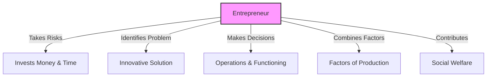

<<<FILE_START: index.mdx>>>
---
title: "Factors of Production"
description: "An overview of the economic inputs required for production: Land, Labour, Capital, and Entrepreneurship."
date: 2024-04-10
tags: ["economics", "production", "factors-of-production", "grade-8"]
order: 1
draft: false
---

import Callout from '@/components/Callout.astro'

# Factors of Production

Have you ever wondered how your clothes, shoes, or school bags are made? Every product undergoes a **production process** involving specific resources. In economics, the inputs or resources required to produce goods and services are called **Factors of Production**.

## The Big Questions
1.  **What are the factors of production?**
2.  **How are these factors interconnected?**
3.  **What is the role of human capital in production, and what are its facilitators?**

## Introduction to Production
Businesses combine various inputs to create goods and services. This process generates opportunities for economic activity.

<Callout variant="info">
**Case Study: Pause Point**
Meet Ratna, who runs a restaurant called "Pause Point". To make her business successful, she needed:
*   **Land:** A location for the restaurant.
*   **Capital:** Money for rent, equipment, and ingredients.
*   **Labour:** Staff to assist her.
*   **Entrepreneurship:** Her own planning and risk-taking.
</Callout>

## The Four Factors
Economics classifies production inputs into four main categories:

| Factor | Definition | Examples |
| :--- | :--- | :--- |
| **Land** | Natural resources used in production. | Soil, water, forests, minerals, sunlight. |
| **Labour** | Physical and mental human effort. | Farmers, doctors, construction workers. |
| **Capital** | Human-made resources and money. | Machinery, tools, buildings, cash. |
| **Entrepreneurship** | The initiative to organize the other factors. | Business owners, innovators. |

*Note: **Technology** acts as a crucial facilitator, enabling businesses to produce more efficiently.*

## Key Terminology

*   **Business:** A firm, shop, or factory that produces/sells goods or provides services.
*   **Production:** The process of converting inputs into finished goods or services.
*   **Productivity:** The ability to do more in a particular time period.

In the following sections, we will explore each factor in detail, understand the difference between Labour and Human Capital, and look at the role of Technology and Entrepreneurship.
<<<FILE_END>>>

<<<FILE_START: topics/01-land-and-labour.mdx>>>
---
title: "Land and Labour"
description: "Exploring the first two factors of production: Natural resources and Human effort."
date: 2024-04-10
tags: ["land", "labour", "natural-resources", "human-capital"]
order: 2
draft: false
---

import Callout from '@/components/Callout.astro'

## 1. Land (Natural Resources)
In economics, 'Land' is not just the ground we stand on. It encompasses all **natural resources** gifted by nature.
*   **Scope:** Includes geographical land, soil, forests, water, air, sunlight, minerals, oil, and natural gas.
*   **Usage:** Businesses either purchase land or pay **rent** to use it.
*   **Example:** A factory needs ground to be built on, water for cooling machines, and electricity (often generated from coal or gas).

## 2. Labour (Human Resources)
Labour refers to the **physical and mental effort** used in production. Everyone contributes differently based on their role.
*   **Examples:** Carpenters, farmers, teachers, doctors.
*   **Requirement:** Varying levels of physical strength, knowledge, and skill.

### People as a Resource vs. Human Capital
While **Labour** refers to the effort, **Human Capital** refers to the *quality* of that effort.

*   **Human Capital:** The specialized skills, knowledge, abilities, and expertise required to perform labour efficiently.
*   **Skill:** The ability to do an activity or job well with practice and training.

<Callout variant="tip">
**Key Distinction**
*   **Labour:** Physical/Mental work done (e.g., hours spent building a wall).
*   **Human Capital:** The skill set that makes the work better/faster (e.g., knowledge of engineering principles to build a stronger wall).
</Callout>

### India's Ancient Skill Heritage
India has a rich legacy of skill-based knowledge.
*   **Work as Worship:** Tools were worshipped (*Vishwakarma puja* / *Ayudha puja*). Products were a blend of *kala* (art) and *vidya* (knowledge).
*   **Shilpa Shastras:** Ancient texts containing detailed design guidelines for sculptures, buildings, and paintings.
*   **Stitched Shipbuilding:** A 2000-year-old technique where wooden planks were stitched with cords instead of nails. This made ships flexible and durable for navigating the Indian Ocean.

<Callout variant="warning">
**Decline of Indigenous Techniques**
Many traditional techniques, like stitched shipbuilding, declined after the arrival of Europeans in the 16th century but are still used for small fishing boats today.
</Callout>
<<<FILE_END>>>

<<<FILE_START: topics/02-human-capital-facilitators.mdx>>>
---
title: "Facilitators of Human Capital"
description: "How Education, Healthcare, and Culture improve Human Capital."
date: 2024-04-10
tags: ["education", "health", "culture", "demographics"]
order: 3
draft: false
---

import Callout from '@/components/Callout.astro'

## Developing Human Capital
Human capital is not static; it can be improved. The key facilitators are:

### 1. Education and Training
*   **Education:** Starts with basic literacy and extends to expertise. It enriches knowledge and problem-solving abilities.
*   **Training:** The process of learning specific skills for a job (e.g., a civil engineer visiting a construction site).
*   **Cognitive Development:** Learning, knowing, and understanding.

### 2. Healthcare
Good health is fundamental.
*   **Impact:** Healthy workers are physically and mentally sound, more creative, and absent less often.
*   **Result:** Higher productivity and efficiency.

### 3. Social and Cultural Influences
The work culture of a country influences its productivity.
*   **Japan (Kaizen):** Meaning "continuous improvement". Applied since the 1940s, leading to high living standards.
*   **Germany:** Known for a strong work ethic, punctuality, and attention to detail, making them leaders in technology.

## Challenges to Human Capital

### Literacy
*   **Adult Literacy Rate:** Percentage of people aged 15+ who can read and write a simple statement.
*   **India's Status (2023):** 85% for males, 70% for females (World Bank estimates).

### Demographic Dividend
India has a very young population. According to the Economic Survey 2024, **65% of Indians are below 35 years**.
*   **Definition:** The economic benefit a country gets when it has a large number of young, working-age people compared to dependents.
*   **Requirement:** To reap this benefit, the youth must have access to **quality education, health, and skilling**.

<Callout variant="info">
**Why is this important?**
When more people work and earn, and fewer depend on them, the nation creates a surplus that drives rapid economic growth.
</Callout>
<<<FILE_END>>>

<<<FILE_START: topics/03-capital-and-entrepreneurship.mdx>>>
---
title: "Capital and Entrepreneurship"
description: "Understanding financial assets, machinery, and the role of the entrepreneur."
date: 2024-04-10
tags: ["capital", "money", "entrepreneur", "startup", "jrd-tata"]
order: 4
draft: false
---

import Callout from '@/components/Callout.astro'

## 3. Capital
Capital includes both monetary resources and durable assets used for production.
*   **Physical Capital:** Machinery, tools, buildings, computers, vehicles.
*   **Financial Capital:** Money required for day-to-day operations.

### Sources of Capital
Where do businesses get money?
1.  **Personal Savings:** Family and friends (often for small businesses).
2.  **Loans:** Borrowed from banks. The borrower pays **Interest** (a fee for using the money).
3.  **Stock Market:** Large companies raise money from the public by selling shares. They pay **Dividends** (a share of profits) to shareholders.

## 4. Entrepreneurship
An entrepreneur is the person who "puts it all together".
*   **Role:** They come up with an idea, take risks, gather Land, Labour, and Capital, and solve a problem.
*   **Startup:** An entrepreneurial venture with limited resources aiming for rapid growth using technology.

### Functions of an Entrepreneur

<Callout variant="success">
**Profile: J.R.D. Tata**
A visionary entrepreneur who built modern India.
*   Started **Tata Airlines** (later Air India) in 1932.
*   Expanded into steel, cars, power, and chemicals.
*   Known for ethical business and caring for workers.
*   Awarded the **Bharat Ratna** in 1992.
</Callout>
<<<FILE_END>>>

<<<FILE_START: topics/04-technology-and-supply-chain.mdx>>>
---
title: "Technology & Interconnectedness"
description: "Technology as an enabler and the concept of supply chains."
date: 2024-04-10
tags: ["technology", "supply-chain", "production-process"]
order: 5
draft: false
---

import Callout from '@/components/Callout.astro'

## Technology: An Enabler
Technology is the application of scientific knowledge to practical purposes. It does not always mean modern electronics; a simple pulley is also technology.
*   **Role:** Helps produce more goods with fewer inputs.
*   **Examples:**
    *   **UPI:** Instant payments.
    *   **GPS:** Efficient transport routes.
    *   **Drones:** Spraying fertilizers on farms.
    *   **Online Learning:** Platforms like **SWAYAM** and **National Career Service** bridge the gap between skills and jobs.

## Interconnectedness of Factors
The four factors (Land, Labour, Capital, Entrepreneurship) must work together.
*   **Labour-Intensive:** Agriculture, handicrafts (rely more on people).
*   **Capital-Intensive:** Satellites, semiconductors (rely more on machines).

### The Supply Chain
A supply chain is the network of individuals, organizations, resources, and technology involved in creating and selling a product. Global events (like COVID-19) can disrupt these chains if we rely too much on far-off sources.

### Case Study: Mobile Phone Assembly
India is the world's second-largest mobile phone manufacturer. The process involves complex coordination.

<Callout variant="info">
**Did You Know?**
Various engineers (software, electrical, mechanical) work together to create a single phone. This shows how human capital drives the technological process.
</Callout>
<<<FILE_END>>>

<<<FILE_START: topics/05-responsibilities-csr.mdx>>>
---
title: "Responsibilities & CSR"
description: "Sustainable production and Corporate Social Responsibility."
date: 2024-04-10
tags: ["sustainability", "csr", "environment", "ethics"]
order: 6
draft: false
---

import Callout from '@/components/Callout.astro'

## Environmental Responsibility
Production uses limited natural resources. If not managed well, it leads to:
*   **Pollution:** Leather factories in Tamil Nadu can pollute rivers if waste isn't treated.
*   **e-Waste:** Improper recycling of electronics releases lead and mercury.

**Sustainable Practices:**
Producers must adopt practices to replenish resources, such as recycling water and using recycled materials as inputs.

## Social Responsibility
Businesses have a duty towards their workers:
1.  **Fair Compensation:** Proper wages.
2.  **Safety:** Safe working environments.
3.  **Rights:** No discrimination, paid leave, and healthcare.

## Corporate Social Responsibility (CSR)
CSR refers to businesses addressing social and environmental concerns to benefit society.

<Callout variant="tip">
**CSR Law in India**
India was the **first nation** to mandate CSR by law in 2014. Companies must spend **2% of their average profits** (of the last three years) on CSR activities like education, environment, or community health.
</Callout>
<<<FILE_END>>>

<<<FILE_START: solutions/ex-1.1.mdx>>>
---
title: "Textbook Solutions: Factors of Production"
description: "Answers to the Questions and Activities section of Chapter 7."
date: 2024-04-10
tags: ["solutions", "answers", "chapter-7"]
order: 7
draft: false
---

import Callout from '@/components/Callout.astro'

## Questions and Activities

### 1. Differentiating Factors of Production
**Question:** How are the factors of production different from each other?
**Answer:**
*   **Land:** Natural resources (passive factor). Fixed in supply.
*   **Labour:** Human effort (active factor). Involves physical/mental presence.
*   **Capital:** Man-made resources and money. Can be accumulated and invested.
*   **Entrepreneurship:** The organizing factor. Takes the risk and combines the other three.

### 2. Human Capital vs. Physical Capital
**Question:** How does human capital differ from physical capital?
**Answer:**
*   **Physical Capital:** Tangible assets like machines, buildings, and tools. They depreciate (lose value) over time and are passive inputs.
*   **Human Capital:** Intangible assets like skills, knowledge, and health found in people. It appreciates (gains value) with experience and education and is an active input that operates physical capital.

### 3. Technology and Skills
**Question:** How do you think technology is changing how people develop their skills and knowledge?
**Answer:**
Technology has democratized learning.
1.  **Access:** Online platforms (MOOCs like SWAYAM) allow learning from anywhere.
2.  **Tools:** Simulations and digital tools help in practical training (e.g., virtual labs).
3.  **Speed:** Knowledge is updated instantly, requiring workers to upskill constantly.

### 4. Skill Development
**Question:** If you could learn one skill today, what would it be and why?
**Answer:** *(Student based - Sample Answer)*
I would like to learn **Coding/Programming**. It is a critical skill in the digital age, allowing me to create software, solve complex problems logically, and opens up opportunities in the growing IT sector.

### 5. Entrepreneurship as the Driving Force
**Question:** Do you think entrepreneurship is the ‘driving force’ of production? Why or why not?
**Answer:**
Yes. Land, Labour, and Capital are idle resources on their own. The **Entrepreneur** is the one who:
1.  Visualizes a product.
2.  Takes the financial risk.
3.  Organizes the other factors to work together.
Without the entrepreneur, production does not start.

### 6. Technology Replacing Labour?
**Question:** Can technology replace other factors like labour? Is this good or bad?
**Answer:**
*   **Replacement:** Yes, automation (robots, AI) replaces repetitive manual labour.
*   **Complement:** In many cases, it assists labour (e.g., a doctor using a robot for surgery).
*   **Good/Bad:** It is generally **good** for efficiency and creating new types of high-skill jobs, but **bad** in the short term for low-skilled workers who may lose jobs. It requires the workforce to reskill.

### 7. Education, Training, and Human Capital
**Question:** How do education and skill training affect human capital? Do they substitute or complement each other?
**Answer:**
They **complement** each other.
*   **Education** provides the theoretical foundation and cognitive ability.
*   **Training** provides the practical application for a specific job.
Together, they turn basic labour into high-quality **Human Capital**.

### 8. Business Scenario: Steel Water Bottles
**Question:** Starting a steel bottle business. What inputs are needed? What if one is missing?
**Answer:**
*   **Inputs:**
    *   *Land:* Factory shed.
    *   *Capital:* Steel sheets, molding machines, money for electricity.
    *   *Labour:* Machine operators, packers.
    *   *Entrepreneur:* You (the planner).
*   **Missing Factor:** If capital (steel/machines) is missing, production stops. If labour is missing, machines sit idle. All factors are interconnected; the absence of one halts the process.

### 9. Entrepreneur Interview
*Activity:* Students should visit a local shop owner or startup founder. Ask about:
1.  Why did they start? (Motivation)
2.  Where did they get funds? (Capital)
3.  What challenges do they face? (Supply chain, labour issues)

### 10. Economic Scenarios (Ratna's Restaurant)
**I. Rent Doubles:**
*   *Action:* Likely raise food prices slightly or cut other costs. Moving location is expensive and risks losing regular customers.

**II. Helper Quits:**
*   *Action:* Remaining staff usually cannot sustain the workload long-term without quality dropping. Ratna must hire a new worker, potentially offering a higher salary if the labour market is tight.

**III. Loan for Technology:**
*   *Action:* Buying a better oven or billing system increases speed (productivity) and quality. It helps handle more customers, increasing revenue to pay back the loan.

**IV. Competitor Opens:**
*   *Action:* Do not just drop prices (price war). Focus on **product differentiation** (better taste, unique dishes) or better customer service to retain loyalty.

**V. Ease of Doing Business:**
*   *Suggestion:* Simplify licensing procedures (single window clearance) and provide easier access to low-interest loans for small businesses.
<<<FILE_END>>>

<<<FILE_START: practice/solved-examples.mdx>>>
---
title: "Practice: Let's Explore & Think"
description: "Analysis of the scenarios and thought experiments presented in the chapter."
date: 2024-04-10
tags: ["practice", "critical-thinking", "economics"]
order: 8
draft: false
---

import Callout from '@/components/Callout.astro'

## 1. Local Economic Report
**Source:** Page 165
**Activity:** Analyzing local shops (Grocery, Salons, Repair shops).
**Key Insight:**
*   **Grocery:** Requires *Capital* (stock) and *Land* (storage).
*   **Mobile Repair:** Highly reliant on *Human Capital* (Skill/Knowledge).
*   **Funding:** Most small businesses start with personal savings or small loans (Capital).
*   **Motivation:** Often independence (being own boss) or necessity (livelihood).

## 2. Shivay's School Drop-out
**Source:** Page 170
**Scenario:** Shivay (Grade 8) dropped out because his father lost his job.
**Analysis:**
*   **Short Term:** Family saves money on school fees.
*   **Long Term:** Shivay loses **Human Capital** accumulation. Without education, his future earning potential decreases significantly. He may be trapped in low-skill, low-wage labour, perpetuating a cycle of poverty.

## 3. Importance of Jobs
**Source:** Page 170
**Question:** Are some jobs more important than others? What if cleaners or farmers stopped working?
**Insight:**
While society often pays differently based on skill, **all jobs are essential** for the ecosystem.
*   Without **Farmers**: No food (basic survival).
*   Without **Cleaners**: Disease spreads, affecting public health.
*   This highlights the dignity of labour; every role contributes to the economy.

## 4. J.R.D. Tata Analysis
**Source:** Page 175
**Questions:**
*   *Lessons:* Vision and ethics are as important as money.
*   *Knowledge:* Entrepreneurs don't know everything; they hire experts (Human Capital) but provide the vision.
*   *Motivation:* Profit is essential for survival, but **impact** (serving the nation/society) is often the drive for great entrepreneurs.

## 5. Decline of Indigenous Techniques
**Source:** Page 172
**Context:** Decline of stitched shipbuilding.
**Reasoning:**
*   **Technological Shift:** European ships used iron nails and stronger designs suited for heavy cannons and trans-oceanic voyages.
*   **Industrialization:** Mass production techniques eventually outpaced artisanal hand-stitching in speed and scale.
*   **Colonial Policy:** Often favoured British manufacturing over Indian traditional industries.

## 6. Supply Chain Disruption
**Source:** Page 179
**Context:** COVID-19 pandemic.
**Lesson:** Relying on a single source or far-off countries for raw materials is risky. When transport stopped, production halted. This teaches the importance of **Self-Reliance (Atmanirbhar)** or diversifying supply chains.
<<<FILE_END>>>
