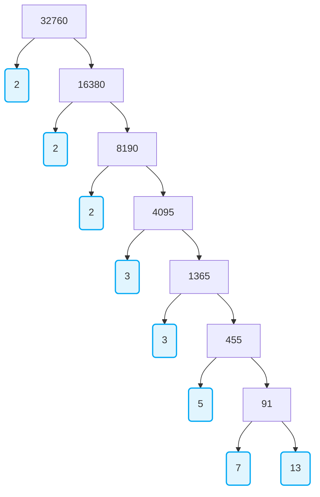

import Callout from '@/components/Callout.astro'

## Introduction to Prime Factorization

Any natural number can be written as a product of its prime factors. For example, $2 = 2$, $4 = 2 \times 2$, $253 = 11 \times 23$, and so on. 
If we take any collection of prime numbers and multiply them together (allowing repetitions), we produce composite numbers. The foundational question is: *Can every composite number be written as the product of powers of primes?* 

The answer is yes, and it is formalized by the Fundamental Theorem of Arithmetic.

<Callout variant="tip">
**Theorem 1.1 (Fundamental Theorem of Arithmetic):** 
Every composite number can be expressed (factorised) as a product of primes, and this factorisation is unique, apart from the order in which the prime factors occur.
</Callout>

This means that for any composite number $x$, we factorize it as $x = p_1 p_2 \dots p_n$, where $p_1, p_2, \dots, p_n$ are primes written in ascending order ($p_1 \leq p_2 \leq \dots \leq p_n$). Once the order is ascending, the factorization is completely unique.

## The Factor Tree

We can use a "factor tree" to find the prime factorization of a large number. Let us take a large number, say $32760$, and factorize it.

So we have factorised $32760$ as:
$$
32760 = 2 \times 2 \times 2 \times 3 \times 3 \times 5 \times 7 \times 13
$$
Or, writing it as a product of powers of primes:
$$
32760 = 2^3 \times 3^2 \times 5^1 \times 7^1 \times 13^1
$$

## Calculating HCF and LCM using Prime Factorization

You can find the Highest Common Factor (HCF) and Least Common Multiple (LCM) of two positive integers using the prime factorization method.

*   **HCF:** Product of the **smallest power** of each common prime factor in the numbers.
*   **LCM:** Product of the **greatest power** of each prime factor, involved in the numbers.

### Relationship Between HCF and LCM

For any two positive integers $a$ and $b$:
$$
\text{HCF}(a, b) \times \text{LCM}(a, b) = a \times b
$$
*Note: This relationship works only for TWO numbers. It does not directly hold for three numbers.*

<Callout variant="info">
**Historical Note: Carl Friedrich Gauss (1777 – 1855)**
An equivalent version of this theorem was first recorded in Euclid's *Elements*. However, the first correct proof was given by Carl Friedrich Gauss in his book *Disquisitiones Arithmeticae*. Gauss is often called the 'Prince of Mathematicians'.
</Callout>