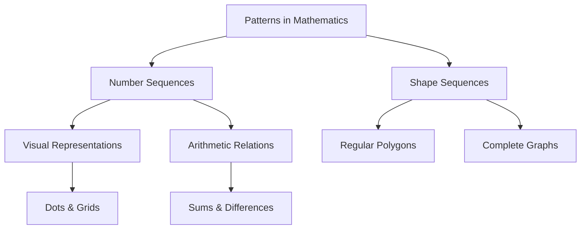

import Callout from '@/components/Callout.astro'

## Introduction

Mathematics is, in large part, the search for patterns and the explanation of why those patterns exist. These patterns are found everywhere—in nature, in the motion of planets, in our homes, and even in the technology we use daily.

Mathematicians view mathematics as both an art and a science. The goal is not just to discover a pattern (like a sequence of numbers) but to understand the *reason* it exists. This understanding often leads to breakthroughs in science, such as the theory of gravitation or the curing of diseases.

### Key Topics in this Chapter

1.  **Patterns in Numbers:** Exploring sequences like whole numbers, odd/even numbers, and special sequences like triangular and square numbers.
2.  **Visualising Sequences:** Using dots and shapes to represent numbers, helping us "see" the math.
3.  **Relations among Sequences:** Discovering how adding odd numbers creates squares, or how counting up and down relates to square numbers.
4.  **Patterns in Shapes:** Analyzing geometric sequences like Regular Polygons and Complete Graphs.

<Callout variant="tip">
**Definition:** The branch of Mathematics that studies patterns in whole numbers is called **Number Theory**. The branch that studies patterns in shapes is called **Geometry**.
</Callout>

### Quick Reference: Common Sequences

| Sequence Name | First Few Terms | Rule (Informal) |
| :--- | :--- | :--- |
| **Counting Numbers** | $1, 2, 3, 4, 5, \dots$ | Add 1 |
| **Odd Numbers** | $1, 3, 5, 7, 9, \dots$ | Add 2 (starting at 1) |
| **Even Numbers** | $2, 4, 6, 8, 10, \dots$ | Add 2 (starting at 2) |
| **Triangular Numbers** | $1, 3, 6, 10, 15, \dots$ | Sum of first $n$ counting numbers |
| **Square Numbers** | $1, 4, 9, 16, 25, \dots$ | $n \times n$ |
| **Powers of 2** | $1, 2, 4, 8, 16, \dots$ | Multiply previous term by 2 |

