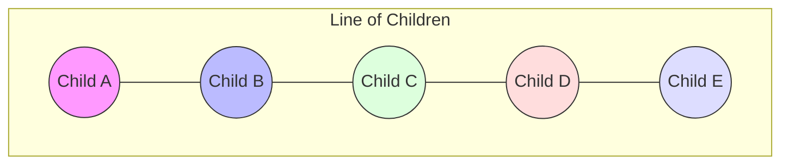

import Callout from '@/components/Callout.astro'

## What are numbers telling us?

Sometimes numbers don't just count objects; they describe a relationship. Consider a game played by children standing in a line.

### The Rules
Imagine children standing in a line. Each child looks at their immediate neighbors (left and right).
-   Say **'1'** if there is **only one** taller child standing next to them.
-   Say **'2'** if **both** children standing next to them are taller.
-   Say **'0'** if **neither** of the children standing next to them are taller (i.e., the speaker is taller than both neighbors).

<Callout variant="info">
**Note:** Children at the ends of the line only have one neighbor. If that neighbor is taller, they say '1'. If that neighbor is shorter, they say '0'. They can never say '2'.
</Callout>

### Visualizing the Logic

Let's analyze a scenario with 5 children. We represent their heights visually.

If we assign heights:
1.  **Child A (Short)** - Neighbor B is Taller $\rightarrow$ Says **1**
2.  **Child B (Tall)** - Neighbors A and C are Shorter $\rightarrow$ Says **0**
3.  **Child C (Short)** - Neighbors B and D are Taller $\rightarrow$ Says **2**
4.  **Child D (Tall)** - Neighbors C and E are Shorter $\rightarrow$ Says **0**
5.  **Child E (Short)** - Neighbor D is Taller $\rightarrow$ Says **1**

The sequence would be: **1, 0, 2, 0, 1**.

This activity teaches us that numbers can encode **local geometry** or **ordering** information.