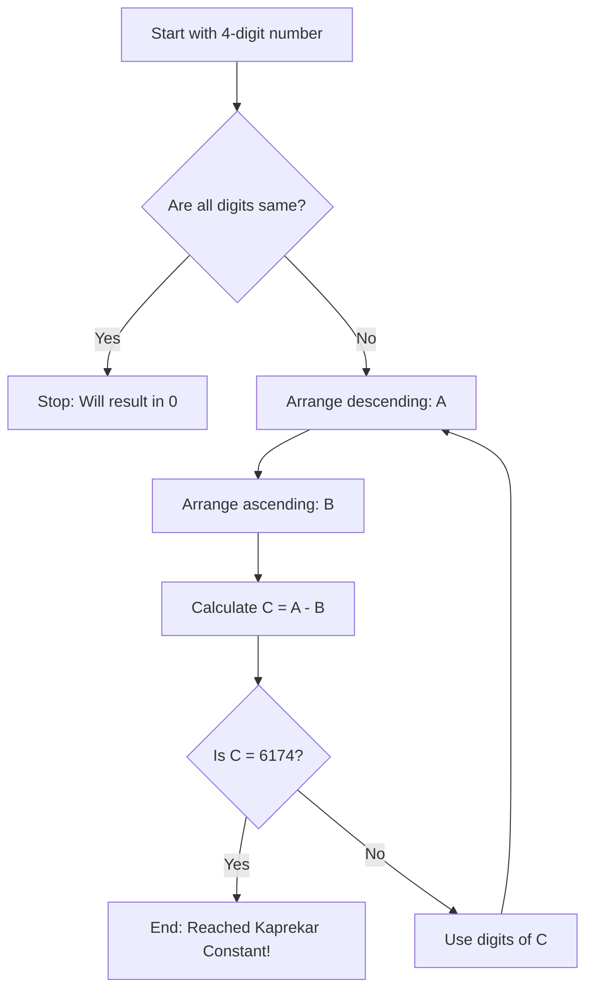

import Callout from '@/components/Callout.astro'

## D.R. Kaprekar and 6174

D.R. Kaprekar, an Indian mathematician, discovered a magical property of 4-digit numbers.

### The Algorithm
1.  Pick any 4-digit number with at least two different digits (e.g., $6382$).
2.  Arrange digits in **descending** order to make the largest number ($8632$).
3.  Arrange digits in **ascending** order to make the smallest number ($2368$).
4.  Subtract the smaller from the larger.
5.  Repeat with the result.

### Flowchart of the Process

### Example Walkthrough
Let's try with **$3524$**.
1.  Digits: $5, 4, 3, 2$.
    -   $5432 - 2345 = 3087$
2.  Digits from $3087$: $8, 7, 3, 0$.
    -   $8730 - 0378 = 8352$
3.  Digits from $8352$: $8, 5, 3, 2$.
    -   $8532 - 2358 = 6174$
4.  Digits from $6174$: $7, 6, 4, 1$.
    -   $7641 - 1467 = 6174$ (It repeats!)

<Callout variant="tip">
**Try it yourself:** How many steps does your birth year take to reach 6174?
</Callout>