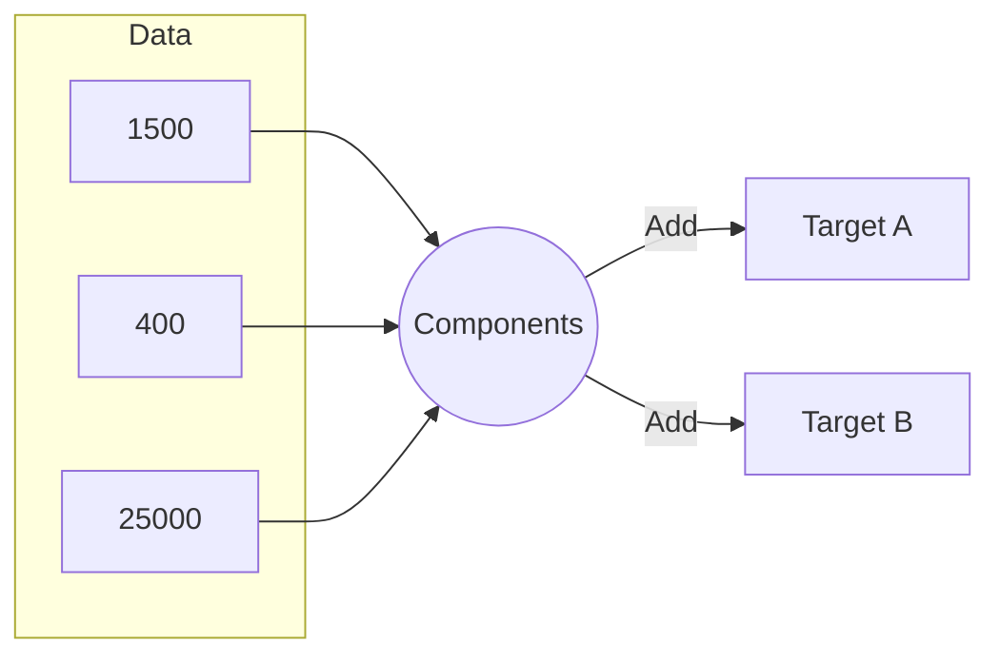

import Callout from '@/components/Callout.astro'

## Decomposing Numbers

Complex addition can be simplified by breaking numbers down.
Look at how we can form **38,800** using base components:
$$ 25,000 + 13,000 + (400 \times 2) $$
$$ = 38,000 + 800 = 38,800 $$

### Strategy Visualization

## Digits and Operations Puzzles

**Challenge:** Add two 5-digit numbers to get a sum greater than $90,250$.
-   Example: $45,126 + 45,126 = 90,252$.

**Challenge:** Subtract two 5-digit numbers to get a difference less than $56,503$.
-   Example: $60,000 - 10,000 = 50,000$.

<Callout variant="tip">
**Tip:** When asked to find examples, try using "Round Numbers" (numbers ending in 0) first to make the estimation easier.
</Callout>