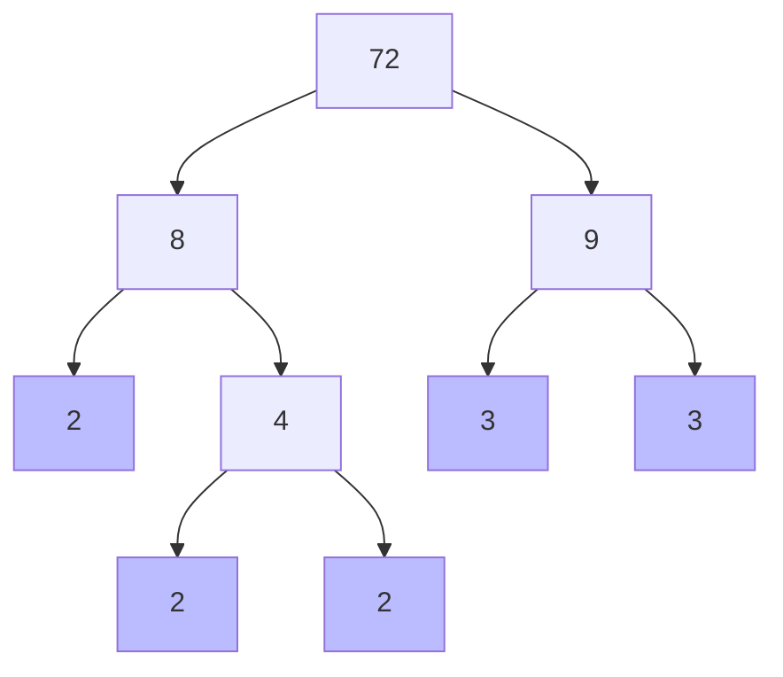

import Callout from '@/components/Callout.astro'

## Example 1: The Factor Tree

**Question:** Draw a factor tree for 72 and write its prime factorisation.

**Solution:**

*   Break 72 into $8 \times 9$.
*   Break 8 into $2 \times 4$.
*   Break 4 into $2 \times 2$.
*   Break 9 into $3 \times 3$.
*   Collect the "leaves" (end numbers): $2, 2, 2, 3, 3$.

**Result:** $72 = 2 \times 2 \times 2 \times 3 \times 3$.

## Example 2: Common Factors

**Question:** Find the common factors of 24 and 30.

**Step 1:** List factors of 24.
$$ 1, 2, 3, 4, 6, 8, 12, 24 $$

**Step 2:** List factors of 30.
$$ 1, 2, 3, 5, 6, 10, 15, 30 $$

**Step 3:** Identify numbers in both lists.
*   1
*   2
*   3
*   6

**Answer:** The common factors are 1, 2, 3, and 6.

## Example 3: Divisibility Logic

**Question:** A number is divisible by 5 and 12. By which other numbers must it be divisible?

**Solution:**
If a number is divisible by 5 and 12 (which are co-prime), it is divisible by their product:
$$ 5 \times 12 = 60 $$
It is also divisible by all factors of 60:
1, 2, 3, 4, 6, 10, 15, 20, 30.

## Example 4: The Mystery Number

**Question:** I am a number between 50 and 60. I am a prime number. If you reverse my digits, I am still a prime number. Who am I?

**Solution:**
1.  List numbers between 50 and 60: 51, 52, 53, 54, 55, 56, 57, 58, 59.
2.  Find Primes:
    *   51 ($3 \times 17$) - No.
    *   53 - Yes (Prime).
    *   57 ($3 \times 19$) - No.
    *   59 - Yes (Prime).
3.  Check Reverse:
    *   Reverse 53 $\to$ 35 (Divisible by 5). Not prime.
    *   Reverse 59 $\to$ 95 (Divisible by 5). Not prime.

*Wait, let's re-read the question constraints typical for this grade.*
Perhaps the range is different or I missed a number?
Primes in 50s: 53, 59.
Reverse 53 = 35 ($5 \times 7$).
Reverse 59 = 95 ($5 \times 19$).
Maybe the number is not between 50 and 60?
Let's try **13**. Reverse 31. Both Prime.
Let's try **17**. Reverse 71. Both Prime.
Let's try **37**. Reverse 73. Both Prime.
The example question asks for 50-60.
**Answer:** There is no such number between 50 and 60.
(This helps students learn to verify constraints!).

Let's try **79** (between 70 and 80).
Reverse 97. Both Prime!