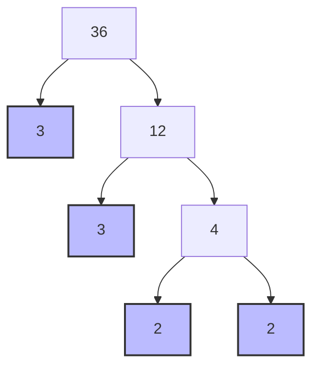

import Callout from '@/components/Callout.astro'

## What is Prime Factorisation?

Every composite number can be written as a product of prime numbers. This "fingerprint" is unique to every number.

**Example: 56**
$$ 56 = 8 \times 7 $$
7 is prime. 8 is composite ($2 \times 4$).
$$ 56 = 2 \times 4 \times 7 $$
4 is composite ($2 \times 2$).
$$ 56 = 2 \times 2 \times 2 \times 7 $$
Now, all factors (2, 2, 2, 7) are prime. This is the **Prime Factorisation** of 56.

## Factor Trees

A factor tree is a visual way to find prime factors. Let's factorise **36**.

**Result:** $36 = 3 \times 3 \times 2 \times 2$.
(The blue nodes are the prime numbers).

<Callout variant="tip">
**Order doesn't matter:**
$2 \times 2 \times 3 \times 3$ is the same as $3 \times 2 \times 3 \times 2$.
However, we usually write them in increasing order: $2 \times 2 \times 3 \times 3$.
</Callout>

## Applications

### 1. Checking for Co-primes
If two numbers have **no common prime factors** in their factorisation, they are co-prime.
*   $40 = 2 \times 2 \times 2 \times 5$
*   $231 = 3 \times 7 \times 11$
*   No matching primes. **40 and 231 are co-prime.**

### 2. Checking Divisibility
Is **168** divisible by **12**?
*   $168 = 2 \times 2 \times 2 \times 3 \times 7$
*   $12 = 2 \times 2 \times 3$
*   Does 168 contain all the "parts" of 12?
    *   It has two 2s (Yes).
    *   It has one 3 (Yes).
*   Therefore, $168 = (2 \times 2 \times 3) \times (2 \times 7) = 12 \times 14$.
*   **Yes, 168 is divisible by 12.**