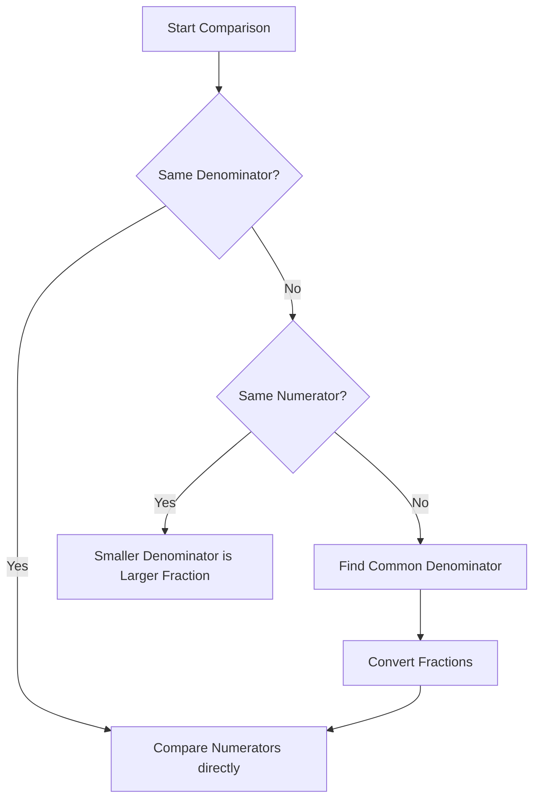

<<<FILE_START: index.mdx>>>
---
title: "Fractions"
description: "Understanding fractions as shares, units, and numbers on the number line, including operations and history."
date: 2025-01-15
tags: ["math", "grade-6", "fractions", "brahmagupta"]
order: 1
draft: false
---

import Callout from '@/components/Callout.astro'

## Introduction

Recall that when a whole number of things are shared equally among some number of people, **fractions** tell us how much each share is.

If one *roti* (flatbread) is divided equally between two children, each child gets half a *roti*.
The fraction 'one half' is written as $\frac{1}{2}$.

<Callout variant="tip">
**Key Concept:**
A fraction represents a part of a whole. In the fraction $\frac{5}{6}$:
*   **5** is the **Numerator** (number of parts we have).
*   **6** is the **Denominator** (total number of equal parts the whole is divided into).
</Callout>

### A Pinch of History
In ancient India, a fraction was called **bhinna** (Sanskrit for 'broken'). It was also called *bhaga* or *ansha* meaning 'part'.
The way we write fractions today ($\frac{1}{2}$) originated in India. It appears in the **Bakhshali manuscript** (c. 300 CE) and was used by mathematicians like **Aryabhata** and **Brahmagupta**.

### Chapter Contents
1.  **[Fractional Units and Shares](./topics/01-fractional-units.mdx)**: Understanding unit fractions like $\frac{1}{2}, \frac{1}{3}$.
2.  **[Measuring & Number Line](./topics/02-number-line.mdx)**: Folding paper strips and marking fractions on a number line.
3.  **[Mixed Fractions](./topics/03-mixed-fractions.mdx)**: Fractions greater than 1 and mixed numbers.
4.  **[Equivalent Fractions](./topics/04-equivalent-fractions.mdx)**: Different fractions that represent the same value.
5.  **[Comparing Fractions](./topics/05-comparing-fractions.mdx)**: Which fraction is bigger?
6.  **[Operations](./topics/06-operations.mdx)**: Addition and subtraction using Brahmagupta's method.

### Formula Sheet

$$
\text{Fraction} = \frac{\text{Numerator}}{\text{Denominator}}
$$

**Brahmagupta’s Method for Addition/Subtraction:**
1.  Find a common denominator.
2.  Convert fractions to equivalent fractions.
3.  Add or subtract the numerators.
4.  Simplify if needed.

$$
\frac{a}{b} + \frac{c}{d} = \frac{ad + bc}{bd}
$$
<<<FILE_END>>>

<<<FILE_START: topics/01-fractional-units.mdx>>>
---
title: "Fractional Units and Shares"
description: "Understanding unit fractions and parts of a whole."
date: 2025-01-15
tags: ["fractions", "unit-fractions", "chikki"]
order: 2
draft: false
---

import Callout from '@/components/Callout.astro'

## Fractional Units

When one unit is divided into several equal parts, each part is called a **fractional unit** (or unit fraction).
Examples: $\frac{1}{2}, \frac{1}{3}, \frac{1}{4}, \frac{1}{10}, \frac{1}{100}$.

### Comparing Unit Fractions
A common mistake is thinking that $\frac{1}{9}$ is bigger than $\frac{1}{5}$ because 9 is bigger than 5. **This is incorrect.**

Think of sharing a *roti*:
*   If you share 1 roti among **5 people**, you get a slice size of $\frac{1}{5}$.
*   If you share 1 roti among **9 people**, you get a slice size of $\frac{1}{9}$.

Sharing with *more* people means each person gets *less*. Therefore:
$$
\frac{1}{9} < \frac{1}{5}
$$

  <svg width="400" height="200" viewBox="0 0 400 200" xmlns="http://www.w3.org/2000/svg">
    <!-- Circle 1/2 -->
    <circle cx="100" cy="100" r="50" stroke="currentColor" stroke-width="2" fill="none" />
    <line x1="100" y1="50" x2="100" y2="150" stroke="currentColor" stroke-width="2" />
    <text x="100" y="180" text-anchor="middle" fill="currentColor" font-size="14">1/2 (Shared by 2)</text>

    <!-- Circle 1/4 -->
    <circle cx="300" cy="100" r="50" stroke="currentColor" stroke-width="2" fill="none" />
    <line x1="300" y1="50" x2="300" y2="150" stroke="currentColor" stroke-width="2" />
    <line x1="250" y1="100" x2="350" y2="100" stroke="currentColor" stroke-width="2" />
    <text x="300" y="180" text-anchor="middle" fill="currentColor" font-size="14">1/4 (Shared by 4)</text>

    <text x="200" y="100" text-anchor="middle" fill="currentColor" font-size="20">></text>
  </svg>

## Parts of a Whole

We can measure larger pieces using fractional units.
If a whole *chikki* (a sweet bar) is broken into 4 equal pieces, the fractional unit is $\frac{1}{4}$.

If we take 3 of those pieces, we have:
$$
3 \text{ times } \frac{1}{4} = \frac{3}{4} \text{ chikki}
$$

We usually read $\frac{3}{4}$ as "three quarters" or "three upon four". Reading it as "3 times $\frac{1}{4}$" helps us understand that it consists of 3 units of size $\frac{1}{4}$.
<<<FILE_END>>>

<<<FILE_START: topics/02-number-line.mdx>>>
---
title: "Measuring and the Number Line"
description: "Using paper folding and number lines to represent fractions."
date: 2025-01-15
tags: ["number-line", "measurement"]
order: 3
draft: false
---

import Callout from '@/components/Callout.astro'

## Measuring with Paper Strips

Imagine a strip of paper representing **1 unit**.
1.  Fold it in half $\rightarrow$ Each part is $\frac{1}{2}$.
2.  Fold it in half again $\rightarrow$ You now have 4 equal parts. Each is $\frac{1}{4}$.
3.  Fold it again $\rightarrow$ You have 8 equal parts. Each is $\frac{1}{8}$.

We can collect these units:
*   2 times $\frac{1}{4} = \frac{2}{4}$
*   3 times $\frac{1}{4} = \frac{3}{4}$
*   4 times $\frac{1}{4} = \frac{4}{4} = 1$ (The whole strip)

## Fractions on the Number Line

We place integers ($0, 1, 2, \dots$) on the number line. We can also place fractions between them.
The distance between 0 and 1 is one unit.

If we divide this distance into 2 equal parts, the midpoint is $\frac{1}{2}$.
If we divide it into 3 equal parts, the marks are at $\frac{1}{3}$ and $\frac{2}{3}$.

  <svg width="500" height="150" viewBox="0 0 500 150" xmlns="http://www.w3.org/2000/svg">
    <!-- Main Line -->
    <line x1="50" y1="100" x2="450" y2="100" stroke="currentColor" stroke-width="2" />
    <line x1="440" y1="95" x2="450" y2="100" stroke="currentColor" stroke-width="2" />
    <line x1="440" y1="105" x2="450" y2="100" stroke="currentColor" stroke-width="2" />

    <!-- Ticks 0 and 1 and 2 -->
    <line x1="50" y1="90" x2="50" y2="110" stroke="currentColor" stroke-width="2" />
    <text x="50" y="130" text-anchor="middle" fill="currentColor">0</text>

    <line x1="250" y1="90" x2="250" y2="110" stroke="currentColor" stroke-width="2" />
    <text x="250" y="130" text-anchor="middle" fill="currentColor">1</text>

    <line x1="450" y1="90" x2="450" y2="110" stroke="currentColor" stroke-width="2" />
    <text x="450" y="130" text-anchor="middle" fill="currentColor">2</text>

    <!-- Fraction Ticks (Thirds) -->
    <line x1="116" y1="95" x2="116" y2="105" stroke="currentColor" stroke-width="1.5" />
    <text x="116" y="80" text-anchor="middle" fill="currentColor" font-size="12">1/3</text>

    <line x1="183" y1="95" x2="183" y2="105" stroke="currentColor" stroke-width="1.5" />
    <text x="183" y="80" text-anchor="middle" fill="currentColor" font-size="12">2/3</text>

    <!-- Fraction Ticks (Halves) -->
    <line x1="150" y1="100" x2="150" y2="100" stroke="currentColor" stroke-width="1" />
    <!-- Just illustrating thirds above, let's do halves below -->

    <text x="250" y="60" text-anchor="middle" fill="currentColor" font-weight="bold">Number Line representing Thirds</text>
  </svg>

<Callout variant="tip">
**Note:** There are countless fractions between 0 and 1!
</Callout>
<<<FILE_END>>>

<<<FILE_START: topics/03-mixed-fractions.mdx>>>
---
title: "Mixed Fractions"
description: "Understanding fractions greater than 1 and mixed numbers."
date: 2025-01-15
tags: ["mixed-fractions", "improper-fractions"]
order: 4
draft: false
---

import Callout from '@/components/Callout.astro'

## Fractions Greater than One

If the numerator is **smaller** than the denominator (e.g., $\frac{1}{2}, \frac{3}{4}$), the fraction is less than 1.
If the numerator is **larger** than the denominator (e.g., $\frac{3}{2}, \frac{5}{4}$), the fraction is greater than 1.

Example: $\frac{3}{2}$ means 3 halves.
$$
\frac{3}{2} = \frac{1}{2} + \frac{1}{2} + \frac{1}{2} = 1 + \frac{1}{2}
$$

## Mixed Numbers

A **mixed number** (or mixed fraction) contains a whole number part and a fractional part.
Instead of writing $\frac{9}{2}$, we can see how many whole units fit.
$\frac{9}{2}$ is 9 halves. Since 2 halves make a whole, 8 halves make 4 wholes. We have 1 half left.
$$
\frac{9}{2} = 4 \frac{1}{2}
$$

This is read as "four and a half".

### Converting Mixed Numbers to Fractions
To write $3 \frac{3}{4}$ as a regular fraction:
1.  Multiply the whole number by the denominator: $3 \times 4 = 12$.
2.  Add the numerator: $12 + 3 = 15$.
3.  Keep the denominator: $\frac{15}{4}$.

$$
3 \frac{3}{4} = \frac{(3 \times 4) + 3}{4} = \frac{15}{4}
$$
<<<FILE_END>>>

<<<FILE_START: topics/04-equivalent-fractions.mdx>>>
---
title: "Equivalent Fractions"
description: "Finding fractions that represent the same value."
date: 2025-01-15
tags: ["equivalent-fractions", "simplest-form"]
order: 5
draft: false
---

import Callout from '@/components/Callout.astro'

## Visualizing Equivalent Fractions

Look at a fraction wall.
*   One strip divided into 2 parts ($\frac{1}{2}$).
*   One strip divided into 4 parts ($\frac{1}{4}$).

You will see that one piece of $\frac{1}{2}$ is the exact same length as two pieces of $\frac{1}{4}$.
$$
\frac{1}{2} = \frac{2}{4} = \frac{3}{6} = \frac{4}{8}
$$

These are **equivalent fractions**. They denote the same length but use different fractional units.

## Creating Equivalent Fractions
To find an equivalent fraction, multiply the numerator and denominator by the **same number**.

$$
\frac{3}{4} = \frac{3 \times 2}{4 \times 2} = \frac{6}{8}
$$
$$
\frac{3}{4} = \frac{3 \times 10}{4 \times 10} = \frac{30}{40}
$$

## Lowest Terms (Simplest Form)
A fraction is in its **lowest terms** if the numerator and denominator have no common factor except 1.
To simplify a fraction, divide the numerator and denominator by their highest common factor.

**Example:** Reduce $\frac{16}{20}$.
Common factor is 4.
$$
\frac{16 \div 4}{20 \div 4} = \frac{4}{5}
$$
$\frac{4}{5}$ is the simplest form.
<<<FILE_END>>>

<<<FILE_START: topics/05-comparing-fractions.mdx>>>
---
title: "Comparing Fractions"
description: "Methods to determine which fraction is larger."
date: 2025-01-15
tags: ["comparing", "inequality"]
order: 6
draft: false
---

import Callout from '@/components/Callout.astro'

## Case 1: Same Denominator
If the denominators (fractional units) are the same, just compare the numerators.
$$
\frac{4}{7} \text{ vs } \frac{6}{7}
$$
Since $6 > 4$, clearly $\frac{6}{7} > \frac{4}{7}$.

## Case 2: Same Numerator
If the numerators are the same (same number of pieces), compare the denominators. Remember: Larger denominator = Smaller pieces.
$$
\frac{3}{4} \text{ vs } \frac{3}{7}
$$
Shares of $\frac{1}{4}$ are bigger than shares of $\frac{1}{7}$. So $\frac{3}{4} > \frac{3}{7}$.

## Case 3: Different Numerators and Denominators
To compare $\frac{4}{5}$ and $\frac{7}{9}$, we must make their units (denominators) the same.

1.  Find a common multiple for 5 and 9. $5 \times 9 = 45$.
2.  Convert both fractions to have denominator 45.

$$
\frac{4}{5} = \frac{4 \times 9}{5 \times 9} = \frac{36}{45}
$$
$$
\frac{7}{9} = \frac{7 \times 5}{9 \times 5} = \frac{35}{45}
$$

3.  Compare: $\frac{36}{45} > \frac{35}{45}$.
    Therefore, $\frac{4}{5} > \frac{7}{9}$.

<<<FILE_END>>>

<<<FILE_START: topics/06-operations.mdx>>>
---
title: "Addition and Subtraction"
description: "Adding and subtracting fractions using Brahmagupta's method."
date: 2025-01-15
tags: ["addition", "subtraction", "brahmagupta"]
order: 7
draft: false
---

import Callout from '@/components/Callout.astro'

## Brahmagupta's Method

Brahmagupta (628 CE) formally described the rules we use today.

### Step 1: Common Fractional Unit
If denominators are different, find a common denominator (often the product of the two denominators).
Example: Add $\frac{1}{4}$ and $\frac{1}{3}$.
Common denominator = $4 \times 3 = 12$.

$$
\frac{1}{4} = \frac{3}{12}, \quad \frac{1}{3} = \frac{4}{12}
$$

### Step 2: Add/Subtract Numerators
Now that the units are the same ($\frac{1}{12}$), we just add the number of pieces.
$$
\frac{3}{12} + \frac{4}{12} = \frac{3+4}{12} = \frac{7}{12}
$$

### Subtraction Example
Subtract $\frac{2}{3}$ from $\frac{3}{4}$.
Problem: $\frac{3}{4} - \frac{2}{3}$.
Common Denominator: 12.

$$
\frac{3}{4} = \frac{9}{12}
$$
$$
\frac{2}{3} = \frac{8}{12}
$$

$$
\frac{9}{12} - \frac{8}{12} = \frac{1}{12}
$$
<<<FILE_END>>>

<<<FILE_START: solutions/section-7.1.mdx>>>
---
title: "Solutions: Section 7.1"
description: "Solutions for exercises on Page 152."
date: 2025-01-15
tags: ["solutions", "page-152"]
order: 1
draft: false
---

## Page 152: Figure It Out

**Q1. Three guavas together weigh 1 kg. If they are roughly of the same size, each guava will roughly weigh ____ kg.**
**Answer:** $\frac{1}{3}$ kg.
*Reasoning:* 1 whole unit divided by 3 items.

**Q2. A wholesale merchant packed 1 kg of rice in four packets of equal weight. The weight of each packet is ___ kg.**
**Answer:** $\frac{1}{4}$ kg.

**Q3. Four friends ordered 3 glasses of sugarcane juice and shared it equally among themselves. Each one drank ____ glass of sugarcane juice.**
**Answer:** $\frac{3}{4}$ glass.
*Reasoning:* 3 items shared by 4 people $\rightarrow \frac{3}{4}$.

**Q4. The big fish weighs $\frac{1}{2}$ kg. The small one weighs $\frac{1}{4}$ kg. Together they weigh ____ kg.**
**Answer:** $\frac{3}{4}$ kg.
*Reasoning:* $\frac{1}{2} = \frac{2}{4}$. So $\frac{2}{4} + \frac{1}{4} = \frac{3}{4}$.

**Q5. Arrange these fraction words in order of size from the smallest to the biggest:**
*One and a half, three quarters, one and a quarter, half, quarter, two and a half.*

**Answer:**
1.  Quarter ($\frac{1}{4}$)
2.  Half ($\frac{1}{2}$)
3.  Three quarters ($\frac{3}{4}$)
4.  One and a quarter ($1 \frac{1}{4}$)
5.  One and a half ($1 \frac{1}{2}$)
6.  Two and a half ($2 \frac{1}{2}$)
<<<FILE_END>>>

<<<FILE_START: solutions/section-7.2.mdx>>>
---
title: "Solutions: Section 7.2"
description: "Solutions for exercises on Page 154-155."
date: 2025-01-15
tags: ["solutions", "page-154", "page-155"]
order: 2
draft: false
---

## Page 154
**Q. By dividing the whole chikki into 6 equal parts in different ways, we get $\frac{1}{6}$ chikki pieces of different shapes. Are they of the same size?**
**Answer:** Yes.
*Reasoning:* Even though the shapes are different, they represent the same amount (area) of the whole because the whole was divided into 6 *equal* parts.

## Page 155: Figure It Out
**Q. The figures below show different fractional units of a whole chikki. How much of a whole chikki is each piece?**

*   **a.** $\frac{1}{12}$
*   **b.** $\frac{1}{4}$
*   **c.** $\frac{1}{8}$
*   **d.** $\frac{1}{6}$
*   **e.** $\frac{1}{8}$
*   **f.** $\frac{1}{6}$
*   **g.** $\frac{1}{24}$
*   **h.** $\frac{1}{24}$
<<<FILE_END>>>

<<<FILE_START: solutions/section-7.3.mdx>>>
---
title: "Solutions: Section 7.3"
description: "Solutions for exercises on Page 158."
date: 2025-01-15
tags: ["solutions", "page-158"]
order: 3
draft: false
---

## Page 158: Figure It Out

**Q1. Continue this table of $\frac{1}{2}$ for 2 more steps.**
*   6 times $\frac{1}{2}$ is $\frac{1}{2} + \frac{1}{2} + \frac{1}{2} + \frac{1}{2} + \frac{1}{2} + \frac{1}{2} = 3$ (or $\frac{6}{2}$).
*   7 times $\frac{1}{2}$ is $\dots = \frac{7}{2}$.

**Q2. Can you create a similar table for $\frac{1}{4}$?**
*   1 time $\frac{1}{4} = \frac{1}{4}$
*   2 times $\frac{1}{4} = \frac{1}{4} + \frac{1}{4} = \frac{2}{4}$ (Half)
*   3 times $\frac{1}{4} = \frac{3}{4}$
*   4 times $\frac{1}{4} = \frac{4}{4} = 1$ (Whole)

**Q4. Draw a picture and write an addition statement:**
**a. 5 times $\frac{1}{4}$ of a roti:**
$$ \frac{1}{4} + \frac{1}{4} + \frac{1}{4} + \frac{1}{4} + \frac{1}{4} = \frac{5}{4} $$

**b. 9 times $\frac{1}{4}$ of a roti:**
$$ \frac{9}{4} = 2 \frac{1}{4} $$

**Q5. Match each fractional unit with the correct picture:**
*   $\frac{1}{3} \rightarrow$ Circle cut into 3 sectors.
*   $\frac{1}{5} \rightarrow$ Circle cut into 5 sectors.
*   $\frac{1}{6} \rightarrow$ Circle cut into 6 sectors.
*   $\frac{1}{8} \rightarrow$ Circle cut into 8 sectors.
<<<FILE_END>>>

<<<FILE_START: solutions/section-7.4.mdx>>>
---
title: "Solutions: Section 7.4"
description: "Solutions for exercises on Page 159-160 (Number Line)."
date: 2025-01-15
tags: ["solutions", "page-159", "page-160"]
order: 4
draft: false
---

## Page 159
**Q1. Length of blue line (1 unit into 3 parts):**
**Answer:** $\frac{2}{3}$

**Q2. Length of blue lines (1 unit into 5 parts):**
**Answer:** $\frac{2}{5}$ and $\frac{4}{5}$.

**Q3. Unit divided into 8 equal parts:**
**Answer:** $\frac{1}{8}, \frac{2}{8}, \frac{3}{8} \dots$

## Page 160: Figure It Out

**Q3. How many fractions lie between 0 and 1?**
**Answer:** Infinite (Uncountable). You can always divide a unit into smaller and smaller pieces.

**Q4. Length of blue and black line:**
Blue line is $\frac{1}{2}$.
Black line extends to 3 half-units: $\frac{3}{2}$.

**Q5. Lengths of black lines:**
Based on division into 5 parts:
$\frac{6}{5}, \frac{7}{5}, \frac{8}{5}, \frac{9}{5}$.
<<<FILE_END>>>

<<<FILE_START: solutions/section-7.5.mdx>>>
---
title: "Solutions: Section 7.5"
description: "Solutions for exercises on Page 162-163 (Mixed Fractions)."
date: 2025-01-15
tags: ["solutions", "page-162", "page-163"]
order: 5
draft: false
---

## Page 162: Figure It Out

**Q1. How many whole units in $\frac{7}{2}$?**
**Answer:** 3 whole units ($\frac{6}{2} = 3$), with $\frac{1}{2}$ remaining.

**Q2. Whole units in $\frac{4}{3}$ and $\frac{7}{3}$?**
*   $\frac{4}{3}$: 1 whole unit.
*   $\frac{7}{3}$: 2 whole units.

**Q3. Write as mixed fractions:**
*   **a.** $\frac{9}{2} = 4 \frac{1}{2}$
*   **b.** $\frac{9}{5} = 1 \frac{4}{5}$
*   **c.** $\frac{21}{19} = 1 \frac{2}{19}$
*   **d.** $\frac{47}{9} = 5 \frac{2}{9}$
*   **e.** $\frac{12}{11} = 1 \frac{1}{11}$
*   **f.** $\frac{19}{6} = 3 \frac{1}{6}$

## Page 163: Figure It Out (Mixed to Improper)

**Q1. Write as fractions:**
*   **a.** $3 \frac{1}{4} = \frac{13}{4}$
*   **b.** $7 \frac{2}{3} = \frac{23}{3}$
*   **c.** $9 \frac{4}{9} = \frac{85}{9}$
*   **d.** $3 \frac{1}{6} = \frac{19}{6}$
*   **e.** $2 \frac{3}{11} = \frac{25}{11}$
*   **f.** $3 \frac{9}{10} = \frac{39}{10}$
<<<FILE_END>>>

<<<FILE_START: solutions/section-7.6.mdx>>>
---
title: "Solutions: Section 7.6"
description: "Solutions for Equivalent Fractions (Pages 164-173)."
date: 2025-01-15
tags: ["solutions", "equivalent-fractions"]
order: 6
draft: false
---

## Page 164
**Q1. Are $\frac{1}{2}$ and $\frac{3}{6}$ equal?**
**Answer:** Yes.

**Q2. Are $\frac{2}{3}$ and $\frac{4}{6}$ equivalent?**
**Answer:** Yes, they represent the same length.

**Q3. How many $\frac{1}{6}$ make a $\frac{1}{2}$?**
**Answer:** 3 pieces ($\frac{3}{6} = \frac{1}{2}$).

## Page 165
**Q2. Two equivalent fractions for $\frac{2}{6}$:**
**Answer:** $\frac{1}{3}$ (simplest) and $\frac{3}{9}$ (multiplying by 1.5 numerator/denominator, or rather $\frac{1}{3} \times \frac{3}{3} = \frac{3}{9}$). Another is $\frac{4}{12}$.

**Q3. $\frac{4}{6} = \dots$**
**Answer:** $\frac{2}{3}, \frac{6}{9}, \frac{8}{12}, \frac{10}{15}$.

## Page 166 (Rotis)
**Q1. 3 rotis shared by 4 children.**
*   Fraction: $\frac{3}{4}$
*   Division Fact: $3 \div 4 = \frac{3}{4}$
*   Addition Fact: $\frac{1}{4} + \frac{1}{4} + \frac{1}{4} = \frac{3}{4}$ (Wait, text says $1 = \frac{1}{4}+\dots$ for 1 roti. For 3 rotis, it is adding shares). Actually, each child gets $\frac{3}{4}$.

**Q2. 2 Rotis shared by 4 children.**
**Answer:** Each gets $\frac{2}{4} = \frac{1}{2}$ roti.

**Q3. Anil (2 cakes, 5 children).**
**Answer:** $\frac{2}{5}$ cake.

## Page 168
**Q1. Missing numbers:**
*   **a.** $\frac{5}{4} = \frac{10}{8}$ (Ans: 10)
*   **b.** $\frac{4}{3} = \frac{16}{12}$ (Wait, $4 \times 4 = 16$. The text says "12 kgs... in \_\_ bags". Ah, potatoes. 4kg in 3 bags = $\frac{4}{3}$ kg/bag. 12 kg in $x$ bags. To have same weight/bag: $\frac{12}{x} = \frac{4}{3}$. $4 \times 3 = 12$, so $3 \times 3 = 9$. Ans: 9 bags).

## Page 172: Equivalent Fractions
**Q. Find equivalent pairs:**
*   **a.** $\frac{7}{2} = \frac{35}{10}$, $\frac{3}{5} = \frac{6}{10}$ (Common denom 10)
*   **b.** $\frac{8}{3} = \frac{16}{6}$, $\frac{5}{6}$ stays $\frac{5}{6}$ (Common denom 6)
*   **c.** $\frac{3}{4} = \frac{15}{20}$, $\frac{3}{5} = \frac{12}{20}$ (Common denom 20)

## Page 173: Lowest Terms
**Q. Express in lowest terms:**
*   **a.** $\frac{17}{51} = \frac{1}{3}$ (Divide by 17)
*   **b.** $\frac{64}{144}$ -> $\frac{32}{72}$ -> $\frac{16}{36}$ -> $\frac{8}{18}$ -> $\frac{4}{9}$.
*   **c.** $\frac{126}{147}$ -> Divide by 7 -> $\frac{18}{21}$ -> Divide by 3 -> $\frac{6}{7}$.
*   **d.** $\frac{525}{112}$ -> Divide by 7 -> $\frac{75}{16}$.
<<<FILE_END>>>

<<<FILE_START: solutions/section-7.7.mdx>>>
---
title: "Solutions: Section 7.7"
description: "Solutions for Comparing Fractions (Page 174)."
date: 2025-01-15
tags: ["solutions", "comparing"]
order: 7
draft: false
---

## Page 174: Figure It Out

**Q1. Compare and Justify:**
*   **a. $\frac{8}{3}, \frac{5}{2}$**:
    *   LCM of 3 and 2 is 6.
    *   $\frac{16}{6}$ vs $\frac{15}{6}$.
    *   $\frac{8}{3} > \frac{5}{2}$.
*   **b. $\frac{4}{9}, \frac{3}{7}$**:
    *   $\frac{28}{63}$ vs $\frac{27}{63}$.
    *   $\frac{4}{9} > \frac{3}{7}$.
*   **c. $\frac{7}{10}, \frac{9}{14}$**:
    *   LCM is 70.
    *   $\frac{49}{70}$ vs $\frac{45}{70}$.
    *   $\frac{7}{10} > \frac{9}{14}$.

**Q2. Ascending Order:**
*   **a. $\frac{7}{10}, \frac{11}{15}, \frac{2}{5}$**:
    *   LCM of 10, 15, 5 is 30.
    *   $\frac{21}{30}, \frac{22}{30}, \frac{12}{30}$.
    *   Order: $\frac{2}{5} < \frac{7}{10} < \frac{11}{15}$.

**Q3. Descending Order:**
*   **a. $\frac{25}{16}, \frac{7}{8}, \frac{13}{4}, \frac{17}{32}$**:
    *   LCM is 32.
    *   $\frac{50}{32}, \frac{28}{32}, \frac{104}{32}, \frac{17}{32}$.
    *   Order: $\frac{13}{4} > \frac{25}{16} > \frac{7}{8} > \frac{17}{32}$.
<<<FILE_END>>>

<<<FILE_START: solutions/section-7.8.mdx>>>
---
title: "Solutions: Section 7.8"
description: "Solutions for Operations (Pages 179-182)."
date: 2025-01-15
tags: ["solutions", "addition", "subtraction"]
order: 8
draft: false
---

## Page 179: Addition
**Q1. Brahmagupta's Method:**
*   **a.** $\frac{2}{7} + \frac{5}{7} + \frac{6}{7} = \frac{13}{7}$
*   **b.** $\frac{3}{4} + \frac{1}{3} = \frac{9}{12} + \frac{4}{12} = \frac{13}{12}$
*   **c.** $\frac{2}{3} + \frac{5}{6} = \frac{4}{6} + \frac{5}{6} = \frac{9}{6} = \frac{3}{2}$

**Q2. Paint Mixture:**
$\frac{2}{3} + \frac{3}{4} = \frac{8}{12} + \frac{9}{12} = \frac{17}{12}$ litres ($1 \frac{5}{12}$ litres).

**Q3. Lace:**
Geeta $\frac{2}{5}$, Shamim $\frac{3}{4}$.
Total: $\frac{2}{5} + \frac{3}{4} = \frac{8}{20} + \frac{15}{20} = \frac{23}{20}$ meters.
Since $\frac{23}{20} > 1$, yes, it is sufficient to cover 1 meter.

## Page 181: Subtraction (Simple)
**Q1.** $\frac{5}{8} - \frac{3}{8} = \frac{2}{8} = \frac{1}{4}$
**Q2.** $\frac{7}{9} - \frac{5}{9} = \frac{2}{9}$
**Q3.** $\frac{10}{27} - \frac{1}{27} = \frac{9}{27} = \frac{1}{3}$

## Page 182: Subtraction (Brahmagupta)
**Q1.**
*   **a.** $\frac{8}{15} - \frac{3}{15} = \frac{5}{15} = \frac{1}{3}$
*   **b.** $\frac{2}{5} - \frac{4}{15} = \frac{6}{15} - \frac{4}{15} = \frac{2}{15}$
*   **d.** $\frac{2}{3} - \frac{1}{2} = \frac{4}{6} - \frac{3}{6} = \frac{1}{6}$

**Q2. Subtract as indicated:**
*   **a. $\frac{13}{4}$ from $\frac{10}{3}$:** $\frac{10}{3} - \frac{13}{4} = \frac{40}{12} - \frac{39}{12} = \frac{1}{12}$
*   **b. $\frac{18}{5}$ from $\frac{23}{3}$:** $\frac{23}{3} - \frac{18}{5} = \frac{115}{15} - \frac{54}{15} = \frac{61}{15}$

**Q3. Problems:**
*   **a. Jaya's walk:** Total $\frac{7}{10}$. Auto $\frac{1}{2}$.
    Walk = $\frac{7}{10} - \frac{1}{2} = \frac{7}{10} - \frac{5}{10} = \frac{2}{10} = \frac{1}{5}$ km.
*   **b. Jeevika vs Namit:**
    Jeevika: $\frac{10}{3} = \frac{40}{12}$.
    Namit: $\frac{13}{4} = \frac{39}{12}$.
    $\frac{39}{12} < \frac{40}{12}$, so Namit takes less time.
    Difference: $\frac{1}{12}$ minute.
<<<FILE_END>>>

<<<FILE_START: practice/puzzle.mdx>>>
---
title: "Practice Puzzle: Summing to 1"
description: "Can you find different unit fractions that add up to 1?"
date: 2025-01-15
tags: ["puzzle", "egyptian-fractions"]
order: 1
draft: false
---

import Callout from '@/components/Callout.astro'

## The Problem

It is easy to add the *same* fractional unit to get 1:
$$ \frac{1}{2} + \frac{1}{2} = 1 $$
$$ \frac{1}{3} + \frac{1}{3} + \frac{1}{3} = 1 $$

**Challenge:** Can you write 1 as the sum of **three different** fractional units?

## The Solution

We need three unit fractions:
$$ \frac{1}{a} + \frac{1}{b} + \frac{1}{c} = 1 $$

Let's start with the biggest unit fraction: $\frac{1}{2}$.
Remaining needed: $\frac{1}{2}$.
Now we need two different fractions that add up to $\frac{1}{2}$.
We know $\frac{1}{4} + \frac{1}{4} = \frac{1}{2}$, but they must be *different*.

Let's try $\frac{1}{3}$.
$\frac{1}{2} + \frac{1}{3} = \frac{3}{6} + \frac{2}{6} = \frac{5}{6}$.
We are short by $\frac{1}{6}$.
Wait! That's a unit fraction!

So:
$$ \frac{1}{2} + \frac{1}{3} + \frac{1}{6} = 1 $$

  <svg width="200" height="200" viewBox="0 0 200 200" xmlns="http://www.w3.org/2000/svg">
    <circle cx="100" cy="100" r="90" fill="#e0e0e0" stroke="currentColor" stroke-width="2" />

    <!-- 1/2 slice -->
    <path d="M100,100 L100,10 A90,90 0 0,1 100,190 Z" fill="#FFB6C1" stroke="currentColor" />
    <text x="130" y="100" fill="black" font-size="14">1/2</text>

    <!-- 1/3 slice (approx 120 degrees) starts at -90, ends at 30? No, let's just draw lines -->
    <!-- 1/2 takes 180 deg. Remaining 180. 1/3 is 120 deg. 1/6 is 60 deg. -->

    <!-- 1/3 Slice -->
    <path d="M100,100 L100,10 A90,90 0 0,0 12.06,55.26 Z" fill="#87CEFA" stroke="currentColor" />
     <text x="60" y="70" fill="black" font-size="14">1/3</text>

    <!-- 1/6 Slice -->
    <path d="M100,100 L12.06,55.26 A90,90 0 0,0 100,190 Z" fill="#90EE90" stroke="currentColor" />
    <text x="50" y="140" fill="black" font-size="14">1/6</text>
  </svg>

**Try This:** Can you find **four** different fractional units that add up to 1?
<<<FILE_END>>>
