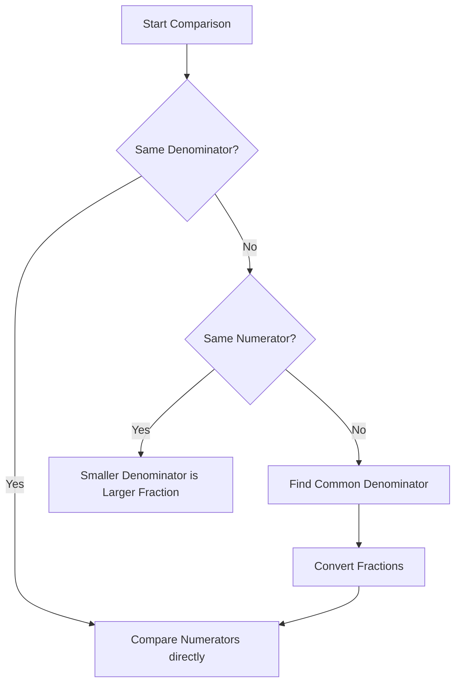

import Callout from '@/components/Callout.astro'

## Case 1: Same Denominator
If the denominators (fractional units) are the same, just compare the numerators.
$$
\frac{4}{7} \text{ vs } \frac{6}{7}
$$
Since $6 > 4$, clearly $\frac{6}{7} > \frac{4}{7}$.

## Case 2: Same Numerator
If the numerators are the same (same number of pieces), compare the denominators. Remember: Larger denominator = Smaller pieces.
$$
\frac{3}{4} \text{ vs } \frac{3}{7}
$$
Shares of $\frac{1}{4}$ are bigger than shares of $\frac{1}{7}$. So $\frac{3}{4} > \frac{3}{7}$.

## Case 3: Different Numerators and Denominators
To compare $\frac{4}{5}$ and $\frac{7}{9}$, we must make their units (denominators) the same.

1.  Find a common multiple for 5 and 9. $5 \times 9 = 45$.
2.  Convert both fractions to have denominator 45.

$$
\frac{4}{5} = \frac{4 \times 9}{5 \times 9} = \frac{36}{45}
$$
$$
\frac{7}{9} = \frac{7 \times 5}{9 \times 5} = \frac{35}{45}
$$

3.  Compare: $\frac{36}{45} > \frac{35}{45}$.
    Therefore, $\frac{4}{5} > \frac{7}{9}$.

