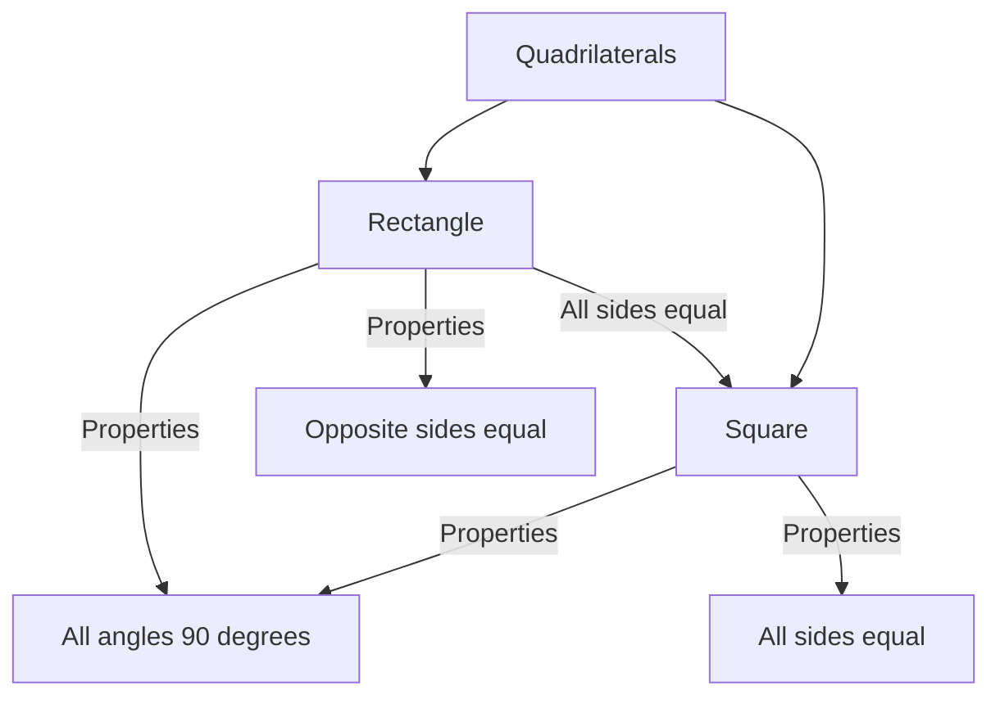

import Callout from '@/components/Callout.astro'

## Introduction

Geometry is not just about calculating areas or angles; it is also about creating shapes with precision. In this chapter, we explore **Constructions**. We will move beyond freehand sketching and learn to use mathematical instruments to draw accurate geometric figures.

### Tools of the Trade

To play with constructions, we need two primary tools:

1.  **The Ruler:** Used to draw straight lines and measure lengths.
2.  **The Compass:** Used to draw circles and arcs, and to mark off equal lengths.

### Chapter Overview

We will progress through the following concepts:

*   **Circles:** Understanding the center and radius.
*   **Basic Shapes:** Properties of squares and rectangles.
*   **Construction:** Step-by-step methods to draw squares and rectangles using given measurements.
*   **Diagonals:** Exploring how diagonals relate to the sides and angles of quadrilaterals.
*   **Equidistant Points:** finding points that are the same distance from two other points (intersection of circles).

### Key Properties at a Glance

**Circle**
*   **Center:** The fixed point from which all points on the curve are equidistant.
*   **Radius:** The constant distance between the center and any point on the circle.

**Rectangle**
*   **Sides:** Opposite sides are equal in length.
*   **Angles:** All four angles are $90^\circ$ (Right angles).
*   **Diagonals:** Equal in length and bisect each other.

**Square**
*   **Sides:** All four sides are equal in length.
*   **Angles:** All four angles are $90^\circ$.
*   **Diagonals:** Equal in length and intersect at $90^\circ$.

## Visualizing the Concepts

Below is a map of how we classify the shapes we will construct:

