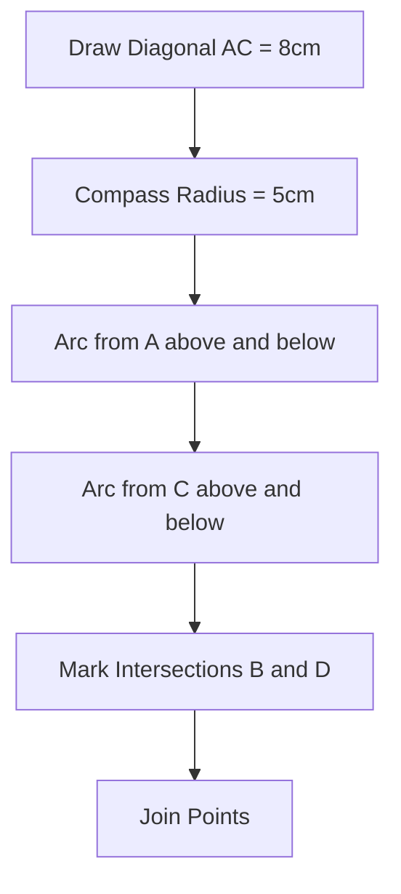

import Callout from '@/components/Callout.astro'

## Example 1: The Wavy Line

**Problem:** Construct a wave pattern on a line segment $AB = 12$ cm consisting of 3 equal semicircles.

**Solution:**
1.  **Analyze:** Total length is 12 cm. There are 3 semicircles.
    *   Diameter of each semicircle $= 12 \div 3 = 4$ cm.
    *   Radius of each semicircle $= 2$ cm.
2.  **Mark Points:**
    *   Draw $AB = 12$ cm.
    *   Mark points $P$ and $Q$ at 4 cm and 8 cm from $A$.
    *   The segments are $AP$, $PQ$, and $QB$.
3.  **Find Centers:**
    *   Midpoint of $AP$ is $C_1$ (at 2 cm).
    *   Midpoint of $PQ$ is $C_2$ (at 6 cm).
    *   Midpoint of $QB$ is $C_3$ (at 10 cm).
4.  **Draw Arcs:**
    *   Place compass at $C_1$, radius 2 cm. Draw semicircle **Up**.
    *   Place compass at $C_2$, radius 2 cm. Draw semicircle **Down**.
    *   Place compass at $C_3$, radius 2 cm. Draw semicircle **Up**.

## Example 2: The Rhombus

**Problem:** Construct a shape with 4 sides of length 5 cm, but diagonal length 8 cm.

**Solution:**
1.  **Draw Diagonal:** Draw line segment $AC = 8$ cm.
2.  **Locate Vertices:** We need points $B$ and $D$ such that they are 5 cm away from both $A$ and $C$.
3.  **Upper Point (B):**
    *   Center $A$, radius 5 cm $\to$ Draw arc above $AC$.
    *   Center $C$, radius 5 cm $\to$ Draw arc intersecting the first one. Mark as $B$.
4.  **Lower Point (D):**
    *   Center $A$, radius 5 cm $\to$ Draw arc below $AC$.
    *   Center $C$, radius 5 cm $\to$ Draw arc intersecting the first one. Mark as $D$.
5.  **Connect:** Join $AB, BC, CD, DA$.
6.  **Verify:** This is a Rhombus (all sides 5 cm) but not a square (diagonal is 8 cm, not $5\sqrt{2} \approx 7.07$ cm).

