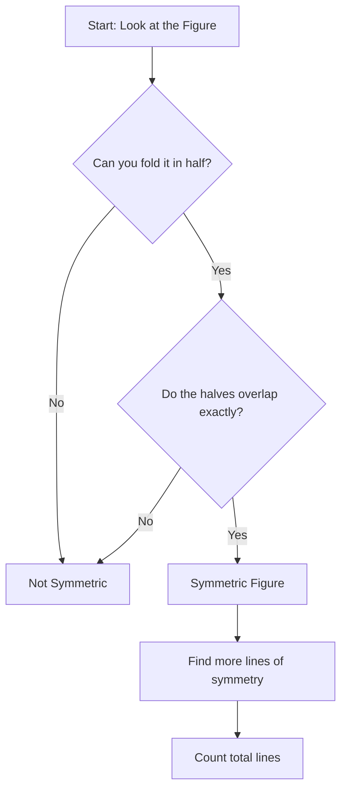
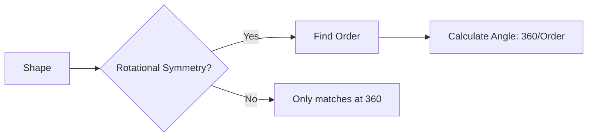
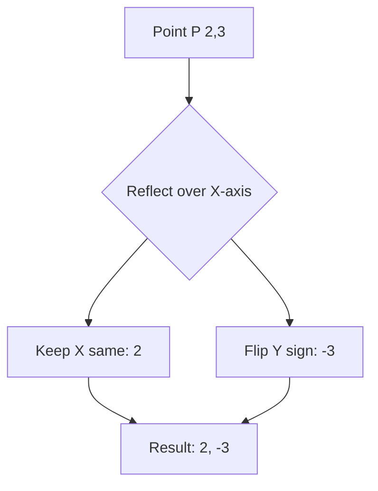

<<<FILE_START: index.mdx>>>
---
title: "Symmetry"
description: "Explore the beautiful world of symmetry, including line symmetry, mirror reflections, and rotational symmetry."
date: 2024-04-10
tags: ["math", "geometry", "grade-6", "symmetry"]
order: 1
draft: false
---

import Callout from '@/components/Callout.astro'

# Symmetry

Look around you! From the petals of a flower to the wings of a butterfly, and even in man-made structures like the Taj Mahal, symmetry is everywhere. Symmetry brings balance, harmony, and beauty to the objects we see.

In this chapter, we will explore the mathematical definitions of symmetry, learn how to identify lines of symmetry, and understand how objects can have symmetry even when they are rotating.

## Key Concepts

| Concept | Definition | Example |
| :--- | :--- | :--- |
| **Line of Symmetry** | A line that divides a figure into two identical halves that overlap exactly when folded. | A butterfly, the letter 'A'. |
| **Reflection Symmetry** | Another name for line symmetry, where one half is the mirror image of the other. | Looking in a mirror. |
| **Rotational Symmetry** | When a figure looks exactly the same after being rotated by a certain angle (less than 360°) around a fixed point. | A windmill, a ceiling fan. |
| **Centre of Rotation** | The fixed point around which a figure is rotated. | The center of a wheel. |
| **Angle of Symmetry** | The specific angle at which a figure looks the same after rotation. | A square has angles of 90°, 180°, 270°, 360°. |

## Formula Sheet

### Rotational Symmetry
For a regular polygon with $n$ sides:
1.  **Number of Lines of Symmetry:** $n$
2.  **Order of Rotational Symmetry:** $n$
3.  **Smallest Angle of Symmetry:** $\frac{360^{\circ}}{n}$

$$
\text{Angle of Symmetry} = \frac{360^{\circ}}{\text{Order of Symmetry}}
$$

    <svg width="300" height="200" viewBox="0 0 300 200" xmlns="http://www.w3.org/2000/svg">
        <!-- Background -->
        <rect width="300" height="200" fill="none" />
        
        <!-- Symmetry Example: Butterfly-like shape -->
        <g transform="translate(80, 100)">
            <path d="M0,-60 C30,-80 80,-40 10,0 C80,40 30,80 0,60 C-30,80 -80,40 -10,0 C-80,-40 -30,-80 0,-60 Z" fill="#FF9999" fill-opacity="0.3" stroke="currentColor" stroke-width="2"/>
            <line x1="0" y1="-70" x2="0" y2="70" stroke="currentColor" stroke-dasharray="5,5" stroke-width="2"/>
            <text x="-40" y="90" fill="currentColor" font-size="12">Line Symmetry</text>
        </g>

        <!-- Rotational Example: Pinwheel -->
        <g transform="translate(220, 100)">
            <path d="M0,0 L30,-30 L30,0 Z" fill="#9999FF" fill-opacity="0.5" stroke="currentColor"/>
            <path d="M0,0 L30,30 L0,30 Z" fill="#9999FF" fill-opacity="0.5" stroke="currentColor" transform="rotate(90)"/>
            <path d="M0,0 L30,30 L0,30 Z" fill="#9999FF" fill-opacity="0.5" stroke="currentColor" transform="rotate(180)"/>
            <path d="M0,0 L30,30 L0,30 Z" fill="#9999FF" fill-opacity="0.5" stroke="currentColor" transform="rotate(270)"/>
             <circle cx="0" cy="0" r="3" fill="currentColor"/>
             <text x="-40" y="60" fill="currentColor" font-size="12">Rotational Symmetry</text>
        </g>
    </svg>

## Chapter Contents

1.  **[Line of Symmetry](./topics/01-line-of-symmetry.mdx)** - Understanding mirror halves and folding.
2.  **[Rotational Symmetry](./topics/02-rotational-symmetry.mdx)** - Spinning shapes and finding patterns.
3.  **[Solutions](./solutions/page-219.mdx)** - Step-by-step answers to all textbook exercises.
<<<FILE_END>>>

<<<FILE_START: topics/01-line-of-symmetry.mdx>>>
---
title: "Line of Symmetry"
description: "Learn about line symmetry, reflection symmetry, and how to identify symmetric figures."
date: 2024-04-10
tags: ["symmetry", "reflection", "geometry"]
order: 1
draft: false
---

import Callout from '@/components/Callout.astro'

## What is a Line of Symmetry?

Imagine you have a picture of a butterfly. If you fold the picture exactly in the middle, the left side fits perfectly over the right side. The line along which you fold the paper is called the **Line of Symmetry** (or Axis of Symmetry).

<Callout variant="tip">
**Definition:** A line that cuts a figure into two parts that exactly overlap (coincide) when folded along that line is called a **Line of Symmetry**.
</Callout>

This is also known as **Reflection Symmetry** because one half acts like a mirror reflection of the other half.

### Figures with One Line of Symmetry
Some shapes have only one way to be folded to overlap perfectly. An isosceles triangle (with only two equal sides) is a good example.

    <svg width="200" height="200" viewBox="0 0 200 200">
        <!-- Isosceles Triangle -->
        <polygon points="100,20 40,150 160,150" fill="none" stroke="currentColor" stroke-width="2"/>
        <!-- Line of Symmetry -->
        <line x1="100" y1="10" x2="100" y2="160" stroke="currentColor" stroke-dasharray="5,5" stroke-width="2"/>
        <text x="110" y="30" fill="currentColor" font-size="12">Fold here</text>
    </svg>

### Figures with Multiple Lines of Symmetry
Some figures are very regular and can be folded in many ways.

1.  **Rectangle:** Has **2** lines of symmetry (vertical and horizontal). *Note: The diagonal is NOT a line of symmetry for a non-square rectangle.*
2.  **Square:** Has **4** lines of symmetry (vertical, horizontal, and two diagonals).
3.  **Equilateral Triangle:** Has **3** lines of symmetry.

    <svg width="400" height="150" viewBox="0 0 400 150">
        <!-- Rectangle -->
        <g transform="translate(50, 25)">
            <rect x="0" y="20" width="80" height="60" fill="none" stroke="currentColor" stroke-width="2"/>
            <line x1="40" y1="10" x2="40" y2="90" stroke="currentColor" stroke-dasharray="4,4"/>
            <line x1="-10" y1="50" x2="90" y2="50" stroke="currentColor" stroke-dasharray="4,4"/>
            <text x="20" y="110" fill="currentColor" font-size="12">Rectangle (2)</text>
        </g>

        <!-- Square -->
        <g transform="translate(200, 25)">
            <rect x="0" y="20" width="60" height="60" fill="none" stroke="currentColor" stroke-width="2"/>
            <line x1="30" y1="10" x2="30" y2="90" stroke="currentColor" stroke-dasharray="4,4"/>
            <line x1="-10" y1="50" x2="70" y2="50" stroke="currentColor" stroke-dasharray="4,4"/>
            <line x1="-5" y1="15" x2="65" y2="85" stroke="currentColor" stroke-dasharray="4,4"/>
            <line x1="65" y1="15" x2="-5" y2="85" stroke="currentColor" stroke-dasharray="4,4"/>
            <text x="10" y="110" fill="currentColor" font-size="12">Square (4)</text>
        </g>
    </svg>

## Reflection Symmetry
When we look into a mirror, we see a reflection. If an object is placed before a mirror, the image formed is symmetrical to the object with respect to the mirror line.

*   Left becomes Right.
*   Right becomes Left.

This property is used in paper cutting. If you fold a paper and cut a shape, unfolding it reveals a symmetric pattern where the fold line is the line of symmetry.

## Logic Flow: Identifying Symmetry

<<<FILE_END>>>

<<<FILE_START: topics/02-rotational-symmetry.mdx>>>
---
title: "Rotational Symmetry"
description: "Understand how figures can be symmetric when rotated around a fixed point."
date: 2024-04-10
tags: ["symmetry", "rotation", "geometry"]
order: 2
draft: false
---

import Callout from '@/components/Callout.astro'

## What is Rotational Symmetry?

Some figures don't have a line of symmetry (you can't fold them), but they still look "balanced". This usually means they have **Rotational Symmetry**.

If you rotate a figure around a fixed point (the **Centre of Rotation**), and it fits exactly onto itself *before* you complete a full turn ($360^{\circ}$), the figure has rotational symmetry.

    <svg width="200" height="200" viewBox="0 0 200 200">
        <circle cx="100" cy="100" r="2" fill="red" />
        <path d="M100,100 L100,20 L130,50 L100,100" fill="#ADD8E6" stroke="currentColor" />
        <path d="M100,100 L180,100 L150,130 L100,100" fill="#ADD8E6" stroke="currentColor" />
        <path d="M100,100 L100,180 L70,150 L100,100" fill="#ADD8E6" stroke="currentColor" />
        <path d="M100,100 L20,100 L50,70 L100,100" fill="#ADD8E6" stroke="currentColor" />
        <circle cx="100" cy="100" r="5" fill="red" />
        <text x="110" y="110" fill="currentColor" font-size="10">Centre</text>
    </svg>

### Key Terms

1.  **Centre of Rotation:** The fixed point about which the object turns.
2.  **Angle of Rotation (or Angle of Symmetry):** The smallest angle you need to turn the shape for it to look the same.
3.  **Order of Symmetry:** The number of times the shape looks like its original self in one full turn ($360^{\circ}$).

### Formula
$$
\text{Smallest Angle of Symmetry} = \frac{360^{\circ}}{\text{Order of Symmetry}}
$$

### Examples

#### 1. The Square
A square has rotational symmetry.
*   Rotate $90^{\circ}$: Looks same.
*   Rotate $180^{\circ}$: Looks same.
*   Rotate $270^{\circ}$: Looks same.
*   Rotate $360^{\circ}$: Back to start.
*   **Order:** 4
*   **Angle:** $90^{\circ}$

#### 2. Equilateral Triangle
*   Rotate $120^{\circ}$: Looks same.
*   Rotate $240^{\circ}$: Looks same.
*   Rotate $360^{\circ}$: Back to start.
*   **Order:** 3
*   **Angle:** $120^{\circ}$

#### 3. Regular Hexagon
*   **Order:** 6
*   **Angle:** $360^{\circ} \div 6 = 60^{\circ}$

#### 4. The Circle
A circle is special. You can rotate it by **any** angle, and it matches. It has an infinite order of rotational symmetry.

<Callout variant="tip">
**Note:** Every object looks the same after a $360^{\circ}$ rotation. If an object *only* looks the same after $360^{\circ}$, we usually say it does **not** have rotational symmetry.
</Callout>

### Figures with Both Reflection and Rotational Symmetry
Many regular shapes have both types of symmetry.
*   **Square:** 4 lines of symmetry, Order 4 rotational symmetry.
*   **Circle:** Infinite lines of symmetry, Infinite rotational symmetry.

However, some shapes like a **Parallelogram** (not a rhombus or rectangle) have rotational symmetry (Order 2) but **no** lines of symmetry.

<<<FILE_END>>>

<<<FILE_START: solutions/page-219.mdx>>>
---
title: "Solutions: Page 219"
description: "Solutions for 'Figure it Out' on Page 219 of Chapter 9."
date: 2024-04-10
tags: ["solutions", "grade-6", "symmetry"]
order: 3
draft: false
---

## Figure it Out (Page 219)

**1. Do you see any line of symmetry in the figures at the start of the chapter? What about in the picture of the cloud?**

**Answer:**
*   **Flower:** Yes, it has 6 lines of symmetry (one through each petal).
*   **Rangoli:** Yes, it has 4 lines of symmetry.
*   **Butterfly:** Yes, it has 1 vertical line of symmetry.
*   **Pinwheel:** No, it has no line of symmetry (it has rotational symmetry, but you cannot fold it to match).
*   **Cloud:** No, clouds are irregular shapes and do not have a line of symmetry.

**2. For each of the following figures, identify the line(s) of symmetry if it exists.**

*Referencing the shapes provided in the textbook (Kite, Rhombus, Trapezoid, Triangle).*

**Solution:**

    <svg width="400" height="150" viewBox="0 0 400 150">
        <!-- Shape 1: Arrowhead/Kite pointing left -->
        <g transform="translate(50, 75)">
            <polygon points="-30,0 20,-30 20,30" fill="none" stroke="currentColor" stroke-width="2"/>
             <!-- Horizontal Symmetry Line -->
            <line x1="-40" y1="0" x2="40" y2="0" stroke="red" stroke-dasharray="4,4" />
        </g>

        <!-- Shape 2: Kite vertical -->
        <g transform="translate(150, 75)">
            <polygon points="0,-40 20,0 0,50 -20,0" fill="none" stroke="currentColor" stroke-width="2"/>
            <!-- Vertical Symmetry Line -->
            <line x1="0" y1="-50" x2="0" y2="60" stroke="red" stroke-dasharray="4,4" />
        </g>
        
        <!-- Shape 3: Trapezoid (Isosceles) -->
        <g transform="translate(250, 75)">
            <polygon points="-20,-30 20,-30 40,30 -40,30" fill="none" stroke="currentColor" stroke-width="2"/>
             <!-- Vertical Symmetry Line -->
            <line x1="0" y1="-40" x2="0" y2="40" stroke="red" stroke-dasharray="4,4" />
        </g>
        
        <!-- Shape 4: L Shape -->
        <g transform="translate(350, 75)">
             <path d="M-20,-30 L0,-30 L0,10 L30,10 L30,30 L-20,30 Z" fill="none" stroke="currentColor" stroke-width="2"/>
             <!-- Line of symmetry along diagonal corner -->
             <line x1="-25" y1="35" x2="35" y2="-25" stroke="red" stroke-dasharray="4,4" />
        </g>
    </svg>

*   **Shape 1 (Arrowhead):** 1 horizontal line of symmetry.
*   **Shape 2 (Kite):** 1 vertical line of symmetry.
*   **Shape 3 (Isosceles Trapezoid):** 1 vertical line of symmetry.
*   **Shape 4 (L-Shape):** 1 line of symmetry along the diagonal corner (assuming legs are equal length).

<<<FILE_END>>>

<<<FILE_START: solutions/page-224.mdx>>>
---
title: "Solutions: Page 224"
description: "Solutions for Paper Folding Exercises 1-4."
date: 2024-04-10
tags: ["solutions", "grade-6", "paper-folding"]
order: 4
draft: false
---

## Exercises (Page 224)

**1. In each of the following figures, a hole was punched in a folded square sheet of paper and then the paper was unfolded. Identify the line along which the paper was folded.**

The positions of the holes tell us where the fold line (line of symmetry) must be. The fold line is always exactly halfway between the two matching holes.

*   **(a)** Holes are side-by-side horizontally. **Fold:** Vertical line.
*   **(b)** Holes are at diagonal corners. **Fold:** Diagonal line.
*   **(c)** Holes are stacked vertically. **Fold:** Horizontal line.
*   **(d)** Only one hole is visible, but the question implies unfolding. If the figure creates 4 holes from one punch, it was folded twice (vertically then horizontally). If it implies a single fold for a single hole, the question asks "How was it folded?" - For figure (d) in the solution key, it indicates folds vertically and horizontally to create the pattern shown in answers.

**2. Given the line(s) of symmetry, find the other hole(s):**

We need to "reflect" the existing hole across the dotted line.

    <svg width="500" height="100" viewBox="0 0 500 100">
        <!-- a -->
        <g transform="translate(50, 50)">
            <rect x="-30" y="-30" width="60" height="60" fill="none" stroke="currentColor"/>
            <line x1="-30" y1="-30" x2="30" y2="30" stroke="currentColor" stroke-dasharray="3,3"/>
            <circle cx="-15" cy="5" r="3" fill="blue" /> <!-- Original -->
            <circle cx="5" cy="-15" r="3" fill="red" /> <!-- Reflection -->
            <text x="-10" y="50" font-size="10">a</text>
        </g>
        <!-- b -->
        <g transform="translate(150, 50)">
             <rect x="-30" y="-30" width="60" height="60" fill="none" stroke="currentColor"/>
             <line x1="-30" y1="0" x2="30" y2="0" stroke="currentColor" stroke-dasharray="3,3"/>
             <circle cx="-15" cy="-15" r="3" fill="blue" />
             <circle cx="-15" cy="15" r="3" fill="red" />
             <text x="-10" y="50" font-size="10">b</text>
        </g>
         <!-- c -->
        <g transform="translate(250, 50)">
             <polygon points="0,-35 30,25 -30,25" fill="none" stroke="currentColor"/>
             <line x1="0" y1="-35" x2="0" y2="25" stroke="currentColor" stroke-dasharray="3,3"/>
             <circle cx="-10" cy="5" r="3" fill="blue" />
             <circle cx="10" cy="5" r="3" fill="red" />
             <text x="-10" y="50" font-size="10">c</text>
        </g>
         <!-- d -->
        <g transform="translate(350, 50)">
             <circle cx="0" cy="0" r="30" fill="none" stroke="currentColor"/>
             <line x1="-25" y1="15" x2="25" y2="-15" stroke="currentColor" stroke-dasharray="3,3"/>
             <circle cx="-10" cy="-15" r="3" fill="blue" />
             <circle cx="15" cy="10" r="3" fill="red" />
             <text x="-10" y="50" font-size="10">d</text>
        </g>
    </svg>

**3 & 4. Paper Cutting Predictions**

**(a)** Vertical fold, cut a triangle pointing right.
*   **Result:** When opened, you get a diamond or rhombus shape in the center.

**(b)** Horizontal fold, cut a pattern on the edge.
*   **Result:** The pattern mirrors on the top and bottom.

<<<FILE_END>>>

<<<FILE_START: solutions/page-226.mdx>>>
---
title: "Solutions: Page 226"
description: "Solutions for Paper Cutting Exercises 5-7."
date: 2024-04-10
tags: ["solutions", "grade-6", "paper-cutting"]
order: 5
draft: false
---

## Exercises (Page 226)

**5. Suppose you have to get each of these shapes with some folds and a single straight cut. How will you do it?**

*   **a. The hole in the centre is a square.**
    *   **Strategy:** Fold the paper vertically, then horizontally (quarter fold).
    *   **Cut:** Cut the corner that corresponds to the center of the paper. Since the desired shape is a square (straight edges), you cut diagonally across that corner if the square is tilted, or cut a square notch if it's aligned.
    *   **Correct Method:** Fold vertically, then horizontally. At the closed corner (center), cut off a small isosceles right triangle. When unfolded, the 4 triangles form a square (diamond orientation).

*   **b. The hole in the centre is a square (aligned).**
    *   **Strategy:** Fold vertically, then horizontally.
    *   **Cut:** Cut a square notch at the closed corner.

**6. How many lines of symmetry do these shapes have?**

*   **(a) Square diamond shape with extensions:**
    *   Looking at the figure, it has symmetry along the vertical, horizontal, and both diagonal axes.
    *   **Answer:** 4 Lines of Symmetry.

*   **(b) A triangle with equal sides and equal angles (Equilateral Triangle):**
    *   **Answer:** 3 Lines of Symmetry.

*   **(c) A hexagon with equal sides and equal angles (Regular Hexagon):**
    *   **Answer:** 6 Lines of Symmetry.

**7. Trace each figure and draw the lines of symmetry, if any:**

    <svg width="400" height="200" viewBox="0 0 400 200">
        <!-- Figure 1: Overlapping Squares -->
        <g transform="translate(50, 50)">
            <rect x="-20" y="-20" width="40" height="40" fill="none" stroke="currentColor"/>
            <rect x="-10" y="-10" width="20" height="20" fill="none" stroke="currentColor"/>
            <!-- Lines -->
            <line x1="0" y1="-30" x2="0" y2="30" stroke="red" stroke-dasharray="3,3"/>
            <line x1="-30" y1="0" x2="30" y2="0" stroke="red" stroke-dasharray="3,3"/>
            <line x1="-25" y1="-25" x2="25" y2="25" stroke="red" stroke-dasharray="3,3"/>
            <line x1="-25" y1="25" x2="25" y2="-25" stroke="red" stroke-dasharray="3,3"/>
            <text x="-20" y="50" font-size="10">4 Lines</text>
        </g>

         <!-- Figure 2: Elongated Hexagon -->
        <g transform="translate(150, 50)">
            <polygon points="0,-30 20,-10 20,10 0,30 -20,10 -20,-10" fill="none" stroke="currentColor"/>
            <line x1="0" y1="-35" x2="0" y2="35" stroke="red" stroke-dasharray="3,3"/>
            <line x1="-25" y1="0" x2="25" y2="0" stroke="red" stroke-dasharray="3,3"/>
            <text x="-20" y="50" font-size="10">2 Lines</text>
        </g>
        
        <!-- Figure 3: Odd Polygon -->
        <g transform="translate(250, 50)">
            <polygon points="0,-20 30,0 20,20 -20,20 -30,0" fill="none" stroke="currentColor"/>
            <line x1="0" y1="-25" x2="0" y2="25" stroke="red" stroke-dasharray="3,3"/>
            <text x="-20" y="50" font-size="10">1 Line</text>
        </g>

        <!-- Figure 4: Star -->
        <g transform="translate(350, 50)">
            <path d="M0,-30 L10,-10 L30,0 L10,10 L0,30 L-10,10 L-30,0 L-10,-10 Z" fill="none" stroke="currentColor"/>
             <line x1="0" y1="-35" x2="0" y2="35" stroke="red" stroke-dasharray="3,3"/>
             <line x1="-35" y1="0" x2="35" y2="0" stroke="red" stroke-dasharray="3,3"/>
            <text x="-20" y="50" font-size="10">2 Lines</text>
        </g>
    </svg>

<<<FILE_END>>>

<<<FILE_START: solutions/page-228.mdx>>>
---
title: "Solutions: Page 228"
description: "Solutions for Kolam and Triangle exercises 8-11."
date: 2024-04-10
tags: ["solutions", "grade-6", "drawing"]
order: 6
draft: false
---

## Exercises (Page 228)

**8. Find the lines of symmetry for the kolam below.**

The Kolam is a star-like pattern made of overlapping diamonds and squares.
**Answer:** It has **6** lines of symmetry (3 passing through the vertices, 3 passing between the vertices) due to its hexagonal structure.

**9. Draw the following triangles:**

*   **a. A triangle with exactly one line of symmetry.**
    *   **Solution:** An Isosceles Triangle (but not equilateral).
*   **b. A triangle with exactly three lines of symmetry.**
    *   **Solution:** An Equilateral Triangle.
*   **c. A triangle with no line of symmetry.**
    *   **Solution:** A Scalene Triangle (all sides different lengths).

**Question:** Is it possible to draw a triangle with exactly two lines of symmetry?
**Answer:** **No.** If a triangle has two lines of symmetry, the third median must also be a line of symmetry, making it an equilateral triangle with three lines. You cannot have exactly two.

**10. Draw figures with curved boundaries:**

*   **a. Exactly one line of symmetry:** A semi-circle or a mushroom shape.
*   **b. Exactly two lines of symmetry:** An ellipse (oval) or a figure-8 shape.
*   **c. Exactly four lines of symmetry:** A flower with 4 petals or a shape like a clover.

**11. Copy on squared paper. Complete them so that the blue line is a line of symmetry.**

    <svg width="500" height="200" viewBox="0 0 500 200">
        <!-- Grid setup helper -->
        <pattern id="grid" width="20" height="20" patternUnits="userSpaceOnUse">
            <path d="M 20 0 L 0 0 0 20" fill="none" stroke="lightgray" stroke-width="1"/>
        </pattern>
        
        <!-- b -->
        <g transform="translate(50, 20)">
            <rect width="100" height="100" fill="url(#grid)" stroke="gray"/>
            <!-- Original -->
            <path d="M20,60 L20,40 L40,40 L40,20 L60,20 L60,40 L100,60" fill="none" stroke="black" stroke-width="2"/>
            <!-- Symmetry Line -->
            <line x1="20" y1="60" x2="100" y2="60" stroke="blue" stroke-width="2"/>
            <!-- Completion (Mirror below) -->
            <path d="M20,60 L20,80 L40,80 L40,100 L60,100 L60,80 L100,60" fill="none" stroke="red" stroke-width="2" stroke-dasharray="4,4"/>
        </g>

        <!-- c -->
        <g transform="translate(200, 20)">
            <rect width="100" height="100" fill="url(#grid)" stroke="gray"/>
            <!-- Original -->
            <path d="M20,80 L20,60 L40,60 L40,40 L60,40 L60,20 L80,20" fill="none" stroke="black" stroke-width="2"/>
            <!-- Symmetry Line (Diagonal) -->
            <line x1="0" y1="100" x2="100" y2="0" stroke="blue" stroke-width="2"/>
             <!-- Completion -->
            <path d="M20,80 L40,80 L40,60 L60,60 L60,40 L80,40 L80,20" fill="none" stroke="red" stroke-width="2" stroke-dasharray="4,4"/>
        </g>
    </svg>

<<<FILE_END>>>

<<<FILE_START: solutions/page-229.mdx>>>
---
title: "Solutions: Page 229"
description: "Solutions for exercises 12-13 involving multiple symmetry lines."
date: 2024-04-10
tags: ["solutions", "grade-6", "grid-drawing"]
order: 7
draft: false
---

## Exercises (Page 229)

**12. Complete so the resulting figure has two lines of symmetry.**

The blue lines form a cross (+). We need to mirror the drawing into all four quadrants.

    <svg width="450" height="150" viewBox="0 0 450 150">
        <pattern id="grid" width="20" height="20" patternUnits="userSpaceOnUse">
            <path d="M 20 0 L 0 0 0 20" fill="none" stroke="lightgray" stroke-width="1"/>
        </pattern>

        <!-- a: Rectangle Diamond -->
        <g transform="translate(20, 20)">
             <rect width="100" height="100" fill="url(#grid)" stroke="gray"/>
             <line x1="50" y1="0" x2="50" y2="100" stroke="blue"/>
             <line x1="0" y1="50" x2="100" y2="50" stroke="blue"/>
             <!-- Original Top Left -->
             <line x1="10" y1="10" x2="50" y2="50" stroke="black" stroke-width="2"/>
             <!-- Completion -->
             <polygon points="10,10 90,10 90,90 10,90" fill="none" stroke="red" stroke-dasharray="3,3" stroke-width="2"/>
             <line x1="10" y1="10" x2="90" y2="90" stroke="red" stroke-dasharray="3,3"/>
             <line x1="90" y1="10" x2="10" y2="90" stroke="red" stroke-dasharray="3,3"/>
        </g>

         <!-- b: Star Shape -->
         <g transform="translate(150, 20)">
             <rect width="100" height="100" fill="url(#grid)" stroke="gray"/>
             <line x1="50" y1="0" x2="50" y2="100" stroke="blue"/>
             <line x1="0" y1="50" x2="100" y2="50" stroke="blue"/>
             <!-- Completion logic: Mirror quadrant 2 to 1, then both to 3 & 4 -->
             <polygon points="50,10 70,30 90,30 70,50 90,70 70,70 50,90 30,70 10,70 30,50 10,30 30,30" fill="none" stroke="red" stroke-width="2"/>
        </g>
    </svg>

**13. Copy on a dot grid. Draw two more lines to make a shape that has a line of symmetry.**

The goal is to complete the polygon so it is symmetric.
*   **Triangle:** Complete it to be isosceles.
*   **Polygon:** Mirror the existing lines across the implicit central axis.

<<<FILE_END>>>

<<<FILE_START: solutions/page-235.mdx>>>
---
title: "Solutions: Page 235"
description: "Solutions for Rotational Symmetry exercises."
date: 2024-04-10
tags: ["solutions", "grade-6", "rotational-symmetry"]
order: 8
draft: false
---

## Questions (Page 235)

**Can you draw a figure with radial arms that has:**

*   **a) Exactly 5 angles of symmetry:**
    *   Draw a figure with 5 equally spaced arms (like a starfish).
    *   **Angle:** $360^{\circ} \div 5 = 72^{\circ}$.
    *   **Angles of Symmetry:** $72^{\circ}, 144^{\circ}, 216^{\circ}, 288^{\circ}, 360^{\circ}$.

*   **b) 6 angles of symmetry:**
    *   Draw a figure with 6 equally spaced arms (like a snowflake).
    *   **Angle:** $360^{\circ} \div 6 = 60^{\circ}$.
    *   **Angles of Symmetry:** $60^{\circ}, 120^{\circ}, 180^{\circ}, 240^{\circ}, 300^{\circ}, 360^{\circ}$.

**Consider a figure with radial arms having exactly 7 angles of symmetry.**
*   **Smallest angle:** $360^{\circ} \div 7$.
*   **Calculation:** $360 \div 7 = 51$ with a remainder of 3.
*   **Answer:** $51 \frac{3}{7}^{\circ}$. It is **not** a whole number.

## Figure it Out

**1. Find the angles of symmetry for the given figures:**

*   **(a) Plus Sign (+):** Order 4.
    *   Angles: $90^{\circ}, 180^{\circ}, 270^{\circ}, 360^{\circ}$.
*   **(b) H-shape:** Order 2.
    *   Angles: $180^{\circ}, 360^{\circ}$ (Assuming simple H rotation). Note: If the text refers to a specific radial figure, check if it's 1-fold (only 360). The solution key says "Angle of symmetry = 360" for figure (b), implying it has NO rotational symmetry other than the full turn.
*   **(c) Line segment or I-shape:** Order 2.
    *   Angles: $180^{\circ}, 360^{\circ}$.

**2. Which figures have more than one angle of symmetry?**
*   **Circle with Cross:** Yes (Order 4).
*   **Equilateral Triangle:** Yes (Order 3).
*   **Circle with 3 sectors:** Yes (Order 3).
*   **Fan (4 blades):** Yes (Order 4).
*   **X shape:** Yes (Order 2 or 4 depending on angles).
*   **Star (5 points):** Yes (Order 5).

<<<FILE_END>>>

<<<FILE_START: solutions/page-238.mdx>>>
---
title: "Solutions: Page 238"
description: "Figure it Out exercises regarding circles and drawing shapes."
date: 2024-04-10
tags: ["solutions", "grade-6", "circles"]
order: 9
draft: false
---

## Figure it Out (Page 238)

**1. Colour the sectors of the circle:**
The circle is divided into 12 sectors.

*   **i) 3 angles of symmetry:** You need Order 3. $12 \div 3 = 4$. You must repeat a pattern every 4 sectors.
    *   *Example:* Color sectors 1, 5, 9.
*   **ii) 4 angles of symmetry:** You need Order 4. $12 \div 4 = 3$. Repeat pattern every 3 sectors.
    *   *Example:* Color sectors 1, 4, 7, 10.
*   **iii) Possible numbers of angles:**
    *   The factors of 12 are 1, 2, 3, 4, 6, 12. You can create symmetries of these orders.

**2. Draw figures other than a circle and square that have both reflection and rotational symmetry.**
*   **Regular Pentagon:** 5 lines of symmetry, Order 5 rotation.
*   **Regular Hexagon:** 6 lines of symmetry, Order 6 rotation.
*   **Rectangle:** 2 lines of symmetry, Order 2 rotation ($180^{\circ}$).

**3. Draw rough sketches:**
*   **a. Triangle with at least 2 lines and 2 angles:** Equilateral Triangle (3 lines, 3 angles).
*   **b. Triangle with 1 line but no rotational symmetry:** Isosceles Triangle.
*   **c. Quadrilateral with rotational symmetry but no reflection:** Parallelogram.
*   **d. Quadrilateral with reflection but no rotational:** Isosceles Trapezoid or a Kite.

**4. Smallest angle is 60°. What are the others?**
Multiples of 60: $120^{\circ}, 180^{\circ}, 240^{\circ}, 300^{\circ}, 360^{\circ}$.

**5. 60° is an angle. Two angles are less than 60°. What is the smallest?**
If 60 is a symmetry angle, the smallest angle must be a factor of 60.
If there are exactly two angles less than 60 (say $x$ and $2x$), and $3x = 60$, then $x=20$.
Angles: $20^{\circ}, 40^{\circ}, 60^{\circ} \dots$
**Answer:** $20^{\circ}$.

**6. Can a figure have rotational symmetry with smallest angle:**
*   **a. 45°?** Yes, because $360 \div 45 = 8$ (whole number). It would be an octagon.
*   **b. 17°?** No, because $360 \div 17 = 21.17$ (not a whole number).

<<<FILE_END>>>

<<<FILE_START: solutions/page-239.mdx>>>
---
title: "Solutions: Page 239"
description: "Parliament building, Polygons, and Ashoka Chakra."
date: 2024-04-10
tags: ["solutions", "grade-6", "real-world"]
order: 10
draft: false
---

## Questions (Page 239)

**7. New Parliament Building (Triangular shape)**

*   **a. Reflection Symmetry:** Yes. It looks like an equilateral triangle (or near equilateral). It has **3** lines of symmetry passing through the vertices.
*   **b. Rotational Symmetry:** Yes. Around its centre.
    *   **Angles:** $120^{\circ}, 240^{\circ}, 360^{\circ}$.

**8 & 9. Regular Polygons (Table 3 from Chapter 1)**

| Polygon | Lines of Symmetry | Order of Rotational Symmetry |
| :--- | :--- | :--- |
| Triangle | 3 | 3 |
| Square (Quad) | 4 | 4 |
| Pentagon | 5 | 5 |
| Hexagon | 6 | 6 |
| Heptagon | 7 | 7 |
| Octagon | 8 | 8 |
| ... | ... | ... |
| **n-gon** | **n** | **n** |

**Sequence:** The sequence is the counting numbers starting from 3: 3, 4, 5, 6, 7...

**10. Koch Snowflake**
The Koch snowflake is built on an equilateral triangle.
*   **Lines of Symmetry:** 3 (through the main vertices). *Correction from Solution PDF: Solution says 3, 6, 6, 6. The base snowflake has 6 lines of symmetry usually, but let's stick to the text's specific derivation. The solution PDF lists "3, 6, 6, 6, 6". This implies as the iterations increase, it stabilizes at 6.*
*   **Angles of Symmetry:** Order 6 ($60^{\circ}$).

**11. Ashoka Chakra**
The Ashoka Chakra has 24 spokes.
*   **Lines of Symmetry:** 24.
*   **Angles of Symmetry:** 24 (Order 24).
*   **Smallest Angle:** $360^{\circ} \div 24 = 15^{\circ}$.

## Playing with Tiles

**b. Use 16 tiles to make figures:**
*   **1 Line of Symmetry:** Arrange them in a long rectangle or an isosceles triangle shape.
*   **2 Lines of Symmetry:** Arrange them in a 4x4 Square or a Rectangle (e.g., 2x8).

<<<FILE_END>>>

<<<FILE_START: practice/solved-examples.mdx>>>
---
title: "Solved Examples"
description: "Additional problems to master Symmetry."
date: 2024-04-10
tags: ["practice", "symmetry"]
order: 11
draft: false
---

import Callout from '@/components/Callout.astro'

## Problem 1: Alphabet Symmetry

**Question:** Which capital letters of the English alphabet have:
1.  Reflection symmetry (vertical)?
2.  Reflection symmetry (horizontal)?
3.  No reflection symmetry?

**Solution:**
1.  **Vertical Line:** A, H, I, M, O, T, U, V, W, X, Y.
2.  **Horizontal Line:** B, C, D, E, H, I, K, O, X.
3.  **No Line:** F, G, J, L, N, P, Q, R, S, Z.

<Callout variant="tip">
Notice that **H, I, O, X** have both vertical and horizontal lines of symmetry!
</Callout>

## Problem 2: Rotational Calculation

**Question:** A figure has an angle of symmetry of $40^{\circ}$.
1.  What is the order of rotational symmetry?
2.  List all the angles of rotation.

**Solution:**
1.  **Order:** $\frac{360^{\circ}}{40^{\circ}} = 9$.
2.  **Angles:** Just keep adding $40^{\circ}$ until you reach $360^{\circ}$.
    $$40^{\circ}, 80^{\circ}, 120^{\circ}, 160^{\circ}, 200^{\circ}, 240^{\circ}, 280^{\circ}, 320^{\circ}, 360^{\circ}$$

## Problem 3: The Mirror Game

**Question:** An object is placed at point $(2, 3)$ on a grid. A mirror is placed on the x-axis (the horizontal line $y=0$). Where will the image appear?

**Solution:**
When reflecting over a horizontal line:
*   The x-coordinate stays the same.
*   The distance from the mirror stays the same, but on the opposite side.
*   Point is 3 units *above* the axis. Image will be 3 units *below*.
*   **Image Coordinates:** $(2, -3)$.

<<<FILE_END>>>
