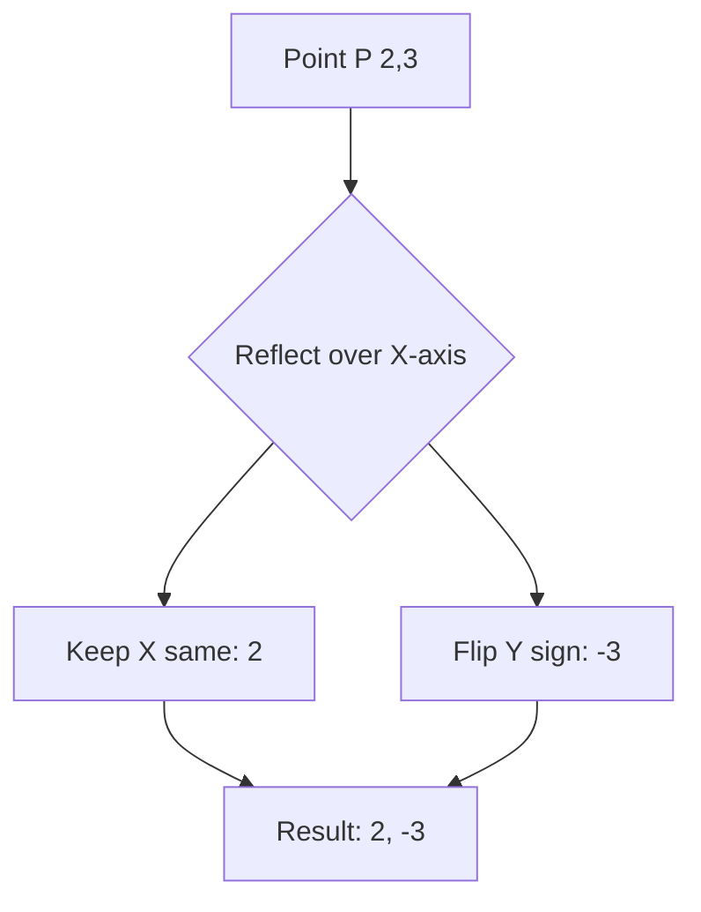

import Callout from '@/components/Callout.astro'

## Problem 1: Alphabet Symmetry

**Question:** Which capital letters of the English alphabet have:
1.  Reflection symmetry (vertical)?
2.  Reflection symmetry (horizontal)?
3.  No reflection symmetry?

**Solution:**
1.  **Vertical Line:** A, H, I, M, O, T, U, V, W, X, Y.
2.  **Horizontal Line:** B, C, D, E, H, I, K, O, X.
3.  **No Line:** F, G, J, L, N, P, Q, R, S, Z.

<Callout variant="tip">
Notice that **H, I, O, X** have both vertical and horizontal lines of symmetry!
</Callout>

## Problem 2: Rotational Calculation

**Question:** A figure has an angle of symmetry of $40^{\circ}$.
1.  What is the order of rotational symmetry?
2.  List all the angles of rotation.

**Solution:**
1.  **Order:** $\frac{360^{\circ}}{40^{\circ}} = 9$.
2.  **Angles:** Just keep adding $40^{\circ}$ until you reach $360^{\circ}$.
    $$40^{\circ}, 80^{\circ}, 120^{\circ}, 160^{\circ}, 200^{\circ}, 240^{\circ}, 280^{\circ}, 320^{\circ}, 360^{\circ}$$

## Problem 3: The Mirror Game

**Question:** An object is placed at point $(2, 3)$ on a grid. A mirror is placed on the x-axis (the horizontal line $y=0$). Where will the image appear?

**Solution:**
When reflecting over a horizontal line:
*   The x-coordinate stays the same.
*   The distance from the mirror stays the same, but on the opposite side.
*   Point is 3 units *above* the axis. Image will be 3 units *below*.
*   **Image Coordinates:** $(2, -3)$.

