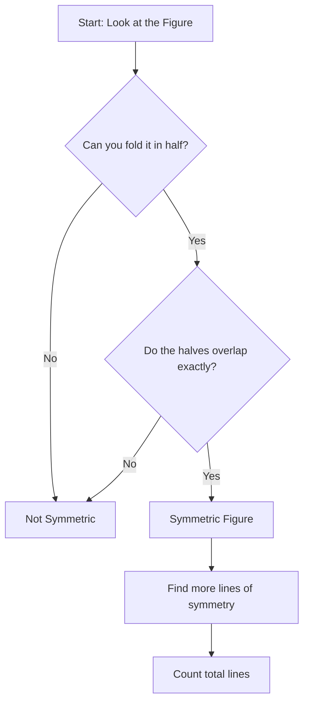

import Callout from '@/components/Callout.astro'

## What is a Line of Symmetry?

Imagine you have a picture of a butterfly. If you fold the picture exactly in the middle, the left side fits perfectly over the right side. The line along which you fold the paper is called the **Line of Symmetry** (or Axis of Symmetry).

<Callout variant="tip">
**Definition:** A line that cuts a figure into two parts that exactly overlap (coincide) when folded along that line is called a **Line of Symmetry**.
</Callout>

This is also known as **Reflection Symmetry** because one half acts like a mirror reflection of the other half.

### Figures with One Line of Symmetry
Some shapes have only one way to be folded to overlap perfectly. An isosceles triangle (with only two equal sides) is a good example.

    <svg width="200" height="200" viewBox="0 0 200 200">
        {/* Isosceles Triangle */}
        <polygon points="100,20 40,150 160,150" fill="none" stroke="currentColor" stroke-width="2"/>
        {/* Line of Symmetry */}
        <line x1="100" y1="10" x2="100" y2="160" stroke="currentColor" stroke-dasharray="5,5" stroke-width="2"/>
        <text x="110" y="30" fill="currentColor" font-size="12">Fold here</text>
    </svg>

### Figures with Multiple Lines of Symmetry
Some figures are very regular and can be folded in many ways.

1.  **Rectangle:** Has **2** lines of symmetry (vertical and horizontal). *Note: The diagonal is NOT a line of symmetry for a non-square rectangle.*
2.  **Square:** Has **4** lines of symmetry (vertical, horizontal, and two diagonals).
3.  **Equilateral Triangle:** Has **3** lines of symmetry.

    <svg width="400" height="150" viewBox="0 0 400 150">
        {/* Rectangle */}
        <g transform="translate(50, 25)">
            <rect x="0" y="20" width="80" height="60" fill="none" stroke="currentColor" stroke-width="2"/>
            <line x1="40" y1="10" x2="40" y2="90" stroke="currentColor" stroke-dasharray="4,4"/>
            <line x1="-10" y1="50" x2="90" y2="50" stroke="currentColor" stroke-dasharray="4,4"/>
            <text x="20" y="110" fill="currentColor" font-size="12">Rectangle (2)</text>
        </g>

        {/* Square */}
        <g transform="translate(200, 25)">
            <rect x="0" y="20" width="60" height="60" fill="none" stroke="currentColor" stroke-width="2"/>
            <line x1="30" y1="10" x2="30" y2="90" stroke="currentColor" stroke-dasharray="4,4"/>
            <line x1="-10" y1="50" x2="70" y2="50" stroke="currentColor" stroke-dasharray="4,4"/>
            <line x1="-5" y1="15" x2="65" y2="85" stroke="currentColor" stroke-dasharray="4,4"/>
            <line x1="65" y1="15" x2="-5" y2="85" stroke="currentColor" stroke-dasharray="4,4"/>
            <text x="10" y="110" fill="currentColor" font-size="12">Square (4)</text>
        </g>
    </svg>

## Reflection Symmetry
When we look into a mirror, we see a reflection. If an object is placed before a mirror, the image formed is symmetrical to the object with respect to the mirror line.

*   Left becomes Right.
*   Right becomes Left.

This property is used in paper cutting. If you fold a paper and cut a shape, unfolding it reveals a symmetric pattern where the fold line is the line of symmetry.

## Logic Flow: Identifying Symmetry

