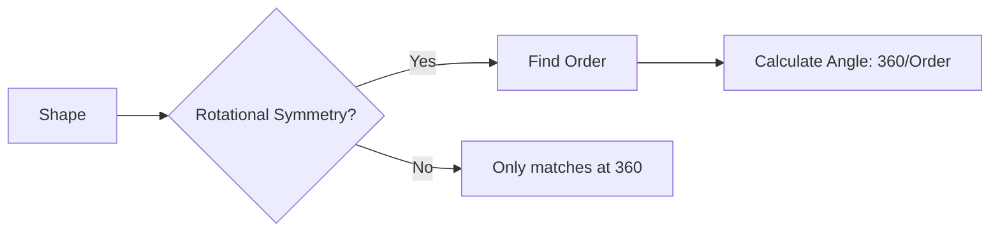

import Callout from '@/components/Callout.astro'

## What is Rotational Symmetry?

Some figures don't have a line of symmetry (you can't fold them), but they still look "balanced". This usually means they have **Rotational Symmetry**.

If you rotate a figure around a fixed point (the **Centre of Rotation**), and it fits exactly onto itself *before* you complete a full turn ($360^{\circ}$), the figure has rotational symmetry.

    <svg width="200" height="200" viewBox="0 0 200 200">
        <circle cx="100" cy="100" r="2" fill="red" />
        <path d="M100,100 L100,20 L130,50 L100,100" fill="#ADD8E6" stroke="currentColor" />
        <path d="M100,100 L180,100 L150,130 L100,100" fill="#ADD8E6" stroke="currentColor" />
        <path d="M100,100 L100,180 L70,150 L100,100" fill="#ADD8E6" stroke="currentColor" />
        <path d="M100,100 L20,100 L50,70 L100,100" fill="#ADD8E6" stroke="currentColor" />
        <circle cx="100" cy="100" r="5" fill="red" />
        <text x="110" y="110" fill="currentColor" font-size="10">Centre</text>
    </svg>

### Key Terms

1.  **Centre of Rotation:** The fixed point about which the object turns.
2.  **Angle of Rotation (or Angle of Symmetry):** The smallest angle you need to turn the shape for it to look the same.
3.  **Order of Symmetry:** The number of times the shape looks like its original self in one full turn ($360^{\circ}$).

### Formula
$$
\text{Smallest Angle of Symmetry} = \frac{360^{\circ}}{\text{Order of Symmetry}}
$$

### Examples

#### 1. The Square
A square has rotational symmetry.
*   Rotate $90^{\circ}$: Looks same.
*   Rotate $180^{\circ}$: Looks same.
*   Rotate $270^{\circ}$: Looks same.
*   Rotate $360^{\circ}$: Back to start.
*   **Order:** 4
*   **Angle:** $90^{\circ}$

#### 2. Equilateral Triangle
*   Rotate $120^{\circ}$: Looks same.
*   Rotate $240^{\circ}$: Looks same.
*   Rotate $360^{\circ}$: Back to start.
*   **Order:** 3
*   **Angle:** $120^{\circ}$

#### 3. Regular Hexagon
*   **Order:** 6
*   **Angle:** $360^{\circ} \div 6 = 60^{\circ}$

#### 4. The Circle
A circle is special. You can rotate it by **any** angle, and it matches. It has an infinite order of rotational symmetry.

<Callout variant="tip">
**Note:** Every object looks the same after a $360^{\circ}$ rotation. If an object *only* looks the same after $360^{\circ}$, we usually say it does **not** have rotational symmetry.
</Callout>

### Figures with Both Reflection and Rotational Symmetry
Many regular shapes have both types of symmetry.
*   **Square:** 4 lines of symmetry, Order 4 rotational symmetry.
*   **Circle:** Infinite lines of symmetry, Infinite rotational symmetry.

However, some shapes like a **Parallelogram** (not a rhombus or rectangle) have rotational symmetry (Order 2) but **no** lines of symmetry.

