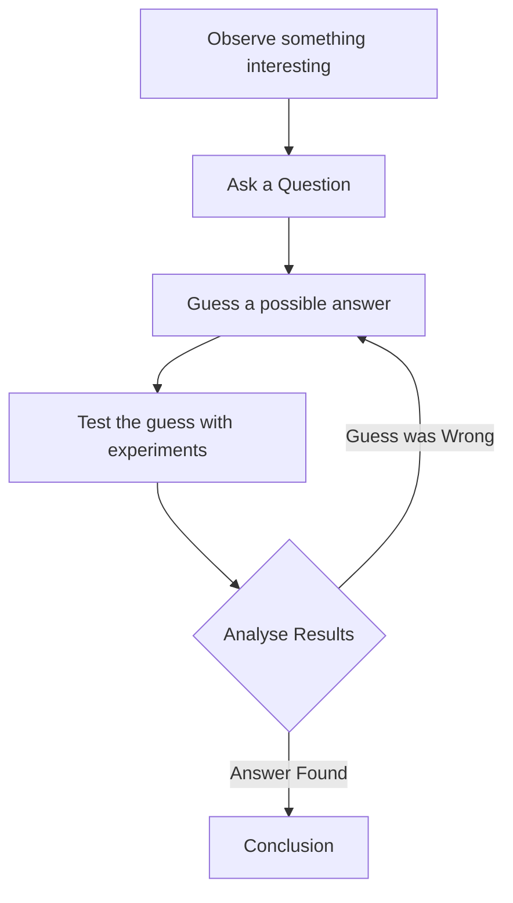
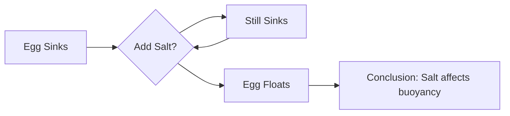

<<<FILE_START: index.mdx>>>
---
title: "The Wonderful World of Science"
description: "An introduction to Science, Curiosity, and the Scientific Method for Grade 6."
date: 2024-04-10
tags: ["science", "introduction", "grade-6", "curiosity"]
order: 1
draft: false
---

import Callout from '@/components/Callout.astro'

## Introduction

Welcome to the **Wonderful World of Science**! As human beings, we have always been curious about our surroundings. From the tiny grains of sand to the massive stars in the night sky, there is always something new to discover.

Science is not just a subject; it is a way of **thinking**, **observing**, and **doing** things to understand the world we live in. It is like a big adventure where we uncover the secrets of the universe.

<Callout variant="tip">
**Definition:** Science is a way of thinking, observing, and doing things to understand the world we live in and to uncover the secrets of the universe.
</Callout>

### Key Concepts in this Chapter

1.  **Curiosity:** The desire to ask questions ("Why?", "How?") is the starting point of science.
2.  **The Scientific Method:** A step-by-step process used to solve problems and find answers.
3.  **Joyful Exploration:** Science is like an unending jigsaw puzzle where every discovery adds a new piece.

### Quick Reference: The Scientific Method

When scientists (or you!) try to solve a problem, they usually follow these steps:

1.  **Observe:** Notice something interesting or confusing.
2.  **Question:** Ask a specific question about it.
3.  **Guess:** Propose a possible answer (Hypothesis).
4.  **Test:** Perform an experiment or check facts.
5.  **Analyse:** See if the results match your guess.

---

### Topics Covered

*   [What is Science?](./topics/01-what-is-science)
*   [The Scientific Method](./topics/02-scientific-method)
*   [What Will We Explore?](./topics/03-areas-of-exploration)

<<<FILE_END>>>

<<<FILE_START: topics/01-what-is-science.mdx>>>
---
title: "What is Science?"
description: "Defining science through curiosity, observation, and the jigsaw puzzle analogy."
date: 2024-04-10
tags: ["definition", "curiosity", "puzzle"]
order: 1
draft: false
---

import Callout from '@/components/Callout.astro'

## The Spirit of Inquiry

Science begins with **Curiosity**. Have you ever looked at the night sky and wondered why stars shine? or watched a flower bloom and wondered how it knows when to open? These questions are the foundation of science.

Science helps us unravel mysteries, whether they are in the depths of the ocean or the vastness of outer space.

### Science as a Jigsaw Puzzle

Imagine Science as a giant, unending **jigsaw puzzle**.

*   Every new discovery we make adds another piece to that puzzle.
*   **No Limit:** There is no limit to what we can discover. Every new piece of knowledge leads to more questions.
*   **Changing Knowledge:** Sometimes, we find that a piece of the puzzle has been put in the wrong place and needs to be moved. This means new discoveries can change our understanding of the world.

<Callout variant="tip">
**Insight:** Groundbreaking discoveries often come from unexpected places—from what is cooking in the kitchen to what is happening on the playground.
</Callout>

### The "Whys" Person

To be good at science, you don't just need to memorize facts. You need to be a "Whys" person. You must constantly ask:
*   *Why is this happening?*
*   *How does this work?*

  <svg width="200" height="200" viewBox="0 0 200 200" xmlns="http://www.w3.org/2000/svg">
    <!-- Magnifying Glass Handle -->
    <rect x="85" y="120" width="30" height="70" rx="5" transform="rotate(-45 100 155)" fill="currentColor" opacity="0.8" />
    <!-- Glass Rim -->
    <circle cx="85" cy="85" r="50" stroke="currentColor" stroke-width="10" fill="none" />
    <!-- Glass Lens -->
    <circle cx="85" cy="85" r="42" fill="currentColor" opacity="0.1" />
    <!-- Question Mark inside Lens -->
    <text x="85" y="105" font-family="Arial, sans-serif" font-size="60" font-weight="bold" fill="currentColor" text-anchor="middle">?</text>
  </svg>

Science is rarely done alone. Scientists work in teams to solve these puzzles together!

<<<FILE_END>>>

<<<FILE_START: topics/02-scientific-method.mdx>>>
---
title: "The Scientific Method"
description: "A step-by-step guide to thinking like a scientist, featuring the Pen Example."
date: 2024-04-10
tags: ["scientific-method", "experiment", "process"]
order: 2
draft: false
---

import Callout from '@/components/Callout.astro'

## Thinking Like a Scientist

Science is not just about doing experiments in a lab; it is a **method** of solving problems. We call this the **Scientific Method**. We use it in daily life without even realizing it.

### The Pen Example

Let's look at a simple example from the textbook:

1.  **Observation:** You are writing, and suddenly your pen stops writing.
2.  **Question:** *Why did my pen stop writing?*
3.  **Guess (Hypothesis):** You guess, "Perhaps the ink is finished."
4.  **Test:** You open the pen and check the refill.
    *   *Result A:* If it is empty, your guess was correct.
    *   *Result B:* If it is full, your guess was wrong.
5.  **New Guess:** If the ink was full, you make a new guess: "Maybe the ink dried up."
6.  **New Test:** You try scribbling on rough paper to see if it starts working.

This cycle of **Guessing** and **Testing** is exactly how science works!

### The Steps of the Scientific Method

Here is the formal flow of how scientists work:

<Callout variant="tip">
**Key Steps:**
1.  **Observe:** Notice something.
2.  **Question:** Wonder "Why?".
3.  **Guess:** Propose a reason.
4.  **Test:** Check if you are right.
5.  **Analyse:** Understand the result.
</Callout>

### Scientists in Daily Life

You don't need a white coat to be a scientist.
*   **The Cook:** Wonders why the *dal* spilled out of the cooker. (Was there too much water?)
*   **The Mechanic:** Tries to find why a bicycle tyre is flat. (Where is the leak?)
*   **The Electrician:** Checks why a bulb isn't working. (Is it the bulb or the switch?)

When we ask questions and find answers using logic, we are all scientists.

<<<FILE_END>>>

<<<FILE_START: topics/03-exploring-our-world.mdx>>>
---
title: "What Will We Explore?"
description: "An overview of the themes covered in Grade 6 Science."
date: 2024-04-10
tags: ["syllabus", "nature", "materials"]
order: 3
draft: false
---

import Callout from '@/components/Callout.astro'

## Areas of Exploration

In this book, we will limit our questions mostly to our home, **Planet Earth**, though we can always look up at the stars. As we discover more, we will realize that all these ideas are connected.

### 1. Life on Earth
Earth is the only planet we know that supports life. We will explore:
*   The amazing variety of plants and animals.
*   How seeds grow into plants.
*   How caterpillars transform into butterflies.

### 2. Food
We need food to grow and survive. India has a diverse cuisine. We will explore:
*   What are tasty dishes made of?
*   How do we find out their ingredients?

### 3. Water
Water is essential for survival.
*   Why and how does it rain?
*   Why does water become ice (solid) or steam (gas)?

### 4. Materials Around Us
Look at your pencil box. You have a metal key, a plastic ruler, a rubber eraser.
*   What are they made of?
*   How do we separate different materials?

<Callout variant="warning">
**Note:** We will encounter interesting ideas and do thought-provoking experiments. Remember, the world is full of things we do not know, waiting to be explored!
</Callout>

<<<FILE_END>>>

<<<FILE_START: solutions/activity-1.1.mdx>>>
---
title: "Activity 1.1: Solving a Problem"
description: "Applying the scientific method to a personal experience."
date: 2024-04-10
tags: ["activity", "solutions", "critical-thinking"]
order: 1
draft: false
---

import Callout from '@/components/Callout.astro'

## Activity 1.1

**Question:**
Write about a problem similar to the "Pen Example" that you tried to solve. What steps did you take?

### Solution

*Note: This is a sample response. You can write about your own experience.*

**Problem:** The TV remote control stopped working while I was changing channels.

**Steps followed:**

1.  **Observation:** I pressed the buttons, but the TV did not respond.
2.  **Question:** Why is the remote not working?
3.  **Guess 1:** Maybe the batteries are dead.
4.  **Test 1:** I took out the old batteries and put in new ones.
5.  **Result:** It still did not work. My first guess was wrong.
6.  **Guess 2:** Maybe the batteries are inserted in the wrong direction.
7.  **Test 2:** I opened the cover and checked the `+` and `-` signs. I realized one battery was upside down. I corrected it.
8.  **Conclusion:** The remote started working! The problem was the orientation of the batteries.

<Callout variant="tip">
**Analysis:** By testing one guess at a time, we found the real cause of the problem without buying a new remote unnecessarily.
</Callout>

<<<FILE_END>>>

<<<FILE_START: solutions/activity-1.2.mdx>>>
---
title: "Activity 1.2: Science in Daily Life"
description: "Identifying the scientific method in everyday situations."
date: 2024-04-10
tags: ["activity", "solutions", "observation"]
order: 2
draft: false
---

import Callout from '@/components/Callout.astro'

## Activity 1.2

**Question:**
Describe a daily life situation where you think someone was following a scientific method.

### Solution

**Situation: The Bicycle Mechanic**

**Context:** I went to a cycle repair shop because my bicycle tyre was flat.

**Scientific Method Applied:**

1.  **Observation:** The mechanic saw the tyre was flat.
2.  **Question:** Where is the hole (puncture) in the tube?
3.  **Guess:** There is a leak somewhere, but it's too small to see with eyes.
4.  **Test:** The mechanic took the tube out, filled it with air, and immersed it in a tub of water.
5.  **Analysis:** He looked for air bubbles rising in the water.
6.  **Conclusion:** The spot where bubbles came out was the puncture point. He then fixed it at that exact spot.

<Callout variant="tip">
This method of testing (using water to find air leaks) is a classic scientific experiment used by mechanics every day!
</Callout>

<<<FILE_END>>>

<<<FILE_START: solutions/activity-1.3.mdx>>>
---
title: "Activity 1.3: Being Curious"
description: "Formulating 'Why' questions and planning investigations."
date: 2024-04-10
tags: ["activity", "solutions", "inquiry"]
order: 3
draft: false
---

import Callout from '@/components/Callout.astro'

## Activity 1.3

**Question:**
1. If you have to ask "Why?" about something, what would you ask about?
2. Try to write down how you would attempt to find an answer to your question.

### Solution

*Note: There are infinite correct answers. Here is one example.*

**My Question:**
*Why do the leaves of some plants turn yellow?*

**My Plan to Find the Answer:**

1.  **Observation:** I have two identical potted plants. One is green, the other is turning yellow.
2.  **Guess (Hypothesis):** Maybe the yellow one is not getting enough water.
3.  **Experiment:**
    *   I will water the yellow plant regularly for 3 days.
    *   I will observe if it turns green again.
4.  **Alternative Guess:** If water doesn't help, maybe it needs sunlight.
    *   I will move the plant to a sunnier spot and observe for another week.
5.  **Research:** If neither works, I will ask a gardener or look up "Causes of yellow leaves" in a library book or internet.

<Callout variant="tip">
**Collaboration:** The book suggests that if you cannot find the answer yourself, ask your friends! Science is often done in teams.
</Callout>

<<<FILE_END>>>

<<<FILE_START: practice/solved-examples.mdx>>>
---
title: "Solved Examples: The Scientific Method"
description: "Additional scenarios to practice thinking like a scientist."
date: 2024-04-10
tags: ["practice", "examples", "application"]
order: 1
draft: false
---

import Callout from '@/components/Callout.astro'

## Scenario 1: The Dark Room

**Situation:** You walk into your room at night and flip the switch, but the light does not turn on. Apply the scientific method.

**Step-by-Step Solution:**

1.  **Observe:** The light did not turn on when the switch was flipped.
2.  **Question:** Why is the light not working?
3.  **Hypothesis 1:** The light bulb has fused (burnt out).
4.  **Test 1:** Replace the bulb with a new one that you know works.
    *   *Result:* The light turns on.
5.  **Conclusion:** The old bulb was fused.

*What if Test 1 failed?*
*   **Hypothesis 2:** There is a power cut in the house.
*   **Test 2:** Check if fans or lights in other rooms are working.

## Scenario 2: The Floating Egg

**Situation:** You notice that an egg sinks in tap water, but you heard it floats in salty water. How do you verify this?

**Step-by-Step Solution:**

1.  **Observe:** An egg sinks in a glass of normal tap water.
2.  **Question:** Will adding salt make the egg float?
3.  **Hypothesis:** Salt increases the density of water, which might help the egg float.
4.  **Experiment:**
    *   Take the glass with the sunken egg.
    *   Add 1 spoon of salt and stir carefully. Observe.
    *   Add 2 spoons, then 3 spoons.
5.  **Analysis:** After adding 3-4 spoons of salt, the egg rises to the surface.
6.  **Conclusion:** Salt water can support the egg, making it float. The hypothesis is correct.

<<<FILE_END>>>
