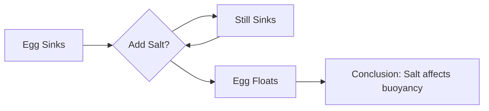

import Callout from '@/components/Callout.astro'

## Scenario 1: The Dark Room

**Situation:** You walk into your room at night and flip the switch, but the light does not turn on. Apply the scientific method.

**Step-by-Step Solution:**

1.  **Observe:** The light did not turn on when the switch was flipped.
2.  **Question:** Why is the light not working?
3.  **Hypothesis 1:** The light bulb has fused (burnt out).
4.  **Test 1:** Replace the bulb with a new one that you know works.
    *   *Result:* The light turns on.
5.  **Conclusion:** The old bulb was fused.

*What if Test 1 failed?*
*   **Hypothesis 2:** There is a power cut in the house.
*   **Test 2:** Check if fans or lights in other rooms are working.

## Scenario 2: The Floating Egg

**Situation:** You notice that an egg sinks in tap water, but you heard it floats in salty water. How do you verify this?

**Step-by-Step Solution:**

1.  **Observe:** An egg sinks in a glass of normal tap water.
2.  **Question:** Will adding salt make the egg float?
3.  **Hypothesis:** Salt increases the density of water, which might help the egg float.
4.  **Experiment:**
    *   Take the glass with the sunken egg.
    *   Add 1 spoon of salt and stir carefully. Observe.
    *   Add 2 spoons, then 3 spoons.
5.  **Analysis:** After adding 3-4 spoons of salt, the egg rises to the surface.
6.  **Conclusion:** Salt water can support the egg, making it float. The hypothesis is correct.

