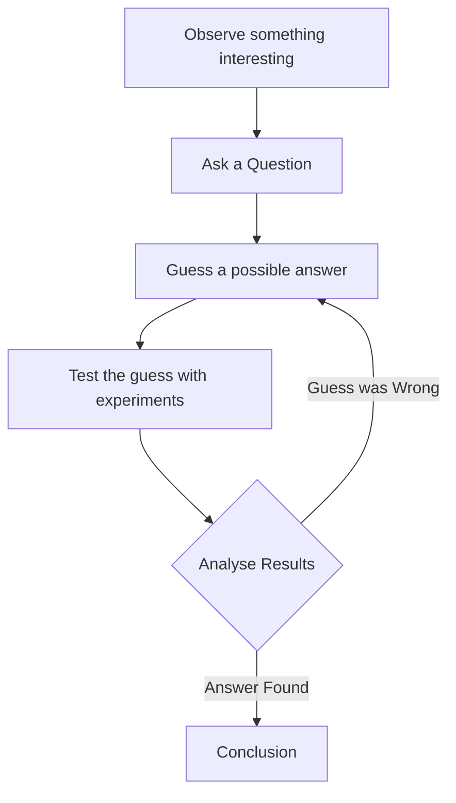

import Callout from '@/components/Callout.astro'

## Thinking Like a Scientist

Science is not just about doing experiments in a lab; it is a **method** of solving problems. We call this the **Scientific Method**. We use it in daily life without even realizing it.

### The Pen Example

Let's look at a simple example from the textbook:

1.  **Observation:** You are writing, and suddenly your pen stops writing.
2.  **Question:** *Why did my pen stop writing?*
3.  **Guess (Hypothesis):** You guess, "Perhaps the ink is finished."
4.  **Test:** You open the pen and check the refill.
    *   *Result A:* If it is empty, your guess was correct.
    *   *Result B:* If it is full, your guess was wrong.
5.  **New Guess:** If the ink was full, you make a new guess: "Maybe the ink dried up."
6.  **New Test:** You try scribbling on rough paper to see if it starts working.

This cycle of **Guessing** and **Testing** is exactly how science works!

### The Steps of the Scientific Method

Here is the formal flow of how scientists work:

<Callout variant="tip">
**Key Steps:**
1.  **Observe:** Notice something.
2.  **Question:** Wonder "Why?".
3.  **Guess:** Propose a reason.
4.  **Test:** Check if you are right.
5.  **Analyse:** Understand the result.
</Callout>

### Scientists in Daily Life

You don't need a white coat to be a scientist.
*   **The Cook:** Wonders why the *dal* spilled out of the cooker. (Was there too much water?)
*   **The Mechanic:** Tries to find why a bicycle tyre is flat. (Where is the leak?)
*   **The Electrician:** Checks why a bulb isn't working. (Is it the bulb or the switch?)

When we ask questions and find answers using logic, we are all scientists.
