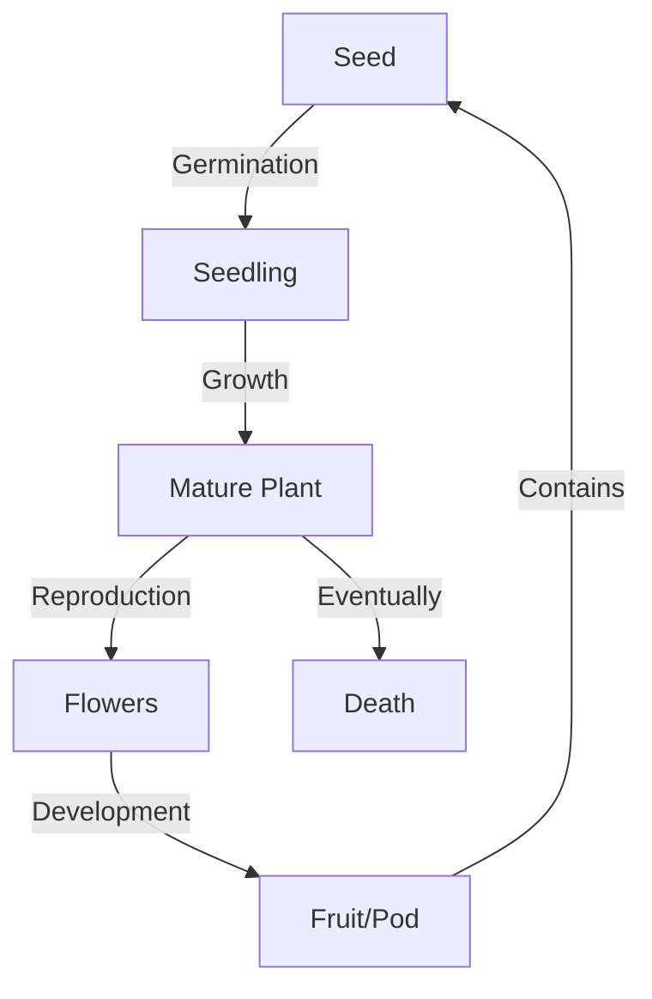

import Callout from '@/components/Callout.astro'

## The Cycle of Life
All living things grow, reproduce, and die. The sequence of events from birth to the production of the next generation is called a **Life Cycle**.

## Stages of a Bean Plant
Observations from Activity 10.4 reveal the following stages:

1.  **Seed:** The dormant starting point.
2.  **Germination:** With water and air, the seed sprouts.
3.  **Seedling:** Roots grow down, shoots grow up, leaves appear.
4.  **Flowering:** The plant matures and produces flowers.
5.  **Fruit/Pod Formation:** Flowers dry up and develop into pods (fruits).
6.  **Seed Dispersal:** The pod contains new seeds.
7.  **Death:** The old plant dies, but the seeds continue the cycle.

### Life Cycle Diagram

<Callout variant="tip">
**Concept Check:**
Even though the individual plant dies, the *species* survives because it produced seeds before dying.
</Callout>
